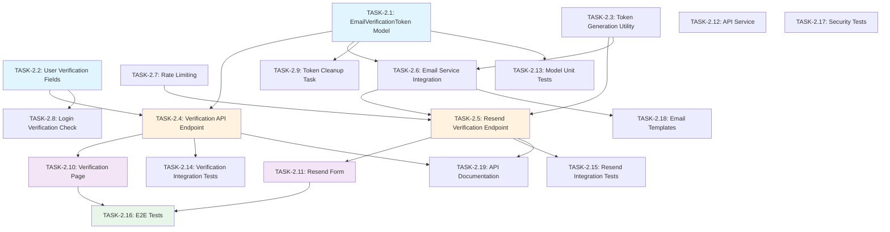

# US-2: Email Verification

**Priority**: P0
**Feature**: Authentication & Authorization
**Status**: To Do

## Overview

This User Story implements the email verification flow that activates a user's account after registration. Users receive a verification email containing a unique, time-limited token (24-hour expiry). Clicking the verification link confirms the user's email ownership and activates their account, allowing them to log in.

### Context

Email verification is a critical security feature ensuring that users own the email addresses they register with and preventing account takeovers via incorrect email addresses. It's a foundational requirement for the authentication system.

### Decomposition Approach

- **Total tasks**: 19
- **Backend**: 9 tasks (database, API, email, security)
- **Frontend**: 3 tasks (pages and components)
- **Testing**: 5 tasks (unit, integration, E2E, security)
- **Infrastructure**: 2 tasks (templates, documentation)

---

## Task Summary

| ID | Title | Type | Specialty | Effort | Dependencies | Status |
|----|-------|------|-----------|--------|--------------|--------|
| TASK-2.1 | Create EmailVerificationToken Model | Backend | Database | 3h | None | ⬜ |
| TASK-2.2 | Add Email Verification Fields to User Model | Backend | Database | 2h | None | ⬜ |
| TASK-2.3 | Implement Token Generation Utility | Backend | Security | 2h | None | ⬜ |
| TASK-2.4 | Create Email Verification API Endpoint | Backend | API | 4h | TASK-2.1, TASK-2.2 | ⬜ |
| TASK-2.5 | Create Resend Verification Email API Endpoint | Backend | API | 4h | TASK-2.1, TASK-2.3, TASK-2.6, TASK-2.7 | ⬜ |
| TASK-2.6 | Implement Email Service Integration | Backend | Email | 4h | TASK-2.1, TASK-2.3 | ⬜ |
| TASK-2.7 | Implement Rate Limiting for Resend Endpoint | Backend | Security | 3h | Infrastructure: Redis | ⬜ |
| TASK-2.8 | Add Verification Check to Login Endpoint | Backend | API | 2h | US-3, TASK-2.2 | ⬜ |
| TASK-2.9 | Create Periodic Token Cleanup Task | Backend | Config | 3h | TASK-2.1, Celery Beat | ⬜ |
| TASK-2.10 | Create Email Verification Page Component | Frontend | Page | 5h | TASK-2.4 | ⬜ |
| TASK-2.11 | Create Resend Verification Email Form Component | Frontend | Component | 4h | TASK-2.5 | ⬜ |
| TASK-2.12 | Create API Service for Verification Endpoints | Frontend | API | 2h | None | ⬜ |
| TASK-2.13 | Unit Tests for EmailVerificationToken Model | Testing | Unit | 3h | TASK-2.1 | ⬜ |
| TASK-2.14 | Integration Tests for Verification Endpoint | Testing | Integration | 4h | TASK-2.4, TASK-2.1, TASK-2.2 | ⬜ |
| TASK-2.15 | Integration Tests for Resend Verification Endpoint | Testing | Integration | 4h | TASK-2.5, TASK-2.7, TASK-2.6 | ⬜ |
| TASK-2.16 | End-to-End Test for Complete Verification Flow | Testing | E2E | 5h | US-1, TASK-2.4, TASK-2.5, TASK-2.10, TASK-2.11 | ⬜ |
| TASK-2.17 | Security Tests for Verification System | Testing | Security | 3h | TASK-2.3, TASK-2.4, TASK-2.5, TASK-2.7 | ⬜ |
| TASK-2.18 | Configure Email Templates and Branding | Infrastructure | Documentation | 3h | TASK-2.6 | ⬜ |
| TASK-2.19 | API Documentation for Verification Endpoints | Infrastructure | Documentation | 2h | TASK-2.4, TASK-2.5 | ⬜ |

---

## Task Details

### 🔧 Backend Tasks

#### TASK-2.1: Create EmailVerificationToken Model

**Type**: Backend - Database
**Priority**: P1
**Estimated Effort**: 3 hours

##### Description

Create the EmailVerificationToken model to store verification tokens with expiry logic. This model supports single-use tokens with 24-hour expiry, preventing reuse and token abuse.

##### Files Impacted
- `backend/accounts/models.py` (modification - add EmailVerificationToken model)
- `backend/accounts/migrations/000X_create_email_verification_token.py` (new - migration file)

##### Acceptance Criteria
- [ ] EmailVerificationToken model created with fields: id (UUID), user_id (FK), token (unique varchar 255), created_at, expires_at, used_at, is_used
- [ ] Token uniqueness enforced at database level
- [ ] Indexes created on token, user_id+created_at, and expires_at fields
- [ ] Foreign key relationship to User model established
- [ ] Model includes expiry check method (is_expired)
- [ ] Migration generated and applied successfully

##### Dependencies
- None (extends existing User model from US-1)

##### Implementation Notes

**Model Structure**:
```python
class EmailVerificationToken(models.Model):
    id = models.UUIDField(primary_key=True, default=uuid.uuid4, editable=False)
    user = models.ForeignKey(User, on_delete=models.CASCADE, related_name='verification_tokens')
    token = models.CharField(max_length=255, unique=True, db_index=True)
    created_at = models.DateTimeField(auto_now_add=True)
    expires_at = models.DateTimeField()
    used_at = models.DateTimeField(null=True, blank=True)
    is_used = models.BooleanField(default=False)

    class Meta:
        indexes = [
            models.Index(fields=['user', 'created_at']),
            models.Index(fields=['expires_at']),
        ]

    def is_expired(self):
        return timezone.now() > self.expires_at
```

**Expiry Logic**: Set `expires_at = created_at + timedelta(hours=24)` on creation.

---

#### TASK-2.2: Add Email Verification Fields to User Model

**Type**: Backend - Database
**Priority**: P1
**Estimated Effort**: 2 hours

##### Description

Extend the User model with email verification status fields to track whether a user has verified their email and when verification occurred.

##### Files Impacted
- `backend/accounts/models.py` (modification - add is_email_verified, email_verified_at fields)
- `backend/accounts/migrations/000X_add_email_verification_fields.py` (new - migration file)

##### Acceptance Criteria
- [ ] is_email_verified boolean field added (default False)
- [ ] email_verified_at timestamp field added (nullable)
- [ ] Migration generated and applied successfully
- [ ] Existing users defaulted to is_email_verified=False

##### Dependencies
- None (extends existing User model)

##### Implementation Notes

**Field Additions**:
```python
class User(AbstractUser):
    # ... existing fields ...
    is_email_verified = models.BooleanField(default=False)
    email_verified_at = models.DateTimeField(null=True, blank=True)
```

**Migration**: Run `python manage.py makemigrations` and `python manage.py migrate` after adding fields.

---

#### TASK-2.3: Implement Token Generation Utility

**Type**: Backend - Security
**Priority**: P1
**Estimated Effort**: 2 hours

##### Description

Create a secure token generation utility using Python's secrets module to generate cryptographically random, URL-safe verification tokens.

##### Files Impacted
- `backend/accounts/utils.py` (new or modification - add generate_verification_token function)
- `backend/accounts/tests/test_utils.py` (new - unit tests for token generation)

##### Acceptance Criteria
- [ ] Function generates URL-safe tokens using secrets.token_urlsafe(32)
- [ ] Tokens are at least 32 characters long
- [ ] Token uniqueness verified (probability of collision negligible)
- [ ] Unit tests verify token format and randomness
- [ ] Function handles edge cases gracefully

##### Dependencies
- None

##### Implementation Notes

**Token Generation Function**:
```python
import secrets

def generate_verification_token():
    """
    Generate a cryptographically random, URL-safe verification token.
    Returns a 43-character string (32 bytes base64url encoded).
    """
    return secrets.token_urlsafe(32)
```

**Security Considerations**:
- `secrets.token_urlsafe()` uses cryptographically strong random generation
- 32 bytes provides 256 bits of entropy (practically unguessable)
- URL-safe format works in email links without encoding issues

---

#### TASK-2.4: Create Email Verification API Endpoint

**Type**: Backend - API
**Priority**: P1
**Estimated Effort**: 4 hours

##### Description

Implement the GET /api/auth/verify-email/ endpoint that accepts a token query parameter, validates the token, activates the user account, and marks the token as used.

##### Files Impacted
- `backend/accounts/views.py` or `backend/accounts/viewsets.py` (modification - add VerifyEmailView)
- `backend/accounts/serializers.py` (modification - add VerifyEmailSerializer)
- `backend/accounts/urls.py` (modification - add verify-email route)

##### Acceptance Criteria
- [ ] GET /api/auth/verify-email/?token=<token> endpoint created
- [ ] Token validation logic implemented (exists, not expired, not used)
- [ ] User account activated (is_active=True, is_email_verified=True, email_verified_at set)
- [ ] Token marked as used (is_used=True, used_at set to current timestamp)
- [ ] Returns 200 OK with success message on valid token
- [ ] Returns 400 Bad Request for invalid/used tokens
- [ ] Returns 410 Gone for expired tokens
- [ ] Response includes resend_url for failed verifications
- [ ] Database transaction ensures atomicity

##### Dependencies
- TASK-2.1 (EmailVerificationToken model must exist)
- TASK-2.2 (User verification fields must exist)

##### Implementation Notes

**View Implementation**:
```python
from django.db import transaction
from rest_framework import status
from rest_framework.views import APIView
from rest_framework.response import Response

class VerifyEmailView(APIView):
    def get(self, request):
        token = request.query_params.get('token')

        try:
            verification_token = EmailVerificationToken.objects.select_related('user').get(token=token)
        except EmailVerificationToken.DoesNotExist:
            return Response({
                'error': 'invalid_token',
                'message': 'Invalid verification link. Please request a new email.',
                'resend_url': '/api/auth/resend-verification/'
            }, status=status.HTTP_400_BAD_REQUEST)

        if verification_token.is_used:
            return Response({
                'error': 'token_already_used',
                'message': 'Verification link already used. Please request a new email.',
                'resend_url': '/api/auth/resend-verification/'
            }, status=status.HTTP_400_BAD_REQUEST)

        if verification_token.is_expired():
            return Response({
                'error': 'token_expired',
                'message': 'Verification link has expired. Please request a new one.',
                'resend_url': '/api/auth/resend-verification/'
            }, status=status.HTTP_410_GONE)

        # Activate user and mark token as used
        with transaction.atomic():
            user = verification_token.user
            user.is_active = True
            user.is_email_verified = True
            user.email_verified_at = timezone.now()
            user.save()

            verification_token.is_used = True
            verification_token.used_at = timezone.now()
            verification_token.save()

        return Response({
            'message': 'Email verified successfully. You can now log in.',
            'is_active': True,
            'is_email_verified': True
        }, status=status.HTTP_200_OK)
```

**URL Configuration**:
```python
path('auth/verify-email/', VerifyEmailView.as_view(), name='verify-email'),
```

---

#### TASK-2.5: Create Resend Verification Email API Endpoint

**Type**: Backend - API
**Priority**: P1
**Estimated Effort**: 4 hours

##### Description

Implement the POST /api/auth/resend-verification/ endpoint that accepts an email address, generates a new verification token, enforces rate limiting (max 3 per day), and sends a new verification email.

##### Files Impacted
- `backend/accounts/views.py` or `backend/accounts/viewsets.py` (modification - add ResendVerificationView)
- `backend/accounts/serializers.py` (modification - add ResendVerificationSerializer)
- `backend/accounts/urls.py` (modification - add resend-verification route)

##### Acceptance Criteria
- [ ] POST /api/auth/resend-verification/ endpoint created
- [ ] Accepts email in request body
- [ ] Finds user by email address
- [ ] Generates new verification token (calls TASK-2.3 utility)
- [ ] Enforces rate limit: max 3 resend attempts per email per 24 hours
- [ ] Returns 200 OK with "email sent" message (don't reveal if email exists)
- [ ] Returns 429 Too Many Requests if rate limit exceeded
- [ ] Includes Retry-After header with seconds until next retry allowed
- [ ] Returns next_retry_available_in_seconds in response
- [ ] Triggers email sending via email service (async)

##### Dependencies
- TASK-2.1 (EmailVerificationToken model)
- TASK-2.3 (Token generation utility)
- TASK-2.6 (Email service integration)
- TASK-2.7 (Rate limiting implementation)

##### Implementation Notes

**View Implementation** (pseudo-code):
```python
class ResendVerificationView(APIView):
    def post(self, request):
        email = request.data.get('email')

        # Check rate limit
        if not check_resend_rate_limit(email):
            retry_after = get_retry_after_seconds(email)
            return Response({
                'error': 'rate_limited',
                'message': f'Too many verification email requests. Please try again in {retry_after // 3600} hour(s).',
                'retry_after_seconds': retry_after
            }, status=status.HTTP_429_TOO_MANY_REQUESTS, headers={'Retry-After': str(retry_after)})

        # Find user (don't reveal if email doesn't exist)
        try:
            user = User.objects.get(email=email)
        except User.DoesNotExist:
            # Return generic success to prevent user enumeration
            return Response({
                'message': 'If an account exists, a verification email has been sent.',
                'next_retry_available_in_seconds': 3600
            }, status=status.HTTP_200_OK)

        # Generate new token
        token = generate_verification_token()
        verification_token = EmailVerificationToken.objects.create(
            user=user,
            token=token,
            expires_at=timezone.now() + timedelta(hours=24)
        )

        # Send email (async)
        send_verification_email(user, token)

        # Increment rate limit counter
        increment_resend_counter(email)

        return Response({
            'message': 'If an account exists, a verification email has been sent.',
            'next_retry_available_in_seconds': 3600
        }, status=status.HTTP_200_OK)
```

---

#### TASK-2.6: Implement Email Service Integration

**Type**: Backend - Email
**Priority**: P1
**Estimated Effort**: 4 hours

##### Description

Create email service integration that sends verification emails using Django's email backend with SMTP configuration. Include email template rendering and async email sending.

##### Files Impacted
- `backend/accounts/email.py` (new - email sending utilities)
- `backend/accounts/templates/emails/verification_email.html` (new - HTML email template)
- `backend/accounts/templates/emails/verification_email.txt` (new - plain text fallback)
- `backend/config/settings.py` (modification - SMTP configuration)

##### Acceptance Criteria
- [ ] send_verification_email function created
- [ ] HTML email template created with professional branding
- [ ] Plain text fallback template created
- [ ] Email contains clickable verification link with token
- [ ] Email includes expiry notice (24 hours)
- [ ] SMTP configuration set up in settings (EMAIL_HOST, EMAIL_PORT, etc.)
- [ ] Email sent asynchronously (via Celery or Django signals)
- [ ] Function handles email delivery failures gracefully
- [ ] Verification link format: https://app.example.com/verify-email?token=<token>

##### Dependencies
- TASK-2.1 (EmailVerificationToken model)
- TASK-2.3 (Token generation)

##### Implementation Notes

**Email Sending Function**:
```python
from django.core.mail import send_mail
from django.template.loader import render_to_string
from django.utils.html import strip_tags

def send_verification_email(user, token):
    """Send verification email to user with token link."""
    verification_url = f"https://app.example.com/verify-email?token={token}"

    context = {
        'user': user,
        'verification_url': verification_url,
        'expiry_hours': 24
    }

    html_message = render_to_string('emails/verification_email.html', context)
    plain_message = strip_tags(html_message)

    send_mail(
        subject='Verify your email for [Platform Name]',
        message=plain_message,
        from_email='noreply@example.com',
        recipient_list=[user.email],
        html_message=html_message,
        fail_silently=False
    )
```

**HTML Email Template** (`verification_email.html`):
```html
<!DOCTYPE html>
<html>
<head>
    <meta charset="UTF-8">
    <title>Verify Your Email</title>
</head>
<body style="font-family: Arial, sans-serif; max-width: 600px; margin: 0 auto;">
    <h1>Welcome to [Platform Name]!</h1>
    <p>Hi {{ user.first_name }},</p>
    <p>Thank you for registering! Please verify your email address to activate your account.</p>
    <p style="text-align: center;">
        <a href="{{ verification_url }}" style="background-color: #007bff; color: white; padding: 12px 24px; text-decoration: none; border-radius: 4px; display: inline-block;">Verify Email</a>
    </p>
    <p>Or copy and paste this link into your browser:</p>
    <p style="word-break: break-all;">{{ verification_url }}</p>
    <p><strong>This link expires in {{ expiry_hours }} hours.</strong></p>
    <p>If you didn't create an account, you can safely ignore this email.</p>
</body>
</html>
```

**SMTP Settings** (`settings.py`):
```python
EMAIL_BACKEND = 'django.core.mail.backends.smtp.EmailBackend'
EMAIL_HOST = os.getenv('EMAIL_HOST', 'smtp.gmail.com')
EMAIL_PORT = int(os.getenv('EMAIL_PORT', 587))
EMAIL_USE_TLS = True
EMAIL_HOST_USER = os.getenv('EMAIL_HOST_USER')
EMAIL_HOST_PASSWORD = os.getenv('EMAIL_HOST_PASSWORD')
DEFAULT_FROM_EMAIL = os.getenv('DEFAULT_FROM_EMAIL', 'noreply@example.com')
```

---

#### TASK-2.7: Implement Rate Limiting for Resend Endpoint

**Type**: Backend - Security
**Priority**: P1
**Estimated Effort**: 3 hours

##### Description

Implement Redis-backed rate limiting to enforce maximum 3 resend verification email requests per email address per 24-hour period.

##### Files Impacted
- `backend/accounts/rate_limiting.py` (new - rate limiting utilities)
- `backend/accounts/tests/test_rate_limiting.py` (new - unit tests)
- `backend/config/settings.py` (modification - Redis configuration if not already present)

##### Acceptance Criteria
- [ ] Redis-backed rate limiter implemented
- [ ] check_resend_rate_limit(email) function returns boolean
- [ ] Tracks attempts per email address with 24-hour expiry
- [ ] Returns remaining retry time if limit exceeded
- [ ] Unit tests verify limit enforcement
- [ ] Redis key format: resend_verification:<email_hash>
- [ ] Handles Redis unavailability gracefully (fail open or closed based on security policy)

##### Dependencies
- Infrastructure: Redis service must be configured

##### Implementation Notes

**Rate Limiting Implementation**:
```python
import redis
import hashlib
from django.conf import settings

redis_client = redis.StrictRedis(
    host=settings.REDIS_HOST,
    port=settings.REDIS_PORT,
    db=settings.REDIS_DB,
    decode_responses=True
)

MAX_RESEND_ATTEMPTS = 3
RESEND_WINDOW_SECONDS = 24 * 3600  # 24 hours

def get_rate_limit_key(email):
    """Generate Redis key for email rate limiting."""
    email_hash = hashlib.sha256(email.lower().encode()).hexdigest()
    return f"resend_verification:{email_hash}"

def check_resend_rate_limit(email):
    """Check if email can request resend (returns True if allowed)."""
    key = get_rate_limit_key(email)
    try:
        count = redis_client.get(key)
        if count is None:
            return True  # No attempts yet
        return int(count) < MAX_RESEND_ATTEMPTS
    except redis.ConnectionError:
        # Fail open: allow request if Redis unavailable
        return True

def increment_resend_counter(email):
    """Increment resend attempt counter."""
    key = get_rate_limit_key(email)
    try:
        pipe = redis_client.pipeline()
        pipe.incr(key)
        pipe.expire(key, RESEND_WINDOW_SECONDS)
        pipe.execute()
    except redis.ConnectionError:
        pass  # Continue even if Redis fails

def get_retry_after_seconds(email):
    """Get seconds until rate limit resets."""
    key = get_rate_limit_key(email)
    try:
        ttl = redis_client.ttl(key)
        return max(ttl, 0)
    except redis.ConnectionError:
        return 3600  # Default to 1 hour
```

---

#### TASK-2.8: Add Verification Check to Login Endpoint

**Type**: Backend - API
**Priority**: P1
**Estimated Effort**: 2 hours

##### Description

Modify the existing login endpoint (from US-3) to check if user's email is verified and return appropriate error if not verified.

##### Files Impacted
- `backend/accounts/views.py` (modification - add verification check to login view)
- `backend/accounts/serializers.py` (modification - add verification validation)

##### Acceptance Criteria
- [ ] Login endpoint checks is_email_verified before issuing tokens
- [ ] Returns 403 Forbidden if email not verified
- [ ] Error response includes: "Email not verified. Please check your email for verification link."
- [ ] Error response includes resend verification URL
- [ ] Verified users can log in normally (no regression)
- [ ] Integration tests verify verification requirement

##### Dependencies
- US-3 (Standard User Login endpoint must exist)
- TASK-2.2 (User verification fields)

##### Implementation Notes

**Login View Modification** (pseudo-code):
```python
def post(self, request):
    email = request.data.get('email')
    password = request.data.get('password')

    user = authenticate(email=email, password=password)
    if user is None:
        return Response({'error': 'Invalid credentials'}, status=401)

    # Check email verification
    if not user.is_email_verified:
        return Response({
            'error': 'email_not_verified',
            'message': 'Email not verified. Please check your email for verification link.',
            'resend_url': '/api/auth/resend-verification/'
        }, status=status.HTTP_403_FORBIDDEN)

    # Generate JWT tokens and return
    ...
```

---

#### TASK-2.9: Create Periodic Token Cleanup Task

**Type**: Backend - Config
**Priority**: P2
**Estimated Effort**: 3 hours

##### Description

Implement a Celery Beat periodic task that cleans up expired verification tokens (>30 days old) from the database to prevent table bloat.

##### Files Impacted
- `backend/accounts/tasks.py` (new or modification - add cleanup_expired_tokens task)
- `backend/config/celery.py` (modification - schedule periodic task)
- `backend/accounts/tests/test_tasks.py` (new - unit tests for cleanup task)

##### Acceptance Criteria
- [ ] Celery task cleanup_expired_tokens created
- [ ] Task deletes tokens where created_at < now() - 30 days
- [ ] Task scheduled to run daily via Celery Beat
- [ ] Task logs number of tokens deleted
- [ ] Unit tests verify deletion logic
- [ ] Task handles database errors gracefully

##### Dependencies
- TASK-2.1 (EmailVerificationToken model)
- Infrastructure: Celery Beat must be configured

##### Implementation Notes

**Celery Task**:
```python
from celery import shared_task
from django.utils import timezone
from datetime import timedelta
import logging

logger = logging.getLogger(__name__)

@shared_task
def cleanup_expired_tokens():
    """Delete verification tokens older than 30 days."""
    cutoff_date = timezone.now() - timedelta(days=30)
    deleted_count, _ = EmailVerificationToken.objects.filter(
        created_at__lt=cutoff_date
    ).delete()

    logger.info(f"Cleaned up {deleted_count} expired verification tokens")
    return deleted_count
```

**Celery Beat Schedule** (`celery.py`):
```python
app.conf.beat_schedule = {
    'cleanup-expired-tokens': {
        'task': 'accounts.tasks.cleanup_expired_tokens',
        'schedule': crontab(hour=3, minute=0),  # Run at 3 AM daily
    },
}
```

---

### 🎨 Frontend Tasks

#### TASK-2.10: Create Email Verification Page Component

**Type**: Frontend - Page
**Priority**: P1
**Estimated Effort**: 5 hours

##### Description

Create the /verify-email page that extracts the token from URL query parameters, calls the verification API, and displays success or error messages based on the response.

##### Files Impacted
- `frontend/src/pages/VerifyEmailPage.jsx` or `.tsx` (new - verification page component)
- `frontend/src/App.jsx` (modification - add route for /verify-email)
- `frontend/src/pages/VerifyEmailPage.module.css` (new - styles)

##### Acceptance Criteria
- [ ] Page component created at /verify-email route
- [ ] Extracts token from URL query parameter on mount
- [ ] Displays "Verifying your email..." loading state
- [ ] Calls GET /api/auth/verify-email/?token=<token> endpoint
- [ ] On success: displays checkmark icon, success message, "Go to Login" button
- [ ] On error: displays error message with reason (expired, invalid, already used)
- [ ] Provides "Request new verification email" link on failure
- [ ] Responsive design works on mobile, tablet, desktop
- [ ] Keyboard navigation supported
- [ ] Loading, success, and error states handled

##### Dependencies
- TASK-2.4 (Verification API endpoint must exist)

##### Implementation Notes

**Component Structure** (React example):
```jsx
import React, { useEffect, useState } from 'react';
import { useSearchParams, useNavigate } from 'react-router-dom';
import { verifyEmail } from '../services/authService';
import styles from './VerifyEmailPage.module.css';

export default function VerifyEmailPage() {
    const [searchParams] = useSearchParams();
    const navigate = useNavigate();
    const [state, setState] = useState('loading'); // loading | success | error
    const [message, setMessage] = useState('');

    useEffect(() => {
        const token = searchParams.get('token');
        if (!token) {
            setState('error');
            setMessage('No verification token provided.');
            return;
        }

        verifyEmail(token)
            .then(() => {
                setState('success');
                setMessage('Your email has been verified!');
            })
            .catch((error) => {
                setState('error');
                setMessage(error.message || 'Verification failed.');
            });
    }, [searchParams]);

    if (state === 'loading') {
        return <div className={styles.container}>Verifying your email...</div>;
    }

    if (state === 'success') {
        return (
            <div className={styles.container}>
                <div className={styles.icon}>✓</div>
                <h1>Email Verified!</h1>
                <p>{message}</p>
                <p>You can now log in to your account</p>
                <button onClick={() => navigate('/login')}>Go to Login</button>
            </div>
        );
    }

    return (
        <div className={styles.container}>
            <h1>Verification Failed</h1>
            <p>{message}</p>
            <button onClick={() => navigate('/resend-verification')}>
                Request New Verification Email
            </button>
            <button onClick={() => navigate('/login')}>Back to Login</button>
        </div>
    );
}
```

---

#### TASK-2.11: Create Resend Verification Email Form Component

**Type**: Frontend - Component
**Priority**: P1
**Estimated Effort**: 4 hours

##### Description

Create a form component that allows users to request a new verification email by entering their email address, with rate limiting feedback and validation.

##### Files Impacted
- `frontend/src/components/ResendVerificationForm.jsx` or `.tsx` (new - form component)
- `frontend/src/pages/ResendVerificationPage.jsx` (new - page wrapper)
- `frontend/src/App.jsx` (modification - add route for /resend-verification)
- `frontend/src/components/ResendVerificationForm.module.css` (new - styles)

##### Acceptance Criteria
- [ ] Form component with email input field
- [ ] Email validation (format check)
- [ ] Submit button triggers POST /api/auth/resend-verification/
- [ ] Displays success message: "If an account exists, a verification email has been sent."
- [ ] Displays countdown timer if rate limited (e.g., "Retry in 3600 seconds")
- [ ] Handles 429 Too Many Requests error gracefully
- [ ] Form accessible via keyboard
- [ ] ARIA labels for screen readers
- [ ] Responsive design

##### Dependencies
- TASK-2.5 (Resend verification API endpoint)

##### Implementation Notes

**Component Structure**:
```jsx
import React, { useState } from 'react';
import { resendVerification } from '../services/authService';
import styles from './ResendVerificationForm.module.css';

export default function ResendVerificationForm() {
    const [email, setEmail] = useState('');
    const [message, setMessage] = useState('');
    const [retryAfter, setRetryAfter] = useState(null);

    const handleSubmit = async (e) => {
        e.preventDefault();

        try {
            const result = await resendVerification(email);
            setMessage(result.message);
            setRetryAfter(result.next_retry_available_in_seconds);
        } catch (error) {
            if (error.status === 429) {
                setMessage(error.message);
                setRetryAfter(error.retry_after_seconds);
            } else {
                setMessage('An error occurred. Please try again.');
            }
        }
    };

    return (
        <div className={styles.container}>
            <h1>Resend Verification Email</h1>
            <form onSubmit={handleSubmit}>
                <label htmlFor="email">Email Address</label>
                <input
                    id="email"
                    type="email"
                    value={email}
                    onChange={(e) => setEmail(e.target.value)}
                    required
                    aria-label="Email address"
                />
                <button type="submit" disabled={retryAfter > 0}>
                    Resend Email
                </button>
            </form>
            {message && <p className={styles.message}>{message}</p>}
            {retryAfter > 0 && (
                <p className={styles.countdown}>
                    You can request a new email in {retryAfter} seconds
                </p>
            )}
        </div>
    );
}
```

---

#### TASK-2.12: Create API Service for Verification Endpoints

**Type**: Frontend - API
**Priority**: P1
**Estimated Effort**: 2 hours

##### Description

Create frontend API service functions for calling verification and resend verification endpoints with proper error handling.

##### Files Impacted
- `frontend/src/services/authService.js` or `.ts` (modification - add verifyEmail and resendVerification functions)

##### Acceptance Criteria
- [ ] verifyEmail(token) function created
- [ ] resendVerification(email) function created
- [ ] Functions handle HTTP errors (400, 403, 410, 429)
- [ ] Functions return structured responses with error details
- [ ] Axios/Fetch interceptors configured for proper headers
- [ ] Error messages extracted from API responses

##### Dependencies
- None (uses existing API client setup)

##### Implementation Notes

**API Service Functions**:
```javascript
import axios from 'axios';

const API_BASE_URL = process.env.REACT_APP_API_URL || 'http://localhost:8000/api';

export async function verifyEmail(token) {
    try {
        const response = await axios.get(`${API_BASE_URL}/auth/verify-email/`, {
            params: { token }
        });
        return response.data;
    } catch (error) {
        throw {
            status: error.response?.status,
            message: error.response?.data?.message || 'Verification failed',
            error: error.response?.data?.error
        };
    }
}

export async function resendVerification(email) {
    try {
        const response = await axios.post(`${API_BASE_URL}/auth/resend-verification/`, {
            email
        });
        return response.data;
    } catch (error) {
        throw {
            status: error.response?.status,
            message: error.response?.data?.message || 'Resend failed',
            retry_after_seconds: error.response?.data?.retry_after_seconds
        };
    }
}
```

---

### ✅ Testing Tasks

#### TASK-2.13: Unit Tests for EmailVerificationToken Model

**Type**: Testing - Unit
**Priority**: P1
**Estimated Effort**: 3 hours

##### Description

Write comprehensive unit tests for the EmailVerificationToken model, covering token generation, expiry logic, single-use enforcement, and relationships.

##### Files Impacted
- `backend/accounts/tests/test_models.py` (modification - add EmailVerificationToken tests)

##### Acceptance Criteria
- [ ] Test token creation with valid data
- [ ] Test token uniqueness constraint
- [ ] Test expiry timestamp calculation (created_at + 24 hours)
- [ ] Test is_expired() method returns correct boolean
- [ ] Test single-use enforcement (is_used flag)
- [ ] Test foreign key relationship to User
- [ ] Test token cleanup (old tokens can be deleted)
- [ ] Code coverage >80% for model

##### Dependencies
- TASK-2.1 (EmailVerificationToken model)

##### Implementation Notes

**Test Example** (pytest):
```python
import pytest
from django.utils import timezone
from datetime import timedelta
from accounts.models import User, EmailVerificationToken

@pytest.mark.django_db
class TestEmailVerificationToken:
    def test_token_creation(self):
        user = User.objects.create_user(email='test@example.com', password='pass123')
        token = EmailVerificationToken.objects.create(
            user=user,
            token='test_token_123',
            expires_at=timezone.now() + timedelta(hours=24)
        )
        assert token.user == user
        assert token.is_used is False

    def test_is_expired_false_for_valid_token(self):
        user = User.objects.create_user(email='test@example.com', password='pass123')
        token = EmailVerificationToken.objects.create(
            user=user,
            token='valid_token',
            expires_at=timezone.now() + timedelta(hours=12)
        )
        assert token.is_expired() is False

    def test_is_expired_true_for_old_token(self):
        user = User.objects.create_user(email='test@example.com', password='pass123')
        token = EmailVerificationToken.objects.create(
            user=user,
            token='expired_token',
            expires_at=timezone.now() - timedelta(hours=1)
        )
        assert token.is_expired() is True

    def test_single_use_enforcement(self):
        user = User.objects.create_user(email='test@example.com', password='pass123')
        token = EmailVerificationToken.objects.create(
            user=user,
            token='used_token',
            expires_at=timezone.now() + timedelta(hours=24),
            is_used=True
        )
        assert token.is_used is True
```

---

#### TASK-2.14: Integration Tests for Verification Endpoint

**Type**: Testing - Integration
**Priority**: P1
**Estimated Effort**: 4 hours

##### Description

Write integration tests for the email verification endpoint covering valid tokens, expired tokens, invalid tokens, already verified accounts, and single-use enforcement.

##### Files Impacted
- `backend/accounts/tests/test_views_verification.py` (new - integration tests)

##### Acceptance Criteria
- [ ] Test happy path: valid token activates account, returns 200 OK
- [ ] Test expired token returns 410 Gone with error message
- [ ] Test invalid token returns 400 Bad Request
- [ ] Test already verified account returns appropriate response
- [ ] Test token reuse attempt fails (single-use)
- [ ] Test race condition: simultaneous token use (only one succeeds)
- [ ] Test deleted user account returns 404
- [ ] Test database transaction rollback on error
- [ ] All tests use pytest fixtures for setup/teardown

##### Dependencies
- TASK-2.4 (Verification API endpoint)
- TASK-2.1, TASK-2.2 (Models)

##### Implementation Notes

**Test Example**:
```python
import pytest
from rest_framework.test import APIClient
from django.utils import timezone
from datetime import timedelta

@pytest.mark.django_db
class TestVerifyEmailEndpoint:
    def test_valid_token_activates_account(self):
        client = APIClient()
        user = User.objects.create_user(email='test@example.com', password='pass123', is_active=False)
        token = EmailVerificationToken.objects.create(
            user=user,
            token='valid_token',
            expires_at=timezone.now() + timedelta(hours=24)
        )

        response = client.get('/api/auth/verify-email/', {'token': 'valid_token'})

        assert response.status_code == 200
        user.refresh_from_db()
        assert user.is_active is True
        assert user.is_email_verified is True
        token.refresh_from_db()
        assert token.is_used is True

    def test_expired_token_returns_410(self):
        client = APIClient()
        user = User.objects.create_user(email='test@example.com', password='pass123')
        token = EmailVerificationToken.objects.create(
            user=user,
            token='expired_token',
            expires_at=timezone.now() - timedelta(hours=1)
        )

        response = client.get('/api/auth/verify-email/', {'token': 'expired_token'})

        assert response.status_code == 410
        assert 'expired' in response.data['message'].lower()

    def test_token_reuse_fails(self):
        client = APIClient()
        user = User.objects.create_user(email='test@example.com', password='pass123')
        token = EmailVerificationToken.objects.create(
            user=user,
            token='used_token',
            expires_at=timezone.now() + timedelta(hours=24),
            is_used=True
        )

        response = client.get('/api/auth/verify-email/', {'token': 'used_token'})

        assert response.status_code == 400
        assert 'already used' in response.data['message'].lower()
```

---

#### TASK-2.15: Integration Tests for Resend Verification Endpoint

**Type**: Testing - Integration
**Priority**: P1
**Estimated Effort**: 4 hours

##### Description

Write integration tests for the resend verification endpoint covering rate limiting, email sending, and edge cases.

##### Files Impacted
- `backend/accounts/tests/test_views_resend.py` (new - integration tests)

##### Acceptance Criteria
- [ ] Test happy path: resend generates new token and sends email
- [ ] Test rate limiting: 4th attempt within 24h returns 429
- [ ] Test non-existent email returns generic success message (no enumeration)
- [ ] Test already verified account still sends email (idempotent)
- [ ] Test multiple resend requests are idempotent
- [ ] Test Retry-After header present on rate limit error
- [ ] Test email sending via mocked SMTP service
- [ ] Test rate limit counter resets after 24 hours

##### Dependencies
- TASK-2.5 (Resend verification endpoint)
- TASK-2.7 (Rate limiting)
- TASK-2.6 (Email service)

##### Implementation Notes

**Test Example**:
```python
import pytest
from unittest.mock import patch
from rest_framework.test import APIClient

@pytest.mark.django_db
class TestResendVerificationEndpoint:
    @patch('accounts.email.send_verification_email')
    def test_resend_generates_new_token(self, mock_send_email):
        client = APIClient()
        user = User.objects.create_user(email='test@example.com', password='pass123')

        response = client.post('/api/auth/resend-verification/', {'email': 'test@example.com'})

        assert response.status_code == 200
        assert EmailVerificationToken.objects.filter(user=user).count() == 1
        mock_send_email.assert_called_once()

    def test_rate_limiting_enforced(self):
        client = APIClient()
        user = User.objects.create_user(email='test@example.com', password='pass123')

        # Make 3 successful requests
        for _ in range(3):
            response = client.post('/api/auth/resend-verification/', {'email': 'test@example.com'})
            assert response.status_code == 200

        # 4th request should be rate limited
        response = client.post('/api/auth/resend-verification/', {'email': 'test@example.com'})
        assert response.status_code == 429
        assert 'Retry-After' in response.headers

    def test_no_user_enumeration(self):
        client = APIClient()

        response = client.post('/api/auth/resend-verification/', {'email': 'nonexistent@example.com'})

        # Should return 200 with generic message (don't reveal email doesn't exist)
        assert response.status_code == 200
        assert 'If an account exists' in response.data['message']
```

---

#### TASK-2.16: End-to-End Test for Complete Verification Flow

**Type**: Testing - E2E
**Priority**: P1
**Estimated Effort**: 5 hours

##### Description

Write end-to-end test using Playwright or Cypress that simulates the complete user journey from registration to email verification to login.

##### Files Impacted
- `frontend/tests/e2e/email-verification.spec.js` or `.ts` (new - E2E test)

##### Acceptance Criteria
- [ ] Test registers new user (from US-1)
- [ ] Test navigates to verification page with token from email
- [ ] Test clicks verification link and sees success message
- [ ] Test "Go to Login" button redirects to login page
- [ ] Test user can log in after verification
- [ ] Test expired token flow with resend option
- [ ] Test resend verification email flow
- [ ] All steps automated without manual intervention

##### Dependencies
- US-1 (User registration must be implemented)
- TASK-2.4, TASK-2.5 (API endpoints)
- TASK-2.10, TASK-2.11 (Frontend pages)

##### Implementation Notes

**E2E Test Example** (Playwright):
```javascript
import { test, expect } from '@playwright/test';

test('complete email verification flow', async ({ page }) => {
    // Step 1: Register new user
    await page.goto('/register');
    await page.fill('input[name="email"]', 'test@example.com');
    await page.fill('input[name="password"]', 'SecurePass123!');
    await page.fill('input[name="confirmPassword"]', 'SecurePass123!');
    await page.click('button[type="submit"]');

    // Step 2: Extract verification token from mock email service
    const verificationToken = await getVerificationTokenFromEmail('test@example.com');

    // Step 3: Navigate to verification page
    await page.goto(`/verify-email?token=${verificationToken}`);

    // Step 4: Verify success message displayed
    await expect(page.locator('text=Email Verified!')).toBeVisible();
    await expect(page.locator('text=You can now log in')).toBeVisible();

    // Step 5: Click "Go to Login" button
    await page.click('text=Go to Login');
    await expect(page).toHaveURL('/login');

    // Step 6: Log in with verified account
    await page.fill('input[name="email"]', 'test@example.com');
    await page.fill('input[name="password"]', 'SecurePass123!');
    await page.click('button[type="submit"]');

    // Step 7: Verify redirect to dashboard
    await expect(page).toHaveURL('/dashboard');
});

test('expired token with resend flow', async ({ page }) => {
    // Use expired token
    await page.goto('/verify-email?token=expired_token_123');

    // Verify error message
    await expect(page.locator('text=Verification Failed')).toBeVisible();
    await expect(page.locator('text=expired')).toBeVisible();

    // Click resend button
    await page.click('text=Request New Verification Email');
    await expect(page).toHaveURL('/resend-verification');

    // Submit resend form
    await page.fill('input[name="email"]', 'test@example.com');
    await page.click('button[type="submit"]');

    // Verify success message
    await expect(page.locator('text=verification email has been sent')).toBeVisible();
});
```

---

#### TASK-2.17: Security Tests for Verification System

**Type**: Testing - Security
**Priority**: P1
**Estimated Effort**: 3 hours

##### Description

Write security-focused tests to verify token randomness, rate limiting enforcement, no user enumeration, and protection against common attacks.

##### Files Impacted
- `backend/accounts/tests/test_security_verification.py` (new - security tests)

##### Acceptance Criteria
- [ ] Test token randomness (generate 1000 tokens, verify uniqueness)
- [ ] Test resend endpoint doesn't reveal if email exists
- [ ] Test rate limiting can't be bypassed with different IPs
- [ ] Test verification link only works over HTTPS in production
- [ ] Test tokens are not predictable (entropy test)
- [ ] Test CSRF protection on resend endpoint
- [ ] Test SQL injection attempts fail safely

##### Dependencies
- TASK-2.3, TASK-2.4, TASK-2.5, TASK-2.7

##### Implementation Notes

**Security Test Example**:
```python
import pytest
from accounts.utils import generate_verification_token

class TestTokenSecurity:
    def test_token_uniqueness(self):
        """Generate 1000 tokens and verify all are unique."""
        tokens = [generate_verification_token() for _ in range(1000)]
        assert len(tokens) == len(set(tokens)), "Duplicate tokens found"

    def test_token_entropy(self):
        """Verify tokens have sufficient entropy."""
        token = generate_verification_token()
        assert len(token) >= 32, "Token too short"
        # Check character diversity (should have mix of chars)
        unique_chars = len(set(token))
        assert unique_chars > 10, "Insufficient character diversity"

@pytest.mark.django_db
class TestNoUserEnumeration:
    def test_resend_does_not_reveal_email_existence(self):
        """Resend should return same response for existing and non-existing emails."""
        client = APIClient()
        User.objects.create_user(email='exists@example.com', password='pass123')

        response1 = client.post('/api/auth/resend-verification/', {'email': 'exists@example.com'})
        response2 = client.post('/api/auth/resend-verification/', {'email': 'nonexistent@example.com'})

        # Both should return 200 with same message
        assert response1.status_code == 200
        assert response2.status_code == 200
        assert response1.data['message'] == response2.data['message']

@pytest.mark.django_db
class TestSQLInjection:
    def test_sql_injection_in_token_parameter(self):
        """Verify SQL injection attempts are safely handled."""
        client = APIClient()
        malicious_tokens = [
            "'; DROP TABLE users; --",
            "1' OR '1'='1",
            "admin'--"
        ]

        for token in malicious_tokens:
            response = client.get('/api/auth/verify-email/', {'token': token})
            # Should return 400 (invalid token), not 500 (server error)
            assert response.status_code in [400, 410]
```

---

### ⚙️ Infrastructure Tasks

#### TASK-2.18: Configure Email Templates and Branding

**Type**: Infrastructure - Documentation
**Priority**: P2
**Estimated Effort**: 3 hours

##### Description

Design and implement professional email templates with branding, responsive layout, and clear call-to-action for verification emails.

##### Files Impacted
- `backend/accounts/templates/emails/verification_email.html` (modification - finalize design)
- `backend/accounts/templates/emails/verification_email.txt` (modification - plain text version)
- `docs/email-templates.md` (new - template documentation)

##### Acceptance Criteria
- [ ] HTML email template with responsive design
- [ ] Email renders correctly in major email clients (Gmail, Outlook, Apple Mail)
- [ ] Plain text fallback version provided
- [ ] Email contains clear "Verify Email" button/link
- [ ] Email includes expiry notice and company branding
- [ ] Email tested with email testing service (e.g., Litmus, Email on Acid)
- [ ] Template documentation created for future modifications

##### Dependencies
- TASK-2.6 (Email service integration)

##### Implementation Notes

**Enhanced HTML Email Template**:
```html
<!DOCTYPE html>
<html lang="en">
<head>
    <meta charset="UTF-8">
    <meta name="viewport" content="width=device-width, initial-scale=1.0">
    <title>Verify Your Email</title>
    <style>
        body {
            font-family: 'Helvetica Neue', Arial, sans-serif;
            line-height: 1.6;
            color: #333;
            background-color: #f4f4f4;
            margin: 0;
            padding: 0;
        }
        .container {
            max-width: 600px;
            margin: 20px auto;
            background-color: #ffffff;
            border-radius: 8px;
            overflow: hidden;
            box-shadow: 0 2px 10px rgba(0,0,0,0.1);
        }
        .header {
            background-color: #007bff;
            color: #ffffff;
            padding: 30px;
            text-align: center;
        }
        .content {
            padding: 40px 30px;
        }
        .button {
            display: inline-block;
            background-color: #007bff;
            color: #ffffff !important;
            padding: 14px 32px;
            text-decoration: none;
            border-radius: 4px;
            margin: 20px 0;
            font-weight: bold;
        }
        .footer {
            background-color: #f8f9fa;
            padding: 20px 30px;
            text-align: center;
            font-size: 12px;
            color: #6c757d;
        }
        @media only screen and (max-width: 600px) {
            .container {
                margin: 10px;
            }
            .content {
                padding: 30px 20px;
            }
        }
    </style>
</head>
<body>
    <div class="container">
        <div class="header">
            <h1>[Platform Name] Logo</h1>
        </div>
        <div class="content">
            <h2>Welcome, {{ user.first_name }}!</h2>
            <p>Thank you for registering with [Platform Name]. We're excited to have you on board!</p>
            <p>To complete your registration and activate your account, please verify your email address by clicking the button below:</p>
            <div style="text-align: center;">
                <a href="{{ verification_url }}" class="button">Verify Email Address</a>
            </div>
            <p>If the button doesn't work, copy and paste this link into your browser:</p>
            <p style="word-break: break-all; background-color: #f8f9fa; padding: 10px; border-radius: 4px; font-size: 14px;">
                {{ verification_url }}
            </p>
            <p><strong>⏰ This link will expire in {{ expiry_hours }} hours.</strong></p>
            <p>If you didn't create an account with [Platform Name], you can safely ignore this email.</p>
        </div>
        <div class="footer">
            <p>&copy; 2025 [Platform Name]. All rights reserved.</p>
            <p>Need help? Contact us at support@example.com</p>
        </div>
    </div>
</body>
</html>
```

**Plain Text Version**:
```
Welcome to [Platform Name]!

Hi {{ user.first_name }},

Thank you for registering. To activate your account, please verify your email address by clicking the link below:

{{ verification_url }}

This link will expire in {{ expiry_hours }} hours.

If you didn't create an account, you can safely ignore this email.

Best regards,
The [Platform Name] Team

---
© 2025 [Platform Name]. All rights reserved.
Need help? Contact support@example.com
```

**Documentation** (`docs/email-templates.md`):
- Purpose of each template
- Variables available
- How to customize branding
- Email client testing checklist

---

#### TASK-2.19: API Documentation for Verification Endpoints

**Type**: Infrastructure - Documentation
**Priority**: P2
**Estimated Effort**: 2 hours

##### Description

Document the verification and resend verification API endpoints in OpenAPI/Swagger format with request/response examples and error codes.

##### Files Impacted
- `docs/api/authentication.md` (modification - add verification endpoints)
- `backend/openapi.yaml` (modification - add verification endpoint definitions)

##### Acceptance Criteria
- [ ] GET /api/auth/verify-email/ documented with parameters
- [ ] POST /api/auth/resend-verification/ documented
- [ ] Request/response examples provided for all success and error cases
- [ ] Error codes documented (400, 403, 410, 429)
- [ ] Rate limiting behavior explained
- [ ] Security considerations noted
- [ ] Documentation accessible via Swagger UI

##### Dependencies
- TASK-2.4, TASK-2.5 (API endpoints must be implemented)

##### Implementation Notes

**OpenAPI Specification Example**:
```yaml
paths:
  /api/auth/verify-email/:
    get:
      summary: Verify email address with token
      tags:
        - Authentication
      parameters:
        - in: query
          name: token
          schema:
            type: string
          required: true
          description: Verification token from email
      responses:
        '200':
          description: Email verified successfully
          content:
            application/json:
              schema:
                type: object
                properties:
                  message:
                    type: string
                    example: "Email verified successfully. You can now log in."
                  is_active:
                    type: boolean
                  is_email_verified:
                    type: boolean
        '400':
          description: Invalid or already used token
          content:
            application/json:
              schema:
                $ref: '#/components/schemas/VerificationError'
        '410':
          description: Token expired
          content:
            application/json:
              schema:
                $ref: '#/components/schemas/VerificationError'

  /api/auth/resend-verification/:
    post:
      summary: Resend verification email
      tags:
        - Authentication
      requestBody:
        required: true
        content:
          application/json:
            schema:
              type: object
              properties:
                email:
                  type: string
                  format: email
              required:
                - email
      responses:
        '200':
          description: Verification email sent (generic response)
          content:
            application/json:
              schema:
                type: object
                properties:
                  message:
                    type: string
                  next_retry_available_in_seconds:
                    type: integer
        '429':
          description: Rate limit exceeded
          headers:
            Retry-After:
              schema:
                type: integer
              description: Seconds until rate limit resets
          content:
            application/json:
              schema:
                $ref: '#/components/schemas/RateLimitError'

components:
  schemas:
    VerificationError:
      type: object
      properties:
        error:
          type: string
          enum: [invalid_token, token_expired, token_already_used]
        message:
          type: string
        resend_url:
          type: string

    RateLimitError:
      type: object
      properties:
        error:
          type: string
          enum: [rate_limited]
        message:
          type: string
        retry_after_seconds:
          type: integer
```

---

## Dependency Graph

### Mermaid Diagram



### Implementation Phases

**Phase 1: Database Foundation (5h)**
- TASK-2.1: Create EmailVerificationToken Model
- TASK-2.2: Add User Verification Fields

**Phase 2: Security & Utilities (7h)**
- TASK-2.3: Token Generation Utility (parallel with Phase 1)
- TASK-2.6: Email Service Integration
- TASK-2.7: Rate Limiting Implementation

**Phase 3: Backend API (10h)**
- TASK-2.4: Verification Endpoint (requires Phase 1)
- TASK-2.5: Resend Verification Endpoint (requires Phase 2)
- TASK-2.8: Login Verification Check (requires Phase 1 + US-3)

**Phase 4: Frontend (11h)**
- TASK-2.10: Verification Page (requires TASK-2.4)
- TASK-2.11: Resend Form (requires TASK-2.5)
- TASK-2.12: API Service (can start early, parallel with Phase 3)

**Phase 5: Testing (19h)**
- TASK-2.13: Model Unit Tests (requires Phase 1)
- TASK-2.14: Verification Integration Tests (requires Phase 3)
- TASK-2.15: Resend Integration Tests (requires Phase 3)
- TASK-2.16: E2E Tests (requires Phase 4 + US-1)
- TASK-2.17: Security Tests (requires Phase 2 + Phase 3)

**Phase 6: Infrastructure & Polish (5h)**
- TASK-2.9: Token Cleanup Task (requires Phase 1 + Celery Beat)
- TASK-2.18: Email Templates (requires Phase 2)
- TASK-2.19: API Documentation (requires Phase 3)

### Parallelization Opportunities

**Early Parallel Group:**
- TASK-2.1, TASK-2.2, TASK-2.3 (no dependencies, can all start immediately)

**Phase 2 Parallel Group:**
- TASK-2.6 and TASK-2.7 (both depend on Phase 1, but independent of each other)

**Backend/Frontend Split:**
- After TASK-2.4 and TASK-2.5 complete, frontend (TASK-2.10, TASK-2.11, TASK-2.12) and testing (TASK-2.13, TASK-2.14, TASK-2.15) can proceed in parallel

**Testing Parallel Group:**
- TASK-2.13, TASK-2.14, TASK-2.15 can run in parallel once their dependencies are met
- TASK-2.17 (security tests) can run in parallel with TASK-2.14, TASK-2.15

---

## Effort Estimation

### By Task Type

| Type | Tasks | Effort |
|------|-------|--------|
| Backend | 9 | 27h |
| Frontend | 3 | 11h |
| Testing | 5 | 19h |
| Infrastructure | 2 | 5h |
| **TOTAL** | **19** | **62h (7-8 days)** |

### By Specialty

| Specialty | Tasks | Effort |
|-----------|-------|--------|
| Database | 2 | 5h |
| API | 3 | 10h |
| Security | 2 | 5h |
| Email | 1 | 4h |
| Config | 1 | 3h |
| Page | 1 | 5h |
| Component | 1 | 4h |
| API (Frontend) | 1 | 2h |
| Unit | 1 | 3h |
| Integration | 2 | 8h |
| E2E | 1 | 5h |
| Security (Testing) | 1 | 3h |
| Documentation | 2 | 5h |

### By Developer

**1 Full-Stack Developer (Sequential):**
- Database & Backend: 27h (3.5 days)
- Frontend: 11h (1.5 days)
- Testing: 19h (2.5 days)
- Infrastructure: 5h (0.5 days)
- **Total: 62h (7-8 days)**

**2 Developers (Backend + Frontend, Parallel):**
- Backend developer: Database, API, Security, Email, Config (27h = 3.5 days)
- Frontend developer: Pages, Components, API Service (11h = 1.5 days)
- Testing (shared): 19h (split = ~2.5 days each)
- Infrastructure (shared): 5h (split = ~0.5 days each)
- **Total: ~5-6 days with parallelization**

**3 Developers (Backend + Frontend + Testing, Parallel):**
- Backend: 27h = 3.5 days
- Frontend: 11h = 1.5 days
- Testing: 19h = 2.5 days
- **Total: ~4 days with optimal parallelization**

---

## Implementation Notes

### Technology Stack

**Backend:**
- Django 4.2+ with Django REST Framework
- django-allauth (optional, for account management integration)
- Python secrets module for token generation
- Celery + Celery Beat for periodic cleanup
- Redis for rate limiting
- SMTP email backend (Django mail)

**Frontend:**
- React 18+ with React Router
- Axios or Fetch for API calls
- CSS Modules or styled-components for styling

**Testing:**
- pytest + pytest-django (backend unit/integration tests)
- Playwright or Cypress (E2E tests)
- unittest.mock for email service mocking

**Infrastructure:**
- Redis (for rate limiting)
- SMTP server (for email delivery)
- Celery Beat (for token cleanup)

### Patterns and Conventions

**Token Generation:**
- Use `secrets.token_urlsafe(32)` for cryptographic randomness
- Store tokens in database, not in URLs themselves
- Tokens are single-use (mark as used after successful verification)

**Email Verification Flow:**
1. User registers (US-1)
2. Verification token generated and saved
3. Email sent with verification link
4. User clicks link → token validated → account activated
5. Token marked as used

**Rate Limiting:**
- Redis-backed counter
- Key format: `resend_verification:<email_hash>`
- 24-hour sliding window
- Max 3 attempts per email per 24 hours

**Security:**
- No user enumeration (resend returns generic success)
- HTTPS-only for verification links in production
- Database transactions for atomicity
- Audit logging for all verification attempts

### Configuration Requirements

**Environment Variables** (`.env`):
```
# Email Configuration
EMAIL_HOST=smtp.gmail.com
EMAIL_PORT=587
EMAIL_HOST_USER=noreply@example.com
EMAIL_HOST_PASSWORD=your_smtp_password
DEFAULT_FROM_EMAIL=noreply@example.com

# Redis Configuration
REDIS_HOST=localhost
REDIS_PORT=6379
REDIS_DB=0

# Application URL
APP_URL=https://app.example.com
```

**Django Settings**:
- Configure EMAIL_BACKEND
- Configure Celery broker (Redis)
- Configure Celery Beat schedule
- Add EmailVerificationToken to admin (optional)

---

## Risks and Attention Points

### Identified Risks

**1. Email Delivery Reliability (Medium)**
- **Risk**: Emails may be delayed, marked as spam, or not delivered
- **Mitigation**:
  - Use reputable SMTP service (SendGrid, AWS SES, Mailgun)
  - Implement SPF, DKIM, DMARC records
  - Monitor email bounce rates
  - Provide clear resend mechanism

**2. Token Expiry Confusion (Low)**
- **Risk**: Users may be confused if they click link after 24 hours
- **Mitigation**:
  - Clear expiry notice in email
  - User-friendly error message with resend link
  - Allow generous expiry window (24 hours)

**3. Rate Limiting Bypass (Medium)**
- **Risk**: Attackers could abuse resend endpoint with different emails
- **Mitigation**:
  - IP-based rate limiting in addition to email-based
  - CAPTCHA on resend form (future enhancement)
  - Monitor for abuse patterns

**4. Redis Unavailability (Medium)**
- **Risk**: Rate limiting fails if Redis is down
- **Mitigation**:
  - Graceful degradation (fail open vs. fail closed decision)
  - Redis cluster or replication for high availability
  - Fallback to Django cache backend

**5. Email Client Compatibility (Low)**
- **Risk**: Verification link may not render correctly in all email clients
- **Mitigation**:
  - Test with major email clients (Gmail, Outlook, Apple Mail)
  - Provide plain text fallback
  - Use simple, widely-supported HTML/CSS

### Critical Points

**Security:**
- Token generation MUST use cryptographically secure random (secrets module)
- Tokens MUST be single-use to prevent replay attacks
- Rate limiting MUST be enforced to prevent abuse
- No user enumeration (generic responses for resend)

**Performance:**
- Verification endpoint MUST respond within 200ms (P95)
- Database indexes on token, expires_at for fast lookups
- Email sending MUST be asynchronous (Celery)

**UX:**
- Clear error messages with actionable next steps
- Resend option prominently displayed on failure
- Email template MUST be mobile-responsive
- Success page MUST include clear "Go to Login" CTA

**Testing:**
- E2E test MUST cover complete flow (register → verify → login)
- Security tests MUST verify token randomness and no user enumeration
- Integration tests MUST verify rate limiting and single-use enforcement

---

## Definition of Done

- [ ] All 19 tasks completed and acceptance criteria met
- [ ] Code reviewed and merged to main branch
- [ ] Unit test coverage >80% for verification models and utilities
- [ ] Integration tests pass for all endpoints
- [ ] E2E test passes for complete verification flow
- [ ] Security tests verify token randomness and rate limiting
- [ ] Email templates tested in major email clients
- [ ] API documentation published in Swagger UI
- [ ] Performance benchmarks met (<200ms verification endpoint)
- [ ] Deployed to staging environment
- [ ] Product Owner acceptance testing completed
- [ ] No critical or high-severity bugs
- [ ] Celery Beat periodic cleanup task running in production
- [ ] Redis rate limiting operational
- [ ] SMTP service configured and operational

---

**Generated by:** Functional Spec Planner - generate-task-documentation skill
**Generated At:** 2025-01-27
**User Story:** US-2 - Email Verification
**Feature:** Authentication & Authorization
