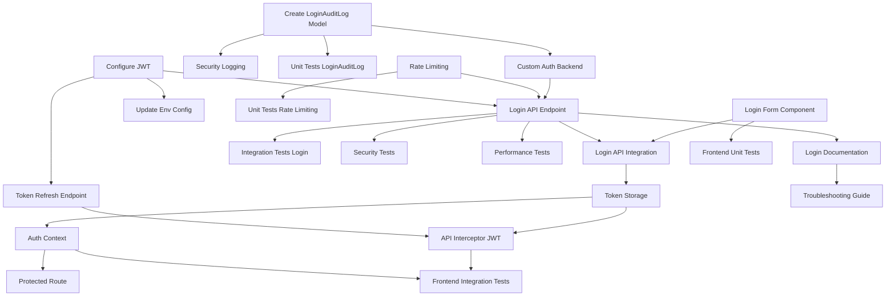

# US-3: Standard User Login

**Priority**: P1
**Feature**: Authentication
**Status**: To Do

## Overview

This User Story implements the standard email/password login flow with JWT token generation, rate limiting, security logging, and comprehensive frontend integration. The implementation provides a secure, performant authentication mechanism that serves as the foundation for user access control across the platform.

### Context

Standard login is a critical entry point for users who registered with email/password (as opposed to SSO via Microsoft Entra ID). This authentication mechanism must:
- Validate credentials securely using Argon2/PBKDF2 password hashing
- Enforce email verification before allowing login (is_email_verified flag)
- Generate JWT tokens (access + refresh) for API authentication
- Implement rate limiting (5 attempts per IP per 5 minutes) to prevent brute force attacks
- Log all authentication attempts for security auditing and forensics
- Return user profile information for frontend state management
- Meet performance requirements (< 300ms P95 latency)

This User Story depends on:
- **US-1** (User Registration): CustomUser model must exist
- **US-2** (Email Verification): is_email_verified flag must be implemented

### Decomposition Approach

The task breakdown follows a layered approach:

1. **Backend Foundation** (7 tasks): Database model for audit logging, JWT configuration, rate limiting infrastructure, custom authentication backend, API endpoints
2. **Frontend Integration** (6 tasks): Login form UI, API integration, token storage, authentication context, API interceptor, protected routes
3. **Comprehensive Testing** (7 tasks): Unit tests for models and rate limiting, integration tests for API, security tests, frontend tests, performance tests
4. **Infrastructure & Documentation** (4 tasks): Redis configuration, API documentation, environment setup, troubleshooting guide

This approach ensures:
- Security is built-in from the start (rate limiting, audit logging, email verification)
- Backend and frontend can be developed in parallel after foundational tasks
- Testing coverage is comprehensive (unit, integration, security, performance)
- Documentation supports both developers and operators

**Task Distribution**:
- **Backend**: 7 tasks (21 hours)
- **Frontend**: 6 tasks (21 hours)
- **Testing**: 7 tasks (23 hours)
- **Infrastructure**: 4 tasks (9 hours)
- **Total**: 24 tasks, 74 hours (9-10 developer days)

---

## Task Summary

| ID | Title | Type | Specialty | Effort | Dependencies | Status |
|----|-------|------|-----------|--------|--------------|--------|
| TASK-3.1 | Create LoginAuditLog Model | Backend | Database | 3h | None | ⬜ |
| TASK-3.2 | Configure JWT Authentication | Backend | Configuration | 2h | None | ⬜ |
| TASK-3.3 | Implement Redis-Based Rate Limiting | Backend | Security | 4h | None | ⬜ |
| TASK-3.4 | Create Custom Authentication Backend | Backend | Authentication | 3h | TASK-3.1 | ⬜ |
| TASK-3.5 | Implement Login API Endpoint | Backend | API | 5h | TASK-3.2, TASK-3.3, TASK-3.4 | ⬜ |
| TASK-3.6 | Implement Security Logging | Backend | Security | 2h | TASK-3.1 | ⬜ |
| TASK-3.7 | Create Token Refresh Endpoint | Backend | API | 2h | TASK-3.2 | ⬜ |
| TASK-3.8 | Create Login Form Component | Frontend | UI | 4h | None | ⬜ |
| TASK-3.9 | Implement Login API Integration | Frontend | API | 3h | TASK-3.5, TASK-3.8 | ⬜ |
| TASK-3.10 | Implement Token Storage | Frontend | State Management | 3h | TASK-3.9 | ⬜ |
| TASK-3.11 | Create Auth Context Provider | Frontend | State Management | 4h | TASK-3.10 | ⬜ |
| TASK-3.12 | Implement API Interceptor for JWT | Frontend | Infrastructure | 4h | TASK-3.10, TASK-3.7 | ⬜ |
| TASK-3.13 | Create Protected Route Component | Frontend | Navigation | 3h | TASK-3.11 | ⬜ |
| TASK-3.14 | Unit Tests for LoginAuditLog Model | Testing | Backend | 2h | TASK-3.1 | ⬜ |
| TASK-3.15 | Unit Tests for Rate Limiting | Testing | Backend | 3h | TASK-3.3 | ⬜ |
| TASK-3.16 | Integration Tests for Login API | Testing | Backend | 4h | TASK-3.5 | ⬜ |
| TASK-3.17 | Security Tests for Authentication | Testing | Security | 4h | TASK-3.5 | ⬜ |
| TASK-3.18 | Frontend Unit Tests for Login Form | Testing | Frontend | 3h | TASK-3.8 | ⬜ |
| TASK-3.19 | Frontend Integration Tests for Auth Flow | Testing | Frontend | 4h | TASK-3.11, TASK-3.12 | ⬜ |
| TASK-3.20 | Performance Tests for Login Endpoint | Testing | Performance | 3h | TASK-3.5 | ⬜ |
| TASK-3.21 | Configure Redis for Rate Limiting | Infrastructure | Configuration | 2h | None | ⬜ |
| TASK-3.22 | Create Login Documentation | Infrastructure | Documentation | 3h | TASK-3.5 | ⬜ |
| TASK-3.23 | Update Environment Configuration | Infrastructure | Configuration | 2h | TASK-3.2 | ⬜ |
| TASK-3.24 | Create Login Troubleshooting Guide | Infrastructure | Documentation | 2h | TASK-3.22 | ⬜ |

---

## Task Details

### 🔧 Backend Tasks

#### TASK-3.1: Create LoginAuditLog Model

**Type**: Backend - Database
**Priority**: P1
**Estimated Effort**: 3 hours

##### Description

Create a Django model to track all login attempts (successful and failed) for security auditing, forensics, and rate limiting analysis. The model must capture sufficient information to investigate security incidents and detect patterns of abuse.

##### Files Impacted

- `backend/accounts/models.py` (modified) - Add LoginAuditLog model
- `backend/accounts/migrations/000X_loginauditlog.py` (new) - Migration file
- `backend/accounts/admin.py` (modified) - Register model in admin interface

##### Acceptance Criteria

- [ ] LoginAuditLog model created with fields:
  - `user` (ForeignKey to CustomUser, nullable, on_delete=SET_NULL)
  - `email` (EmailField, max_length=255, db_index=True)
  - `ip_address` (GenericIPAddressField)
  - `user_agent` (TextField)
  - `success` (BooleanField)
  - `failure_reason` (CharField, max_length=100, nullable, choices)
  - `timestamp` (DateTimeField, auto_now_add=True, db_index=True)
- [ ] Migration generated and applied successfully
- [ ] Model registered in Django Admin with list_display and list_filter
- [ ] Database indexes created for email and timestamp for query performance
- [ ] __str__ method returns meaningful representation
- [ ] Ordering set to ['-timestamp'] (most recent first)

##### Dependencies

None

##### Implementation Notes

**Technology**: Django 4.2+, PostgreSQL 15

**Failure Reason Choices**:
```python
FAILURE_REASONS = [
    ('invalid_credentials', 'Invalid email or password'),
    ('email_not_verified', 'Email not verified'),
    ('rate_limited', 'Rate limit exceeded'),
    ('account_disabled', 'Account disabled'),
]
```

**Admin Configuration**:
```python
@admin.register(LoginAuditLog)
class LoginAuditLogAdmin(admin.ModelAdmin):
    list_display = ['email', 'success', 'ip_address', 'timestamp']
    list_filter = ['success', 'failure_reason', 'timestamp']
    search_fields = ['email', 'ip_address']
    readonly_fields = ['timestamp']
```

**Performance Consideration**: Use db_index=True on email and timestamp to support queries like "failed attempts for email in last 5 minutes" and "recent login history for user".

---

#### TASK-3.2: Configure JWT Authentication

**Type**: Backend - Configuration
**Priority**: P1
**Estimated Effort**: 2 hours

##### Description

Configure djangorestframework-simplejwt with appropriate token lifetimes, custom claims for user profile information, and token rotation strategy. This configuration must balance security (short-lived access tokens) with user experience (longer refresh tokens).

##### Files Impacted

- `backend/config/settings/base.py` (modified) - Add SIMPLE_JWT settings
- `backend/accounts/serializers.py` (new) - Custom token serializer
- `pyproject.toml` (modified) - Add djangorestframework-simplejwt dependency

##### Acceptance Criteria

- [ ] djangorestframework-simplejwt installed via Poetry
- [ ] SIMPLE_JWT settings configured in base.py:
  - ACCESS_TOKEN_LIFETIME = 15 minutes
  - REFRESH_TOKEN_LIFETIME = 7 days
  - ROTATE_REFRESH_TOKENS = True
  - BLACKLIST_AFTER_ROTATION = True
- [ ] Custom token claims include user profile fields:
  - user_id, email, first_name, last_name, is_sso_user
- [ ] JWT secret key loaded from environment variable
- [ ] Token algorithm set to HS256
- [ ] rest_framework_simplejwt.authentication.JWTAuthentication added to DEFAULT_AUTHENTICATION_CLASSES

##### Dependencies

None

##### Implementation Notes

**Technology**: djangorestframework-simplejwt, Django 4.2+

**Configuration Example**:
```python
from datetime import timedelta

SIMPLE_JWT = {
    'ACCESS_TOKEN_LIFETIME': timedelta(minutes=15),
    'REFRESH_TOKEN_LIFETIME': timedelta(days=7),
    'ROTATE_REFRESH_TOKENS': True,
    'BLACKLIST_AFTER_ROTATION': True,
    'ALGORITHM': 'HS256',
    'SIGNING_KEY': env('JWT_SECRET_KEY'),
    'AUTH_HEADER_TYPES': ('Bearer',),
}
```

**Custom Token Claims**:
Create custom token serializer to add user profile:
```python
from rest_framework_simplejwt.serializers import TokenObtainPairSerializer

class CustomTokenObtainPairSerializer(TokenObtainPairSerializer):
    @classmethod
    def get_token(cls, user):
        token = super().get_token(user)
        token['email'] = user.email
        token['first_name'] = user.first_name
        token['last_name'] = user.last_name
        token['is_sso_user'] = user.is_sso_user
        return token
```

**Security Note**: JWT_SECRET_KEY must be a strong random string (min 32 characters) stored in .env.backend file.

---

#### TASK-3.3: Implement Redis-Based Rate Limiting

**Type**: Backend - Security
**Priority**: P1
**Estimated Effort**: 4 hours

##### Description

Create a reusable rate limiting decorator using Redis to enforce 5 login attempts per IP address per 5-minute window. This prevents brute force attacks while allowing legitimate users to retry with typos. The implementation must be thread-safe, performant, and provide clear error messages.

##### Files Impacted

- `backend/accounts/rate_limiting.py` (new) - Rate limiting decorator and utilities
- `backend/config/settings/base.py` (modified) - Redis connection for rate limiting
- `backend/accounts/tests/test_rate_limiting.py` (new) - Unit tests

##### Acceptance Criteria

- [ ] rate_limit decorator created accepting limit and window parameters
- [ ] Redis used for atomic increment and expiry operations
- [ ] Decorator returns 429 status after limit exceeded
- [ ] Response includes Retry-After header with seconds until reset
- [ ] Rate limit counters automatically reset after timeout
- [ ] Different IP addresses have independent rate limit counters
- [ ] get_client_ip utility function extracts IP from X-Forwarded-For or REMOTE_ADDR
- [ ] Redis connection pooling configured for performance
- [ ] Graceful degradation if Redis unavailable (log warning, allow request)

##### Dependencies

None (Redis service from US-1 docker-compose setup)

##### Implementation Notes

**Technology**: Redis, Django 4.2+

**Rate Limiting Logic**:
```python
import redis
from django.conf import settings
from functools import wraps
from rest_framework.response import Response

redis_client = redis.Redis(
    host=settings.REDIS_HOST,
    port=settings.REDIS_PORT,
    db=settings.REDIS_RATE_LIMIT_DB,
    decode_responses=True
)

def rate_limit(limit=5, window=300):  # 5 attempts per 5 minutes
    def decorator(func):
        @wraps(func)
        def wrapper(request, *args, **kwargs):
            ip = get_client_ip(request)
            key = f"rate_limit:login:{ip}"

            try:
                current = redis_client.get(key)
                if current and int(current) >= limit:
                    ttl = redis_client.ttl(key)
                    return Response(
                        {'error': 'Rate limit exceeded. Try again later.'},
                        status=429,
                        headers={'Retry-After': str(ttl)}
                    )

                # Increment counter
                pipe = redis_client.pipeline()
                pipe.incr(key)
                pipe.expire(key, window)
                pipe.execute()

            except redis.RedisError:
                # Graceful degradation
                pass

            return func(request, *args, **kwargs)
        return wrapper
    return decorator

def get_client_ip(request):
    x_forwarded_for = request.META.get('HTTP_X_FORWARDED_FOR')
    if x_forwarded_for:
        ip = x_forwarded_for.split(',')[0]
    else:
        ip = request.META.get('REMOTE_ADDR')
    return ip
```

**Redis Configuration** (settings/base.py):
```python
REDIS_HOST = env('REDIS_HOST', default='redis')
REDIS_PORT = env.int('REDIS_PORT', default=6379)
REDIS_RATE_LIMIT_DB = env.int('REDIS_RATE_LIMIT_DB', default=1)
```

**Testing Considerations**: Use fakeredis library for unit tests to avoid requiring running Redis instance.

---

#### TASK-3.4: Create Custom Authentication Backend

**Type**: Backend - Authentication
**Priority**: P1
**Estimated Effort**: 3 hours

##### Description

Implement a Django authentication backend that validates email/password credentials, enforces email verification requirement (is_email_verified=True), and logs all authentication attempts to LoginAuditLog. This backend replaces Django's default username-based authentication with email-based authentication.

##### Files Impacted

- `backend/accounts/backends.py` (new) - EmailBackend class
- `backend/config/settings/base.py` (modified) - Add to AUTHENTICATION_BACKENDS
- `backend/accounts/tests/test_authentication.py` (new) - Unit tests

##### Acceptance Criteria

- [ ] EmailBackend class inherits from django.contrib.auth.backends.ModelBackend
- [ ] authenticate method accepts email and password parameters
- [ ] User lookup by email (case-insensitive)
- [ ] Password validation using check_password
- [ ] Email verification check: return None if is_email_verified=False
- [ ] LoginAuditLog entry created for every authentication attempt
- [ ] Capture success/failure, IP address, user agent, failure reason
- [ ] Clear, specific error messages for each failure scenario
- [ ] Prevent timing attacks (constant-time comparison where possible)
- [ ] Backend registered in AUTHENTICATION_BACKENDS setting

##### Dependencies

- TASK-3.1 (LoginAuditLog model must exist)

##### Implementation Notes

**Technology**: Django 4.2+, Argon2/PBKDF2 password hashing

**EmailBackend Implementation**:
```python
from django.contrib.auth.backends import ModelBackend
from django.contrib.auth import get_user_model
from .models import LoginAuditLog

User = get_user_model()

class EmailBackend(ModelBackend):
    def authenticate(self, request, email=None, password=None, **kwargs):
        ip_address = get_client_ip(request) if request else None
        user_agent = request.META.get('HTTP_USER_AGENT', '') if request else ''

        try:
            # Case-insensitive email lookup
            user = User.objects.get(email__iexact=email)
        except User.DoesNotExist:
            # Log failed attempt (generic failure reason to prevent enumeration)
            LoginAuditLog.objects.create(
                user=None,
                email=email,
                ip_address=ip_address,
                user_agent=user_agent,
                success=False,
                failure_reason='invalid_credentials'
            )
            return None

        # Check password
        if not user.check_password(password):
            LoginAuditLog.objects.create(
                user=user,
                email=email,
                ip_address=ip_address,
                user_agent=user_agent,
                success=False,
                failure_reason='invalid_credentials'
            )
            return None

        # Check email verification
        if not user.is_email_verified:
            LoginAuditLog.objects.create(
                user=user,
                email=email,
                ip_address=ip_address,
                user_agent=user_agent,
                success=False,
                failure_reason='email_not_verified'
            )
            return None

        # Success
        LoginAuditLog.objects.create(
            user=user,
            email=email,
            ip_address=ip_address,
            user_agent=user_agent,
            success=True,
            failure_reason=None
        )
        return user
```

**Settings Configuration**:
```python
AUTHENTICATION_BACKENDS = [
    'accounts.backends.EmailBackend',
]
```

**Security Note**: Use generic "invalid credentials" message for both non-existent users and wrong passwords to prevent account enumeration attacks.

---

#### TASK-3.5: Implement Login API Endpoint

**Type**: Backend - API
**Priority**: P1
**Estimated Effort**: 5 hours

##### Description

Create the POST /api/auth/login/ endpoint that orchestrates the complete login flow: rate limiting check, credential validation, JWT token generation, and user profile response. This is the primary authentication entry point for the application.

##### Files Impacted

- `backend/accounts/views.py` (modified) - LoginView API view
- `backend/accounts/serializers.py` (modified) - LoginSerializer, UserProfileSerializer
- `backend/accounts/urls.py` (modified) - Add login endpoint route
- `backend/config/urls.py` (modified) - Include accounts URLs

##### Acceptance Criteria

- [ ] POST /api/auth/login/ endpoint created
- [ ] Request accepts: email (string, required), password (string, required)
- [ ] LoginSerializer validates required fields and formats
- [ ] @rate_limit decorator applied (5 attempts per 5 minutes per IP)
- [ ] EmailBackend used for authentication
- [ ] JWT tokens generated on successful authentication
- [ ] Response includes: access_token, refresh_token, user (profile object)
- [ ] User profile includes: id, email, first_name, last_name, is_sso_user
- [ ] HTTP status codes:
  - 200: Successful login
  - 400: Missing/invalid fields
  - 401: Invalid credentials
  - 403: Email not verified
  - 429: Rate limit exceeded
- [ ] Error responses include clear, actionable messages
- [ ] Endpoint tested with valid and invalid inputs

##### Dependencies

- TASK-3.2 (JWT configuration)
- TASK-3.3 (Rate limiting decorator)
- TASK-3.4 (EmailBackend)

##### Implementation Notes

**Technology**: Django REST Framework, djangorestframework-simplejwt

**LoginSerializer**:
```python
from rest_framework import serializers

class LoginSerializer(serializers.Serializer):
    email = serializers.EmailField(required=True)
    password = serializers.CharField(required=True, write_only=True)

class UserProfileSerializer(serializers.ModelSerializer):
    class Meta:
        model = User
        fields = ['id', 'email', 'first_name', 'last_name', 'is_sso_user']
```

**LoginView**:
```python
from rest_framework.views import APIView
from rest_framework.response import Response
from rest_framework import status
from django.contrib.auth import authenticate
from rest_framework_simplejwt.tokens import RefreshToken
from .rate_limiting import rate_limit

class LoginView(APIView):
    permission_classes = []  # Public endpoint

    @rate_limit(limit=5, window=300)
    def post(self, request):
        serializer = LoginSerializer(data=request.data)
        if not serializer.is_valid():
            return Response(serializer.errors, status=status.HTTP_400_BAD_REQUEST)

        email = serializer.validated_data['email']
        password = serializer.validated_data['password']

        user = authenticate(request, email=email, password=password)

        if user is None:
            # Check failure reason from latest LoginAuditLog
            latest_log = LoginAuditLog.objects.filter(email=email).order_by('-timestamp').first()
            if latest_log and latest_log.failure_reason == 'email_not_verified':
                return Response(
                    {'error': 'Please verify your email before logging in.'},
                    status=status.HTTP_403_FORBIDDEN
                )
            return Response(
                {'error': 'Invalid email or password.'},
                status=status.HTTP_401_UNAUTHORIZED
            )

        # Generate tokens
        refresh = RefreshToken.for_user(user)
        user_profile = UserProfileSerializer(user).data

        return Response({
            'access_token': str(refresh.access_token),
            'refresh_token': str(refresh),
            'user': user_profile
        }, status=status.HTTP_200_OK)
```

**URL Configuration**:
```python
# accounts/urls.py
urlpatterns = [
    path('login/', LoginView.as_view(), name='login'),
]

# config/urls.py
urlpatterns = [
    path('api/auth/', include('accounts.urls')),
]
```

---

#### TASK-3.6: Implement Security Logging

**Type**: Backend - Security
**Priority**: P1
**Estimated Effort**: 2 hours

##### Description

Create a centralized logging service that captures IP addresses, user agents, and timestamps for all login attempts. This provides forensic data for security incident investigation and enables detection of suspicious patterns (e.g., login attempts from multiple IPs, unusual user agents).

##### Files Impacted

- `backend/accounts/logging.py` (new) - Security logging utilities
- `backend/config/settings/base.py` (modified) - Logging configuration
- `backend/accounts/backends.py` (modified) - Use logging service

##### Acceptance Criteria

- [ ] log_login_attempt function created accepting user, email, success, request
- [ ] IP address extracted from X-Forwarded-For header (if behind proxy) or REMOTE_ADDR
- [ ] User agent parsed from HTTP_USER_AGENT header
- [ ] Timestamp automatically captured (use timezone-aware datetime)
- [ ] LoginAuditLog entry created with all captured data
- [ ] Handle missing or malformed headers gracefully
- [ ] Integrate with EmailBackend (TASK-3.4)
- [ ] Log rotation configured for security logs
- [ ] PII (passwords) never logged

##### Dependencies

- TASK-3.1 (LoginAuditLog model)

##### Implementation Notes

**Technology**: Django logging, PostgreSQL

**Security Logging Service**:
```python
from django.utils import timezone
from .models import LoginAuditLog

def get_client_ip(request):
    """Extract client IP from request, handling proxies."""
    x_forwarded_for = request.META.get('HTTP_X_FORWARDED_FOR')
    if x_forwarded_for:
        # X-Forwarded-For can contain multiple IPs, take the first
        ip = x_forwarded_for.split(',')[0].strip()
    else:
        ip = request.META.get('REMOTE_ADDR')
    return ip

def get_user_agent(request):
    """Extract user agent from request."""
    return request.META.get('HTTP_USER_AGENT', 'Unknown')

def log_login_attempt(user, email, success, failure_reason, request):
    """
    Log login attempt to LoginAuditLog.

    Args:
        user: CustomUser instance or None (for non-existent users)
        email: Email address used in login attempt
        success: Boolean indicating login success
        failure_reason: String reason for failure (or None for success)
        request: HttpRequest object
    """
    LoginAuditLog.objects.create(
        user=user,
        email=email,
        ip_address=get_client_ip(request),
        user_agent=get_user_agent(request),
        success=success,
        failure_reason=failure_reason
    )
```

**Integration with EmailBackend**: Replace direct LoginAuditLog.objects.create calls with log_login_attempt function.

**Logging Configuration** (settings/base.py):
```python
LOGGING = {
    'version': 1,
    'disable_existing_loggers': False,
    'handlers': {
        'security_file': {
            'level': 'INFO',
            'class': 'logging.handlers.RotatingFileHandler',
            'filename': 'logs/security.log',
            'maxBytes': 10485760,  # 10MB
            'backupCount': 10,
        },
    },
    'loggers': {
        'accounts.security': {
            'handlers': ['security_file'],
            'level': 'INFO',
        },
    },
}
```

**Privacy Note**: Never log passwords or other sensitive credentials. Only log non-sensitive metadata for forensic purposes.

---

#### TASK-3.7: Create Token Refresh Endpoint

**Type**: Backend - API
**Priority**: P1
**Estimated Effort**: 2 hours

##### Description

Create the POST /api/auth/token/refresh/ endpoint that accepts a refresh token and returns a new access token. This enables seamless token renewal without requiring the user to re-enter credentials, supporting long-lived sessions while maintaining short access token lifetimes for security.

##### Files Impacted

- `backend/accounts/urls.py` (modified) - Add token refresh route
- `backend/accounts/views.py` (modified) - TokenRefreshView (may use built-in)

##### Acceptance Criteria

- [ ] POST /api/auth/token/refresh/ endpoint created
- [ ] Request accepts: refresh_token (string, required)
- [ ] Validates refresh token signature and expiration
- [ ] Returns new access_token on success
- [ ] HTTP status codes:
  - 200: Token refreshed successfully
  - 401: Invalid or expired refresh token
- [ ] Token rotation enabled (new refresh token issued)
- [ ] Old refresh token blacklisted after rotation
- [ ] Endpoint does not require authentication (uses refresh token)
- [ ] Response format: `{'access_token': 'xxx', 'refresh_token': 'yyy'}`

##### Dependencies

- TASK-3.2 (JWT configuration with rotation)

##### Implementation Notes

**Technology**: djangorestframework-simplejwt

**Implementation**: djangorestframework-simplejwt provides TokenRefreshView out of the box. Use it directly:

```python
# accounts/urls.py
from rest_framework_simplejwt.views import TokenRefreshView

urlpatterns = [
    path('login/', LoginView.as_view(), name='login'),
    path('token/refresh/', TokenRefreshView.as_view(), name='token_refresh'),
]
```

**Configuration Verification**: Ensure ROTATE_REFRESH_TOKENS and BLACKLIST_AFTER_ROTATION are True in SIMPLE_JWT settings (from TASK-3.2).

**Token Blacklisting**: Requires rest_framework_simplejwt.token_blacklist app:
```python
# settings/base.py
INSTALLED_APPS = [
    ...
    'rest_framework_simplejwt.token_blacklist',
]
```

**Migration**: Run `python manage.py migrate` to create blacklist tables.

---

### 🎨 Frontend Tasks

#### TASK-3.8: Create Login Form Component

**Type**: Frontend - UI
**Priority**: P1
**Estimated Effort**: 4 hours

##### Description

Create a React login form component with email and password fields, client-side validation, error display, loading states, and responsive design. The form must provide clear user feedback at every step and handle all error scenarios gracefully.

##### Files Impacted

- `frontend/src/components/LoginForm.jsx` (new) - Login form component
- `frontend/src/components/LoginForm.module.css` (new) - Component styles
- `frontend/src/pages/LoginPage.jsx` (new) - Login page container
- `frontend/src/App.jsx` (modified) - Add login route

##### Acceptance Criteria

- [ ] LoginForm component created with email and password inputs
- [ ] Email field with type="email" for browser validation
- [ ] Password field with type="password" for masking
- [ ] Client-side validation:
  - Email format validation
  - Required field validation
  - Display validation errors inline
- [ ] Submit button with loading state (disabled during API call)
- [ ] Error message display area for API errors
- [ ] Form submit handler prevents default and calls onSubmit prop
- [ ] Responsive design (mobile and desktop)
- [ ] Accessible (labels, ARIA attributes, keyboard navigation)
- [ ] "Forgot Password?" link (placeholder for now)
- [ ] "Don't have an account? Sign up" link to registration

##### Dependencies

None

##### Implementation Notes

**Technology**: React 18+, CSS Modules or Tailwind CSS

**Component Structure**:
```jsx
import React, { useState } from 'react';
import styles from './LoginForm.module.css';

export default function LoginForm({ onSubmit, error, loading }) {
  const [email, setEmail] = useState('');
  const [password, setPassword] = useState('');
  const [errors, setErrors] = useState({});

  const validate = () => {
    const newErrors = {};
    if (!email) {
      newErrors.email = 'Email is required';
    } else if (!/\S+@\S+\.\S+/.test(email)) {
      newErrors.email = 'Email is invalid';
    }
    if (!password) {
      newErrors.password = 'Password is required';
    }
    setErrors(newErrors);
    return Object.keys(newErrors).length === 0;
  };

  const handleSubmit = (e) => {
    e.preventDefault();
    if (validate()) {
      onSubmit({ email, password });
    }
  };

  return (
    <form onSubmit={handleSubmit} className={styles.form}>
      <h2>Login</h2>

      {error && <div className={styles.errorBox}>{error}</div>}

      <div className={styles.field}>
        <label htmlFor="email">Email</label>
        <input
          id="email"
          type="email"
          value={email}
          onChange={(e) => setEmail(e.target.value)}
          disabled={loading}
          aria-invalid={!!errors.email}
          aria-describedby={errors.email ? 'email-error' : undefined}
        />
        {errors.email && <span id="email-error" className={styles.error}>{errors.email}</span>}
      </div>

      <div className={styles.field}>
        <label htmlFor="password">Password</label>
        <input
          id="password"
          type="password"
          value={password}
          onChange={(e) => setPassword(e.target.value)}
          disabled={loading}
          aria-invalid={!!errors.password}
          aria-describedby={errors.password ? 'password-error' : undefined}
        />
        {errors.password && <span id="password-error" className={styles.error}>{errors.password}</span>}
      </div>

      <button type="submit" disabled={loading}>
        {loading ? 'Logging in...' : 'Login'}
      </button>

      <div className={styles.links}>
        <a href="/forgot-password">Forgot Password?</a>
        <a href="/register">Don't have an account? Sign up</a>
      </div>
    </form>
  );
}
```

**Styling Considerations**:
- Clear visual hierarchy
- Sufficient spacing between fields
- High contrast for readability
- Focus indicators for keyboard navigation
- Error messages in red with icons

---

#### TASK-3.9: Implement Login API Integration

**Type**: Frontend - API
**Priority**: P1
**Estimated Effort**: 3 hours

##### Description

Create an API service module that handles login API calls to POST /api/auth/login/, processes responses, maps backend error codes to user-friendly messages, and provides type-safe interfaces for login requests/responses.

##### Files Impacted

- `frontend/src/services/api/authApi.js` (new) - Authentication API service
- `frontend/src/services/api/client.js` (modified) - Axios client configuration
- `frontend/src/types/auth.ts` (new) - TypeScript types (if using TS)

##### Acceptance Criteria

- [ ] login function created accepting email and password
- [ ] Calls POST /api/auth/login/ with credentials
- [ ] Returns promise resolving to { access_token, refresh_token, user }
- [ ] Error handling for all status codes:
  - 400: "Please provide email and password"
  - 401: "Invalid email or password"
  - 403: "Please verify your email before logging in"
  - 429: "Too many login attempts. Try again in X minutes"
  - 500: "Server error. Please try again later"
  - Network errors: "Connection error. Please check your internet"
- [ ] Extract Retry-After header from 429 responses for countdown
- [ ] TypeScript types defined (if using TypeScript)
- [ ] Axios interceptor setup (basic, enhanced in TASK-3.12)
- [ ] Base URL configured from environment variable

##### Dependencies

- TASK-3.5 (Login API endpoint must exist)
- TASK-3.8 (LoginForm component)

##### Implementation Notes

**Technology**: Axios, React 18+

**API Service**:
```javascript
// authApi.js
import apiClient from './client';

export const login = async (email, password) => {
  try {
    const response = await apiClient.post('/auth/login/', {
      email,
      password
    });
    return response.data;
  } catch (error) {
    if (error.response) {
      const status = error.response.status;
      const data = error.response.data;

      switch (status) {
        case 400:
          throw new Error(data.error || 'Please provide valid email and password');
        case 401:
          throw new Error('Invalid email or password');
        case 403:
          throw new Error('Please verify your email before logging in');
        case 429:
          const retryAfter = error.response.headers['retry-after'];
          const minutes = retryAfter ? Math.ceil(retryAfter / 60) : 5;
          throw new Error(`Too many login attempts. Try again in ${minutes} minute(s)`);
        case 500:
          throw new Error('Server error. Please try again later');
        default:
          throw new Error('An unexpected error occurred');
      }
    } else if (error.request) {
      throw new Error('Connection error. Please check your internet connection');
    } else {
      throw new Error('An unexpected error occurred');
    }
  }
};
```

**Axios Client**:
```javascript
// client.js
import axios from 'axios';

const apiClient = axios.create({
  baseURL: import.meta.env.VITE_API_BASE_URL || 'http://localhost:8000/api',
  headers: {
    'Content-Type': 'application/json',
  },
  timeout: 10000,
});

export default apiClient;
```

**Environment Variable**: Add VITE_API_BASE_URL to .env.frontend

---

#### TASK-3.10: Implement Token Storage

**Type**: Frontend - State Management
**Priority**: P1
**Estimated Effort**: 3 hours

##### Description

Create a secure, persistent storage mechanism for JWT tokens (access and refresh) that survives page refreshes, provides type-safe accessors, and implements XSS protection strategies. The storage layer must abstract the underlying mechanism (localStorage, sessionStorage, or cookies) for flexibility.

##### Files Impacted

- `frontend/src/utils/tokenStorage.js` (new) - Token storage utilities
- `frontend/src/utils/storage.js` (new) - Generic storage abstraction
- `frontend/src/constants/storage.js` (new) - Storage keys

##### Acceptance Criteria

- [ ] saveTokens function stores access and refresh tokens
- [ ] getAccessToken function retrieves access token
- [ ] getRefreshToken function retrieves refresh token
- [ ] clearTokens function removes all tokens
- [ ] Tokens persisted in localStorage (or httpOnly cookies for enhanced security)
- [ ] Storage keys prefixed to avoid collisions (e.g., 'app_access_token')
- [ ] Handle storage quota exceeded errors gracefully
- [ ] Handle private browsing mode (no localStorage) gracefully
- [ ] Provide isAuthenticated check (access token exists and not expired)
- [ ] Parse JWT to check expiration without backend call

##### Dependencies

- TASK-3.9 (Login API returns tokens)

##### Implementation Notes

**Technology**: JavaScript/TypeScript, localStorage API

**Token Storage Module**:
```javascript
// tokenStorage.js
import { STORAGE_KEYS } from '../constants/storage';

export const saveTokens = (accessToken, refreshToken) => {
  try {
    localStorage.setItem(STORAGE_KEYS.ACCESS_TOKEN, accessToken);
    localStorage.setItem(STORAGE_KEYS.REFRESH_TOKEN, refreshToken);
  } catch (error) {
    console.error('Failed to save tokens:', error);
    // Fallback to sessionStorage or in-memory storage
  }
};

export const getAccessToken = () => {
  try {
    return localStorage.getItem(STORAGE_KEYS.ACCESS_TOKEN);
  } catch (error) {
    return null;
  }
};

export const getRefreshToken = () => {
  try {
    return localStorage.getItem(STORAGE_KEYS.REFRESH_TOKEN);
  } catch (error) {
    return null;
  }
};

export const clearTokens = () => {
  try {
    localStorage.removeItem(STORAGE_KEYS.ACCESS_TOKEN);
    localStorage.removeItem(STORAGE_KEYS.REFRESH_TOKEN);
  } catch (error) {
    console.error('Failed to clear tokens:', error);
  }
};

export const isAuthenticated = () => {
  const token = getAccessToken();
  if (!token) return false;

  try {
    // Parse JWT payload (base64 decode middle section)
    const payload = JSON.parse(atob(token.split('.')[1]));
    const expiration = payload.exp * 1000; // Convert to milliseconds
    return Date.now() < expiration;
  } catch (error) {
    return false;
  }
};
```

**Storage Keys**:
```javascript
// constants/storage.js
export const STORAGE_KEYS = {
  ACCESS_TOKEN: 'veille_tech_access_token',
  REFRESH_TOKEN: 'veille_tech_refresh_token',
};
```

**Security Considerations**:
- **XSS Risk**: localStorage is vulnerable to XSS attacks. Consider httpOnly cookies for production.
- **Token Expiration**: Always validate token expiration client-side to avoid unnecessary API calls.
- **Token Refresh**: Implement automatic refresh before token expiration (handled in TASK-3.12).

---

#### TASK-3.11: Create Auth Context Provider

**Type**: Frontend - State Management
**Priority**: P1
**Estimated Effort**: 4 hours

##### Description

Create a React Context provider that manages global authentication state (user profile, authentication status), provides login/logout functions, handles token storage, and offers a custom useAuth hook for component access. This centralizes authentication logic and makes it easily accessible throughout the app.

##### Files Impacted

- `frontend/src/contexts/AuthContext.jsx` (new) - Auth context and provider
- `frontend/src/hooks/useAuth.js` (new) - Custom hook for consuming auth context
- `frontend/src/App.jsx` (modified) - Wrap app with AuthProvider

##### Acceptance Criteria

- [ ] AuthContext created with default values
- [ ] AuthProvider component manages authentication state
- [ ] State includes: user (profile object or null), loading (boolean), error (string or null)
- [ ] login function calls API, stores tokens, updates user state
- [ ] logout function clears tokens, resets user state, redirects to login
- [ ] useAuth custom hook for consuming context
- [ ] Context initializes from stored tokens on mount (restore session)
- [ ] Loading state during session restoration
- [ ] Error state for failed login attempts
- [ ] Context values memoized to prevent unnecessary re-renders

##### Dependencies

- TASK-3.10 (Token storage)

##### Implementation Notes

**Technology**: React Context API, React 18+

**AuthContext Implementation**:
```jsx
// AuthContext.jsx
import React, { createContext, useState, useEffect, useMemo } from 'react';
import { login as apiLogin } from '../services/api/authApi';
import { saveTokens, clearTokens, getAccessToken, isAuthenticated } from '../utils/tokenStorage';
import { useNavigate } from 'react-router-dom';

export const AuthContext = createContext({
  user: null,
  loading: false,
  error: null,
  login: async () => {},
  logout: () => {},
});

export function AuthProvider({ children }) {
  const [user, setUser] = useState(null);
  const [loading, setLoading] = useState(true);
  const [error, setError] = useState(null);
  const navigate = useNavigate();

  // Restore session on mount
  useEffect(() => {
    const restoreSession = async () => {
      if (isAuthenticated()) {
        const token = getAccessToken();
        // Parse user from token
        const payload = JSON.parse(atob(token.split('.')[1]));
        setUser({
          id: payload.user_id,
          email: payload.email,
          first_name: payload.first_name,
          last_name: payload.last_name,
          is_sso_user: payload.is_sso_user,
        });
      }
      setLoading(false);
    };
    restoreSession();
  }, []);

  const login = async (email, password) => {
    setLoading(true);
    setError(null);
    try {
      const { access_token, refresh_token, user: userData } = await apiLogin(email, password);
      saveTokens(access_token, refresh_token);
      setUser(userData);
      navigate('/dashboard');
    } catch (err) {
      setError(err.message);
      throw err;
    } finally {
      setLoading(false);
    }
  };

  const logout = () => {
    clearTokens();
    setUser(null);
    navigate('/login');
  };

  const value = useMemo(
    () => ({ user, loading, error, login, logout }),
    [user, loading, error]
  );

  return <AuthContext.Provider value={value}>{children}</AuthContext.Provider>;
}
```

**useAuth Hook**:
```javascript
// useAuth.js
import { useContext } from 'react';
import { AuthContext } from '../contexts/AuthContext';

export function useAuth() {
  const context = useContext(AuthContext);
  if (!context) {
    throw new Error('useAuth must be used within AuthProvider');
  }
  return context;
}
```

**App.jsx Integration**:
```jsx
import { AuthProvider } from './contexts/AuthContext';

function App() {
  return (
    <AuthProvider>
      <Routes>
        {/* routes */}
      </Routes>
    </AuthProvider>
  );
}
```

---

#### TASK-3.12: Implement API Interceptor for JWT

**Type**: Frontend - Infrastructure
**Priority**: P1
**Estimated Effort**: 4 hours

##### Description

Create Axios request and response interceptors that automatically attach the access token to all API requests, detect 401 Unauthorized responses, attempt token refresh, and retry the original request. This provides seamless authentication for all API calls and handles token expiration transparently.

##### Files Impacted

- `frontend/src/services/api/interceptors.js` (new) - Request/response interceptors
- `frontend/src/services/api/client.js` (modified) - Register interceptors
- `frontend/src/services/api/authApi.js` (modified) - Add refreshToken function

##### Acceptance Criteria

- [ ] Request interceptor adds Authorization: Bearer <token> header to all requests
- [ ] Excludes auth endpoints (/auth/login, /auth/token/refresh) from token attachment
- [ ] Response interceptor detects 401 status
- [ ] On 401, attempts token refresh using refresh token
- [ ] If refresh succeeds, retries original request with new access token
- [ ] If refresh fails (refresh token expired), logs out user
- [ ] Prevents infinite retry loops (max 1 retry per request)
- [ ] Handles concurrent requests during token refresh (queue requests)
- [ ] Updates stored access token after refresh
- [ ] Properly handles race conditions (multiple 401s at same time)

##### Dependencies

- TASK-3.10 (Token storage)
- TASK-3.7 (Token refresh endpoint)

##### Implementation Notes

**Technology**: Axios interceptors

**Request Interceptor**:
```javascript
// interceptors.js
import { getAccessToken, getRefreshToken, saveTokens, clearTokens } from '../utils/tokenStorage';

let isRefreshing = false;
let failedQueue = [];

const processQueue = (error, token = null) => {
  failedQueue.forEach(prom => {
    if (error) {
      prom.reject(error);
    } else {
      prom.resolve(token);
    }
  });
  failedQueue = [];
};

export const setupInterceptors = (apiClient, navigate) => {
  // Request interceptor
  apiClient.interceptors.request.use(
    (config) => {
      // Skip token for auth endpoints
      if (config.url.includes('/auth/login') || config.url.includes('/auth/token/refresh')) {
        return config;
      }

      const token = getAccessToken();
      if (token) {
        config.headers.Authorization = `Bearer ${token}`;
      }
      return config;
    },
    (error) => Promise.reject(error)
  );

  // Response interceptor
  apiClient.interceptors.response.use(
    (response) => response,
    async (error) => {
      const originalRequest = error.config;

      // If error is not 401 or request already retried, reject
      if (error.response?.status !== 401 || originalRequest._retry) {
        return Promise.reject(error);
      }

      if (isRefreshing) {
        // Queue concurrent requests
        return new Promise((resolve, reject) => {
          failedQueue.push({ resolve, reject });
        })
          .then(token => {
            originalRequest.headers.Authorization = `Bearer ${token}`;
            return apiClient(originalRequest);
          })
          .catch(err => Promise.reject(err));
      }

      originalRequest._retry = true;
      isRefreshing = true;

      const refreshToken = getRefreshToken();
      if (!refreshToken) {
        clearTokens();
        navigate('/login');
        return Promise.reject(error);
      }

      try {
        const response = await apiClient.post('/auth/token/refresh/', {
          refresh: refreshToken
        });
        const { access_token, refresh_token } = response.data;
        saveTokens(access_token, refresh_token);

        processQueue(null, access_token);
        originalRequest.headers.Authorization = `Bearer ${access_token}`;
        return apiClient(originalRequest);
      } catch (refreshError) {
        processQueue(refreshError, null);
        clearTokens();
        navigate('/login');
        return Promise.reject(refreshError);
      } finally {
        isRefreshing = false;
      }
    }
  );
};
```

**Client Setup**:
```javascript
// client.js
import { setupInterceptors } from './interceptors';

// After creating apiClient
export const initializeInterceptors = (navigate) => {
  setupInterceptors(apiClient, navigate);
};
```

**App.jsx Integration**:
```jsx
import { useNavigate } from 'react-router-dom';
import { useEffect } from 'react';
import { initializeInterceptors } from './services/api/client';

function App() {
  const navigate = useNavigate();

  useEffect(() => {
    initializeInterceptors(navigate);
  }, [navigate]);

  return (/* ... */);
}
```

---

#### TASK-3.13: Create Protected Route Component

**Type**: Frontend - Navigation
**Priority**: P1
**Estimated Effort**: 3 hours

##### Description

Create a React component that wraps protected routes and redirects unauthenticated users to the login page, preserves the intended destination URL for post-login redirect, and shows loading state during authentication check. This ensures only authenticated users can access protected pages.

##### Files Impacted

- `frontend/src/components/ProtectedRoute.jsx` (new) - Protected route wrapper
- `frontend/src/App.jsx` (modified) - Use ProtectedRoute for protected pages

##### Acceptance Criteria

- [ ] ProtectedRoute component accepts children prop
- [ ] Checks authentication status from useAuth hook
- [ ] If authenticated, renders children
- [ ] If not authenticated, redirects to /login
- [ ] Preserves intended URL in location state for post-login redirect
- [ ] Shows loading spinner during authentication check
- [ ] Handles loading state gracefully (no flash of login page)
- [ ] Works with React Router v6 Navigate component
- [ ] Supports nested routes

##### Dependencies

- TASK-3.11 (AuthContext with useAuth hook)

##### Implementation Notes

**Technology**: React Router v6, React 18+

**ProtectedRoute Component**:
```jsx
// ProtectedRoute.jsx
import React from 'react';
import { Navigate, useLocation } from 'react-router-dom';
import { useAuth } from '../hooks/useAuth';

export default function ProtectedRoute({ children }) {
  const { user, loading } = useAuth();
  const location = useLocation();

  if (loading) {
    return (
      <div style={{ display: 'flex', justifyContent: 'center', alignItems: 'center', height: '100vh' }}>
        <div>Loading...</div>
      </div>
    );
  }

  if (!user) {
    // Redirect to login, preserving intended destination
    return <Navigate to="/login" state={{ from: location }} replace />;
  }

  return children;
}
```

**App.jsx Usage**:
```jsx
import { BrowserRouter, Routes, Route } from 'react-router-dom';
import ProtectedRoute from './components/ProtectedRoute';
import LoginPage from './pages/LoginPage';
import DashboardPage from './pages/DashboardPage';
import ProfilePage from './pages/ProfilePage';

function App() {
  return (
    <BrowserRouter>
      <AuthProvider>
        <Routes>
          <Route path="/login" element={<LoginPage />} />
          <Route
            path="/dashboard"
            element={
              <ProtectedRoute>
                <DashboardPage />
              </ProtectedRoute>
            }
          />
          <Route
            path="/profile"
            element={
              <ProtectedRoute>
                <ProfilePage />
              </ProtectedRoute>
            }
          />
        </Routes>
      </AuthProvider>
    </BrowserRouter>
  );
}
```

**Post-Login Redirect** (in LoginPage after successful login):
```jsx
const location = useLocation();
const from = location.state?.from?.pathname || '/dashboard';
navigate(from, { replace: true });
```

---

### ✅ Testing Tasks

#### TASK-3.14: Unit Tests for LoginAuditLog Model

**Type**: Testing - Backend
**Priority**: P2
**Estimated Effort**: 2 hours

##### Description

Write comprehensive pytest unit tests for the LoginAuditLog model covering model creation, field validation, nullable relationships, admin interface, and database constraints. Ensures the audit logging data model is robust and correctly configured.

##### Files Impacted

- `backend/accounts/tests/test_models.py` (new or modified) - LoginAuditLog tests

##### Acceptance Criteria

- [ ] Test LoginAuditLog creation with all fields
- [ ] Test nullable user field (user=None for non-existent users)
- [ ] Test email field validation and max_length
- [ ] Test ip_address field accepts IPv4 and IPv6
- [ ] Test user_agent TextField accepts long strings
- [ ] Test success boolean field
- [ ] Test failure_reason choices validation
- [ ] Test timestamp auto_now_add
- [ ] Test __str__ method output
- [ ] Test ordering (most recent first)
- [ ] Test admin registration and configuration
- [ ] 90%+ code coverage for LoginAuditLog model

##### Dependencies

- TASK-3.1 (LoginAuditLog model)

##### Implementation Notes

**Technology**: pytest, pytest-django, Django 4.2+

**Test Structure**:
```python
# test_models.py
import pytest
from django.contrib.auth import get_user_model
from accounts.models import LoginAuditLog

User = get_user_model()

@pytest.mark.django_db
class TestLoginAuditLog:
    def test_create_audit_log_with_user(self):
        """Test creating audit log with existing user."""
        user = User.objects.create_user(
            email='test@example.com',
            password='testpass123'
        )
        log = LoginAuditLog.objects.create(
            user=user,
            email='test@example.com',
            ip_address='192.168.1.1',
            user_agent='Mozilla/5.0',
            success=True,
            failure_reason=None
        )
        assert log.user == user
        assert log.email == 'test@example.com'
        assert log.success is True

    def test_create_audit_log_without_user(self):
        """Test creating audit log for non-existent user."""
        log = LoginAuditLog.objects.create(
            user=None,
            email='nonexistent@example.com',
            ip_address='192.168.1.1',
            user_agent='Mozilla/5.0',
            success=False,
            failure_reason='invalid_credentials'
        )
        assert log.user is None
        assert log.success is False

    def test_ipv6_address_support(self):
        """Test IPv6 address storage."""
        log = LoginAuditLog.objects.create(
            email='test@example.com',
            ip_address='2001:0db8:85a3::8a2e:0370:7334',
            user_agent='Mozilla/5.0',
            success=True
        )
        assert log.ip_address == '2001:0db8:85a3::8a2e:0370:7334'

    def test_ordering(self):
        """Test logs ordered by timestamp descending."""
        log1 = LoginAuditLog.objects.create(
            email='test1@example.com',
            ip_address='192.168.1.1',
            user_agent='Mozilla/5.0',
            success=True
        )
        log2 = LoginAuditLog.objects.create(
            email='test2@example.com',
            ip_address='192.168.1.2',
            user_agent='Mozilla/5.0',
            success=False,
            failure_reason='invalid_credentials'
        )
        logs = LoginAuditLog.objects.all()
        assert logs[0] == log2  # Most recent first
        assert logs[1] == log1
```

---

#### TASK-3.15: Unit Tests for Rate Limiting

**Type**: Testing - Backend
**Priority**: P2
**Estimated Effort**: 3 hours

##### Description

Write comprehensive unit tests for the rate limiting decorator, verifying that the 5-attempt limit is enforced per IP, timeout resets work correctly, different IPs are isolated, Redis interactions are correct, and graceful degradation works when Redis is unavailable.

##### Files Impacted

- `backend/accounts/tests/test_rate_limiting.py` (new) - Rate limiting tests

##### Acceptance Criteria

- [ ] Test requests within limit pass through
- [ ] Test 6th request returns 429 status
- [ ] Test Retry-After header present in 429 response
- [ ] Test rate limit resets after timeout (use Redis EXPIRE)
- [ ] Test different IP addresses have independent counters
- [ ] Test X-Forwarded-For header parsing
- [ ] Test fallback to REMOTE_ADDR if X-Forwarded-For missing
- [ ] Test graceful degradation if Redis unavailable (allow request, log warning)
- [ ] Test concurrent requests from same IP
- [ ] Use fakeredis for tests (no real Redis required)
- [ ] 85%+ code coverage for rate limiting module

##### Dependencies

- TASK-3.3 (Rate limiting decorator)

##### Implementation Notes

**Technology**: pytest, fakeredis

**Test Structure**:
```python
# test_rate_limiting.py
import pytest
from unittest.mock import Mock, patch
from accounts.rate_limiting import rate_limit, get_client_ip
import fakeredis

@pytest.fixture
def fake_redis():
    """Provide fake Redis client for testing."""
    return fakeredis.FakeRedis(decode_responses=True)

@pytest.fixture
def request_factory():
    """Provide request factory."""
    from django.test import RequestFactory
    return RequestFactory()

def test_rate_limit_allows_within_limit(fake_redis, request_factory):
    """Test requests within limit are allowed."""
    with patch('accounts.rate_limiting.redis_client', fake_redis):
        @rate_limit(limit=5, window=300)
        def mock_view(request):
            return {'success': True}

        request = request_factory.post('/login/', {'email': 'test@example.com'})
        request.META['REMOTE_ADDR'] = '192.168.1.1'

        # First 5 requests should succeed
        for i in range(5):
            response = mock_view(request)
            assert response['success'] is True

def test_rate_limit_blocks_after_limit(fake_redis, request_factory):
    """Test 6th request is blocked."""
    with patch('accounts.rate_limiting.redis_client', fake_redis):
        @rate_limit(limit=5, window=300)
        def mock_view(request):
            return {'success': True}

        request = request_factory.post('/login/')
        request.META['REMOTE_ADDR'] = '192.168.1.1'

        # First 5 requests succeed
        for i in range(5):
            mock_view(request)

        # 6th request should be blocked
        response = mock_view(request)
        assert response.status_code == 429
        assert 'Retry-After' in response.headers

def test_different_ips_isolated(fake_redis, request_factory):
    """Test different IPs have independent rate limits."""
    with patch('accounts.rate_limiting.redis_client', fake_redis):
        @rate_limit(limit=5, window=300)
        def mock_view(request):
            return {'success': True}

        request1 = request_factory.post('/login/')
        request1.META['REMOTE_ADDR'] = '192.168.1.1'

        request2 = request_factory.post('/login/')
        request2.META['REMOTE_ADDR'] = '192.168.1.2'

        # Exhaust rate limit for IP 1
        for i in range(5):
            mock_view(request1)

        # IP 2 should still be allowed
        response = mock_view(request2)
        assert response['success'] is True

def test_x_forwarded_for_parsing(request_factory):
    """Test IP extraction from X-Forwarded-For header."""
    request = request_factory.post('/login/')
    request.META['HTTP_X_FORWARDED_FOR'] = '203.0.113.1, 192.168.1.1'

    ip = get_client_ip(request)
    assert ip == '203.0.113.1'  # First IP in list
```

---

#### TASK-3.16: Integration Tests for Login API

**Type**: Testing - Backend
**Priority**: P1
**Estimated Effort**: 4 hours

##### Description

Write end-to-end integration tests for the POST /api/auth/login/ endpoint covering all success and error scenarios, JWT token validation, user profile response, rate limiting integration, and security logging verification.

##### Files Impacted

- `backend/accounts/tests/test_login_api.py` (new) - Login API integration tests

##### Acceptance Criteria

- [ ] Test successful login with valid credentials returns 200
- [ ] Test response includes access_token, refresh_token, user profile
- [ ] Test access_token is valid JWT with correct claims
- [ ] Test user profile includes id, email, first_name, last_name, is_sso_user
- [ ] Test 401 for invalid email
- [ ] Test 401 for invalid password
- [ ] Test 403 for unverified email (is_email_verified=False)
- [ ] Test 400 for missing email field
- [ ] Test 400 for missing password field
- [ ] Test 400 for invalid email format
- [ ] Test 429 after 5 failed attempts from same IP
- [ ] Test LoginAuditLog entry created for each attempt
- [ ] Test audit log contains correct IP address and user agent
- [ ] 90%+ code coverage for login view

##### Dependencies

- TASK-3.5 (Login API endpoint)

##### Implementation Notes

**Technology**: pytest, pytest-django, Django REST Framework test client

**Test Structure**:
```python
# test_login_api.py
import pytest
from django.contrib.auth import get_user_model
from rest_framework.test import APIClient
from accounts.models import LoginAuditLog
import jwt
from django.conf import settings

User = get_user_model()

@pytest.fixture
def api_client():
    return APIClient()

@pytest.fixture
def verified_user(db):
    """Create verified user for testing."""
    return User.objects.create_user(
        email='verified@example.com',
        password='securepass123',
        is_email_verified=True
    )

@pytest.fixture
def unverified_user(db):
    """Create unverified user for testing."""
    return User.objects.create_user(
        email='unverified@example.com',
        password='securepass123',
        is_email_verified=False
    )

@pytest.mark.django_db
class TestLoginAPI:
    def test_successful_login(self, api_client, verified_user):
        """Test successful login returns tokens and user profile."""
        response = api_client.post('/api/auth/login/', {
            'email': 'verified@example.com',
            'password': 'securepass123'
        })

        assert response.status_code == 200
        data = response.json()
        assert 'access_token' in data
        assert 'refresh_token' in data
        assert 'user' in data
        assert data['user']['email'] == 'verified@example.com'

        # Verify JWT token
        token = data['access_token']
        payload = jwt.decode(token, settings.SIMPLE_JWT['SIGNING_KEY'], algorithms=['HS256'])
        assert payload['email'] == 'verified@example.com'

        # Verify audit log
        log = LoginAuditLog.objects.latest('timestamp')
        assert log.email == 'verified@example.com'
        assert log.success is True

    def test_invalid_credentials(self, api_client, verified_user):
        """Test 401 for wrong password."""
        response = api_client.post('/api/auth/login/', {
            'email': 'verified@example.com',
            'password': 'wrongpassword'
        })

        assert response.status_code == 401
        assert 'Invalid email or password' in response.json()['error']

        # Verify audit log
        log = LoginAuditLog.objects.latest('timestamp')
        assert log.success is False
        assert log.failure_reason == 'invalid_credentials'

    def test_unverified_email(self, api_client, unverified_user):
        """Test 403 for unverified email."""
        response = api_client.post('/api/auth/login/', {
            'email': 'unverified@example.com',
            'password': 'securepass123'
        })

        assert response.status_code == 403
        assert 'verify your email' in response.json()['error'].lower()

    def test_rate_limiting(self, api_client, verified_user):
        """Test 429 after 5 failed attempts."""
        # Make 5 failed attempts
        for i in range(5):
            api_client.post('/api/auth/login/', {
                'email': 'verified@example.com',
                'password': 'wrongpassword'
            })

        # 6th attempt should be rate limited
        response = api_client.post('/api/auth/login/', {
            'email': 'verified@example.com',
            'password': 'wrongpassword'
        })

        assert response.status_code == 429
        assert 'Retry-After' in response.headers
```

---

#### TASK-3.17: Security Tests for Authentication

**Type**: Testing - Security
**Priority**: P1
**Estimated Effort**: 4 hours

##### Description

Write security-focused tests covering SQL injection attempts, XSS in error messages, timing attack mitigation, password leak prevention in logs/responses, account enumeration prevention, and CSRF protection for authentication endpoints.

##### Files Impacted

- `backend/accounts/tests/test_security.py` (new) - Security tests

##### Acceptance Criteria

- [ ] Test SQL injection attempts in email field
- [ ] Test XSS payload in email field does not execute
- [ ] Test timing attack: invalid user vs invalid password take similar time
- [ ] Test password never appears in response body
- [ ] Test password never appears in logs
- [ ] Test error messages do not reveal if user exists
- [ ] Test account enumeration prevention (same error for invalid user vs invalid password)
- [ ] Test CSRF token not required for login (public endpoint)
- [ ] Test rate limiting prevents brute force (integration with TASK-3.15)
- [ ] Test audit logs do not contain passwords
- [ ] Test JWT tokens do not contain password hashes

##### Dependencies

- TASK-3.5 (Login API endpoint)

##### Implementation Notes

**Technology**: pytest, time module for timing tests

**Test Structure**:
```python
# test_security.py
import pytest
import time
from rest_framework.test import APIClient
from django.contrib.auth import get_user_model
from accounts.models import LoginAuditLog

User = get_user_model()

@pytest.mark.django_db
class TestAuthenticationSecurity:
    def test_sql_injection_in_email(self, api_client):
        """Test SQL injection payload is safely handled."""
        response = api_client.post('/api/auth/login/', {
            'email': "'; DROP TABLE auth_user; --",
            'password': 'password'
        })

        # Should return 401, not cause database error
        assert response.status_code == 401
        # Verify users table still exists
        assert User.objects.count() >= 0

    def test_xss_in_error_message(self, api_client):
        """Test XSS payload in email does not execute."""
        response = api_client.post('/api/auth/login/', {
            'email': '<script>alert("XSS")</script>@example.com',
            'password': 'password'
        })

        # Error message should escape HTML
        error = response.json()['error']
        assert '<script>' not in error or '&lt;script&gt;' in error

    def test_timing_attack_mitigation(self, api_client, verified_user):
        """Test invalid user vs invalid password take similar time."""
        # Test invalid user
        start = time.time()
        api_client.post('/api/auth/login/', {
            'email': 'nonexistent@example.com',
            'password': 'password'
        })
        invalid_user_time = time.time() - start

        # Test invalid password
        start = time.time()
        api_client.post('/api/auth/login/', {
            'email': 'verified@example.com',
            'password': 'wrongpassword'
        })
        invalid_password_time = time.time() - start

        # Times should be within 50ms of each other
        assert abs(invalid_user_time - invalid_password_time) < 0.05

    def test_password_not_in_response(self, api_client, verified_user):
        """Test password never appears in response."""
        response = api_client.post('/api/auth/login/', {
            'email': 'verified@example.com',
            'password': 'securepass123'
        })

        response_str = str(response.content)
        assert 'securepass123' not in response_str

    def test_password_not_in_audit_log(self, api_client, verified_user):
        """Test password never stored in audit logs."""
        api_client.post('/api/auth/login/', {
            'email': 'verified@example.com',
            'password': 'securepass123'
        })

        log = LoginAuditLog.objects.latest('timestamp')
        log_str = str(log.__dict__)
        assert 'securepass123' not in log_str

    def test_account_enumeration_prevention(self, api_client, verified_user):
        """Test same error message for invalid user vs invalid password."""
        # Invalid user
        response1 = api_client.post('/api/auth/login/', {
            'email': 'nonexistent@example.com',
            'password': 'password'
        })

        # Invalid password
        response2 = api_client.post('/api/auth/login/', {
            'email': 'verified@example.com',
            'password': 'wrongpassword'
        })

        # Both should return same generic error
        assert response1.json()['error'] == response2.json()['error']
        assert 'Invalid email or password' in response1.json()['error']
```

---

#### TASK-3.18: Frontend Unit Tests for Login Form

**Type**: Testing - Frontend
**Priority**: P2
**Estimated Effort**: 3 hours

##### Description

Write React Testing Library tests for the LoginForm component covering rendering, user interactions, client-side validation, error display, loading states, and accessibility.

##### Files Impacted

- `frontend/src/components/LoginForm.test.jsx` (new) - LoginForm tests

##### Acceptance Criteria

- [ ] Test form renders with email and password fields
- [ ] Test submit button is present
- [ ] Test email validation (invalid format shows error)
- [ ] Test required field validation (empty fields show errors)
- [ ] Test form submission calls onSubmit with email and password
- [ ] Test loading state disables inputs and button
- [ ] Test error message displays when error prop provided
- [ ] Test form clears validation errors on re-type
- [ ] Test accessibility (labels, ARIA attributes)
- [ ] Test keyboard navigation works
- [ ] 85%+ code coverage for LoginForm component

##### Dependencies

- TASK-3.8 (LoginForm component)

##### Implementation Notes

**Technology**: React Testing Library, Jest/Vitest

**Test Structure**:
```javascript
// LoginForm.test.jsx
import { render, screen, fireEvent, waitFor } from '@testing-library/react';
import userEvent from '@testing-library/user-event';
import LoginForm from './LoginForm';

describe('LoginForm', () => {
  test('renders email and password fields', () => {
    render(<LoginForm onSubmit={() => {}} />);

    expect(screen.getByLabelText(/email/i)).toBeInTheDocument();
    expect(screen.getByLabelText(/password/i)).toBeInTheDocument();
    expect(screen.getByRole('button', { name: /login/i })).toBeInTheDocument();
  });

  test('validates email format', async () => {
    const user = userEvent.setup();
    render(<LoginForm onSubmit={() => {}} />);

    const emailInput = screen.getByLabelText(/email/i);
    const submitButton = screen.getByRole('button', { name: /login/i });

    await user.type(emailInput, 'invalid-email');
    await user.click(submitButton);

    expect(screen.getByText(/email is invalid/i)).toBeInTheDocument();
  });

  test('validates required fields', async () => {
    const user = userEvent.setup();
    render(<LoginForm onSubmit={() => {}} />);

    const submitButton = screen.getByRole('button', { name: /login/i });
    await user.click(submitButton);

    expect(screen.getByText(/email is required/i)).toBeInTheDocument();
    expect(screen.getByText(/password is required/i)).toBeInTheDocument();
  });

  test('calls onSubmit with credentials', async () => {
    const user = userEvent.setup();
    const mockSubmit = jest.fn();
    render(<LoginForm onSubmit={mockSubmit} />);

    await user.type(screen.getByLabelText(/email/i), 'test@example.com');
    await user.type(screen.getByLabelText(/password/i), 'password123');
    await user.click(screen.getByRole('button', { name: /login/i }));

    await waitFor(() => {
      expect(mockSubmit).toHaveBeenCalledWith({
        email: 'test@example.com',
        password: 'password123'
      });
    });
  });

  test('disables inputs during loading', () => {
    render(<LoginForm onSubmit={() => {}} loading={true} />);

    expect(screen.getByLabelText(/email/i)).toBeDisabled();
    expect(screen.getByLabelText(/password/i)).toBeDisabled();
    expect(screen.getByRole('button')).toBeDisabled();
  });

  test('displays error message', () => {
    const errorMessage = 'Invalid credentials';
    render(<LoginForm onSubmit={() => {}} error={errorMessage} />);

    expect(screen.getByText(errorMessage)).toBeInTheDocument();
  });
});
```

---

#### TASK-3.19: Frontend Integration Tests for Auth Flow

**Type**: Testing - Frontend
**Priority**: P2
**Estimated Effort**: 4 hours

##### Description

Write integration tests for the complete authentication flow from login form submission through token storage, authenticated API calls, automatic token refresh, and logout. These tests verify the entire auth system works end-to-end.

##### Files Impacted

- `frontend/src/tests/integration/authFlow.test.jsx` (new) - Auth flow integration tests

##### Acceptance Criteria

- [ ] Test successful login flow: form submit → API call → token storage → redirect to dashboard
- [ ] Test failed login shows error message in form
- [ ] Test tokens stored in localStorage after successful login
- [ ] Test AuthContext user state updated after login
- [ ] Test authenticated API call includes Authorization header
- [ ] Test 401 triggers token refresh
- [ ] Test original request retried after successful refresh
- [ ] Test logout clears tokens and redirects to login
- [ ] Test protected route redirects unauthenticated user
- [ ] Test session restoration on page refresh
- [ ] Use MSW (Mock Service Worker) for API mocking
- [ ] 80%+ coverage for auth flow integration

##### Dependencies

- TASK-3.11 (AuthContext)
- TASK-3.12 (API interceptor)

##### Implementation Notes

**Technology**: React Testing Library, MSW (Mock Service Worker), Jest/Vitest

**Test Structure**:
```javascript
// authFlow.test.jsx
import { render, screen, waitFor } from '@testing-library/react';
import userEvent from '@testing-library/user-event';
import { rest } from 'msw';
import { setupServer } from 'msw/node';
import App from '../App';

const server = setupServer(
  rest.post('/api/auth/login/', (req, res, ctx) => {
    const { email, password } = req.body;
    if (email === 'test@example.com' && password === 'password123') {
      return res(ctx.json({
        access_token: 'mock-access-token',
        refresh_token: 'mock-refresh-token',
        user: { id: 1, email: 'test@example.com', first_name: 'Test', last_name: 'User' }
      }));
    }
    return res(ctx.status(401), ctx.json({ error: 'Invalid credentials' }));
  }),

  rest.post('/api/auth/token/refresh/', (req, res, ctx) => {
    return res(ctx.json({
      access_token: 'new-access-token',
      refresh_token: 'new-refresh-token'
    }));
  })
);

beforeAll(() => server.listen());
afterEach(() => server.resetHandlers());
afterAll(() => server.close());

describe('Authentication Flow', () => {
  test('complete login flow', async () => {
    const user = userEvent.setup();
    render(<App />);

    // Navigate to login
    expect(screen.getByRole('button', { name: /login/i })).toBeInTheDocument();

    // Fill form
    await user.type(screen.getByLabelText(/email/i), 'test@example.com');
    await user.type(screen.getByLabelText(/password/i), 'password123');
    await user.click(screen.getByRole('button', { name: /login/i }));

    // Verify redirect to dashboard
    await waitFor(() => {
      expect(screen.getByText(/dashboard/i)).toBeInTheDocument();
    });

    // Verify tokens stored
    expect(localStorage.getItem('veille_tech_access_token')).toBe('mock-access-token');
    expect(localStorage.getItem('veille_tech_refresh_token')).toBe('mock-refresh-token');
  });

  test('failed login shows error', async () => {
    const user = userEvent.setup();
    render(<App />);

    await user.type(screen.getByLabelText(/email/i), 'test@example.com');
    await user.type(screen.getByLabelText(/password/i), 'wrongpassword');
    await user.click(screen.getByRole('button', { name: /login/i }));

    await waitFor(() => {
      expect(screen.getByText(/invalid credentials/i)).toBeInTheDocument();
    });
  });

  test('logout clears tokens and redirects', async () => {
    const user = userEvent.setup();
    // ... login first ...

    await user.click(screen.getByRole('button', { name: /logout/i }));

    expect(localStorage.getItem('veille_tech_access_token')).toBeNull();
    expect(screen.getByRole('button', { name: /login/i })).toBeInTheDocument();
  });
});
```

---

#### TASK-3.20: Performance Tests for Login Endpoint

**Type**: Testing - Performance
**Priority**: P2
**Estimated Effort**: 3 hours

##### Description

Write load tests to verify the login endpoint meets the < 300ms P95 latency requirement under realistic load conditions (100 concurrent users), and validate that rate limiting holds up under heavy load without causing cascading failures.

##### Files Impacted

- `backend/accounts/tests/performance/test_login_performance.py` (new) - Performance tests
- `backend/accounts/tests/performance/locustfile.py` (new) - Locust load test script

##### Acceptance Criteria

- [ ] Load test with 100 concurrent users
- [ ] P95 latency < 300ms for successful logins
- [ ] P99 latency < 500ms
- [ ] Rate limiting holds under concurrent requests
- [ ] No memory leaks during extended test
- [ ] Redis connection pool sized appropriately
- [ ] Database connection pool not exhausted
- [ ] Response times reported with percentiles (P50, P95, P99)
- [ ] Use Locust or pytest-benchmark for load testing
- [ ] Tests can run in CI environment

##### Dependencies

- TASK-3.5 (Login API endpoint)

##### Implementation Notes

**Technology**: Locust, pytest-benchmark

**Locust Load Test**:
```python
# locustfile.py
from locust import HttpUser, task, between

class LoginUser(HttpUser):
    wait_time = between(1, 3)

    @task
    def login_success(self):
        """Test successful login."""
        self.client.post('/api/auth/login/', json={
            'email': 'testuser@example.com',
            'password': 'testpass123'
        })

    @task(3)
    def login_failure(self):
        """Test failed login (3x more common for realistic load)."""
        self.client.post('/api/auth/login/', json={
            'email': 'testuser@example.com',
            'password': 'wrongpassword'
        })
```

**Run Command**:
```bash
# Run load test
locust -f locustfile.py --host=http://localhost:8000 --users 100 --spawn-rate 10 --run-time 2m

# Expected output should show:
# P95 latency < 300ms
# P99 latency < 500ms
# No failures due to connection pool exhaustion
```

**Pytest Benchmark Test**:
```python
# test_login_performance.py
import pytest
from rest_framework.test import APIClient
from django.contrib.auth import get_user_model

User = get_user_model()

@pytest.fixture
def verified_user(db):
    return User.objects.create_user(
        email='perftest@example.com',
        password='testpass123',
        is_email_verified=True
    )

@pytest.mark.django_db
def test_login_performance(benchmark, verified_user):
    """Test login endpoint response time."""
    client = APIClient()

    def login():
        client.post('/api/auth/login/', {
            'email': 'perftest@example.com',
            'password': 'testpass123'
        })

    result = benchmark(login)

    # Assert P95 < 300ms (benchmark provides stats)
    # Note: benchmark.stats.mean, benchmark.stats.stddev available
```

**Performance Requirements**:
- P95 < 300ms (95% of requests complete in under 300ms)
- P99 < 500ms (99% of requests complete in under 500ms)
- 0 errors under 100 concurrent users
- Sustained load for 2 minutes without degradation

---

### ⚙️ Infrastructure Tasks

#### TASK-3.21: Configure Redis for Rate Limiting

**Type**: Infrastructure - Configuration
**Priority**: P1
**Estimated Effort**: 2 hours

##### Description

Configure Redis connection settings, connection pooling, timeout settings, and health checks specifically for rate limiting use cases. Ensure Redis is properly configured for high-throughput, low-latency operations required by rate limiting.

##### Files Impacted

- `backend/config/settings/base.py` (modified) - Redis configuration
- `docker-compose.yml` (modified) - Redis service health check
- `.env.backend.example` (modified) - Redis environment variables

##### Acceptance Criteria

- [ ] Redis connection settings in Django settings (host, port, db)
- [ ] Connection pool configured (max_connections, timeout)
- [ ] Separate Redis database for rate limiting (db=1, avoid conflicts with cache)
- [ ] Redis health check endpoint created in Django
- [ ] Docker Compose redis service configured with health check
- [ ] Redis persistence disabled for rate limiting database (performance)
- [ ] Connection timeout and socket timeout configured
- [ ] Graceful error handling if Redis unavailable

##### Dependencies

None (Redis service from US-1)

##### Implementation Notes

**Technology**: Redis, Django, Docker Compose

**Django Settings** (settings/base.py):
```python
import environ

env = environ.Env()

# Redis Configuration
REDIS_HOST = env('REDIS_HOST', default='redis')
REDIS_PORT = env.int('REDIS_PORT', default=6379)
REDIS_RATE_LIMIT_DB = env.int('REDIS_RATE_LIMIT_DB', default=1)
REDIS_MAX_CONNECTIONS = env.int('REDIS_MAX_CONNECTIONS', default=50)

# Connection pool settings
REDIS_CONNECTION_POOL_KWARGS = {
    'max_connections': REDIS_MAX_CONNECTIONS,
    'socket_timeout': 5,
    'socket_connect_timeout': 5,
    'retry_on_timeout': True,
}
```

**Docker Compose** (docker-compose.yml):
```yaml
services:
  redis:
    image: redis:7-alpine
    ports:
      - "6379:6379"
    volumes:
      - redis_data:/data
    command: redis-server --appendonly no --save ""
    # Disable persistence for rate limiting (performance optimization)
    healthcheck:
      test: ["CMD", "redis-cli", "ping"]
      interval: 5s
      timeout: 3s
      retries: 5
```

**Environment Variables** (.env.backend.example):
```
# Redis Configuration
REDIS_HOST=redis
REDIS_PORT=6379
REDIS_RATE_LIMIT_DB=1
REDIS_MAX_CONNECTIONS=50
```

**Health Check Endpoint** (accounts/views.py):
```python
from rest_framework.decorators import api_view
from rest_framework.response import Response
import redis

@api_view(['GET'])
def redis_health(request):
    """Health check endpoint for Redis connection."""
    try:
        r = redis.Redis(host=settings.REDIS_HOST, port=settings.REDIS_PORT, db=0)
        r.ping()
        return Response({'status': 'healthy'})
    except redis.RedisError:
        return Response({'status': 'unhealthy'}, status=503)
```

---

#### TASK-3.22: Create Login Documentation

**Type**: Infrastructure - Documentation
**Priority**: P2
**Estimated Effort**: 3 hours

##### Description

Create comprehensive API documentation for the login endpoint covering request/response formats, all error codes, rate limiting behavior, JWT token usage, and frontend integration examples.

##### Files Impacted

- `docs/api/authentication.md` (new) - Authentication API documentation
- `docs/integration/frontend-auth.md` (new) - Frontend integration guide
- `README.md` (modified) - Add link to authentication docs

##### Acceptance Criteria

- [ ] API endpoint documentation: POST /api/auth/login/
- [ ] Request format with example JSON
- [ ] Response format for success (200) with example
- [ ] Error responses for all status codes (400, 401, 403, 429)
- [ ] Rate limiting behavior explained (5 attempts per 5 minutes)
- [ ] JWT token structure and claims documented
- [ ] Token refresh flow documented
- [ ] Frontend integration example (axios/fetch)
- [ ] CURL example for testing
- [ ] Postman/Insomnia collection link
- [ ] Security best practices (token storage, XSS prevention)

##### Dependencies

- TASK-3.5 (Login API endpoint must be implemented)

##### Implementation Notes

**Technology**: Markdown

**Documentation Structure** (docs/api/authentication.md):
```markdown
# Authentication API

## Login

**Endpoint**: `POST /api/auth/login/`

**Description**: Authenticate user with email and password, returns JWT tokens.

**Authentication**: None (public endpoint)

**Rate Limiting**: 5 attempts per IP per 5 minutes

### Request

```json
{
  "email": "user@example.com",
  "password": "securepassword123"
}
```

### Success Response (200 OK)

```json
{
  "access_token": "eyJhbGciOiJIUzI1NiIsInR5cCI6IkpXVCJ9...",
  "refresh_token": "eyJhbGciOiJIUzI1NiIsInR5cCI6IkpXVCJ9...",
  "user": {
    "id": 1,
    "email": "user@example.com",
    "first_name": "John",
    "last_name": "Doe",
    "is_sso_user": false
  }
}
```

### Error Responses

#### 400 Bad Request
Missing or invalid fields.
```json
{
  "error": "Please provide email and password"
}
```

#### 401 Unauthorized
Invalid credentials.
```json
{
  "error": "Invalid email or password"
}
```

#### 403 Forbidden
Email not verified.
```json
{
  "error": "Please verify your email before logging in"
}
```

#### 429 Too Many Requests
Rate limit exceeded.
```json
{
  "error": "Too many login attempts. Try again in 5 minutes"
}
```

**Headers**: `Retry-After: 300` (seconds until reset)

### JWT Tokens

**Access Token**:
- Lifetime: 15 minutes
- Use: Authenticate API requests
- Header: `Authorization: Bearer <access_token>`

**Refresh Token**:
- Lifetime: 7 days
- Use: Obtain new access token
- Endpoint: `POST /api/auth/token/refresh/`

### Frontend Integration Example

```javascript
import axios from 'axios';

const login = async (email, password) => {
  try {
    const response = await axios.post('http://localhost:8000/api/auth/login/', {
      email,
      password
    });

    const { access_token, refresh_token, user } = response.data;

    // Store tokens
    localStorage.setItem('access_token', access_token);
    localStorage.setItem('refresh_token', refresh_token);

    // Store user profile
    localStorage.setItem('user', JSON.stringify(user));

    return { success: true, user };
  } catch (error) {
    if (error.response) {
      return { success: false, error: error.response.data.error };
    }
    return { success: false, error: 'Network error' };
  }
};
```

### CURL Example

```bash
curl -X POST http://localhost:8000/api/auth/login/ \
  -H "Content-Type: application/json" \
  -d '{"email": "user@example.com", "password": "securepassword123"}'
```

### Security Best Practices

1. **Token Storage**: Use localStorage for web apps, secure storage for mobile
2. **XSS Protection**: Sanitize all user inputs, use Content-Security-Policy headers
3. **HTTPS**: Always use HTTPS in production to prevent token interception
4. **Token Rotation**: Implement automatic token refresh before expiration
5. **Logout**: Clear all tokens on logout
```

---

#### TASK-3.23: Update Environment Configuration

**Type**: Infrastructure - Configuration
**Priority**: P1
**Estimated Effort**: 2 hours

##### Description

Add JWT secret key, token lifetime settings, Redis configuration, and rate limiting parameters to environment variable files and documentation. Ensure all configuration is externalized and documented for different environments (development, staging, production).

##### Files Impacted

- `.env.backend.example` (modified) - Add JWT and Redis settings
- `docs/setup/environment-variables.md` (new or modified) - Document all variables
- `backend/config/settings/base.py` (modified) - Load from environment
- `docs/setup/00_setup_local_docker.md` (modified) - Add setup instructions

##### Acceptance Criteria

- [ ] JWT_SECRET_KEY added to .env.backend.example
- [ ] JWT_ACCESS_TOKEN_LIFETIME (minutes) configurable
- [ ] JWT_REFRESH_TOKEN_LIFETIME (days) configurable
- [ ] REDIS_HOST, REDIS_PORT, REDIS_RATE_LIMIT_DB documented
- [ ] RATE_LIMIT_ATTEMPTS and RATE_LIMIT_WINDOW configurable
- [ ] All variables documented with descriptions and defaults
- [ ] Secret generation instructions provided
- [ ] Different configurations for dev/staging/prod documented
- [ ] Setup guide updated with new environment variables

##### Dependencies

- TASK-3.2 (JWT configuration)

##### Implementation Notes

**Technology**: Django-environ, Docker Compose

**.env.backend.example**:
```
# JWT Authentication
JWT_SECRET_KEY=CHANGE_ME_TO_A_RANDOM_STRING_AT_LEAST_32_CHARACTERS
JWT_ACCESS_TOKEN_LIFETIME=15  # minutes
JWT_REFRESH_TOKEN_LIFETIME=7  # days

# Redis Configuration
REDIS_HOST=redis
REDIS_PORT=6379
REDIS_RATE_LIMIT_DB=1
REDIS_MAX_CONNECTIONS=50

# Rate Limiting
RATE_LIMIT_ATTEMPTS=5
RATE_LIMIT_WINDOW=300  # seconds (5 minutes)
```

**Environment Variables Documentation** (docs/setup/environment-variables.md):
```markdown
# Environment Variables

## JWT Authentication

### JWT_SECRET_KEY (Required)
**Description**: Secret key for signing JWT tokens. Must be kept confidential.

**Generate**:
```bash
python -c "import secrets; print(secrets.token_urlsafe(32))"
```

**Example**: `qF8xK2mN9pL4vC7jR3wT6yU1sH5bE0gD`

**Security**: Never commit this to version control. Use different keys for each environment.

### JWT_ACCESS_TOKEN_LIFETIME (Optional)
**Description**: Access token lifetime in minutes.
**Default**: 15
**Production Recommendation**: 15 (balance security and UX)

### JWT_REFRESH_TOKEN_LIFETIME (Optional)
**Description**: Refresh token lifetime in days.
**Default**: 7
**Production Recommendation**: 7

## Redis Configuration

### REDIS_HOST (Optional)
**Description**: Redis server hostname.
**Default**: `redis` (Docker Compose service name)
**Production**: Use managed Redis service hostname

### REDIS_PORT (Optional)
**Description**: Redis server port.
**Default**: 6379

### REDIS_RATE_LIMIT_DB (Optional)
**Description**: Redis database number for rate limiting.
**Default**: 1
**Note**: Use separate database to avoid conflicts with cache (db 0)

## Rate Limiting

### RATE_LIMIT_ATTEMPTS (Optional)
**Description**: Maximum login attempts per IP per window.
**Default**: 5
**Production**: 5 (adjust based on monitoring)

### RATE_LIMIT_WINDOW (Optional)
**Description**: Rate limit time window in seconds.
**Default**: 300 (5 minutes)
**Production**: 300
```

**Setup Guide Update** (docs/setup/00_setup_local_docker.md):
Add section:
```markdown
## Configure Authentication

1. Generate JWT secret key:
```bash
python -c "import secrets; print(secrets.token_urlsafe(32))"
```

2. Add to `.env.backend`:
```
JWT_SECRET_KEY=<generated_key>
```

3. Restart backend service:
```bash
docker-compose restart backend
```
```

---

#### TASK-3.24: Create Login Troubleshooting Guide

**Type**: Infrastructure - Documentation
**Priority**: P2
**Estimated Effort**: 2 hours

##### Description

Document common login issues (unverified email, rate limiting, invalid credentials, CORS errors), provide diagnostic steps, resolution procedures, and prevention strategies. This guide helps developers and operators quickly resolve authentication problems.

##### Files Impacted

- `docs/troubleshooting/authentication.md` (new) - Authentication troubleshooting guide
- `README.md` (modified) - Add link to troubleshooting docs

##### Acceptance Criteria

- [ ] Common issues documented with symptoms
- [ ] Diagnostic steps for each issue
- [ ] Resolution procedures with commands
- [ ] Prevention strategies
- [ ] Issues covered:
  - Unverified email (403)
  - Rate limiting (429)
  - Invalid credentials (401)
  - CORS errors
  - JWT token expired
  - Redis connection failure
  - Database connection issues
  - Missing environment variables
- [ ] Links to relevant documentation
- [ ] FAQ section

##### Dependencies

- TASK-3.22 (Login documentation for cross-reference)

##### Implementation Notes

**Technology**: Markdown

**Troubleshooting Guide Structure** (docs/troubleshooting/authentication.md):
```markdown
# Authentication Troubleshooting

## Issue 1: "Please verify your email before logging in" (403)

### Symptom
User receives 403 Forbidden error with message about email verification.

### Cause
User's `is_email_verified` flag is False in database.

### Diagnosis
```bash
# Check user verification status
docker-compose exec backend python manage.py shell
>>> from django.contrib.auth import get_user_model
>>> User = get_user_model()
>>> user = User.objects.get(email='user@example.com')
>>> user.is_email_verified
False
```

### Resolution
**Option 1**: User should click verification link in email (proper flow)

**Option 2**: Manually verify for testing:
```bash
docker-compose exec backend python manage.py shell
>>> from django.contrib.auth import get_user_model
>>> User = get_user_model()
>>> user = User.objects.get(email='user@example.com')
>>> user.is_email_verified = True
>>> user.save()
```

### Prevention
- Ensure email service is configured correctly (US-2)
- Test email delivery in development environment
- Provide "Resend Verification Email" option

---

## Issue 2: "Too many login attempts" (429)

### Symptom
User receives 429 Too Many Requests after several failed login attempts.

### Cause
Rate limiting enforced: 5 attempts per IP per 5 minutes.

### Diagnosis
```bash
# Check rate limit counter in Redis
docker-compose exec redis redis-cli
> GET rate_limit:login:192.168.1.1
"6"  # Number of attempts

> TTL rate_limit:login:192.168.1.1
287  # Seconds until reset
```

### Resolution
**Option 1**: Wait for rate limit to reset (automatic after 5 minutes)

**Option 2**: Manually reset for testing:
```bash
docker-compose exec redis redis-cli
> DEL rate_limit:login:192.168.1.1
```

### Prevention
- Educate users about correct credentials
- Implement "Forgot Password" flow
- Consider IP whitelisting for known office IPs
- Monitor rate limit metrics for abuse patterns

---

## Issue 3: "Invalid email or password" (401)

### Symptom
User receives 401 Unauthorized with generic error message.

### Cause
Either email doesn't exist or password is incorrect (message is intentionally generic to prevent account enumeration).

### Diagnosis
```bash
# Check if user exists
docker-compose exec backend python manage.py shell
>>> from django.contrib.auth import get_user_model
>>> User = get_user_model()
>>> User.objects.filter(email='user@example.com').exists()
True

# Check recent login attempts
>>> from accounts.models import LoginAuditLog
>>> LoginAuditLog.objects.filter(email='user@example.com').order_by('-timestamp')[:5]
```

### Resolution
1. Verify user entered correct email
2. Use "Forgot Password" to reset
3. Check LoginAuditLog for patterns (multiple failures, suspicious IPs)

### Prevention
- Implement "Forgot Password" flow
- Educate users about password requirements
- Monitor failed login attempts

---

## Issue 4: CORS Error in Browser

### Symptom
Frontend receives CORS error when calling login API.

### Cause
Backend not configured to allow frontend origin.

### Diagnosis
Check browser console for error like:
```
Access to XMLHttpRequest at 'http://localhost:8000/api/auth/login/'
from origin 'http://localhost:3000' has been blocked by CORS policy
```

### Resolution
Add frontend origin to CORS whitelist in Django settings:

```python
# config/settings/base.py
CORS_ALLOWED_ORIGINS = [
    "http://localhost:3000",
    "http://127.0.0.1:3000",
]
```

Restart backend:
```bash
docker-compose restart backend
```

### Prevention
- Configure CORS properly in initial setup
- Use environment variables for allowed origins
- Test frontend-backend integration early

---

## Issue 5: JWT Token Expired

### Symptom
API requests return 401 after working previously.

### Cause
Access token expired (15-minute lifetime).

### Diagnosis
Check token expiration in browser:
```javascript
const token = localStorage.getItem('access_token');
const payload = JSON.parse(atob(token.split('.')[1]));
console.log('Expires:', new Date(payload.exp * 1000));
console.log('Now:', new Date());
```

### Resolution
**Frontend Should**: Automatically refresh token using refresh endpoint

**Manual Test**:
```bash
curl -X POST http://localhost:8000/api/auth/token/refresh/ \
  -H "Content-Type: application/json" \
  -d '{"refresh": "<refresh_token>"}'
```

### Prevention
- Implement automatic token refresh (TASK-3.12)
- Refresh token before expiration (e.g., at 14 minutes)
- Handle 401 responses gracefully

---

## Issue 6: Redis Connection Failure

### Symptom
Login fails with 500 error, logs show Redis connection error.

### Cause
Redis service not running or misconfigured.

### Diagnosis
```bash
# Check Redis service status
docker-compose ps redis

# Test Redis connection
docker-compose exec redis redis-cli ping
```

### Resolution
```bash
# Restart Redis service
docker-compose restart redis

# If still failing, check Redis logs
docker-compose logs redis
```

### Prevention
- Configure Redis health checks in docker-compose
- Implement graceful degradation in rate limiting (allow requests if Redis down)
- Monitor Redis service health

---

## FAQ

### Q: Can I increase rate limit for testing?
A: Yes, modify `RATE_LIMIT_ATTEMPTS` in `.env.backend` and restart backend.

### Q: How do I reset a user's password?
A: Use Django admin (`/admin/`) or implement "Forgot Password" flow (US-4).

### Q: Where are login attempts logged?
A: `LoginAuditLog` table in database. View in Django Admin.

### Q: How do I test login without frontend?
A: Use curl or Postman (see [API Documentation](../api/authentication.md#curl-example)).
```

---

## Dependency Graph

### Mermaid Diagram



### Implementation Phases

**Phase 1: Backend Foundation** (can start immediately)
- TASK-3.1: Create LoginAuditLog Model
- TASK-3.2: Configure JWT Authentication
- TASK-3.3: Implement Redis-Based Rate Limiting
- TASK-3.21: Configure Redis for Rate Limiting

**Phase 2: Backend Core** (depends on Phase 1)
- TASK-3.4: Create Custom Authentication Backend (depends: 3.1)
- TASK-3.6: Implement Security Logging (depends: 3.1)
- TASK-3.5: Implement Login API Endpoint (depends: 3.2, 3.3, 3.4)
- TASK-3.7: Create Token Refresh Endpoint (depends: 3.2)

**Phase 3: Frontend Foundation** (parallel with Phase 2)
- TASK-3.8: Create Login Form Component

**Phase 4: Frontend Integration** (depends on Phase 2, 3)
- TASK-3.9: Implement Login API Integration (depends: 3.5, 3.8)
- TASK-3.10: Implement Token Storage (depends: 3.9)
- TASK-3.11: Create Auth Context Provider (depends: 3.10)
- TASK-3.12: Implement API Interceptor for JWT (depends: 3.10, 3.7)
- TASK-3.13: Create Protected Route Component (depends: 3.11)

**Phase 5: Testing** (depends on implementation phases)
- TASK-3.14: Unit Tests for LoginAuditLog Model (depends: 3.1)
- TASK-3.15: Unit Tests for Rate Limiting (depends: 3.3)
- TASK-3.16: Integration Tests for Login API (depends: 3.5)
- TASK-3.17: Security Tests for Authentication (depends: 3.5)
- TASK-3.18: Frontend Unit Tests for Login Form (depends: 3.8)
- TASK-3.19: Frontend Integration Tests for Auth Flow (depends: 3.11, 3.12)
- TASK-3.20: Performance Tests for Login Endpoint (depends: 3.5)

**Phase 6: Documentation** (depends on implementation)
- TASK-3.22: Create Login Documentation (depends: 3.5)
- TASK-3.23: Update Environment Configuration (depends: 3.2)
- TASK-3.24: Create Login Troubleshooting Guide (depends: 3.22)

### Parallelization Opportunities

**Group A (Backend Foundation)** - Can run in parallel:
- TASK-3.1 (LoginAuditLog Model)
- TASK-3.2 (JWT Configuration)
- TASK-3.3 (Rate Limiting)
- TASK-3.21 (Redis Configuration)

**Group B (Frontend Foundation)** - Can run parallel with backend:
- TASK-3.8 (Login Form Component)

**Group C (Backend Core)** - Can run in parallel after Phase 1:
- TASK-3.4 (Custom Auth Backend) - requires 3.1
- TASK-3.6 (Security Logging) - requires 3.1
- TASK-3.7 (Token Refresh Endpoint) - requires 3.2

**Group D (Testing)** - Can run in parallel after implementation:
- All testing tasks (3.14-3.20) can run in parallel

**Group E (Documentation)** - Can run in parallel:
- TASK-3.22, TASK-3.23, TASK-3.24 (after their dependencies)

---

## Effort Estimation

### By Task Type

| Type | Tasks | Effort |
|------|-------|--------|
| Backend | 7 | 21h |
| Frontend | 6 | 21h |
| Testing | 7 | 23h |
| Infrastructure | 4 | 9h |
| **TOTAL** | **24** | **74h (9-10 days)** |

### By Developer

**1 Full-Stack Developer** (Sequential):
- Backend: 21h (3 days)
- Frontend: 21h (3 days)
- Testing: 23h (3 days)
- Infrastructure: 9h (1 day)
- **Total: 9-10 days**

**2 Developers** (Backend + Frontend):
- Phase 1 (Backend Foundation): 11h (1.5 days)
- Phase 2-4 (Parallel): 21h (3 days)
- Phase 5 (Testing): 23h (3 days, parallel)
- Phase 6 (Documentation): 9h (1 day)
- **Total: 6-7 days**

**3 Developers** (Backend + Frontend + Testing):
- With dedicated testing developer running tests in parallel
- **Total: 5-6 days**

### Complexity Breakdown

**High Complexity** (> 4 hours):
- TASK-3.5: Login API Endpoint (5h) - Integration of multiple components
- TASK-3.19: Frontend Integration Tests (4h) - End-to-end testing

**Medium Complexity** (3-4 hours):
- TASK-3.3: Rate Limiting (4h) - Redis integration, concurrency handling
- TASK-3.8: Login Form Component (4h) - UI, validation, accessibility
- TASK-3.11: Auth Context Provider (4h) - State management, session restoration
- TASK-3.12: API Interceptor (4h) - Token refresh logic, race conditions
- TASK-3.16: Integration Tests Login (4h) - Multiple scenarios
- TASK-3.17: Security Tests (4h) - Security-specific test cases

**Low Complexity** (2-3 hours):
- All remaining tasks

---

## Implementation Notes

### Technology Stack

**Backend**:
- Django 4.2+
- Django REST Framework
- djangorestframework-simplejwt (JWT tokens)
- Redis (rate limiting)
- PostgreSQL (database)
- pytest, pytest-django (testing)
- Locust (load testing)

**Frontend**:
- React 18+
- React Router v6 (navigation)
- Axios (HTTP client)
- React Testing Library (testing)
- CSS Modules or Tailwind CSS (styling)

**Infrastructure**:
- Docker & Docker Compose
- Redis 7+
- PostgreSQL 15

### Patterns and Conventions

**Backend**:
- Django REST Framework viewsets and serializers
- Custom authentication backend pattern
- Decorator pattern for rate limiting
- Repository pattern for data access
- Django signals for audit logging (if needed)

**Frontend**:
- React Context API for global state
- Custom hooks for reusability (useAuth)
- Controlled components for forms
- Higher-order component pattern for protected routes
- Axios interceptors for cross-cutting concerns

**Testing**:
- AAA pattern (Arrange, Act, Assert)
- Fixtures for test data setup
- Mocking external dependencies (Redis, database)
- Integration tests cover happy path and error scenarios
- Security tests for OWASP Top 10 vulnerabilities

### Configuration Requirements

**Environment Variables** (see TASK-3.23):
- JWT_SECRET_KEY (required)
- JWT_ACCESS_TOKEN_LIFETIME (default: 15 minutes)
- JWT_REFRESH_TOKEN_LIFETIME (default: 7 days)
- REDIS_HOST, REDIS_PORT, REDIS_RATE_LIMIT_DB
- RATE_LIMIT_ATTEMPTS (default: 5)
- RATE_LIMIT_WINDOW (default: 300 seconds)

**Django Settings**:
- INSTALLED_APPS: rest_framework, rest_framework_simplejwt, rest_framework_simplejwt.token_blacklist
- AUTHENTICATION_BACKENDS: accounts.backends.EmailBackend
- REST_FRAMEWORK: DEFAULT_AUTHENTICATION_CLASSES includes JWTAuthentication
- SIMPLE_JWT configuration

**Database**:
- Run migrations for LoginAuditLog model
- Create indexes on LoginAuditLog (email, timestamp)

**Redis**:
- Separate database (db=1) for rate limiting
- Persistence disabled for performance (data is ephemeral)

---

## Risks and Attention Points

### Identified Risks

**Risk 1: Rate Limiting Bottleneck**
- **Impact**: High
- **Probability**: Medium
- **Mitigation**:
  - Use Redis connection pooling
  - Implement graceful degradation if Redis unavailable
  - Monitor Redis performance under load (TASK-3.20)
  - Consider Redis Cluster for high-traffic scenarios

**Risk 2: Token Refresh Race Condition**
- **Impact**: High (user logout, poor UX)
- **Probability**: Medium
- **Mitigation**:
  - Implement request queuing during token refresh (TASK-3.12)
  - Use boolean flag to prevent concurrent refresh attempts
  - Test with concurrent requests

**Risk 3: Timing Attack on Authentication**
- **Impact**: High (account enumeration)
- **Probability**: Low
- **Mitigation**:
  - Ensure constant-time password comparison (Django handles this)
  - Same error message for invalid user vs invalid password
  - Test timing with security tests (TASK-3.17)

**Risk 4: LoginAuditLog Table Growth**
- **Impact**: Medium (database performance)
- **Probability**: High
- **Mitigation**:
  - Implement data retention policy (archive/delete old logs)
  - Database indexes on timestamp for efficient queries
  - Monitor table size
  - Consider partitioning for large-scale deployments

**Risk 5: CORS Misconfiguration**
- **Impact**: Medium (frontend can't call API)
- **Probability**: Medium
- **Mitigation**:
  - Configure CORS properly in initial setup
  - Use environment variables for allowed origins
  - Test frontend-backend integration early
  - Document CORS configuration (TASK-3.24)

### Critical Points

**Security**:
- JWT_SECRET_KEY must be strong and unique per environment
- Passwords never logged or returned in responses
- Rate limiting must hold under concurrent load
- Token storage client-side has XSS risk (consider httpOnly cookies for production)
- Account enumeration prevention (same error messages)

**Performance**:
- P95 latency < 300ms requirement is strict
- Redis must be tuned for high throughput
- Database connection pooling for concurrent requests
- Avoid N+1 queries in LoginAuditLog creation

**User Experience**:
- Clear, actionable error messages
- Loading states during API calls
- Graceful handling of network errors
- Session restoration on page refresh
- Smooth token refresh (no visible logout)

**Dependencies**:
- US-1 (User Registration) must be completed (CustomUser model exists)
- US-2 (Email Verification) must be completed (is_email_verified flag exists)
- Redis service from US-1 (Docker Compose setup)

---

**Generated by**: functional-spec-planner:decompose-user-story
**Date**: 2025-01-04
**User Story**: US-3 - Standard User Login
**Feature**: Authentication
