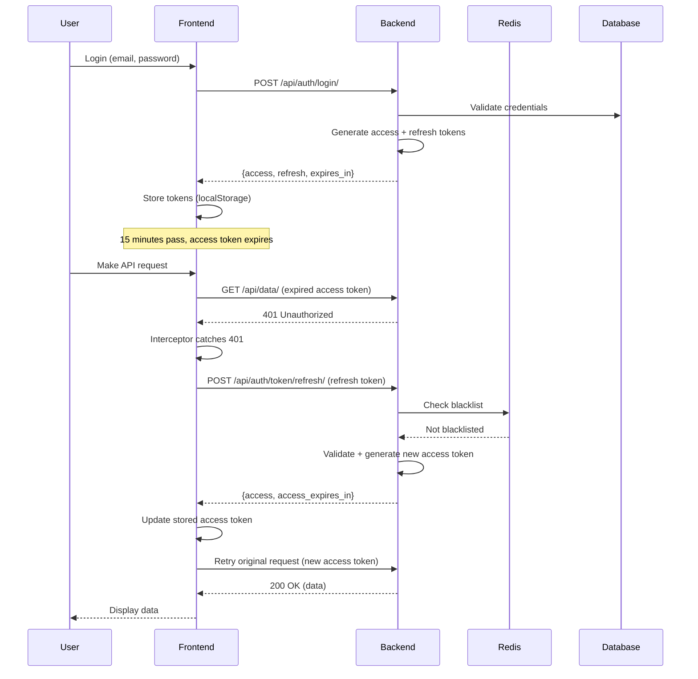
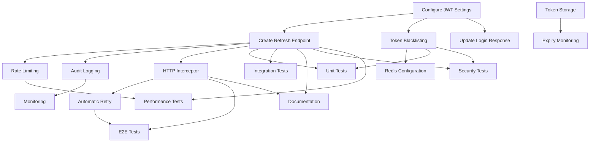

# US-4: JWT Token Refresh

**Priority**: P0
**Feature**: authentication
**Status**: To Do
**Estimated Effort**: 48 hours (5-6 days)

## Overview

This User Story implements the JWT token refresh mechanism to enable users to maintain authenticated sessions without re-entering credentials. The system uses short-lived access tokens (15 minutes) for security and long-lived refresh tokens (7 days) for user convenience. The frontend automatically handles token refresh transparently using HTTP interceptors.

### Context

JWT token refresh is critical for:
- **Security**: Short access token lifetimes minimize exposure from token theft
- **User Experience**: Users stay logged in without frequent re-authentication
- **Scalability**: Stateless token validation enables horizontal scaling
- **Enterprise Readiness**: Standard OAuth 2.0 pattern familiar to enterprise users

This is a foundational authentication feature (P0) that must be implemented before other features requiring long-lived sessions (subscriptions, reports, recommendations).

### Decomposition Approach

The implementation is decomposed into **18 tasks** organized into 4 categories:

- **Backend**: 7 tasks - JWT configuration, API endpoint, validation, rate limiting, audit logging
- **Frontend**: 4 tasks - HTTP interceptor, token storage, automatic retry, expiry monitoring
- **Testing**: 5 tasks - Unit, integration, E2E, security, performance tests
- **Infrastructure**: 2 tasks - Documentation and monitoring

**Key Dependencies**:
- Depends on US-3 (Standard User Login) for initial token issuance
- Blocks US-5 through US-13 (all features requiring authenticated sessions)

---

## Task Summary

| ID | Title | Type | Specialty | Effort | Dependencies | Status |
|----|-------|------|-----------|--------|--------------|--------|
| TASK-4.1 | Configure djangorestframework-simplejwt | Backend | Config | 3h | None | ⬜ |
| TASK-4.2 | Create Token Refresh API Endpoint | Backend | API | 4h | TASK-4.1 | ⬜ |
| TASK-4.3 | Implement Token Blacklisting Logic | Backend | Security | 5h | TASK-4.1 | ⬜ |
| TASK-4.4 | Add Rate Limiting for Refresh Endpoint | Backend | Security | 3h | TASK-4.2 | ⬜ |
| TASK-4.5 | Create Token Refresh Audit Logging | Backend | API | 3h | TASK-4.2 | ⬜ |
| TASK-4.6 | Update Login Endpoint with Token Expiry | Backend | API | 2h | TASK-4.1 | ⬜ |
| TASK-4.7 | Configure Redis for Token Blacklist | Backend | Config | 2h | TASK-4.3 | ⬜ |
| TASK-4.8 | Create HTTP Interceptor for Token Refresh | Frontend | API | 5h | TASK-4.2 | ⬜ |
| TASK-4.9 | Implement Token Storage Logic | Frontend | Component | 3h | None | ⬜ |
| TASK-4.10 | Add Automatic Retry on 401 | Frontend | API | 4h | TASK-4.8 | ⬜ |
| TASK-4.11 | Create Token Expiry Monitoring | Frontend | Component | 3h | TASK-4.9 | ⬜ |
| TASK-4.12 | Unit Tests for Token Validation | Testing | Unit | 3h | TASK-4.2, TASK-4.3 | ⬜ |
| TASK-4.13 | Integration Tests for Refresh Endpoint | Testing | Integration | 4h | TASK-4.2 | ⬜ |
| TASK-4.14 | E2E Tests for Automatic Refresh Flow | Testing | E2E | 5h | TASK-4.8, TASK-4.10 | ⬜ |
| TASK-4.15 | Security Tests for Token Tampering | Testing | Security | 3h | TASK-4.2, TASK-4.3 | ⬜ |
| TASK-4.16 | Performance Tests for Concurrent Refresh | Testing | Integration | 3h | TASK-4.2, TASK-4.4 | ⬜ |
| TASK-4.17 | Document Token Refresh Flow | Infrastructure | Documentation | 2h | TASK-4.2, TASK-4.8 | ⬜ |
| TASK-4.18 | Add Monitoring for Token Refresh | Infrastructure | Config | 2h | TASK-4.5 | ⬜ |

---

## Task Details

### 🔧 Backend Tasks

#### TASK-4.1: Configure djangorestframework-simplejwt

**Type**: Backend - Config
**Priority**: P1
**Estimated Effort**: 3 hours

##### Description

Configure Django REST Framework Simple JWT with project-specific settings including token lifetimes (15-minute access, 7-day refresh), signing algorithm (HS256), blacklist app, and token claims. This establishes the JWT foundation for all authentication endpoints.

##### Files Impacted

- `backend/config/settings.py` (modified) - Add SIMPLE_JWT configuration
- `backend/requirements.txt` or `pyproject.toml` (modified) - Add djangorestframework-simplejwt dependency
- `backend/config/settings/base.py` (modified) - Configure INSTALLED_APPS with token_blacklist

##### Acceptance Criteria

- [ ] djangorestframework-simplejwt library installed (version 5.2+)
- [ ] SIMPLE_JWT settings configured with correct token lifetimes
- [ ] Signing algorithm set to HS256 with secure secret key (min 256 bits)
- [ ] Token blacklist app enabled in INSTALLED_APPS
- [ ] Custom token claims configured (user_id, email)
- [ ] Rotating refresh tokens disabled (use blacklist instead)
- [ ] Token verification configured with audience and issuer checks

##### Dependencies

None - Foundation task

##### Implementation Notes

**Configuration Example**:
```python
# settings.py
from datetime import timedelta

INSTALLED_APPS = [
    ...
    'rest_framework_simplejwt',
    'rest_framework_simplejwt.token_blacklist',
]

SIMPLE_JWT = {
    'ACCESS_TOKEN_LIFETIME': timedelta(minutes=15),
    'REFRESH_TOKEN_LIFETIME': timedelta(days=7),
    'ROTATE_REFRESH_TOKENS': False,
    'BLACKLIST_AFTER_ROTATION': True,
    'ALGORITHM': 'HS256',
    'SIGNING_KEY': env('JWT_SECRET_KEY'),  # Separate from Django SECRET_KEY
    'VERIFYING_KEY': None,
    'AUTH_HEADER_TYPES': ('Bearer',),
    'USER_ID_FIELD': 'id',
    'USER_ID_CLAIM': 'user_id',
    'AUTH_TOKEN_CLASSES': ('rest_framework_simplejwt.tokens.AccessToken',),
    'TOKEN_TYPE_CLAIM': 'token_type',
    'JTI_CLAIM': 'jti',  # JWT ID for blacklisting
}
```

**Security Considerations**:
- Use a separate JWT_SECRET_KEY from Django SECRET_KEY
- Store secret key in environment variable, never in code
- Minimum key length: 256 bits (32 characters)
- Use cryptographically secure random generation for key

---

#### TASK-4.2: Create Token Refresh API Endpoint

**Type**: Backend - API
**Priority**: P1
**Estimated Effort**: 4 hours

##### Description

Implement REST API endpoint `POST /api/auth/token/refresh/` that accepts a valid refresh token and returns a new access token. Extend djangorestframework-simplejwt's TokenRefreshView with custom validation, error handling, and response formatting. Include access token expiry time in response.

##### Files Impacted

- `backend/apps/accounts/views.py` (modified) - Create CustomTokenRefreshView
- `backend/apps/accounts/urls.py` (modified) - Add token refresh route
- `backend/apps/accounts/serializers.py` (modified) - Create CustomTokenRefreshSerializer

##### Acceptance Criteria

- [ ] POST /api/auth/token/refresh/ endpoint created
- [ ] Accepts JSON body with "refresh" field containing refresh token
- [ ] Returns new access token with expiry time
- [ ] Returns 401 if refresh token is invalid, expired, or blacklisted
- [ ] Returns 400 if request format is invalid
- [ ] Response includes access_expires_in field (seconds until expiry)
- [ ] Endpoint accessible without authentication (uses refresh token)
- [ ] CORS configured for frontend domain

##### Dependencies

- TASK-4.1 (JWT configuration must be complete)

##### Implementation Notes

**Endpoint Specification**:
```
POST /api/auth/token/refresh/
Content-Type: application/json

Request:
{
  "refresh": "eyJ0eXAiOiJKV1QiLCJhbGciOiJIUzI1NiJ9..."
}

Response (200 OK):
{
  "access": "eyJ0eXAiOiJKV1QiLCJhbGciOiJIUzI1NiJ9...",
  "access_expires_in": 900  // seconds (15 minutes)
}

Error Response (401 Unauthorized):
{
  "error": "token_not_valid",
  "message": "Token is invalid or expired",
  "code": "token_not_valid"
}

Error Response (400 Bad Request):
{
  "error": "invalid_request",
  "message": "Refresh token is required",
  "details": {
    "refresh": ["This field is required."]
  }
}
```

**Implementation Example**:
```python
from rest_framework_simplejwt.views import TokenRefreshView
from rest_framework_simplejwt.serializers import TokenRefreshSerializer
from rest_framework_simplejwt.exceptions import TokenError, InvalidToken
from rest_framework.response import Response
from rest_framework import status
from datetime import datetime

class CustomTokenRefreshSerializer(TokenRefreshSerializer):
    def validate(self, attrs):
        data = super().validate(attrs)

        # Add access token expiry time
        access_token = self.token_class(data['access'])
        exp_timestamp = access_token['exp']
        current_timestamp = datetime.now().timestamp()
        expires_in = int(exp_timestamp - current_timestamp)

        data['access_expires_in'] = expires_in
        return data

class CustomTokenRefreshView(TokenRefreshView):
    serializer_class = CustomTokenRefreshSerializer

    def post(self, request, *args, **kwargs):
        serializer = self.get_serializer(data=request.data)

        try:
            serializer.is_valid(raise_exception=True)
        except TokenError as e:
            raise InvalidToken(e.args[0])

        return Response(serializer.validated_data, status=status.HTTP_200_OK)
```

**Error Handling**:
- Invalid token format → 401 with "token_not_valid"
- Expired refresh token → 401 with "token_not_valid"
- Blacklisted token → 401 with "token_not_valid"
- Missing refresh field → 400 with field error
- Malformed JSON → 400 with parse error

---

#### TASK-4.3: Implement Token Blacklisting Logic

**Type**: Backend - Security
**Priority**: P1
**Estimated Effort**: 5 hours

##### Description

Implement token blacklisting mechanism using djangorestframework-simplejwt's token_blacklist app to support logout functionality. When users log out, their refresh token is blacklisted preventing further use. Access tokens remain valid until expiry (stateless design). Integrate with Redis for fast blacklist checks.

##### Files Impacted

- `backend/apps/accounts/views.py` (modified) - Create LogoutView with blacklisting
- `backend/apps/accounts/models.py` (modified) - Add custom methods if needed
- `backend/apps/accounts/serializers.py` (modified) - Create LogoutSerializer

##### Acceptance Criteria

- [ ] Logout endpoint blacklists refresh token on user logout
- [ ] Blacklisted tokens cannot be used to obtain new access tokens
- [ ] Token blacklist check occurs on every refresh request
- [ ] Blacklist entries include token JTI, user ID, expiry timestamp
- [ ] Expired tokens automatically removed from blacklist (cleanup task)
- [ ] Blacklist checks optimized with Redis caching
- [ ] Blacklisting is atomic (no race conditions)

##### Dependencies

- TASK-4.1 (JWT configuration with blacklist app)

##### Implementation Notes

**Blacklisting Strategy**:
- Use djangorestframework-simplejwt's `OutstandingToken` and `BlacklistedToken` models
- Store token JTI (JWT ID) in blacklist, not full token
- Redis cache for fast blacklist lookups (avoid DB hit on every refresh)
- Automatic cleanup of expired tokens via Celery periodic task

**Implementation Example**:
```python
from rest_framework.views import APIView
from rest_framework.response import Response
from rest_framework import status
from rest_framework.permissions import IsAuthenticated
from rest_framework_simplejwt.tokens import RefreshToken
from rest_framework_simplejwt.token_blacklist.models import OutstandingToken, BlacklistedToken

class LogoutView(APIView):
    permission_classes = [IsAuthenticated]

    def post(self, request):
        try:
            refresh_token = request.data.get('refresh')
            if not refresh_token:
                return Response({
                    'error': 'invalid_request',
                    'message': 'Refresh token is required'
                }, status=status.HTTP_400_BAD_REQUEST)

            # Blacklist the refresh token
            token = RefreshToken(refresh_token)
            token.blacklist()

            return Response({
                'message': 'Logout successful'
            }, status=status.HTTP_200_OK)

        except Exception as e:
            return Response({
                'error': 'token_not_valid',
                'message': 'Token is invalid or already blacklisted'
            }, status=status.HTTP_400_BAD_REQUEST)
```

**Database Schema** (auto-created by token_blacklist app):
```python
# Outstanding tokens (all issued tokens)
class OutstandingToken(models.Model):
    user = models.ForeignKey(User, on_delete=models.SET_NULL, null=True, blank=True)
    jti = models.CharField(unique=True, max_length=255)  # JWT ID
    token = models.TextField()
    created_at = models.DateTimeField(auto_now_add=True)
    expires_at = models.DateTimeField()

# Blacklisted tokens
class BlacklistedToken(models.Model):
    token = models.OneToOneField(OutstandingToken, on_delete=models.CASCADE)
    blacklisted_at = models.DateTimeField(auto_now_add=True)
```

**Redis Caching Strategy**:
```python
# Cache blacklist status for 15 minutes (access token lifetime)
from django.core.cache import cache

def is_token_blacklisted(jti):
    cache_key = f'token_blacklist:{jti}'
    cached = cache.get(cache_key)

    if cached is not None:
        return cached

    # Check database
    is_blacklisted = BlacklistedToken.objects.filter(
        token__jti=jti
    ).exists()

    # Cache result for 15 minutes
    cache.set(cache_key, is_blacklisted, 900)
    return is_blacklisted
```

**Cleanup Task** (Celery Beat):
```python
from celery import shared_task
from django.utils import timezone
from rest_framework_simplejwt.token_blacklist.models import OutstandingToken

@shared_task
def cleanup_expired_tokens():
    """Remove expired tokens from outstanding tokens table"""
    count = OutstandingToken.objects.filter(
        expires_at__lt=timezone.now()
    ).delete()
    return f"Cleaned up {count[0]} expired tokens"
```

---

#### TASK-4.4: Add Rate Limiting for Refresh Endpoint

**Type**: Backend - Security
**Priority**: P1
**Estimated Effort**: 3 hours

##### Description

Implement rate limiting on the token refresh endpoint to prevent abuse and brute force attacks. Limit refresh attempts to 10 per refresh token per minute using Redis-backed rate limiting. Return 429 status code when rate limit exceeded.

##### Files Impacted

- `backend/apps/accounts/throttles.py` (new) - Create custom throttle class
- `backend/apps/accounts/views.py` (modified) - Apply throttle to refresh view
- `backend/config/settings.py` (modified) - Configure DRF throttling

##### Acceptance Criteria

- [ ] Rate limiting applied to POST /api/auth/token/refresh/
- [ ] Limit: 10 refresh requests per refresh token per minute
- [ ] Rate limit keyed by refresh token JTI (not IP address)
- [ ] Returns 429 Too Many Requests when limit exceeded
- [ ] Response includes Retry-After header with seconds to wait
- [ ] Rate limiting uses Redis for distributed environment support
- [ ] Rate limit counters reset after 1 minute window

##### Dependencies

- TASK-4.2 (Token refresh endpoint must exist)

##### Implementation Notes

**Rate Limiting Strategy**:
- Use Django REST Framework's throttling with custom throttle class
- Key by refresh token JTI (extracted from token before validation)
- Use Redis for atomic increment operations
- 1-minute sliding window

**Implementation Example**:
```python
# throttles.py
from rest_framework.throttling import SimpleRateThrottle
from rest_framework_simplejwt.tokens import RefreshToken
from django.core.cache import cache

class RefreshTokenThrottle(SimpleRateThrottle):
    scope = 'refresh_token'
    rate = '10/min'  # 10 requests per minute

    def get_cache_key(self, request, view):
        # Extract JTI from refresh token
        refresh_token_str = request.data.get('refresh')
        if not refresh_token_str:
            return None

        try:
            token = RefreshToken(refresh_token_str)
            jti = token['jti']
            return f'throttle_refresh_{jti}'
        except:
            # Invalid token, let validation handle it
            return None

# views.py
from rest_framework.throttling import AnonRateThrottle

class CustomTokenRefreshView(TokenRefreshView):
    throttle_classes = [RefreshTokenThrottle]

    def handle_exception(self, exc):
        if isinstance(exc, Throttled):
            return Response({
                'error': 'rate_limit_exceeded',
                'message': 'Too many refresh attempts. Please try again later.',
                'retry_after': int(exc.wait)
            }, status=status.HTTP_429_TOO_MANY_REQUESTS)
        return super().handle_exception(exc)
```

**Settings Configuration**:
```python
# settings.py
REST_FRAMEWORK = {
    'DEFAULT_THROTTLE_RATES': {
        'refresh_token': '10/min',
    }
}
```

**Response Example** (429):
```json
{
  "error": "rate_limit_exceeded",
  "message": "Too many refresh attempts. Please try again later.",
  "retry_after": 45
}
```
Headers:
```
HTTP/1.1 429 Too Many Requests
Retry-After: 45
Content-Type: application/json
```

---

#### TASK-4.5: Create Token Refresh Audit Logging

**Type**: Backend - API
**Priority**: P2
**Estimated Effort**: 3 hours

##### Description

Implement audit logging for all token refresh attempts (successful and failed) to support security monitoring and incident investigation. Log token refresh events with user ID, IP address, user agent, timestamp, and success/failure status. Store logs in database for long-term retention and analysis.

##### Files Impacted

- `backend/apps/accounts/models.py` (modified) - Create TokenRefreshLog model
- `backend/apps/accounts/views.py` (modified) - Add logging to refresh view
- `backend/apps/accounts/admin.py` (modified) - Register log model in admin

##### Acceptance Criteria

- [ ] TokenRefreshLog model created with all required fields
- [ ] Every token refresh attempt logged (success and failure)
- [ ] Logs include: user_id, ip_address, user_agent, timestamp, success status, error_code
- [ ] Failed attempts log error reason (expired, invalid, blacklisted, rate limited)
- [ ] Logs accessible via Django Admin for security team
- [ ] Log retention policy configurable (default: 90 days)
- [ ] Logging does not impact refresh endpoint performance (<10ms overhead)

##### Dependencies

- TASK-4.2 (Token refresh endpoint must exist)

##### Implementation Notes

**Database Model**:
```python
# models.py
from django.db import models
from django.contrib.auth import get_user_model

User = get_user_model()

class TokenRefreshLog(models.Model):
    SUCCESS = 'success'
    FAILURE = 'failure'
    STATUS_CHOICES = [
        (SUCCESS, 'Success'),
        (FAILURE, 'Failure'),
    ]

    user = models.ForeignKey(User, on_delete=models.SET_NULL, null=True, blank=True)
    ip_address = models.GenericIPAddressField()
    user_agent = models.CharField(max_length=255)
    timestamp = models.DateTimeField(auto_now_add=True)
    status = models.CharField(max_length=10, choices=STATUS_CHOICES)
    error_code = models.CharField(max_length=50, null=True, blank=True)
    error_message = models.TextField(null=True, blank=True)
    refresh_token_jti = models.CharField(max_length=255, null=True, blank=True)

    class Meta:
        db_table = 'token_refresh_logs'
        indexes = [
            models.Index(fields=['user', 'timestamp']),
            models.Index(fields=['status', 'timestamp']),
            models.Index(fields=['timestamp']),
        ]
        ordering = ['-timestamp']

    def __str__(self):
        return f"{self.user} - {self.status} - {self.timestamp}"
```

**Logging Implementation**:
```python
# views.py
from .models import TokenRefreshLog
from ipware import get_client_ip

class CustomTokenRefreshView(TokenRefreshView):
    def post(self, request, *args, **kwargs):
        # Extract request metadata
        ip_address, _ = get_client_ip(request)
        user_agent = request.META.get('HTTP_USER_AGENT', '')[:255]

        try:
            # Attempt token refresh
            serializer = self.get_serializer(data=request.data)
            serializer.is_valid(raise_exception=True)

            # Extract user from refresh token
            refresh_token = RefreshToken(request.data.get('refresh'))
            user_id = refresh_token.get('user_id')
            jti = refresh_token.get('jti')

            # Log success (async to avoid blocking)
            TokenRefreshLog.objects.create(
                user_id=user_id,
                ip_address=ip_address,
                user_agent=user_agent,
                status=TokenRefreshLog.SUCCESS,
                refresh_token_jti=jti
            )

            return Response(serializer.validated_data, status=status.HTTP_200_OK)

        except TokenError as e:
            # Log failure
            TokenRefreshLog.objects.create(
                ip_address=ip_address,
                user_agent=user_agent,
                status=TokenRefreshLog.FAILURE,
                error_code='token_not_valid',
                error_message=str(e)
            )
            raise InvalidToken(e.args[0])
```

**Django Admin Configuration**:
```python
# admin.py
from django.contrib import admin
from .models import TokenRefreshLog

@admin.register(TokenRefreshLog)
class TokenRefreshLogAdmin(admin.ModelAdmin):
    list_display = ['timestamp', 'user', 'ip_address', 'status', 'error_code']
    list_filter = ['status', 'timestamp', 'error_code']
    search_fields = ['user__email', 'ip_address', 'user_agent']
    readonly_fields = ['timestamp', 'user', 'ip_address', 'user_agent', 'status', 'error_code', 'error_message']
    date_hierarchy = 'timestamp'

    def has_add_permission(self, request):
        return False  # Logs are auto-generated

    def has_change_permission(self, request, obj=None):
        return False  # Logs are immutable
```

**Cleanup Task** (Optional):
```python
@shared_task
def cleanup_old_refresh_logs():
    """Remove logs older than 90 days"""
    from datetime import timedelta
    from django.utils import timezone

    cutoff_date = timezone.now() - timedelta(days=90)
    count = TokenRefreshLog.objects.filter(timestamp__lt=cutoff_date).delete()
    return f"Deleted {count[0]} old refresh logs"
```

---

#### TASK-4.6: Update Login Endpoint with Token Expiry

**Type**: Backend - API
**Priority**: P1
**Estimated Effort**: 2 hours

##### Description

Update the standard login endpoint (from US-3) to include access token and refresh token expiry times in the response. This allows the frontend to schedule token refresh proactively before expiry. Return expiry as both absolute timestamp and relative seconds.

##### Files Impacted

- `backend/apps/accounts/views.py` (modified) - Update LoginView response
- `backend/apps/accounts/serializers.py` (modified) - Update login serializer

##### Acceptance Criteria

- [ ] Login endpoint returns access_expires_in (seconds)
- [ ] Login endpoint returns refresh_expires_in (seconds)
- [ ] Login endpoint returns access_expires_at (ISO 8601 timestamp)
- [ ] Login endpoint returns refresh_expires_at (ISO 8601 timestamp)
- [ ] Expiry times calculated from token claims
- [ ] Response format consistent with refresh endpoint
- [ ] Backward compatible (existing fields unchanged)

##### Dependencies

- TASK-4.1 (JWT configuration with token lifetimes)

##### Implementation Notes

**Updated Login Response**:
```json
{
  "access": "eyJ0eXAiOiJKV1QiLCJhbGciOiJIUzI1NiJ9...",
  "refresh": "eyJ0eXAiOiJKV1QiLCJhbGciOiJIUzI1NiJ9...",
  "access_expires_in": 900,
  "refresh_expires_in": 604800,
  "access_expires_at": "2025-01-27T15:45:00Z",
  "refresh_expires_at": "2025-02-03T15:30:00Z",
  "user": {
    "id": 123,
    "email": "user@example.com",
    "first_name": "John",
    "last_name": "Doe"
  }
}
```

**Implementation Example**:
```python
# serializers.py
from rest_framework_simplejwt.tokens import RefreshToken
from datetime import datetime

class LoginSerializer(serializers.Serializer):
    email = serializers.EmailField()
    password = serializers.CharField(write_only=True)

    def validate(self, attrs):
        # ... existing authentication logic ...

        # Generate tokens
        refresh = RefreshToken.for_user(user)
        access = refresh.access_token

        # Calculate expiry times
        access_exp = access['exp']
        refresh_exp = refresh['exp']
        current_time = datetime.now().timestamp()

        access_expires_in = int(access_exp - current_time)
        refresh_expires_in = int(refresh_exp - current_time)

        access_expires_at = datetime.fromtimestamp(access_exp).isoformat() + 'Z'
        refresh_expires_at = datetime.fromtimestamp(refresh_exp).isoformat() + 'Z'

        return {
            'access': str(access),
            'refresh': str(refresh),
            'access_expires_in': access_expires_in,
            'refresh_expires_in': refresh_expires_in,
            'access_expires_at': access_expires_at,
            'refresh_expires_at': refresh_expires_at,
            'user': {
                'id': user.id,
                'email': user.email,
                'first_name': user.first_name,
                'last_name': user.last_name,
            }
        }
```

---

#### TASK-4.7: Configure Redis for Token Blacklist

**Type**: Backend - Config
**Priority**: P2
**Estimated Effort**: 2 hours

##### Description

Configure Django to use Redis as the cache backend for token blacklist lookups and rate limiting. This improves performance by avoiding database queries on every token refresh. Set up Redis connection, configure cache settings, and verify connectivity.

##### Files Impacted

- `backend/config/settings.py` (modified) - Add Redis cache configuration
- `backend/requirements.txt` or `pyproject.toml` (modified) - Add redis and django-redis
- `backend/docker-compose.yml` (modified) - Ensure Redis service configured

##### Acceptance Criteria

- [ ] Redis cache backend configured in Django settings
- [ ] django-redis library installed and configured
- [ ] Cache used for token blacklist lookups
- [ ] Cache used for rate limiting counters
- [ ] Redis connection pool configured (min 10, max 50 connections)
- [ ] Cache keys have appropriate TTL (15 minutes for blacklist checks)
- [ ] Redis connectivity verified on application startup
- [ ] Graceful fallback to database if Redis unavailable

##### Dependencies

- TASK-4.3 (Token blacklisting logic must exist)

##### Implementation Notes

**Redis Configuration**:
```python
# settings.py
CACHES = {
    'default': {
        'BACKEND': 'django_redis.cache.RedisCache',
        'LOCATION': env('REDIS_URL', default='redis://redis:6379/1'),
        'OPTIONS': {
            'CLIENT_CLASS': 'django_redis.client.DefaultClient',
            'CONNECTION_POOL_KWARGS': {
                'max_connections': 50,
                'retry_on_timeout': True,
            },
            'SOCKET_CONNECT_TIMEOUT': 5,
            'SOCKET_TIMEOUT': 5,
        },
        'KEY_PREFIX': 'auth',
        'TIMEOUT': 900,  # 15 minutes default
    }
}

# Use Redis for session storage (optional)
SESSION_ENGINE = 'django.contrib.sessions.backends.cache'
SESSION_CACHE_ALIAS = 'default'
```

**Dependencies**:
```toml
# pyproject.toml
[tool.poetry.dependencies]
django-redis = "^5.2.0"
redis = "^4.5.0"
```

**Docker Compose** (should already exist from US-1):
```yaml
services:
  redis:
    image: redis:7-alpine
    ports:
      - "6379:6379"
    volumes:
      - redis_data:/data
    healthcheck:
      test: ["CMD", "redis-cli", "ping"]
      interval: 5s
      timeout: 3s
      retries: 5
```

**Health Check**:
```python
# utils.py
from django.core.cache import cache
from django.core.cache.backends.base import InvalidCacheBackendError

def check_redis_connection():
    """Verify Redis connection on startup"""
    try:
        cache.set('health_check', 'ok', 10)
        value = cache.get('health_check')
        if value == 'ok':
            return True
        return False
    except (ConnectionError, InvalidCacheBackendError) as e:
        # Log error but don't crash
        logger.error(f"Redis connection failed: {e}")
        return False
```

---

### 🎨 Frontend Tasks

#### TASK-4.8: Create HTTP Interceptor for Token Refresh

**Type**: Frontend - API
**Priority**: P1
**Estimated Effort**: 5 hours

##### Description

Implement Axios HTTP interceptor that automatically refreshes expired access tokens when receiving 401 responses. The interceptor extracts the refresh token from storage, calls the refresh endpoint, updates the stored access token, and retries the original failed request transparently to the user.

##### Files Impacted

- `frontend/src/api/axiosInstance.js` (new) - Create configured Axios instance with interceptors
- `frontend/src/api/authApi.js` (modified) - Add token refresh API call
- `frontend/src/utils/tokenManager.js` (new) - Token storage and retrieval utilities

##### Acceptance Criteria

- [ ] Axios response interceptor catches 401 errors
- [ ] Interceptor calls POST /api/auth/token/refresh/ with refresh token
- [ ] New access token stored in memory and/or localStorage
- [ ] Original failed request automatically retried with new token
- [ ] Multiple simultaneous 401s handled with single refresh (prevent race condition)
- [ ] If refresh fails (401), redirect user to login page
- [ ] Interceptor handles refresh token expiry gracefully
- [ ] Loading states updated appropriately during refresh

##### Dependencies

- TASK-4.2 (Token refresh endpoint must exist)

##### Implementation Notes

**Axios Instance with Interceptor**:
```javascript
// src/api/axiosInstance.js
import axios from 'axios';
import { getAccessToken, getRefreshToken, setAccessToken, clearTokens } from '../utils/tokenManager';
import { refreshAccessToken } from './authApi';

const API_BASE_URL = import.meta.env.VITE_API_BASE_URL || 'http://localhost:8000';

const axiosInstance = axios.create({
  baseURL: API_BASE_URL,
  headers: {
    'Content-Type': 'application/json',
  },
});

// Flag to prevent multiple simultaneous refresh attempts
let isRefreshing = false;
let refreshSubscribers = [];

// Notify all subscribers when refresh completes
function onRefreshed(newAccessToken) {
  refreshSubscribers.forEach(callback => callback(newAccessToken));
  refreshSubscribers = [];
}

// Add subscriber to be notified when refresh completes
function addRefreshSubscriber(callback) {
  refreshSubscribers.push(callback);
}

// Request interceptor: Add access token to all requests
axiosInstance.interceptors.request.use(
  (config) => {
    const accessToken = getAccessToken();
    if (accessToken) {
      config.headers.Authorization = `Bearer ${accessToken}`;
    }
    return config;
  },
  (error) => Promise.reject(error)
);

// Response interceptor: Handle 401 and refresh token
axiosInstance.interceptors.response.use(
  (response) => response,
  async (error) => {
    const originalRequest = error.config;

    // If error is not 401 or request already retried, reject
    if (error.response?.status !== 401 || originalRequest._retry) {
      return Promise.reject(error);
    }

    // If already refreshing, queue this request
    if (isRefreshing) {
      return new Promise((resolve) => {
        addRefreshSubscriber((newAccessToken) => {
          originalRequest.headers.Authorization = `Bearer ${newAccessToken}`;
          resolve(axiosInstance(originalRequest));
        });
      });
    }

    // Mark request as retried
    originalRequest._retry = true;
    isRefreshing = true;

    try {
      const refreshToken = getRefreshToken();
      if (!refreshToken) {
        throw new Error('No refresh token available');
      }

      // Call refresh endpoint
      const { access, access_expires_in } = await refreshAccessToken(refreshToken);

      // Store new access token
      setAccessToken(access, access_expires_in);

      // Notify all queued requests
      onRefreshed(access);

      // Retry original request with new token
      originalRequest.headers.Authorization = `Bearer ${access}`;
      return axiosInstance(originalRequest);

    } catch (refreshError) {
      // Refresh failed, clear tokens and redirect to login
      clearTokens();
      window.location.href = '/login';
      return Promise.reject(refreshError);
    } finally {
      isRefreshing = false;
    }
  }
);

export default axiosInstance;
```

**Token Refresh API Call**:
```javascript
// src/api/authApi.js
import axios from 'axios';

const API_BASE_URL = import.meta.env.VITE_API_BASE_URL || 'http://localhost:8000';

/**
 * Refresh access token using refresh token
 * Note: Uses plain axios, not axiosInstance (to avoid circular interceptor calls)
 */
export async function refreshAccessToken(refreshToken) {
  try {
    const response = await axios.post(`${API_BASE_URL}/api/auth/token/refresh/`, {
      refresh: refreshToken,
    });

    return response.data; // { access, access_expires_in }
  } catch (error) {
    // Refresh token invalid or expired
    throw new Error('Token refresh failed');
  }
}
```

**Token Manager Utility** (partial, full version in TASK-4.9):
```javascript
// src/utils/tokenManager.js
export function getAccessToken() {
  // Get from memory or localStorage
  return localStorage.getItem('access_token');
}

export function getRefreshToken() {
  return localStorage.getItem('refresh_token');
}

export function setAccessToken(token, expiresIn) {
  localStorage.setItem('access_token', token);
  localStorage.setItem('access_token_expires_at', Date.now() + expiresIn * 1000);
}

export function clearTokens() {
  localStorage.removeItem('access_token');
  localStorage.removeItem('refresh_token');
  localStorage.removeItem('access_token_expires_at');
  localStorage.removeItem('refresh_token_expires_at');
}
```

**Key Design Patterns**:
- **Single Refresh**: Use `isRefreshing` flag to prevent multiple simultaneous refresh calls
- **Request Queuing**: Queue failed requests and replay after refresh
- **Circular Dependency**: Use plain axios for refresh call (not axiosInstance)
- **Graceful Failure**: Redirect to login if refresh fails

---

#### TASK-4.9: Implement Token Storage Logic

**Type**: Frontend - Component
**Priority**: P1
**Estimated Effort**: 3 hours

##### Description

Create secure token storage utility that manages access and refresh tokens in browser storage. Implement hybrid storage strategy: in-memory for access tokens (most secure) with localStorage fallback for refresh tokens (persistent across tabs). Include token expiry tracking and validation.

##### Files Impacted

- `frontend/src/utils/tokenManager.js` (new) - Complete token storage utility
- `frontend/src/contexts/AuthContext.jsx` (modified) - Integrate token manager

##### Acceptance Criteria

- [ ] Tokens stored securely (refresh in localStorage, access in memory preferred)
- [ ] Token expiry times stored alongside tokens
- [ ] Utility provides getAccessToken(), getRefreshToken() functions
- [ ] Utility provides setTokens() function to save both tokens
- [ ] Utility provides clearTokens() function for logout
- [ ] Utility provides isAccessTokenExpired() check
- [ ] Tokens automatically cleared on expiry
- [ ] No sensitive data logged or exposed in console
- [ ] Works consistently across browser tabs (for refresh token)

##### Dependencies

None - Foundation task

##### Implementation Notes

**Complete Token Manager**:
```javascript
// src/utils/tokenManager.js

// In-memory storage for access token (most secure, cleared on page reload)
let inMemoryAccessToken = null;

/**
 * Store tokens after login or refresh
 * @param {Object} tokens - { access, refresh, access_expires_in, refresh_expires_in }
 */
export function setTokens(tokens) {
  const { access, refresh, access_expires_in, refresh_expires_in } = tokens;

  // Store access token in memory
  inMemoryAccessToken = access;

  // Store access token expiry
  const accessExpiresAt = Date.now() + access_expires_in * 1000;
  localStorage.setItem('access_token_expires_at', accessExpiresAt.toString());

  // Store refresh token in localStorage (persistent)
  if (refresh) {
    localStorage.setItem('refresh_token', refresh);
    const refreshExpiresAt = Date.now() + refresh_expires_in * 1000;
    localStorage.setItem('refresh_token_expires_at', refreshExpiresAt.toString());
  }

  // Fallback: Store access token in localStorage for cross-tab consistency
  localStorage.setItem('access_token', access);
}

/**
 * Get access token (in-memory first, localStorage fallback)
 */
export function getAccessToken() {
  // Check if expired
  if (isAccessTokenExpired()) {
    return null;
  }

  // Return in-memory token if available
  if (inMemoryAccessToken) {
    return inMemoryAccessToken;
  }

  // Fallback to localStorage
  return localStorage.getItem('access_token');
}

/**
 * Get refresh token from localStorage
 */
export function getRefreshToken() {
  // Check if expired
  if (isRefreshTokenExpired()) {
    clearTokens();
    return null;
  }

  return localStorage.getItem('refresh_token');
}

/**
 * Update only access token (after refresh)
 * @param {string} accessToken - New access token
 * @param {number} expiresIn - Seconds until expiry
 */
export function setAccessToken(accessToken, expiresIn) {
  inMemoryAccessToken = accessToken;
  localStorage.setItem('access_token', accessToken);

  const expiresAt = Date.now() + expiresIn * 1000;
  localStorage.setItem('access_token_expires_at', expiresAt.toString());
}

/**
 * Check if access token is expired
 */
export function isAccessTokenExpired() {
  const expiresAt = localStorage.getItem('access_token_expires_at');
  if (!expiresAt) return true;

  // Add 30-second buffer to refresh proactively
  return Date.now() >= parseInt(expiresAt) - 30000;
}

/**
 * Check if refresh token is expired
 */
export function isRefreshTokenExpired() {
  const expiresAt = localStorage.getItem('refresh_token_expires_at');
  if (!expiresAt) return true;

  return Date.now() >= parseInt(expiresAt);
}

/**
 * Clear all tokens (logout)
 */
export function clearTokens() {
  inMemoryAccessToken = null;
  localStorage.removeItem('access_token');
  localStorage.removeItem('refresh_token');
  localStorage.removeItem('access_token_expires_at');
  localStorage.removeItem('refresh_token_expires_at');
}

/**
 * Get remaining time until access token expires (in seconds)
 */
export function getAccessTokenTimeRemaining() {
  const expiresAt = localStorage.getItem('access_token_expires_at');
  if (!expiresAt) return 0;

  const remaining = parseInt(expiresAt) - Date.now();
  return Math.max(0, Math.floor(remaining / 1000));
}
```

**Integration with Auth Context**:
```javascript
// src/contexts/AuthContext.jsx
import React, { createContext, useContext, useState, useEffect } from 'react';
import { setTokens, getAccessToken, clearTokens } from '../utils/tokenManager';
import { login as apiLogin } from '../api/authApi';

const AuthContext = createContext();

export function AuthProvider({ children }) {
  const [user, setUser] = useState(null);
  const [isAuthenticated, setIsAuthenticated] = useState(false);
  const [loading, setLoading] = useState(true);

  // Check authentication on mount
  useEffect(() => {
    const token = getAccessToken();
    if (token) {
      // Optionally decode JWT to get user info
      setIsAuthenticated(true);
    }
    setLoading(false);
  }, []);

  async function login(email, password) {
    const response = await apiLogin(email, password);
    setTokens(response); // Store access and refresh tokens
    setUser(response.user);
    setIsAuthenticated(true);
  }

  function logout() {
    clearTokens();
    setUser(null);
    setIsAuthenticated(false);
  }

  return (
    <AuthContext.Provider value={{ user, isAuthenticated, loading, login, logout }}>
      {children}
    </AuthContext.Provider>
  );
}

export function useAuth() {
  return useContext(AuthContext);
}
```

**Security Considerations**:
- **XSS Protection**: In-memory storage prevents XSS token theft (cleared on page reload)
- **CSRF Protection**: Tokens in Authorization header (not cookies) prevent CSRF
- **Expiry Buffer**: Check expiry 30 seconds early to refresh proactively
- **No Logging**: Never log tokens to console (security risk)

---

#### TASK-4.10: Add Automatic Retry on 401

**Type**: Frontend - API
**Priority**: P1
**Estimated Effort**: 4 hours

##### Description

Enhance the HTTP interceptor to handle edge cases in automatic token refresh: multiple simultaneous 401 responses, refresh failures, network errors during refresh, and user-facing error messages. Ensure seamless UX with loading states and graceful error recovery.

##### Files Impacted

- `frontend/src/api/axiosInstance.js` (modified) - Enhanced error handling
- `frontend/src/components/LoadingOverlay.jsx` (new) - Loading UI during refresh
- `frontend/src/hooks/useApiError.js` (new) - Centralized error handling

##### Acceptance Criteria

- [ ] Multiple simultaneous 401s result in single refresh call
- [ ] Failed requests queued and retried after successful refresh
- [ ] If refresh returns 401, user redirected to login immediately
- [ ] Network errors during refresh handled gracefully
- [ ] Loading overlay shown during token refresh (optional, <500ms)
- [ ] Error messages shown if refresh fails permanently
- [ ] Original request context preserved (method, headers, body)
- [ ] Infinite retry loops prevented (max 1 retry per request)

##### Dependencies

- TASK-4.8 (HTTP interceptor foundation must exist)

##### Implementation Notes

This task extends TASK-4.8 with additional error handling and UX improvements. The core interceptor logic from TASK-4.8 already handles most requirements. This task adds:

1. **Enhanced Error Handling**:
```javascript
// src/api/axiosInstance.js (additions to TASK-4.8 code)

axiosInstance.interceptors.response.use(
  (response) => response,
  async (error) => {
    const originalRequest = error.config;

    // Network error during refresh
    if (!error.response) {
      console.error('Network error:', error.message);
      // Optionally show user-friendly error
      return Promise.reject(new Error('Network error. Please check your connection.'));
    }

    // Not a 401, pass through
    if (error.response?.status !== 401) {
      return Promise.reject(error);
    }

    // Already retried, don't loop
    if (originalRequest._retry) {
      // Refresh failed or token invalid, redirect to login
      clearTokens();
      window.location.href = '/login?session_expired=true';
      return Promise.reject(error);
    }

    // ... rest of refresh logic from TASK-4.8 ...
  }
);
```

2. **Loading State Management** (optional):
```javascript
// src/contexts/AuthContext.jsx
export function AuthProvider({ children }) {
  const [isRefreshing, setIsRefreshing] = useState(false);

  // Expose isRefreshing to show loading UI
  // Interceptor can update this via event or context

  return (
    <AuthContext.Provider value={{ isRefreshing, ... }}>
      {isRefreshing && <LoadingOverlay message="Refreshing session..." />}
      {children}
    </AuthContext.Provider>
  );
}
```

3. **Error Toast/Notification**:
```javascript
// src/hooks/useApiError.js
import { useEffect } from 'react';
import { toast } from 'react-toastify'; // or your toast library

export function useApiError() {
  useEffect(() => {
    const interceptor = axiosInstance.interceptors.response.use(
      (response) => response,
      (error) => {
        if (error.response?.status === 401 && error.config._retry) {
          toast.error('Your session has expired. Please log in again.');
        }
        return Promise.reject(error);
      }
    );

    return () => axiosInstance.interceptors.response.eject(interceptor);
  }, []);
}
```

4. **Session Expiry URL Parameter**:
```javascript
// src/pages/LoginPage.jsx
import { useSearchParams } from 'react-router-dom';

function LoginPage() {
  const [searchParams] = useSearchParams();
  const sessionExpired = searchParams.get('session_expired');

  return (
    <div>
      {sessionExpired && (
        <Alert severity="warning">
          Your session has expired. Please log in again.
        </Alert>
      )}
      {/* Login form */}
    </div>
  );
}
```

**Testing Scenarios**:
- Single 401 → Token refresh → Request retry → Success
- Multiple simultaneous 401s → Single refresh → All requests retry → Success
- 401 → Token refresh fails (401) → Redirect to login
- 401 → Network error during refresh → Error message → Retry option
- 401 → Refresh token expired → Immediate redirect to login

---

#### TASK-4.11: Create Token Expiry Monitoring

**Type**: Frontend - Component
**Priority**: P2
**Estimated Effort**: 3 hours

##### Description

Implement proactive token refresh by monitoring access token expiry and refreshing the token 1-2 minutes before it expires. This prevents disruptive 401 errors during active user sessions. Use React hook with setInterval to check expiry and trigger refresh automatically.

##### Files Impacted

- `frontend/src/hooks/useTokenRefresh.js` (new) - Token monitoring hook
- `frontend/src/contexts/AuthContext.jsx` (modified) - Integrate proactive refresh
- `frontend/src/utils/tokenManager.js` (modified) - Add expiry check utilities

##### Acceptance Criteria

- [ ] Token expiry checked every 60 seconds while user authenticated
- [ ] Refresh triggered automatically 2 minutes before access token expires
- [ ] Proactive refresh does not interfere with interceptor-based refresh
- [ ] Refresh skipped if user inactive (no API calls in last 5 minutes)
- [ ] Hook starts on login, stops on logout
- [ ] No unnecessary refreshes (check before triggering)
- [ ] Error handling if proactive refresh fails (fall back to interceptor)

##### Dependencies

- TASK-4.9 (Token storage with expiry tracking)

##### Implementation Notes

**Token Refresh Hook**:
```javascript
// src/hooks/useTokenRefresh.js
import { useEffect, useRef } from 'react';
import { getAccessTokenTimeRemaining, getRefreshToken, setAccessToken } from '../utils/tokenManager';
import { refreshAccessToken } from '../api/authApi';

const REFRESH_THRESHOLD = 120; // Refresh 2 minutes before expiry
const CHECK_INTERVAL = 60000; // Check every 60 seconds

/**
 * Proactively refresh access token before expiry
 */
export function useTokenRefresh(isAuthenticated) {
  const intervalRef = useRef(null);
  const lastActivityRef = useRef(Date.now());

  useEffect(() => {
    if (!isAuthenticated) {
      // Clear interval on logout
      if (intervalRef.current) {
        clearInterval(intervalRef.current);
        intervalRef.current = null;
      }
      return;
    }

    // Track user activity
    const activityHandler = () => {
      lastActivityRef.current = Date.now();
    };

    window.addEventListener('mousemove', activityHandler);
    window.addEventListener('keydown', activityHandler);
    window.addEventListener('click', activityHandler);

    // Start monitoring token expiry
    intervalRef.current = setInterval(async () => {
      const timeRemaining = getAccessTokenTimeRemaining();

      // Check if user is active (activity in last 5 minutes)
      const timeSinceActivity = Date.now() - lastActivityRef.current;
      const isUserActive = timeSinceActivity < 5 * 60 * 1000;

      // Refresh if token expires soon and user is active
      if (timeRemaining <= REFRESH_THRESHOLD && timeRemaining > 0 && isUserActive) {
        try {
          const refreshToken = getRefreshToken();
          if (!refreshToken) {
            console.error('No refresh token available');
            return;
          }

          const { access, access_expires_in } = await refreshAccessToken(refreshToken);
          setAccessToken(access, access_expires_in);

          console.log('Token proactively refreshed');
        } catch (error) {
          console.error('Proactive token refresh failed:', error);
          // Interceptor will handle it on next API call
        }
      }
    }, CHECK_INTERVAL);

    return () => {
      if (intervalRef.current) {
        clearInterval(intervalRef.current);
      }
      window.removeEventListener('mousemove', activityHandler);
      window.removeEventListener('keydown', activityHandler);
      window.removeEventListener('click', activityHandler);
    };
  }, [isAuthenticated]);
}
```

**Integration with Auth Context**:
```javascript
// src/contexts/AuthContext.jsx
import { useTokenRefresh } from '../hooks/useTokenRefresh';

export function AuthProvider({ children }) {
  const [isAuthenticated, setIsAuthenticated] = useState(false);

  // Start proactive token refresh monitoring
  useTokenRefresh(isAuthenticated);

  // ... rest of AuthContext code ...
}
```

**Enhanced Token Manager** (additions):
```javascript
// src/utils/tokenManager.js

/**
 * Get remaining time until access token expires (in seconds)
 * Already implemented in TASK-4.9
 */
export function getAccessTokenTimeRemaining() {
  const expiresAt = localStorage.getItem('access_token_expires_at');
  if (!expiresAt) return 0;

  const remaining = parseInt(expiresAt) - Date.now();
  return Math.max(0, Math.floor(remaining / 1000));
}

/**
 * Check if token should be refreshed proactively
 * @param {number} thresholdSeconds - Seconds before expiry to trigger refresh
 */
export function shouldRefreshToken(thresholdSeconds = 120) {
  const remaining = getAccessTokenTimeRemaining();
  return remaining > 0 && remaining <= thresholdSeconds;
}
```

**Debugging Utility** (optional):
```javascript
// src/components/TokenDebugger.jsx (dev only)
import React, { useState, useEffect } from 'react';
import { getAccessTokenTimeRemaining } from '../utils/tokenManager';

export function TokenDebugger() {
  const [timeRemaining, setTimeRemaining] = useState(0);

  useEffect(() => {
    const interval = setInterval(() => {
      setTimeRemaining(getAccessTokenTimeRemaining());
    }, 1000);

    return () => clearInterval(interval);
  }, []);

  if (process.env.NODE_ENV !== 'development') {
    return null;
  }

  return (
    <div style={{ position: 'fixed', bottom: 10, right: 10, background: '#000', color: '#0f0', padding: '5px 10px', fontSize: '12px', borderRadius: '4px' }}>
      Token expires in: {Math.floor(timeRemaining / 60)}m {timeRemaining % 60}s
    </div>
  );
}
```

**Key Design Decisions**:
- **Activity-Based**: Only refresh if user active (saves unnecessary refreshes)
- **Threshold**: 2 minutes before expiry (balances proactivity with efficiency)
- **Check Interval**: Every 60 seconds (reasonable balance)
- **Fallback**: If proactive refresh fails, interceptor handles it on next API call

---

### ✅ Testing Tasks

#### TASK-4.12: Unit Tests for Token Validation

**Type**: Testing - Unit
**Priority**: P1
**Estimated Effort**: 3 hours

##### Description

Write comprehensive unit tests for token validation logic including token decoding, expiry checks, blacklist validation, and error handling. Test djangorestframework-simplejwt's token validation with various token states (valid, expired, malformed, blacklisted).

##### Files Impacted

- `backend/apps/accounts/tests/test_token_validation.py` (new) - Unit tests for token logic

##### Acceptance Criteria

- [ ] Test valid access token validation
- [ ] Test expired access token rejection
- [ ] Test malformed token rejection
- [ ] Test blacklisted token rejection
- [ ] Test refresh token validation
- [ ] Test token expiry calculation
- [ ] Test token claims extraction (user_id, email)
- [ ] All tests pass with >90% code coverage for token validation code

##### Dependencies

- TASK-4.2 (Token refresh endpoint)
- TASK-4.3 (Token blacklisting logic)

##### Implementation Notes

**Unit Tests**:
```python
# tests/test_token_validation.py
import pytest
from datetime import timedelta
from django.utils import timezone
from django.contrib.auth import get_user_model
from rest_framework_simplejwt.tokens import RefreshToken, AccessToken
from rest_framework_simplejwt.exceptions import TokenError
from rest_framework_simplejwt.token_blacklist.models import BlacklistedToken

User = get_user_model()

@pytest.fixture
def user(db):
    return User.objects.create_user(
        email='test@example.com',
        password='testpass123',
        first_name='Test',
        last_name='User'
    )

@pytest.fixture
def valid_tokens(user):
    refresh = RefreshToken.for_user(user)
    return {
        'refresh': str(refresh),
        'access': str(refresh.access_token),
        'refresh_obj': refresh,
        'access_obj': refresh.access_token
    }

class TestTokenValidation:

    def test_valid_access_token(self, valid_tokens):
        """Test that valid access token is accepted"""
        access_token_str = valid_tokens['access']
        token = AccessToken(access_token_str)

        assert token['user_id'] is not None
        assert token['token_type'] == 'access'

    def test_expired_access_token(self, user):
        """Test that expired access token is rejected"""
        # Create token with negative lifetime (already expired)
        refresh = RefreshToken.for_user(user)
        access = refresh.access_token

        # Manually set expiry to past
        access.set_exp(lifetime=timedelta(seconds=-10))

        with pytest.raises(TokenError):
            AccessToken(str(access))

    def test_malformed_token(self):
        """Test that malformed token is rejected"""
        malformed_token = "not.a.valid.jwt"

        with pytest.raises(TokenError):
            AccessToken(malformed_token)

    def test_blacklisted_refresh_token(self, valid_tokens):
        """Test that blacklisted refresh token is rejected"""
        refresh_obj = valid_tokens['refresh_obj']

        # Blacklist the token
        refresh_obj.blacklist()

        # Try to use blacklisted token
        with pytest.raises(TokenError):
            RefreshToken(valid_tokens['refresh'])

    def test_valid_refresh_token(self, valid_tokens):
        """Test that valid refresh token is accepted"""
        refresh_token_str = valid_tokens['refresh']
        token = RefreshToken(refresh_token_str)

        assert token['user_id'] is not None
        assert token['token_type'] == 'refresh'

    def test_token_expiry_calculation(self, valid_tokens):
        """Test that token expiry time is calculated correctly"""
        access_obj = valid_tokens['access_obj']

        exp_timestamp = access_obj['exp']
        current_timestamp = timezone.now().timestamp()

        # Access token should expire in approximately 15 minutes (900 seconds)
        time_until_expiry = exp_timestamp - current_timestamp
        assert 890 <= time_until_expiry <= 910  # Allow 10-second variance

    def test_token_claims_extraction(self, user, valid_tokens):
        """Test that token claims are correctly extracted"""
        access_obj = valid_tokens['access_obj']

        assert access_obj['user_id'] == user.id
        assert access_obj['token_type'] == 'access'
        assert 'exp' in access_obj
        assert 'jti' in access_obj  # JWT ID for blacklisting

    def test_token_without_user_id(self):
        """Test that token without user_id is rejected"""
        # Create token with missing user_id claim
        token = AccessToken()
        del token['user_id']

        # Validation should fail when user_id is missing
        # (Implementation may vary based on Simple JWT configuration)
        pass  # Placeholder for implementation-specific test
```

**Run Tests**:
```bash
docker-compose exec backend pytest apps/accounts/tests/test_token_validation.py -v
```

---

#### TASK-4.13: Integration Tests for Refresh Endpoint

**Type**: Testing - Integration
**Priority**: P1
**Estimated Effort**: 4 hours

##### Description

Write integration tests for the token refresh API endpoint testing the complete request-response cycle including valid requests, expired tokens, blacklisted tokens, rate limiting, and error responses. Use Django REST Framework's APIClient.

##### Files Impacted

- `backend/apps/accounts/tests/test_token_refresh_api.py` (new) - Integration tests for refresh endpoint

##### Acceptance Criteria

- [ ] Test successful token refresh with valid refresh token
- [ ] Test refresh with expired refresh token returns 401
- [ ] Test refresh with blacklisted token returns 401
- [ ] Test refresh with malformed token returns 401
- [ ] Test refresh without token returns 400
- [ ] Test response includes new access token and expiry
- [ ] Test rate limiting returns 429 after 10 attempts
- [ ] All tests pass with clear assertions

##### Dependencies

- TASK-4.2 (Token refresh endpoint must exist)

##### Implementation Notes

**Integration Tests**:
```python
# tests/test_token_refresh_api.py
import pytest
from django.contrib.auth import get_user_model
from rest_framework.test import APIClient
from rest_framework import status
from rest_framework_simplejwt.tokens import RefreshToken
from datetime import timedelta

User = get_user_model()

@pytest.fixture
def api_client():
    return APIClient()

@pytest.fixture
def user(db):
    return User.objects.create_user(
        email='test@example.com',
        password='testpass123'
    )

@pytest.fixture
def valid_tokens(user):
    refresh = RefreshToken.for_user(user)
    return {
        'refresh': str(refresh),
        'access': str(refresh.access_token),
        'refresh_obj': refresh
    }

@pytest.mark.django_db
class TestTokenRefreshAPI:

    def test_successful_token_refresh(self, api_client, valid_tokens):
        """Test successful token refresh with valid refresh token"""
        response = api_client.post('/api/auth/token/refresh/', {
            'refresh': valid_tokens['refresh']
        })

        assert response.status_code == status.HTTP_200_OK
        assert 'access' in response.data
        assert 'access_expires_in' in response.data
        assert isinstance(response.data['access_expires_in'], int)
        assert response.data['access_expires_in'] > 0

    def test_refresh_with_expired_token(self, api_client, user):
        """Test refresh with expired refresh token returns 401"""
        # Create expired token
        refresh = RefreshToken.for_user(user)
        refresh.set_exp(lifetime=timedelta(seconds=-10))

        response = api_client.post('/api/auth/token/refresh/', {
            'refresh': str(refresh)
        })

        assert response.status_code == status.HTTP_401_UNAUTHORIZED
        assert 'error' in response.data
        assert response.data['error'] == 'token_not_valid'

    def test_refresh_with_blacklisted_token(self, api_client, valid_tokens):
        """Test refresh with blacklisted token returns 401"""
        refresh_obj = valid_tokens['refresh_obj']
        refresh_obj.blacklist()

        response = api_client.post('/api/auth/token/refresh/', {
            'refresh': valid_tokens['refresh']
        })

        assert response.status_code == status.HTTP_401_UNAUTHORIZED

    def test_refresh_with_malformed_token(self, api_client):
        """Test refresh with malformed token returns 401"""
        response = api_client.post('/api/auth/token/refresh/', {
            'refresh': 'not.a.valid.jwt'
        })

        assert response.status_code == status.HTTP_401_UNAUTHORIZED

    def test_refresh_without_token(self, api_client):
        """Test refresh without token returns 400"""
        response = api_client.post('/api/auth/token/refresh/', {})

        assert response.status_code == status.HTTP_400_BAD_REQUEST
        assert 'error' in response.data

    def test_refresh_response_format(self, api_client, valid_tokens):
        """Test refresh response includes correct fields"""
        response = api_client.post('/api/auth/token/refresh/', {
            'refresh': valid_tokens['refresh']
        })

        assert response.status_code == status.HTTP_200_OK
        assert 'access' in response.data
        assert 'access_expires_in' in response.data
        assert 'refresh' not in response.data  # Only access token returned

    def test_rate_limiting(self, api_client, valid_tokens):
        """Test rate limiting returns 429 after 10 attempts"""
        # Make 10 valid requests (should succeed)
        for i in range(10):
            response = api_client.post('/api/auth/token/refresh/', {
                'refresh': valid_tokens['refresh']
            })
            assert response.status_code == status.HTTP_200_OK

        # 11th request should be rate limited
        response = api_client.post('/api/auth/token/refresh/', {
            'refresh': valid_tokens['refresh']
        })

        assert response.status_code == status.HTTP_429_TOO_MANY_REQUESTS
        assert 'error' in response.data
        assert response.data['error'] == 'rate_limit_exceeded'
        assert 'retry_after' in response.data

    def test_new_access_token_is_valid(self, api_client, valid_tokens):
        """Test that new access token can access protected endpoints"""
        # Refresh token
        response = api_client.post('/api/auth/token/refresh/', {
            'refresh': valid_tokens['refresh']
        })
        new_access = response.data['access']

        # Use new access token to access protected endpoint
        api_client.credentials(HTTP_AUTHORIZATION=f'Bearer {new_access}')
        profile_response = api_client.get('/api/users/profile/')

        assert profile_response.status_code == status.HTTP_200_OK
```

---

#### TASK-4.14: E2E Tests for Automatic Refresh Flow

**Type**: Testing - E2E
**Priority**: P1
**Estimated Effort**: 5 hours

##### Description

Write end-to-end tests for the automatic token refresh flow using Playwright or Cypress. Test the complete user journey: login, wait for token to expire, make API call that triggers 401, verify automatic refresh, verify original request succeeds. Test browser refresh, multiple tabs, and edge cases.

##### Files Impacted

- `frontend/tests/e2e/tokenRefresh.spec.js` (new) - E2E tests for token refresh

##### Acceptance Criteria

- [ ] Test login → API call → token expiry → automatic refresh → success
- [ ] Test multiple simultaneous API calls during token expiry
- [ ] Test token refresh failure redirects to login
- [ ] Test proactive token refresh before expiry
- [ ] Test token persistence across browser refresh
- [ ] Test logout clears tokens
- [ ] All tests pass in headless browser mode

##### Dependencies

- TASK-4.8 (HTTP interceptor)
- TASK-4.10 (Automatic retry logic)

##### Implementation Notes

**E2E Tests with Playwright**:
```javascript
// tests/e2e/tokenRefresh.spec.js
import { test, expect } from '@playwright/test';

const API_BASE_URL = 'http://localhost:8000';
const FRONTEND_URL = 'http://localhost:3000';

test.describe('Token Refresh Flow', () => {

  test.beforeEach(async ({ page }) => {
    // Navigate to login page
    await page.goto(`${FRONTEND_URL}/login`);
  });

  test('should automatically refresh expired token on API call', async ({ page }) => {
    // Login
    await page.fill('input[name="email"]', 'test@example.com');
    await page.fill('input[name="password"]', 'testpass123');
    await page.click('button[type="submit"]');

    // Wait for redirect to dashboard
    await page.waitForURL(`${FRONTEND_URL}/dashboard`);

    // Intercept API calls to observe token refresh
    let refreshCalled = false;
    await page.route(`${API_BASE_URL}/api/auth/token/refresh/`, route => {
      refreshCalled = true;
      route.continue();
    });

    // Manually expire the access token in localStorage
    await page.evaluate(() => {
      const expiresAt = Date.now() - 1000; // Set to past
      localStorage.setItem('access_token_expires_at', expiresAt.toString());
    });

    // Make an API call that will return 401
    await page.click('[data-testid="load-data-button"]');

    // Wait for data to load (after automatic refresh)
    await page.waitForSelector('[data-testid="data-loaded"]', { timeout: 5000 });

    // Verify refresh was called
    expect(refreshCalled).toBe(true);

    // Verify data loaded successfully
    const dataElement = await page.locator('[data-testid="data-loaded"]');
    expect(await dataElement.isVisible()).toBe(true);
  });

  test('should handle multiple simultaneous 401s with single refresh', async ({ page }) => {
    // Login
    await page.fill('input[name="email"]', 'test@example.com');
    await page.fill('input[name="password"]', 'testpass123');
    await page.click('button[type="submit"]');
    await page.waitForURL(`${FRONTEND_URL}/dashboard`);

    // Track refresh calls
    let refreshCallCount = 0;
    await page.route(`${API_BASE_URL}/api/auth/token/refresh/`, route => {
      refreshCallCount++;
      route.continue();
    });

    // Expire token
    await page.evaluate(() => {
      localStorage.setItem('access_token_expires_at', (Date.now() - 1000).toString());
    });

    // Trigger multiple API calls simultaneously
    await Promise.all([
      page.click('[data-testid="load-data-1"]'),
      page.click('[data-testid="load-data-2"]'),
      page.click('[data-testid="load-data-3"]')
    ]);

    // Wait for all data to load
    await page.waitForSelector('[data-testid="data-loaded-1"]');
    await page.waitForSelector('[data-testid="data-loaded-2"]');
    await page.waitForSelector('[data-testid="data-loaded-3"]');

    // Verify only one refresh call was made
    expect(refreshCallCount).toBe(1);
  });

  test('should redirect to login if refresh fails', async ({ page }) => {
    // Login
    await page.fill('input[name="email"]', 'test@example.com');
    await page.fill('input[name="password"]', 'testpass123');
    await page.click('button[type="submit"]');
    await page.waitForURL(`${FRONTEND_URL}/dashboard`);

    // Mock refresh endpoint to return 401
    await page.route(`${API_BASE_URL}/api/auth/token/refresh/`, route => {
      route.fulfill({
        status: 401,
        body: JSON.stringify({ error: 'token_not_valid' })
      });
    });

    // Expire token
    await page.evaluate(() => {
      localStorage.setItem('access_token_expires_at', (Date.now() - 1000).toString());
    });

    // Trigger API call
    await page.click('[data-testid="load-data-button"]');

    // Should redirect to login
    await page.waitForURL(`${FRONTEND_URL}/login?session_expired=true`, { timeout: 5000 });

    // Verify session expired message
    const alert = await page.locator('[data-testid="session-expired-alert"]');
    expect(await alert.isVisible()).toBe(true);
  });

  test('should persist tokens across browser refresh', async ({ page }) => {
    // Login
    await page.fill('input[name="email"]', 'test@example.com');
    await page.fill('input[name="password"]', 'testpass123');
    await page.click('button[type="submit"]');
    await page.waitForURL(`${FRONTEND_URL}/dashboard`);

    // Get tokens from localStorage
    const tokensBefore = await page.evaluate(() => {
      return {
        access: localStorage.getItem('access_token'),
        refresh: localStorage.getItem('refresh_token')
      };
    });

    expect(tokensBefore.access).toBeTruthy();
    expect(tokensBefore.refresh).toBeTruthy();

    // Refresh browser
    await page.reload();

    // Should still be on dashboard (not redirected to login)
    await page.waitForURL(`${FRONTEND_URL}/dashboard`);

    // Verify tokens still present
    const tokensAfter = await page.evaluate(() => {
      return {
        access: localStorage.getItem('access_token'),
        refresh: localStorage.getItem('refresh_token')
      };
    });

    expect(tokensAfter.refresh).toBe(tokensBefore.refresh); // Refresh token unchanged
  });

  test('should clear tokens on logout', async ({ page }) => {
    // Login
    await page.fill('input[name="email"]', 'test@example.com');
    await page.fill('input[name="password"]', 'testpass123');
    await page.click('button[type="submit"]');
    await page.waitForURL(`${FRONTEND_URL}/dashboard`);

    // Logout
    await page.click('[data-testid="logout-button"]');

    // Should redirect to login
    await page.waitForURL(`${FRONTEND_URL}/login`);

    // Verify tokens cleared
    const tokens = await page.evaluate(() => {
      return {
        access: localStorage.getItem('access_token'),
        refresh: localStorage.getItem('refresh_token')
      };
    });

    expect(tokens.access).toBeNull();
    expect(tokens.refresh).toBeNull();
  });
});
```

**Run Tests**:
```bash
cd frontend
npm run test:e2e
```

---

#### TASK-4.15: Security Tests for Token Tampering

**Type**: Testing - Security
**Priority**: P1
**Estimated Effort**: 3 hours

##### Description

Write security-focused tests to verify token integrity and prevent common attacks including token tampering, replay attacks, signature verification, and unauthorized access attempts. Test that tampered tokens are rejected and audit logs capture security events.

##### Files Impacted

- `backend/apps/accounts/tests/test_token_security.py` (new) - Security tests for token system

##### Acceptance Criteria

- [ ] Test tampered token signature is rejected
- [ ] Test modified token claims are rejected
- [ ] Test replay attack with blacklisted token fails
- [ ] Test token without signature is rejected
- [ ] Test token with wrong algorithm is rejected
- [ ] Test expired token cannot be refreshed
- [ ] All security tests pass with no vulnerabilities

##### Dependencies

- TASK-4.2 (Token refresh endpoint)
- TASK-4.3 (Token blacklisting)

##### Implementation Notes

**Security Tests**:
```python
# tests/test_token_security.py
import pytest
import jwt
from django.conf import settings
from django.contrib.auth import get_user_model
from rest_framework.test import APIClient
from rest_framework import status
from rest_framework_simplejwt.tokens import RefreshToken, AccessToken

User = get_user_model()

@pytest.fixture
def api_client():
    return APIClient()

@pytest.fixture
def user(db):
    return User.objects.create_user(
        email='test@example.com',
        password='testpass123'
    )

@pytest.mark.django_db
class TestTokenSecurity:

    def test_tampered_token_signature_rejected(self, api_client, user):
        """Test that token with tampered signature is rejected"""
        # Create valid token
        refresh = RefreshToken.for_user(user)
        access_token = str(refresh.access_token)

        # Tamper with signature (change last character)
        tampered_token = access_token[:-1] + ('A' if access_token[-1] != 'A' else 'B')

        # Attempt to use tampered token
        api_client.credentials(HTTP_AUTHORIZATION=f'Bearer {tampered_token}')
        response = api_client.get('/api/users/profile/')

        assert response.status_code == status.HTTP_401_UNAUTHORIZED

    def test_modified_token_claims_rejected(self, api_client, user):
        """Test that token with modified claims is rejected"""
        # Create valid token
        refresh = RefreshToken.for_user(user)

        # Decode token and modify claims
        decoded = jwt.decode(str(refresh), options={"verify_signature": False})
        decoded['user_id'] = 99999  # Change to different user ID

        # Re-encode with wrong secret (tampered)
        tampered_token = jwt.encode(decoded, 'wrong_secret', algorithm='HS256')

        # Attempt to use tampered token
        response = api_client.post('/api/auth/token/refresh/', {
            'refresh': tampered_token
        })

        assert response.status_code == status.HTTP_401_UNAUTHORIZED

    def test_replay_attack_with_blacklisted_token(self, api_client, user):
        """Test that blacklisted token cannot be reused (replay attack)"""
        # Create token
        refresh = RefreshToken.for_user(user)
        refresh_str = str(refresh)

        # Use token once
        response = api_client.post('/api/auth/token/refresh/', {
            'refresh': refresh_str
        })
        assert response.status_code == status.HTTP_200_OK

        # Blacklist the token (simulate logout)
        refresh.blacklist()

        # Attempt replay attack with same token
        response = api_client.post('/api/auth/token/refresh/', {
            'refresh': refresh_str
        })

        assert response.status_code == status.HTTP_401_UNAUTHORIZED

    def test_token_without_signature_rejected(self, api_client):
        """Test that token without signature is rejected"""
        # Create unsigned token
        payload = {'user_id': 123, 'token_type': 'access'}
        unsigned_token = jwt.encode(payload, None, algorithm='none')

        # Attempt to use unsigned token
        api_client.credentials(HTTP_AUTHORIZATION=f'Bearer {unsigned_token}')
        response = api_client.get('/api/users/profile/')

        assert response.status_code == status.HTTP_401_UNAUTHORIZED

    def test_token_with_wrong_algorithm_rejected(self, api_client, user):
        """Test that token signed with wrong algorithm is rejected"""
        # Create token with RS256 instead of HS256
        refresh = RefreshToken.for_user(user)
        decoded = jwt.decode(str(refresh), options={"verify_signature": False})

        # Sign with different algorithm
        wrong_algo_token = jwt.encode(decoded, 'some_key', algorithm='HS512')

        # Attempt to use token
        response = api_client.post('/api/auth/token/refresh/', {
            'refresh': wrong_algo_token
        })

        assert response.status_code == status.HTTP_401_UNAUTHORIZED

    def test_expired_token_cannot_be_refreshed(self, api_client, user):
        """Test that expired refresh token cannot create new access token"""
        from datetime import timedelta

        # Create token with very short lifetime
        refresh = RefreshToken.for_user(user)
        refresh.set_exp(lifetime=timedelta(seconds=1))
        refresh_str = str(refresh)

        # Wait for token to expire
        import time
        time.sleep(2)

        # Attempt to use expired token
        response = api_client.post('/api/auth/token/refresh/', {
            'refresh': refresh_str
        })

        assert response.status_code == status.HTTP_401_UNAUTHORIZED
        assert 'token_not_valid' in str(response.data)

    def test_security_events_logged(self, api_client, user):
        """Test that security events are logged in TokenRefreshLog"""
        from apps.accounts.models import TokenRefreshLog

        # Create token
        refresh = RefreshToken.for_user(user)

        # Successful refresh
        response = api_client.post('/api/auth/token/refresh/', {
            'refresh': str(refresh)
        })
        assert response.status_code == status.HTTP_200_OK

        # Verify success logged
        success_log = TokenRefreshLog.objects.filter(
            user=user,
            status=TokenRefreshLog.SUCCESS
        ).first()
        assert success_log is not None

        # Failed refresh (invalid token)
        response = api_client.post('/api/auth/token/refresh/', {
            'refresh': 'invalid.token.here'
        })
        assert response.status_code == status.HTTP_401_UNAUTHORIZED

        # Verify failure logged
        failure_log = TokenRefreshLog.objects.filter(
            status=TokenRefreshLog.FAILURE,
            error_code='token_not_valid'
        ).first()
        assert failure_log is not None
```

---

#### TASK-4.16: Performance Tests for Concurrent Refresh

**Type**: Testing - Integration
**Priority**: P2
**Estimated Effort**: 3 hours

##### Description

Write performance tests to verify token refresh endpoint can handle high concurrency (500+ concurrent requests) and meets performance targets (P95 < 100ms). Use load testing tools like Locust or pytest-benchmark to simulate realistic load.

##### Files Impacted

- `backend/tests/performance/test_token_refresh_performance.py` (new) - Performance tests
- `backend/tests/performance/locustfile.py` (new) - Locust load test script

##### Acceptance Criteria

- [ ] Test 500 concurrent token refresh requests complete successfully
- [ ] Test P95 response time < 100ms
- [ ] Test P99 response time < 200ms
- [ ] Test no errors under normal load
- [ ] Test rate limiting activates correctly under abuse
- [ ] Test Redis caching improves performance
- [ ] Load test report generated with metrics

##### Dependencies

- TASK-4.2 (Token refresh endpoint)
- TASK-4.4 (Rate limiting)

##### Implementation Notes

**Locust Load Test**:
```python
# tests/performance/locustfile.py
from locust import HttpUser, task, between
import random

class TokenRefreshUser(HttpUser):
    wait_time = between(1, 3)

    def on_start(self):
        """Login to get tokens"""
        response = self.client.post("/api/auth/login/", json={
            "email": f"user{random.randint(1, 100)}@example.com",
            "password": "testpass123"
        })

        if response.status_code == 200:
            data = response.json()
            self.refresh_token = data['refresh']
        else:
            self.refresh_token = None

    @task
    def refresh_token_task(self):
        """Refresh access token"""
        if self.refresh_token:
            with self.client.post("/api/auth/token/refresh/",
                                   json={"refresh": self.refresh_token},
                                   catch_response=True) as response:
                if response.status_code == 200:
                    response.success()
                elif response.status_code == 429:
                    # Rate limited, expected behavior
                    response.success()
                else:
                    response.failure(f"Unexpected status: {response.status_code}")
```

**Run Load Test**:
```bash
# Install locust
pip install locust

# Run load test
locust -f tests/performance/locustfile.py --host=http://localhost:8000 --users=500 --spawn-rate=50 --run-time=60s --headless
```

**Pytest Performance Test**:
```python
# tests/performance/test_token_refresh_performance.py
import pytest
import time
import statistics
from concurrent.futures import ThreadPoolExecutor, as_completed
from django.contrib.auth import get_user_model
from rest_framework.test import APIClient
from rest_framework_simplejwt.tokens import RefreshToken

User = get_user_model()

@pytest.fixture
def users_and_tokens(db):
    """Create 100 users with tokens for load testing"""
    users = []
    tokens = []

    for i in range(100):
        user = User.objects.create_user(
            email=f'perftest{i}@example.com',
            password='testpass123'
        )
        refresh = RefreshToken.for_user(user)
        users.append(user)
        tokens.append(str(refresh))

    return tokens

@pytest.mark.django_db
class TestTokenRefreshPerformance:

    def test_concurrent_refresh_requests(self, users_and_tokens):
        """Test 500 concurrent token refresh requests"""
        refresh_tokens = users_and_tokens

        def refresh_token(token):
            client = APIClient()
            start_time = time.time()
            response = client.post('/api/auth/token/refresh/', {'refresh': token})
            elapsed = (time.time() - start_time) * 1000  # milliseconds
            return response.status_code, elapsed

        # Execute 500 concurrent requests (5 requests per token)
        response_times = []
        success_count = 0

        with ThreadPoolExecutor(max_workers=50) as executor:
            futures = []
            for _ in range(5):  # 5 iterations
                for token in refresh_tokens:
                    futures.append(executor.submit(refresh_token, token))

            for future in as_completed(futures):
                status_code, elapsed = future.result()
                if status_code == 200:
                    success_count += 1
                    response_times.append(elapsed)

        # Calculate statistics
        p50 = statistics.median(response_times)
        p95 = statistics.quantiles(response_times, n=20)[18]  # 95th percentile
        p99 = statistics.quantiles(response_times, n=100)[98]  # 99th percentile

        print(f"\nPerformance Metrics:")
        print(f"Total requests: {len(futures)}")
        print(f"Successful: {success_count}")
        print(f"P50: {p50:.2f}ms")
        print(f"P95: {p95:.2f}ms")
        print(f"P99: {p99:.2f}ms")

        # Assertions
        assert success_count >= len(futures) * 0.95  # At least 95% success
        assert p95 < 100  # P95 under 100ms
        assert p99 < 200  # P99 under 200ms

    def test_redis_caching_performance(self, users_and_tokens, django_cache):
        """Test that Redis caching improves blacklist check performance"""
        from django.core.cache import cache

        token = users_and_tokens[0]
        client = APIClient()

        # First request (cache miss)
        cache.clear()
        start = time.time()
        response1 = client.post('/api/auth/token/refresh/', {'refresh': token})
        time_without_cache = (time.time() - start) * 1000

        # Second request (cache hit)
        start = time.time()
        response2 = client.post('/api/auth/token/refresh/', {'refresh': token})
        time_with_cache = (time.time() - start) * 1000

        print(f"\nCaching Impact:")
        print(f"Without cache: {time_without_cache:.2f}ms")
        print(f"With cache: {time_with_cache:.2f}ms")
        print(f"Improvement: {((time_without_cache - time_with_cache) / time_without_cache * 100):.1f}%")

        # Cache should improve performance by at least 20%
        assert time_with_cache < time_without_cache * 0.8
```

---

### ⚙️ Infrastructure Tasks

#### TASK-4.17: Document Token Refresh Flow

**Type**: Infrastructure - Documentation
**Priority**: P2
**Estimated Effort**: 2 hours

##### Description

Create comprehensive documentation for the token refresh flow including architecture diagrams, API specifications, integration guide for frontend developers, and troubleshooting guide. Document token lifecycles, security considerations, and best practices.

##### Files Impacted

- `docs/api/authentication.md` (modified) - Add token refresh API documentation
- `docs/architecture/token-refresh-flow.md` (new) - Architecture documentation with diagrams
- `docs/frontend-integration/token-management.md` (new) - Frontend integration guide

##### Acceptance Criteria

- [ ] API documentation with request/response examples
- [ ] Architecture diagram showing token refresh flow
- [ ] Sequence diagram for automatic token refresh
- [ ] Frontend integration guide with code examples
- [ ] Security best practices documented
- [ ] Troubleshooting guide with common issues
- [ ] Documentation reviewed and approved by tech lead

##### Dependencies

- TASK-4.2 (Token refresh endpoint)
- TASK-4.8 (HTTP interceptor)

##### Implementation Notes

**API Documentation** (`docs/api/authentication.md`):
```markdown
## Token Refresh

### POST /api/auth/token/refresh/

Refresh an expired access token using a valid refresh token.

**Request:**
```json
{
  "refresh": "eyJ0eXAiOiJKV1QiLCJhbGciOiJIUzI1NiJ9..."
}
```

**Response (200 OK):**
```json
{
  "access": "eyJ0eXAiOiJKV1QiLCJhbGciOiJIUzI1NiJ9...",
  "access_expires_in": 900
}
```

**Error Response (401 Unauthorized):**
```json
{
  "error": "token_not_valid",
  "message": "Token is invalid or expired",
  "code": "token_not_valid"
}
```

**Rate Limiting:**
- 10 requests per refresh token per minute
- Returns 429 Too Many Requests if exceeded

**Token Lifetimes:**
- Access Token: 15 minutes
- Refresh Token: 7 days

**Security Notes:**
- Refresh tokens are blacklisted on logout
- Expired refresh tokens cannot be used
- Token signature verified with HS256
```

**Architecture Documentation** (`docs/architecture/token-refresh-flow.md`):
```markdown
# Token Refresh Architecture

## Overview

The JWT token refresh mechanism enables users to maintain authenticated sessions without re-entering credentials while maintaining strong security through short-lived access tokens.

## Architecture Diagram



## Token Lifecycle

### Access Token
- **Lifetime**: 15 minutes
- **Purpose**: Authorize API requests
- **Storage**: In-memory (preferred) or localStorage
- **Transmission**: Authorization: Bearer <token>
- **Validation**: On every API request
- **Revocation**: Not revocable (short lifetime instead)

### Refresh Token
- **Lifetime**: 7 days
- **Purpose**: Obtain new access tokens
- **Storage**: localStorage (persistent across tabs)
- **Transmission**: POST body to refresh endpoint
- **Validation**: On refresh request only
- **Revocation**: Blacklisted on logout

## Security Measures

1. **Short access token lifetime** (15 min) minimizes exposure
2. **Refresh token blacklisting** for logout support
3. **Rate limiting** (10 req/min) prevents brute force
4. **Redis caching** for fast blacklist checks
5. **Audit logging** for security monitoring
6. **HS256 signing** with secure secret key

## Performance Optimizations

- **Stateless validation**: No database lookup for access tokens
- **Redis caching**: Blacklist checks cached for 15 minutes
- **Proactive refresh**: Frontend refreshes 2 minutes before expiry
- **Request queuing**: Multiple 401s trigger single refresh
```

**Frontend Integration Guide** (`docs/frontend-integration/token-management.md`):
```markdown
# Frontend Token Management Guide

## Installation

No additional libraries required. Uses Axios interceptors.

## Setup

1. Create Axios instance with interceptor (see `src/api/axiosInstance.js`)
2. Implement token storage utility (see `src/utils/tokenManager.js`)
3. Use configured Axios instance for all API calls

## Usage

### Login
```javascript
import { login } from './api/authApi';
import { setTokens } from './utils/tokenManager';

async function handleLogin(email, password) {
  const response = await login(email, password);
  setTokens(response); // Store access and refresh tokens
}
```

### API Requests
```javascript
import axiosInstance from './api/axiosInstance';

// Token refresh happens automatically
async function fetchData() {
  const response = await axiosInstance.get('/api/data/');
  return response.data;
}
```

### Logout
```javascript
import { clearTokens } from './utils/tokenManager';

function handleLogout() {
  clearTokens();
  // Optionally call logout endpoint to blacklist refresh token
  await axiosInstance.post('/api/auth/logout/', { refresh: getRefreshToken() });
  window.location.href = '/login';
}
```

## Best Practices

1. **Never log tokens** to console (security risk)
2. **Use HTTPS** in production (prevent token interception)
3. **Store refresh token** in localStorage for persistence
4. **Store access token** in memory for security
5. **Clear tokens** on logout
6. **Handle errors** gracefully (show user-friendly messages)

## Troubleshooting

### "Token is invalid or expired"
- User's refresh token has expired (7 days)
- Solution: Redirect to login page

### Multiple refresh calls
- Multiple 401s before refresh completes
- Solution: Use request queuing (already implemented in interceptor)

### Infinite loop
- Refresh endpoint returns 401, interceptor retries
- Solution: Check `originalRequest._retry` flag (already implemented)
```

---

#### TASK-4.18: Add Monitoring for Token Refresh

**Type**: Infrastructure - Config
**Priority**: P2
**Estimated Effort**: 2 hours

##### Description

Set up monitoring and alerting for token refresh failures, performance degradation, and security events. Configure Prometheus metrics, Grafana dashboards, and alerts for token refresh success rate, P95 latency, rate limit violations, and blacklist growth.

##### Files Impacted

- `backend/apps/accounts/metrics.py` (new) - Prometheus metrics for token refresh
- `backend/config/settings.py` (modified) - Configure django-prometheus
- `infrastructure/grafana/dashboards/authentication.json` (new) - Grafana dashboard

##### Acceptance Criteria

- [ ] Prometheus metrics exported for token refresh events
- [ ] Metrics include: success rate, error rate, P95 latency, rate limit violations
- [ ] Grafana dashboard created showing token refresh metrics
- [ ] Alerts configured for: success rate < 95%, P95 latency > 150ms, blacklist growth > 1000/day
- [ ] Audit log retention policy configured (90 days)
- [ ] Monitoring dashboard accessible to ops team

##### Dependencies

- TASK-4.5 (Token refresh audit logging)

##### Implementation Notes

**Prometheus Metrics**:
```python
# apps/accounts/metrics.py
from prometheus_client import Counter, Histogram, Gauge

# Counter for token refresh attempts
token_refresh_attempts = Counter(
    'token_refresh_attempts_total',
    'Total number of token refresh attempts',
    ['status']  # success, failure
)

# Histogram for token refresh latency
token_refresh_latency = Histogram(
    'token_refresh_latency_seconds',
    'Token refresh endpoint latency',
    buckets=(0.01, 0.025, 0.05, 0.075, 0.1, 0.25, 0.5, 0.75, 1.0)
)

# Counter for rate limit violations
token_refresh_rate_limited = Counter(
    'token_refresh_rate_limited_total',
    'Total number of rate limited token refresh attempts'
)

# Gauge for blacklist size
token_blacklist_size = Gauge(
    'token_blacklist_size',
    'Current number of blacklisted tokens'
)

# Counter for security events
token_security_events = Counter(
    'token_security_events_total',
    'Total number of token security events',
    ['event_type']  # tampered, expired, invalid, blacklisted
)
```

**Instrumented View**:
```python
# views.py
from .metrics import (
    token_refresh_attempts,
    token_refresh_latency,
    token_refresh_rate_limited
)
import time

class CustomTokenRefreshView(TokenRefreshView):
    def post(self, request, *args, **kwargs):
        start_time = time.time()

        try:
            response = super().post(request, *args, **kwargs)

            # Record success
            token_refresh_attempts.labels(status='success').inc()

            return response

        except Throttled:
            # Record rate limiting
            token_refresh_rate_limited.inc()
            token_refresh_attempts.labels(status='rate_limited').inc()
            raise

        except Exception as e:
            # Record failure
            token_refresh_attempts.labels(status='failure').inc()
            raise

        finally:
            # Record latency
            elapsed = time.time() - start_time
            token_refresh_latency.observe(elapsed)
```

**Grafana Dashboard** (JSON excerpt):
```json
{
  "dashboard": {
    "title": "Authentication - Token Refresh",
    "panels": [
      {
        "title": "Token Refresh Success Rate",
        "targets": [
          {
            "expr": "rate(token_refresh_attempts_total{status=\"success\"}[5m]) / rate(token_refresh_attempts_total[5m])"
          }
        ],
        "alert": {
          "conditions": [
            {
              "evaluator": {
                "type": "lt",
                "params": [0.95]
              }
            }
          ]
        }
      },
      {
        "title": "Token Refresh P95 Latency",
        "targets": [
          {
            "expr": "histogram_quantile(0.95, rate(token_refresh_latency_seconds_bucket[5m]))"
          }
        ]
      },
      {
        "title": "Rate Limit Violations",
        "targets": [
          {
            "expr": "rate(token_refresh_rate_limited_total[5m])"
          }
        ]
      }
    ]
  }
}
```

**Celery Task for Metrics** (update blacklist size gauge):
```python
from celery import shared_task
from .metrics import token_blacklist_size
from rest_framework_simplejwt.token_blacklist.models import BlacklistedToken

@shared_task
def update_blacklist_metrics():
    """Update blacklist size metric every minute"""
    count = BlacklistedToken.objects.count()
    token_blacklist_size.set(count)
```

---

## Dependency Graph

### Mermaid Diagram



### Implementation Phases

**Phase 1: Backend Foundation (P1) - 12 hours**
- TASK-4.1: Configure JWT settings → 3h
- TASK-4.2: Create refresh endpoint → 4h
- TASK-4.3: Token blacklisting → 5h

**Phase 2: Security & Performance (P1) - 8 hours**
- TASK-4.4: Rate limiting → 3h
- TASK-4.5: Audit logging → 3h
- TASK-4.7: Redis configuration → 2h

**Phase 3: Frontend Integration (P1) - 15 hours**
- TASK-4.6: Update login endpoint → 2h
- TASK-4.9: Token storage (parallel) → 3h
- TASK-4.8: HTTP interceptor → 5h
- TASK-4.10: Automatic retry → 4h
- TASK-4.11: Expiry monitoring (parallel with Phase 4) → 3h

**Phase 4: Testing (P1) - 18 hours**
- TASK-4.12: Unit tests (parallel) → 3h
- TASK-4.13: Integration tests (parallel) → 4h
- TASK-4.15: Security tests (parallel) → 3h
- TASK-4.14: E2E tests → 5h
- TASK-4.16: Performance tests → 3h

**Phase 5: Infrastructure (P2) - 4 hours**
- TASK-4.17: Documentation (parallel) → 2h
- TASK-4.18: Monitoring (parallel) → 2h

### Parallelization Opportunities

**Group 1: Foundation (Sequential)**
- TASK-4.1 → TASK-4.2 → TASK-4.3

**Group 2: Security Features (After Group 1)**
- TASK-4.4 (parallel with TASK-4.5)
- TASK-4.5 (parallel with TASK-4.4)
- TASK-4.7 (after TASK-4.3)

**Group 3: Frontend (After TASK-4.2)**
- TASK-4.6 (parallel with Group 2)
- TASK-4.9 (parallel with TASK-4.8)
- TASK-4.8 → TASK-4.10

**Group 4: Testing (After corresponding implementation)**
- TASK-4.12 (after TASK-4.2, TASK-4.3)
- TASK-4.13 (after TASK-4.2)
- TASK-4.15 (after TASK-4.2, TASK-4.3)
- All three above can run in parallel
- TASK-4.14 (after TASK-4.10)
- TASK-4.16 (after TASK-4.4)

**Group 5: Infrastructure (After testing begins)**
- TASK-4.11 (parallel with Phase 4)
- TASK-4.17 (parallel)
- TASK-4.18 (parallel)

---

## Effort Estimation

### By Task Type

| Type | Tasks | Effort |
|------|-------|--------|
| Backend | 7 | 22h |
| Frontend | 4 | 15h |
| Testing | 5 | 18h |
| Infrastructure | 2 | 4h |
| **TOTAL** | **18** | **59h (7-8 days)** |

### By Priority

| Priority | Tasks | Effort |
|----------|-------|--------|
| P1 | 15 | 53h |
| P2 | 3 | 6h |

### By Developer

- **1 full-stack developer**: 7-8 days (sequential execution)
- **2 developers (backend + frontend)**: 4-5 days (parallel execution)
- **3 developers (backend + frontend + testing)**: 3-4 days (maximum parallelization)

### Critical Path

**Critical Path** (longest dependency chain):
TASK-4.1 → TASK-4.2 → TASK-4.8 → TASK-4.10 → TASK-4.14

**Critical Path Duration**: 3h + 4h + 5h + 4h + 5h = **21 hours (2.5 days)**

---

## Implementation Notes

### Technology Stack

**Backend:**
- Django 4.2+ with Django REST Framework 3.14+
- djangorestframework-simplejwt 5.2+ for JWT tokens
- Redis 7+ for token blacklist and rate limiting
- PostgreSQL 15+ for user data and audit logs

**Frontend:**
- React 18+ (SPA architecture)
- Axios for HTTP requests with interceptors
- localStorage for token persistence

**Infrastructure:**
- Docker Compose for local development
- Prometheus for metrics collection
- Grafana for dashboards and alerts

### Patterns and Conventions

**JWT Token Structure:**
- **Access Token Claims**: user_id, email, token_type, exp, jti
- **Refresh Token Claims**: user_id, token_type, exp, jti
- **Signing**: HS256 with secure secret key
- **Transmission**: Authorization: Bearer <token> header

**Error Handling:**
- Consistent error response format (error, message, details)
- HTTP status codes: 200 (success), 400 (bad request), 401 (unauthorized), 429 (rate limited)
- User-friendly error messages (no implementation details)

**Frontend Patterns:**
- HTTP interceptor for automatic token refresh
- Request queuing for simultaneous 401 responses
- Proactive token refresh before expiry
- In-memory + localStorage hybrid storage

### Configuration Requirements

**Environment Variables:**
```env
# JWT Configuration
JWT_SECRET_KEY=<256-bit-secure-random-key>
JWT_ACCESS_TOKEN_LIFETIME=15  # minutes
JWT_REFRESH_TOKEN_LIFETIME=10080  # minutes (7 days)

# Redis
REDIS_URL=redis://redis:6379/1

# Frontend
FRONTEND_URL=http://localhost:3000  # For CORS
```

**Django Settings:**
- Configure SIMPLE_JWT with token lifetimes
- Enable token_blacklist app
- Configure Redis cache backend
- Set up DRF throttling

---

## Risks and Attention Points

### Identified Risks

**Risk 1: Token Refresh Race Condition**
- **Impact**: Medium - Multiple simultaneous refreshes could cause issues
- **Likelihood**: Low - Mitigated by request queuing in interceptor
- **Mitigation**: Use `isRefreshing` flag and subscriber pattern in frontend
- **Test**: TASK-4.14 includes race condition testing

**Risk 2: Redis Unavailability**
- **Impact**: Medium - Degraded performance, potential blacklist bypass
- **Likelihood**: Low - Redis is highly reliable
- **Mitigation**: Graceful fallback to database for blacklist checks
- **Monitoring**: Alert on Redis connection failures

**Risk 3: Token Storage Security**
- **Impact**: High - XSS could steal tokens from localStorage
- **Likelihood**: Medium - Common attack vector
- **Mitigation**:
  - Use in-memory storage for access tokens
  - Short access token lifetime (15 minutes)
  - Implement Content Security Policy (CSP)
  - Sanitize all user inputs
- **Test**: TASK-4.15 includes security testing

**Risk 4: Infinite Refresh Loop**
- **Impact**: High - Poor UX, wasted resources
- **Likelihood**: Low - Mitigated by `_retry` flag
- **Mitigation**: Use `originalRequest._retry` flag to prevent loops
- **Test**: TASK-4.14 includes loop prevention testing

### Critical Points

**Security:**
- Never log tokens to console or server logs
- Use separate JWT_SECRET_KEY from Django SECRET_KEY
- Implement rate limiting to prevent brute force
- Audit log all token refresh attempts for security monitoring

**Performance:**
- Target: P95 < 100ms for token refresh endpoint
- Use Redis caching for blacklist checks (avoid DB on every refresh)
- Proactive token refresh to minimize user-facing 401 errors

**User Experience:**
- Token refresh should be completely transparent to user
- Clear error messages if refresh fails (redirect to login)
- Handle edge cases: multiple tabs, browser refresh, network errors

**Testing:**
- Comprehensive security testing (token tampering, replay attacks)
- Performance testing with 500+ concurrent requests
- E2E testing for complete user flows

---

## Dependencies on Other User Stories

### Depends On

- **US-3 (Standard User Login)** [BLOCKING]
  - Token refresh requires initial tokens issued by login endpoint
  - Login endpoint must be implemented first
  - Login response format (access + refresh tokens) must be established

### Blocks

- **US-5 (Password Reset Request)** - Requires authenticated sessions
- **US-6 (Password Reset Completion)** - Requires authenticated sessions
- **US-7 (Microsoft SSO Login)** - Uses same JWT token mechanism
- **US-8 (User Profile Viewing)** - Requires authenticated API access
- **US-9 (User Profile Update)** - Requires authenticated API access
- **US-10 (Password Change)** - Requires authenticated sessions
- **US-11 (Account Unification)** - Requires authenticated sessions
- **US-12 (Logout from Current Session)** - Requires token blacklisting
- **US-13 (Logout from All Devices)** - Requires token blacklisting

### External Dependencies

- **Redis Server**: Required for token blacklist and rate limiting
- **HTTPS in Production**: Required for secure token transmission

---

**Generated by**: Functional Spec Planner - generate-task-documentation skill
**Date**: 2025-01-27
**User Story**: US-4 (JWT Token Refresh)
**Feature**: authentication
**Total Effort**: 59 hours (7-8 days)
**Total Tasks**: 18
