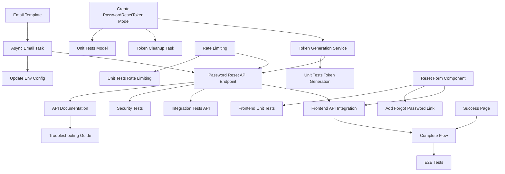

# US-5: Password Reset Request

**Priority**: P1
**Feature**: Authentication
**Status**: To Do

## Overview

This User Story implements the first step of the password recovery process, allowing users who have forgotten their password to securely request a reset email. The system generates a time-limited token (60-minute expiry), sends it via email, and ensures security through rate limiting and user enumeration prevention.

### Context

Password reset is a critical self-service feature that reduces support burden and improves user experience. Users who forget their passwords need a secure, convenient way to regain access without contacting support. This implementation balances security (preventing abuse, enumeration attacks) with usability (fast, clear, accessible).

This is the first half of the password recovery flow:
- **US-5** (this story): User requests reset → receives email with token
- **US-6** (next story): User clicks link → sets new password

### Decomposition Approach

The task breakdown follows a security-first approach with emphasis on preventing abuse:

1. **Backend Foundation** (7 tasks): PasswordResetToken model, token generation service, rate limiting, email template, async email sending, API endpoint, token cleanup
2. **Frontend Implementation** (5 tasks): Reset request form, success page, API integration, navigation from login, complete flow orchestration
3. **Comprehensive Testing** (7 tasks): Unit tests for model and services, integration tests for API, security tests for enumeration prevention, frontend tests, E2E tests
4. **Infrastructure & Documentation** (4 tasks): Celery configuration, API documentation, environment setup, troubleshooting guide

Key security features:
- **No user enumeration**: Always returns 200 OK with generic message
- **Rate limiting**: 3 requests per email per hour (prevents abuse and enumeration)
- **Cryptographically random tokens**: Use secrets.token_urlsafe(32)
- **Time-limited tokens**: 60-minute expiry
- **Single-use enforcement**: is_used flag prevents replay attacks
- **Async email sending**: Prevents request blocking and timing attacks

**Task Distribution**:
- **Backend**: 7 tasks (22 hours)
- **Frontend**: 5 tasks (13 hours)
- **Testing**: 7 tasks (19 hours)
- **Infrastructure**: 4 tasks (10 hours)
- **Total**: 23 tasks, 64 hours (8 developer days)

---

## Task Summary

| ID | Title | Type | Specialty | Effort | Dependencies | Status |
|----|-------|------|-----------|--------|--------------|--------|
| TASK-5.1 | Create PasswordResetToken Model | Backend | Database | 3h | None | ⬜ |
| TASK-5.2 | Implement Token Generation Service | Backend | Service | 2h | TASK-5.1 | ⬜ |
| TASK-5.3 | Implement Reset Request Rate Limiting | Backend | Security | 3h | None | ⬜ |
| TASK-5.4 | Create Password Reset Email Template | Backend | Email | 3h | None | ⬜ |
| TASK-5.5 | Implement Async Email Sending Task | Backend | Celery | 4h | TASK-5.4 | ⬜ |
| TASK-5.6 | Implement Password Reset Request API Endpoint | Backend | API | 5h | TASK-5.2, TASK-5.3, TASK-5.5 | ⬜ |
| TASK-5.7 | Implement Token Cleanup Task | Backend | Celery | 2h | TASK-5.1 | ⬜ |
| TASK-5.8 | Create Password Reset Request Form Component | Frontend | UI | 4h | None | ⬜ |
| TASK-5.9 | Create Password Reset Success Page | Frontend | UI | 2h | None | ⬜ |
| TASK-5.10 | Implement Reset Request API Integration | Frontend | API | 3h | TASK-5.6, TASK-5.8 | ⬜ |
| TASK-5.11 | Add "Forgot Password" Link to Login Page | Frontend | Navigation | 1h | TASK-5.8 | ⬜ |
| TASK-5.12 | Implement Password Reset Request Flow | Frontend | Integration | 3h | TASK-5.10, TASK-5.9 | ⬜ |
| TASK-5.13 | Unit Tests for PasswordResetToken Model | Testing | Backend | 2h | TASK-5.1 | ⬜ |
| TASK-5.14 | Unit Tests for Token Generation Service | Testing | Backend | 2h | TASK-5.2 | ⬜ |
| TASK-5.15 | Unit Tests for Rate Limiting | Testing | Backend | 3h | TASK-5.3 | ⬜ |
| TASK-5.16 | Integration Tests for Password Reset API | Testing | Backend | 4h | TASK-5.6 | ⬜ |
| TASK-5.17 | Security Tests for Reset Flow | Testing | Security | 3h | TASK-5.6 | ⬜ |
| TASK-5.18 | Frontend Unit Tests for Reset Form | Testing | Frontend | 2h | TASK-5.8 | ⬜ |
| TASK-5.19 | End-to-End Tests for Reset Request Flow | Testing | E2E | 3h | TASK-5.12 | ⬜ |
| TASK-5.20 | Configure Celery for Email Tasks | Infrastructure | Configuration | 3h | None | ⬜ |
| TASK-5.21 | Create Password Reset API Documentation | Infrastructure | Documentation | 2h | TASK-5.6 | ⬜ |
| TASK-5.22 | Update Environment Configuration | Infrastructure | Configuration | 2h | TASK-5.5 | ⬜ |
| TASK-5.23 | Create Password Reset Troubleshooting Guide | Infrastructure | Documentation | 2h | TASK-5.21 | ⬜ |

---

## Task Details

### 🔧 Backend Tasks

#### TASK-5.1: Create PasswordResetToken Model

**Type**: Backend - Database
**Priority**: P1
**Estimated Effort**: 3 hours

##### Description

Create a Django model to store password reset tokens with cryptographically random tokens, 60-minute expiry, single-use enforcement, and proper database indexing for performance. This model is similar to EmailVerificationToken but with different expiry and use case.

##### Files Impacted

- `backend/accounts/models.py` (modified) - Add PasswordResetToken model
- `backend/accounts/migrations/000X_passwordresettoken.py` (new) - Migration file
- `backend/accounts/admin.py` (modified) - Register model in admin interface

##### Acceptance Criteria

- [ ] PasswordResetToken model created with fields:
  - `id` (UUID primary key, auto-generated)
  - `user` (ForeignKey to CustomUser, on_delete=CASCADE)
  - `token` (CharField, max_length=255, unique, db_index=True)
  - `created_at` (DateTimeField, auto_now_add=True)
  - `expires_at` (DateTimeField, indexed)
  - `used_at` (DateTimeField, nullable)
  - `is_used` (BooleanField, default=False)
- [ ] Migration generated and applied successfully
- [ ] Database indexes created:
  - Index on `token` (for lookup during reset confirmation)
  - Index on `user_id` (for finding active reset requests)
  - Index on `expires_at` (for cleanup queries)
  - Composite index on `(user_id, created_at)` (for rate limiting)
- [ ] Model registered in Django Admin with list_display and list_filter
- [ ] `__str__` method returns meaningful representation (e.g., "Reset token for user@example.com")
- [ ] Ordering set to `['-created_at']` (most recent first)
- [ ] `is_expired()` method checks if current time > expires_at
- [ ] `is_valid()` method checks not expired and not used

##### Dependencies

None

##### Implementation Notes

**Technology**: Django 4.2+, PostgreSQL 15+

**Model Definition**:
```python
import uuid
from django.db import models
from django.utils import timezone
from django.conf import settings

class PasswordResetToken(models.Model):
    id = models.UUIDField(primary_key=True, default=uuid.uuid4, editable=False)
    user = models.ForeignKey(
        settings.AUTH_USER_MODEL,
        on_delete=models.CASCADE,
        related_name='password_reset_tokens'
    )
    token = models.CharField(max_length=255, unique=True, db_index=True)
    created_at = models.DateTimeField(auto_now_add=True)
    expires_at = models.DateTimeField(db_index=True)
    used_at = models.DateTimeField(null=True, blank=True)
    is_used = models.BooleanField(default=False)

    class Meta:
        ordering = ['-created_at']
        indexes = [
            models.Index(fields=['user', 'created_at']),
            models.Index(fields=['expires_at']),
        ]

    def __str__(self):
        return f"Reset token for {self.user.email}"

    def is_expired(self):
        return timezone.now() > self.expires_at

    def is_valid(self):
        return not self.is_expired() and not self.is_used

    def mark_as_used(self):
        self.is_used = True
        self.used_at = timezone.now()
        self.save(update_fields=['is_used', 'used_at'])
```

**Admin Configuration**:
```python
@admin.register(PasswordResetToken)
class PasswordResetTokenAdmin(admin.ModelAdmin):
    list_display = ['user', 'created_at', 'expires_at', 'is_used', 'is_expired']
    list_filter = ['is_used', 'created_at']
    search_fields = ['user__email', 'token']
    readonly_fields = ['created_at', 'used_at']

    def is_expired(self, obj):
        return obj.is_expired()
    is_expired.boolean = True
```

**Performance Consideration**: The composite index on (user_id, created_at) supports rate limiting queries like "count reset requests for user in last hour".

---

#### TASK-5.2: Implement Token Generation Service

**Type**: Backend - Service
**Priority**: P1
**Estimated Effort**: 2 hours

##### Description

Create a utility service for generating cryptographically random tokens using Python's secrets module, storing them in the database with 60-minute expiry, and handling the extremely unlikely case of token collisions.

##### Files Impacted

- `backend/accounts/services/token_generation.py` (new) - Token generation service
- `backend/accounts/services/__init__.py` (new or modified) - Package initialization

##### Acceptance Criteria

- [ ] generate_password_reset_token function created accepting user parameter
- [ ] Uses secrets.token_urlsafe(32) for cryptographically random tokens
- [ ] Calculates expires_at as current time + 60 minutes
- [ ] Creates PasswordResetToken record in database
- [ ] Returns token string (not the model instance)
- [ ] Handles IntegrityError for duplicate tokens (retry with new token)
- [ ] Maximum 3 retry attempts for collision (log warning if fails)
- [ ] Invalidates previous unused tokens for same user (optional, for security)
- [ ] Properly handles timezone-aware datetime

##### Dependencies

- TASK-5.1 (PasswordResetToken model must exist)

##### Implementation Notes

**Technology**: Python secrets module, Django 4.2+

**Service Implementation**:
```python
import secrets
from datetime import timedelta
from django.utils import timezone
from django.db import IntegrityError
from accounts.models import PasswordResetToken
import logging

logger = logging.getLogger(__name__)

def generate_password_reset_token(user, expiry_minutes=60, invalidate_previous=True):
    """
    Generate cryptographically random password reset token for user.

    Args:
        user: CustomUser instance
        expiry_minutes: Token lifetime in minutes (default 60)
        invalidate_previous: If True, mark previous unused tokens as used

    Returns:
        str: The generated token

    Raises:
        Exception: If unable to generate unique token after 3 attempts
    """
    # Optional: Invalidate previous unused tokens for security
    if invalidate_previous:
        PasswordResetToken.objects.filter(
            user=user,
            is_used=False,
            expires_at__gt=timezone.now()
        ).update(is_used=True, used_at=timezone.now())

    # Calculate expiry
    expires_at = timezone.now() + timedelta(minutes=expiry_minutes)

    # Generate unique token with retry logic
    max_attempts = 3
    for attempt in range(max_attempts):
        token = secrets.token_urlsafe(32)

        try:
            reset_token = PasswordResetToken.objects.create(
                user=user,
                token=token,
                expires_at=expires_at
            )
            return token
        except IntegrityError:
            # Extremely unlikely collision, retry
            if attempt == max_attempts - 1:
                logger.error(f"Failed to generate unique token after {max_attempts} attempts for user {user.email}")
                raise Exception("Unable to generate unique reset token")
            continue

    raise Exception("Unable to generate unique reset token")
```

**Usage Example**:
```python
from accounts.services.token_generation import generate_password_reset_token

# Generate token for user
token = generate_password_reset_token(user)
# Token is automatically stored in database
```

**Security Note**: `secrets.token_urlsafe(32)` generates 32 bytes of random data, base64-encoded to ~43 characters. Collision probability is astronomically low (2^-256).

---

#### TASK-5.3: Implement Reset Request Rate Limiting

**Type**: Backend - Security
**Priority**: P1
**Estimated Effort**: 3 hours

##### Description

Create Redis-based rate limiting that enforces 3 password reset requests per email per hour. Critically, the rate limit must increment for both existent and non-existent emails (after format validation) to prevent user enumeration via rapid requests.

##### Files Impacted

- `backend/accounts/rate_limiting.py` (modified) - Add password reset rate limiting
- `backend/config/settings/base.py` (modified) - Redis configuration for rate limiting

##### Acceptance Criteria

- [ ] rate_limit_password_reset decorator or function created
- [ ] Enforces 3 requests per email per 1-hour window
- [ ] Uses Redis for atomic increment and expiry operations
- [ ] Rate limit key format: `rate_limit:password_reset:{email}`
- [ ] Returns 429 status after limit exceeded
- [ ] Response includes retry_after_seconds in body
- [ ] Rate limit increments for valid email format (even if user doesn't exist)
- [ ] Rate limit does NOT increment for invalid email format (400 error)
- [ ] Different emails have independent rate limit counters
- [ ] Redis connection pooling configured for performance
- [ ] Graceful degradation if Redis unavailable (log warning, allow request)

##### Dependencies

None (Redis service from US-1 Docker Compose setup)

##### Implementation Notes

**Technology**: Redis, Django 4.2+

**Rate Limiting Implementation**:
```python
import redis
from django.conf import settings
from functools import wraps
from rest_framework.response import Response
import logging

logger = logging.getLogger(__name__)

redis_client = redis.Redis(
    host=settings.REDIS_HOST,
    port=settings.REDIS_PORT,
    db=settings.REDIS_RATE_LIMIT_DB,
    decode_responses=True
)

def check_password_reset_rate_limit(email):
    """
    Check if email has exceeded password reset rate limit.

    Args:
        email: Email address to check (should be validated format)

    Returns:
        tuple: (is_allowed: bool, retry_after: int seconds or None)
    """
    key = f"rate_limit:password_reset:{email.lower()}"
    limit = 3
    window = 3600  # 1 hour in seconds

    try:
        current = redis_client.get(key)

        if current and int(current) >= limit:
            # Limit exceeded
            ttl = redis_client.ttl(key)
            return (False, ttl if ttl > 0 else window)

        # Increment counter
        pipe = redis_client.pipeline()
        pipe.incr(key)
        pipe.expire(key, window)
        pipe.execute()

        return (True, None)

    except redis.RedisError as e:
        # Graceful degradation: log warning, allow request
        logger.warning(f"Redis error during rate limit check: {e}")
        return (True, None)

def rate_limit_password_reset(func):
    """
    Decorator to enforce password reset rate limiting.

    Apply to view after email validation but before processing.
    """
    @wraps(func)
    def wrapper(request, *args, **kwargs):
        # Extract email from request
        email = request.data.get('email', '').strip().lower()

        # Check rate limit
        is_allowed, retry_after = check_password_reset_rate_limit(email)

        if not is_allowed:
            return Response({
                'error': 'rate_limited',
                'message': 'Too many password reset requests. Please try again later.',
                'retry_after_seconds': retry_after
            }, status=429)

        return func(request, *args, **kwargs)

    return wrapper
```

**Redis Configuration** (settings/base.py):
```python
REDIS_HOST = env('REDIS_HOST', default='redis')
REDIS_PORT = env.int('REDIS_PORT', default=6379)
REDIS_RATE_LIMIT_DB = env.int('REDIS_RATE_LIMIT_DB', default=2)  # Separate DB for rate limiting
```

**Security Note**: Rate limit applies to email (not IP) because:
1. Prevents abuse per account
2. Better UX (shared IPs don't block legitimate users)
3. Still prevents enumeration (increments for non-existent emails)

---

#### TASK-5.4: Create Password Reset Email Template

**Type**: Backend - Email
**Priority**: P1
**Estimated Effort**: 3 hours

##### Description

Design professional, responsive HTML email template for password reset with clear call-to-action button, expiry notice, security warnings, and fallback text link. Template must be phishing-resistant and render correctly across email clients.

##### Files Impacted

- `backend/accounts/templates/emails/password_reset.html` (new) - HTML email template
- `backend/accounts/templates/emails/password_reset.txt` (new) - Plain text fallback
- `backend/accounts/templates/emails/base_email.html` (new or reuse) - Base template with branding

##### Acceptance Criteria

- [ ] HTML email template created with responsive design
- [ ] Professional branding (logo, colors, typography)
- [ ] Clear heading: "Password Reset Request"
- [ ] Friendly greeting using user's first name
- [ ] Clear explanation of what happened ("You requested a password reset")
- [ ] Prominent call-to-action button: "Reset Password"
- [ ] Reset link: `{{ frontend_url }}/reset-password?token={{ token }}`
- [ ] Expiry notice: "This link expires in 60 minutes"
- [ ] Security warning: "If you didn't request this, ignore this email"
- [ ] Fallback text link below button for email clients that don't support buttons
- [ ] Footer with support contact information
- [ ] Plain text version for email clients that don't support HTML
- [ ] Template variables: user.first_name, token, frontend_url, expiry_minutes
- [ ] Renders correctly in Gmail, Outlook, Apple Mail, mobile clients
- [ ] Passes spam filter tests (no spam trigger words)

##### Dependencies

None

##### Implementation Notes

**Technology**: Django templates, HTML/CSS

**HTML Template** (password_reset.html):
```html



<table role="presentation" style="width: 100%; border-collapse: collapse;">
  <tr>
    <td style="padding: 40px 30px;">
      <h1 style="margin: 0 0 20px 0; font-size: 24px; color: #333;">
        Password Reset Request
      </h1>

      <p style="margin: 0 0 15px 0; font-size: 16px; line-height: 24px; color: #555;">
        Hi {{ user.first_name }},
      </p>

      <p style="margin: 0 0 15px 0; font-size: 16px; line-height: 24px; color: #555;">
        You recently requested to reset your password for your account. Click the button below to reset it.
      </p>

      <!-- CTA Button -->
      <table role="presentation" style="margin: 30px 0;">
        <tr>
          <td style="border-radius: 4px; background: #007bff;">
            <a href="{{ frontend_url }}/reset-password?token={{ token }}"
               style="display: inline-block; padding: 16px 36px; color: #ffffff; text-decoration: none; font-size: 16px; font-weight: bold;">
              Reset Password
            </a>
          </td>
        </tr>
      </table>

      <!-- Fallback link -->
      <p style="margin: 0 0 15px 0; font-size: 14px; color: #777;">
        If the button doesn't work, copy and paste this link into your browser:
      </p>
      <p style="margin: 0 0 15px 0; font-size: 14px; word-break: break-all;">
        <a href="{{ frontend_url }}/reset-password?token={{ token }}" style="color: #007bff;">
          {{ frontend_url }}/reset-password?token={{ token }}
        </a>
      </p>

      <!-- Expiry notice -->
      <p style="margin: 20px 0 15px 0; padding: 15px; background: #fff3cd; border-left: 4px solid #ffc107; font-size: 14px; color: #856404;">
        <strong>⏱ This link expires in {{ expiry_minutes }} minutes.</strong>
      </p>

      <!-- Security warning -->
      <p style="margin: 20px 0 0 0; padding: 15px; background: #f8d7da; border-left: 4px solid #dc3545; font-size: 14px; color: #721c24;">
        <strong>🔒 Didn't request this?</strong><br>
        If you didn't request a password reset, you can safely ignore this email. Your password will not be changed.
      </p>
    </td>
  </tr>
</table>

```

**Plain Text Template** (password_reset.txt):
```
Password Reset Request

Hi {{ user.first_name }},

You recently requested to reset your password. Click the link below to reset it:

{{ frontend_url }}/reset-password?token={{ token }}

This link expires in {{ expiry_minutes }} minutes.

If you didn't request this, you can safely ignore this email. Your password will not be changed.

---
{{ site_name }}
{{ support_email }}
```

**Testing**: Use services like Litmus or Email on Acid to test rendering across email clients.

---

#### TASK-5.5: Implement Async Email Sending Task

**Type**: Backend - Celery
**Priority**: P1
**Estimated Effort**: 4 hours

##### Description

Create Celery task for asynchronous password reset email sending with retry logic (3 attempts), 60-second SLA, proper error handling, and logging. Async execution prevents request blocking and mitigates timing attacks.

##### Files Impacted

- `backend/accounts/tasks.py` (modified) - Add send_password_reset_email task
- `backend/config/celery.py` (modified) - Configure task routing
- `backend/config/settings/base.py` (modified) - Email configuration

##### Acceptance Criteria

- [ ] Celery task send_password_reset_email created
- [ ] Task accepts user_id and token as parameters
- [ ] Loads user from database within task
- [ ] Renders email template with context (user, token, expiry)
- [ ] Sends email via configured SMTP server
- [ ] Retry logic: 3 attempts with exponential backoff
- [ ] Logs success and failures with user email (hashed for privacy)
- [ ] Completes within 60 seconds (performance requirement)
- [ ] Returns success/failure status
- [ ] Handles SMTP errors gracefully (connection refused, authentication failed)
- [ ] Uses Django's send_mail or EmailMessage
- [ ] Email subject: "Password Reset Request - [Platform Name]"

##### Dependencies

- TASK-5.4 (Email template must exist)

##### Implementation Notes

**Technology**: Celery, Django email, SMTP

**Celery Task** (accounts/tasks.py):
```python
from celery import shared_task
from django.core.mail import EmailMultiAlternatives
from django.template.loader import render_to_string
from django.conf import settings
from django.contrib.auth import get_user_model
import logging
import hashlib

logger = logging.getLogger(__name__)
User = get_user_model()

@shared_task(bind=True, max_retries=3, default_retry_delay=60)
def send_password_reset_email(self, user_id, token):
    """
    Send password reset email asynchronously.

    Args:
        user_id: Primary key of user
        token: Password reset token string

    Returns:
        dict: {'success': bool, 'message': str}
    """
    try:
        # Load user
        try:
            user = User.objects.get(pk=user_id)
        except User.DoesNotExist:
            logger.error(f"User {user_id} not found when sending reset email")
            return {'success': False, 'message': 'User not found'}

        # Prepare email context
        context = {
            'user': user,
            'token': token,
            'frontend_url': settings.FRONTEND_URL,
            'expiry_minutes': 60,
            'site_name': settings.SITE_NAME,
            'support_email': settings.SUPPORT_EMAIL,
        }

        # Render email
        subject = f"Password Reset Request - {settings.SITE_NAME}"
        html_content = render_to_string('emails/password_reset.html', context)
        text_content = render_to_string('emails/password_reset.txt', context)

        # Send email
        email = EmailMultiAlternatives(
            subject=subject,
            body=text_content,
            from_email=settings.DEFAULT_FROM_EMAIL,
            to=[user.email],
        )
        email.attach_alternative(html_content, "text/html")
        email.send()

        # Log success (hash email for privacy)
        email_hash = hashlib.sha256(user.email.encode()).hexdigest()[:8]
        logger.info(f"Password reset email sent successfully to user {email_hash}")

        return {'success': True, 'message': 'Email sent'}

    except Exception as exc:
        # Log error
        logger.error(f"Error sending password reset email: {exc}")

        # Retry with exponential backoff
        if self.request.retries < self.max_retries:
            raise self.retry(exc=exc, countdown=60 * (2 ** self.request.retries))

        return {'success': False, 'message': str(exc)}
```

**Email Configuration** (settings/base.py):
```python
# Email Configuration
EMAIL_BACKEND = 'django.core.mail.backends.smtp.EmailBackend'
EMAIL_HOST = env('SMTP_HOST')
EMAIL_PORT = env.int('SMTP_PORT', default=587)
EMAIL_USE_TLS = env.bool('SMTP_USE_TLS', default=True)
EMAIL_HOST_USER = env('SMTP_USER')
EMAIL_HOST_PASSWORD = env('SMTP_PASSWORD')
DEFAULT_FROM_EMAIL = env('DEFAULT_FROM_EMAIL')

# Site settings
FRONTEND_URL = env('FRONTEND_URL')
SITE_NAME = env('SITE_NAME', default='Technology Watch Platform')
SUPPORT_EMAIL = env('SUPPORT_EMAIL', default='support@example.com')
```

**Performance**: Task should complete in < 5 seconds normally, with 60-second timeout for retries.

---

#### TASK-5.6: Implement Password Reset Request API Endpoint

**Type**: Backend - API
**Priority**: P1
**Estimated Effort**: 5 hours

##### Description

Create the POST /api/auth/password-reset/ endpoint that orchestrates the complete reset request flow: email validation, rate limiting, user lookup, token generation, async email sending, and generic success response. This is the core endpoint for the password reset feature.

##### Files Impacted

- `backend/accounts/views.py` (modified) - PasswordResetRequestView
- `backend/accounts/serializers.py` (modified) - PasswordResetRequestSerializer
- `backend/accounts/urls.py` (modified) - Add password-reset route
- `backend/config/urls.py` (modified or verify) - Include accounts URLs

##### Acceptance Criteria

- [ ] POST /api/auth/password-reset/ endpoint created
- [ ] Request accepts: email (string, required)
- [ ] PasswordResetRequestSerializer validates email format
- [ ] Rate limiting applied via decorator (3 per email per hour)
- [ ] User lookup by email (case-insensitive)
- [ ] If user exists:
  - Generate reset token (call token generation service)
  - Send reset email (async Celery task)
- [ ] If user doesn't exist:
  - No token generated
  - No email sent
  - Rate limit still incremented
- [ ] Response always 200 OK with generic message (security)
- [ ] Response format: `{"message": "If an account exists, you will receive a reset email"}`
- [ ] HTTP status codes:
  - 200: Request processed (regardless of user existence)
  - 400: Invalid email format
  - 429: Rate limit exceeded
- [ ] Endpoint is public (no authentication required)
- [ ] Response time < 300ms (P95)
- [ ] Proper error handling and logging

##### Dependencies

- TASK-5.2 (Token generation service)
- TASK-5.3 (Rate limiting)
- TASK-5.5 (Async email task)

##### Implementation Notes

**Technology**: Django REST Framework, Celery

**Serializer** (accounts/serializers.py):
```python
from rest_framework import serializers

class PasswordResetRequestSerializer(serializers.Serializer):
    email = serializers.EmailField(required=True)

    def validate_email(self, value):
        # Normalize email (lowercase, strip whitespace)
        return value.strip().lower()
```

**View** (accounts/views.py):
```python
from rest_framework.views import APIView
from rest_framework.response import Response
from rest_framework import status
from django.contrib.auth import get_user_model
from accounts.serializers import PasswordResetRequestSerializer
from accounts.rate_limiting import rate_limit_password_reset
from accounts.services.token_generation import generate_password_reset_token
from accounts.tasks import send_password_reset_email
import logging

logger = logging.getLogger(__name__)
User = get_user_model()

class PasswordResetRequestView(APIView):
    """
    Request password reset email.

    POST /api/auth/password-reset/
    Body: {"email": "user@example.com"}

    Returns 200 OK with generic message regardless of email existence.
    """
    permission_classes = []  # Public endpoint

    @rate_limit_password_reset
    def post(self, request):
        serializer = PasswordResetRequestSerializer(data=request.data)

        if not serializer.is_valid():
            return Response(serializer.errors, status=status.HTTP_400_BAD_REQUEST)

        email = serializer.validated_data['email']

        # Try to find user (case-insensitive)
        try:
            user = User.objects.get(email__iexact=email)

            # Generate reset token
            token = generate_password_reset_token(user)

            # Send email asynchronously
            send_password_reset_email.delay(user.id, token)

            logger.info(f"Password reset requested for existing user")

        except User.DoesNotExist:
            # User doesn't exist - don't reveal this (security)
            logger.info(f"Password reset requested for non-existent email")
            pass

        # Always return same response (prevent user enumeration)
        return Response({
            'message': 'If an account exists, you will receive a reset email'
        }, status=status.HTTP_200_OK)
```

**URL Configuration** (accounts/urls.py):
```python
from django.urls import path
from accounts.views import PasswordResetRequestView

urlpatterns = [
    # ... existing patterns
    path('password-reset/', PasswordResetRequestView.as_view(), name='password_reset_request'),
]
```

**Security Note**: Always return 200 OK with generic message to prevent attackers from determining which emails are registered.

---

#### TASK-5.7: Implement Token Cleanup Task

**Type**: Backend - Celery
**Priority**: P1
**Estimated Effort**: 2 hours

##### Description

Create periodic Celery Beat task to delete expired password reset tokens (older than 30 days) to prevent database bloat and maintain performance. This is a maintenance task that runs automatically.

##### Files Impacted

- `backend/accounts/tasks.py` (modified) - Add cleanup_expired_password_reset_tokens task
- `backend/config/celery.py` (modified) - Add Celery Beat schedule
- `backend/config/settings/base.py` (modified) - Configure beat schedule

##### Acceptance Criteria

- [ ] Celery task cleanup_expired_password_reset_tokens created
- [ ] Task deletes PasswordResetToken records where:
  - expires_at < now - 30 days (configurable retention period)
- [ ] Task scheduled to run daily at 3:00 AM UTC
- [ ] Logs number of tokens deleted
- [ ] Uses bulk_delete for performance
- [ ] Handles database errors gracefully
- [ ] Reports metrics (deleted count, execution time)
- [ ] Can be manually triggered via Django Admin or command

##### Dependencies

- TASK-5.1 (PasswordResetToken model)

##### Implementation Notes

**Technology**: Celery Beat, Django ORM

**Celery Task** (accounts/tasks.py):
```python
from celery import shared_task
from datetime import timedelta
from django.utils import timezone
from accounts.models import PasswordResetToken
import logging

logger = logging.getLogger(__name__)

@shared_task
def cleanup_expired_password_reset_tokens(retention_days=30):
    """
    Delete expired password reset tokens older than retention period.

    Args:
        retention_days: Keep tokens for this many days after expiry

    Returns:
        dict: {'deleted_count': int, 'success': bool}
    """
    try:
        # Calculate cutoff date
        cutoff_date = timezone.now() - timedelta(days=retention_days)

        # Find expired tokens
        expired_tokens = PasswordResetToken.objects.filter(
            expires_at__lt=cutoff_date
        )

        count = expired_tokens.count()

        # Delete in bulk
        expired_tokens.delete()

        logger.info(f"Deleted {count} expired password reset tokens")

        return {'deleted_count': count, 'success': True}

    except Exception as e:
        logger.error(f"Error cleaning up password reset tokens: {e}")
        return {'deleted_count': 0, 'success': False, 'error': str(e)}
```

**Celery Beat Schedule** (config/celery.py):
```python
from celery.schedules import crontab

app.conf.beat_schedule = {
    'cleanup-expired-password-reset-tokens': {
        'task': 'accounts.tasks.cleanup_expired_password_reset_tokens',
        'schedule': crontab(hour=3, minute=0),  # Daily at 3:00 AM UTC
        'args': (30,),  # 30-day retention
    },
}
```

**Manual Execution** (Django management command):
```python
# backend/accounts/management/commands/cleanup_tokens.py
from django.core.management.base import BaseCommand
from accounts.tasks import cleanup_expired_password_reset_tokens

class Command(BaseCommand):
    help = 'Manually clean up expired password reset tokens'

    def handle(self, *args, **options):
        result = cleanup_expired_password_reset_tokens()
        self.stdout.write(self.style.SUCCESS(f"Deleted {result['deleted_count']} tokens"))
```

**Performance**: Cleanup should complete in < 1 second for typical database sizes (< 100K tokens).

---

### 🎨 Frontend Tasks

#### TASK-5.8: Create Password Reset Request Form Component

**Type**: Frontend - UI
**Priority**: P1
**Estimated Effort**: 4 hours

##### Description

Create React form component for password reset request with email input, client-side validation, error display, loading states, responsive design, and accessibility features.

##### Files Impacted

- `frontend/src/components/PasswordResetForm.jsx` (new) - Form component
- `frontend/src/components/PasswordResetForm.module.css` (new) - Component styles

##### Acceptance Criteria

- [ ] PasswordResetForm component created accepting onSubmit and error props
- [ ] Email input field with type="email"
- [ ] Client-side validation:
  - Email format validation (regex or HTML5 validation)
  - Required field validation
  - Display validation errors inline
- [ ] Submit button: "Send Reset Email"
- [ ] Loading state during submission (button disabled, spinner shown)
- [ ] Error message display area for API errors (400, 429)
- [ ] Form submit handler prevents default, calls onSubmit prop with email
- [ ] Responsive design (mobile, tablet, desktop)
- [ ] Accessible:
  - Label associated with input (htmlFor)
  - ARIA attributes (aria-invalid, aria-describedby)
  - Keyboard navigation support
  - Focus indicators visible
- [ ] Link back to login: "Remember your password? Sign In"

##### Dependencies

None

##### Implementation Notes

**Technology**: React 18+, CSS Modules or Tailwind CSS

**Component Structure**:
```jsx
import React, { useState } from 'react';
import styles from './PasswordResetForm.module.css';

export default function PasswordResetForm({ onSubmit, error, loading }) {
  const [email, setEmail] = useState('');
  const [validationError, setValidationError] = useState('');

  const validateEmail = (email) => {
    if (!email) {
      return 'Email is required';
    }
    const emailRegex = /^[^\s@]+@[^\s@]+\.[^\s@]+$/;
    if (!emailRegex.test(email)) {
      return 'Please enter a valid email address';
    }
    return '';
  };

  const handleSubmit = (e) => {
    e.preventDefault();

    const error = validateEmail(email);
    if (error) {
      setValidationError(error);
      return;
    }

    setValidationError('');
    onSubmit(email);
  };

  return (
    <form onSubmit={handleSubmit} className={styles.form}>
      <h2 className={styles.heading}>Reset Your Password</h2>
      <p className={styles.description}>
        Enter your email address and we'll send you a link to reset your password.
      </p>

      {error && (
        <div className={styles.errorBox} role="alert">
          {error}
        </div>
      )}

      <div className={styles.field}>
        <label htmlFor="email" className={styles.label}>
          Email Address
        </label>
        <input
          id="email"
          type="email"
          value={email}
          onChange={(e) => {
            setEmail(e.target.value);
            setValidationError('');
          }}
          disabled={loading}
          className={styles.input}
          aria-invalid={!!validationError}
          aria-describedby={validationError ? 'email-error' : undefined}
          autoFocus
          required
        />
        {validationError && (
          <span id="email-error" className={styles.error} role="alert">
            {validationError}
          </span>
        )}
      </div>

      <button
        type="submit"
        disabled={loading}
        className={styles.submitButton}
        aria-busy={loading}
      >
        {loading ? (
          <>
            <span className={styles.spinner} aria-hidden="true"></span>
            Sending...
          </>
        ) : (
          'Send Reset Email'
        )}
      </button>

      <div className={styles.links}>
        <a href="/login" className={styles.link}>
          Remember your password? Sign In
        </a>
      </div>
    </form>
  );
}
```

**Styling Considerations**:
- Clear visual hierarchy (heading > description > form)
- Sufficient spacing between elements
- High contrast for readability (WCAG AA)
- Focus indicators for keyboard navigation
- Error messages in red with icons
- Loading spinner animation

---

#### TASK-5.9: Create Password Reset Success Page

**Type**: Frontend - UI
**Priority**: P1
**Estimated Effort**: 2 hours

##### Description

Create success confirmation page displayed after password reset request submission. Page provides clear next steps, instructions to check email, and options to return to login or resend email.

##### Files Impacted

- `frontend/src/pages/PasswordResetSuccessPage.jsx` (new) - Success page component
- `frontend/src/pages/PasswordResetSuccessPage.module.css` (new) - Page styles

##### Acceptance Criteria

- [ ] PasswordResetSuccessPage component created
- [ ] Success icon or checkmark displayed
- [ ] Heading: "Check Your Email"
- [ ] Clear message: "If an account exists, you will receive a reset email"
- [ ] Instructions: "Check your spam folder if you don't see it in a few minutes"
- [ ] Button: "Back to Sign In" (navigates to /login)
- [ ] Optional: "Didn't receive email? Try again" link (navigates back to request form)
- [ ] Responsive design
- [ ] Accessible (proper heading hierarchy, focus management)

##### Dependencies

None

##### Implementation Notes

**Technology**: React 18+, React Router

**Component Structure**:
```jsx
import React from 'react';
import { useNavigate } from 'react-router-dom';
import styles from './PasswordResetSuccessPage.module.css';

export default function PasswordResetSuccessPage() {
  const navigate = useNavigate();

  return (
    <div className={styles.container}>
      <div className={styles.card}>
        <div className={styles.iconContainer}>
          <svg className={styles.successIcon} /* checkmark icon SVG */ />
        </div>

        <h1 className={styles.heading}>Check Your Email</h1>

        <p className={styles.message}>
          If an account exists with the email you entered, you will receive a password reset link shortly.
        </p>

        <p className={styles.submessage}>
          Didn't receive an email? Check your spam folder or try again in a few minutes.
        </p>

        <button
          onClick={() => navigate('/login')}
          className={styles.primaryButton}
        >
          Back to Sign In
        </button>

        <button
          onClick={() => navigate('/forgot-password')}
          className={styles.secondaryButton}
        >
          Try Again
        </button>
      </div>
    </div>
  );
}
```

**Styling**: Center card with max-width 500px, padding, shadow, white background.

---

#### TASK-5.10: Implement Reset Request API Integration

**Type**: Frontend - API
**Priority**: P1
**Estimated Effort**: 3 hours

##### Description

Create API service module for calling password reset request endpoint, handling responses, mapping error codes to user-friendly messages, and extracting retry_after information from 429 responses.

##### Files Impacted

- `frontend/src/services/api/authApi.js` (modified) - Add passwordResetRequest function
- `frontend/src/services/api/client.js` (verify) - Axios client configuration

##### Acceptance Criteria

- [ ] passwordResetRequest function created accepting email parameter
- [ ] Calls POST /api/auth/password-reset/ with email
- [ ] Returns promise resolving to success message
- [ ] Error handling for all status codes:
  - 400: "Please enter a valid email address"
  - 429: "Too many reset requests. Try again in X minutes" (extract from retry_after_seconds)
  - 500: "Server error. Please try again later"
  - Network errors: "Connection error. Please check your internet"
- [ ] Extracts retry_after_seconds from 429 response body
- [ ] Converts seconds to minutes for user-friendly display
- [ ] TypeScript types defined (if using TypeScript)
- [ ] No authentication required (public endpoint)

##### Dependencies

- TASK-5.6 (Password reset API endpoint)
- TASK-5.8 (PasswordResetForm component)

##### Implementation Notes

**Technology**: Axios, React 18+

**API Service** (authApi.js):
```javascript
import apiClient from './client';

export const passwordResetRequest = async (email) => {
  try {
    const response = await apiClient.post('/auth/password-reset/', {
      email
    });
    return { success: true, message: response.data.message };
  } catch (error) {
    if (error.response) {
      const status = error.response.status;
      const data = error.response.data;

      switch (status) {
        case 400:
          throw new Error(data.message || 'Please enter a valid email address');
        case 429:
          const retryAfter = data.retry_after_seconds;
          const minutes = retryAfter ? Math.ceil(retryAfter / 60) : 60;
          throw new Error(`Too many reset requests. Please try again in ${minutes} minute(s)`);
        case 500:
          throw new Error('Server error. Please try again later');
        default:
          throw new Error('An unexpected error occurred');
      }
    } else if (error.request) {
      throw new Error('Connection error. Please check your internet connection');
    } else {
      throw new Error('An unexpected error occurred');
    }
  }
};
```

**Usage Example**:
```javascript
import { passwordResetRequest } from '../services/api/authApi';

try {
  await passwordResetRequest('user@example.com');
  // Navigate to success page
} catch (error) {
  // Display error message
  setError(error.message);
}
```

---

#### TASK-5.11: Add "Forgot Password" Link to Login Page

**Type**: Frontend - Navigation
**Priority**: P1
**Estimated Effort**: 1 hour

##### Description

Add navigation link from login page to password reset request page. This provides users a clear path to password recovery when they can't log in.

##### Files Impacted

- `frontend/src/pages/LoginPage.jsx` (modified) - Add "Forgot Password?" link
- `frontend/src/App.jsx` (modified) - Add route for /forgot-password

##### Acceptance Criteria

- [ ] "Forgot Password?" link added to LoginPage
- [ ] Link positioned below password field or below submit button
- [ ] Link navigates to /forgot-password route
- [ ] Styling consistent with existing links
- [ ] Accessible (keyboard navigable, clear focus indicator)
- [ ] Route /forgot-password added to router configuration

##### Dependencies

- TASK-5.8 (PasswordResetForm component)

##### Implementation Notes

**Technology**: React Router v6

**LoginPage Update**:
```jsx
// In LoginPage.jsx
<div className={styles.links}>
  <Link to="/forgot-password" className={styles.link}>
    Forgot Password?
  </Link>
</div>
```

**Router Configuration** (App.jsx):
```jsx
import PasswordResetRequestPage from './pages/PasswordResetRequestPage';

<Routes>
  <Route path="/login" element={<LoginPage />} />
  <Route path="/forgot-password" element={<PasswordResetRequestPage />} />
  {/* other routes */}
</Routes>
```

---

#### TASK-5.12: Implement Password Reset Request Flow

**Type**: Frontend - Integration
**Priority**: P1
**Estimated Effort**: 3 hours

##### Description

Integrate form submission, API call, loading states, error display, and navigation to success page. This is the complete orchestration of the password reset request user flow.

##### Files Impacted

- `frontend/src/pages/PasswordResetRequestPage.jsx` (new) - Page container component
- `frontend/src/App.jsx` (modified) - Add route

##### Acceptance Criteria

- [ ] PasswordResetRequestPage component created
- [ ] Renders PasswordResetForm component
- [ ] Manages loading state (initially false)
- [ ] Manages error state (initially null)
- [ ] handleSubmit function:
  - Sets loading to true
  - Calls passwordResetRequest API
  - On success: navigates to /reset-password/success
  - On error: sets error message, sets loading to false
- [ ] Passes loading and error props to form
- [ ] Page layout consistent with other auth pages
- [ ] Route /forgot-password configured in router

##### Dependencies

- TASK-5.10 (API integration)
- TASK-5.9 (Success page)

##### Implementation Notes

**Technology**: React 18+, React Router

**Page Component** (PasswordResetRequestPage.jsx):
```jsx
import React, { useState } from 'react';
import { useNavigate } from 'react-router-dom';
import PasswordResetForm from '../components/PasswordResetForm';
import { passwordResetRequest } from '../services/api/authApi';
import styles from './PasswordResetRequestPage.module.css';

export default function PasswordResetRequestPage() {
  const [loading, setLoading] = useState(false);
  const [error, setError] = useState(null);
  const navigate = useNavigate();

  const handleSubmit = async (email) => {
    setLoading(true);
    setError(null);

    try {
      await passwordResetRequest(email);
      // Navigate to success page
      navigate('/reset-password/success');
    } catch (err) {
      setError(err.message);
    } finally {
      setLoading(false);
    }
  };

  return (
    <div className={styles.container}>
      <div className={styles.card}>
        <PasswordResetForm
          onSubmit={handleSubmit}
          error={error}
          loading={loading}
        />
      </div>
    </div>
  );
}
```

**Router Update** (App.jsx):
```jsx
<Routes>
  <Route path="/login" element={<LoginPage />} />
  <Route path="/forgot-password" element={<PasswordResetRequestPage />} />
  <Route path="/reset-password/success" element={<PasswordResetSuccessPage />} />
</Routes>
```

---

### ✅ Testing Tasks

#### TASK-5.13: Unit Tests for PasswordResetToken Model

**Type**: Testing - Backend
**Priority**: P2
**Estimated Effort**: 2 hours

##### Description

Write comprehensive pytest unit tests for PasswordResetToken model covering creation, expiry calculation, single-use enforcement, database constraints, and helper methods.

##### Files Impacted

- `backend/accounts/tests/test_models.py` (modified) - Add PasswordResetToken tests

##### Acceptance Criteria

- [ ] Test PasswordResetToken creation with all fields
- [ ] Test token uniqueness constraint (IntegrityError on duplicate)
- [ ] Test expires_at calculation (created_at + 60 minutes)
- [ ] Test is_expired() method (before and after expiry)
- [ ] Test is_valid() method (not expired and not used)
- [ ] Test mark_as_used() method (sets is_used=True, used_at=now)
- [ ] Test ForeignKey relationship with User (cascade delete)
- [ ] Test database indexes exist (token, user_id, expires_at)
- [ ] Test ordering (most recent first)
- [ ] Test __str__ method output
- [ ] 90%+ code coverage for PasswordResetToken model

##### Dependencies

- TASK-5.1 (PasswordResetToken model)

##### Implementation Notes

**Technology**: pytest, pytest-django

**Test Structure**:
```python
# backend/accounts/tests/test_models.py
import pytest
from datetime import timedelta
from django.utils import timezone
from django.contrib.auth import get_user_model
from accounts.models import PasswordResetToken

User = get_user_model()

@pytest.mark.django_db
class TestPasswordResetToken:
    def test_create_reset_token(self):
        """Test creating password reset token."""
        user = User.objects.create_user(
            email='test@example.com',
            password='testpass123'
        )

        token = PasswordResetToken.objects.create(
            user=user,
            token='test-token-123',
            expires_at=timezone.now() + timedelta(hours=1)
        )

        assert token.user == user
        assert token.token == 'test-token-123'
        assert not token.is_used
        assert token.used_at is None

    def test_token_uniqueness(self):
        """Test token uniqueness constraint."""
        user = User.objects.create_user(
            email='test@example.com',
            password='testpass123'
        )

        PasswordResetToken.objects.create(
            user=user,
            token='duplicate-token',
            expires_at=timezone.now() + timedelta(hours=1)
        )

        # Duplicate token should raise IntegrityError
        with pytest.raises(Exception):  # IntegrityError
            PasswordResetToken.objects.create(
                user=user,
                token='duplicate-token',
                expires_at=timezone.now() + timedelta(hours=1)
            )

    def test_is_expired_method(self):
        """Test is_expired() method."""
        user = User.objects.create_user(
            email='test@example.com',
            password='testpass123'
        )

        # Not expired
        token = PasswordResetToken.objects.create(
            user=user,
            token='valid-token',
            expires_at=timezone.now() + timedelta(hours=1)
        )
        assert not token.is_expired()

        # Expired
        expired_token = PasswordResetToken.objects.create(
            user=user,
            token='expired-token',
            expires_at=timezone.now() - timedelta(hours=1)
        )
        assert expired_token.is_expired()

    def test_is_valid_method(self):
        """Test is_valid() method checks expiry and usage."""
        user = User.objects.create_user(
            email='test@example.com',
            password='testpass123'
        )

        # Valid token (not expired, not used)
        token = PasswordResetToken.objects.create(
            user=user,
            token='valid-token',
            expires_at=timezone.now() + timedelta(hours=1)
        )
        assert token.is_valid()

        # Invalid (expired)
        expired_token = PasswordResetToken.objects.create(
            user=user,
            token='expired-token',
            expires_at=timezone.now() - timedelta(hours=1)
        )
        assert not expired_token.is_valid()

        # Invalid (used)
        token.mark_as_used()
        assert not token.is_valid()

    def test_mark_as_used_method(self):
        """Test mark_as_used() sets flags correctly."""
        user = User.objects.create_user(
            email='test@example.com',
            password='testpass123'
        )

        token = PasswordResetToken.objects.create(
            user=user,
            token='test-token',
            expires_at=timezone.now() + timedelta(hours=1)
        )

        assert not token.is_used
        assert token.used_at is None

        token.mark_as_used()

        assert token.is_used
        assert token.used_at is not None

    def test_cascade_delete(self):
        """Test token deleted when user deleted."""
        user = User.objects.create_user(
            email='test@example.com',
            password='testpass123'
        )

        PasswordResetToken.objects.create(
            user=user,
            token='test-token',
            expires_at=timezone.now() + timedelta(hours=1)
        )

        user_id = user.id
        user.delete()

        # Token should be deleted
        assert not PasswordResetToken.objects.filter(user_id=user_id).exists()
```

---

#### TASK-5.14: Unit Tests for Token Generation Service

**Type**: Testing - Backend
**Priority**: P2
**Estimated Effort**: 2 hours

##### Description

Write unit tests for token generation service covering token randomness, collision handling, expiry calculation, database storage, and previous token invalidation.

##### Files Impacted

- `backend/accounts/tests/test_token_generation.py` (new) - Token generation tests

##### Acceptance Criteria

- [ ] Test generate_password_reset_token creates token
- [ ] Test token is cryptographically random (not predictable)
- [ ] Test token uniqueness (multiple calls generate different tokens)
- [ ] Test expires_at is 60 minutes from now
- [ ] Test token stored in database
- [ ] Test collision handling (mock IntegrityError, verify retry)
- [ ] Test previous token invalidation (if invalidate_previous=True)
- [ ] Test max retry logic (3 attempts)
- [ ] 85%+ code coverage for token generation service

##### Dependencies

- TASK-5.2 (Token generation service)

##### Implementation Notes

**Technology**: pytest, unittest.mock

**Test Structure**:
```python
# backend/accounts/tests/test_token_generation.py
import pytest
from datetime import timedelta
from django.utils import timezone
from django.contrib.auth import get_user_model
from accounts.services.token_generation import generate_password_reset_token
from accounts.models import PasswordResetToken
from unittest.mock import patch

User = get_user_model()

@pytest.mark.django_db
class TestTokenGeneration:
    def test_generate_token(self):
        """Test token generation creates database record."""
        user = User.objects.create_user(
            email='test@example.com',
            password='testpass123'
        )

        token = generate_password_reset_token(user)

        assert token is not None
        assert len(token) > 20  # Reasonable token length

        # Verify database record
        db_token = PasswordResetToken.objects.get(token=token)
        assert db_token.user == user
        assert not db_token.is_used

    def test_token_uniqueness(self):
        """Test multiple calls generate different tokens."""
        user = User.objects.create_user(
            email='test@example.com',
            password='testpass123'
        )

        token1 = generate_password_reset_token(user)
        token2 = generate_password_reset_token(user)

        assert token1 != token2

    def test_expiry_calculation(self):
        """Test token expires in 60 minutes."""
        user = User.objects.create_user(
            email='test@example.com',
            password='testpass123'
        )

        before = timezone.now()
        token = generate_password_reset_token(user, expiry_minutes=60)
        after = timezone.now()

        db_token = PasswordResetToken.objects.get(token=token)
        expected_expiry = before + timedelta(minutes=60)

        # Allow 1-minute tolerance for test execution time
        assert abs((db_token.expires_at - expected_expiry).total_seconds()) < 60

    def test_invalidate_previous_tokens(self):
        """Test previous tokens invalidated when requested."""
        user = User.objects.create_user(
            email='test@example.com',
            password='testpass123'
        )

        # Create first token
        token1 = generate_password_reset_token(user, invalidate_previous=False)
        db_token1 = PasswordResetToken.objects.get(token=token1)
        assert not db_token1.is_used

        # Create second token with invalidation
        token2 = generate_password_reset_token(user, invalidate_previous=True)

        # First token should be marked as used
        db_token1.refresh_from_db()
        assert db_token1.is_used

    @patch('accounts.services.token_generation.PasswordResetToken.objects.create')
    def test_collision_retry(self, mock_create):
        """Test retry logic on token collision."""
        user = User.objects.create_user(
            email='test@example.com',
            password='testpass123'
        )

        from django.db import IntegrityError

        # First call raises IntegrityError (collision)
        # Second call succeeds
        mock_create.side_effect = [
            IntegrityError("Duplicate token"),
            PasswordResetToken(user=user, token='unique-token')
        ]

        # Should succeed after retry
        try:
            token = generate_password_reset_token(user)
            # Test passes if no exception
        except:
            pytest.fail("Should have retried after collision")
```

---

#### TASK-5.15: Unit Tests for Rate Limiting

**Type**: Testing - Backend
**Priority**: P2
**Estimated Effort**: 3 hours

##### Description

Write unit tests for password reset rate limiting covering 3-request limit, 1-hour window, Redis interaction, and rate limiting for non-existent emails.

##### Files Impacted

- `backend/accounts/tests/test_rate_limiting.py` (modified) - Add password reset rate limit tests

##### Acceptance Criteria

- [ ] Test requests within limit (< 3) are allowed
- [ ] Test 4th request returns 429 status
- [ ] Test retry_after_seconds present in 429 response
- [ ] Test rate limit resets after 1 hour (use Redis EXPIRE)
- [ ] Test different emails have independent counters
- [ ] Test rate limit increments for non-existent emails
- [ ] Test rate limit does NOT increment for invalid email format
- [ ] Test graceful degradation if Redis unavailable (allow request, log warning)
- [ ] Use fakeredis for tests (no real Redis required)
- [ ] 85%+ code coverage for rate limiting module

##### Dependencies

- TASK-5.3 (Rate limiting implementation)

##### Implementation Notes

**Technology**: pytest, fakeredis

**Test Structure**:
```python
# backend/accounts/tests/test_rate_limiting.py
import pytest
from unittest.mock import Mock, patch
from accounts.rate_limiting import check_password_reset_rate_limit
import fakeredis

@pytest.fixture
def fake_redis():
    """Provide fake Redis client for testing."""
    return fakeredis.FakeRedis(decode_responses=True)

def test_rate_limit_allows_within_limit(fake_redis):
    """Test requests within limit are allowed."""
    with patch('accounts.rate_limiting.redis_client', fake_redis):
        email = 'test@example.com'

        # First 3 requests should succeed
        for i in range(3):
            is_allowed, retry_after = check_password_reset_rate_limit(email)
            assert is_allowed
            assert retry_after is None

def test_rate_limit_blocks_after_limit(fake_redis):
    """Test 4th request is blocked."""
    with patch('accounts.rate_limiting.redis_client', fake_redis):
        email = 'test@example.com'

        # Exhaust limit (3 requests)
        for i in range(3):
            check_password_reset_rate_limit(email)

        # 4th request should be blocked
        is_allowed, retry_after = check_password_reset_rate_limit(email)
        assert not is_allowed
        assert retry_after is not None
        assert retry_after > 0

def test_different_emails_independent(fake_redis):
    """Test different emails have independent rate limits."""
    with patch('accounts.rate_limiting.redis_client', fake_redis):
        email1 = 'user1@example.com'
        email2 = 'user2@example.com'

        # Exhaust limit for email1
        for i in range(3):
            check_password_reset_rate_limit(email1)

        # email2 should still be allowed
        is_allowed, retry_after = check_password_reset_rate_limit(email2)
        assert is_allowed

def test_rate_limit_for_nonexistent_email(fake_redis):
    """Test rate limit increments for non-existent emails."""
    with patch('accounts.rate_limiting.redis_client', fake_redis):
        email = 'nonexistent@example.com'

        # Rate limit should increment regardless of user existence
        for i in range(3):
            is_allowed, retry_after = check_password_reset_rate_limit(email)
            assert is_allowed

        # 4th request blocked
        is_allowed, retry_after = check_password_reset_rate_limit(email)
        assert not is_allowed
```

---

#### TASK-5.16: Integration Tests for Password Reset API

**Type**: Testing - Backend
**Priority**: P1
**Estimated Effort**: 4 hours

##### Description

Write end-to-end integration tests for password reset request API covering successful requests, non-existent email handling, rate limiting, email sending verification, and all error scenarios.

##### Files Impacted

- `backend/accounts/tests/test_password_reset_api.py` (new) - Password reset API integration tests

##### Acceptance Criteria

- [ ] Test successful reset request for existing user returns 200
- [ ] Test response message is generic (same for existent and non-existent)
- [ ] Test PasswordResetToken created for existing user
- [ ] Test email task enqueued (verify Celery task called)
- [ ] Test non-existent email returns 200 (same response)
- [ ] Test no token created for non-existent email
- [ ] Test no email sent for non-existent email
- [ ] Test 400 for invalid email format
- [ ] Test 429 after 3 requests from same email
- [ ] Test retry_after_seconds in 429 response
- [ ] Test case-insensitive email lookup
- [ ] Test whitespace trimming in email
- [ ] 90%+ code coverage for password reset view

##### Dependencies

- TASK-5.6 (Password reset API endpoint)

##### Implementation Notes

**Technology**: pytest, pytest-django, Django REST Framework test client

**Test Structure**:
```python
# backend/accounts/tests/test_password_reset_api.py
import pytest
from django.contrib.auth import get_user_model
from rest_framework.test import APIClient
from accounts.models import PasswordResetToken
from unittest.mock import patch

User = get_user_model()

@pytest.fixture
def api_client():
    return APIClient()

@pytest.fixture
def verified_user(db):
    """Create verified user for testing."""
    return User.objects.create_user(
        email='verified@example.com',
        password='securepass123',
        is_email_verified=True
    )

@pytest.mark.django_db
class TestPasswordResetAPI:
    @patch('accounts.tasks.send_password_reset_email.delay')
    def test_successful_reset_request(self, mock_email_task, api_client, verified_user):
        """Test successful password reset request."""
        response = api_client.post('/api/auth/password-reset/', {
            'email': 'verified@example.com'
        })

        assert response.status_code == 200
        assert 'If an account exists' in response.json()['message']

        # Verify token created
        token = PasswordResetToken.objects.filter(user=verified_user).latest('created_at')
        assert token is not None
        assert not token.is_used

        # Verify email task called
        mock_email_task.assert_called_once()

    def test_nonexistent_email_same_response(self, api_client):
        """Test non-existent email returns same response (no enumeration)."""
        response = api_client.post('/api/auth/password-reset/', {
            'email': 'nonexistent@example.com'
        })

        # Same 200 OK response
        assert response.status_code == 200
        assert 'If an account exists' in response.json()['message']

        # No token created
        assert PasswordResetToken.objects.count() == 0

    def test_invalid_email_format(self, api_client):
        """Test invalid email format returns 400."""
        response = api_client.post('/api/auth/password-reset/', {
            'email': 'not-an-email'
        })

        assert response.status_code == 400

    @patch('accounts.tasks.send_password_reset_email.delay')
    def test_rate_limiting(self, mock_email_task, api_client, verified_user):
        """Test rate limiting after 3 requests."""
        email = 'verified@example.com'

        # Make 3 requests (at limit)
        for i in range(3):
            response = api_client.post('/api/auth/password-reset/', {'email': email})
            assert response.status_code == 200

        # 4th request should be rate limited
        response = api_client.post('/api/auth/password-reset/', {'email': email})
        assert response.status_code == 429
        assert 'retry_after_seconds' in response.json()

    def test_case_insensitive_email(self, api_client, verified_user):
        """Test case-insensitive email lookup."""
        response = api_client.post('/api/auth/password-reset/', {
            'email': 'VERIFIED@EXAMPLE.COM'  # Uppercase
        })

        assert response.status_code == 200

        # Token created for user
        token = PasswordResetToken.objects.filter(user=verified_user).latest('created_at')
        assert token is not None
```

---

#### TASK-5.17: Security Tests for Reset Flow

**Type**: Testing - Security
**Priority**: P1
**Estimated Effort**: 3 hours

##### Description

Write security-focused tests covering user enumeration prevention, timing attack mitigation, token randomness, rate limit enforcement, and email template security.

##### Files Impacted

- `backend/accounts/tests/test_security.py` (modified) - Add password reset security tests

##### Acceptance Criteria

- [ ] Test no user enumeration via response differences (same response for existent/non-existent)
- [ ] Test timing attack mitigation (similar response times)
- [ ] Test token randomness (tokens are unpredictable)
- [ ] Test rate limit prevents enumeration (blocks after 3 attempts)
- [ ] Test email template doesn't leak sensitive data
- [ ] Test token not guessable (sufficient entropy)
- [ ] Test previous tokens invalidated on new request
- [ ] Test CSRF not required (public endpoint, but verify)

##### Dependencies

- TASK-5.6 (Password reset API endpoint)

##### Implementation Notes

**Technology**: pytest, time module

**Test Structure**:
```python
# backend/accounts/tests/test_security.py
import pytest
import time
from rest_framework.test import APIClient
from django.contrib.auth import get_user_model
from accounts.models import PasswordResetToken

User = get_user_model()

@pytest.mark.django_db
class TestPasswordResetSecurity:
    def test_no_user_enumeration(self, api_client, verified_user):
        """Test same response for existent and non-existent emails."""
        # Existing user
        response1 = api_client.post('/api/auth/password-reset/', {
            'email': 'verified@example.com'
        })

        # Non-existent user
        response2 = api_client.post('/api/auth/password-reset/', {
            'email': 'nonexistent@example.com'
        })

        # Both should return same status and message
        assert response1.status_code == response2.status_code == 200
        assert response1.json()['message'] == response2.json()['message']

    def test_timing_attack_mitigation(self, api_client, verified_user):
        """Test response times similar for existent/non-existent emails."""
        # Existing user
        start = time.time()
        api_client.post('/api/auth/password-reset/', {
            'email': 'verified@example.com'
        })
        existing_time = time.time() - start

        # Non-existent user
        start = time.time()
        api_client.post('/api/auth/password-reset/', {
            'email': 'nonexistent@example.com'
        })
        nonexistent_time = time.time() - start

        # Times should be within 100ms (async email sending helps)
        assert abs(existing_time - nonexistent_time) < 0.1

    def test_token_randomness(self, verified_user):
        """Test tokens are unpredictable."""
        from accounts.services.token_generation import generate_password_reset_token

        # Generate multiple tokens
        tokens = [generate_password_reset_token(verified_user) for _ in range(10)]

        # All unique
        assert len(tokens) == len(set(tokens))

        # Reasonable length (> 20 characters)
        assert all(len(token) > 20 for token in tokens)

        # Not sequential or predictable
        # (cryptographic randomness, not testable in detail, but check diversity)
        assert not all(token[0] == tokens[0][0] for token in tokens)

    def test_rate_limit_prevents_enumeration(self, api_client):
        """Test rate limit blocks after 3 attempts (prevents brute force enumeration)."""
        email = 'potential@victim.com'

        # Attacker tries to enumerate users
        for i in range(3):
            api_client.post('/api/auth/password-reset/', {'email': email})

        # 4th attempt blocked
        response = api_client.post('/api/auth/password-reset/', {'email': email})
        assert response.status_code == 429
```

---

#### TASK-5.18: Frontend Unit Tests for Reset Form

**Type**: Testing - Frontend
**Priority**: P2
**Estimated Effort**: 2 hours

##### Description

Write React Testing Library tests for PasswordResetForm component covering rendering, user interactions, validation, error display, loading states, and accessibility.

##### Files Impacted

- `frontend/src/components/PasswordResetForm.test.jsx` (new) - Form component tests

##### Acceptance Criteria

- [ ] Test form renders with email field and submit button
- [ ] Test email validation (invalid format shows error)
- [ ] Test required field validation (empty shows error)
- [ ] Test form submission calls onSubmit with email
- [ ] Test loading state disables input and button
- [ ] Test error message displays when error prop provided
- [ ] Test validation errors clear on re-type
- [ ] Test accessibility (labels, ARIA attributes)
- [ ] Test keyboard navigation works
- [ ] 85%+ code coverage for PasswordResetForm component

##### Dependencies

- TASK-5.8 (PasswordResetForm component)

##### Implementation Notes

**Technology**: React Testing Library, Jest/Vitest

**Test Structure**:
```javascript
// PasswordResetForm.test.jsx
import { render, screen, fireEvent, waitFor } from '@testing-library/react';
import userEvent from '@testing-library/user-event';
import PasswordResetForm from './PasswordResetForm';

describe('PasswordResetForm', () => {
  test('renders email field and submit button', () => {
    render(<PasswordResetForm onSubmit={() => {}} />);

    expect(screen.getByLabelText(/email/i)).toBeInTheDocument();
    expect(screen.getByRole('button', { name: /send reset email/i })).toBeInTheDocument();
  });

  test('validates email format', async () => {
    const user = userEvent.setup();
    render(<PasswordResetForm onSubmit={() => {}} />);

    const emailInput = screen.getByLabelText(/email/i);
    const submitButton = screen.getByRole('button', { name: /send reset email/i });

    await user.type(emailInput, 'invalid-email');
    await user.click(submitButton);

    expect(screen.getByText(/valid email address/i)).toBeInTheDocument();
  });

  test('validates required field', async () => {
    const user = userEvent.setup();
    render(<PasswordResetForm onSubmit={() => {}} />);

    const submitButton = screen.getByRole('button', { name: /send reset email/i });
    await user.click(submitButton);

    expect(screen.getByText(/email is required/i)).toBeInTheDocument();
  });

  test('calls onSubmit with email', async () => {
    const user = userEvent.setup();
    const mockSubmit = jest.fn();
    render(<PasswordResetForm onSubmit={mockSubmit} />);

    await user.type(screen.getByLabelText(/email/i), 'test@example.com');
    await user.click(screen.getByRole('button', { name: /send reset email/i }));

    await waitFor(() => {
      expect(mockSubmit).toHaveBeenCalledWith('test@example.com');
    });
  });

  test('disables input during loading', () => {
    render(<PasswordResetForm onSubmit={() => {}} loading={true} />);

    expect(screen.getByLabelText(/email/i)).toBeDisabled();
    expect(screen.getByRole('button')).toBeDisabled();
  });

  test('displays error message', () => {
    const errorMessage = 'Too many requests';
    render(<PasswordResetForm onSubmit={() => {}} error={errorMessage} />);

    expect(screen.getByText(errorMessage)).toBeInTheDocument();
  });
});
```

---

#### TASK-5.19: End-to-End Tests for Reset Request Flow

**Type**: Testing - E2E
**Priority**: P2
**Estimated Effort**: 3 hours

##### Description

Write end-to-end tests for complete password reset request flow from form submission to success page using Cypress or Playwright.

##### Files Impacted

- `frontend/cypress/e2e/password-reset-request.cy.js` (new) - E2E tests
- `frontend/cypress/fixtures/users.json` (modified) - Test data

##### Acceptance Criteria

- [ ] Test complete flow: navigate to forgot-password → fill form → submit → see success page
- [ ] Test validation errors displayed for invalid email
- [ ] Test loading state shown during submission
- [ ] Test error message displayed for rate limit (429)
- [ ] Test link from login page to forgot-password works
- [ ] Test "Back to Sign In" link on success page works
- [ ] Use API mocking (cy.intercept) to simulate responses
- [ ] Tests run in CI environment

##### Dependencies

- TASK-5.12 (Complete password reset request flow)

##### Implementation Notes

**Technology**: Cypress or Playwright

**Cypress Test** (password-reset-request.cy.js):
```javascript
describe('Password Reset Request Flow', () => {
  beforeEach(() => {
    // Mock API responses
    cy.intercept('POST', '/api/auth/password-reset/', {
      statusCode: 200,
      body: {
        message: 'If an account exists, you will receive a reset email'
      }
    }).as('resetRequest');
  });

  it('completes password reset request flow', () => {
    // Navigate to forgot password page
    cy.visit('/login');
    cy.contains('Forgot Password?').click();
    cy.url().should('include', '/forgot-password');

    // Fill form
    cy.get('input[type="email"]').type('test@example.com');
    cy.contains('Send Reset Email').click();

    // Wait for API call
    cy.wait('@resetRequest');

    // Should navigate to success page
    cy.url().should('include', '/reset-password/success');
    cy.contains('Check Your Email').should('be.visible');
  });

  it('shows validation error for invalid email', () => {
    cy.visit('/forgot-password');

    cy.get('input[type="email"]').type('invalid-email');
    cy.contains('Send Reset Email').click();

    cy.contains('valid email address').should('be.visible');
  });

  it('shows error for rate limit', () => {
    // Mock rate limit response
    cy.intercept('POST', '/api/auth/password-reset/', {
      statusCode: 429,
      body: {
        error: 'rate_limited',
        message: 'Too many reset requests. Try again later.',
        retry_after_seconds: 3600
      }
    });

    cy.visit('/forgot-password');
    cy.get('input[type="email"]').type('test@example.com');
    cy.contains('Send Reset Email').click();

    cy.contains('Too many reset requests').should('be.visible');
  });

  it('navigates back to login from success page', () => {
    cy.visit('/reset-password/success');
    cy.contains('Back to Sign In').click();
    cy.url().should('include', '/login');
  });
});
```

---

### ⚙️ Infrastructure Tasks

#### TASK-5.20: Configure Celery for Email Tasks

**Type**: Infrastructure - Configuration
**Priority**: P1
**Estimated Effort**: 3 hours

##### Description

Configure Celery workers, broker (Redis), retry policy, task routing, and monitoring for asynchronous email sending. Ensure Celery is production-ready with proper error handling and logging.

##### Files Impacted

- `backend/config/celery.py` (modified) - Celery configuration
- `docker-compose.yml` (modified) - Add Celery worker service
- `backend/config/settings/base.py` (modified) - Celery settings

##### Acceptance Criteria

- [ ] Celery app configured with Redis broker
- [ ] Task routing configured (email tasks to dedicated queue)
- [ ] Worker concurrency set appropriately (e.g., 4 workers)
- [ ] Task retry policy configured (max 3 retries, exponential backoff)
- [ ] Task timeout set (60 seconds)
- [ ] Result backend configured (Redis or database)
- [ ] Celery Beat configured for periodic tasks
- [ ] Docker Compose worker service added
- [ ] Health check for Celery worker
- [ ] Logging configured for task execution
- [ ] Flower (optional) for task monitoring

##### Dependencies

None (Celery from infrastructure, Redis from US-1)

##### Implementation Notes

**Technology**: Celery, Redis, Docker Compose

**Celery Configuration** (config/celery.py):
```python
from celery import Celery
from django.conf import settings
import os

os.environ.setdefault('DJANGO_SETTINGS_MODULE', 'config.settings.base')

app = Celery('veille_tech')

app.config_from_object('django.conf:settings', namespace='CELERY')
app.autodiscover_tasks()

# Task routing
app.conf.task_routes = {
    'accounts.tasks.send_password_reset_email': {'queue': 'email'},
    'accounts.tasks.cleanup_expired_password_reset_tokens': {'queue': 'maintenance'},
}

# Retry policy
app.conf.task_acks_late = True
app.conf.task_reject_on_worker_lost = True

@app.task(bind=True)
def debug_task(self):
    print(f'Request: {self.request!r}')
```

**Django Settings** (settings/base.py):
```python
# Celery Configuration
CELERY_BROKER_URL = env('REDIS_URL', default='redis://redis:6379/0')
CELERY_RESULT_BACKEND = env('REDIS_URL', default='redis://redis:6379/0')
CELERY_ACCEPT_CONTENT = ['json']
CELERY_TASK_SERIALIZER = 'json'
CELERY_RESULT_SERIALIZER = 'json'
CELERY_TIMEZONE = 'UTC'
CELERY_TASK_TIME_LIMIT = 60  # 60 seconds
CELERY_TASK_SOFT_TIME_LIMIT = 50  # 50 seconds
```

**Docker Compose** (docker-compose.yml):
```yaml
services:
  worker:
    build: ./backend
    command: celery -A config worker -l info -Q email,maintenance
    volumes:
      - ./backend:/app
    depends_on:
      - redis
      - db
    environment:
      - DJANGO_SETTINGS_MODULE=config.settings.base
    restart: unless-stopped

  beat:
    build: ./backend
    command: celery -A config beat -l info
    volumes:
      - ./backend:/app
    depends_on:
      - redis
    environment:
      - DJANGO_SETTINGS_MODULE=config.settings.base
    restart: unless-stopped
```

---

#### TASK-5.21: Create Password Reset API Documentation

**Type**: Infrastructure - Documentation
**Priority**: P2
**Estimated Effort**: 2 hours

##### Description

Document password reset request API endpoint including request/response formats, rate limiting behavior, error codes, security considerations, and integration examples.

##### Files Impacted

- `docs/api/password-reset.md` (new) - Password reset API documentation
- `docs/api/authentication.md` (modified) - Link to password reset docs

##### Acceptance Criteria

- [ ] API endpoint documented: POST /api/auth/password-reset/
- [ ] Request format with example JSON
- [ ] Response format for success (200) with example
- [ ] Error responses for all status codes (400, 429)
- [ ] Rate limiting behavior explained (3 per email per hour)
- [ ] Security note about user enumeration prevention
- [ ] Integration example (axios/fetch)
- [ ] CURL example for testing
- [ ] Link to troubleshooting guide

##### Dependencies

- TASK-5.6 (Password reset API endpoint)

##### Implementation Notes

**Documentation Structure** (docs/api/password-reset.md):
```markdown
# Password Reset API

## Request Password Reset

**Endpoint**: `POST /api/auth/password-reset/`

**Description**: Request password reset email for account recovery. Returns generic success message to prevent user enumeration.

**Authentication**: None (public endpoint)

**Rate Limiting**: 3 requests per email per hour

### Request

```json
{
  "email": "user@example.com"
}
```

### Success Response (200 OK)

Always returns 200 OK with generic message, regardless of whether email exists in system (security measure).

```json
{
  "message": "If an account exists, you will receive a reset email"
}
```

### Error Responses

#### 400 Bad Request
Invalid email format.
```json
{
  "email": ["Enter a valid email address."]
}
```

#### 429 Too Many Requests
Rate limit exceeded (3 requests per email per hour).
```json
{
  "error": "rate_limited",
  "message": "Too many password reset requests. Please try again later.",
  "retry_after_seconds": 3600
}
```

### Security Considerations

- **No User Enumeration**: Response is identical whether email exists or not
- **Rate Limiting**: Prevents brute force enumeration attempts
- **Token Security**: Tokens are cryptographically random, expire in 60 minutes
- **Email Privacy**: User email is not exposed in any public API

### Integration Example

```javascript
import axios from 'axios';

const requestPasswordReset = async (email) => {
  try {
    const response = await axios.post('http://localhost:8000/api/auth/password-reset/', {
      email
    });
    console.log(response.data.message);
    // Navigate to success page
  } catch (error) {
    if (error.response?.status === 429) {
      console.error('Rate limited. Try again later.');
    } else {
      console.error('Error:', error.response?.data);
    }
  }
};
```

### CURL Example

```bash
curl -X POST http://localhost:8000/api/auth/password-reset/ \
  -H "Content-Type: application/json" \
  -d '{"email": "user@example.com"}'
```

### Next Steps

After receiving reset email, user clicks link and proceeds to [Password Reset Completion](./password-reset-completion.md) (US-6).
```

---

#### TASK-5.22: Update Environment Configuration

**Type**: Infrastructure - Configuration
**Priority**: P1
**Estimated Effort**: 2 hours

##### Description

Add SMTP settings, token expiry configuration, rate limiting parameters, and Celery settings to environment variable files and documentation.

##### Files Impacted

- `.env.backend.example` (modified) - Add password reset settings
- `docs/setup/environment-variables.md` (modified) - Document variables
- `docs/setup/00_setup_local_docker.md` (modified) - Add setup instructions

##### Acceptance Criteria

- [ ] SMTP settings added to .env.backend.example
- [ ] PASSWORD_RESET_TOKEN_EXPIRY (minutes) configurable
- [ ] RATE_LIMIT_PASSWORD_RESET_ATTEMPTS and _WINDOW configurable
- [ ] CELERY_BROKER_URL and CELERY_RESULT_BACKEND documented
- [ ] FRONTEND_URL for email links
- [ ] All variables documented with descriptions and defaults
- [ ] Setup guide updated with SMTP configuration instructions
- [ ] Example Gmail SMTP configuration provided

##### Dependencies

- TASK-5.5 (Async email sending)

##### Implementation Notes

**.env.backend.example**:
```
# Email Configuration (SMTP)
SMTP_HOST=smtp.gmail.com
SMTP_PORT=587
SMTP_USER=your-email@gmail.com
SMTP_PASSWORD=your-app-password
SMTP_USE_TLS=True
DEFAULT_FROM_EMAIL=noreply@example.com

# Password Reset Configuration
PASSWORD_RESET_TOKEN_EXPIRY=60  # minutes
RATE_LIMIT_PASSWORD_RESET_ATTEMPTS=3
RATE_LIMIT_PASSWORD_RESET_WINDOW=3600  # seconds (1 hour)

# Celery Configuration
CELERY_BROKER_URL=redis://redis:6379/0
CELERY_RESULT_BACKEND=redis://redis:6379/0

# Frontend URL (for email links)
FRONTEND_URL=http://localhost:3000

# Site Information
SITE_NAME=Technology Watch Platform
SUPPORT_EMAIL=support@example.com
```

**Documentation** (docs/setup/environment-variables.md):
```markdown
## Password Reset Configuration

### SMTP Settings (Required)

Configure email sending for password reset emails.

**Gmail Example**:
1. Enable 2-factor authentication on Gmail account
2. Generate App Password: https://myaccount.google.com/apppasswords
3. Use app password (not regular password)

```
SMTP_HOST=smtp.gmail.com
SMTP_PORT=587
SMTP_USER=your-email@gmail.com
SMTP_PASSWORD=your-16-char-app-password
SMTP_USE_TLS=True
DEFAULT_FROM_EMAIL=noreply@yourplatform.com
```

**SendGrid Example**:
```
SMTP_HOST=smtp.sendgrid.net
SMTP_PORT=587
SMTP_USER=apikey
SMTP_PASSWORD=your-sendgrid-api-key
```

### PASSWORD_RESET_TOKEN_EXPIRY
**Default**: 60 (minutes)
**Description**: How long password reset tokens remain valid
**Production**: 60 (balance security and UX)

### FRONTEND_URL
**Example**: `http://localhost:3000` (dev), `https://app.example.com` (prod)
**Description**: Frontend URL for reset links in emails
**Required**: Yes
```

---

#### TASK-5.23: Create Password Reset Troubleshooting Guide

**Type**: Infrastructure - Documentation
**Priority**: P2
**Estimated Effort**: 2 hours

##### Description

Document common password reset issues, diagnostic steps, resolutions, and prevention strategies. Helps developers and users quickly resolve problems.

##### Files Impacted

- `docs/troubleshooting/password-reset.md` (new) - Troubleshooting guide
- `README.md` (modified) - Add link to troubleshooting docs

##### Acceptance Criteria

- [ ] Common issues documented:
  - Email not received
  - Rate limit exceeded
  - Invalid/expired token (US-6, but note here)
  - SMTP connection errors
  - Email goes to spam
- [ ] Diagnostic steps for each issue
- [ ] Resolution procedures with commands
- [ ] Prevention strategies
- [ ] FAQ section
- [ ] Links to relevant documentation

##### Dependencies

- TASK-5.21 (API documentation for cross-reference)

##### Implementation Notes

**Troubleshooting Guide Structure** (docs/troubleshooting/password-reset.md):
```markdown
# Password Reset Troubleshooting

## Issue 1: Email Not Received

### Symptom
User requested password reset but didn't receive email.

### Possible Causes
1. Email in spam folder
2. SMTP service down
3. Celery worker not running
4. Invalid email address
5. Email delivery delay

### Diagnosis

**Check Celery worker status**:
```bash
docker-compose ps worker
```

**Check Celery logs**:
```bash
docker-compose logs worker | grep send_password_reset_email
```

**Check Django logs**:
```bash
docker-compose logs backend | grep "Password reset"
```

**Check SMTP connection**:
```bash
docker-compose exec backend python manage.py shell
>>> from django.core.mail import send_mail
>>> send_mail('Test', 'Body', 'from@example.com', ['to@example.com'])
```

### Resolution

**Option 1**: User checks spam folder

**Option 2**: Restart Celery worker:
```bash
docker-compose restart worker
```

**Option 3**: Verify SMTP configuration:
- Check .env.backend file
- Test SMTP credentials
- Verify SMTP_HOST and SMTP_PORT

**Option 4**: Manually trigger email (dev only):
```bash
docker-compose exec backend python manage.py shell
>>> from accounts.tasks import send_password_reset_email
>>> send_password_reset_email.delay(user_id, token)
```

### Prevention
- Monitor Celery worker health
- Set up email delivery monitoring (e.g., SendGrid analytics)
- Configure email retry logic (Celery auto-retries 3 times)
- Test SMTP configuration before production deployment

---

## Issue 2: "Too many reset requests" (429)

### Symptom
User receives error message about too many requests.

### Cause
Rate limiting enforced: 3 requests per email per hour.

### Diagnosis

**Check rate limit in Redis**:
```bash
docker-compose exec redis redis-cli
> GET rate_limit:password_reset:user@example.com
"4"  # Number of attempts

> TTL rate_limit:password_reset:user@example.com
2847  # Seconds until reset
```

### Resolution

**Option 1**: User waits for rate limit to reset (automatic after 1 hour from first request)

**Option 2**: Manually reset for testing (dev only):
```bash
docker-compose exec redis redis-cli
> DEL rate_limit:password_reset:user@example.com
```

### Prevention
- Educate users about rate limits
- Consider increasing limit for enterprise users (configurable via env var)
- Monitor rate limit violations for abuse patterns

---

## Issue 3: SMTP Connection Errors

### Symptom
Celery task fails with SMTP connection error in logs.

### Diagnosis

**Check Celery worker logs**:
```bash
docker-compose logs worker | grep "SMTPException"
```

Common errors:
- `SMTPAuthenticationError`: Invalid credentials
- `SMTPConnectError`: Cannot connect to SMTP server
- `SMTPServerDisconnected`: Connection closed unexpectedly

### Resolution

**Verify SMTP settings**:
```bash
# .env.backend
SMTP_HOST=smtp.gmail.com
SMTP_PORT=587  # Or 465 for SSL
SMTP_USE_TLS=True
SMTP_USER=your-email@gmail.com
SMTP_PASSWORD=your-app-password  # Not regular password for Gmail!
```

**Test SMTP connection**:
```python
python manage.py shell
>>> from django.core.mail import send_mail
>>> send_mail('Test', 'Test body', 'from@example.com', ['to@example.com'])
```

**Gmail-specific**: Use App Password (not account password)
1. Enable 2FA on Gmail
2. Generate App Password: https://myaccount.google.com/apppasswords
3. Use 16-character app password in SMTP_PASSWORD

### Prevention
- Use transactional email service (SendGrid, Mailgun, AWS SES) for production
- Avoid Gmail for production (rate limits, deliverability)
- Monitor SMTP service health
- Configure email service with retry logic

---

## FAQ

### Q: How long are reset tokens valid?
A: 60 minutes by default (configurable via PASSWORD_RESET_TOKEN_EXPIRY).

### Q: Can I increase the rate limit?
A: Yes, modify `RATE_LIMIT_PASSWORD_RESET_ATTEMPTS` in .env.backend.

### Q: Why doesn't the system tell me if the email exists?
A: Security measure to prevent user enumeration attacks.

### Q: How do I test email sending locally?
A: Use MailHog or Mailtrap for local email testing (see development setup guide).

### Q: Where are password reset tokens stored?
A: In `PasswordResetToken` table in database. View in Django Admin at /admin/.
```

---

## Dependency Graph

### Mermaid Diagram



### Implementation Phases

**Phase 1: Backend Foundation** (can start immediately)
- TASK-5.1: Create PasswordResetToken Model
- TASK-5.3: Implement Reset Request Rate Limiting
- TASK-5.4: Create Password Reset Email Template
- TASK-5.20: Configure Celery for Email Tasks

**Phase 2: Backend Core** (depends on Phase 1)
- TASK-5.2: Implement Token Generation Service (depends: 5.1)
- TASK-5.5: Implement Async Email Sending Task (depends: 5.4)
- TASK-5.6: Implement Password Reset Request API Endpoint (depends: 5.2, 5.3, 5.5)
- TASK-5.7: Implement Token Cleanup Task (depends: 5.1)

**Phase 3: Frontend Foundation** (parallel with Phase 2)
- TASK-5.8: Create Password Reset Request Form Component
- TASK-5.9: Create Password Reset Success Page

**Phase 4: Frontend Integration** (depends on Phase 2, 3)
- TASK-5.10: Implement Reset Request API Integration (depends: 5.6, 5.8)
- TASK-5.11: Add "Forgot Password" Link to Login Page (depends: 5.8)
- TASK-5.12: Implement Password Reset Request Flow (depends: 5.10, 5.9)

**Phase 5: Testing** (depends on implementation phases)
- TASK-5.13: Unit Tests for PasswordResetToken Model (depends: 5.1)
- TASK-5.14: Unit Tests for Token Generation Service (depends: 5.2)
- TASK-5.15: Unit Tests for Rate Limiting (depends: 5.3)
- TASK-5.16: Integration Tests for Password Reset API (depends: 5.6)
- TASK-5.17: Security Tests for Reset Flow (depends: 5.6)
- TASK-5.18: Frontend Unit Tests for Reset Form (depends: 5.8)
- TASK-5.19: End-to-End Tests for Reset Request Flow (depends: 5.12)

**Phase 6: Documentation** (depends on implementation)
- TASK-5.21: Create Password Reset API Documentation (depends: 5.6)
- TASK-5.22: Update Environment Configuration (depends: 5.5)
- TASK-5.23: Create Password Reset Troubleshooting Guide (depends: 5.21)

### Parallelization Opportunities

**Group A (Backend Foundation)** - Can run in parallel:
- TASK-5.1 (PasswordResetToken Model)
- TASK-5.3 (Rate Limiting)
- TASK-5.4 (Email Template)
- TASK-5.20 (Celery Configuration)

**Group B (Frontend Foundation)** - Can run parallel with backend:
- TASK-5.8 (Reset Form Component)
- TASK-5.9 (Success Page)

**Group C (Testing)** - Can run in parallel after implementation:
- All testing tasks (5.13-5.19) can run in parallel

**Group D (Documentation)** - Can run in parallel:
- TASK-5.21, TASK-5.22, TASK-5.23 (after their dependencies)

---

## Effort Estimation

### By Task Type

| Type | Tasks | Effort |
|------|-------|--------|
| Backend | 7 | 22h |
| Frontend | 5 | 13h |
| Testing | 7 | 19h |
| Infrastructure | 4 | 10h |
| **TOTAL** | **23** | **64h (8 days)** |

### By Developer

**1 Full-Stack Developer** (Sequential):
- Backend: 22h (3 days)
- Frontend: 13h (2 days)
- Testing: 19h (2-3 days)
- Infrastructure: 10h (1 day)
- **Total: 8 days**

**2 Developers** (Backend + Frontend):
- Phase 1 (Backend Foundation): 11h (1.5 days)
- Phase 2-4 (Parallel): 22h (3 days)
- Phase 5 (Testing): 19h (2.5 days, parallel)
- Phase 6 (Documentation): 10h (1 day)
- **Total: 6 days**

**3 Developers** (Backend + Frontend + Testing):
- With dedicated testing developer running tests in parallel
- **Total: 5 days**

### Complexity Breakdown

**High Complexity** (> 4 hours):
- TASK-5.6: Password Reset Request API Endpoint (5h) - Orchestration of multiple services
- TASK-5.16: Integration Tests for Password Reset API (4h) - Multiple scenarios
- TASK-5.5: Async Email Sending Task (4h) - Celery, retry logic, error handling

**Medium Complexity** (3-4 hours):
- TASK-5.1: Create PasswordResetToken Model (3h) - Database design, indexes
- TASK-5.3: Implement Reset Request Rate Limiting (3h) - Redis integration
- TASK-5.4: Create Password Reset Email Template (3h) - HTML/CSS, responsive design
- TASK-5.8: Create Password Reset Request Form Component (4h) - UI, validation, accessibility
- TASK-5.10: Implement Reset Request API Integration (3h) - Error handling, retry logic
- TASK-5.12: Implement Password Reset Request Flow (3h) - State management, navigation
- TASK-5.15: Unit Tests for Rate Limiting (3h) - Redis mocking
- TASK-5.17: Security Tests for Reset Flow (3h) - Security-specific scenarios
- TASK-5.19: End-to-End Tests for Reset Request Flow (3h) - E2E test setup
- TASK-5.20: Configure Celery for Email Tasks (3h) - Celery, Docker, monitoring

**Low Complexity** (1-2 hours):
- All remaining tasks

---

## Implementation Notes

### Technology Stack

**Backend**:
- Django 4.2+
- Django REST Framework
- Celery (async tasks)
- Redis (rate limiting, Celery broker)
- PostgreSQL (database)
- Python secrets module (token generation)
- SMTP (email sending)

**Frontend**:
- React 18+
- React Router v6 (navigation)
- Axios (HTTP client)
- CSS Modules or Tailwind CSS (styling)

**Testing**:
- pytest, pytest-django (backend)
- React Testing Library (frontend)
- Cypress or Playwright (E2E)

**Infrastructure**:
- Docker & Docker Compose
- Redis 7+
- SMTP service (Gmail, SendGrid, etc.)

### Patterns and Conventions

**Backend**:
- Service layer pattern for token generation
- Celery task pattern for async operations
- Django REST Framework serializers for validation
- Decorator pattern for rate limiting
- Repository pattern for database access

**Frontend**:
- Controlled components for forms
- Custom hooks for reusability
- Container/Presenter pattern (Page/Component)
- Error boundary for error handling

**Testing**:
- AAA pattern (Arrange, Act, Assert)
- Fixtures for test data
- Mocking external dependencies (Redis, SMTP)
- Page Object Model for E2E tests

### Configuration Requirements

**Environment Variables** (see TASK-5.22):
- SMTP settings (host, port, user, password)
- PASSWORD_RESET_TOKEN_EXPIRY (default: 60 minutes)
- RATE_LIMIT_PASSWORD_RESET_ATTEMPTS (default: 3)
- RATE_LIMIT_PASSWORD_RESET_WINDOW (default: 3600 seconds)
- CELERY_BROKER_URL, CELERY_RESULT_BACKEND
- FRONTEND_URL (for email links)
- SITE_NAME, SUPPORT_EMAIL

**Django Settings**:
- Celery configuration
- Email backend configuration
- Rate limiting Redis settings

**Database**:
- Run migrations for PasswordResetToken model
- Create indexes for performance

**Celery**:
- Worker service running
- Beat scheduler for cleanup task
- Email queue configured

---

## Risks and Attention Points

### Identified Risks

**Risk 1: Email Delivery Failures**
- **Impact**: High (users can't reset password)
- **Probability**: Medium
- **Mitigation**:
  - Use transactional email service (SendGrid, Mailgun)
  - Implement Celery retry logic (3 attempts)
  - Monitor email delivery rates
  - Provide alternative recovery method (support contact)

**Risk 2: SMTP Service Downtime**
- **Impact**: High (no emails sent)
- **Probability**: Low
- **Mitigation**:
  - Choose reliable SMTP provider (99.9% uptime)
  - Configure Celery to queue emails for retry
  - Monitor SMTP service health
  - Set up alerts for email failures

**Risk 3: User Enumeration Despite Prevention**
- **Impact**: Medium (privacy, security)
- **Probability**: Low
- **Mitigation**:
  - Generic success message (same for all cases)
  - Rate limiting (prevents rapid enumeration)
  - Async email sending (mitigates timing attacks)
  - Security testing (TASK-5.17)

**Risk 4: Rate Limiting Too Aggressive**
- **Impact**: Medium (legitimate users blocked)
- **Probability**: Medium
- **Mitigation**:
  - Configurable rate limit (via environment variable)
  - Monitor rate limit violations
  - Clear error messages with retry-after information
  - Consider IP-based whitelist for trusted networks

**Risk 5: Token Database Bloat**
- **Impact**: Low (database performance)
- **Probability**: High
- **Mitigation**:
  - Automatic token cleanup task (TASK-5.7)
  - Runs daily, deletes tokens > 30 days old
  - Database indexes for efficient cleanup queries
  - Monitor table size

### Critical Points

**Security**:
- No user enumeration (same response always)
- Cryptographically random tokens
- Rate limiting enforced (3 per email per hour)
- Tokens expire in 60 minutes
- Single-use enforcement (is_used flag)
- SMTP credentials secured (never in code)

**Performance**:
- API endpoint response < 300ms (P95)
- Async email sending (no request blocking)
- Email sent within 60 seconds
- Rate limiting check < 10ms (Redis)
- Token cleanup efficient (bulk delete)

**User Experience**:
- Clear, actionable messages
- Loading states during submission
- Success confirmation page
- Email template professional and clear
- Accessibility standards met (WCAG 2.1 AA)

**Dependencies**:
- US-1 (User Registration) must be completed (CustomUser model exists)
- Redis service (rate limiting, Celery broker)
- SMTP service configured (email sending)
- Celery worker running (async tasks)

---

**Generated by**: functional-spec-planner:decompose-user-story
**Date**: 2025-01-04
**User Story**: US-5 - Password Reset Request
**Feature**: Authentication
