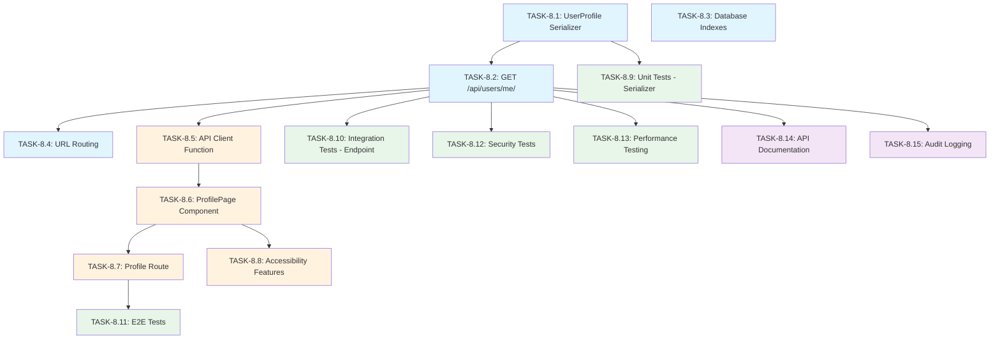

# US-8: User Profile Viewing

**Priority**: P1
**Feature**: Authentication & Authorization
**Status**: To Do

## Overview

This User Story implements a read-only profile viewing feature that allows authenticated users to access their account information through a secure API endpoint. The feature provides transparency about account details and serves as the foundation for profile management features.

### Context

Users need to view their profile information to verify their account details, understand their authentication method (Standard vs. Microsoft SSO), and check their account status. This is a critical component of the user dashboard and account settings section, enabling users to confirm their identity and account configuration.

### Decomposition Approach

This User Story has been decomposed into **15 granular tasks** across four categories:

- **Backend**: 4 tasks (serializer, endpoint, database optimization, routing)
- **Frontend**: 4 tasks (API client, page component, routing, accessibility)
- **Testing**: 5 tasks (unit, integration, E2E, security, performance)
- **Infrastructure**: 2 tasks (documentation, audit logging)

The implementation follows a sequential flow: backend foundation → frontend integration → comprehensive testing → infrastructure setup.

---

## Task Summary

| ID | Title | Type | Specialty | Effort | Dependencies | Status |
|----|-------|------|-----------|--------|--------------|--------|
| TASK-8.1 | Create UserProfile serializer | Backend | API | 2-3h | None | ⬜ |
| TASK-8.2 | Implement GET /api/users/me/ endpoint | Backend | API | 3-4h | TASK-8.1 | ⬜ |
| TASK-8.3 | Add database indexes for user lookups | Backend | Database | 1-2h | None | ⬜ |
| TASK-8.4 | Configure URL routing for profile endpoint | Backend | Config | 1h | TASK-8.2 | ⬜ |
| TASK-8.5 | Create API client function for profile fetching | Frontend | API | 2-3h | TASK-8.2 | ⬜ |
| TASK-8.6 | Create ProfilePage component | Frontend | Page | 4-6h | TASK-8.5 | ⬜ |
| TASK-8.7 | Add route for profile page | Frontend | Page | 1-2h | TASK-8.6 | ⬜ |
| TASK-8.8 | Implement accessibility features | Frontend | Component | 2-3h | TASK-8.6 | ⬜ |
| TASK-8.9 | Write unit tests for UserProfile serializer | Testing | Unit | 2-3h | TASK-8.1 | ⬜ |
| TASK-8.10 | Write integration tests for endpoint | Testing | Integration | 3-4h | TASK-8.2 | ⬜ |
| TASK-8.11 | Write E2E tests for profile viewing flow | Testing | E2E | 4-5h | TASK-8.7 | ⬜ |
| TASK-8.12 | Write security tests | Testing | Security | 2-3h | TASK-8.2 | ⬜ |
| TASK-8.13 | Perform performance testing | Testing | Integration | 3-4h | TASK-8.2 | ⬜ |
| TASK-8.14 | Update API documentation (OpenAPI/Swagger) | Infrastructure | Documentation | 2-3h | TASK-8.2 | ⬜ |
| TASK-8.15 | Add audit logging for profile views | Infrastructure | Config | 2-3h | TASK-8.2 | ⬜ |

**Legend**: ⬜ To Do | 🟦 In Progress | ✅ Done

---

## Task Details

### 🔧 Backend Tasks

#### TASK-8.1: Create UserProfile serializer

**Type**: Backend - API
**Priority**: P1
**Estimated Effort**: 2-3 hours

##### Description

Create a Django REST Framework serializer (`UserProfileSerializer`) that formats user profile data for API responses. The serializer must exclude sensitive fields (password hash, internal tokens, privileged fields) and map the `is_sso_user` boolean field to a human-readable `authentication_method` string ("Standard" or "Microsoft Entra ID"). This serializer ensures secure and consistent profile data representation.

##### Files Impacted

- `backend/accounts/serializers.py` (new or modified)
- `backend/accounts/models.py` (reference only)

##### Acceptance Criteria

- [ ] Serializer includes fields: id, email, first_name, last_name, authentication_method, created_at
- [ ] Serializer excludes sensitive fields: password, is_staff, is_superuser, last_login, internal tokens
- [ ] `authentication_method` field maps `is_sso_user=True` to "Microsoft Entra ID"
- [ ] `authentication_method` field maps `is_sso_user=False` to "Standard"
- [ ] Serializer handles nullable fields (first_name, last_name) gracefully with empty strings or null
- [ ] Date fields formatted as ISO 8601 strings
- [ ] Code follows Django REST Framework serializer patterns

##### Dependencies

None (foundational task)

##### Implementation Notes

- Use `SerializerMethodField` for `authentication_method` to compute from `is_sso_user`
- Consider using `ReadOnlyModelSerializer` since this is read-only
- Add docstrings explaining field mappings and security exclusions
- Verify User model has all required fields (id, email, first_name, last_name, is_sso_user, created_at)

---

#### TASK-8.2: Implement GET /api/users/me/ endpoint

**Type**: Backend - API
**Priority**: P1
**Estimated Effort**: 3-4 hours

##### Description

Implement a DRF ViewSet or APIView for the `/api/users/me/` endpoint that retrieves the authenticated user's profile. The endpoint must enforce JWT authentication using `IsAuthenticated` permission, extract user identity from the JWT token, serialize the user profile using `UserProfileSerializer`, and return appropriate HTTP status codes (200 for success, 401 for unauthorized). Comprehensive error handling is required for edge cases like deleted users or invalid tokens.

##### Files Impacted

- `backend/accounts/views.py` (new or modified)
- `backend/accounts/serializers.py` (reference TASK-8.1)
- `backend/config/settings.py` (verify JWT configuration)

##### Acceptance Criteria

- [ ] Endpoint responds to GET requests at `/api/users/me/`
- [ ] Endpoint requires valid JWT token in Authorization header
- [ ] Returns 200 OK with user profile JSON for valid authenticated requests
- [ ] Returns 401 Unauthorized for missing or invalid JWT tokens
- [ ] Returns 404 Not Found if user account deleted (edge case)
- [ ] User identity extracted from JWT token (not URL parameter)
- [ ] Response uses UserProfileSerializer for consistent formatting
- [ ] Endpoint handles concurrent requests without race conditions
- [ ] Code includes error handling for all edge cases

##### Dependencies

- TASK-8.1 (UserProfile serializer must exist)

##### Implementation Notes

- Use DRF's `RetrieveAPIView` or custom APIView
- Apply `permission_classes = [IsAuthenticated]`
- Access authenticated user via `request.user`
- No user ID in URL (always returns current user's profile)
- Add comprehensive docstring with request/response examples
- Consider caching strategy (Redis) if performance issues arise

---

#### TASK-8.3: Add database indexes for user lookups

**Type**: Backend - Database
**Priority**: P1
**Estimated Effort**: 1-2 hours

##### Description

Verify and optimize database indexes on the User table to ensure efficient profile retrieval queries. Add indexes on frequently queried fields (id, email) if not already present. This task ensures the endpoint meets the <100ms P95 response time requirement by minimizing database query time.

##### Files Impacted

- `backend/accounts/migrations/XXXX_add_user_indexes.py` (new migration)
- `backend/accounts/models.py` (verify existing indexes)

##### Acceptance Criteria

- [ ] Index exists on User.id (primary key - likely already indexed)
- [ ] Index exists on User.email (for lookup by email if needed)
- [ ] Migration file created for new indexes (if any)
- [ ] Migration tested in development environment
- [ ] Query execution plan analyzed (EXPLAIN ANALYZE) to verify index usage
- [ ] No redundant indexes created (avoid index bloat)
- [ ] Documentation updated with index rationale

##### Dependencies

None (can run in parallel with TASK-8.1, TASK-8.2)

##### Implementation Notes

- Use Django migration system: `python manage.py makemigrations`
- Add `db_index=True` to model fields if creating new indexes
- Test migration rollback to ensure reversibility
- PostgreSQL-specific: consider using `CREATE INDEX CONCURRENTLY` for zero-downtime
- Verify index usage with: `EXPLAIN ANALYZE SELECT * FROM users WHERE id = ?`

---

#### TASK-8.4: Configure URL routing for profile endpoint

**Type**: Backend - Config
**Priority**: P1
**Estimated Effort**: 1 hour

##### Description

Add URL routing configuration to Django's URL dispatcher to map `/api/users/me/` to the profile endpoint view. Register the endpoint in the appropriate URL configuration file (`accounts/urls.py` or `config/urls.py`) and ensure it's included in the main URL patterns. Verify routing works correctly with proper HTTP method handling (GET only).

##### Files Impacted

- `backend/accounts/urls.py` (new or modified)
- `backend/config/urls.py` (include accounts URLs)

##### Acceptance Criteria

- [ ] URL pattern `/api/users/me/` correctly routes to profile view
- [ ] GET method supported, other methods return 405 Method Not Allowed
- [ ] URL routing follows Django REST Framework conventions
- [ ] URL is included in main application URL patterns
- [ ] No trailing slash issues (handle both `/api/users/me` and `/api/users/me/`)
- [ ] Routing tested manually with curl or Postman

##### Dependencies

- TASK-8.2 (endpoint view must exist)

##### Implementation Notes

- Use DRF's `path()` or `re_path()` in `urls.py`
- Example: `path('users/me/', UserProfileView.as_view(), name='user-profile')`
- Ensure `accounts.urls` is included in main `config/urls.py`
- Consider using DRF router if using ViewSet approach
- Add URL name for reverse lookup in tests and documentation

---

### 🎨 Frontend Tasks

#### TASK-8.5: Create API client function for profile fetching

**Type**: Frontend - API
**Priority**: P1
**Estimated Effort**: 2-3 hours

##### Description

Implement a frontend API client function (`getUserProfile()`) that makes an authenticated GET request to `/api/users/me/` with the JWT access token in the Authorization header. The function must handle HTTP responses (200, 401, 404), automatically include the JWT token from application state or storage, implement error handling for network failures, and return a Promise with the user profile data. This function serves as the data layer for the profile page component.

##### Files Impacted

- `frontend/src/api/user.ts` (new or modified)
- `frontend/src/api/client.ts` (reference for base API client)
- `frontend/src/types/user.ts` (TypeScript types)

##### Acceptance Criteria

- [ ] Function `getUserProfile()` makes GET request to `/api/users/me/`
- [ ] JWT access token automatically included in Authorization header
- [ ] Returns Promise resolving to UserProfile object on success (200)
- [ ] Throws or returns error for 401 Unauthorized (triggers login redirect)
- [ ] Handles 404 Not Found gracefully (deleted user scenario)
- [ ] Handles network errors (timeout, no connection)
- [ ] TypeScript types defined for UserProfile response
- [ ] Function uses centralized API client (axios or fetch wrapper)
- [ ] Token refresh logic integrated if token expired

##### Dependencies

- TASK-8.2 (backend endpoint must be functional)

##### Implementation Notes

- Use existing API client setup (axios instance or fetch wrapper)
- Example: `const response = await apiClient.get('/api/users/me/')`
- Token handling: Retrieve from context, Redux store, or localStorage
- Error handling: Catch and transform API errors to user-friendly messages
- TypeScript interface: `interface UserProfile { id: string; email: string; ... }`
- Consider retry logic for transient network errors

---

#### TASK-8.6: Create ProfilePage component

**Type**: Frontend - Page
**Priority**: P1
**Estimated Effort**: 4-6 hours

##### Description

Create a React page component (`ProfilePage`) that displays authenticated user profile information in a clear, organized layout. The component must fetch profile data using `getUserProfile()` on mount, handle loading states with spinner or skeleton, display all profile fields (email, name, authentication method, account creation date), handle error states with user-friendly messages, and implement responsive design for mobile/tablet/desktop. The page serves as the primary interface for users to view their account details.

##### Files Impacted

- `frontend/src/pages/ProfilePage.tsx` (new)
- `frontend/src/components/ProfileCard.tsx` (optional sub-component)
- `frontend/src/styles/ProfilePage.module.css` (styling)

##### Acceptance Criteria

- [ ] Component fetches user profile on mount using `getUserProfile()`
- [ ] Loading state displayed during fetch (spinner or skeleton)
- [ ] Profile data displayed in organized cards or sections
- [ ] Fields shown: email, first name, last name, authentication method, account creation date
- [ ] Authentication method displayed with clear indicator (badge or text)
- [ ] Account creation date formatted in user's local timezone
- [ ] Error state displayed if fetch fails (with retry button)
- [ ] Responsive design: mobile (stack vertically), tablet (2 columns), desktop (grid layout)
- [ ] Empty states handled gracefully (missing first_name/last_name)
- [ ] Links to related actions: Edit Profile (US-9), Change Password (US-10), Logout (US-12)

##### Dependencies

- TASK-8.5 (API client function must exist)

##### Implementation Notes

- Use React hooks: `useState` for data, `useEffect` for fetch on mount
- Loading state: `{isLoading && <Spinner />}`
- Error handling: Display error message with retry button
- Date formatting: Use `Intl.DateTimeFormat` or library like `date-fns`
- Responsive CSS: Use flexbox or CSS Grid with media queries
- Accessibility: Semantic HTML (`<section>`, `<h1>`, `<dl>` for data)

---

#### TASK-8.7: Add route for profile page

**Type**: Frontend - Page
**Priority**: P1
**Estimated Effort**: 1-2 hours

##### Description

Configure React Router to add a route for the profile page at `/profile`. Implement an authentication guard (PrivateRoute or similar) to redirect unauthenticated users to the login page. Add navigation link in the app header or user menu to access the profile page. Ensure route matches application routing conventions.

##### Files Impacted

- `frontend/src/App.tsx` (or router configuration file)
- `frontend/src/components/PrivateRoute.tsx` (authentication guard)
- `frontend/src/components/Header.tsx` (navigation link)

##### Acceptance Criteria

- [ ] Route `/profile` renders ProfilePage component
- [ ] Unauthenticated users redirected to `/login` when accessing `/profile`
- [ ] Authenticated users can access `/profile` directly
- [ ] Navigation link added to header or user menu ("Profile" or "My Account")
- [ ] Active route indication in navigation (highlight current page)
- [ ] Route follows application routing patterns (nested routes if applicable)
- [ ] Browser back/forward buttons work correctly

##### Dependencies

- TASK-8.6 (ProfilePage component must exist)

##### Implementation Notes

- Use React Router: `<Route path="/profile" element={<PrivateRoute><ProfilePage /></PrivateRoute>} />`
- PrivateRoute checks authentication state (JWT token presence)
- Navigation link: `<NavLink to="/profile">My Profile</NavLink>`
- Consider nested routes if profile has sub-pages (e.g., `/profile/edit`)
- Add route to routing documentation

---

#### TASK-8.8: Implement accessibility features

**Type**: Frontend - Component
**Priority**: P1
**Estimated Effort**: 2-3 hours

##### Description

Enhance the ProfilePage component with accessibility features to meet WCAG 2.1 Level AA compliance. Add ARIA labels and roles for semantic clarity, ensure keyboard navigation works (tab through sections, no keyboard traps), test screen reader compatibility (VoiceOver, NVDA), verify color contrast ratios meet standards, and add focus indicators for interactive elements. This ensures the profile page is usable by all users, including those with disabilities.

##### Files Impacted

- `frontend/src/pages/ProfilePage.tsx` (modify for accessibility)
- `frontend/src/styles/ProfilePage.module.css` (focus indicators, contrast)

##### Acceptance Criteria

- [ ] Semantic HTML elements used (`<main>`, `<section>`, `<h1>`, `<dl>`)
- [ ] ARIA labels added for profile sections (`aria-label="User Profile"`)
- [ ] Keyboard navigation functional (tab through all interactive elements)
- [ ] No keyboard traps (user can navigate away with keyboard)
- [ ] Focus indicators visible on all interactive elements (buttons, links)
- [ ] Color contrast ratio ≥ 4.5:1 for text (WCAG AA)
- [ ] Screen reader announces profile information correctly
- [ ] Account creation date in accessible format (not just timestamp)
- [ ] Error messages announced to screen readers (`role="alert"`)

##### Dependencies

- TASK-8.6 (ProfilePage component must exist)

##### Implementation Notes

- Use semantic HTML over generic `<div>` elements
- ARIA example: `<section aria-label="Personal Information">`
- Focus indicators: CSS `:focus` styles (not removed)
- Test with screen readers: NVDA (Windows), VoiceOver (Mac), JAWS
- Contrast checker tool: WebAIM Contrast Checker
- Date format: "January 15, 2025" instead of "2025-01-15T10:30:00Z"

---

### ✅ Testing Tasks

#### TASK-8.9: Write unit tests for UserProfile serializer

**Type**: Testing - Unit
**Priority**: P1
**Estimated Effort**: 2-3 hours

##### Description

Write comprehensive unit tests for the `UserProfileSerializer` to verify correct serialization behavior. Test field inclusion/exclusion (sensitive fields must be excluded), authentication_method mapping logic (Standard vs. Microsoft SSO), nullable field handling (first_name, last_name), and date formatting. Achieve >80% code coverage for the serializer. Use pytest with Django REST Framework test utilities.

##### Files Impacted

- `backend/accounts/tests/test_serializers.py` (new or modified)

##### Acceptance Criteria

- [ ] Test verifies included fields: id, email, first_name, last_name, authentication_method, created_at
- [ ] Test verifies excluded fields: password, is_staff, is_superuser, last_login
- [ ] Test verifies authentication_method="Standard" when is_sso_user=False
- [ ] Test verifies authentication_method="Microsoft Entra ID" when is_sso_user=True
- [ ] Test handles nullable fields (first_name=None, last_name=None)
- [ ] Test verifies date fields in ISO 8601 format
- [ ] All tests pass with pytest
- [ ] Code coverage >80% for serializers.py

##### Dependencies

- TASK-8.1 (UserProfile serializer must exist)

##### Implementation Notes

- Use pytest fixtures to create test User instances
- Example test: `test_serializer_excludes_password_field()`
- Create user with: `User.objects.create(email="test@example.com", is_sso_user=False)`
- Serialize with: `serializer = UserProfileSerializer(user)`
- Assert with: `assert 'password' not in serializer.data`
- Run tests: `pytest backend/accounts/tests/test_serializers.py -v`
- Check coverage: `pytest --cov=accounts.serializers`

---

#### TASK-8.10: Write integration tests for /api/users/me/ endpoint

**Type**: Testing - Integration
**Priority**: P1
**Estimated Effort**: 3-4 hours

##### Description

Write integration tests for the `/api/users/me/` endpoint to verify end-to-end API behavior. Test successful profile retrieval with valid JWT, 401 response for missing/invalid tokens, 404 response for deleted users, and concurrent request handling. Use Django REST Framework's APIClient for authenticated requests. Ensure tests cover all acceptance criteria from TASK-8.2.

##### Files Impacted

- `backend/accounts/tests/test_views.py` (new or modified)

##### Acceptance Criteria

- [ ] Test successful GET request with valid JWT returns 200 and profile JSON
- [ ] Test GET request without Authorization header returns 401
- [ ] Test GET request with invalid JWT returns 401
- [ ] Test GET request with expired JWT returns 401 (or triggers refresh)
- [ ] Test GET request for deleted user returns 404
- [ ] Test concurrent requests from same user handled correctly
- [ ] Test response JSON structure matches UserProfileSerializer output
- [ ] All tests pass with pytest
- [ ] Tests use APIClient with JWT authentication

##### Dependencies

- TASK-8.2 (endpoint must be implemented)

##### Implementation Notes

- Use DRF's `APIClient`: `client = APIClient()`
- Generate JWT token: `token = create_jwt_token(user)`
- Authenticate: `client.credentials(HTTP_AUTHORIZATION=f'Bearer {token}')`
- Example test: `test_profile_endpoint_requires_authentication()`
- Test concurrent requests: Use threading or asyncio
- Run tests: `pytest backend/accounts/tests/test_views.py -v`

---

#### TASK-8.11: Write E2E tests for profile viewing flow

**Type**: Testing - E2E
**Priority**: P1
**Estimated Effort**: 4-5 hours

##### Description

Write end-to-end tests for the complete profile viewing user flow using a testing framework like Playwright or Cypress. Test the flow: login → navigate to profile → view data → verify display. Test for both standard authentication and SSO users. Verify error handling (expired token redirect to login). Ensure tests run in CI/CD pipeline.

##### Files Impacted

- `frontend/tests/e2e/profile.spec.ts` (new)
- `playwright.config.ts` or `cypress.config.ts` (configuration)

##### Acceptance Criteria

- [ ] Test flow: User logs in → clicks "Profile" → sees profile page → data displayed
- [ ] Test verifies email, name, authentication method, creation date visible
- [ ] Test for standard authentication user (authentication_method="Standard")
- [ ] Test for SSO user (authentication_method="Microsoft Entra ID")
- [ ] Test expired token scenario: redirects to login page
- [ ] Test missing authentication: redirects to login when accessing /profile directly
- [ ] All E2E tests pass in headless mode
- [ ] Tests run in CI/CD pipeline

##### Dependencies

- TASK-8.7 (profile route must be configured)

##### Implementation Notes

- Use Playwright or Cypress for E2E testing
- Example test: `test('user can view profile after login')`
- Setup: Create test user, generate JWT token, set in browser storage
- Navigate: `await page.goto('/profile')`
- Assert: `await expect(page.locator('[data-testid="email"]')).toContainText('test@example.com')`
- Run tests: `npx playwright test` or `npx cypress run`

---

#### TASK-8.12: Write security tests

**Type**: Testing - Security
**Priority**: P1
**Estimated Effort**: 2-3 hours

##### Description

Write security-focused tests to verify no sensitive data exposure, no cross-user data access, and proper token validation enforcement. Test scenarios: verify password hash not in response, verify users can't access other users' profiles, verify token tampering detected. Use pytest for backend security tests.

##### Files Impacted

- `backend/accounts/tests/test_security.py` (new)

##### Acceptance Criteria

- [ ] Test verifies password hash never exposed in API response
- [ ] Test verifies is_staff, is_superuser fields not exposed
- [ ] Test verifies users can only access their own profile (no user ID parameter)
- [ ] Test verifies token tampering returns 401 Unauthorized
- [ ] Test verifies expired token returns 401 Unauthorized
- [ ] Test verifies no SQL injection vulnerabilities (if any query parameters)
- [ ] All security tests pass with pytest

##### Dependencies

- TASK-8.2 (endpoint must be implemented)

##### Implementation Notes

- Example test: `test_password_hash_not_exposed_in_profile_response()`
- Create user with password: `user = User.objects.create_user(email="test@example.com", password="SecurePass123")`
- Fetch profile: `response = client.get('/api/users/me/')`
- Assert: `assert 'password' not in response.json()`
- Token tampering test: Modify JWT signature and verify 401 response
- Run tests: `pytest backend/accounts/tests/test_security.py -v`

---

#### TASK-8.13: Perform performance testing

**Type**: Testing - Integration
**Priority**: P1
**Estimated Effort**: 3-4 hours

##### Description

Conduct performance testing to verify the `/api/users/me/` endpoint meets the <100ms P95 response time requirement. Test 1000+ concurrent requests to ensure the system handles high load. Verify database query optimization and connection pool configuration. Use load testing tools like Locust or Apache JMeter.

##### Files Impacted

- `backend/tests/performance/test_profile_endpoint.py` (new)
- `locustfile.py` or JMeter test plan (load testing configuration)

##### Acceptance Criteria

- [ ] P95 response time < 100ms for profile endpoint
- [ ] System handles 1000+ concurrent requests without errors
- [ ] Database query execution time < 10ms (verify with EXPLAIN ANALYZE)
- [ ] No database connection pool exhaustion under load
- [ ] No memory leaks during sustained load
- [ ] Performance test results documented (response times, throughput)
- [ ] Load testing integrated into CI/CD pipeline (optional)

##### Dependencies

- TASK-8.2 (endpoint must be implemented)

##### Implementation Notes

- Use Locust for load testing: `locust -f locustfile.py`
- Example Locust task:
  ```python
  @task
  def get_profile(self):
      self.client.get('/api/users/me/', headers={'Authorization': f'Bearer {self.token}'})
  ```
- Run load test: 1000 users, 10 users/sec spawn rate
- Monitor response times: P50, P95, P99 percentiles
- Verify database query: `EXPLAIN ANALYZE SELECT * FROM users WHERE id = ?`
- Optimize if needed: Add indexes, configure connection pooling

---

### ⚙️ Infrastructure Tasks

#### TASK-8.14: Update API documentation (OpenAPI/Swagger)

**Type**: Infrastructure - Documentation
**Priority**: P1
**Estimated Effort**: 2-3 hours

##### Description

Document the `/api/users/me/` endpoint in the project's API specification using OpenAPI 3.0 (Swagger). Include endpoint path, HTTP method (GET), authentication requirement (Bearer JWT), request headers, response schemas (200, 401, 404), and example responses. Ensure documentation is auto-generated or manually updated in Swagger UI for developer reference.

##### Files Impacted

- `backend/docs/openapi.yaml` (manual documentation)
- `backend/accounts/views.py` (docstring for auto-generation)
- Swagger UI configuration (if applicable)

##### Acceptance Criteria

- [ ] Endpoint documented with path: `/api/users/me/`
- [ ] HTTP method specified: GET
- [ ] Authentication requirement documented: Bearer token (JWT)
- [ ] Request header documented: `Authorization: Bearer <access_token>`
- [ ] Response schema for 200 OK includes all fields (id, email, first_name, last_name, authentication_method, created_at)
- [ ] Response schema for 401 Unauthorized includes error structure
- [ ] Response schema for 404 Not Found includes error structure
- [ ] Example responses provided for each status code
- [ ] Documentation viewable in Swagger UI or API docs site

##### Dependencies

- TASK-8.2 (endpoint must be implemented)

##### Implementation Notes

- Use DRF's schema generation: `drf-spectacular` or `drf-yasg`
- Add docstring to view with OpenAPI annotations:
  ```python
  """
  Retrieve authenticated user profile.

  Returns profile information for the currently authenticated user.
  """
  ```
- Example OpenAPI YAML:
  ```yaml
  /api/users/me/:
    get:
      summary: Get user profile
      security:
        - bearerAuth: []
      responses:
        '200':
          description: User profile
          content:
            application/json:
              schema:
                $ref: '#/components/schemas/UserProfile'
  ```
- Generate docs: `python manage.py spectacular --file openapi.yaml`

---

#### TASK-8.15: Add audit logging for profile views

**Type**: Infrastructure - Config
**Priority**: P1
**Estimated Effort**: 2-3 hours

##### Description

Implement audit logging to track all profile view attempts for security monitoring and compliance. Log each profile access with timestamp, user ID, IP address, user agent, and request outcome (success/failure). Configure log retention policy and ensure logs are stored securely. Use Django logging framework or dedicated audit logging library.

##### Files Impacted

- `backend/accounts/views.py` (add logging calls)
- `backend/config/settings.py` (logging configuration)
- `backend/logs/audit.log` (log file location)

##### Acceptance Criteria

- [ ] Every profile view attempt logged (successful and failed)
- [ ] Log entry includes: timestamp, user ID, IP address, user agent, HTTP status code
- [ ] Failed authentication attempts logged (401 responses)
- [ ] Logs stored in dedicated audit log file (`audit.log`)
- [ ] Log retention policy configured (e.g., 90 days)
- [ ] Logs secured with appropriate file permissions (read-only for application)
- [ ] Log format is structured (JSON) for easy parsing
- [ ] No sensitive data (passwords, tokens) logged

##### Dependencies

- TASK-8.2 (endpoint must be implemented)

##### Implementation Notes

- Use Python logging: `import logging; logger = logging.getLogger('audit')`
- Add logging in view:
  ```python
  logger.info(f"Profile viewed by user {request.user.id} from IP {request.META['REMOTE_ADDR']}")
  ```
- Configure logging in settings.py:
  ```python
  LOGGING = {
      'handlers': {
          'audit_file': {
              'class': 'logging.FileHandler',
              'filename': 'logs/audit.log',
              'formatter': 'json',
          },
      },
      'loggers': {
          'audit': {
              'handlers': ['audit_file'],
              'level': 'INFO',
          },
      },
  }
  ```
- Consider using structured logging library like `python-json-logger`

---

## Dependency Graph

### Mermaid Diagram



### Implementation Phases

**Phase 1: Backend Foundation (7-10 hours)**
- TASK-8.1: Create UserProfile serializer (2-3h)
- TASK-8.2: Implement GET /api/users/me/ endpoint (3-4h)
- TASK-8.3: Add database indexes (1-2h) - **Parallel**
- TASK-8.4: Configure URL routing (1h)

**Phase 2: Frontend Integration (9-14 hours)**
- TASK-8.5: Create API client function (2-3h)
- TASK-8.6: Create ProfilePage component (4-6h)
- TASK-8.7: Add route for profile page (1-2h)
- TASK-8.8: Implement accessibility features (2-3h) - **Can start with TASK-8.6**

**Phase 3: Testing & Validation (14-19 hours)**
- TASK-8.9: Unit tests for serializer (2-3h) - **Parallel after Phase 1**
- TASK-8.10: Integration tests for endpoint (3-4h) - **Parallel after Phase 1**
- TASK-8.11: E2E tests (4-5h) - **Requires Phase 2 complete**
- TASK-8.12: Security tests (2-3h) - **Parallel with TASK-8.10**
- TASK-8.13: Performance testing (3-4h) - **Parallel with TASK-8.10**

**Phase 4: Infrastructure & Documentation (4-6 hours)**
- TASK-8.14: API documentation (2-3h) - **Parallel after Phase 1**
- TASK-8.15: Audit logging (2-3h) - **Parallel after Phase 1**

### Parallelization Opportunities

**After TASK-8.2 completes**, these tasks can run in parallel:
- TASK-8.5 (API client) - Frontend team
- TASK-8.9 (Unit tests) - Backend QA
- TASK-8.10 (Integration tests) - Backend QA
- TASK-8.12 (Security tests) - Security team
- TASK-8.13 (Performance tests) - DevOps/QA team
- TASK-8.14 (API documentation) - Technical writer
- TASK-8.15 (Audit logging) - Backend team

**Independent task (can start anytime)**:
- TASK-8.3 (Database indexes) - DBA or backend team

**Backend and Frontend work in parallel**:
- Phase 1 (Backend) and Phase 2 (Frontend) have minimal overlap after TASK-8.2
- Frontend can begin TASK-8.5 once TASK-8.2 API endpoint is functional

---

## Effort Estimation

### By Task Type

| Type | Tasks | Estimated Effort | Percentage |
|------|-------|------------------|------------|
| Backend | 4 | 7-10 hours | 19-20% |
| Frontend | 4 | 9-14 hours | 25-27% |
| Testing | 5 | 14-19 hours | 39-37% |
| Infrastructure | 2 | 4-6 hours | 11-12% |
| **TOTAL** | **15** | **36-51 hours** | **100%** |

### By Priority

| Priority | Tasks | Estimated Effort |
|----------|-------|------------------|
| P1 | 15 | 36-51 hours |
| P2 | 0 | 0 hours |
| P3 | 0 | 0 hours |

### By Developer

**1 Full-Stack Developer (Sequential)**:
- Best case: 36 hours = **4.5 days** (assuming 8-hour days)
- Worst case: 51 hours = **6.4 days** (assuming 8-hour days)
- **Realistic estimate: 5-7 days**

**2 Developers (Backend + Frontend in Parallel)**:
- Backend track: 7-10 hours + testing (partial) = ~15-20 hours
- Frontend track: 9-14 hours = ~9-14 hours
- Sequential dependencies: Some tasks still sequential (frontend needs backend endpoint)
- **Realistic estimate: 3-4 days** with good coordination

**Team with Specialized Roles (Maximum Parallelization)**:
- Backend dev: Phase 1 (7-10h)
- Frontend dev: Phase 2 (9-14h) - starts after TASK-8.2
- QA engineers: Phase 3 (14-19h) - starts after Phase 1, runs parallel
- DevOps/Docs: Phase 4 (4-6h) - runs parallel with Phase 2-3
- **Realistic estimate: 2-3 days** with full team

---

## Implementation Notes

### Technology Stack

**Backend**:
- Framework: Django 4.2+ with Django REST Framework 3.14+
- Database: PostgreSQL 15+ (via Supabase)
- Authentication: djangorestframework-simplejwt 5.2+ (JWT tokens)
- Password Hashing: Argon2 (via argon2-cffi)
- Testing: pytest, pytest-django

**Frontend**:
- Framework: React 18+ (SPA architecture)
- HTTP Client: Axios or Fetch API
- State Management: Context API or Redux
- Routing: React Router v6
- Testing: Jest, React Testing Library, Playwright or Cypress

**Infrastructure**:
- Caching: Redis 7+ (optional for profile caching)
- Logging: Python logging framework with structured logs
- Documentation: OpenAPI 3.0 (Swagger), drf-spectacular

### Patterns and Conventions

**Backend**:
- Use Django REST Framework ViewSets or APIViews for endpoints
- Apply DRF permission classes (`IsAuthenticated`) for authentication enforcement
- Serialize data with DRF serializers (never expose raw model instances)
- Follow Django migration workflow for database changes
- Use Python logging for audit trails (avoid print statements)

**Frontend**:
- Use React functional components with hooks (no class components)
- Implement loading/error states for all async operations
- Follow accessibility best practices (semantic HTML, ARIA labels)
- Use TypeScript for type safety in API client functions
- Implement responsive design with mobile-first approach

**Testing**:
- Backend: Use pytest with fixtures for reusable test data
- Frontend: Use React Testing Library for component tests
- E2E: Use Playwright or Cypress for full user flows
- Security: Test authentication, authorization, and data exposure
- Performance: Use Locust or JMeter for load testing

### Configuration Requirements

**Backend Environment Variables**:
```bash
# JWT Configuration
JWT_SECRET_KEY=<jwt-signing-key>  # Separate from Django SECRET_KEY
JWT_ACCESS_TOKEN_LIFETIME=15  # minutes
JWT_REFRESH_TOKEN_LIFETIME=10080  # minutes (7 days)

# Database
DATABASE_URL=<postgresql-connection-string>  # Supabase

# Redis (optional for caching)
REDIS_URL=<redis-connection-string>

# Logging
LOG_LEVEL=INFO
AUDIT_LOG_FILE=logs/audit.log
```

**Frontend Environment Variables**:
```bash
# API Configuration
REACT_APP_API_BASE_URL=http://localhost:8000/api
REACT_APP_FRONTEND_URL=http://localhost:3000
```

**Database Setup**:
- Ensure User model has fields: id, email, first_name, last_name, is_sso_user, created_at, password (hashed)
- Run migrations before testing: `python manage.py migrate`
- Create test users: `python manage.py createsuperuser`

---

## Risks and Attention Points

### Identified Risks

**Risk 1: Authentication Method Display for SSO Users**
- **Impact**: Medium - Incorrect label if is_sso_user field not properly set
- **Likelihood**: Low - Field should be set during SSO login (US-7)
- **Mitigation**:
  - Verify US-7 (Microsoft SSO) sets is_sso_user=True correctly
  - Add validation in US-7 tests to confirm field value
  - Add defensive check in serializer (default to "Unknown" if field missing)
- **Contingency**:
  - Manual data migration to fix incorrect is_sso_user values
  - Add admin UI to correct user authentication method

**Risk 2: Performance Degradation Under Load**
- **Impact**: High - Poor UX if response time > 100ms
- **Likelihood**: Low - Simple query with proper indexes
- **Mitigation**:
  - Implement database indexes (TASK-8.3)
  - Add performance testing (TASK-8.13)
  - Consider Redis caching if needed
  - Monitor production performance metrics
- **Contingency**:
  - Add caching layer (Redis) for frequently accessed profiles
  - Optimize database query with EXPLAIN ANALYZE
  - Scale database resources (connection pool, read replicas)

**Risk 3: Sensitive Data Exposure**
- **Impact**: Critical - Security breach if password hash exposed
- **Likelihood**: Very Low - Serializer explicitly excludes fields
- **Mitigation**:
  - Comprehensive security testing (TASK-8.12)
  - Code review focused on data exposure
  - Use ReadOnlyModelSerializer to prevent field modification
  - Regular security audits
- **Contingency**:
  - Immediate hotfix to remove exposed fields
  - Security incident response protocol
  - Notify affected users if breach detected

**Risk 4: Deleted User Edge Case**
- **Impact**: Low - 404 response for deleted users (rare scenario)
- **Likelihood**: Very Low - Users rarely deleted, token would be invalid
- **Mitigation**:
  - Implement 404 handling in endpoint (TASK-8.2)
  - Test deleted user scenario (TASK-8.10)
  - Frontend displays user-friendly error message
- **Contingency**:
  - Force logout and redirect to login page
  - Clear JWT tokens from client storage

### Critical Points

**Security Considerations**:
- **Never expose password hash** or internal tokens in API response
- **Enforce JWT authentication** on endpoint (IsAuthenticated permission)
- **Prevent cross-user data access** (always use request.user, never URL parameter)
- **Audit log all profile views** for security monitoring (TASK-8.15)
- **Secure log files** with appropriate file permissions

**Performance Considerations**:
- **Database indexes** on user lookups to meet <100ms P95 target
- **Connection pooling** configured for concurrent requests
- **Caching strategy** (optional) if performance issues arise
- **Monitor P95 response time** in production with APM tools

**UX/Accessibility Considerations**:
- **Loading states** displayed during profile fetch
- **Error messages** user-friendly and actionable
- **Responsive design** for mobile, tablet, desktop
- **WCAG 2.1 Level AA compliance** for accessibility
- **Date formatting** in user's local timezone

**Dependency Considerations**:
- **US-3 (Standard Login)** must be complete (JWT token generation)
- **US-7 (Microsoft SSO)** must be complete (is_sso_user field set correctly)
- **Frontend must handle token refresh** if access token expires during session

---

## Next Steps

After reviewing and verifying this task breakdown:

1. **Manual Verification**: Review all tasks for completeness, accuracy, and clarity
2. **Adjustments**: Edit tasks.md directly if any changes needed (add/remove/modify tasks)
3. **GitHub Issues**: Run `/spec-create-issues authentication/US-8` to create trackable issues
4. **Implementation**: Assign tasks to developers and begin Phase 1 (Backend Foundation)
5. **Progress Tracking**: Use `.impl-state.json` to track task completion

---

**Generated by**: Functional Spec Planner - Task Decomposition
**Generated at**: 2025-01-09
**Source User Story**: specs/authentication/US-8/user-story.md
**Total Tasks**: 15
**Estimated Effort**: 36-51 hours (5-7 days for 1 developer)
