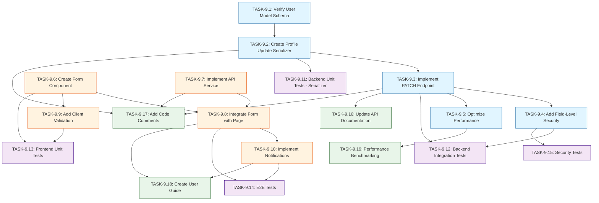

# US-9: User Profile Update

**Priority**: P2
**Feature**: Authentication & Authorization
**Status**: To Do

## Overview

This User Story enables authenticated users to update their personal profile information (first name and last name) through a dedicated PATCH endpoint. The implementation ensures secure profile management with comprehensive validation, prevents updates to protected fields, and maintains high performance standards (< 200ms P95 response time).

### Context

Profile management is a fundamental feature that allows users to keep their personal information current. This enhances user experience and data accuracy across the platform. The feature is designed with security-first principles, ensuring that sensitive fields (email, password, is_staff) remain protected from unauthorized modifications.

### Decomposition Approach

This User Story has been decomposed into 19 granular tasks across four categories:

- **Total tasks**: 19
- **Backend**: 5 tasks (API, serializers, security, performance)
- **Frontend**: 5 tasks (components, forms, validation, integration)
- **Testing**: 5 tasks (unit, integration, E2E, security)
- **Infrastructure**: 4 tasks (documentation, monitoring)

The implementation follows a parallel development strategy where backend and frontend teams can work simultaneously, followed by comprehensive testing and documentation phases.

---

## Task Summary

| ID | Title | Type | Specialty | Effort | Dependencies | Status |
|----|-------|------|-----------|--------|--------------|--------|
| TASK-9.1 | Verify User Model Schema | Backend | Database | 1h | None | ⬜ |
| TASK-9.2 | Create Profile Update Serializer | Backend | API | 3h | TASK-9.1 | ⬜ |
| TASK-9.3 | Implement PATCH /api/users/me/ Endpoint | Backend | API | 4h | TASK-9.2 | ⬜ |
| TASK-9.4 | Add Field-Level Security Validation | Backend | Security | 2h | TASK-9.3 | ⬜ |
| TASK-9.5 | Optimize Profile Update Performance | Backend | Performance | 3h | TASK-9.3 | ⬜ |
| TASK-9.6 | Create Profile Edit Form Component | Frontend | Component | 5h | None | ⬜ |
| TASK-9.7 | Implement Profile Update API Service | Frontend | API | 3h | None | ⬜ |
| TASK-9.8 | Integrate Profile Edit Form with Profile Page | Frontend | Page | 4h | TASK-9.6, TASK-9.7 | ⬜ |
| TASK-9.9 | Add Client-Side Form Validation | Frontend | Component | 3h | TASK-9.6 | ⬜ |
| TASK-9.10 | Implement Success and Error Notifications | Frontend | Component | 3h | TASK-9.8 | ⬜ |
| TASK-9.11 | Write Backend Unit Tests for Serializer | Testing | Unit | 3h | TASK-9.2 | ⬜ |
| TASK-9.12 | Write Backend Integration Tests for API Endpoint | Testing | Integration | 4h | TASK-9.3, TASK-9.4 | ⬜ |
| TASK-9.13 | Write Frontend Unit Tests for Form Component | Testing | Unit | 4h | TASK-9.6, TASK-9.9 | ⬜ |
| TASK-9.14 | Write End-to-End Test for Profile Update Flow | Testing | E2E | 5h | TASK-9.8, TASK-9.10 | ⬜ |
| TASK-9.15 | Write Security Tests | Testing | Security | 3h | TASK-9.4 | ⬜ |
| TASK-9.16 | Update API Documentation | Infrastructure | Documentation | 2h | TASK-9.3 | ⬜ |
| TASK-9.17 | Add Code Comments and Docstrings | Infrastructure | Documentation | 2h | TASK-9.2, TASK-9.3, TASK-9.7 | ⬜ |
| TASK-9.18 | Create User Guide Documentation | Infrastructure | Documentation | 2h | TASK-9.8, TASK-9.10 | ⬜ |
| TASK-9.19 | Performance Benchmarking and Monitoring | Infrastructure | Performance | 3h | TASK-9.5 | ⬜ |

**Total Effort**: 59 hours (~7-8 days)

---

## Task Details

### 🔧 Backend Tasks

#### TASK-9.1: Verify User Model Schema

**Type**: Backend - Database
**Priority**: P1
**Estimated Effort**: 1 hour

##### Description

Verify that the User model has the required fields (`first_name`, `last_name`, `updated_at`) with appropriate data types and constraints. Ensure the model supports the profile update functionality without requiring schema migrations. This is a verification task to confirm the existing schema is sufficient.

##### Files Impacted

- `backend/accounts/models.py` (modification - verification only)

##### Acceptance Criteria

- [ ] User model has `first_name` field (VARCHAR, nullable, max_length=150)
- [ ] User model has `last_name` field (VARCHAR, nullable, max_length=150)
- [ ] User model has `updated_at` field for audit trail (auto_now=True)
- [ ] No schema migrations required for US-9

##### Dependencies

None

##### Implementation Notes

- Check Django User model or CustomUser model definition
- Verify field types match Django best practices
- Confirm `updated_at` field exists for timestamp tracking
- Document any missing fields (unlikely for standard Django User)

---

#### TASK-9.2: Create Profile Update Serializer

**Type**: Backend - API
**Priority**: P1
**Estimated Effort**: 3 hours

##### Description

Create a DRF serializer for profile updates that validates `first_name` and `last_name` fields, prevents empty string submissions, enforces length constraints, and explicitly blocks updates to protected fields (email, password, is_staff). The serializer should support partial updates and accept Unicode characters.

##### Files Impacted

- `backend/accounts/serializers.py` (modification)

##### Acceptance Criteria

- [ ] Serializer accepts only `first_name` and `last_name` fields
- [ ] Validation rejects empty strings (whitespace-only)
- [ ] Validation enforces max length constraints (150 characters)
- [ ] Validation accepts Unicode characters (é, ñ, ü, 中)
- [ ] Protected fields (email, password, is_staff) are read-only or excluded
- [ ] Partial updates supported (update only one field)

##### Dependencies

- TASK-9.1 (User model verified)

##### Implementation Notes

- Use DRF ModelSerializer or Serializer class
- Add custom validators for whitespace-only strings
- Set `read_only_fields` or `exclude` for protected fields
- Use `allow_blank=False` for name fields
- Test with various Unicode inputs during development

**Example Implementation**:
```python
class ProfileUpdateSerializer(serializers.ModelSerializer):
    class Meta:
        model = User
        fields = ['first_name', 'last_name']
        extra_kwargs = {
            'first_name': {'allow_blank': False, 'trim_whitespace': True},
            'last_name': {'allow_blank': False, 'trim_whitespace': True},
        }

    def validate_first_name(self, value):
        if not value or not value.strip():
            raise serializers.ValidationError("First name cannot be empty")
        return value.strip()
```

---

#### TASK-9.3: Implement PATCH /api/users/me/ Endpoint

**Type**: Backend - API
**Priority**: P1
**Estimated Effort**: 4 hours

##### Description

Implement the PATCH endpoint in the user viewset that handles profile updates for authenticated users. Use IsAuthenticated permission class, retrieve the current user from the request, apply the serializer, update the `updated_at` timestamp, and return the full updated profile.

##### Files Impacted

- `backend/accounts/views.py` (modification)
- `backend/accounts/urls.py` (modification if new route needed)

##### Acceptance Criteria

- [ ] Endpoint accessible at `PATCH /api/users/me/`
- [ ] Requires valid JWT token (IsAuthenticated permission)
- [ ] Returns 200 OK with updated profile on success
- [ ] Returns 400 Bad Request with validation errors
- [ ] Returns 401 Unauthorized for missing/invalid token
- [ ] Updates `updated_at` timestamp automatically
- [ ] Uses database transaction for atomicity

##### Dependencies

- TASK-9.2 (Serializer created)

##### Implementation Notes

- Use DRF ViewSet or APIView with `partial_update` method
- Get user from `request.user` (authenticated)
- Use `partial=True` for partial updates
- Wrap in database transaction using `@transaction.atomic`
- Return full user profile (not just updated fields)

**Example Implementation**:
```python
from rest_framework.decorators import action
from rest_framework.permissions import IsAuthenticated
from django.db import transaction

class UserViewSet(viewsets.ModelViewSet):
    permission_classes = [IsAuthenticated]

    @action(detail=False, methods=['patch'])
    @transaction.atomic
    def me(self, request):
        user = request.user
        serializer = ProfileUpdateSerializer(user, data=request.data, partial=True)
        serializer.is_valid(raise_exception=True)
        serializer.save()
        return Response(UserProfileSerializer(user).data)
```

---

#### TASK-9.4: Add Field-Level Security Validation

**Type**: Backend - Security
**Priority**: P1
**Estimated Effort**: 2 hours

##### Description

Add explicit security checks to prevent updates to protected fields even if malicious requests attempt to modify them. Log any attempts to modify protected fields for security monitoring and audit trail purposes.

##### Files Impacted

- `backend/accounts/serializers.py` (modification)
- `backend/accounts/views.py` (modification)

##### Acceptance Criteria

- [ ] Attempting to update `email` is silently ignored (not applied)
- [ ] Attempting to update `password` is silently ignored
- [ ] Attempting to update `is_staff` is silently ignored
- [ ] Security events logged for audit trail (user ID, timestamp, field attempt)
- [ ] No error returned to user (prevent information disclosure)

##### Dependencies

- TASK-9.3 (API endpoint implemented)

##### Implementation Notes

- Add security logging in serializer's `update()` method
- Check if request data contains protected fields
- Log attempts but don't raise errors (silent fail)
- Use Django's logging framework
- Consider using Django signals for audit logging

**Example Implementation**:
```python
import logging

logger = logging.getLogger('security')

class ProfileUpdateSerializer(serializers.ModelSerializer):
    def update(self, instance, validated_data):
        # Log attempts to modify protected fields
        protected_fields = ['email', 'password', 'is_staff']
        for field in protected_fields:
            if field in self.initial_data:
                logger.warning(
                    f"User {instance.id} attempted to modify protected field '{field}'"
                )
        return super().update(instance, validated_data)
```

---

#### TASK-9.5: Optimize Profile Update Performance

**Type**: Backend - Performance
**Priority**: P2
**Estimated Effort**: 3 hours

##### Description

Optimize the profile update endpoint to meet the < 200ms (P95) response time requirement. Implement query optimization, minimize database writes for unchanged values, and add database indexes if needed.

##### Files Impacted

- `backend/accounts/views.py` (modification)
- Database indexes configuration (if needed)

##### Acceptance Criteria

- [ ] Endpoint responds within 200ms for P95 of requests
- [ ] No unnecessary database writes when values unchanged
- [ ] Uses select_related/prefetch_related where applicable
- [ ] Database connection pooling configured appropriately
- [ ] Performance benchmarks documented

##### Dependencies

- TASK-9.3 (API endpoint implemented)

##### Implementation Notes

- Check if values actually changed before database update
- Use Django's `update_fields` parameter to update only changed fields
- Verify database connection pooling settings
- Use Django Debug Toolbar during development to identify N+1 queries
- Consider adding database index on user.id if not already present

**Example Optimization**:
```python
def update(self, instance, validated_data):
    # Only update if values changed
    changed_fields = []
    for field, value in validated_data.items():
        if getattr(instance, field) != value:
            setattr(instance, field, value)
            changed_fields.append(field)

    if changed_fields:
        instance.save(update_fields=changed_fields + ['updated_at'])

    return instance
```

---

### 🎨 Frontend Tasks

#### TASK-9.6: Create Profile Edit Form Component

**Type**: Frontend - Component
**Priority**: P1
**Estimated Effort**: 5 hours

##### Description

Create a reusable profile edit form component with controlled inputs for first_name and last_name. Include real-time validation, prepopulated current values, and proper accessibility attributes (ARIA labels, keyboard navigation). The form should be responsive and follow project design standards.

##### Files Impacted

- `frontend/src/components/ProfileEditForm.jsx` (new)
- `frontend/src/components/ProfileEditForm.module.css` (new)

##### Acceptance Criteria

- [ ] Form has two input fields: First Name, Last Name
- [ ] Current values prepopulated from user profile state
- [ ] Real-time validation for empty strings and length
- [ ] Accepts Unicode characters (é, ñ, ü, 中)
- [ ] ARIA labels and accessibility attributes present
- [ ] Keyboard navigation functional (Tab through fields)
- [ ] Responsive design (mobile, tablet, desktop)

##### Dependencies

None (can be developed in parallel with backend)

##### Implementation Notes

- Use React controlled components with useState
- Use React 18+ best practices
- Apply CSS modules for styling
- Include proper form labels and ARIA attributes
- Test on multiple screen sizes during development

**Example Component Structure**:
```jsx
import React, { useState } from 'react';
import styles from './ProfileEditForm.module.css';

const ProfileEditForm = ({ currentProfile, onSubmit, onCancel }) => {
  const [formData, setFormData] = useState({
    first_name: currentProfile.first_name || '',
    last_name: currentProfile.last_name || '',
  });

  const handleChange = (e) => {
    setFormData({
      ...formData,
      [e.target.name]: e.target.value,
    });
  };

  return (
    <form onSubmit={handleSubmit} className={styles.form}>
      <label htmlFor="first_name">First Name</label>
      <input
        id="first_name"
        name="first_name"
        value={formData.first_name}
        onChange={handleChange}
        aria-label="First Name"
      />
      {/* ... */}
    </form>
  );
};
```

---

#### TASK-9.7: Implement Profile Update API Service

**Type**: Frontend - API
**Priority**: P1
**Estimated Effort**: 3 hours

##### Description

Create an API service function that sends PATCH requests to `/api/users/me/` with JWT authentication headers. Handle token refresh, network errors, and validation error responses appropriately. Use Axios or Fetch API based on project standards.

##### Files Impacted

- `frontend/src/services/userService.js` (modification)
- `frontend/src/services/api.js` (modification if needed for interceptors)

##### Acceptance Criteria

- [ ] Function sends PATCH request to `/api/users/me/`
- [ ] JWT access token included in Authorization header
- [ ] Handles 200 OK response with updated profile
- [ ] Handles 400 Bad Request with validation errors
- [ ] Handles 401 Unauthorized with token refresh or redirect
- [ ] Returns structured response for UI consumption
- [ ] Network error handling with user-friendly messages

##### Dependencies

None (can be developed in parallel with backend)

##### Implementation Notes

- Use project's HTTP client (Axios or Fetch)
- Leverage existing token refresh interceptors
- Transform API errors to user-friendly messages
- Return consistent response format for UI

**Example Implementation**:
```javascript
import api from './api';

export const updateUserProfile = async (profileData) => {
  try {
    const response = await api.patch('/api/users/me/', profileData);
    return {
      success: true,
      data: response.data,
    };
  } catch (error) {
    return {
      success: false,
      error: error.response?.data?.message || 'Failed to update profile',
      details: error.response?.data?.details,
    };
  }
};
```

---

#### TASK-9.8: Integrate Profile Edit Form with Profile Page

**Type**: Frontend - Page
**Priority**: P1
**Estimated Effort**: 4 hours

##### Description

Integrate the profile edit form into the profile page with "Edit Profile" button that opens the form (modal or inline). Handle form submission, display success/error messages, and update profile state on successful save. Implement proper state management for profile data.

##### Files Impacted

- `frontend/src/pages/ProfilePage.jsx` (modification)
- `frontend/src/pages/ProfilePage.module.css` (modification)

##### Acceptance Criteria

- [ ] "Edit Profile" button visible on profile page
- [ ] Clicking button opens edit form (modal or inline)
- [ ] Form submission calls API service function
- [ ] Success message displayed: "Profile updated successfully"
- [ ] Error messages displayed for validation failures
- [ ] Profile view updated immediately after save
- [ ] "Cancel" button closes form without saving
- [ ] Form closes/redirects after successful save

##### Dependencies

- TASK-9.6 (Form component created)
- TASK-9.7 (API service implemented)

##### Implementation Notes

- Use React state for edit mode toggle
- Consider using React Context or Redux for profile state
- Update profile state on successful save (optimistic or from API)
- Handle loading states during API calls

**Example Integration**:
```jsx
const ProfilePage = () => {
  const [isEditing, setIsEditing] = useState(false);
  const [profile, setProfile] = useState(null);

  const handleSave = async (formData) => {
    const result = await updateUserProfile(formData);
    if (result.success) {
      setProfile(result.data);
      setIsEditing(false);
      showNotification('Profile updated successfully', 'success');
    } else {
      showNotification(result.error, 'error');
    }
  };

  return (
    <div>
      {!isEditing ? (
        <>
          <ProfileView profile={profile} />
          <button onClick={() => setIsEditing(true)}>Edit Profile</button>
        </>
      ) : (
        <ProfileEditForm
          currentProfile={profile}
          onSubmit={handleSave}
          onCancel={() => setIsEditing(false)}
        />
      )}
    </div>
  );
};
```

---

#### TASK-9.9: Add Client-Side Form Validation

**Type**: Frontend - Component
**Priority**: P2
**Estimated Effort**: 3 hours

##### Description

Implement comprehensive client-side validation to provide immediate feedback before API submission. Validate name fields are not empty, not whitespace-only, and within length constraints. Display validation errors in real-time as user types.

##### Files Impacted

- `frontend/src/components/ProfileEditForm.jsx` (modification)
- `frontend/src/utils/validation.js` (new or modification)

##### Acceptance Criteria

- [ ] Real-time validation on input change
- [ ] Error messages shown immediately for invalid input
- [ ] Empty field validation (cannot be blank)
- [ ] Whitespace-only validation (trimmed value checked)
- [ ] Max length validation (150 characters)
- [ ] Submit button disabled when validation fails
- [ ] Validation messages clear and user-friendly

##### Dependencies

- TASK-9.6 (Form component created)

##### Implementation Notes

- Create reusable validation functions
- Use useState for validation errors
- Validate on onChange for real-time feedback
- Validate on onBlur for final check before submit
- Disable submit button based on validation state

**Example Validation**:
```javascript
// validation.js
export const validateName = (value) => {
  if (!value || value.trim().length === 0) {
    return 'This field cannot be empty';
  }
  if (value.length > 150) {
    return 'Maximum 150 characters allowed';
  }
  return null;
};

// Component usage
const [errors, setErrors] = useState({});

const handleChange = (e) => {
  const { name, value } = e.target;
  setFormData({ ...formData, [name]: value });

  // Real-time validation
  const error = validateName(value);
  setErrors({ ...errors, [name]: error });
};
```

---

#### TASK-9.10: Implement Success and Error Notifications

**Type**: Frontend - Component
**Priority**: P2
**Estimated Effort**: 3 hours

##### Description

Create or integrate a notification system that displays success and error messages after profile update attempts. Ensure notifications are accessible (screen reader compatible) and dismissible. Notifications should auto-dismiss after 5 seconds but be manually dismissible earlier.

##### Files Impacted

- `frontend/src/components/Notification.jsx` (new or modification)
- `frontend/src/pages/ProfilePage.jsx` (modification)

##### Acceptance Criteria

- [ ] Success notification shown after successful update
- [ ] Error notification shown for validation/network errors
- [ ] Notifications auto-dismiss after 5 seconds
- [ ] Notifications manually dismissible by user
- [ ] ARIA live regions for screen reader announcements
- [ ] Color contrast meets WCAG 2.1 Level AA
- [ ] Notifications positioned clearly (top-right or top-center)

##### Dependencies

- TASK-9.8 (Form integration complete)

##### Implementation Notes

- Use React portals for notification positioning
- Implement notification queue if multiple notifications
- Use ARIA live regions: `role="alert"` or `aria-live="polite"`
- Style with sufficient color contrast (WCAG AA)
- Consider using existing notification library (react-toastify, etc.)

**Example Notification Component**:
```jsx
const Notification = ({ message, type, onClose }) => {
  useEffect(() => {
    const timer = setTimeout(() => {
      onClose();
    }, 5000);
    return () => clearTimeout(timer);
  }, [onClose]);

  return (
    <div
      role="alert"
      aria-live="polite"
      className={`notification notification-${type}`}
    >
      <span>{message}</span>
      <button onClick={onClose} aria-label="Close notification">
        ×
      </button>
    </div>
  );
};
```

---

### ✅ Testing Tasks

#### TASK-9.11: Write Backend Unit Tests for Serializer

**Type**: Testing - Unit
**Priority**: P1
**Estimated Effort**: 3 hours

##### Description

Write comprehensive unit tests for the profile update serializer covering valid inputs, validation errors, partial updates, Unicode handling, and protected field exclusion. Achieve > 80% code coverage for the serializer.

##### Files Impacted

- `backend/accounts/tests/test_serializers.py` (new or modification)

##### Acceptance Criteria

- [ ] Test valid update with both fields
- [ ] Test partial update (first_name only, last_name only)
- [ ] Test empty string rejection
- [ ] Test whitespace-only rejection
- [ ] Test max length validation
- [ ] Test Unicode character acceptance
- [ ] Test protected field exclusion (email, password, is_staff)
- [ ] Code coverage > 80% for serializer

##### Dependencies

- TASK-9.2 (Serializer created)

##### Implementation Notes

- Use pytest with pytest-django
- Use Django's TestCase or pytest fixtures
- Test both valid and invalid scenarios
- Use parametrized tests for multiple input combinations

**Example Test Structure**:
```python
import pytest
from accounts.serializers import ProfileUpdateSerializer

@pytest.mark.django_db
class TestProfileUpdateSerializer:
    def test_valid_update_both_fields(self, user):
        data = {'first_name': 'John', 'last_name': 'Doe'}
        serializer = ProfileUpdateSerializer(user, data=data, partial=True)
        assert serializer.is_valid()

    def test_empty_string_rejected(self, user):
        data = {'first_name': ''}
        serializer = ProfileUpdateSerializer(user, data=data, partial=True)
        assert not serializer.is_valid()
        assert 'first_name' in serializer.errors

    def test_unicode_characters_accepted(self, user):
        data = {'first_name': 'José', 'last_name': '李明'}
        serializer = ProfileUpdateSerializer(user, data=data, partial=True)
        assert serializer.is_valid()
```

---

#### TASK-9.12: Write Backend Integration Tests for API Endpoint

**Type**: Testing - Integration
**Priority**: P1
**Estimated Effort**: 4 hours

##### Description

Write integration tests for the PATCH `/api/users/me/` endpoint covering authentication, authorization, successful updates, validation errors, and edge cases. Test the complete request-response cycle including database updates.

##### Files Impacted

- `backend/accounts/tests/test_views.py` (new or modification)

##### Acceptance Criteria

- [ ] Test successful update returns 200 with updated data
- [ ] Test partial update success
- [ ] Test validation error returns 400
- [ ] Test missing JWT token returns 401
- [ ] Test invalid JWT token returns 401
- [ ] Test protected field attempts are ignored
- [ ] Test updated_at timestamp is updated
- [ ] Test database transaction atomicity
- [ ] Code coverage > 80% for endpoint

##### Dependencies

- TASK-9.3 (API endpoint implemented)
- TASK-9.4 (Security validation added)

##### Implementation Notes

- Use DRF's APITestCase or pytest-django
- Create authenticated client with JWT tokens
- Test HTTP status codes and response data
- Verify database state after updates

**Example Integration Test**:
```python
from rest_framework.test import APITestCase
from rest_framework_simplejwt.tokens import RefreshToken

class TestProfileUpdateAPI(APITestCase):
    def setUp(self):
        self.user = User.objects.create_user(
            email='test@example.com',
            password='testpass123',
            first_name='Original',
            last_name='Name'
        )
        refresh = RefreshToken.for_user(self.user)
        self.client.credentials(HTTP_AUTHORIZATION=f'Bearer {refresh.access_token}')

    def test_successful_update(self):
        response = self.client.patch('/api/users/me/', {
            'first_name': 'Updated',
            'last_name': 'Name'
        })
        assert response.status_code == 200
        self.user.refresh_from_db()
        assert self.user.first_name == 'Updated'

    def test_unauthorized_without_token(self):
        self.client.credentials()  # Remove token
        response = self.client.patch('/api/users/me/', {
            'first_name': 'Updated'
        })
        assert response.status_code == 401
```

---

#### TASK-9.13: Write Frontend Unit Tests for Form Component

**Type**: Testing - Unit
**Priority**: P1
**Estimated Effort**: 4 hours

##### Description

Write unit tests for the ProfileEditForm component using Jest and React Testing Library, covering rendering, validation, user interactions, and accessibility. Achieve > 80% code coverage for the component.

##### Files Impacted

- `frontend/src/components/__tests__/ProfileEditForm.test.jsx` (new)

##### Acceptance Criteria

- [ ] Test form renders with prepopulated values
- [ ] Test input changes update state
- [ ] Test validation error messages display
- [ ] Test submit button disabled when invalid
- [ ] Test form submission calls API function
- [ ] Test cancel button closes form
- [ ] Test keyboard navigation (Tab, Enter)
- [ ] Test ARIA attributes present
- [ ] Code coverage > 80% for component

##### Dependencies

- TASK-9.6 (Form component created)
- TASK-9.9 (Client validation added)

##### Implementation Notes

- Use Jest + React Testing Library
- Use `render`, `fireEvent`, `waitFor` utilities
- Mock API service functions
- Test user interactions (typing, clicking, keyboard)
- Verify accessibility attributes

**Example Test Structure**:
```javascript
import { render, screen, fireEvent } from '@testing-library/react';
import ProfileEditForm from '../ProfileEditForm';

describe('ProfileEditForm', () => {
  const mockProfile = { first_name: 'John', last_name: 'Doe' };
  const mockOnSubmit = jest.fn();
  const mockOnCancel = jest.fn();

  it('renders with prepopulated values', () => {
    render(
      <ProfileEditForm
        currentProfile={mockProfile}
        onSubmit={mockOnSubmit}
        onCancel={mockOnCancel}
      />
    );
    expect(screen.getByLabelText('First Name')).toHaveValue('John');
    expect(screen.getByLabelText('Last Name')).toHaveValue('Doe');
  });

  it('displays validation error for empty field', () => {
    render(<ProfileEditForm currentProfile={mockProfile} />);
    const input = screen.getByLabelText('First Name');
    fireEvent.change(input, { target: { value: '' } });
    expect(screen.getByText(/cannot be empty/i)).toBeInTheDocument();
  });
});
```

---

#### TASK-9.14: Write End-to-End Test for Profile Update Flow

**Type**: Testing - E2E
**Priority**: P2
**Estimated Effort**: 5 hours

##### Description

Write an E2E test using Playwright or Cypress that covers the complete profile update flow from login to viewing updated profile, including error scenarios. Test the full user journey across frontend and backend.

##### Files Impacted

- `e2e/tests/profile-update.spec.js` (new)

##### Acceptance Criteria

- [ ] Test happy path: login → edit profile → save → verify changes
- [ ] Test partial update (one field only)
- [ ] Test validation error displayed for empty field
- [ ] Test success notification appears
- [ ] Test updated values reflected in profile view
- [ ] Test cancel button discards changes
- [ ] Test accessible via keyboard navigation
- [ ] Test responsive on mobile viewport

##### Dependencies

- TASK-9.8 (Form integration complete)
- TASK-9.10 (Notifications implemented)

##### Implementation Notes

- Use project's E2E framework (Playwright or Cypress)
- Set up test user with authentication
- Test complete user flows, not just individual actions
- Capture screenshots on failure for debugging
- Test on multiple viewports (desktop, tablet, mobile)

**Example E2E Test (Playwright)**:
```javascript
import { test, expect } from '@playwright/test';

test.describe('Profile Update Flow', () => {
  test.beforeEach(async ({ page }) => {
    // Login
    await page.goto('/login');
    await page.fill('[name="email"]', 'test@example.com');
    await page.fill('[name="password"]', 'testpass123');
    await page.click('button[type="submit"]');
    await page.waitForURL('/profile');
  });

  test('should update profile successfully', async ({ page }) => {
    // Click Edit Profile
    await page.click('button:has-text("Edit Profile")');

    // Update fields
    await page.fill('[name="first_name"]', 'UpdatedFirst');
    await page.fill('[name="last_name"]', 'UpdatedLast');

    // Submit
    await page.click('button:has-text("Save Changes")');

    // Verify success notification
    await expect(page.locator('.notification')).toContainText('Profile updated successfully');

    // Verify updated values displayed
    await expect(page.locator('text=UpdatedFirst')).toBeVisible();
    await expect(page.locator('text=UpdatedLast')).toBeVisible();
  });
});
```

---

#### TASK-9.15: Write Security Tests

**Type**: Testing - Security
**Priority**: P2
**Estimated Effort**: 3 hours

##### Description

Write security-focused tests to verify that protected fields cannot be updated, malicious input is handled safely, and authentication/authorization are properly enforced. Test for common vulnerabilities (XSS, SQL injection patterns).

##### Files Impacted

- `backend/accounts/tests/test_security.py` (new or modification)

##### Acceptance Criteria

- [ ] Test attempt to update email via PATCH is rejected/ignored
- [ ] Test attempt to update password is rejected/ignored
- [ ] Test attempt to update is_staff is rejected/ignored
- [ ] Test XSS attempt in name fields is sanitized
- [ ] Test SQL injection patterns are safely handled
- [ ] Test concurrent updates from same user
- [ ] Test rate limiting (if implemented)
- [ ] Security audit log entries verified

##### Dependencies

- TASK-9.4 (Security validation implemented)

##### Implementation Notes

- Test malicious payloads (XSS scripts, SQL injection)
- Verify protected fields are truly protected
- Check audit logs for security events
- Test authorization boundaries

**Example Security Test**:
```python
class TestProfileUpdateSecurity(APITestCase):
    def test_cannot_update_email(self):
        # Attempt to change email (should be ignored)
        response = self.client.patch('/api/users/me/', {
            'first_name': 'John',
            'email': 'hacker@evil.com'
        })
        assert response.status_code == 200
        self.user.refresh_from_db()
        assert self.user.email != 'hacker@evil.com'

    def test_xss_attempt_sanitized(self):
        response = self.client.patch('/api/users/me/', {
            'first_name': '<script>alert("XSS")</script>'
        })
        self.user.refresh_from_db()
        # Verify script tags are escaped or removed
        assert '<script>' not in self.user.first_name
```

---

### ⚙️ Infrastructure Tasks

#### TASK-9.16: Update API Documentation

**Type**: Infrastructure - Documentation
**Priority**: P2
**Estimated Effort**: 2 hours

##### Description

Update the OpenAPI/Swagger specification to document the PATCH `/api/users/me/` endpoint with request/response schemas, authentication requirements, and error codes. Ensure documentation is accessible via Swagger UI.

##### Files Impacted

- `backend/openapi.yaml` or Django schema generation config (modification)
- API documentation tool configuration (modification)

##### Acceptance Criteria

- [ ] Endpoint documented in OpenAPI/Swagger spec
- [ ] Request body schema defined (first_name, last_name)
- [ ] Response schemas defined (200, 400, 401)
- [ ] Authentication requirement documented (JWT Bearer token)
- [ ] Example requests and responses included
- [ ] Error response formats documented
- [ ] Documentation accessible via Swagger UI

##### Dependencies

- TASK-9.3 (API endpoint implemented)

##### Implementation Notes

- Use DRF's schema generation or manual OpenAPI spec
- Include example curl commands
- Document all possible status codes
- Add descriptions for each field

**Example OpenAPI Spec**:
```yaml
paths:
  /api/users/me/:
    patch:
      summary: Update authenticated user profile
      security:
        - bearerAuth: []
      requestBody:
        content:
          application/json:
            schema:
              type: object
              properties:
                first_name:
                  type: string
                  maxLength: 150
                last_name:
                  type: string
                  maxLength: 150
      responses:
        '200':
          description: Profile updated successfully
          content:
            application/json:
              schema:
                $ref: '#/components/schemas/User'
        '400':
          description: Validation error
        '401':
          description: Unauthorized
```

---

#### TASK-9.17: Add Code Comments and Docstrings

**Type**: Infrastructure - Documentation
**Priority**: P3
**Estimated Effort**: 2 hours

##### Description

Add comprehensive docstrings to serializers, views, and service functions. Include parameter descriptions, return types, and usage examples for maintainability. Follow project conventions (Google or NumPy docstring style).

##### Files Impacted

- `backend/accounts/serializers.py` (modification)
- `backend/accounts/views.py` (modification)
- `frontend/src/services/userService.js` (modification)

##### Acceptance Criteria

- [ ] All public functions have docstrings
- [ ] Docstrings follow project conventions (Google/NumPy style)
- [ ] Parameters and return types documented
- [ ] Edge cases and exceptions documented
- [ ] Usage examples provided where helpful
- [ ] Code comments for complex logic

##### Dependencies

- TASK-9.2 (Serializer created)
- TASK-9.3 (API endpoint created)
- TASK-9.7 (API service created)

##### Implementation Notes

- Use consistent docstring style across project
- Document all parameters and return values
- Include examples for complex functions
- Add inline comments for non-obvious logic

**Example Docstrings**:
```python
class ProfileUpdateSerializer(serializers.ModelSerializer):
    """
    Serializer for updating user profile information.

    Validates and updates first_name and last_name fields only.
    Protected fields (email, password, is_staff) are not allowed.

    Attributes:
        first_name (str): User's first name (max 150 chars)
        last_name (str): User's last name (max 150 chars)

    Raises:
        ValidationError: If fields are empty or exceed length limits

    Example:
        >>> serializer = ProfileUpdateSerializer(user, data={'first_name': 'John'}, partial=True)
        >>> if serializer.is_valid():
        ...     serializer.save()
    """
```

---

#### TASK-9.18: Create User Guide Documentation

**Type**: Infrastructure - Documentation
**Priority**: P3
**Estimated Effort**: 2 hours

##### Description

Create end-user documentation explaining how to update profile information, with screenshots, step-by-step instructions, and troubleshooting tips. Include information about editable vs. non-editable fields and accessibility features.

##### Files Impacted

- `docs/user-guide/profile-management.md` (new or modification)

##### Acceptance Criteria

- [ ] Step-by-step instructions for editing profile
- [ ] Screenshots of edit form and success states
- [ ] Explanation of editable vs. non-editable fields
- [ ] Troubleshooting section for common issues
- [ ] Accessibility features highlighted
- [ ] Mobile usage instructions included

##### Dependencies

- TASK-9.8 (Form integration complete)
- TASK-9.10 (Notifications implemented)

##### Implementation Notes

- Include actual screenshots from staging environment
- Write in clear, non-technical language
- Cover common user questions
- Link to related documentation (password change, etc.)

**Example Documentation Structure**:
```markdown
# Updating Your Profile

## How to Edit Your Profile

1. Navigate to your profile page
2. Click the "Edit Profile" button
3. Update your first name and/or last name
4. Click "Save Changes"
5. You'll see a success message when the update is complete

## What Can I Change?

You can update:
- First Name
- Last Name

Note: Your email address cannot be changed through this form. Contact support if you need to change your email.

## Troubleshooting

**Problem**: Submit button is disabled
**Solution**: Make sure both name fields are not empty and contain valid characters.

**Problem**: Changes aren't saving
**Solution**: Check your internet connection and ensure you're logged in.
```

---

#### TASK-9.19: Performance Benchmarking and Monitoring

**Type**: Infrastructure - Performance
**Priority**: P2
**Estimated Effort**: 3 hours

##### Description

Set up performance benchmarks and monitoring for the profile update endpoint to ensure < 200ms P95 response time. Create load tests and configure monitoring alerts for performance degradation.

##### Files Impacted

- `backend/tests/performance/test_profile_update.py` (new)
- Monitoring configuration (DataDog, New Relic, or similar)

##### Acceptance Criteria

- [ ] Load test script created (100+ concurrent requests)
- [ ] P95 response time measured and documented
- [ ] Performance meets < 200ms requirement
- [ ] Monitoring dashboard configured
- [ ] Alerts set up for performance degradation
- [ ] Performance results documented in test report

##### Dependencies

- TASK-9.5 (Performance optimization complete)

##### Implementation Notes

- Use locust, pytest-benchmark, or similar tool
- Test with realistic data and authentication
- Measure response times at different percentiles (P50, P95, P99)
- Set up monitoring dashboards in APM tool
- Configure alerts for response time > 200ms

**Example Load Test (locust)**:
```python
from locust import HttpUser, task, between

class ProfileUpdateUser(HttpUser):
    wait_time = between(1, 3)

    def on_start(self):
        # Login and get token
        response = self.client.post('/api/auth/login/', {
            'email': 'test@example.com',
            'password': 'testpass123'
        })
        self.token = response.json()['access']

    @task
    def update_profile(self):
        self.client.patch(
            '/api/users/me/',
            json={'first_name': 'LoadTest', 'last_name': 'User'},
            headers={'Authorization': f'Bearer {self.token}'}
        )
```

---

## Dependency Graph

### Mermaid Diagram



### Implementation Phases

**Phase 1: Foundation (Sequential) - Week 1, Days 1-2**
- TASK-9.1: Verify User Model Schema (1h)
- TASK-9.2: Create Profile Update Serializer (3h)
- TASK-9.3: Implement PATCH Endpoint (4h)
- TASK-9.4: Add Field-Level Security (2h)

**Subtotal**: 10 hours (1.25 days)

**Phase 2: Core Features (Parallel) - Week 1, Days 3-4**

*Backend Track:*
- TASK-9.5: Optimize Performance (3h)

*Frontend Track (Parallel):*
- TASK-9.6: Create Form Component (5h)
- TASK-9.7: Implement API Service (3h)
- TASK-9.8: Integrate Form with Page (4h)
- TASK-9.9: Add Client Validation (3h)
- TASK-9.10: Implement Notifications (3h)

**Subtotal**: 18 hours frontend (can run parallel with backend) + 3 hours backend = 21 hours (2.6 days if parallel)

**Phase 3: Testing (Can Start After Phase 1) - Week 1-2, Days 5-7**

*Backend Testing:*
- TASK-9.11: Backend Unit Tests (3h)
- TASK-9.12: Backend Integration Tests (4h)
- TASK-9.15: Security Tests (3h)

*Frontend Testing:*
- TASK-9.13: Frontend Unit Tests (4h)

*Full Stack Testing:*
- TASK-9.14: E2E Tests (5h)

**Subtotal**: 19 hours (2.4 days)

**Phase 4: Documentation & Polish (Parallel) - Week 2, Day 8**

- TASK-9.16: Update API Documentation (2h)
- TASK-9.17: Add Code Comments (2h)
- TASK-9.18: Create User Guide (2h)
- TASK-9.19: Performance Benchmarking (3h)

**Subtotal**: 9 hours (1.1 days)

### Parallelization Opportunities

**Parallel Group 1: Backend + Frontend Development**
- Backend team: TASK-9.1 → TASK-9.2 → TASK-9.3 → TASK-9.4 → TASK-9.5
- Frontend team: TASK-9.6 → TASK-9.7 → TASK-9.8 → TASK-9.9 → TASK-9.10
- **Timeline**: ~3 days (with 2 developers)

**Parallel Group 2: Testing**
- Backend testing: TASK-9.11, TASK-9.12, TASK-9.15
- Frontend testing: TASK-9.13
- Integration testing: TASK-9.14
- **Timeline**: ~2-3 days (can start as features complete)

**Parallel Group 3: Documentation**
- All documentation tasks (TASK-9.16, TASK-9.17, TASK-9.18, TASK-9.19) can run in parallel
- **Timeline**: ~1 day

---

## Effort Estimation

### By Task Type

| Type | Tasks | Effort | Percentage |
|------|-------|--------|------------|
| Backend | 5 | 13h (1.6 days) | 22% |
| Frontend | 5 | 18h (2.3 days) | 31% |
| Testing | 5 | 19h (2.4 days) | 32% |
| Infrastructure | 4 | 9h (1.1 days) | 15% |
| **TOTAL** | **19** | **59h (7-8 days)** | **100%** |

### By Developer Configuration

**Option 1: 1 Full-Stack Developer (Sequential)**
- Total time: 59 hours
- Timeline: ~7-8 working days
- Pace: 7-8 hours per day

**Option 2: 2 Developers (Backend + Frontend in Parallel)**
- Backend track: 13h + testing (10h) = 23h (~3 days)
- Frontend track: 18h + testing (9h) = 27h (~3.5 days)
- Shared: E2E testing (5h) + infrastructure (9h) = 14h (~2 days)
- **Total timeline: ~5-6 working days**

**Option 3: 3 Developers (Backend + Frontend + QA)**
- Backend developer: 13h (~2 days)
- Frontend developer: 18h (~2.5 days)
- QA engineer: 19h testing (~2.5 days, can overlap)
- Shared: Documentation (9h, ~1 day)
- **Total timeline: ~4-5 working days**

### Critical Path Analysis

**Longest Dependency Chain (Backend)**:
TASK-9.1 (1h) → TASK-9.2 (3h) → TASK-9.3 (4h) → TASK-9.4 (2h) → TASK-9.12 (4h) = **14 hours**

**Longest Dependency Chain (Frontend)**:
TASK-9.6 (5h) → TASK-9.8 (4h) → TASK-9.10 (3h) → TASK-9.14 (5h) = **17 hours**

**Critical Path**: Frontend chain (17 hours minimum)

---

## Implementation Notes

### Technology Stack

**Backend:**
- Django 4.2+ with Django REST Framework 3.14+
- Python 3.11+
- PostgreSQL 15+ (via Supabase)
- Simple JWT for JWT token management
- Argon2 for password hashing
- pytest + pytest-django for testing

**Frontend:**
- React 18+ (SPA architecture)
- Axios or Fetch API for HTTP requests
- CSS Modules or styled-components for styling
- Jest + React Testing Library for unit tests
- Playwright or Cypress for E2E tests

**Infrastructure:**
- OpenAPI/Swagger for API documentation
- Monitoring: DataDog, New Relic, or similar
- Load testing: locust or pytest-benchmark

### Patterns and Conventions

**Backend Patterns:**
- DRF ModelSerializer for data validation
- ViewSet with custom actions for API endpoints
- IsAuthenticated permission class for protected routes
- Database transactions for atomicity (@transaction.atomic)
- Security audit logging for sensitive operations

**Frontend Patterns:**
- Controlled components with React hooks (useState, useEffect)
- Custom hooks for reusable logic
- Context API or Redux for global state management
- API service layer abstraction
- Component composition for reusability

**Testing Patterns:**
- Unit tests for isolated components/functions
- Integration tests for API endpoints with database
- E2E tests for complete user flows
- Security tests for vulnerability checks
- Mock external dependencies in unit tests

### Configuration Requirements

**Backend Configuration:**
- JWT_SECRET_KEY in environment variables
- JWT_ACCESS_TOKEN_LIFETIME: 15 minutes
- JWT_REFRESH_TOKEN_LIFETIME: 7 days
- ALLOWED_HOSTS configured for production
- CORS settings for frontend domain

**Frontend Configuration:**
- API_BASE_URL environment variable
- Token storage strategy (localStorage or secure storage)
- Axios interceptors for token refresh
- CSRF token handling if needed

**Database Configuration:**
- Connection pooling configured
- Indexes on user.id (should exist by default)
- PostgreSQL performance tuning for < 200ms response time

---

## Risks and Attention Points

### Identified Risks

**Risk 1: Performance Degradation**
- **Impact**: High - User experience suffers if response time > 200ms
- **Likelihood**: Medium - Database queries may be slow
- **Mitigation**:
  - Implement TASK-9.5 (performance optimization) carefully
  - Use select_related/prefetch_related
  - Add database indexes if needed
  - Test with TASK-9.19 (performance benchmarking)
- **Owner**: Backend developer

**Risk 2: JWT Token Refresh Issues**
- **Impact**: Medium - Users may be logged out unexpectedly
- **Likelihood**: Low - Using well-tested Simple JWT library
- **Mitigation**:
  - Test token refresh scenarios thoroughly
  - Implement automatic token refresh in frontend
  - Handle 401 responses gracefully
- **Owner**: Frontend developer

**Risk 3: Unicode Character Handling**
- **Impact**: Medium - User data may be corrupted or rejected
- **Likelihood**: Low - Modern frameworks handle Unicode well
- **Mitigation**:
  - Test with various Unicode inputs (TASK-9.11, TASK-9.13)
  - Ensure database charset is UTF-8
  - Verify frontend displays Unicode correctly
- **Owner**: Full-stack team

**Risk 4: Protected Field Bypass**
- **Impact**: High - Security vulnerability if users can change email/is_staff
- **Likelihood**: Low - Explicit validation in TASK-9.4
- **Mitigation**:
  - Implement comprehensive security tests (TASK-9.15)
  - Code review by security-focused developer
  - Audit logging for suspicious attempts
- **Owner**: Backend developer + Security reviewer

### Critical Points

**Security Considerations:**
- Protected fields (email, password, is_staff) must NOT be updateable
- All requests must be authenticated with valid JWT tokens
- Audit logging for all profile updates and suspicious attempts
- Input validation to prevent XSS and SQL injection
- HTTPS required in production

**Performance Considerations:**
- Response time < 200ms (P95) is critical for UX
- Minimize database writes for unchanged values
- Use database connection pooling
- Implement caching if needed for profile reads
- Load test with realistic concurrent users (TASK-9.19)

**User Experience Considerations:**
- Real-time validation provides immediate feedback
- Success/error notifications are clear and actionable
- Form is accessible via keyboard navigation
- Responsive design works on all screen sizes
- Loading states during API calls prevent confusion

**Accessibility Considerations:**
- ARIA labels on all form inputs
- ARIA live regions for notifications
- Keyboard navigation fully functional
- Color contrast meets WCAG 2.1 Level AA
- Screen reader compatible
- Focus indicators visible

**Testing Considerations:**
- > 80% code coverage for all components
- Test all user flows (happy path + error scenarios)
- Security tests for vulnerability prevention
- E2E tests cover complete user journey
- Performance tests validate < 200ms requirement

---

## External Dependencies

**User Stories:**
- **US-8: User Profile Viewing** (MUST be completed first)
  - Provides GET /api/users/me/ endpoint
  - Establishes profile data structure
  - Frontend profile page must exist
- **US-3: Standard User Login** (MUST be completed first)
  - Provides JWT authentication
  - Token generation and validation

**Infrastructure:**
- PostgreSQL database with user table
- JWT authentication middleware configured
- CORS settings for frontend-backend communication
- HTTPS/TLS for production deployment

**Third-Party Libraries:**
- Django REST Framework (backend serializers)
- Simple JWT (token management)
- React (frontend framework)
- Axios or Fetch API (HTTP client)
- Jest + React Testing Library (frontend testing)
- pytest + pytest-django (backend testing)

---

## Notes

### Assumptions

- User model already has first_name, last_name, updated_at fields
- JWT authentication is fully functional (from US-3)
- Profile viewing endpoint exists (from US-8)
- Frontend has authentication state management
- CORS is properly configured between frontend and backend

### Out of Scope

- Email address changes (requires verification flow - separate US)
- Profile picture/avatar uploads
- Password changes (covered in US-10)
- Username changes
- Account deletion
- Multi-factor authentication
- Social profile links

### Future Enhancements

- Profile picture upload
- Email change with verification
- Profile completeness indicator
- Profile visibility settings (public/private)
- Profile change history/audit trail
- Bulk profile updates (admin feature)

---

## Definition of Done

- [ ] All 19 tasks completed and peer-reviewed
- [ ] Code merged to main branch
- [ ] Unit tests passing (> 80% coverage)
- [ ] Integration tests passing
- [ ] E2E tests passing
- [ ] Security tests passing
- [ ] Performance benchmarks met (< 200ms P95)
- [ ] API documentation updated in OpenAPI/Swagger
- [ ] User guide documentation created
- [ ] Code comments and docstrings added
- [ ] UAT completed by Product Owner
- [ ] Acceptance criteria verified
- [ ] No critical or high-severity bugs
- [ ] Deployed to staging environment
- [ ] Security review completed
- [ ] Monitoring and alerts configured

---

**Document Version**: 1.0
**Generated**: 2025-11-09
**Generated By**: Functional Spec Planner - decompose-user-story skill
**Last Updated**: 2025-11-09
