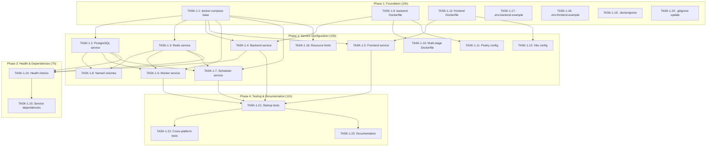

# US-1: Docker Compose Service Orchestration

**Priority**: P0
**Feature**: Local Development Environment
**Status**: To Do

## Overview

This User Story establishes the foundational Docker Compose configuration for the AI-powered Technology Watch Platform. The goal is to orchestrate 6 containerized services (PostgreSQL with pgvector, Redis, Django backend, React frontend, Celery worker, and Celery Beat scheduler) with a single `docker-compose up` command.

### Context

The Docker Compose setup is the infrastructure backbone for all local development. It eliminates "works on my machine" issues by providing a consistent, reproducible environment across Windows, macOS, and Linux. This enables new developers to start contributing within 30 minutes of cloning the repository.

### Decomposition Approach

- **Total tasks**: 23
- **Infrastructure**: 18 tasks (Docker Compose, Dockerfiles, configuration)
- **Testing**: 3 tasks (service startup, health checks, cross-platform)
- **Documentation**: 2 tasks (setup guide, troubleshooting)

---

## Task Summary

| ID | Title | Type | Specialty | Effort | Dependencies | Status |
|----|-------|------|-----------|--------|--------------|--------|
| TASK-1.1 | Create docker-compose.yml base structure | Infrastructure | docker | 3h | None | ⬜ |
| TASK-1.2 | Configure PostgreSQL service | Infrastructure | docker | 2h | TASK-1.1 | ⬜ |
| TASK-1.3 | Configure Redis service | Infrastructure | docker | 2h | TASK-1.1 | ⬜ |
| TASK-1.4 | Configure Django backend service | Infrastructure | docker | 3h | TASK-1.1, TASK-1.9 | ⬜ |
| TASK-1.5 | Configure React frontend service | Infrastructure | docker | 3h | TASK-1.1, TASK-1.12 | ⬜ |
| TASK-1.6 | Configure Celery worker service | Infrastructure | docker | 2h | TASK-1.1, TASK-1.2, TASK-1.3 | ⬜ |
| TASK-1.7 | Configure Celery Beat scheduler service | Infrastructure | docker | 2h | TASK-1.1, TASK-1.2, TASK-1.3 | ⬜ |
| TASK-1.8 | Set up named volumes for data persistence | Infrastructure | docker | 2h | TASK-1.2, TASK-1.3 | ⬜ |
| TASK-1.9 | Create backend Dockerfile | Infrastructure | docker | 4h | None | ⬜ |
| TASK-1.10 | Optimize backend Dockerfile with multi-stage build | Infrastructure | docker | 3h | TASK-1.9 | ⬜ |
| TASK-1.11 | Configure Poetry in backend Dockerfile | Infrastructure | config | 2h | TASK-1.9 | ⬜ |
| TASK-1.12 | Create frontend Dockerfile | Infrastructure | docker | 3h | None | ⬜ |
| TASK-1.13 | Configure Vite dev server in frontend Dockerfile | Infrastructure | config | 2h | TASK-1.12 | ⬜ |
| TASK-1.14 | Implement health checks (db, redis, backend) | Infrastructure | docker | 3h | TASK-1.2, TASK-1.3, TASK-1.4 | ⬜ |
| TASK-1.15 | Configure service dependencies with health conditions | Infrastructure | docker | 2h | TASK-1.14 | ⬜ |
| TASK-1.16 | Set up resource limits for all services | Infrastructure | config | 2h | TASK-1.1 | ⬜ |
| TASK-1.17 | Create .env.backend.example | Infrastructure | config | 2h | None | ⬜ |
| TASK-1.18 | Create .env.frontend.example | Infrastructure | config | 1h | None | ⬜ |
| TASK-1.19 | Create/update .dockerignore files | Infrastructure | config | 1h | None | ⬜ |
| TASK-1.20 | Update .gitignore for Docker artifacts | Infrastructure | config | 0.5h | None | ⬜ |
| TASK-1.21 | Test complete stack startup | Testing | integration | 3h | TASK-1.4, TASK-1.5, TASK-1.6, TASK-1.7 | ⬜ |
| TASK-1.22 | Test cross-platform compatibility | Testing | integration | 4h | TASK-1.21 | ⬜ |
| TASK-1.23 | Create Docker setup documentation | Documentation | documentation | 4h | TASK-1.21 | ⬜ |

---

## Task Details

### ⚙️ Infrastructure Tasks

#### TASK-1.1: Create docker-compose.yml base structure

**Type**: Infrastructure - Docker
**Priority**: P0
**Estimated Effort**: 3 hours

##### Description

Create the foundational docker-compose.yml file with version 3.8+ syntax, defining the service structure for all 6 containers (db, redis, backend, frontend, worker, scheduler). This includes setting up the internal Docker network for service communication and establishing the base configuration that subsequent tasks will build upon.

##### Files Impacted
- `docker-compose.yml` (new)

##### Acceptance Criteria
- [ ] docker-compose.yml file created with version: "3.8" or higher
- [ ] All 6 service names defined: db, redis, backend, frontend, worker, scheduler
- [ ] Internal Docker network created with name: app-network
- [ ] File passes `docker-compose config` validation without errors
- [ ] Comments document each service's purpose

##### Dependencies
- None (foundational task)

##### Implementation Notes
- Use Docker Compose file version 3.8 for modern features and compatibility
- Define custom network to isolate services from other Docker projects
- Keep service definitions minimal initially (will be expanded in subsequent tasks)
- Add inline comments explaining the architecture for new developers

---

#### TASK-1.2: Configure PostgreSQL service

**Type**: Infrastructure - Docker
**Priority**: P0
**Estimated Effort**: 2 hours

##### Description
- Use Fetch tool to check documentation about [local supabase setup](https://supabase.com/docs/guides/self-hosting/docker)
Configure the PostgreSQL 15 database service with pgvector extension support. Set up environment variables for database credentials, configure port mappings for local access, and ensure proper data persistence using named volumes.

##### Files Impacted
- `docker-compose.yml` (modification - db service)

##### Acceptance Criteria
- [ ] PostgreSQL 15 image specified: `postgres:15`
- [ ] Environment variables defined: POSTGRES_USER, POSTGRES_PASSWORD, POSTGRES_DB
- [ ] Port mapping configured: 5432:5432
- [ ] Volume mounted for data persistence: postgres_data:/var/lib/postgresql/data
- [ ] Restart policy set to: unless-stopped

##### Dependencies
- TASK-1.1 (base docker-compose structure)

##### Implementation Notes
- Use official postgres:15 image from Docker Hub
- Do NOT expose port 5432 to host in production (only for local development)
- Configure shared_preload_libraries for pgvector in future US (US-2)
- Set POSTGRES_HOST_AUTH_METHOD=trust for local development ease (not for production)

---

#### TASK-1.3: Configure Redis service

**Type**: Infrastructure - Docker
**Priority**: P0
**Estimated Effort**: 2 hours

##### Description

Configure the Redis cache and message broker service. Set up data persistence with named volumes, configure restart policies, and ensure Redis is accessible to backend, worker, and scheduler services.

##### Files Impacted
- `docker-compose.yml` (modification - redis service)

##### Acceptance Criteria
- [ ] Redis latest image specified: `redis:latest`
- [ ] Port mapping configured: 6379:6379
- [ ] Volume mounted for data persistence: redis_data:/data
- [ ] Restart policy set to: unless-stopped
- [ ] Redis persistence enabled with appendonly configuration

##### Dependencies
- TASK-1.1 (base docker-compose structure)

##### Implementation Notes
- Use official redis:latest image (stable Redis 7+)
- Configure Redis persistence: command: redis-server --appendonly yes
- Do NOT expose port 6379 to host in production
- Redis data persists across container restarts for cached embeddings and Celery task queue

---

#### TASK-1.4: Configure Django backend service

**Type**: Infrastructure - Docker
**Priority**: P0
**Estimated Effort**: 3 hours

##### Description

Configure the Django backend API service including build context, port mapping, environment file loading, volume mounts for hot reloading, and service dependencies on database and Redis with health check conditions.

##### Files Impacted
- `docker-compose.yml` (modification - backend service)

##### Acceptance Criteria
- [ ] Build context set to: ./backend
- [ ] Port mapping configured: 8000:8000
- [ ] Environment file loaded: .env.backend
- [ ] Volume mounted for hot reload: ./backend:/app
- [ ] Depends_on declared with health conditions for db and redis
- [ ] Command set to run Django dev server: python manage.py runserver 0.0.0.0:8000

##### Dependencies
- TASK-1.1 (base docker-compose structure)
- TASK-1.9 (backend Dockerfile must exist)

##### Implementation Notes
- Use bind mount (./backend:/app) for hot reloading during development
- Ensure Django dev server binds to 0.0.0.0 (not 127.0.0.1) to be accessible from host
- Set environment variable PYTHONUNBUFFERED=1 for real-time logs
- Backend depends on db and redis being healthy before starting

---

#### TASK-1.5: Configure React frontend service

**Type**: Infrastructure - Docker
**Priority**: P0
**Estimated Effort**: 3 hours

##### Description

Configure the React frontend SPA service with Vite dev server, including build context, port mapping, environment file loading, volume mounts for hot module replacement (HMR), and proper configuration for Vite's dev server to work inside Docker.

##### Files Impacted
- `docker-compose.yml` (modification - frontend service)

##### Acceptance Criteria
- [ ] Build context set to: ./frontend
- [ ] Port mapping configured: 3000:3000 (Vite default)
- [ ] Environment file loaded: .env.frontend
- [ ] Volume mounted for hot reload: ./frontend:/app
- [ ] Volume mounted for node_modules: /app/node_modules (prevents host conflict)
- [ ] Command set to run Vite dev server: npm run dev

##### Dependencies
- TASK-1.1 (base docker-compose structure)
- TASK-1.12 (frontend Dockerfile must exist)

##### Implementation Notes
- Use bind mount for source code but anonymous volume for node_modules
- Vite dev server must be configured with host: '0.0.0.0' to be accessible from host
- Set environment variable CHOKIDAR_USEPOLLING=true for file watching on Windows/Mac
- Frontend does not depend on backend (can develop independently)

---

#### TASK-1.6: Configure Celery worker service

**Type**: Infrastructure - Docker
**Priority**: P0
**Estimated Effort**: 2 hours

##### Description

Configure the Celery worker service for executing AI pipeline tasks asynchronously. Use the same backend Dockerfile, override the command to run Celery worker, and set up dependencies on database and Redis with health check conditions.

##### Files Impacted
- `docker-compose.yml` (modification - worker service)

##### Acceptance Criteria
- [ ] Build context set to: ./backend (same as backend service)
- [ ] Environment file loaded: .env.backend
- [ ] Volume mounted: ./backend:/app
- [ ] Depends_on declared with health conditions for db and redis
- [ ] Command overridden: celery -A config worker -l info
- [ ] Restart policy set to: unless-stopped

##### Dependencies
- TASK-1.1 (base docker-compose structure)
- TASK-1.2 (PostgreSQL must be running)
- TASK-1.3 (Redis must be running)

##### Implementation Notes
- Worker reuses backend Dockerfile (same codebase, different entrypoint)
- Set CELERY_BROKER_URL and CELERY_RESULT_BACKEND in .env.backend
- Configure worker concurrency via environment variable (default: 4)
- Worker must wait for db and redis to be healthy before starting

---

#### TASK-1.7: Configure Celery Beat scheduler service

**Type**: Infrastructure - Docker
**Priority**: P0
**Estimated Effort**: 2 hours

##### Description

Configure the Celery Beat scheduler service for triggering recurring AI pipeline tasks (daily subject monitoring). Use the same backend Dockerfile, override the command to run Celery Beat, and set up dependencies on database and Redis.

##### Files Impacted
- `docker-compose.yml` (modification - scheduler service)

##### Acceptance Criteria
- [ ] Build context set to: ./backend (same as backend service)
- [ ] Environment file loaded: .env.backend
- [ ] Volume mounted: ./backend:/app
- [ ] Depends_on declared with health conditions for db, redis, and worker
- [ ] Command overridden: celery -A config beat -l info
- [ ] Restart policy set to: unless-stopped

##### Dependencies
- TASK-1.1 (base docker-compose structure)
- TASK-1.2 (PostgreSQL must be running)
- TASK-1.3 (Redis must be running)

##### Implementation Notes
- Scheduler reuses backend Dockerfile (same codebase, different entrypoint)
- Beat schedule stored in Django database (django_celery_beat)
- Only ONE Beat instance should run (no horizontal scaling for Beat)
- Beat depends on worker being available to execute scheduled tasks

---

#### TASK-1.8: Set up named volumes for data persistence

**Type**: Infrastructure - Docker
**Priority**: P0
**Estimated Effort**: 2 hours

##### Description

Define named Docker volumes for PostgreSQL and Redis data persistence. Configure volume drivers, ensure data survives container restarts, and document volume backup procedures.

##### Files Impacted
- `docker-compose.yml` (modification - volumes section)

##### Acceptance Criteria
- [ ] Named volume defined: postgres_data with driver: local
- [ ] Named volume defined: redis_data with driver: local
- [ ] Volumes referenced correctly in db and redis service definitions
- [ ] Volume persistence tested (data survives `docker-compose down` and `docker-compose up`)
- [ ] Volume location documented in comments

##### Dependencies
- TASK-1.2 (PostgreSQL service configuration)
- TASK-1.3 (Redis service configuration)

##### Implementation Notes
- Named volumes persist in Docker's volume directory (not in project folder)
- Data survives `docker-compose down` but NOT `docker-compose down -v` (volumes flag)
- Use `docker volume ls` to list volumes, `docker volume inspect` for location
- Document backup procedure: `docker run --rm -v postgres_data:/data -v $(pwd):/backup ubuntu tar cvf /backup/backup.tar /data`

---

#### TASK-1.9: Create backend Dockerfile

**Type**: Infrastructure - Docker
**Priority**: P0
**Estimated Effort**: 4 hours

##### Description

Create a production-ready Dockerfile for the Django backend using Python 3.13-slim base image. Implement multi-stage build pattern for smaller final images, configure Poetry for dependency management, set up non-root user for security, and optimize layer caching for fast rebuilds.

##### Files Impacted
- `backend/Dockerfile` (new)

##### Acceptance Criteria
- [ ] Base image: python:3.13-slim
- [ ] Poetry installed and configured (version 2.2.1)
- [ ] Dependencies installed from pyproject.toml and poetry.lock
- [ ] Working directory set to /app
- [ ] Non-root user created and used for running application
- [ ] EXPOSE 8000 directive included
- [ ] Layer caching optimized (copy dependency files before source code)

##### Dependencies
- None (can be developed independently)

##### Implementation Notes
- Use multi-stage build: builder stage for Poetry, final stage for runtime
- Install system dependencies: gcc, postgresql-dev for psycopg2
- Copy pyproject.toml and poetry.lock first (before source code) for layer caching
- Use `poetry install --no-dev` for production dependencies only
- Create user `appuser` with UID 1000 for security (non-root)

---

#### TASK-1.10: Optimize backend Dockerfile with multi-stage build

**Type**: Infrastructure - Docker
**Priority**: P0
**Estimated Effort**: 3 hours

##### Description

Refactor backend Dockerfile to use multi-stage build pattern. Create a builder stage for installing dependencies and a runtime stage with only necessary runtime files, reducing final image size by 40-60%.

##### Files Impacted
- `backend/Dockerfile` (modification)

##### Acceptance Criteria
- [ ] Dockerfile has two stages: builder and runtime
- [ ] Builder stage installs Poetry and all dependencies
- [ ] Runtime stage copies only installed packages from builder
- [ ] Final image size < 500MB (vs ~800MB single-stage)
- [ ] Build time reduced by 30% on subsequent builds (better caching)

##### Dependencies
- TASK-1.9 (backend Dockerfile must exist)

##### Implementation Notes
- Builder stage: FROM python:3.13-slim AS builder
- Install Poetry and dependencies in builder
- Runtime stage: FROM python:3.13-slim AS runtime
- Copy /usr/local/lib/python3.13/site-packages from builder to runtime
- Do NOT copy Poetry itself to runtime (only installed packages)

---

#### TASK-1.11: Configure Poetry in backend Dockerfile

**Type**: Infrastructure - Config
**Priority**: P0
**Estimated Effort**: 2 hours

##### Description

Configure Poetry package manager in the backend Dockerfile including installation, dependency resolution, virtual environment configuration, and integration with Docker's layer caching for optimal build performance.

##### Files Impacted
- `backend/Dockerfile` (modification)

##### Acceptance Criteria
- [ ] Poetry 2.2.1 installed via pip
- [ ] Poetry configured to not create virtual environments (POETRY_VIRTUALENVS_CREATE=false)
- [ ] Dependencies installed in system Python (for Docker compatibility)
- [ ] pyproject.toml and poetry.lock copied before source code (for caching)
- [ ] poetry.lock verified with `poetry check`

##### Dependencies
- TASK-1.9 (backend Dockerfile must exist)

##### Implementation Notes
- Set environment variables: POETRY_VERSION=2.2.1, POETRY_VIRTUALENVS_CREATE=false
- Install Poetry: pip install poetry==$POETRY_VERSION
- Copy dependency files first: COPY pyproject.toml poetry.lock ./
- Run poetry install: RUN poetry install --no-interaction --no-ansi
- Verify lock file: RUN poetry check --lock

---

#### TASK-1.12: Create frontend Dockerfile

**Type**: Infrastructure - Docker
**Priority**: P0
**Estimated Effort**: 3 hours

##### Description

Create a development-optimized Dockerfile for the React frontend using Node 20-alpine base image. Configure npm/Vite for hot module replacement, set up proper file permissions, and optimize for fast rebuilds with layer caching.

##### Files Impacted
- `frontend/Dockerfile` (new)

##### Acceptance Criteria
- [ ] Base image: node:20-alpine
- [ ] Working directory set to /app
- [ ] package.json and package-lock.json copied before source code
- [ ] Dependencies installed with `npm ci` (clean install)
- [ ] EXPOSE 3000 directive included
- [ ] CMD runs Vite dev server: npm run dev

##### Dependencies
- None (can be developed independently)

##### Implementation Notes
- Use alpine variant for smaller image size (~200MB vs ~1GB)
- Copy package files first for layer caching: COPY package*.json ./
- Use `npm ci` instead of `npm install` for faster, reproducible builds
- Do NOT run as root: USER node (alpine image has node user)
- Vite dev server configured in vite.config.ts (host: '0.0.0.0', port: 3000)

---

#### TASK-1.13: Configure Vite dev server in frontend Dockerfile

**Type**: Infrastructure - Config
**Priority**: P0
**Estimated Effort**: 2 hours

##### Description

Configure Vite development server to work properly inside Docker container with hot module replacement (HMR), proper host binding for external access, and file watching that works with Docker volume mounts.

##### Files Impacted
- `frontend/Dockerfile` (modification)
- `frontend/vite.config.ts` (new/modification)

##### Acceptance Criteria
- [ ] Vite configured with host: '0.0.0.0' (accessible from host machine)
- [ ] Vite configured with port: 3000
- [ ] HMR enabled and working (file changes trigger browser reload)
- [ ] File watching works with Docker volumes (CHOKIDAR_USEPOLLING if needed)
- [ ] Vite dev server starts successfully on container startup

##### Dependencies
- TASK-1.12 (frontend Dockerfile must exist)

##### Implementation Notes
- Edit vite.config.ts: server: { host: '0.0.0.0', port: 3000, watch: { usePolling: true } }
- Set environment variable CHOKIDAR_USEPOLLING=true for Docker compatibility
- Configure strictPort: true to fail fast if port 3000 unavailable
- Add --host flag to package.json dev script: "dev": "vite --host"

---

#### TASK-1.14: Implement health checks (db, redis, backend)

**Type**: Infrastructure - Docker
**Priority**: P0
**Estimated Effort**: 3 hours

##### Description

Implement Docker health checks for PostgreSQL, Redis, and Django backend services to ensure services are truly ready before dependent services start. Configure check intervals, timeouts, and retry logic for reliable service orchestration.

##### Files Impacted
- `docker-compose.yml` (modification - db, redis, backend services)

##### Acceptance Criteria
- [ ] PostgreSQL health check: `pg_isready -U postgres -d postgres`
- [ ] Redis health check: `redis-cli ping` returns PONG
- [ ] Backend health check: HTTP GET to http://backend:8000/api/health/ returns 200
- [ ] Health check interval set to 10s for all services
- [ ] Health check timeout set to 5s
- [ ] Health check retries set to 3
- [ ] `docker-compose ps` shows "healthy" status for all services

##### Dependencies
- TASK-1.2 (PostgreSQL service must be configured)
- TASK-1.3 (Redis service must be configured)
- TASK-1.4 (Backend service must be configured)

##### Implementation Notes
- PostgreSQL: Use pg_isready command (built into postgres image)
- Redis: Use redis-cli ping command (built into redis image)
- Backend: Implement /api/health/ endpoint in Django (returns {"status": "healthy"})
- Health checks run inside container (not from host)
- Use `curl` or `wget` in backend container for HTTP health check

---

#### TASK-1.15: Configure service dependencies with health conditions

**Type**: Infrastructure - Docker
**Priority**: P0
**Estimated Effort**: 2 hours

##### Description

Configure depends_on directives with service_healthy conditions to ensure services start in the correct order and only when dependencies are truly ready, not just started.

##### Files Impacted
- `docker-compose.yml` (modification - backend, worker, scheduler services)

##### Acceptance Criteria
- [ ] Backend depends_on db with condition: service_healthy
- [ ] Backend depends_on redis with condition: service_healthy
- [ ] Worker depends_on db and redis with condition: service_healthy
- [ ] Scheduler depends_on db, redis, and worker with condition: service_healthy
- [ ] Services wait for dependencies to be healthy before starting
- [ ] Startup order validated: db/redis → backend/worker → scheduler → frontend

##### Dependencies
- TASK-1.14 (health checks must be implemented)

##### Implementation Notes
- Use depends_on with condition: service_healthy (requires Docker Compose v1.27+)
- Backend waits for db and redis to pass health checks
- Worker waits for db and redis to be healthy
- Scheduler waits for db, redis, AND worker to be healthy
- Frontend has no dependencies (can start independently)

---

#### TASK-1.16: Set up resource limits for all services

**Type**: Infrastructure - Config
**Priority**: P0
**Estimated Effort**: 2 hours

##### Description

Configure CPU and memory resource limits for all services to prevent resource exhaustion and ensure fair resource allocation during development. Balance limits between performance and system stability.

##### Files Impacted
- `docker-compose.yml` (modification - all services)

##### Acceptance Criteria
- [ ] Memory limits defined for all 6 services
- [ ] CPU limits (cpus) defined for resource-intensive services (backend, worker)
- [ ] Total memory allocation < 6GB (leaves 2GB for host on 8GB system)
- [ ] Services start successfully with configured limits
- [ ] No OOM (Out of Memory) errors during normal operation

##### Dependencies
- TASK-1.1 (base docker-compose structure)

##### Implementation Notes
- Suggested limits: db (1GB), redis (512MB), backend (1GB), frontend (512MB), worker (2GB), scheduler (512MB)
- Use deploy.resources.limits syntax (Docker Compose v3+)
- CPU limits: backend and worker (1.0 CPU), others (0.5 CPU)
- Memory reservations: set reserves at 50% of limits
- Test with realistic workload (AI pipeline execution)

---

#### TASK-1.17: Create .env.backend.example

**Type**: Infrastructure - Config
**Priority**: P0
**Estimated Effort**: 2 hours

##### Description

Create a comprehensive .env.backend.example template file documenting all required and optional environment variables for the Django backend, Celery workers, and scheduler services.

##### Files Impacted
- `.env.backend.example` (new)

##### Acceptance Criteria
- [ ] All required Django variables documented (SECRET_KEY, DEBUG, ALLOWED_HOSTS)
- [ ] Database connection variables included (DB_HOST, DB_PORT, DB_NAME, DB_USER, DB_PASSWORD)
- [ ] Redis connection variable included (REDIS_URL)
- [ ] Celery configuration variables included (CELERY_BROKER_URL, CELERY_RESULT_BACKEND)
- [ ] AI API keys placeholders included (GOOGLE_AI_API_KEY, FIRECRAWL_API_KEY)
- [ ] Email configuration variables included (SMTP_HOST, SMTP_PORT, SMTP_USER, SMTP_PASSWORD)
- [ ] JWT configuration variables included (JWT_SECRET_KEY, JWT_ACCESS_TOKEN_LIFETIME)
- [ ] Azure AD variables included for SSO (AZURE_CLIENT_ID, AZURE_CLIENT_SECRET, AZURE_TENANT_ID)
- [ ] Each variable documented with inline comments explaining purpose and example value

##### Dependencies
- None (can be developed independently)

##### Implementation Notes
- Use # comments to explain each variable
- Provide sensible default values for local development
- Use placeholder format for secrets: SECRET_KEY=your-secret-key-here-change-this
- Group related variables with blank lines and section comments
- Document which variables are required vs optional
- Include example: ALLOWED_HOSTS=localhost,127.0.0.1,backend

---

#### TASK-1.18: Create .env.frontend.example

**Type**: Infrastructure - Config
**Priority**: P0
**Estimated Effort**: 1 hour

##### Description

Create .env.frontend.example template file documenting all required environment variables for the React frontend SPA, primarily API endpoint configuration and feature flags.

##### Files Impacted
- `.env.frontend.example` (new)

##### Acceptance Criteria
- [ ] Backend API URL variable included (VITE_API_URL)
- [ ] WebSocket URL variable included if needed (VITE_WS_URL)
- [ ] Feature flags included (VITE_ENABLE_SSO, VITE_ENABLE_ANALYTICS)
- [ ] Environment identifier included (VITE_ENV=development)
- [ ] Each variable documented with inline comments
- [ ] Vite-specific naming convention used (VITE_ prefix for client-side variables)

##### Dependencies
- None (can be developed independently)

##### Implementation Notes
- Vite requires VITE_ prefix for environment variables to be exposed to client
- Default API URL for Docker: VITE_API_URL=http://localhost:8000/api
- Include feature flags for toggling features during development
- Document that .env.frontend should never contain secrets (client-side code)
- Keep variable count minimal (only what frontend needs)

---

#### TASK-1.19: Create/update .dockerignore files

**Type**: Infrastructure - Config
**Priority**: P0
**Estimated Effort**: 1 hour

##### Description

Create .dockerignore files for backend and frontend to exclude unnecessary files from Docker build context, significantly reducing build time and image size.

##### Files Impacted
- `backend/.dockerignore` (new)
- `frontend/.dockerignore` (new)

##### Acceptance Criteria
- [ ] Backend .dockerignore excludes: __pycache__, *.pyc, .pytest_cache, .env, venv/
- [ ] Backend .dockerignore excludes: .git/, .gitignore, README.md, docs/
- [ ] Frontend .dockerignore excludes: node_modules/, .git/, dist/, .env
- [ ] Frontend .dockerignore excludes: coverage/, .cache/, *.log
- [ ] Build context size reduced by 50%+ after adding .dockerignore
- [ ] Docker build time reduced by 20%+ (less data to send to daemon)

##### Dependencies
- None (can be developed independently)

##### Implementation Notes
- .dockerignore syntax similar to .gitignore
- Exclude everything unnecessary: node_modules, __pycache__, .git, etc.
- Do NOT exclude files needed for build (package.json, pyproject.toml, source code)
- Test build context size: docker-compose build --progress=plain shows context size
- Comment sections in .dockerignore for maintainability

---

#### TASK-1.20: Update .gitignore for Docker artifacts

**Type**: Infrastructure - Config
**Priority**: P0
**Estimated Effort**: 0.5 hours

##### Description

Update the root .gitignore file to exclude Docker-related artifacts and local environment files that should never be committed to version control.

##### Files Impacted
- `.gitignore` (modification)

##### Acceptance Criteria
- [ ] .env files excluded (.env, .env.backend, .env.frontend)
- [ ] Docker Compose override files excluded (docker-compose.override.yml)
- [ ] Docker volumes data excluded if ever created locally
- [ ] Comments added explaining Docker-related exclusions
- [ ] Verification: .env files do not appear in `git status` after creation

##### Dependencies
- None (can be developed independently)

##### Implementation Notes
- Add section: # Docker & Environment Files
- Exclude patterns: .env*, docker-compose.override.yml
- Keep .env.example files tracked (they contain no secrets)
- Use wildcard for all .env variations: .env*
- Ensure existing .gitignore Docker section (if any) is updated, not duplicated

---

### ✅ Testing Tasks

#### TASK-1.21: Test complete stack startup

**Type**: Testing - Integration
**Priority**: P0
**Estimated Effort**: 3 hours

##### Description

Create and execute a comprehensive test script to validate that all 6 services start successfully, pass health checks, and are accessible from the host machine. Verify service dependencies and startup order.

##### Files Impacted
- `tests/test_docker_startup.sh` (new)

##### Acceptance Criteria
- [ ] Test script builds all images: `docker-compose build` succeeds
- [ ] Test script starts all services: `docker-compose up -d` succeeds
- [ ] Script waits for all services to be healthy (timeout: 120s)
- [ ] Script verifies all 6 services show "running" status in `docker-compose ps`
- [ ] Script tests backend API accessibility: curl http://localhost:8000/api/health/ returns 200
- [ ] Script tests frontend accessibility: curl http://localhost:3000 returns 200
- [ ] Script tests database connectivity: `docker-compose exec db psql -U postgres -c "\l"` succeeds
- [ ] Script tests Redis connectivity: `docker-compose exec redis redis-cli ping` returns PONG
- [ ] Test script cleans up: `docker-compose down` succeeds
- [ ] Script returns non-zero exit code if any test fails (CI/CD compatible)

##### Dependencies
- TASK-1.4 (backend service must be configured)
- TASK-1.5 (frontend service must be configured)
- TASK-1.6 (worker service must be configured)
- TASK-1.7 (scheduler service must be configured)

##### Implementation Notes
- Write Bash script for cross-platform compatibility (use #!/bin/bash)
- Use `docker-compose ps --services --filter status=running` to check running services
- Implement retry logic for health checks (services may take 30-60s to be fully ready)
- Use `set -e` to exit on first error
- Add colored output for better readability (green for pass, red for fail)

---

#### TASK-1.22: Test cross-platform compatibility

**Type**: Testing - Integration
**Priority**: P0
**Estimated Effort**: 4 hours

##### Description

Test the Docker Compose setup on Windows (Docker Desktop with WSL2), macOS (Docker Desktop), and Linux (Docker Engine) to ensure consistent behavior across developer platforms. Document platform-specific issues and workarounds.

##### Files Impacted
- `docs/PLATFORM_COMPATIBILITY.md` (new)

##### Acceptance Criteria
- [ ] Successfully tested on Windows 10/11 with Docker Desktop and WSL2
- [ ] Successfully tested on macOS (Intel and M1/M2) with Docker Desktop
- [ ] Successfully tested on Linux (Ubuntu 22.04+) with Docker Engine
- [ ] All services start and pass health checks on all 3 platforms
- [ ] Performance benchmarks recorded (startup time, build time) for each platform
- [ ] Platform-specific issues documented with workarounds
- [ ] M1/M2 Mac compatibility verified (multi-architecture image support)

##### Dependencies
- TASK-1.21 (test script must exist and pass)

##### Implementation Notes
- **Windows**: Verify WSL2 backend is used (not Hyper-V)
- **macOS M1/M2**: Add platform: linux/amd64 to services if ARM-specific issues occur
- **Linux**: Test on Ubuntu and Debian (most common developer distros)
- Document RAM/CPU requirements per platform
- Test file watching and hot reload on each platform (different file systems)
- Create PLATFORM_COMPATIBILITY.md documenting findings

---

### 📚 Documentation Tasks

#### TASK-1.23: Create Docker setup documentation

**Type**: Documentation - Documentation
**Priority**: P0
**Estimated Effort**: 4 hours

##### Description

Create comprehensive setup documentation for the Docker-based local development environment, including prerequisites, installation steps, common commands, troubleshooting guide, and FAQ.

##### Files Impacted
- `README.md` (modification - add Docker setup section)
- `docs/DOCKER_SETUP.md` (new)
- `docs/TROUBLESHOOTING.md` (new)

##### Acceptance Criteria
- [ ] Prerequisites documented (Docker Desktop/Engine version, RAM/CPU requirements)
- [ ] Step-by-step setup guide with commands to copy/paste
- [ ] Common Docker Compose commands documented (up, down, logs, ps, exec, build)
- [ ] Environment configuration instructions (.env file setup)
- [ ] Troubleshooting section with 10+ common issues and solutions
- [ ] FAQ with 5+ frequently asked questions
- [ ] Screenshots or diagrams showing successful startup
- [ ] Links to official Docker documentation for deeper learning

##### Dependencies
- TASK-1.21 (testing must be complete)

##### Implementation Notes
- **README.md**: Add "Quick Start" section with minimal steps to get running
- **DOCKER_SETUP.md**: Detailed setup guide with explanations
- **TROUBLESHOOTING.md**: Common errors with specific solutions
- Include troubleshooting for: port conflicts, memory limits, WSL2 setup, M1/M2 compatibility
- Provide examples of .env files (copy from .example files)
- Document how to run migrations: `docker-compose exec backend python manage.py migrate`
- Document how to create superuser: `docker-compose exec backend python manage.py createsuperuser`

---

## Dependency Graph

### Mermaid Diagram

### Implementation Phases

**Phase 1: Foundation (10 hours)**
- TASK-1.1, TASK-1.9, TASK-1.12, TASK-1.17, TASK-1.18, TASK-1.19, TASK-1.20
- These tasks create the base files and can be done in parallel

**Phase 2: Service Configuration (15 hours)**
- TASK-1.2 through TASK-1.8, TASK-1.10, TASK-1.11, TASK-1.13, TASK-1.16
- Services configured sequentially, Dockerfiles optimized in parallel

**Phase 3: Health & Dependencies (7 hours)**
- TASK-1.14, TASK-1.15
- Health checks implemented, then dependencies configured

**Phase 4: Testing & Documentation (11 hours)**
- TASK-1.21, TASK-1.22, TASK-1.23
- Sequential testing (startup → cross-platform → documentation)

### Parallelization Opportunities

**Parallel Group 1** (can start immediately):
- TASK-1.1 (docker-compose base)
- TASK-1.9 (backend Dockerfile)
- TASK-1.12 (frontend Dockerfile)
- TASK-1.17 (.env.backend.example)
- TASK-1.18 (.env.frontend.example)
- TASK-1.19 (.dockerignore)
- TASK-1.20 (.gitignore update)

**Parallel Group 2** (after Phase 1 complete):
- TASK-1.2 (PostgreSQL service)
- TASK-1.3 (Redis service)
- TASK-1.16 (Resource limits)

**Parallel Group 3** (after Dockerfiles exist):
- TASK-1.10 (Multi-stage backend Dockerfile)
- TASK-1.11 (Poetry configuration)
- TASK-1.13 (Vite configuration)

**Sequential Dependencies**:
- Backend/Worker/Scheduler services (TASK-1.4, 1.6, 1.7) must wait for TASK-1.2, 1.3 (db, redis)
- Health checks (TASK-1.14) must wait for services to be configured
- Testing (TASK-1.21) must wait for all services to be ready

---

## Effort Estimation

### By Task Type

| Type | Tasks | Effort |
|------|-------|--------|
| Infrastructure - Docker | 12 | 30h |
| Infrastructure - Config | 6 | 11h |
| Testing - Integration | 2 | 7h |
| Documentation | 1 | 4h |
| **TOTAL** | **23** | **52h (6.5 days)** |

### By Developer

- **1 full-stack developer**: 6.5 days (sequential execution, accounting for dependencies)
- **2 developers** (1 backend-focused, 1 frontend-focused): 4 days (parallel work on Phase 1 and 2)
- **3 developers** (backend, frontend, infrastructure): 3 days (maximum parallelization)

### Resource Allocation

**Recommended approach for 1 developer**:
- Day 1: Phase 1 (Foundation) - Create all base files and Dockerfiles
- Day 2-3: Phase 2 (Service Configuration) - Configure all services in docker-compose.yml
- Day 4: Phase 2 continued (Optimization) - Multi-stage builds, resource limits
- Day 5: Phase 3 (Health & Dependencies) - Implement health checks and dependencies
- Day 6: Phase 4 (Testing) - Comprehensive testing on all platforms
- Day 7: Phase 4 (Documentation) - Create setup guides and troubleshooting docs

---

## Implementation Notes

### Technology Stack

**Docker Stack:**
- Docker Engine 24.0+ or Docker Desktop 4.25+
- Docker Compose v2 (integrated with Docker CLI)
- Docker Compose file version 3.8 for modern features

**Base Images:**
- PostgreSQL: postgres:15 (official)
- Redis: redis:latest (Redis 7+)
- Backend: python:3.13-slim (official Python)
- Frontend: node:20-alpine (official Node.js)

**Development Tools:**
- Poetry 2.2.1 for Python dependency management
- Vite for React development server with HMR
- Celery 5+ for async task processing

### Patterns and Conventions

**Docker Compose Patterns:**
- Named volumes for data persistence (not bind mounts for data)
- Bind mounts for source code (hot reloading during development)
- Health checks with service_healthy conditions for startup ordering
- Resource limits to prevent runaway containers
- Restart policy: unless-stopped (auto-restart on failure)

**Dockerfile Best Practices:**
- Multi-stage builds for smaller final images
- Layer caching optimization (copy dependency files before source code)
- Non-root users for security
- .dockerignore to reduce build context size
- Explicit versions for reproducibility

**Environment Variables:**
- All secrets in .env files, never in docker-compose.yml or Dockerfiles
- .env.example files tracked in Git (no secrets)
- .env files excluded from Git (contain actual secrets)
- Vite variables prefixed with VITE_ for client-side exposure

### Configuration Requirements

**Minimum Hardware:**
- 8GB RAM (6GB allocated to Docker, 2GB for host)
- 4 CPU cores
- 10GB free disk space (Docker images and volumes)
- SSD strongly recommended for performance

**Required Software:**
- **Windows**: Docker Desktop with WSL2 backend
- **macOS**: Docker Desktop 4.25+
- **Linux**: Docker Engine 24+ and Docker Compose plugin

**Network Requirements:**
- Internet access for pulling Docker images
- Access to: Docker Hub, PyPI, npm registry
- Access to AI API endpoints (Google AI Studio, Firecrawl) - can be mocked

---

## Risks and Attention Points

### Identified Risks

**Risk 1: Platform-Specific Issues**
- **Impact**: High - Developers cannot start environment
- **Likelihood**: Medium - Different file systems and Docker implementations
- **Mitigation**:
  - Test thoroughly on all 3 platforms (Windows, macOS, Linux)
  - Document platform-specific workarounds in TROUBLESHOOTING.md
  - Use cross-platform compatible scripts (avoid platform-specific commands)
  - Provide pre-configured VM images for challenging platforms

**Risk 2: Resource Exhaustion on Low-End Machines**
- **Impact**: High - Services crash or won't start
- **Likelihood**: Medium - Some developers may have < 8GB RAM
- **Mitigation**:
  - Set conservative resource limits (6GB total allocated)
  - Document minimum requirements prominently
  - Provide "light mode" configuration with fewer services
  - Enable selective service startup with Docker Compose profiles

**Risk 3: Long Build Times on First Setup**
- **Impact**: Medium - Poor onboarding experience
- **Likelihood**: High - Fresh builds can take 10+ minutes
- **Mitigation**:
  - Optimize Dockerfiles with multi-stage builds and layer caching
  - Pre-pull base images in onboarding documentation
  - Provide Docker image cache on shared network drive (optional)
  - Set realistic expectations in documentation (10 min first build, 1 min subsequent)

**Risk 4: WSL2 Configuration Issues on Windows**
- **Impact**: High - Windows developers cannot use Docker Desktop
- **Likelihood**: Low - WSL2 is default in recent Docker Desktop
- **Mitigation**:
  - Provide detailed WSL2 setup guide for Windows users
  - Document common WSL2 troubleshooting (memory limits, file permissions)
  - Offer alternative: VirtualBox VM with Linux + Docker Engine
  - Test on multiple Windows versions (10, 11)

**Risk 5: M1/M2 Mac ARM Architecture Compatibility**
- **Impact**: Medium - Some images may not work on ARM Macs
- **Likelihood**: Low - Most official images support multi-arch
- **Mitigation**:
  - Test specifically on M1/M2 Macs
  - Use platform: linux/amd64 directive if ARM issues occur (Rosetta 2)
  - Document any platform-specific configuration needed
  - Verify all base images support ARM64 architecture

### Critical Points

**Security:**
- Never expose database or Redis ports (5432, 6379) to host network in production
- All secrets must be in .env files, never in code or docker-compose.yml
- Verify .gitignore excludes .env files before first commit
- Run containers as non-root users (backend: appuser, frontend: node)
- Regularly update base images for security patches

**Performance:**
- Database and Redis data on named volumes (faster than bind mounts)
- Source code on bind mounts (required for hot reloading)
- Multi-stage builds reduce image size by 40-60%
- Layer caching reduces rebuild time by 70-90%
- Resource limits prevent individual services from monopolizing system

**Developer Experience:**
- Hot reloading must work reliably (Vite for frontend, Django runserver for backend)
- Startup time < 60 seconds for all services on modern hardware
- Clear error messages for common issues (missing .env, port conflicts)
- One command setup: `docker-compose up`
- Comprehensive documentation with troubleshooting guide

**Maintainability:**
- docker-compose.yml well-commented for future developers
- .dockerignore reduces build context size and build time
- Multi-stage builds keep Dockerfiles clean and optimized
- Consistent patterns across all services
- Version pin all base images and critical dependencies

---

**Generated by:** Functional Spec Planner - Task Decomposition
**User Story:** US-1 - Docker Compose Service Orchestration
**Feature:** Local Development Environment
**Total Tasks:** 23
**Estimated Effort:** 52 hours (6.5 days)
**Status:** Ready for Implementation

⚠️ **NEXT STEP**: Review this tasks.md file, adjust task descriptions or effort estimates if needed, then run `/spec-create-issues local-development-environment/US-1` to create GitHub issues.
