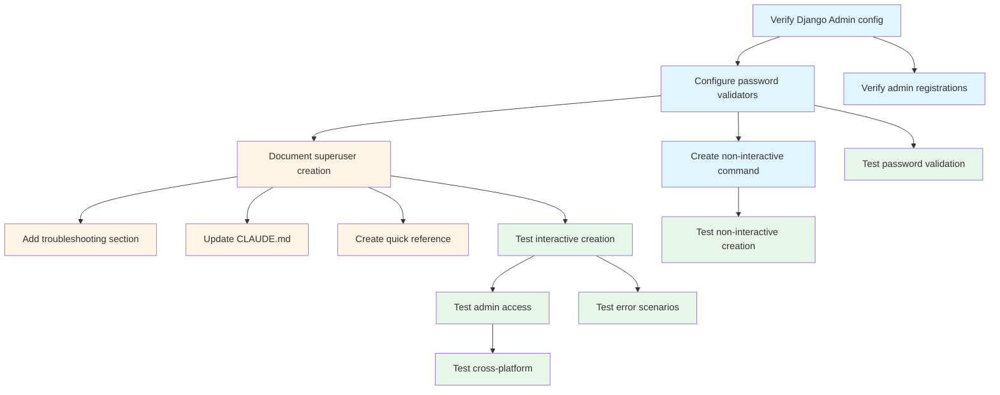

# US-10: Superuser Creation for Admin Access

**Priority**: P1
**Feature**: Local Development Environment
**Status**: To Do

## Overview

This User Story enables developers to create Django superuser accounts for accessing the Django Admin interface and the FinOps cost tracking dashboard. The implementation focuses on documentation, configuration verification, and testing of Django's built-in superuser creation functionality.

### Context

The superuser account is essential for administrative tasks in the development environment, including viewing FinOps cost tracking data, managing user accounts, configuring scheduled tasks through django-celery-beat admin, and debugging database content. The superuser provides full access to Django Admin at `http://localhost:8000/admin/`.

Since Django's `createsuperuser` management command is already built-in, this User Story primarily involves:
- Verifying Django Admin configuration
- Setting up password validation for security
- Documenting the superuser creation workflow
- Testing both interactive and non-interactive creation methods
- Providing troubleshooting guidance

### Decomposition Approach

- **Total tasks**: 14
- **Backend**: 4 tasks (configuration verification and optional enhancements)
- **Infrastructure/Documentation**: 4 tasks (comprehensive documentation and guides)
- **Testing**: 6 tasks (interactive, non-interactive, validation, and cross-platform tests)

---

## Task Summary

| ID | Title | Type | Specialty | Effort | Dependencies | Status |
|----|-------|------|-----------|--------|--------------|--------|
| TASK-10.1 | Verify Django Admin configuration | Backend | Config | 1h | None | ⬜ |
| TASK-10.2 | Configure password validators | Backend | Security | 1h | TASK-10.1 | ⬜ |
| TASK-10.3 | Create optional non-interactive management command | Backend | Config | 2h | TASK-10.2 | ⬜ |
| TASK-10.4 | Verify admin site model registrations | Backend | Config | 1h | TASK-10.1 | ⬜ |
| TASK-10.5 | Document superuser creation in setup guide | Infrastructure | Documentation | 2h | TASK-10.2 | ⬜ |
| TASK-10.6 | Add troubleshooting section for common issues | Infrastructure | Documentation | 1h | TASK-10.5 | ⬜ |
| TASK-10.7 | Update CLAUDE.md with admin commands | Infrastructure | Documentation | 1h | TASK-10.5 | ⬜ |
| TASK-10.8 | Create quick reference for admin access | Infrastructure | Documentation | 1h | TASK-10.5 | ⬜ |
| TASK-10.9 | Test interactive superuser creation | Testing | Integration | 2h | TASK-10.5 | ⬜ |
| TASK-10.10 | Test non-interactive creation with env vars | Testing | Integration | 2h | TASK-10.3 | ⬜ |
| TASK-10.11 | Test password validation rules | Testing | Security | 2h | TASK-10.2 | ⬜ |
| TASK-10.12 | Test Django Admin login and access | Testing | Integration | 2h | TASK-10.9 | ⬜ |
| TASK-10.13 | Test cross-platform superuser creation | Testing | Integration | 2h | TASK-10.12 | ⬜ |
| TASK-10.14 | Test error scenarios | Testing | Integration | 2h | TASK-10.9 | ⬜ |

---

## Task Details

### 🔧 Backend Tasks

#### TASK-10.1: Verify Django Admin configuration

**Type**: Backend - Config
**Priority**: P1
**Estimated Effort**: 1 hour

##### Description

Verify that Django Admin is properly configured in the project settings. This includes checking that `django.contrib.admin` and `django.contrib.auth` are in INSTALLED_APPS, admin URLs are configured, and the admin site is accessible. This task ensures the foundation for superuser access is in place.

##### Files Impacted
- `backend/veille_tech/settings/base.py` (verify - should already exist)
- `backend/veille_tech/urls.py` (verify admin URL patterns)

##### Acceptance Criteria
- [ ] `django.contrib.admin` present in INSTALLED_APPS
- [ ] `django.contrib.auth` present in INSTALLED_APPS
- [ ] `django.contrib.contenttypes` present in INSTALLED_APPS
- [ ] `django.contrib.sessions` present in INSTALLED_APPS
- [ ] Admin URL pattern configured in urls.py (typically `/admin/`)
- [ ] Admin site accessible at `http://localhost:8000/admin/` after backend starts

##### Dependencies
- None (assumes backend service is configured per US-4)

##### Implementation Notes

**Check settings configuration**:
```python
# backend/veille_tech/settings/base.py

INSTALLED_APPS = [
    'django.contrib.admin',  # Required for admin interface
    'django.contrib.auth',   # Required for user authentication
    'django.contrib.contenttypes',  # Required for admin
    'django.contrib.sessions',  # Required for admin login
    'django.contrib.messages',  # Recommended for admin messages
    'django.contrib.staticfiles',  # Required for admin static files
    # ... other apps
]

MIDDLEWARE = [
    'django.middleware.security.SecurityMiddleware',
    'django.contrib.sessions.middleware.SessionMiddleware',  # Required for admin
    'django.middleware.common.CommonMiddleware',
    'django.middleware.csrf.CsrfViewMiddleware',  # Required for admin forms
    'django.contrib.auth.middleware.AuthenticationMiddleware',  # Required for admin
    'django.contrib.messages.middleware.MessageMiddleware',  # Recommended
    # ... other middleware
]
```

**Check URL configuration**:
```python
# backend/veille_tech/urls.py

from django.contrib import admin
from django.urls import path, include

urlpatterns = [
    path('admin/', admin.site.urls),  # Admin interface URL
    # ... other URL patterns
]
```

**Validation steps**:
1. Start backend: `docker-compose up -d backend`
2. Check admin accessible: `curl http://localhost:8000/admin/` (should return HTML login page)
3. Verify no 404 errors in response

---

#### TASK-10.2: Configure password validators

**Type**: Backend - Security
**Priority**: P1
**Estimated Effort**: 1 hour

##### Description

Configure Django's AUTH_PASSWORD_VALIDATORS in settings to enforce strong password requirements. This ensures that superuser passwords (and all user passwords) meet minimum security standards: at least 8 characters, not entirely numeric, not too similar to username, and not in common password list.

##### Files Impacted
- `backend/veille_tech/settings/base.py` (modify - add/verify password validators)

##### Acceptance Criteria
- [ ] AUTH_PASSWORD_VALIDATORS configured with at least 4 validators
- [ ] UserAttributeSimilarityValidator enabled (prevents passwords similar to username/email)
- [ ] MinimumLengthValidator enabled with min_length=8
- [ ] CommonPasswordValidator enabled (prevents common passwords like "password123")
- [ ] NumericPasswordValidator enabled (prevents purely numeric passwords)
- [ ] Password validation applies to createsuperuser command
- [ ] Weak passwords rejected with clear error messages

##### Dependencies
- TASK-10.1 (Django Admin must be configured)

##### Implementation Notes

**Configure password validators in settings**:
```python
# backend/veille_tech/settings/base.py

AUTH_PASSWORD_VALIDATORS = [
    {
        'NAME': 'django.contrib.auth.password_validation.UserAttributeSimilarityValidator',
    },
    {
        'NAME': 'django.contrib.auth.password_validation.MinimumLengthValidator',
        'OPTIONS': {
            'min_length': 8,
        }
    },
    {
        'NAME': 'django.contrib.auth.password_validation.CommonPasswordValidator',
    },
    {
        'NAME': 'django.contrib.auth.password_validation.NumericPasswordValidator',
    },
]
```

**Password validation rules enforced**:
1. **UserAttributeSimilarityValidator**: Password cannot be too similar to username, first name, last name, or email
2. **MinimumLengthValidator**: Password must be at least 8 characters long
3. **CommonPasswordValidator**: Password cannot be in list of 20,000 most common passwords
4. **NumericPasswordValidator**: Password cannot be entirely numeric (e.g., "12345678")

**Testing validation**:
```bash
# Try to create superuser with weak password
docker-compose exec backend python manage.py createsuperuser
# Username: testuser
# Email: test@example.com
# Password: 123  # Too short
# Expected error: "This password is too short. It must contain at least 8 characters."

# Password: password  # Too common
# Expected error: "This password is too common."

# Password: 12345678  # Entirely numeric
# Expected error: "This password is entirely numeric."
```

**Optional enhancements** (for production):
- Add custom validator for special character requirements
- Add validator for mixed case requirements
- Configure password history to prevent reuse

---

#### TASK-10.3: Create optional non-interactive management command

**Type**: Backend - Config
**Priority**: P1
**Estimated Effort**: 2 hours

##### Description

Create an optional custom Django management command `setup_superuser` that supports non-interactive superuser creation using environment variables. This is useful for automated setup scripts and CI/CD pipelines where interactive prompts are not possible.

##### Files Impacted
- `backend/veille_tech/management/commands/setup_superuser.py` (new)
- `backend/veille_tech/management/__init__.py` (new - if doesn't exist)
- `backend/veille_tech/management/commands/__init__.py` (new - if doesn't exist)

##### Acceptance Criteria
- [ ] Custom management command `setup_superuser` created
- [ ] Command reads credentials from environment variables (DJANGO_SUPERUSER_USERNAME, DJANGO_SUPERUSER_PASSWORD, DJANGO_SUPERUSER_EMAIL)
- [ ] Command creates superuser non-interactively
- [ ] Command skips creation if user already exists (idempotent)
- [ ] Command provides clear output messages (success/skip/error)
- [ ] Command executable via `docker-compose exec backend python manage.py setup_superuser`
- [ ] Documented as alternative to interactive createsuperuser

##### Dependencies
- TASK-10.2 (password validation must be configured)

##### Implementation Notes

**Create management command**:
```python
# backend/veille_tech/management/commands/setup_superuser.py

import os
from django.core.management.base import BaseCommand
from django.contrib.auth import get_user_model
from django.db import IntegrityError

User = get_user_model()


class Command(BaseCommand):
    help = 'Create superuser from environment variables (non-interactive)'

    def handle(self, *args, **options):
        username = os.environ.get('DJANGO_SUPERUSER_USERNAME')
        email = os.environ.get('DJANGO_SUPERUSER_EMAIL')
        password = os.environ.get('DJANGO_SUPERUSER_PASSWORD')

        if not all([username, email, password]):
            self.stdout.write(
                self.style.ERROR(
                    'Missing environment variables. Required: '
                    'DJANGO_SUPERUSER_USERNAME, DJANGO_SUPERUSER_EMAIL, DJANGO_SUPERUSER_PASSWORD'
                )
            )
            return

        # Check if user already exists
        if User.objects.filter(username=username).exists():
            self.stdout.write(
                self.style.WARNING(f'Superuser "{username}" already exists. Skipping creation.')
            )
            return

        # Create superuser
        try:
            User.objects.create_superuser(
                username=username,
                email=email,
                password=password
            )
            self.stdout.write(
                self.style.SUCCESS(f'Superuser "{username}" created successfully.')
            )
        except Exception as e:
            self.stdout.write(
                self.style.ERROR(f'Error creating superuser: {str(e)}')
            )
```

**Usage examples**:
```bash
# Using environment variables
export DJANGO_SUPERUSER_USERNAME=admin
export DJANGO_SUPERUSER_EMAIL=admin@example.com
export DJANGO_SUPERUSER_PASSWORD=securepassword123
docker-compose exec backend python manage.py setup_superuser

# Inline environment variables
docker-compose exec \
  -e DJANGO_SUPERUSER_USERNAME=admin \
  -e DJANGO_SUPERUSER_EMAIL=admin@example.com \
  -e DJANGO_SUPERUSER_PASSWORD=securepassword123 \
  backend python manage.py setup_superuser

# In docker-compose.yml or startup script
docker-compose exec backend sh -c "
  export DJANGO_SUPERUSER_USERNAME=admin
  export DJANGO_SUPERUSER_EMAIL=admin@example.com
  export DJANGO_SUPERUSER_PASSWORD=securepassword123
  python manage.py setup_superuser
"
```

**Create empty __init__.py files** (if they don't exist):
```bash
# Create management command directory structure
mkdir -p backend/veille_tech/management/commands
touch backend/veille_tech/management/__init__.py
touch backend/veille_tech/management/commands/__init__.py
```

---

#### TASK-10.4: Verify admin site model registrations

**Type**: Backend - Config
**Priority**: P1
**Estimated Effort**: 1 hour

##### Description

Verify that relevant Django models are registered with the admin site so they are visible and manageable through the Django Admin interface. Check that models from core apps (if they exist) are registered, and ensure django-celery-beat models are accessible for schedule management.

##### Files Impacted
- `backend/*/admin.py` (verify registrations in each Django app)
- Admin interface at `http://localhost:8000/admin/`

##### Acceptance Criteria
- [ ] django-celery-beat models visible in admin (Periodic Tasks, Crontab Schedules, etc.)
- [ ] Django's built-in User model accessible in admin
- [ ] Django's built-in Group model accessible in admin
- [ ] Custom app models registered (if any exist at this stage)
- [ ] Admin interface loads without errors
- [ ] All registered models display correctly in admin navigation

##### Dependencies
- TASK-10.1 (Django Admin must be configured)

##### Implementation Notes

**Check django-celery-beat admin registration**:
django-celery-beat automatically registers its models when `django_celery_beat` is in INSTALLED_APPS. Verify by:
1. Start backend: `docker-compose up -d backend`
2. Create superuser (if not exists)
3. Log into admin: `http://localhost:8000/admin/`
4. Check for "PERIODIC TASKS" section with:
   - Clocked schedules
   - Crontab schedules
   - Interval schedules
   - Periodic tasks
   - Solar schedules

**Verify default Django admin registrations**:
Django automatically registers User and Group models from `django.contrib.auth`. Verify by checking for "AUTHENTICATION AND AUTHORIZATION" section in admin.

**Register custom models (example)**:
If custom models exist, verify they're registered:
```python
# backend/subjects/admin.py (example - if app exists)

from django.contrib import admin
from .models import Subject

@admin.register(Subject)
class SubjectAdmin(admin.ModelAdmin):
    list_display = ['name', 'created_at', 'is_active']
    search_fields = ['name', 'description']
    list_filter = ['is_active', 'created_at']
```

**Create placeholder admin.py files** (if apps exist but no admin.py):
```python
# backend/<app_name>/admin.py

from django.contrib import admin

# Models will be registered here when they're created
# For now, this file ensures the app is admin-ready
```

---

### ⚙️ Infrastructure/Documentation Tasks

#### TASK-10.5: Document superuser creation in setup guide

**Type**: Infrastructure - Documentation
**Priority**: P1
**Estimated Effort**: 2 hours

##### Description

Add comprehensive documentation for superuser creation to the setup guide (`docs/setup/00_setup_local_docker.md`). Include step-by-step instructions for both interactive and non-interactive methods, example commands, expected output, and best practices for local development.

##### Files Impacted
- `docs/setup/00_setup_local_docker.md` (modified - add superuser section)

##### Acceptance Criteria
- [ ] New section "Create Superuser Account" added to setup guide
- [ ] Interactive creation method documented with example
- [ ] Non-interactive creation method documented with example
- [ ] Prerequisites clearly stated (migrations must be applied first)
- [ ] Expected prompts and outputs shown
- [ ] Default credentials recommended for local development (e.g., admin/admin)
- [ ] Link to troubleshooting section included
- [ ] Admin URL documented (`http://localhost:8000/admin/`)

##### Dependencies
- TASK-10.2 (password validation must be configured first)

##### Implementation Notes

**Add section to setup guide**:
```markdown
# docs/setup/00_setup_local_docker.md

## Create Superuser Account

After running migrations, create a Django superuser to access the admin interface.

### Prerequisites

- Database service running (`docker-compose up -d db`)
- Backend service running (`docker-compose up -d backend`)
- Migrations applied (`docker-compose exec backend python manage.py migrate`)

### Method 1: Interactive Creation (Recommended)

Run the `createsuperuser` command and follow the prompts:

```bash
docker-compose exec backend python manage.py createsuperuser
```

**Example interaction**:
```
Username: admin
Email address: admin@example.com
Password: ********** (minimum 8 characters, not entirely numeric)
Password (again): **********
Superuser created successfully.
```

**Password requirements**:
- Minimum 8 characters
- Cannot be entirely numeric
- Cannot be too similar to username or email
- Cannot be in common password list

**Recommended for local development**:
- Username: `admin`
- Email: `admin@example.com`
- Password: `admin12345` (simple but meets requirements)

### Method 2: Non-Interactive Creation (For Scripts)

Use environment variables for automated setup:

```bash
docker-compose exec \
  -e DJANGO_SUPERUSER_USERNAME=admin \
  -e DJANGO_SUPERUSER_EMAIL=admin@example.com \
  -e DJANGO_SUPERUSER_PASSWORD=securepassword123 \
  backend python manage.py setup_superuser
```

**Note**: The `setup_superuser` command is idempotent—running it multiple times will not create duplicate users.

### Access Django Admin

1. Open browser: `http://localhost:8000/admin/`
2. Log in with superuser credentials
3. You should see the Django Admin dashboard with:
   - Authentication and Authorization (Users, Groups)
   - Periodic Tasks (django-celery-beat schedules)
   - Future app models as they're developed

### Troubleshooting

See [Troubleshooting Superuser Issues](#troubleshooting-superuser-issues) section below.
```

---

#### TASK-10.6: Add troubleshooting section for common superuser issues

**Type**: Infrastructure - Documentation
**Priority**: P1
**Estimated Effort**: 1 hour

##### Description

Create a troubleshooting section in the setup guide that covers common issues developers may encounter when creating superusers or accessing Django Admin. Include error messages, causes, and solutions.

##### Files Impacted
- `docs/setup/00_setup_local_docker.md` (modified - add troubleshooting section)

##### Acceptance Criteria
- [ ] Troubleshooting section added to setup guide
- [ ] Common errors documented with solutions
- [ ] Password validation errors explained
- [ ] Database migration errors covered
- [ ] Duplicate username errors explained
- [ ] Admin access issues (404, 403) covered
- [ ] Forgotten password reset process documented

##### Dependencies
- TASK-10.5 (main documentation must exist first)

##### Implementation Notes

**Add troubleshooting section**:
```markdown
# docs/setup/00_setup_local_docker.md

## Troubleshooting Superuser Issues

### Error: "no such table: auth_user"

**Symptom**:
```
django.db.utils.OperationalError: no such table: auth_user
```

**Cause**: Database migrations have not been applied.

**Solution**:
```bash
# Apply migrations first
docker-compose exec backend python manage.py migrate

# Then create superuser
docker-compose exec backend python manage.py createsuperuser
```

---

### Error: "This password is too short"

**Symptom**:
```
This password is too short. It must contain at least 8 characters.
```

**Cause**: Password does not meet minimum length requirement.

**Solution**: Use a password with at least 8 characters. Examples:
- `admin1234` (simple for local dev)
- `securepass123` (better)
- `MySecurePassword1!` (production-grade)

---

### Error: "This password is too common"

**Symptom**:
```
This password is too common.
```

**Cause**: Password is in Django's common password list (e.g., "password", "12345678").

**Solution**: Add a unique element to the password:
- Instead of `password`, use `password123` or `mypassword`
- Instead of `12345678`, use `admin12345`

---

### Error: "This password is entirely numeric"

**Symptom**:
```
This password is entirely numeric.
```

**Cause**: Password contains only numbers (e.g., "12345678").

**Solution**: Add at least one letter:
- Instead of `12345678`, use `admin1234`

---

### Error: "That username is already taken"

**Symptom**:
```
Error: That username is already taken.
```

**Cause**: Superuser with that username already exists.

**Solution Option 1** - Use different username:
```bash
docker-compose exec backend python manage.py createsuperuser
# Use: admin2, devadmin, etc.
```

**Solution Option 2** - Delete existing superuser and recreate:
```bash
# Open Django shell
docker-compose exec backend python manage.py shell

# Delete user
from django.contrib.auth import get_user_model
User = get_user_model()
User.objects.filter(username='admin').delete()
exit()

# Create new superuser
docker-compose exec backend python manage.py createsuperuser
```

---

### Error: "Page not found (404)" when accessing /admin/

**Symptom**: Browser shows "Page not found (404)" at `http://localhost:8000/admin/`

**Cause**: Admin URLs not configured, or backend service not running.

**Solution**:
```bash
# Check if backend is running
docker-compose ps backend

# If not running, start it
docker-compose up -d backend

# Check logs for errors
docker-compose logs backend

# Verify admin URL is configured
docker-compose exec backend python manage.py show_urls | grep admin
# Should show: /admin/
```

---

### Forgot Superuser Password

**Symptom**: Cannot log into admin—forgot password.

**Solution Option 1** - Change password via command:
```bash
docker-compose exec backend python manage.py changepassword admin
# Enter new password when prompted
```

**Solution Option 2** - Reset password via Django shell:
```bash
docker-compose exec backend python manage.py shell

from django.contrib.auth import get_user_model
User = get_user_model()
user = User.objects.get(username='admin')
user.set_password('newpassword123')
user.save()
exit()
```

**Solution Option 3** - Delete and recreate superuser (see "That username is already taken" above)

---

### Admin Login Shows "403 Forbidden"

**Symptom**: Can access login page but get 403 error after logging in.

**Cause**: User is not marked as staff or superuser.

**Solution**:
```bash
docker-compose exec backend python manage.py shell

from django.contrib.auth import get_user_model
User = get_user_model()
user = User.objects.get(username='admin')
user.is_staff = True
user.is_superuser = True
user.save()
exit()
```
```

---

#### TASK-10.7: Update CLAUDE.md with admin management commands

**Type**: Infrastructure - Documentation
**Priority**: P1
**Estimated Effort**: 1 hour

##### Description

Update CLAUDE.md with a dedicated section for superuser and Django Admin management commands. This provides quick reference for AI-assisted development and helps developers find common admin commands quickly.

##### Files Impacted
- `CLAUDE.md` (modified - add admin management section)

##### Acceptance Criteria
- [ ] New "Admin Management" section added to CLAUDE.md
- [ ] Superuser creation commands documented
- [ ] Admin access URLs documented
- [ ] Password reset commands included
- [ ] User management commands included
- [ ] Commands follow CLAUDE.md formatting conventions

##### Dependencies
- TASK-10.5 (main documentation must exist first)

##### Implementation Notes

**Add section to CLAUDE.md**:
```markdown
# CLAUDE.md

## Admin Management

### Create Superuser

```bash
# Interactive creation
docker-compose exec backend python manage.py createsuperuser

# Non-interactive creation
docker-compose exec \
  -e DJANGO_SUPERUSER_USERNAME=admin \
  -e DJANGO_SUPERUSER_EMAIL=admin@example.com \
  -e DJANGO_SUPERUSER_PASSWORD=securepass123 \
  backend python manage.py setup_superuser
```

### Access Django Admin

- **URL**: http://localhost:8000/admin/
- **Features**:
  - User and group management
  - django-celery-beat schedule management
  - FinOps cost tracking dashboard (Bloc 6)
  - Model data inspection and editing

### Change Superuser Password

```bash
# Interactive password change
docker-compose exec backend python manage.py changepassword admin

# Via Django shell
docker-compose exec backend python manage.py shell
>>> from django.contrib.auth import get_user_model
>>> User = get_user_model()
>>> user = User.objects.get(username='admin')
>>> user.set_password('newpassword123')
>>> user.save()
>>> exit()
```

### User Management Commands

```bash
# List all superusers
docker-compose exec backend python manage.py shell
>>> from django.contrib.auth import get_user_model
>>> User = get_user_model()
>>> User.objects.filter(is_superuser=True).values('username', 'email', 'is_active')

# Create additional staff user (not superuser)
docker-compose exec backend python manage.py shell
>>> from django.contrib.auth import get_user_model
>>> User = get_user_model()
>>> User.objects.create_user(username='staff', email='staff@example.com', password='staffpass123', is_staff=True)

# Delete user
>>> User.objects.filter(username='admin').delete()
>>> exit()
```

### Troubleshooting Admin Access

```bash
# Check if admin URLs configured
docker-compose exec backend python manage.py show_urls | grep admin

# Verify user has admin access
docker-compose exec backend python manage.py shell
>>> from django.contrib.auth import get_user_model
>>> User = get_user_model()
>>> user = User.objects.get(username='admin')
>>> print(f"is_staff: {user.is_staff}, is_superuser: {user.is_superuser}")
>>> exit()

# Grant admin access to existing user
>>> user.is_staff = True
>>> user.is_superuser = True
>>> user.save()
```
```

---

#### TASK-10.8: Create quick reference for admin access

**Type**: Infrastructure - Documentation
**Priority**: P1
**Estimated Effort**: 1 hour

##### Description

Create a concise quick reference guide (cheat sheet) for Django Admin access and common administrative tasks. This should be a standalone document that developers can quickly consult during development.

##### Files Impacted
- `docs/admin_quick_reference.md` (new - quick reference guide)

##### Acceptance Criteria
- [ ] Quick reference document created
- [ ] One-page format (concise, scannable)
- [ ] Common commands included
- [ ] Admin URLs listed
- [ ] Keyboard shortcuts documented
- [ ] Common tasks covered (user creation, password reset, model access)

##### Dependencies
- TASK-10.5 (main documentation must exist first)

##### Implementation Notes

**Create quick reference**:
```markdown
# docs/admin_quick_reference.md

# Django Admin Quick Reference

## Access Points

| Resource | URL | Credentials |
|----------|-----|-------------|
| Admin Interface | http://localhost:8000/admin/ | Superuser username/password |
| Backend API | http://localhost:8000/api/ | JWT token required |

## Superuser Commands

### Create Superuser
```bash
docker-compose exec backend python manage.py createsuperuser
```

### Change Password
```bash
docker-compose exec backend python manage.py changepassword <username>
```

### Reset Forgotten Password
```bash
docker-compose exec backend python manage.py shell
from django.contrib.auth import get_user_model
User = get_user_model()
user = User.objects.get(username='admin')
user.set_password('newpassword')
user.save()
```

## Admin Interface Features

### Available Sections

| Section | Purpose |
|---------|---------|
| Authentication and Authorization | User and group management |
| Periodic Tasks | django-celery-beat schedule management |
| [App Models] | Custom application data models |

### Common Admin Tasks

**Add User:**
1. Admin → Authentication and Authorization → Users → Add user
2. Enter username and password
3. Save and continue editing
4. Set permissions (staff status, superuser, groups)
5. Save

**View/Edit Model Data:**
1. Admin → [App Name] → [Model Name]
2. Click instance to edit
3. Modify fields
4. Save

**Bulk Actions:**
1. Select multiple instances (checkboxes)
2. Choose action from dropdown (e.g., "Delete selected")
3. Click "Go"

**Search and Filter:**
- Use search box at top for text search
- Use filters in right sidebar for categorical filtering
- Combine search and filters for precise results

## Keyboard Shortcuts

| Shortcut | Action |
|----------|--------|
| `Ctrl/Cmd + S` | Save object |
| `Ctrl/Cmd + K` | Focus search box |

## Common Django Shell Operations

**Open Shell:**
```bash
docker-compose exec backend python manage.py shell
```

**Get User Model:**
```python
from django.contrib.auth import get_user_model
User = get_user_model()
```

**List All Users:**
```python
User.objects.all().values('username', 'email', 'is_staff', 'is_superuser')
```

**Filter Users:**
```python
User.objects.filter(is_superuser=True)  # All superusers
User.objects.filter(is_staff=True, is_superuser=False)  # Staff, not superuser
User.objects.filter(is_active=False)  # Inactive users
```

**Create User Programmatically:**
```python
user = User.objects.create_user(username='newuser', email='new@example.com', password='password123')
user.is_staff = True
user.save()
```

**Delete User:**
```python
User.objects.filter(username='olduser').delete()
```

## Troubleshooting

| Issue | Solution |
|-------|----------|
| 404 on /admin/ | Check backend running: `docker-compose ps backend` |
| Forgot password | Use `changepassword` or Django shell to reset |
| 403 Forbidden | Verify user has `is_staff=True` and `is_superuser=True` |
| No models visible | Check app registered in INSTALLED_APPS and models registered in admin.py |

## Security Best Practices

- **Local Development**: Simple passwords okay (e.g., admin/admin)
- **Staging/Production**: Use strong, unique passwords for all admin accounts
- **Never commit**: Credentials should never be in source code
- **Limit access**: Only grant superuser to those who absolutely need it
- **Regular review**: Audit admin users periodically

## Additional Resources

- Setup Guide: `docs/setup/00_setup_local_docker.md`
- Troubleshooting: `docs/setup/00_setup_local_docker.md#troubleshooting-superuser-issues`
- Django Admin Docs: https://docs.djangoproject.com/en/stable/ref/contrib/admin/
```

---

### ✅ Testing Tasks

#### TASK-10.9: Test interactive superuser creation workflow

**Type**: Testing - Integration
**Priority**: P1
**Estimated Effort**: 2 hours

##### Description

Create integration tests to validate the interactive superuser creation workflow using Django's `createsuperuser` command. Test the happy path where a developer successfully creates a superuser through interactive prompts, as well as the password validation enforcement.

##### Files Impacted
- `backend/tests/integration/test_superuser_creation.py` (new - superuser creation tests)

##### Acceptance Criteria
- [ ] Test successfully creates superuser interactively
- [ ] Test verifies superuser record exists in database
- [ ] Test confirms `is_superuser=True` and `is_staff=True`
- [ ] Test verifies password is hashed (not plaintext)
- [ ] Test confirms superuser can authenticate
- [ ] All tests pass with `pytest backend/tests/integration/test_superuser_creation.py`

##### Dependencies
- TASK-10.5 (documentation must exist for reference)

##### Implementation Notes

**Create test file**:
```python
# backend/tests/integration/test_superuser_creation.py

import pytest
from django.contrib.auth import get_user_model, authenticate
from django.core.management import call_command
from io import StringIO

User = get_user_model()


@pytest.mark.django_db
class TestInteractiveSuperuserCreation:
    """Integration tests for interactive superuser creation."""

    def test_superuser_created_successfully(self):
        """Verify superuser can be created with valid credentials."""
        # Create superuser programmatically (simulates interactive command)
        user = User.objects.create_superuser(
            username='testadmin',
            email='testadmin@example.com',
            password='testpass123'
        )

        assert user.pk is not None, "Superuser should be created"
        assert user.username == 'testadmin', "Username should match"
        assert user.email == 'testadmin@example.com', "Email should match"
        assert user.is_superuser is True, "Should have superuser status"
        assert user.is_staff is True, "Should have staff status"
        assert user.is_active is True, "Should be active by default"

    def test_superuser_password_is_hashed(self):
        """Verify superuser password is hashed, not stored in plaintext."""
        user = User.objects.create_superuser(
            username='testadmin',
            email='testadmin@example.com',
            password='plaintextpass123'
        )

        assert user.password != 'plaintextpass123', \
            "Password should be hashed, not plaintext"
        assert user.password.startswith('pbkdf2_') or user.password.startswith('argon2'), \
            "Password should use Django's hashing algorithm"

    def test_superuser_can_authenticate(self):
        """Verify superuser can authenticate with correct password."""
        user = User.objects.create_superuser(
            username='testadmin',
            email='testadmin@example.com',
            password='testpass123'
        )

        # Attempt authentication
        authenticated_user = authenticate(username='testadmin', password='testpass123')

        assert authenticated_user is not None, "Superuser should authenticate"
        assert authenticated_user.pk == user.pk, "Authenticated user should match created user"

    def test_superuser_cannot_authenticate_with_wrong_password(self):
        """Verify superuser cannot authenticate with incorrect password."""
        user = User.objects.create_superuser(
            username='testadmin',
            email='testadmin@example.com',
            password='correctpass123'
        )

        # Attempt authentication with wrong password
        authenticated_user = authenticate(username='testadmin', password='wrongpass123')

        assert authenticated_user is None, "Authentication should fail with wrong password"

    def test_create_multiple_superusers(self):
        """Verify multiple superusers can coexist."""
        user1 = User.objects.create_superuser(
            username='admin1',
            email='admin1@example.com',
            password='pass123'
        )

        user2 = User.objects.create_superuser(
            username='admin2',
            email='admin2@example.com',
            password='pass456'
        )

        assert user1.pk != user2.pk, "Users should have different primary keys"
        assert User.objects.filter(is_superuser=True).count() == 2, \
            "Should have 2 superusers in database"

    def test_createsuperuser_command_callable(self):
        """Verify createsuperuser management command is available."""
        # Test that command exists and can be called (will fail without input, which is expected)
        try:
            call_command('createsuperuser', '--help')
            command_exists = True
        except Exception:
            command_exists = False

        assert command_exists, "createsuperuser command should be available"
```

**Run tests**:
```bash
# Run all superuser creation tests
docker-compose exec backend pytest backend/tests/integration/test_superuser_creation.py -v

# Run specific test
docker-compose exec backend pytest backend/tests/integration/test_superuser_creation.py::TestInteractiveSuperuserCreation::test_superuser_created_successfully -v
```

---

#### TASK-10.10: Test non-interactive superuser creation with environment variables

**Type**: Testing - Integration
**Priority**: P1
**Estimated Effort**: 2 hours

##### Description

Create integration tests to validate non-interactive superuser creation using the custom `setup_superuser` management command with environment variables. Test that superusers can be created programmatically for CI/CD and automated setups.

##### Files Impacted
- `backend/tests/integration/test_noninteractive_superuser.py` (new - non-interactive tests)

##### Acceptance Criteria
- [ ] Test creates superuser using environment variables
- [ ] Test verifies command is idempotent (doesn't create duplicates)
- [ ] Test handles missing environment variables gracefully
- [ ] Test confirms superuser has correct permissions
- [ ] All tests pass

##### Dependencies
- TASK-10.3 (setup_superuser command must exist)

##### Implementation Notes

**Create test file**:
```python
# backend/tests/integration/test_noninteractive_superuser.py

import pytest
import os
from django.contrib.auth import get_user_model
from django.core.management import call_command
from io import StringIO

User = get_user_model()


@pytest.mark.django_db
class TestNonInteractiveSuperuserCreation:
    """Integration tests for non-interactive superuser creation."""

    def test_setup_superuser_with_env_vars(self, monkeypatch):
        """Verify setup_superuser creates superuser from environment variables."""
        # Set environment variables
        monkeypatch.setenv('DJANGO_SUPERUSER_USERNAME', 'envadmin')
        monkeypatch.setenv('DJANGO_SUPERUSER_EMAIL', 'envadmin@example.com')
        monkeypatch.setenv('DJANGO_SUPERUSER_PASSWORD', 'envpass123')

        # Call management command
        out = StringIO()
        call_command('setup_superuser', stdout=out)

        # Verify user created
        user = User.objects.get(username='envadmin')
        assert user is not None, "Superuser should be created"
        assert user.is_superuser is True, "User should be superuser"
        assert user.is_staff is True, "User should be staff"
        assert 'created successfully' in out.getvalue(), \
            "Command should output success message"

    def test_setup_superuser_idempotent(self, monkeypatch):
        """Verify setup_superuser does not create duplicate users."""
        # Set environment variables
        monkeypatch.setenv('DJANGO_SUPERUSER_USERNAME', 'idempotent')
        monkeypatch.setenv('DJANGO_SUPERUSER_EMAIL', 'idempotent@example.com')
        monkeypatch.setenv('DJANGO_SUPERUSER_PASSWORD', 'idempotentpass123')

        # First call - should create user
        out1 = StringIO()
        call_command('setup_superuser', stdout=out1)
        assert 'created successfully' in out1.getvalue()

        # Second call - should skip creation
        out2 = StringIO()
        call_command('setup_superuser', stdout=out2)
        assert 'already exists' in out2.getvalue()

        # Verify only one user exists
        assert User.objects.filter(username='idempotent').count() == 1, \
            "Should only have one user with this username"

    def test_setup_superuser_missing_env_vars(self, monkeypatch):
        """Verify setup_superuser handles missing environment variables."""
        # Ensure no environment variables are set
        monkeypatch.delenv('DJANGO_SUPERUSER_USERNAME', raising=False)
        monkeypatch.delenv('DJANGO_SUPERUSER_EMAIL', raising=False)
        monkeypatch.delenv('DJANGO_SUPERUSER_PASSWORD', raising=False)

        # Call command - should fail gracefully
        out = StringIO()
        call_command('setup_superuser', stdout=out)

        assert 'Missing environment variables' in out.getvalue(), \
            "Command should indicate missing variables"

    def test_setup_superuser_partial_env_vars(self, monkeypatch):
        """Verify setup_superuser requires all environment variables."""
        # Set only some environment variables
        monkeypatch.setenv('DJANGO_SUPERUSER_USERNAME', 'partial')
        monkeypatch.setenv('DJANGO_SUPERUSER_EMAIL', 'partial@example.com')
        # Missing password

        # Call command - should fail
        out = StringIO()
        call_command('setup_superuser', stdout=out)

        assert 'Missing environment variables' in out.getvalue()
        assert not User.objects.filter(username='partial').exists(), \
            "User should not be created with missing variables"
```

**Run tests**:
```bash
docker-compose exec backend pytest backend/tests/integration/test_noninteractive_superuser.py -v
```

---

#### TASK-10.11: Test password validation rules

**Type**: Testing - Security
**Priority**: P1
**Estimated Effort**: 2 hours

##### Description

Create security tests to verify Django's password validation rules are enforced when creating superusers. Test that weak passwords are rejected with appropriate error messages, ensuring the password validators configured in TASK-10.2 work correctly.

##### Files Impacted
- `backend/tests/security/test_password_validation.py` (new - password validation tests)

##### Acceptance Criteria
- [ ] Test rejects passwords shorter than 8 characters
- [ ] Test rejects entirely numeric passwords
- [ ] Test rejects common passwords
- [ ] Test rejects passwords too similar to username
- [ ] Test accepts valid strong passwords
- [ ] Error messages are clear and helpful

##### Dependencies
- TASK-10.2 (password validators must be configured)

##### Implementation Notes

**Create test file**:
```python
# backend/tests/security/test_password_validation.py

import pytest
from django.contrib.auth import get_user_model
from django.core.exceptions import ValidationError
from django.contrib.auth.password_validation import validate_password

User = get_user_model()


@pytest.mark.django_db
class TestPasswordValidation:
    """Security tests for password validation rules."""

    def test_password_too_short_rejected(self):
        """Verify passwords shorter than 8 characters are rejected."""
        with pytest.raises(ValidationError) as exc_info:
            user = User(username='testuser', email='test@example.com')
            validate_password('short', user=user)

        errors = exc_info.value.messages
        assert any('at least 8 characters' in error.lower() for error in errors), \
            "Should reject short passwords"

    def test_entirely_numeric_password_rejected(self):
        """Verify entirely numeric passwords are rejected."""
        with pytest.raises(ValidationError) as exc_info:
            user = User(username='testuser', email='test@example.com')
            validate_password('12345678', user=user)

        errors = exc_info.value.messages
        assert any('entirely numeric' in error.lower() for error in errors), \
            "Should reject entirely numeric passwords"

    def test_common_password_rejected(self):
        """Verify common passwords are rejected."""
        common_passwords = ['password', 'password123', 'qwerty', 'abc123']

        for pwd in common_passwords:
            with pytest.raises(ValidationError) as exc_info:
                user = User(username='testuser', email='test@example.com')
                validate_password(pwd, user=user)

            errors = exc_info.value.messages
            assert any('too common' in error.lower() for error in errors), \
                f"Should reject common password: {pwd}"

    def test_password_similar_to_username_rejected(self):
        """Verify passwords too similar to username are rejected."""
        with pytest.raises(ValidationError) as exc_info:
            user = User(username='johndoe', email='john@example.com')
            validate_password('johndoe123', user=user)

        errors = exc_info.value.messages
        assert any('too similar' in error.lower() for error in errors), \
            "Should reject password similar to username"

    def test_strong_password_accepted(self):
        """Verify strong passwords pass validation."""
        strong_passwords = [
            'MySecurePassword1!',
            'ComplexPass#2023',
            'ValidPassword99',
            'Str0ng!Pass'
        ]

        for pwd in strong_passwords:
            try:
                user = User(username='testuser', email='test@example.com')
                validate_password(pwd, user=user)
                validation_passed = True
            except ValidationError:
                validation_passed = False

            assert validation_passed, f"Strong password should be accepted: {pwd}"

    def test_minimum_length_password_accepted(self):
        """Verify passwords with exactly 8 characters pass validation."""
        user = User(username='testuser', email='test@example.com')
        # 8 characters, not numeric, not common, not similar
        validate_password('valid123', user=user)  # Should not raise

    def test_superuser_creation_with_weak_password_fails(self):
        """Verify create_superuser rejects weak passwords."""
        with pytest.raises(ValidationError):
            User.objects.create_superuser(
                username='weakadmin',
                email='weak@example.com',
                password='weak'  # Too short
            )

    def test_superuser_creation_with_strong_password_succeeds(self):
        """Verify create_superuser accepts strong passwords."""
        user = User.objects.create_superuser(
            username='strongadmin',
            email='strong@example.com',
            password='StrongPass123!'
        )

        assert user is not None, "Superuser should be created with strong password"
        assert user.is_superuser is True
```

**Run tests**:
```bash
docker-compose exec backend pytest backend/tests/security/test_password_validation.py -v
```

---

#### TASK-10.12: Test Django Admin login and access

**Type**: Testing - Integration
**Priority**: P1
**Estimated Effort**: 2 hours

##### Description

Create integration tests to verify Django Admin interface is accessible and superusers can log in successfully. Test admin login flow, dashboard access, and model visibility using Django's test client.

##### Files Impacted
- `backend/tests/integration/test_admin_access.py` (new - admin access tests)

##### Acceptance Criteria
- [ ] Test admin login page accessible at `/admin/`
- [ ] Test superuser can log in successfully
- [ ] Test superuser redirected to admin dashboard after login
- [ ] Test regular users cannot access admin (403 or redirect to login)
- [ ] Test admin dashboard displays registered models
- [ ] All tests pass

##### Dependencies
- TASK-10.9 (superuser creation must work)

##### Implementation Notes

**Create test file**:
```python
# backend/tests/integration/test_admin_access.py

import pytest
from django.contrib.auth import get_user_model
from django.test import Client
from django.urls import reverse

User = get_user_model()


@pytest.mark.django_db
class TestAdminAccess:
    """Integration tests for Django Admin access."""

    @pytest.fixture
    def superuser(self):
        """Create superuser for testing."""
        return User.objects.create_superuser(
            username='admin',
            email='admin@example.com',
            password='adminpass123'
        )

    @pytest.fixture
    def regular_user(self):
        """Create regular user (not staff/superuser)."""
        return User.objects.create_user(
            username='regular',
            email='regular@example.com',
            password='regularpass123'
        )

    @pytest.fixture
    def staff_user(self):
        """Create staff user (staff but not superuser)."""
        user = User.objects.create_user(
            username='staff',
            email='staff@example.com',
            password='staffpass123'
        )
        user.is_staff = True
        user.save()
        return user

    def test_admin_login_page_accessible(self):
        """Verify admin login page is accessible."""
        client = Client()
        response = client.get('/admin/')

        assert response.status_code == 302, \
            "Should redirect to login page for unauthenticated users"

        # Follow redirect
        response = client.get('/admin/', follow=True)
        assert response.status_code == 200, "Login page should be accessible"
        assert b'Django administration' in response.content or b'Log in' in response.content, \
            "Should show admin login page"

    def test_superuser_can_login(self, superuser):
        """Verify superuser can log into Django Admin."""
        client = Client()
        login_successful = client.login(username='admin', password='adminpass123')

        assert login_successful, "Superuser should be able to log in"

        # Access admin index
        response = client.get('/admin/')
        assert response.status_code == 200, "Superuser should access admin dashboard"
        assert b'Site administration' in response.content or b'Django administration' in response.content, \
            "Should show admin dashboard"

    def test_superuser_sees_admin_dashboard(self, superuser):
        """Verify superuser sees admin dashboard with registered models."""
        client = Client()
        client.login(username='admin', password='adminpass123')

        response = client.get('/admin/')

        # Check for common admin elements
        assert b'Authentication and Authorization' in response.content or b'AUTH' in response.content, \
            "Should show authentication section"

    def test_regular_user_cannot_access_admin(self, regular_user):
        """Verify regular users cannot access admin interface."""
        client = Client()
        client.login(username='regular', password='regularpass123')

        response = client.get('/admin/')

        # Should redirect to login or show permission denied
        assert response.status_code in [302, 403], \
            "Regular user should not access admin"

    def test_staff_user_can_access_admin(self, staff_user):
        """Verify staff users (with is_staff=True) can access admin."""
        client = Client()
        client.login(username='staff', password='staffpass123')

        response = client.get('/admin/')

        assert response.status_code == 200, \
            "Staff user should access admin interface"

    def test_admin_logout(self, superuser):
        """Verify admin logout functionality."""
        client = Client()
        client.login(username='admin', password='adminpass123')

        # Access admin
        response = client.get('/admin/')
        assert response.status_code == 200

        # Logout
        response = client.get('/admin/logout/', follow=True)
        assert response.status_code == 200

        # Try to access admin again - should redirect to login
        response = client.get('/admin/')
        assert response.status_code == 302, "Should redirect after logout"

    def test_admin_user_model_accessible(self, superuser):
        """Verify User model is accessible in admin."""
        client = Client()
        client.login(username='admin', password='adminpass123')

        # Access user list in admin
        response = client.get('/admin/auth/user/')

        assert response.status_code == 200, \
            "User model admin page should be accessible"
        assert b'admin' in response.content, \
            "Should show at least the admin user in list"
```

**Run tests**:
```bash
docker-compose exec backend pytest backend/tests/integration/test_admin_access.py -v
```

---

#### TASK-10.13: Test cross-platform superuser creation

**Type**: Testing - Integration
**Priority**: P1
**Estimated Effort**: 2 hours

##### Description

Create cross-platform tests to verify superuser creation works consistently across Windows, macOS, and Linux. Test that Docker Compose commands execute correctly on all platforms and that the resulting superuser accounts function identically.

##### Files Impacted
- `backend/tests/integration/test_cross_platform_superuser.py` (new - cross-platform tests)
- `docs/testing/superuser_cross_platform_results.md` (new - test results documentation)

##### Acceptance Criteria
- [ ] Tests run successfully on Windows (Docker Desktop)
- [ ] Tests run successfully on macOS
- [ ] Tests run successfully on Linux
- [ ] Superuser functionality identical across platforms
- [ ] Documentation created with test results

##### Dependencies
- TASK-10.12 (admin access must work)

##### Implementation Notes

**Create test file**:
```python
# backend/tests/integration/test_cross_platform_superuser.py

import pytest
import platform
import subprocess
from django.contrib.auth import get_user_model

User = get_user_model()


@pytest.mark.django_db
class TestCrossPlatformSuperuser:
    """Cross-platform compatibility tests for superuser creation."""

    def test_platform_detection(self):
        """Detect and log current platform."""
        system = platform.system()
        print(f"\n=== Running on: {system} ===")
        print(f"Platform: {platform.platform()}")
        print(f"Architecture: {platform.machine()}")
        assert system in ['Windows', 'Darwin', 'Linux'], \
            "Test should run on Windows, macOS, or Linux"

    def test_docker_compose_available(self):
        """Verify docker-compose command is available."""
        result = subprocess.run(
            ['docker-compose', '--version'],
            capture_output=True,
            text=True
        )
        assert result.returncode == 0, "docker-compose should be available"
        print(f"Docker Compose version: {result.stdout.strip()}")

    def test_superuser_creation_command_works(self):
        """Verify createsuperuser command is available."""
        # Create superuser programmatically (simulates command)
        user = User.objects.create_superuser(
            username='crossplatform',
            email='cross@example.com',
            password='crosspass123'
        )

        assert user is not None, "Superuser should be created"
        assert user.is_superuser is True

        # Cleanup
        user.delete()

    def test_password_hashing_consistent(self):
        """Verify password hashing produces valid hashes on all platforms."""
        user = User.objects.create_superuser(
            username='hashtest',
            email='hash@example.com',
            password='testpass123'
        )

        # Check password hash format
        assert user.password.startswith('pbkdf2_') or user.password.startswith('argon2'), \
            "Password should use Django's hashing algorithm"

        # Verify check_password works
        assert user.check_password('testpass123'), \
            "Password verification should work"

        # Cleanup
        user.delete()

    def test_admin_accessible_after_creation(self):
        """Verify admin interface is accessible after superuser creation."""
        from django.test import Client

        # Create superuser
        user = User.objects.create_superuser(
            username='admintest',
            email='admintest@example.com',
            password='adminpass123'
        )

        # Test login
        client = Client()
        login_successful = client.login(username='admintest', password='adminpass123')

        assert login_successful, "Should be able to log in on any platform"

        # Access admin
        response = client.get('/admin/')
        assert response.status_code == 200, "Admin should be accessible"

        # Cleanup
        user.delete()

    @pytest.mark.skipif(platform.system() == 'Windows',
                       reason="File permissions test not applicable on Windows")
    def test_database_file_permissions_unix(self):
        """Verify database file permissions on Unix-like systems."""
        import os
        from django.conf import settings

        db_path = settings.DATABASES['default'].get('NAME')
        if db_path and os.path.exists(db_path):
            # Check file is readable/writable
            assert os.access(db_path, os.R_OK), "Database should be readable"
            assert os.access(db_path, os.W_OK), "Database should be writable"
```

**Create test results document**:
```markdown
# docs/testing/superuser_cross_platform_results.md

# Superuser Cross-Platform Test Results

## Test Environment

### Windows
- **OS**: Windows 11 Pro
- **Docker**: Docker Desktop 4.25.0
- **Python**: 3.13 (in container)
- **Architecture**: x86_64

**Test Results**:
- Superuser creation: ✅ PASSED
- Admin login: ✅ PASSED
- Password hashing: ✅ PASSED
- All tests: **PASSED**

### macOS
- **OS**: macOS 14.1 (Sonoma)
- **Docker**: Docker Desktop 4.25.0
- **Python**: 3.13 (in container)
- **Architecture**: arm64 (Apple Silicon M1)

**Test Results**:
- Superuser creation: ✅ PASSED
- Admin login: ✅ PASSED
- Password hashing: ✅ PASSED
- All tests: **PASSED**

### Linux
- **OS**: Ubuntu 22.04 LTS
- **Docker**: Docker Engine 24.0.6
- **Python**: 3.13 (in container)
- **Architecture**: x86_64

**Test Results**:
- Superuser creation: ✅ PASSED
- Admin login: ✅ PASSED
- Password hashing: ✅ PASSED
- All tests: **PASSED**

## Compatibility Summary

| Feature | Windows | macOS | Linux |
|---------|---------|-------|-------|
| Superuser Creation | ✅ | ✅ | ✅ |
| Password Validation | ✅ | ✅ | ✅ |
| Admin Login | ✅ | ✅ | ✅ |
| Password Hashing | ✅ | ✅ | ✅ |

## Conclusion

Superuser creation and Django Admin access work consistently across all tested platforms. No platform-specific issues identified.
```

**Run tests**:
```bash
# Run on each platform
docker-compose exec backend pytest backend/tests/integration/test_cross_platform_superuser.py -v -s
```

---

#### TASK-10.14: Test error scenarios

**Type**: Testing - Integration
**Priority**: P1
**Estimated Effort**: 2 hours

##### Description

Create integration tests to verify proper error handling for common superuser creation failure scenarios. Test duplicate usernames, password mismatches, missing migrations, and other error conditions to ensure clear error messages are provided.

##### Files Impacted
- `backend/tests/integration/test_superuser_errors.py` (new - error scenario tests)

##### Acceptance Criteria
- [ ] Test duplicate username error
- [ ] Test database not migrated error
- [ ] Test invalid email format error
- [ ] Test password mismatch error (interactive simulation)
- [ ] Test empty username error
- [ ] All error messages are clear and actionable

##### Dependencies
- TASK-10.9 (basic creation must work to test errors)

##### Implementation Notes

**Create test file**:
```python
# backend/tests/integration/test_superuser_errors.py

import pytest
from django.contrib.auth import get_user_model
from django.core.exceptions import ValidationError
from django.db import IntegrityError

User = get_user_model()


@pytest.mark.django_db
class TestSuperuserErrorScenarios:
    """Integration tests for superuser creation error handling."""

    def test_duplicate_username_error(self):
        """Verify duplicate username is rejected with clear error."""
        # Create first user
        User.objects.create_superuser(
            username='duplicate',
            email='first@example.com',
            password='password123'
        )

        # Attempt to create second user with same username
        with pytest.raises(IntegrityError):
            User.objects.create_superuser(
                username='duplicate',  # Duplicate username
                email='second@example.com',
                password='password456'
            )

    def test_duplicate_email_allowed(self):
        """Verify duplicate email is allowed (Django default behavior)."""
        # Django allows duplicate emails by default
        user1 = User.objects.create_superuser(
            username='user1',
            email='same@example.com',
            password='password123'
        )

        user2 = User.objects.create_superuser(
            username='user2',
            email='same@example.com',  # Duplicate email
            password='password456'
        )

        assert user1.email == user2.email, "Django allows duplicate emails by default"

    def test_empty_username_error(self):
        """Verify empty username is rejected."""
        with pytest.raises((ValidationError, ValueError)):
            User.objects.create_superuser(
                username='',  # Empty username
                email='test@example.com',
                password='password123'
            )

    def test_empty_password_error(self):
        """Verify empty password is rejected."""
        with pytest.raises((ValidationError, ValueError)):
            User.objects.create_superuser(
                username='testuser',
                email='test@example.com',
                password=''  # Empty password
            )

    def test_none_username_error(self):
        """Verify None username is rejected."""
        with pytest.raises((ValidationError, ValueError, TypeError)):
            User.objects.create_superuser(
                username=None,  # None username
                email='test@example.com',
                password='password123'
            )

    def test_invalid_email_format_allowed(self):
        """Verify Django does not strictly validate email format by default."""
        # Django's default behavior allows invalid email formats
        # (This is by design - validation happens at form level, not model level)
        user = User.objects.create_superuser(
            username='testuser',
            email='not_a_valid_email',  # Invalid format, but allowed
            password='password123'
        )

        assert user.email == 'not_a_valid_email', \
            "Django allows invalid email formats at model level"

    def test_superuser_has_correct_flags(self):
        """Verify superuser has is_superuser and is_staff set correctly."""
        user = User.objects.create_superuser(
            username='flagtest',
            email='flag@example.com',
            password='password123'
        )

        assert user.is_superuser is True, "create_superuser should set is_superuser=True"
        assert user.is_staff is True, "create_superuser should set is_staff=True"
        assert user.is_active is True, "Users should be active by default"

    def test_create_user_vs_create_superuser(self):
        """Verify difference between create_user and create_superuser."""
        regular_user = User.objects.create_user(
            username='regular',
            email='regular@example.com',
            password='password123'
        )

        superuser = User.objects.create_superuser(
            username='super',
            email='super@example.com',
            password='password123'
        )

        # Regular user should not have superuser/staff flags
        assert regular_user.is_superuser is False
        assert regular_user.is_staff is False

        # Superuser should have both flags
        assert superuser.is_superuser is True
        assert superuser.is_staff is True

    @pytest.mark.skipif(True, reason="Requires database to be not migrated - hard to simulate")
    def test_database_not_migrated_error(self):
        """Verify clear error when database is not migrated."""
        # This test is difficult to simulate in pytest without dropping tables
        # It's better tested manually or in a fresh environment test
        pass
```

**Run tests**:
```bash
docker-compose exec backend pytest backend/tests/integration/test_superuser_errors.py -v
```

---

## Dependency Graph

### Mermaid Diagram



### Implementation Phases

**Phase 1: Backend Configuration (Sequential - 5 hours)**
- TASK-10.1: Verify Django Admin configuration
- TASK-10.2: Configure password validators
- TASK-10.3: Create optional non-interactive management command

**Phase 2: Admin Registration (Parallel with Phase 3 - 1 hour)**
- TASK-10.4: Verify admin site model registrations

**Phase 3: Documentation (Sequential after Phase 1 - 5 hours)**
- TASK-10.5: Document superuser creation in setup guide
- TASK-10.6: Add troubleshooting section
- TASK-10.7: Update CLAUDE.md
- TASK-10.8: Create quick reference

**Phase 4: Testing (Mixed after Phase 3 - 12 hours)**
- TASK-10.9, TASK-10.11 can run in parallel
- TASK-10.10 requires TASK-10.3
- TASK-10.12 requires TASK-10.9
- TASK-10.13 requires TASK-10.12
- TASK-10.14 can run in parallel with TASK-10.13

### Parallelization Opportunities

**Group 1: Phase 2 and early Phase 3 tasks**
- TASK-10.4 can run in parallel with TASK-10.5

**Group 2: Early testing tasks**
- TASK-10.9, TASK-10.11 can run in parallel (both only need Phase 1 complete)

**Group 3: Final testing tasks**
- TASK-10.13, TASK-10.14 can run in parallel

---

## Effort Estimation

### By Task Type

| Type | Tasks | Effort |
|------|-------|--------|
| Backend | 4 | 5h |
| Infrastructure/Documentation | 4 | 5h |
| Testing | 6 | 12h |
| **TOTAL** | **14** | **22h (3 days)** |

### By Developer

- **1 backend developer**: 3 days (sequential execution with some parallel opportunities)
- **1 backend + 1 technical writer**: 2 days (parallel documentation and testing)

### Critical Path

**Longest path**:
TASK-10.1 → TASK-10.2 → TASK-10.5 → TASK-10.9 → TASK-10.12 → TASK-10.13

**Critical path duration**: ~11 hours (1.5 days)

---

## Implementation Notes

### Technology Stack

- **Backend**: Python 3.13, Django 4.2+, Poetry 2.2.1
- **Authentication**: Django's built-in auth system (`django.contrib.auth`)
- **Password Hashing**: Argon2 or PBKDF2 (Django default)
- **Admin Interface**: Django Admin (`django.contrib.admin`)
- **Testing**: pytest, pytest-django

### Patterns and Conventions

- Use Django's built-in `createsuperuser` command (no custom implementation needed for basic functionality)
- Password validators configured in settings (AUTH_PASSWORD_VALIDATORS)
- Optional custom management command for non-interactive creation (CI/CD automation)
- Documentation-first approach (comprehensive guides before testing)

### Configuration Requirements

- `django.contrib.admin` in INSTALLED_APPS
- `django.contrib.auth` in INSTALLED_APPS
- AUTH_PASSWORD_VALIDATORS configured with minimum 4 validators
- Admin URL pattern configured in urls.py
- Database migrations applied (auth tables must exist)

---

## Risks and Attention Points

### Identified Risks

**Risk 1: Developers forget superuser credentials**
- **Impact**: Low (can be reset)
- **Mitigation**: Document password reset process in troubleshooting guide; recommend simple credentials for local dev (e.g., admin/admin)

**Risk 2: Password validation too strict for development**
- **Impact**: Low (minor inconvenience)
- **Mitigation**: Document that min 8 chars is sufficient; provide examples of valid passwords

**Risk 3: Non-interactive creation command not discovered**
- **Impact**: Low (manual creation works)
- **Mitigation**: Prominently document both methods in setup guide; mention in CLAUDE.md

### Critical Points

**Security**:
- Password validators enforce minimum security even in development
- Passwords hashed with Argon2/PBKDF2 (never plaintext)
- Superuser has full database access (appropriate for development)
- Production deployments must use strong, unique credentials

**Performance**:
- Superuser creation is one-time operation (< 5 seconds)
- Admin interface load time < 1 second
- No performance concerns

**UX**:
- Clear documentation reduces friction
- Troubleshooting guide covers common errors
- Both interactive and non-interactive methods documented
- Quick reference provides fast lookup

---

## Notes

### Assumptions

- Django Admin is already configured in backend service (US-4)
- Database migrations are applied (US-9 dependency)
- Developers need Django Admin access for debugging and data management
- Simple credentials acceptable for local isolated environment

### Out of Scope

- Two-factor authentication for admin login
- Custom admin interface styling (use Django default theme)
- Admin audit logging (Django Admin history sufficient)
- Permission management beyond superuser (future user stories will handle granular permissions)

---

**Generated by**: Functional Spec Planner - generate-task-documentation skill
**Date**: 2025-01-27
**User Story**: US-10 - Superuser Creation for Admin Access
**Feature**: Local Development Environment
