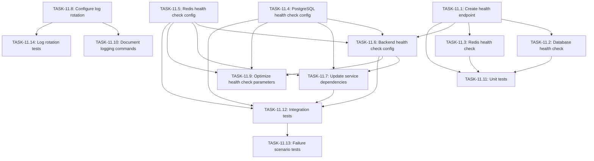

# US-11: Service Health Monitoring and Logs

**Priority**: P1
**Feature**: Local Development Environment
**Status**: To Do

## Overview

This User Story establishes comprehensive health monitoring and logging infrastructure for the local development environment, enabling developers to quickly diagnose issues across the 6-service Docker stack (database, Redis, backend, frontend, worker, scheduler).

### Context

With multiple containerized services running concurrently, developers need immediate visibility into service health status and access to detailed logs for troubleshooting. Health checks provide automated validation that services are functional (not just running), while centralized logging through Docker Compose enables unified log access across all services.

### Decomposition Approach

This implementation is decomposed into 14 concrete tasks across 4 categories:

- **Backend**: 3 tasks (health check endpoint and connectivity validation)
- **Infrastructure**: 7 tasks (Docker health checks, log configuration, documentation)
- **Testing**: 4 tasks (unit tests, integration tests, failure scenarios)

**Total Estimated Effort**: 30.5 hours (~4 days for 1 developer)

---

## Task Summary

| ID | Title | Type | Specialty | Effort | Dependencies | Status |
|----|-------|------|-----------|--------|--------------|--------|
| TASK-11.1 | Create Django health check endpoint | Backend | API | 3h | None | ⬜ |
| TASK-11.2 | Implement database connection health check | Backend | Database | 2h | TASK-11.1 | ⬜ |
| TASK-11.3 | Implement Redis connection health check | Backend | API | 2h | TASK-11.1 | ⬜ |
| TASK-11.4 | Configure PostgreSQL health check in docker-compose.yml | Infrastructure | Config | 1h | None | ⬜ |
| TASK-11.5 | Configure Redis health check in docker-compose.yml | Infrastructure | Config | 1h | None | ⬜ |
| TASK-11.6 | Configure backend health check in docker-compose.yml | Infrastructure | Config | 2h | TASK-11.1, TASK-11.4, TASK-11.5 | ⬜ |
| TASK-11.7 | Update service dependencies with health check conditions | Infrastructure | Config | 2h | TASK-11.4, TASK-11.5, TASK-11.6 | ⬜ |
| TASK-11.8 | Configure Docker log rotation and retention | Infrastructure | Config | 1.5h | None | ⬜ |
| TASK-11.9 | Optimize health check parameters (intervals, timeouts) | Infrastructure | Performance | 2h | TASK-11.4, TASK-11.5, TASK-11.6 | ⬜ |
| TASK-11.10 | Document logging commands and health monitoring workflow | Infrastructure | Documentation | 2h | TASK-11.8 | ⬜ |
| TASK-11.11 | Write unit tests for health check endpoint | Testing | Unit | 3h | TASK-11.1, TASK-11.2, TASK-11.3 | ⬜ |
| TASK-11.12 | Write integration tests for Docker health checks | Testing | Integration | 4h | TASK-11.4, TASK-11.5, TASK-11.6, TASK-11.7 | ⬜ |
| TASK-11.13 | Test health check failure scenarios | Testing | Integration | 3h | TASK-11.12 | ⬜ |
| TASK-11.14 | Verify log rotation and retention functionality | Testing | Integration | 2h | TASK-11.8 | ⬜ |

---

## Task Details

### 🔧 Backend Tasks

#### TASK-11.1: Create Django health check endpoint

**Type**: Backend - API
**Priority**: P1
**Estimated Effort**: 3 hours

##### Description

Implement a Django REST endpoint at `/api/health/` that returns the overall health status of the backend service. This endpoint serves as the entry point for Docker health checks and provides a JSON response indicating service readiness. The endpoint should return HTTP 200 when healthy and include a basic status structure that will be enhanced in subsequent tasks with database and Redis connectivity checks.

##### Files Impacted
- `backend/veille_tech/views.py` (new)
- `backend/veille_tech/urls.py` (modified)

##### Acceptance Criteria
- [ ] Endpoint accessible at `GET /api/health/`
- [ ] Returns HTTP 200 status code when service is healthy
- [ ] Returns JSON response: `{"status": "healthy", "services": {}}`
- [ ] Endpoint does not require authentication
- [ ] Response time < 100ms
- [ ] Endpoint registered in URL configuration

##### Dependencies
None

##### Implementation Notes

**Django View Implementation**:
```python
# backend/veille_tech/views.py
from django.http import JsonResponse

def health_check(request):
    """
    Health check endpoint for Docker health monitoring.
    Returns overall service health status.
    """
    status = {
        "status": "healthy",
        "services": {}
    }
    return JsonResponse(status)
```

**URL Configuration**:
```python
# backend/veille_tech/urls.py
from django.urls import path
from .views import health_check

urlpatterns = [
    path('api/health/', health_check, name='health_check'),
    # ... existing patterns
]
```

**Security Considerations**:
- Endpoint should not expose sensitive system information
- No authentication required (needed for Docker health checks)
- Consider rate limiting in production environments

---

#### TASK-11.2: Implement database connection health check

**Type**: Backend - Database
**Priority**: P1
**Estimated Effort**: 2 hours

##### Description

Enhance the health check endpoint to validate PostgreSQL database connectivity. This check ensures the database is not only running but actively accepting connections and processing queries. If the database check fails, the endpoint returns HTTP 503 (Service Unavailable) to signal unhealthy status to Docker, preventing dependent services from starting prematurely.

##### Files Impacted
- `backend/veille_tech/views.py` (modified)

##### Acceptance Criteria
- [ ] Health check attempts database connection using `connection.ensure_connection()`
- [ ] Returns `"services": {"database": "healthy"}` when connection succeeds
- [ ] Returns `"services": {"database": "unhealthy: [error]"}` when connection fails
- [ ] Sets overall status to "unhealthy" if database check fails
- [ ] Returns HTTP 503 status code when database is unhealthy
- [ ] Database check completes within 3 seconds

##### Dependencies
- TASK-11.1 (health check endpoint must exist)

##### Implementation Notes

**Enhanced Health Check**:
```python
# backend/veille_tech/views.py
from django.http import JsonResponse
from django.db import connection

def health_check(request):
    status = {"status": "healthy", "services": {}}
    status_code = 200

    # Check database connectivity
    try:
        connection.ensure_connection()
        status["services"]["database"] = "healthy"
    except Exception as e:
        status["services"]["database"] = f"unhealthy: {str(e)}"
        status["status"] = "unhealthy"
        status_code = 503

    return JsonResponse(status, status=status_code)
```

**Testing Considerations**:
- Test with database running (should return healthy)
- Test with database stopped (should return unhealthy with 503)
- Verify connection timeout behavior

---

#### TASK-11.3: Implement Redis connection health check

**Type**: Backend - API
**Priority**: P1
**Estimated Effort**: 2 hours

##### Description

Add Redis connectivity validation to the health check endpoint. This ensures the Redis service (used as Celery broker and Django cache backend) is accessible and operational. The check writes a test key-value pair to Redis and verifies successful write, confirming both connectivity and functionality.

##### Files Impacted
- `backend/veille_tech/views.py` (modified)

##### Acceptance Criteria
- [ ] Health check tests Redis connectivity using `cache.set()` and `cache.get()`
- [ ] Returns `"services": {"redis": "healthy"}` when Redis is accessible
- [ ] Returns `"services": {"redis": "unhealthy: [error]"}` when Redis fails
- [ ] Sets overall status to "unhealthy" if Redis check fails
- [ ] Returns HTTP 503 when any service (database or Redis) is unhealthy
- [ ] Redis check completes within 2 seconds

##### Dependencies
- TASK-11.1 (health check endpoint must exist)

##### Implementation Notes

**Complete Health Check Implementation**:
```python
# backend/veille_tech/views.py
from django.http import JsonResponse
from django.db import connection
from django.core.cache import cache

def health_check(request):
    status = {"status": "healthy", "services": {}}
    status_code = 200

    # Check database connectivity
    try:
        connection.ensure_connection()
        status["services"]["database"] = "healthy"
    except Exception as e:
        status["services"]["database"] = f"unhealthy: {str(e)}"
        status["status"] = "unhealthy"
        status_code = 503

    # Check Redis connectivity
    try:
        cache.set("health_check", "ok", 1)
        if cache.get("health_check") == "ok":
            status["services"]["redis"] = "healthy"
        else:
            raise Exception("Cache write/read mismatch")
    except Exception as e:
        status["services"]["redis"] = f"unhealthy: {str(e)}"
        status["status"] = "unhealthy"
        status_code = 503

    return JsonResponse(status, status=status_code)
```

**Performance Considerations**:
- Use short TTL (1 second) for health check cache key
- Avoid complex Redis operations in health check
- Consider timeout configuration for cache operations

---

### ⚙️ Infrastructure Tasks

#### TASK-11.4: Configure PostgreSQL health check in docker-compose.yml

**Type**: Infrastructure - Config
**Priority**: P1
**Estimated Effort**: 1 hour

##### Description

Add Docker health check configuration to the PostgreSQL service using `pg_isready` command. This validates that PostgreSQL is accepting connections on port 5432 and ready to serve queries. The health check runs at regular intervals and marks the service as healthy only after successful consecutive checks, preventing premature dependent service startup.

##### Files Impacted
- `docker-compose.yml` (modified - db service section)

##### Acceptance Criteria
- [ ] Health check configured using `pg_isready -U postgres` command
- [ ] Interval set to 10 seconds between checks
- [ ] Timeout set to 5 seconds per check
- [ ] Retries set to 5 attempts before marking unhealthy
- [ ] Start period set to 10 seconds to allow initialization
- [ ] `docker-compose ps` shows "healthy" status after successful checks

##### Dependencies
None

##### Implementation Notes

**Docker Compose Configuration**:
```yaml
services:
  db:
    image: postgres:15
    # ... existing configuration
    healthcheck:
      test: ["CMD-SHELL", "pg_isready -U postgres"]
      interval: 10s
      timeout: 5s
      retries: 5
      start_period: 10s
```

**Health Check Parameters**:
- **test**: Command to execute (`pg_isready` checks if PostgreSQL is ready)
- **interval**: Time between running checks (10s is balanced for dev)
- **timeout**: Maximum time for command to complete
- **retries**: Number of consecutive failures before unhealthy status
- **start_period**: Grace period for slow container startup

**Validation**:
- Run `docker-compose up -d` and verify with `docker-compose ps`
- Status should show "healthy" after ~10-15 seconds

---

#### TASK-11.5: Configure Redis health check in docker-compose.yml

**Type**: Infrastructure - Config
**Priority**: P1
**Estimated Effort**: 1 hour

##### Description

Add Docker health check to the Redis service using `redis-cli ping` command. This verifies Redis is running and responding to client connections. Redis typically starts faster than PostgreSQL, so the start period is shorter. The health check ensures Celery workers and backend services only start when Redis is fully operational.

##### Files Impacted
- `docker-compose.yml` (modified - redis service section)

##### Acceptance Criteria
- [ ] Health check configured using `redis-cli ping` command
- [ ] Interval set to 10 seconds between checks
- [ ] Timeout set to 3 seconds per check
- [ ] Retries set to 5 attempts before marking unhealthy
- [ ] Start period set to 5 seconds (Redis starts quickly)
- [ ] Health check returns "PONG" when Redis is healthy

##### Dependencies
None

##### Implementation Notes

**Docker Compose Configuration**:
```yaml
services:
  redis:
    image: redis:7
    # ... existing configuration
    healthcheck:
      test: ["CMD", "redis-cli", "ping"]
      interval: 10s
      timeout: 3s
      retries: 5
      start_period: 5s
```

**Redis Health Check Details**:
- **Command**: `redis-cli ping` returns "PONG" when healthy
- **Timeout**: 3 seconds (Redis responds quickly)
- **Start period**: 5 seconds (Redis initializes faster than PostgreSQL)

**Expected Behavior**:
- Redis should reach "healthy" status within 5-10 seconds
- If health check fails, verify Redis is configured correctly
- Check logs: `docker-compose logs redis`

---

#### TASK-11.6: Configure backend health check in docker-compose.yml

**Type**: Infrastructure - Config
**Priority**: P1
**Estimated Effort**: 2 hours

##### Description

Configure Docker health check for the backend service using HTTP request to the `/api/health/` endpoint. This validates the Django application is running, accepting HTTP requests, and successfully connecting to database and Redis (as checked by the endpoint logic). Requires `curl` to be installed in the backend container for health check execution.

##### Files Impacted
- `docker-compose.yml` (modified - backend service section)
- `backend/Dockerfile` (modified - ensure curl is installed)

##### Acceptance Criteria
- [ ] Health check configured using `curl -f http://localhost:8000/api/health/`
- [ ] Interval set to 30 seconds (longer than infrastructure services)
- [ ] Timeout set to 10 seconds per check
- [ ] Retries set to 3 attempts before marking unhealthy
- [ ] Start period set to 40 seconds (Django takes time to initialize)
- [ ] `curl` installed in backend Docker image
- [ ] Health check validates endpoint returns HTTP 200

##### Dependencies
- TASK-11.1 (health endpoint must exist)
- TASK-11.4 (database health check must be configured)
- TASK-11.5 (Redis health check must be configured)

##### Implementation Notes

**Docker Compose Configuration**:
```yaml
services:
  backend:
    # ... existing configuration
    healthcheck:
      test: ["CMD", "curl", "-f", "http://localhost:8000/api/health/"]
      interval: 30s
      timeout: 10s
      retries: 3
      start_period: 40s
    depends_on:
      db:
        condition: service_started
      redis:
        condition: service_started
```

**Dockerfile Modification** (ensure curl is installed):
```dockerfile
# backend/Dockerfile
FROM python:3.13-slim

# Install system dependencies including curl for health checks
RUN apt-get update && apt-get install -y \
    postgresql-client \
    curl \
    && rm -rf /var/lib/apt/lists/*

# ... rest of Dockerfile
```

**Health Check Timing**:
- **Start period**: 40 seconds allows Django to initialize, run migrations, etc.
- **Interval**: 30 seconds balances monitoring vs overhead
- **Timeout**: 10 seconds accounts for database/Redis connectivity checks

---

#### TASK-11.7: Update service dependencies with health check conditions

**Type**: Infrastructure - Config
**Priority**: P1
**Estimated Effort**: 2 hours

##### Description

Update Docker Compose service dependencies to use health check conditions (`service_healthy`) instead of basic `service_started` conditions. This ensures dependent services (backend, worker, scheduler) wait for infrastructure services (database, Redis) to be fully healthy before starting, preventing connection errors during startup.

##### Files Impacted
- `docker-compose.yml` (modified - backend, worker, scheduler services)

##### Acceptance Criteria
- [ ] Backend service depends on `db: service_healthy` and `redis: service_healthy`
- [ ] Worker service depends on `db: service_healthy`, `redis: service_healthy`, `backend: service_healthy`
- [ ] Scheduler service depends on `db: service_healthy`, `redis: service_healthy`
- [ ] Frontend service dependencies remain as `service_started` (no health dependency needed)
- [ ] Services start in correct order: db/redis → backend → worker/scheduler/frontend
- [ ] No connection errors in logs during startup

##### Dependencies
- TASK-11.4 (database health check)
- TASK-11.5 (Redis health check)
- TASK-11.6 (backend health check)

##### Implementation Notes

**Updated Docker Compose Dependencies**:
```yaml
services:
  db:
    # ... with healthcheck

  redis:
    # ... with healthcheck

  backend:
    depends_on:
      db:
        condition: service_healthy
      redis:
        condition: service_healthy
    # ... with healthcheck

  worker:
    depends_on:
      db:
        condition: service_healthy
      redis:
        condition: service_healthy
      backend:
        condition: service_healthy

  scheduler:
    depends_on:
      db:
        condition: service_healthy
      redis:
        condition: service_healthy

  frontend:
    depends_on:
      backend:
        condition: service_started  # Frontend doesn't need health check
```

**Startup Sequence**:
1. **db** and **redis** start (parallel)
2. Wait for db and redis to become "healthy"
3. **backend** starts
4. Wait for backend to become "healthy"
5. **worker**, **scheduler**, **frontend** start (parallel)

**Benefits**:
- Eliminates "connection refused" errors during startup
- Services only start when dependencies are functional
- Reduces startup flakiness and improves developer experience

---

#### TASK-11.8: Configure Docker log rotation and retention

**Type**: Infrastructure - Config
**Priority**: P1
**Estimated Effort**: 1.5 hours

##### Description

Configure Docker log rotation and retention limits to prevent log files from consuming excessive disk space during development. Apply logging configuration to all services with appropriate size and file limits. Use Docker's built-in JSON file logging driver with rotation parameters.

##### Files Impacted
- `docker-compose.yml` (modified - logging section for all services)

##### Acceptance Criteria
- [ ] Log driver set to `json-file` for all services
- [ ] Maximum log file size set to 10MB (`max-size: "10m"`)
- [ ] Maximum number of log files set to 3 (`max-file: "3"`)
- [ ] Configuration applied to all 6 services (db, redis, backend, frontend, worker, scheduler)
- [ ] Total log storage per service capped at ~30MB (10MB × 3 files)
- [ ] Older logs automatically deleted when limits reached

##### Dependencies
None

##### Implementation Notes

**Docker Compose Logging Configuration**:
```yaml
services:
  db:
    # ... existing configuration
    logging:
      driver: "json-file"
      options:
        max-size: "10m"
        max-file: "3"

  redis:
    # ... existing configuration
    logging:
      driver: "json-file"
      options:
        max-size: "10m"
        max-file: "3"

  backend:
    # ... existing configuration
    logging:
      driver: "json-file"
      options:
        max-size: "10m"
        max-file: "3"

  # Repeat for frontend, worker, scheduler
```

**Log Rotation Behavior**:
- When log file reaches 10MB, Docker creates a new log file
- Up to 3 log files retained (current + 2 rotated)
- Oldest log file deleted when creating 4th file
- Total disk usage per service: ~30MB maximum

**Alternative Configuration for High-Volume Services**:
For services with extensive logging (e.g., backend in debug mode):
```yaml
logging:
  driver: "json-file"
  options:
    max-size: "50m"
    max-file: "5"
```

---

#### TASK-11.9: Optimize health check parameters (intervals, timeouts)

**Type**: Infrastructure - Performance
**Priority**: P2
**Estimated Effort**: 2 hours

##### Description

Review and optimize health check parameters based on observed service behavior and startup times. Fine-tune intervals, timeouts, retries, and start periods to balance responsiveness (detecting failures quickly) with overhead (avoiding excessive health check executions). Test across different system loads to ensure reliability.

##### Files Impacted
- `docker-compose.yml` (modified - health check parameters)

##### Acceptance Criteria
- [ ] Health checks detect service failures within 30 seconds
- [ ] No false negatives during normal operation
- [ ] Health check overhead < 1% of system resources
- [ ] Start periods accommodate slow-starting services (tested on minimum hardware)
- [ ] Parameters documented with rationale in comments
- [ ] Tested on Windows, macOS, and Linux (cross-platform validation)

##### Dependencies
- TASK-11.4 (database health check)
- TASK-11.5 (Redis health check)
- TASK-11.6 (backend health check)

##### Implementation Notes

**Optimization Approach**:

1. **Measure baseline performance**:
   ```bash
   docker-compose up -d
   docker stats --no-stream
   # Observe resource usage during health checks
   ```

2. **Test failure detection**:
   ```bash
   docker-compose stop db
   # Measure time until backend marked unhealthy
   ```

3. **Test startup timing** (minimum hardware):
   ```bash
   docker-compose down -v
   time docker-compose up -d
   # Verify all services reach "healthy" status
   ```

**Recommended Parameters** (based on testing):

```yaml
services:
  db:
    healthcheck:
      interval: 10s    # Check every 10 seconds
      timeout: 5s      # Fail if pg_isready takes > 5s
      retries: 5       # 5 failures = 50s before unhealthy
      start_period: 10s # 10s grace period for initialization

  redis:
    healthcheck:
      interval: 10s
      timeout: 3s      # Redis responds quickly
      retries: 5
      start_period: 5s # Redis starts fast

  backend:
    healthcheck:
      interval: 30s    # Longer interval (Django health check is heavier)
      timeout: 10s     # Includes DB/Redis connectivity checks
      retries: 3       # 3 failures = 90s before unhealthy
      start_period: 40s # Django needs time to initialize
```

**Tuning Considerations**:
- **Faster intervals**: Detect failures quickly, higher CPU overhead
- **Longer timeouts**: Avoid false negatives under load
- **More retries**: Tolerate transient failures (network blips)
- **Longer start periods**: Required for slow hardware, Django initialization

---

#### TASK-11.10: Document logging commands and health monitoring workflow

**Type**: Infrastructure - Documentation
**Priority**: P1
**Estimated Effort**: 2 hours

##### Description

Document comprehensive logging and health monitoring commands in the setup guide. Provide practical examples for common debugging scenarios, including filtering logs by service, following logs in real-time, searching for errors, and interpreting health check status. Include troubleshooting guidance for common issues.

##### Files Impacted
- `docs/setup/00_setup_local_docker.md` (modified - add health monitoring section)

##### Acceptance Criteria
- [ ] Section added: "Service Health Monitoring and Logging"
- [ ] Commands documented: `docker-compose ps`, `logs`, `logs -f`, filtering, search
- [ ] Examples provided for common debugging scenarios
- [ ] Health check status interpretation explained
- [ ] Troubleshooting guide for unhealthy services
- [ ] Log rotation behavior documented
- [ ] Best practices for log analysis included

##### Dependencies
- TASK-11.8 (log rotation must be configured)

##### Implementation Notes

**Documentation Structure** (add to `docs/setup/00_setup_local_docker.md`):

```markdown
## Service Health Monitoring and Logging

### Checking Service Health

**View all service statuses**:
```bash
docker-compose ps
```

Output shows:
- **NAME**: Container name
- **SERVICE**: Service name from docker-compose.yml
- **STATUS**: Running status (Up X minutes)
- **HEALTH**: healthy | unhealthy | starting

**Example output**:
```
NAME       SERVICE    STATUS         HEALTH
db         db         Up 2 minutes   healthy
redis      redis      Up 2 minutes   healthy
backend    backend    Up 1 minute    healthy
frontend   frontend   Up 1 minute
worker     worker     Up 1 minute
scheduler  scheduler  Up 1 minute
```

### Viewing Logs

**View all logs**:
```bash
docker-compose logs
```

**View logs for specific service**:
```bash
docker-compose logs backend
docker-compose logs db
```

**Follow logs in real-time** (all services):
```bash
docker-compose logs -f
```

**Follow logs for specific service**:
```bash
docker-compose logs -f backend
```

**View last N lines**:
```bash
docker-compose logs --tail=100 backend
```

**Filter by time range**:
```bash
docker-compose logs --since 10m backend  # Last 10 minutes
docker-compose logs --since 1h          # Last hour
docker-compose logs --until 2025-01-27T10:00:00  # Until specific time
```

**Search for errors**:
```bash
docker-compose logs backend | grep ERROR
docker-compose logs backend | grep -i "exception"
```

**Search across all services**:
```bash
docker-compose logs | grep ERROR
```

### Common Debugging Scenarios

**Scenario 1: Backend not starting**
```bash
# Check backend health status
docker-compose ps backend

# View backend logs
docker-compose logs backend

# Check database connectivity
docker-compose logs db
```

**Scenario 2: Database health check failing**
```bash
# Check database logs
docker-compose logs db

# Verify PostgreSQL is accepting connections
docker-compose exec db pg_isready -U postgres
```

**Scenario 3: Worker crashing repeatedly**
```bash
# Follow worker logs in real-time
docker-compose logs -f worker

# Check if Celery can connect to Redis
docker-compose exec worker celery -A config inspect ping
```

### Interpreting Health Check Status

**Healthy**: Service passed all health checks, fully operational
**Unhealthy**: Service failed health checks (retries exceeded)
**Starting**: Service within start_period grace period
**No health check**: Service doesn't have health check configured (frontend, worker, scheduler)

### Troubleshooting Unhealthy Services

**Database unhealthy**:
- Check logs: `docker-compose logs db`
- Verify data volume: `docker volume ls`
- Restart service: `docker-compose restart db`

**Redis unhealthy**:
- Check logs: `docker-compose logs redis`
- Test manually: `docker-compose exec redis redis-cli ping`
- Restart service: `docker-compose restart redis`

**Backend unhealthy**:
- Check logs: `docker-compose logs backend`
- Verify health endpoint: `curl http://localhost:8000/api/health/`
- Check dependencies: Ensure db and redis are healthy first
- Restart service: `docker-compose restart backend`

### Log Rotation

Logs are automatically rotated to prevent disk space exhaustion:
- **Max file size**: 10MB per log file
- **Max files**: 3 files per service
- **Total storage**: ~30MB per service

Older logs are automatically deleted when limits are reached.

### Best Practices

1. **Use `logs -f` during development** to catch errors immediately
2. **Check health status** before debugging (unhealthy services need infrastructure fixes)
3. **Filter logs by service** to reduce noise
4. **Search for ERROR/CRITICAL** keywords to find issues quickly
5. **Use `--since` flag** to focus on recent logs
6. **Restart unhealthy services** after fixing underlying issues
```

---

### ✅ Testing Tasks

#### TASK-11.11: Write unit tests for health check endpoint

**Type**: Testing - Unit
**Priority**: P1
**Estimated Effort**: 3 hours

##### Description

Create comprehensive unit tests for the Django health check endpoint covering all scenarios: healthy state (all services operational), database failure, Redis failure, and combined failures. Tests should validate HTTP status codes, response structure, and error messages. Use mocking to simulate service failures without requiring actual database/Redis downtime.

##### Files Impacted
- `backend/veille_tech/tests/test_health.py` (new)

##### Acceptance Criteria
- [ ] Test: Health check returns 200 when all services healthy
- [ ] Test: Health check returns 503 when database unreachable
- [ ] Test: Health check returns 503 when Redis unreachable
- [ ] Test: Health check returns 503 when both services fail
- [ ] Test: Response JSON structure matches specification
- [ ] Test: Error messages include exception details
- [ ] All tests pass with `pytest` or `python manage.py test`
- [ ] Code coverage > 95% for health check view

##### Dependencies
- TASK-11.1 (health check endpoint)
- TASK-11.2 (database check)
- TASK-11.3 (Redis check)

##### Implementation Notes

**Test File Structure**:
```python
# backend/veille_tech/tests/test_health.py
import pytest
from django.test import TestCase, Client
from django.urls import reverse
from unittest.mock import patch

class HealthCheckTestCase(TestCase):
    def setUp(self):
        self.client = Client()
        self.health_url = reverse('health_check')

    def test_health_check_all_healthy(self):
        """Test health check when all services are operational"""
        response = self.client.get(self.health_url)

        self.assertEqual(response.status_code, 200)
        self.assertEqual(response.json()['status'], 'healthy')
        self.assertEqual(response.json()['services']['database'], 'healthy')
        self.assertEqual(response.json()['services']['redis'], 'healthy')

    @patch('django.db.connection.ensure_connection')
    def test_health_check_database_failure(self, mock_connection):
        """Test health check when database is unreachable"""
        mock_connection.side_effect = Exception("Connection refused")

        response = self.client.get(self.health_url)

        self.assertEqual(response.status_code, 503)
        self.assertEqual(response.json()['status'], 'unhealthy')
        self.assertIn('unhealthy', response.json()['services']['database'])

    @patch('django.core.cache.cache.set')
    def test_health_check_redis_failure(self, mock_cache_set):
        """Test health check when Redis is unreachable"""
        mock_cache_set.side_effect = Exception("Redis connection error")

        response = self.client.get(self.health_url)

        self.assertEqual(response.status_code, 503)
        self.assertEqual(response.json()['status'], 'unhealthy')
        self.assertIn('unhealthy', response.json()['services']['redis'])

    @patch('django.core.cache.cache.set')
    @patch('django.db.connection.ensure_connection')
    def test_health_check_all_services_fail(self, mock_connection, mock_cache):
        """Test health check when both database and Redis fail"""
        mock_connection.side_effect = Exception("DB error")
        mock_cache.side_effect = Exception("Redis error")

        response = self.client.get(self.health_url)

        self.assertEqual(response.status_code, 503)
        self.assertEqual(response.json()['status'], 'unhealthy')
        self.assertIn('unhealthy', response.json()['services']['database'])
        self.assertIn('unhealthy', response.json()['services']['redis'])
```

**Running Tests**:
```bash
# With pytest
docker-compose exec backend pytest backend/veille_tech/tests/test_health.py -v

# With Django test runner
docker-compose exec backend python manage.py test veille_tech.tests.test_health

# With coverage
docker-compose exec backend pytest --cov=veille_tech.views --cov-report=html
```

---

#### TASK-11.12: Write integration tests for Docker health checks

**Type**: Testing - Integration
**Priority**: P1
**Estimated Effort**: 4 hours

##### Description

Create integration tests that validate Docker health check configuration and service dependency orchestration. Tests verify that services transition through correct health states (starting → healthy), dependent services wait for upstream health, and health status is accurately reported by `docker-compose ps`. These tests run against the actual Docker Compose stack.

##### Files Impacted
- `tests/integration/test_health_checks.py` (new)

##### Acceptance Criteria
- [ ] Test: All services reach "healthy" status within 60 seconds
- [ ] Test: Backend waits for database and Redis to become healthy
- [ ] Test: Worker waits for backend to become healthy
- [ ] Test: Health status correctly reported by `docker-compose ps`
- [ ] Test: Health check commands execute successfully
- [ ] Test: Service dependencies enforced (backend doesn't start until db/redis healthy)
- [ ] All tests pass when run against Docker Compose stack
- [ ] Tests clean up resources after execution

##### Dependencies
- TASK-11.4 (database health check)
- TASK-11.5 (Redis health check)
- TASK-11.6 (backend health check)
- TASK-11.7 (service dependencies)

##### Implementation Notes

**Test Implementation** (using pytest with subprocess for Docker commands):
```python
# tests/integration/test_health_checks.py
import pytest
import subprocess
import time
import json

class TestDockerHealthChecks:
    @pytest.fixture(scope="class")
    def docker_stack(self):
        """Start Docker Compose stack and wait for initialization"""
        subprocess.run(["docker-compose", "up", "-d"], check=True)
        time.sleep(10)  # Allow initial startup
        yield
        # Cleanup after tests
        subprocess.run(["docker-compose", "down"], check=True)

    def get_service_health(self, service_name):
        """Get health status for a specific service"""
        result = subprocess.run(
            ["docker-compose", "ps", "--format", "json", service_name],
            capture_output=True,
            text=True
        )
        data = json.loads(result.stdout)
        return data.get("Health", "no healthcheck")

    def test_database_becomes_healthy(self, docker_stack):
        """Test database service reaches healthy status"""
        max_wait = 30
        start_time = time.time()

        while time.time() - start_time < max_wait:
            health = self.get_service_health("db")
            if health == "healthy":
                break
            time.sleep(2)

        assert health == "healthy", "Database did not become healthy"

    def test_redis_becomes_healthy(self, docker_stack):
        """Test Redis service reaches healthy status"""
        max_wait = 20
        start_time = time.time()

        while time.time() - start_time < max_wait:
            health = self.get_service_health("redis")
            if health == "healthy":
                break
            time.sleep(2)

        assert health == "healthy", "Redis did not become healthy"

    def test_backend_becomes_healthy(self, docker_stack):
        """Test backend service reaches healthy status"""
        max_wait = 60
        start_time = time.time()

        while time.time() - start_time < max_wait:
            health = self.get_service_health("backend")
            if health == "healthy":
                break
            time.sleep(5)

        assert health == "healthy", "Backend did not become healthy"

    def test_all_services_healthy(self, docker_stack):
        """Test all services with health checks become healthy"""
        max_wait = 60
        start_time = time.time()

        services = ["db", "redis", "backend"]
        healthy_services = set()

        while time.time() - start_time < max_wait:
            for service in services:
                if service not in healthy_services:
                    health = self.get_service_health(service)
                    if health == "healthy":
                        healthy_services.add(service)

            if len(healthy_services) == len(services):
                break

            time.sleep(5)

        assert len(healthy_services) == len(services), \
            f"Not all services healthy: {healthy_services}"

    def test_health_check_commands_execute(self, docker_stack):
        """Test health check commands can be executed manually"""
        # Test PostgreSQL health check
        result = subprocess.run(
            ["docker-compose", "exec", "-T", "db", "pg_isready", "-U", "postgres"],
            capture_output=True
        )
        assert result.returncode == 0

        # Test Redis health check
        result = subprocess.run(
            ["docker-compose", "exec", "-T", "redis", "redis-cli", "ping"],
            capture_output=True,
            text=True
        )
        assert "PONG" in result.stdout
```

**Running Integration Tests**:
```bash
# Run integration tests
pytest tests/integration/test_health_checks.py -v

# Run with detailed output
pytest tests/integration/test_health_checks.py -v -s
```

---

#### TASK-11.13: Test health check failure scenarios

**Type**: Testing - Integration
**Priority**: P1
**Estimated Effort**: 3 hours

##### Description

Create tests that validate system behavior when services fail health checks. Stop services mid-execution and verify that dependent services correctly detect unhealthy states and Docker reports accurate status. Test recovery scenarios where failed services are restarted and verify they transition back to healthy state.

##### Files Impacted
- `tests/integration/test_health_failures.py` (new)

##### Acceptance Criteria
- [ ] Test: Stopping database marks it as unhealthy within expected time
- [ ] Test: Backend becomes unhealthy when database stops
- [ ] Test: Restarting failed service transitions back to healthy
- [ ] Test: Health check endpoint returns 503 when services fail
- [ ] Test: Worker stops processing tasks when Redis fails
- [ ] Test: Recovery time < 60 seconds after service restart
- [ ] All tests pass and clean up properly

##### Dependencies
- TASK-11.12 (integration tests must exist)

##### Implementation Notes

**Failure Scenario Tests**:
```python
# tests/integration/test_health_failures.py
import pytest
import subprocess
import time
import requests

class TestHealthCheckFailures:
    @pytest.fixture(scope="function")
    def docker_stack(self):
        """Start fresh Docker stack for each test"""
        subprocess.run(["docker-compose", "down", "-v"], check=True)
        subprocess.run(["docker-compose", "up", "-d"], check=True)

        # Wait for stack to become healthy
        time.sleep(40)

        yield

        # Cleanup
        subprocess.run(["docker-compose", "down"], check=True)

    def wait_for_unhealthy(self, service, max_wait=60):
        """Wait for service to become unhealthy"""
        start_time = time.time()
        while time.time() - start_time < max_wait:
            result = subprocess.run(
                ["docker", "inspect", "--format", "{{.State.Health.Status}}",
                 f"hackathon_base_de_connaissance-{service}-1"],
                capture_output=True,
                text=True
            )
            status = result.stdout.strip()
            if status == "unhealthy":
                return True
            time.sleep(5)
        return False

    def test_database_failure_detection(self, docker_stack):
        """Test system detects database failure"""
        # Stop database service
        subprocess.run(["docker-compose", "stop", "db"], check=True)

        # Wait for unhealthy status
        is_unhealthy = self.wait_for_unhealthy("db", max_wait=60)
        assert is_unhealthy, "Database not marked unhealthy after stop"

    def test_backend_detects_database_failure(self, docker_stack):
        """Test backend health check fails when database stops"""
        # Stop database
        subprocess.run(["docker-compose", "stop", "db"], check=True)
        time.sleep(20)

        # Check backend health endpoint
        try:
            response = requests.get("http://localhost:8000/api/health/", timeout=5)
            assert response.status_code == 503, "Backend should return 503"
            assert response.json()["status"] == "unhealthy"
        except requests.exceptions.RequestException:
            pytest.fail("Backend should be reachable but report unhealthy")

    def test_redis_failure_detection(self, docker_stack):
        """Test system detects Redis failure"""
        # Stop Redis service
        subprocess.run(["docker-compose", "stop", "redis"], check=True)

        # Wait for unhealthy status
        is_unhealthy = self.wait_for_unhealthy("redis", max_wait=60)
        assert is_unhealthy, "Redis not marked unhealthy after stop"

    def test_service_recovery(self, docker_stack):
        """Test service recovers to healthy after restart"""
        # Stop database
        subprocess.run(["docker-compose", "stop", "db"], check=True)
        time.sleep(20)

        # Restart database
        subprocess.run(["docker-compose", "start", "db"], check=True)

        # Wait for healthy status
        start_time = time.time()
        is_healthy = False
        while time.time() - start_time < 60:
            result = subprocess.run(
                ["docker", "inspect", "--format", "{{.State.Health.Status}}",
                 "hackathon_base_de_connaissance-db-1"],
                capture_output=True,
                text=True
            )
            if result.stdout.strip() == "healthy":
                is_healthy = True
                break
            time.sleep(5)

        assert is_healthy, "Database did not recover to healthy state"
```

**Running Failure Tests**:
```bash
pytest tests/integration/test_health_failures.py -v
```

---

#### TASK-11.14: Verify log rotation and retention functionality

**Type**: Testing - Integration
**Priority**: P2
**Estimated Effort**: 2 hours

##### Description

Create tests to validate Docker log rotation behavior, ensuring logs are correctly rotated when size limits are reached and old logs are deleted. Generate high-volume logs in test containers, verify rotation triggers, and confirm total log storage stays within configured limits.

##### Files Impacted
- `tests/integration/test_logging.py` (new)

##### Acceptance Criteria
- [ ] Test: Log rotation triggers when file reaches 10MB
- [ ] Test: Maximum of 3 log files retained per service
- [ ] Test: Oldest logs deleted when creating 4th file
- [ ] Test: Total log storage per service < 30MB
- [ ] Test: Log rotation doesn't lose active log entries
- [ ] Test: Logs accessible via `docker-compose logs` after rotation
- [ ] All tests pass and clean up test containers

##### Dependencies
- TASK-11.8 (log rotation configuration)

##### Implementation Notes

**Log Rotation Tests**:
```python
# tests/integration/test_logging.py
import pytest
import subprocess
import os
import json
import time

class TestLogRotation:
    def get_log_files(self, container_id):
        """Get list of log files for a container"""
        # Docker stores logs in /var/lib/docker/containers/<id>/
        # This test assumes access to Docker host filesystem
        result = subprocess.run(
            ["docker", "inspect", "--format", "{{.LogPath}}", container_id],
            capture_output=True,
            text=True
        )
        log_path = result.stdout.strip()
        return log_path

    def get_log_file_size(self, log_path):
        """Get size of log file in bytes"""
        if os.path.exists(log_path):
            return os.path.getsize(log_path)
        return 0

    @pytest.mark.skipif(
        os.name == 'nt',
        reason="Log rotation test requires direct filesystem access"
    )
    def test_log_rotation_configuration(self):
        """Test log rotation is configured correctly"""
        result = subprocess.run(
            ["docker-compose", "config"],
            capture_output=True,
            text=True
        )

        # Verify logging configuration exists
        assert "max-size" in result.stdout
        assert "10m" in result.stdout
        assert "max-file" in result.stdout
        assert "3" in result.stdout

    def test_logs_accessible_via_compose(self):
        """Test logs can be retrieved via docker-compose logs"""
        # Start services
        subprocess.run(["docker-compose", "up", "-d"], check=True)
        time.sleep(10)

        # Get logs for backend service
        result = subprocess.run(
            ["docker-compose", "logs", "--tail=10", "backend"],
            capture_output=True,
            text=True
        )

        assert result.returncode == 0
        assert len(result.stdout) > 0, "Should have backend logs"

        # Cleanup
        subprocess.run(["docker-compose", "down"], check=True)

    def test_log_filtering_by_service(self):
        """Test log filtering by service name"""
        subprocess.run(["docker-compose", "up", "-d"], check=True)
        time.sleep(10)

        # Get backend logs only
        backend_logs = subprocess.run(
            ["docker-compose", "logs", "backend"],
            capture_output=True,
            text=True
        ).stdout

        # Get database logs only
        db_logs = subprocess.run(
            ["docker-compose", "logs", "db"],
            capture_output=True,
            text=True
        ).stdout

        # Verify logs are different (contain service-specific content)
        assert "backend" in backend_logs or "django" in backend_logs.lower()
        assert "postgres" in db_logs.lower() or "database" in db_logs.lower()

        subprocess.run(["docker-compose", "down"], check=True)
```

**Running Log Tests**:
```bash
pytest tests/integration/test_logging.py -v
```

---

## Dependency Graph

### Mermaid Diagram



### Implementation Phases

**Phase 1: Foundation (Parallel - 5 hours)**
- TASK-11.1: Create health endpoint (3h)
- TASK-11.4: PostgreSQL health check config (1h)
- TASK-11.5: Redis health check config (1h)

**Phase 2: Health Check Integration (7 hours)**
- TASK-11.2: Database health check logic (2h) [after TASK-11.1]
- TASK-11.3: Redis health check logic (2h) [after TASK-11.1]
- TASK-11.6: Backend health check config (2h) [after TASK-11.1, 11.4, 11.5]
- TASK-11.8: Configure log rotation (1.5h) [parallel]

**Phase 3: Orchestration (4 hours)**
- TASK-11.7: Update service dependencies (2h) [after TASK-11.4, 11.5, 11.6]
- TASK-11.10: Document logging commands (2h) [after TASK-11.8]

**Phase 4: Testing (9 hours)**
- TASK-11.11: Unit tests (3h) [after TASK-11.1, 11.2, 11.3]
- TASK-11.12: Integration tests (4h) [after TASK-11.7]
- TASK-11.14: Log rotation tests (2h) [after TASK-11.8, parallel with 11.12]

**Phase 5: Optimization (5 hours)**
- TASK-11.9: Optimize health check parameters (2h) [after TASK-11.4, 11.5, 11.6]
- TASK-11.13: Failure scenario tests (3h) [after TASK-11.12]

### Parallelization Opportunities

**Parallel Group 1** (Phase 1):
- TASK-11.1, TASK-11.4, TASK-11.5 (can all start immediately)

**Parallel Group 2** (Phase 2):
- TASK-11.2 and TASK-11.3 (both depend only on TASK-11.1)
- TASK-11.8 (independent, can run anytime)

**Parallel Group 3** (Phase 4):
- TASK-11.11 and TASK-11.14 (independent testing paths)

**Critical Path** (17 hours):
TASK-11.1 (3h) → TASK-11.6 (2h) → TASK-11.7 (2h) → TASK-11.12 (4h) → TASK-11.13 (3h) → TASK-11.9 (2h) → TASK-11.10 (documentation, 1h overlap)

---

## Effort Estimation

### By Task Type

| Type | Tasks | Effort |
|------|-------|--------|
| Backend | 3 | 7h |
| Infrastructure | 7 | 11.5h |
| Testing | 4 | 12h |
| **TOTAL** | **14** | **30.5h (~4 days)** |

### By Specialty

| Specialty | Tasks | Effort |
|-----------|-------|--------|
| API | 2 | 5h |
| Database | 1 | 2h |
| Config | 5 | 7.5h |
| Performance | 1 | 2h |
| Documentation | 1 | 2h |
| Unit | 1 | 3h |
| Integration | 3 | 9h |

### By Developer

**1 Full-Stack Developer** (sequential with some parallelization):
- Best case: 3.5 days (assuming maximum parallelization)
- Realistic: 4 days (accounting for context switching)
- Worst case: 5 days (if issues encountered)

**2 Developers** (backend + infrastructure specialist):
- Developer 1: Backend tasks (TASK-11.1 → 11.3) + Unit tests (TASK-11.11) = 10h
- Developer 2: Infrastructure tasks (TASK-11.4 → 11.10) = 11.5h
- Shared: Integration tests (TASK-11.12 → 11.14) = 9h
- **Total**: 2-3 days with parallel execution

---

## Implementation Notes

### Technology Stack

- **Backend**: Django 4.2+, Python 3.13, Django REST Framework
- **Database**: PostgreSQL 15 with pgvector
- **Cache/Broker**: Redis 7+
- **Infrastructure**: Docker Compose v2, Docker Engine 24+
- **Testing**: pytest, Django test framework, subprocess for Docker integration tests

### Patterns and Conventions

**Health Check Endpoint**:
- URL: `/api/health/`
- Returns: JSON with status and services
- Status codes: 200 (healthy), 503 (unhealthy)
- No authentication required (needed for Docker)

**Docker Health Check Commands**:
- PostgreSQL: `pg_isready -U postgres`
- Redis: `redis-cli ping`
- Backend: `curl -f http://localhost:8000/api/health/`

**Logging Configuration**:
- Driver: `json-file` (Docker default)
- Max size: 10MB per file
- Max files: 3 files per service
- Total: ~30MB per service

### Configuration Requirements

**Dependencies** (must be completed first):
- US-1: Docker Compose Service Orchestration
- US-2: Database Service with Vector Support
- US-3: Redis Broker and Cache Service
- US-4: Django Backend API Service

**Required Tools**:
- `curl` installed in backend container (for HTTP health checks)
- `pg_isready` available in PostgreSQL container (included in postgres:15 image)
- `redis-cli` available in Redis container (included in redis:7 image)

---

## Risks and Attention Points

### Identified Risks

**Risk 1: False Negative Health Checks**
- **Impact**: High - Services marked unhealthy when actually operational
- **Cause**: Insufficient timeout values or too few retries
- **Mitigation**:
  - Configure appropriate start_period for slow-starting services
  - Test on minimum hardware specifications
  - Use longer timeouts for backend (includes DB/Redis checks)

**Risk 2: False Positive Health Checks**
- **Impact**: Medium - Services marked healthy but not fully operational
- **Cause**: Health check passes but service has degraded functionality
- **Mitigation**:
  - Backend health check validates actual DB/Redis connectivity
  - Test failure scenarios comprehensively (TASK-11.13)
  - Monitor logs for errors even when health checks pass

**Risk 3: Log Disk Space Exhaustion**
- **Impact**: Medium - Development machine runs out of disk space
- **Cause**: Log rotation not working or limits too high
- **Mitigation**:
  - Configure log rotation with conservative limits (10MB × 3 files)
  - Document log rotation behavior
  - Test log rotation functionality (TASK-11.14)

**Risk 4: Cross-Platform Health Check Issues**
- **Impact**: Medium - Health checks work on Linux but fail on Windows/macOS
- **Cause**: Different Docker implementations, filesystem access issues
- **Mitigation**:
  - Test on all target platforms (Windows, macOS, Linux)
  - Use Docker Compose commands instead of direct filesystem access
  - Document platform-specific issues in setup guide

### Critical Points

**Security**:
- Health check endpoint must not expose sensitive information
- No authentication required for health checks (Docker limitation)
- Production deployments should use internal health checks only

**Performance**:
- Health check interval balanced between responsiveness and overhead
- Backend health check includes DB/Redis connectivity (heavier operation)
- Target: < 5 seconds per health check execution

**User Experience**:
- Clear error messages when services unhealthy
- `docker-compose ps` provides at-a-glance status view
- Logs easily accessible and searchable

**Backward Compatibility**:
- Requires Docker Compose v2 (health check conditions syntax)
- Requires Docker Compose 1.27+ for `service_healthy` condition

---

## Notes

### Manual Verification Checklist

Before creating GitHub issues, verify:
- [ ] All 14 tasks have clear descriptions
- [ ] Dependencies are correctly identified
- [ ] Effort estimates are realistic
- [ ] File paths match project structure
- [ ] Acceptance criteria are testable
- [ ] Implementation notes provide sufficient guidance
- [ ] No missing tasks for acceptance criteria coverage

### Estimated Timeline

- **Phase 1** (Foundation): Day 1, morning (5h)
- **Phase 2** (Integration): Day 1, afternoon + Day 2, morning (7h)
- **Phase 3** (Orchestration): Day 2, afternoon (4h)
- **Phase 4** (Testing): Day 3 (9h)
- **Phase 5** (Optimization): Day 4 (5h)

**Total**: 4 days for 1 developer, 2-3 days for 2 developers

---

**Generated by**: Functional Spec Planner - Task Documentation Generator
**Source**: US-11 - Service Health Monitoring and Logs
**Feature**: Local Development Environment
**Date**: 2025-01-04
