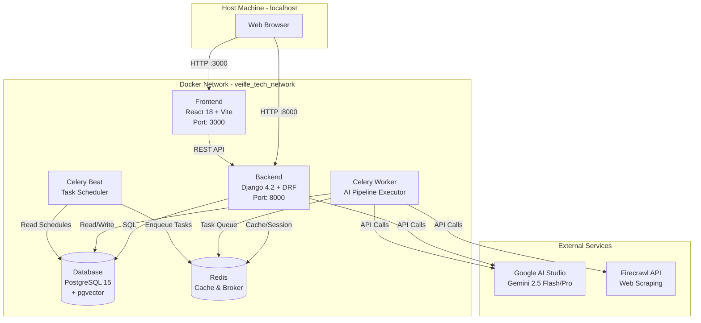
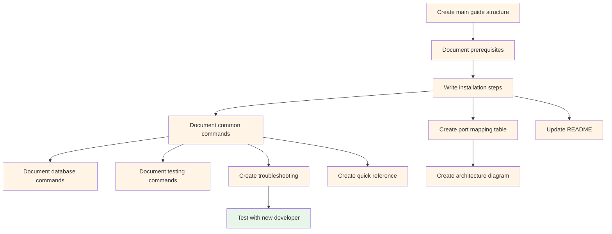

# US-12: Development Workflow Documentation

**Priority**: P1
**Feature**: Local Development Environment
**Status**: To Do

## Overview

This User Story creates comprehensive documentation that enables new developers to set up and use the local development environment within 30 minutes. The documentation covers prerequisites, installation steps, common commands, troubleshooting, and architecture overview.

### Context

Good documentation is critical for reducing onboarding time, preventing common mistakes, and serving as a reference for experienced developers. This documentation is the final piece of the local development environment, synthesizing all previous User Stories (US-1 through US-11) into a cohesive setup guide.

The documentation must be practical and actionable, with step-by-step instructions that assume minimal prior knowledge of Docker, Django, or React. Visual aids like architecture diagrams and port mapping tables help developers quickly understand the system structure.

### Decomposition Approach

- **Total tasks**: 12
- **Infrastructure/Documentation**: 12 tasks (all documentation and validation)
- **No backend or frontend code** (documentation only)

---

## Task Summary

| ID | Title | Type | Specialty | Effort | Dependencies | Status |
|----|-------|------|-----------|--------|--------------|--------|
| TASK-12.1 | Create main setup guide structure | Infrastructure | Documentation | 1h | None | ⬜ |
| TASK-12.2 | Document prerequisites and system requirements | Infrastructure | Documentation | 1h | TASK-12.1 | ⬜ |
| TASK-12.3 | Write step-by-step installation instructions | Infrastructure | Documentation | 2h | TASK-12.2 | ⬜ |
| TASK-12.4 | Create port mapping and service access table | Infrastructure | Documentation | 1h | TASK-12.3 | ⬜ |
| TASK-12.5 | Document common Docker Compose commands | Infrastructure | Documentation | 2h | TASK-12.3 | ⬜ |
| TASK-12.6 | Document database management commands | Infrastructure | Documentation | 1h | TASK-12.5 | ⬜ |
| TASK-12.7 | Document testing commands | Infrastructure | Documentation | 1h | TASK-12.5 | ⬜ |
| TASK-12.8 | Create troubleshooting section | Infrastructure | Documentation | 2h | TASK-12.5 | ⬜ |
| TASK-12.9 | Create architecture diagram | Infrastructure | Documentation | 2h | TASK-12.4 | ⬜ |
| TASK-12.10 | Update README.md with setup guide link | Infrastructure | Documentation | 1h | TASK-12.3 | ⬜ |
| TASK-12.11 | Create quick reference command cheatsheet | Infrastructure | Documentation | 1h | TASK-12.5 | ⬜ |
| TASK-12.12 | Test documentation with new developer | Testing | Integration | 2h | TASK-12.8 | ⬜ |

---

## Task Details

### ⚙️ Infrastructure/Documentation Tasks

#### TASK-12.1: Create main setup guide structure

**Type**: Infrastructure - Documentation
**Priority**: P1
**Estimated Effort**: 1 hour

##### Description

Create the main setup guide file at `docs/setup/00_setup_local_docker.md` with a comprehensive table of contents and section structure. This establishes the foundation for all subsequent documentation tasks and ensures logical organization.

##### Files Impacted
- `docs/setup/00_setup_local_docker.md` (new - main setup guide)
- `docs/setup/` directory (new - if doesn't exist)

##### Acceptance Criteria
- [ ] File created at `docs/setup/00_setup_local_docker.md`
- [ ] Table of contents with all major sections listed
- [ ] Markdown heading structure (H1, H2, H3) defined
- [ ] Placeholder sections for all content areas
- [ ] File renders correctly in GitHub/GitLab markdown viewer

##### Dependencies
- None

##### Implementation Notes

**Create directory structure**:
```bash
mkdir -p docs/setup
```

**Initial file structure**:
```markdown
# Local Development Environment Setup Guide

**Version**: 1.0
**Last Updated**: 2025-01-27
**Target Audience**: New developers with basic Docker knowledge

## Table of Contents

1. [Overview](#overview)
2. [Prerequisites](#prerequisites)
3. [System Requirements](#system-requirements)
4. [Installation Steps](#installation-steps)
5. [Service Access](#service-access)
6. [Common Commands](#common-commands)
   - [Service Management](#service-management)
   - [Logs](#logs)
   - [Database Management](#database-management)
   - [Testing](#testing)
   - [Development Tools](#development-tools)
7. [Troubleshooting](#troubleshooting)
8. [Architecture Overview](#architecture-overview)
9. [Next Steps](#next-steps)

---

## Overview

[To be completed in TASK-12.2]

## Prerequisites

[To be completed in TASK-12.2]

## System Requirements

[To be completed in TASK-12.2]

## Installation Steps

[To be completed in TASK-12.3]

## Service Access

[To be completed in TASK-12.4]

## Common Commands

[To be completed in TASK-12.5]

## Troubleshooting

[To be completed in TASK-12.8]

## Architecture Overview

[To be completed in TASK-12.9]

## Next Steps

[To be completed]
```

**Validation**:
- Preview file in markdown viewer
- Ensure all links in table of contents work (anchor links)
- Check heading hierarchy is consistent

---

#### TASK-12.2: Document prerequisites and system requirements

**Type**: Infrastructure - Documentation
**Priority**: P1
**Estimated Effort**: 1 hour

##### Description

Document all prerequisites (Git, Docker Desktop, API keys) and system requirements (hardware, OS compatibility) needed to run the local development environment. Include download links and version requirements to ensure developers have everything needed before starting.

##### Files Impacted
- `docs/setup/00_setup_local_docker.md` (modified - add prerequisites section)

##### Acceptance Criteria
- [ ] Prerequisites section lists Git, Docker Desktop/Engine, API keys
- [ ] Download links provided for all software
- [ ] Minimum and recommended system requirements documented
- [ ] OS-specific notes included (Windows WSL2, macOS, Linux)
- [ ] API key registration links provided (Google AI Studio, Firecrawl)
- [ ] Version requirements specified (Docker 4.25+, Node 20, Python 3.13)

##### Dependencies
- TASK-12.1 (file structure must exist)

##### Implementation Notes

**Prerequisites section content**:
```markdown
## Prerequisites

Before setting up the local development environment, ensure you have the following installed:

### Required Software

1. **Git** (version control)
   - **Purpose**: Clone repository and manage code changes
   - **Download**: https://git-scm.com/downloads
   - **Minimum Version**: 2.30+
   - **Verification**: `git --version`

2. **Docker Desktop** (Windows/macOS) or **Docker Engine** (Linux)
   - **Purpose**: Run all services in containers
   - **Windows/macOS**: Docker Desktop 4.25+ with Docker Compose v2
     - Download: https://www.docker.com/products/docker-desktop
     - **Windows**: Requires WSL2 backend (not Hyper-V)
   - **Linux**: Docker Engine 24.0+ and Docker Compose v2
     - Installation: https://docs.docker.com/engine/install/
   - **Verification**:
     ```bash
     docker --version
     docker-compose --version
     ```

3. **API Keys** (required for AI functionality)
   - **Google AI Studio API Key**
     - Register: https://ai.google.dev/
     - Used for: Gemini 2.5 Flash/Pro models, embeddings
   - **Firecrawl API Key**
     - Register: https://firecrawl.dev/
     - Used for: Web scraping functionality

## System Requirements

### Minimum Requirements
- **RAM**: 8GB
- **CPU**: 4 cores
- **Disk Space**: 10GB free
- **OS**: Windows 10/11, macOS 12+, Ubuntu 20.04+

### Recommended Requirements
- **RAM**: 16GB (for smooth development experience)
- **CPU**: 8 cores (faster builds and hot reload)
- **Disk Space**: 20GB free
- **Storage**: SSD (improves Docker volume performance)

### Platform-Specific Notes

**Windows**:
- Must use WSL2 backend for Docker Desktop (not Hyper-V)
- Enable WSL2: https://docs.microsoft.com/en-us/windows/wsl/install
- Git should use LF line endings: `git config --global core.autocrlf input`

**macOS**:
- Docker Desktop 4.0+ recommended for improved file sharing (gRPC FUSE)
- Apple Silicon (M1/M2) fully supported

**Linux**:
- Native Docker Engine provides best performance
- Add user to docker group: `sudo usermod -aG docker $USER`
- Restart terminal after adding to docker group
```

**Validation**:
- Verify all links are valid and accessible
- Check version numbers match actual project requirements
- Test commands on each platform if possible

---

#### TASK-12.3: Write step-by-step installation instructions

**Type**: Infrastructure - Documentation
**Priority**: P1
**Estimated Effort**: 2 hours

##### Description

Write comprehensive step-by-step installation instructions that guide developers from cloning the repository to having a fully functional local environment. Include commands, expected outputs, and explanations for each step.

##### Files Impacted
- `docs/setup/00_setup_local_docker.md` (modified - add installation steps section)

##### Acceptance Criteria
- [ ] Each step numbered and clearly explained
- [ ] Commands provided with copy-paste code blocks
- [ ] Expected output documented for validation
- [ ] Environment file configuration instructions included
- [ ] Migration and superuser creation steps documented
- [ ] Verification step confirms all services running
- [ ] Estimated time to complete documented (< 30 minutes)

##### Dependencies
- TASK-12.2 (prerequisites must be documented first)

##### Implementation Notes

**Installation Steps section content**:
```markdown
## Installation Steps

Follow these steps to set up your local development environment. Total time: approximately 20-30 minutes.

### Step 1: Clone the Repository

```bash
git clone https://github.com/[ORGANIZATION]/[REPOSITORY].git
cd [REPOSITORY]
```

**Expected**: Repository cloned successfully to your local machine.

---

### Step 2: Configure Environment Files

Copy the example environment files and add your API keys:

```bash
# Copy backend environment file
cp .env.backend.example .env.backend

# Copy frontend environment file
cp .env.frontend.example .env.frontend
```

**Edit `.env.backend`** and add your API keys:
```bash
# Open with your preferred editor
nano .env.backend  # or vim, code, etc.
```

**Required variables**:
```env
# AI API Keys (REQUIRED)
GOOGLE_AI_API_KEY=your-google-ai-key-here
FIRECRAWL_API_KEY=your-firecrawl-key-here

# Database Configuration (defaults work for local dev)
DATABASE_URL=postgres://postgres:postgres@db:5432/postgres

# Django Configuration
SECRET_KEY=your-secret-key-here  # Generate with: python -c "import secrets; print(secrets.token_urlsafe(50))"
DEBUG=True
ALLOWED_HOSTS=localhost,127.0.0.1,backend
```

**Expected**: Both `.env.backend` and `.env.frontend` files exist with your configuration.

---

### Step 3: Build Docker Images

Build all Docker images for the services:

```bash
docker-compose build
```

**Expected output**:
```
[+] Building ...
 => [backend] ...
 => [frontend] ...
 => [db] ...
 => [redis] ...
```

**Duration**: 5-10 minutes (first time, depending on internet speed)

---

### Step 4: Start All Services

Start all services in detached mode:

```bash
docker-compose up -d
```

**Expected output**:
```
[+] Running 7/7
 ✔ Network veille_tech_network       Created
 ✔ Container veille_tech_db           Started
 ✔ Container veille_tech_redis        Started
 ✔ Container veille_tech_backend      Started
 ✔ Container veille_tech_frontend     Started
 ✔ Container veille_tech_worker       Started
 ✔ Container veille_tech_scheduler    Started
```

---

### Step 5: Apply Database Migrations

Apply Django migrations to set up the database schema:

```bash
docker-compose exec backend python manage.py migrate
```

**Expected output**:
```
Operations to perform:
  Apply all migrations: admin, auth, contenttypes, sessions, django_celery_beat, ...
Running migrations:
  Applying contenttypes.0001_initial... OK
  Applying auth.0001_initial... OK
  ...
```

---

### Step 6: Create Superuser Account

Create an admin account to access Django Admin:

```bash
docker-compose exec backend python manage.py createsuperuser
```

**Interactive prompts**:
```
Username: admin
Email address: admin@example.com
Password: ********** (minimum 8 characters)
Password (again): **********
Superuser created successfully.
```

**Tip**: For local development, you can use simple credentials like `admin`/`admin12345`.

---

### Step 7: Verify All Services Running

Check that all services are running and healthy:

```bash
docker-compose ps
```

**Expected output**:
```
NAME                     STATUS     PORTS
veille_tech_backend      Up         0.0.0.0:8000->8000/tcp
veille_tech_db           Up (healthy) 5432/tcp
veille_tech_frontend     Up         0.0.0.0:3000->3000/tcp
veille_tech_redis        Up (healthy) 6379/tcp
veille_tech_scheduler    Up
veille_tech_worker       Up
```

All services should show "Up" or "Up (healthy)" status.

---

### Step 8: Access the Application

Open your browser and verify access to each service:

1. **Frontend**: http://localhost:3000
   - Should display the React application
2. **Django Admin**: http://localhost:8000/admin/
   - Login with superuser credentials created in Step 6
3. **Backend API**: http://localhost:8000/api/
   - Should show API root or documentation

---

## Setup Complete!

🎉 **Congratulations!** Your local development environment is now running.

**Next steps**:
- Explore the [Common Commands](#common-commands) section
- Read the [Architecture Overview](#architecture-overview)
- Start developing!
```

**Validation**:
- Follow steps on clean machine to verify completeness
- Time the setup process to ensure < 30 minutes
- Test all verification commands

---

#### TASK-12.4: Create port mapping and service access table

**Type**: Infrastructure - Documentation
**Priority**: P1
**Estimated Effort**: 1 hour

##### Description

Create comprehensive tables documenting port mappings and service access URLs. This helps developers quickly find how to access each service and understand the network architecture.

##### Files Impacted
- `docs/setup/00_setup_local_docker.md` (modified - add service access section)

##### Acceptance Criteria
- [ ] Service access table with all 7 services documented
- [ ] Port mappings clearly listed (external:internal format)
- [ ] URLs provided for web-accessible services
- [ ] Internal-only services clearly marked (db, redis)
- [ ] Purpose/description for each service included
- [ ] Table formatted for readability in markdown

##### Dependencies
- TASK-12.3 (installation steps must be complete)

##### Implementation Notes

**Service Access section content**:
```markdown
## Service Access

After starting the environment, the following services are accessible:

### Service URLs

| Service | URL | Description | Port Mapping |
|---------|-----|-------------|--------------|
| **Frontend** | http://localhost:3000 | React SPA application | 3000:3000 |
| **Backend API** | http://localhost:8000/api/ | Django REST API endpoints | 8000:8000 |
| **Django Admin** | http://localhost:8000/admin/ | Admin interface & FinOps dashboard | 8000:8000 |
| **Database** | `localhost:5432` | PostgreSQL 15 with pgvector (internal only) | Not exposed |
| **Redis** | `localhost:6379` | Cache & Celery broker (internal only) | Not exposed |
| **Celery Worker** | N/A | Background task processor | No ports |
| **Celery Beat** | N/A | Task scheduler | No ports |

### Service Details

#### Frontend (React SPA)
- **URL**: http://localhost:3000
- **Technology**: React 18, Vite development server
- **Hot Module Replacement**: Enabled (changes reflect immediately)
- **Build Output**: `/frontend/dist` (when built for production)

#### Backend API (Django)
- **URL**: http://localhost:8000/api/
- **Technology**: Django 4.2+, Django REST Framework
- **API Documentation**: http://localhost:8000/api/docs/ (if DRF browsable API enabled)
- **Hot Reload**: Enabled with Django's runserver

#### Django Admin
- **URL**: http://localhost:8000/admin/
- **Credentials**: Use superuser created in Step 6 of installation
- **Features**:
  - User and group management
  - django-celery-beat schedule management
  - FinOps cost tracking dashboard (Bloc 6)
  - Model data inspection and editing

#### Database (PostgreSQL)
- **Host**: `localhost` or `db` (from within Docker network)
- **Port**: 5432 (internal only, not exposed to host)
- **Username**: `postgres` (default, configurable in `.env.backend`)
- **Password**: `postgres` (default, configurable in `.env.backend`)
- **Database Name**: `postgres`
- **Extensions**: pgvector (for vector embeddings)
- **Access**: Via Django ORM or `docker-compose exec backend python manage.py dbshell`

#### Redis
- **Host**: `localhost` or `redis` (from within Docker network)
- **Port**: 6379 (internal only, not exposed to host)
- **Purpose**: Celery broker and cache backend
- **Access**: Via `docker-compose exec redis redis-cli`

#### Celery Worker
- **Purpose**: Executes asynchronous tasks (AI pipeline, scraping, etc.)
- **Technology**: Celery 5+
- **Concurrency**: Configurable via `CELERY_WORKER_CONCURRENCY` in `.env.backend`
- **Monitoring**: Logs via `docker-compose logs worker`

#### Celery Beat Scheduler
- **Purpose**: Dispatches recurring tasks on schedule (daily scraping at 2 AM)
- **Technology**: Celery Beat with django-celery-beat (database-backed)
- **Schedule Management**: Via Django Admin → Periodic Tasks
- **Monitoring**: Logs via `docker-compose logs scheduler`

### Network Architecture

```
External Access
    ↓
┌────────────────────────────────────────────────────────────┐
│  Host Machine (localhost)                                  │
│                                                            │
│  Port 3000 ──→ Frontend Container                         │
│  Port 8000 ──→ Backend Container                          │
│                                                            │
└────────────────────────────────────────────────────────────┘
                         ↓
┌────────────────────────────────────────────────────────────┐
│  Docker Network (veille_tech_network)                      │
│                                                            │
│  ┌──────────┐   ┌──────────┐   ┌─────────┐              │
│  │ Frontend │──→│ Backend  │──→│   DB    │              │
│  │  (3000)  │   │  (8000)  │   │ (5432)  │              │
│  └──────────┘   └──────────┘   └─────────┘              │
│                      ↓ ↓                                   │
│                      ↓ └──────→ ┌─────────┐              │
│                      ↓          │  Redis  │              │
│                      ↓          │ (6379)  │              │
│                      ↓          └─────────┘              │
│                      ↓               ↑                     │
│                 ┌─────────┐         │                     │
│                 │ Worker  │─────────┘                     │
│                 └─────────┘                               │
│                      ↑                                     │
│                 ┌──────────┐                              │
│                 │Scheduler │                              │
│                 └──────────┘                              │
└────────────────────────────────────────────────────────────┘
```
```

**Validation**:
- Verify all URLs are accessible
- Confirm port mappings match docker-compose.yml
- Test internal service connections

---

#### TASK-12.5: Document common Docker Compose commands

**Type**: Infrastructure - Documentation
**Priority**: P1
**Estimated Effort**: 2 hours

##### Description

Document common Docker Compose commands for service management, viewing logs, and accessing containers. Organize commands by category with examples and explanations for each.

##### Files Impacted
- `docs/setup/00_setup_local_docker.md` (modified - add common commands section)

##### Acceptance Criteria
- [ ] Service management commands documented (up, down, restart, ps)
- [ ] Log viewing commands with filtering options
- [ ] Container access commands (exec, bash/shell)
- [ ] Build and rebuild commands
- [ ] Volume and network management commands
- [ ] Examples provided for each command
- [ ] Common use cases explained

##### Dependencies
- TASK-12.3 (installation must be documented)

##### Implementation Notes

**Common Commands section content**:
```markdown
## Common Commands

### Service Management

#### Start All Services
```bash
# Start in detached mode (background)
docker-compose up -d

# Start with logs in foreground (useful for debugging)
docker-compose up
```

#### Stop All Services
```bash
# Stop services (preserves containers)
docker-compose stop

# Stop and remove containers (preserves volumes)
docker-compose down

# Stop, remove containers AND volumes (clean slate)
docker-compose down -v
```

**Warning**: `docker-compose down -v` deletes all database data. Use cautiously.

#### Restart Services
```bash
# Restart all services
docker-compose restart

# Restart specific service
docker-compose restart backend

# Restart multiple services
docker-compose restart backend worker
```

#### View Service Status
```bash
# Show all services with status and ports
docker-compose ps

# Show only running services
docker-compose ps --services --filter "status=running"
```

---

### Logs

#### View All Logs
```bash
# View all logs (all services)
docker-compose logs

# Follow logs in real-time (like tail -f)
docker-compose logs -f

# View last 100 lines
docker-compose logs --tail=100

# View logs with timestamps
docker-compose logs -t
```

#### View Specific Service Logs
```bash
# Backend logs
docker-compose logs backend

# Frontend logs
docker-compose logs frontend

# Follow backend logs in real-time
docker-compose logs -f backend

# Multiple services
docker-compose logs backend worker scheduler
```

#### Filter Logs
```bash
# View logs from last 10 minutes
docker-compose logs --since 10m

# View logs from specific time
docker-compose logs --since 2025-01-27T10:00:00

# Search logs for specific term
docker-compose logs | grep "ERROR"
docker-compose logs backend | grep "migrate"
```

---

### Container Access

#### Execute Commands in Containers
```bash
# Django shell (Python REPL with Django ORM)
docker-compose exec backend python manage.py shell

# Database shell (psql)
docker-compose exec backend python manage.py dbshell

# Redis CLI
docker-compose exec redis redis-cli

# Bash shell in backend container
docker-compose exec backend bash

# Shell in frontend container
docker-compose exec frontend sh
```

#### One-off Commands
```bash
# Check Django version
docker-compose exec backend python -c "import django; print(django.get_version())"

# List installed Python packages
docker-compose exec backend poetry show

# List npm packages
docker-compose exec frontend npm list
```

---

### Build and Rebuild

#### Build Images
```bash
# Build all images
docker-compose build

# Build specific service
docker-compose build backend

# Build without cache (clean build)
docker-compose build --no-cache

# Build with progress output
docker-compose build --progress=plain
```

#### Rebuild and Restart
```bash
# Rebuild backend and restart
docker-compose build backend && docker-compose up -d --force-recreate backend

# Rebuild all and restart
docker-compose build && docker-compose up -d --force-recreate
```

**When to rebuild**:
- After changing `Dockerfile`
- After adding dependencies (`pyproject.toml`, `package.json`)
- After pulling code with dependency changes

---

### Volume and Network Management

#### List Volumes
```bash
# List all Docker volumes
docker volume ls

# Inspect specific volume
docker volume inspect veille_tech_postgres_data
```

#### Clean Up
```bash
# Remove stopped containers
docker-compose rm

# Remove unused images
docker image prune

# Remove unused volumes (CAUTION: deletes data)
docker volume prune

# Remove everything not currently in use
docker system prune -a --volumes
```

**Warning**: Pruning volumes will delete database data permanently.

---

### Health Checks

#### Check Service Health
```bash
# View health status
docker-compose ps

# Inspect health check details
docker inspect --format='{{json .State.Health}}' veille_tech_backend | python -m json.tool

# View health check logs
docker inspect veille_tech_db | grep -A 10 Health
```

---

### Useful Shortcuts

#### Quick Status Check
```bash
# One-line status of all services
docker-compose ps --format "table {{.Name}}\t{{.Status}}\t{{.Ports}}"
```

#### Quick Logs
```bash
# Last 20 lines of all services, follow
docker-compose logs --tail=20 -f
```

#### Quick Restart with Rebuild
```bash
# Rebuild and restart backend in one command
docker-compose up -d --build backend
```
```

**Validation**:
- Test all commands in actual environment
- Verify examples produce expected output
- Check for platform-specific command differences

---

#### TASK-12.6: Document database management commands

**Type**: Infrastructure - Documentation
**Priority**: P1
**Estimated Effort**: 1 hour

##### Description

Document Django database management commands including migrations, database shell access, and common database operations. This helps developers manage database schema changes and debug data issues.

##### Files Impacted
- `docs/setup/00_setup_local_docker.md` (modified - add database section under common commands)

##### Acceptance Criteria
- [ ] Migration commands documented (migrate, makemigrations, showmigrations)
- [ ] Database shell access documented
- [ ] Data management commands included (loaddata, dumpdata)
- [ ] Database inspection commands provided
- [ ] Examples with explanations for each command

##### Dependencies
- TASK-12.5 (common commands structure must exist)

##### Implementation Notes

**Add to Common Commands section**:
```markdown
### Database Management

#### Migrations

##### Apply Migrations
```bash
# Apply all pending migrations
docker-compose exec backend python manage.py migrate

# Apply migrations for specific app
docker-compose exec backend python manage.py migrate subjects

# Show migration plan (dry run)
docker-compose exec backend python manage.py migrate --plan
```

##### Create Migrations
```bash
# Create migrations for all apps with changes
docker-compose exec backend python manage.py makemigrations

# Create migration for specific app
docker-compose exec backend python manage.py makemigrations subjects

# Create empty migration (for data migrations)
docker-compose exec backend python manage.py makemigrations --empty subjects --name add_sample_data
```

##### View Migration Status
```bash
# Show all migrations and their status
docker-compose exec backend python manage.py showmigrations

# Show status for specific app
docker-compose exec backend python manage.py showmigrations subjects

# Show only unapplied migrations
docker-compose exec backend python manage.py showmigrations --plan | grep "\[ \]"
```

##### Roll Back Migrations
```bash
# Roll back to specific migration
docker-compose exec backend python manage.py migrate subjects 0003

# Roll back all migrations for an app
docker-compose exec backend python manage.py migrate subjects zero
```

---

#### Database Shell

##### Access PostgreSQL Shell
```bash
# Django's database shell (uses psql)
docker-compose exec backend python manage.py dbshell

# Direct psql access
docker-compose exec db psql -U postgres -d postgres
```

**Common psql commands** (once in shell):
```sql
-- List all tables
\dt

-- Describe table structure
\d auth_user

-- List all databases
\l

-- List pgvector extension
\dx pgvector

-- Exit
\q
```

---

#### Data Management

##### Export Data (Fixtures)
```bash
# Export all data to JSON
docker-compose exec backend python manage.py dumpdata > backup.json

# Export specific app
docker-compose exec backend python manage.py dumpdata subjects > subjects.json

# Export with indentation (readable)
docker-compose exec backend python manage.py dumpdata --indent=2 subjects > subjects.json

# Exclude specific models
docker-compose exec backend python manage.py dumpdata --exclude=contenttypes --exclude=auth.permission > data.json
```

##### Import Data (Fixtures)
```bash
# Load data from fixture
docker-compose exec backend python manage.py loaddata backup.json

# Load specific fixture
docker-compose exec backend python manage.py loaddata initial_data.json
```

---

#### Database Inspection

##### View Database Info
```bash
# Show database configuration
docker-compose exec backend python manage.py shell
>>> from django.conf import settings
>>> settings.DATABASES
>>> exit()
```

##### Count Records
```bash
# Django shell
docker-compose exec backend python manage.py shell

# Count users
>>> from django.contrib.auth import get_user_model
>>> User = get_user_model()
>>> User.objects.count()

# Count all objects in app
>>> from subjects.models import Subject
>>> Subject.objects.count()
```

---

#### Database Reset (Development Only)

##### Reset Database (Clean Slate)
```bash
# WARNING: This deletes ALL data

# Method 1: Drop and recreate database
docker-compose down -v  # Stop and remove volumes
docker-compose up -d db  # Start database
docker-compose exec backend python manage.py migrate  # Recreate schema

# Method 2: Flush database (keeps schema)
docker-compose exec backend python manage.py flush
```

**Warning**: These commands delete all data permanently. Only use in development.

---

#### Performance and Maintenance

##### Database Statistics
```bash
# Via psql
docker-compose exec db psql -U postgres -d postgres -c "
  SELECT schemaname, tablename, n_tup_ins as inserts, n_tup_upd as updates, n_tup_del as deletes
  FROM pg_stat_user_tables
  ORDER BY n_tup_ins DESC;
"
```

##### Database Size
```bash
docker-compose exec db psql -U postgres -d postgres -c "
  SELECT pg_database.datname, pg_size_pretty(pg_database_size(pg_database.datname)) AS size
  FROM pg_database
  ORDER BY pg_database_size(pg_database.datname) DESC;
"
```
```

**Validation**:
- Test migration commands
- Verify database shell access works
- Check data export/import functionality

---

#### TASK-12.7: Document testing commands

**Type**: Infrastructure - Documentation
**Priority**: P1
**Estimated Effort**: 1 hour

##### Description

Document commands for running tests on both backend (pytest) and frontend (npm test). Include examples for running specific tests, test coverage, and test configuration.

##### Files Impacted
- `docs/setup/00_setup_local_docker.md` (modified - add testing section under common commands)

##### Acceptance Criteria
- [ ] Backend test commands documented (pytest)
- [ ] Frontend test commands documented (npm test)
- [ ] Test filtering and selection examples provided
- [ ] Coverage commands included
- [ ] Linting and code quality commands documented
- [ ] Examples for common testing scenarios

##### Dependencies
- TASK-12.5 (common commands structure must exist)

##### Implementation Notes

**Add to Common Commands section**:
```markdown
### Testing

#### Backend Tests (pytest)

##### Run All Tests
```bash
# Run all backend tests
docker-compose exec backend pytest

# Run with verbose output
docker-compose exec backend pytest -v

# Run with output (show print statements)
docker-compose exec backend pytest -s
```

##### Run Specific Tests
```bash
# Run tests in specific file
docker-compose exec backend pytest backend/tests/test_subjects.py

# Run specific test class
docker-compose exec backend pytest backend/tests/test_subjects.py::TestSubjectModel

# Run specific test function
docker-compose exec backend pytest backend/tests/test_subjects.py::TestSubjectModel::test_create_subject

# Run tests matching pattern
docker-compose exec backend pytest -k "subject"
docker-compose exec backend pytest -k "test_create"
```

##### Run Tests by Category
```bash
# Run only unit tests
docker-compose exec backend pytest backend/tests/unit/

# Run only integration tests
docker-compose exec backend pytest backend/tests/integration/

# Run tests with specific marker
docker-compose exec backend pytest -m "slow"
docker-compose exec backend pytest -m "not slow"  # Skip slow tests
```

##### Test Coverage
```bash
# Run tests with coverage report
docker-compose exec backend pytest --cov=backend --cov-report=html

# View coverage report
# Open backend/htmlcov/index.html in browser

# Coverage with terminal output
docker-compose exec backend pytest --cov=backend --cov-report=term

# Coverage for specific module
docker-compose exec backend pytest --cov=subjects --cov-report=term
```

---

#### Frontend Tests (npm)

##### Run All Tests
```bash
# Run all frontend tests
docker-compose exec frontend npm test

# Run tests in watch mode (re-run on file changes)
docker-compose exec frontend npm run test:watch

# Run tests once (CI mode)
docker-compose exec frontend npm run test:ci
```

##### Run Specific Tests
```bash
# Run tests matching pattern
docker-compose exec frontend npm test -- --testNamePattern="Button"

# Run tests in specific file
docker-compose exec frontend npm test -- src/components/Button.test.tsx
```

##### Test Coverage
```bash
# Run tests with coverage
docker-compose exec frontend npm run test:coverage

# Coverage report location: frontend/coverage/
```

##### End-to-End Tests (if configured)
```bash
# Run E2E tests (Playwright or Cypress)
docker-compose exec frontend npm run test:e2e

# Run E2E in headed mode (with browser UI)
docker-compose exec frontend npm run test:e2e:headed
```

---

#### Linting and Code Quality

##### Backend Linting
```bash
# Run Black (code formatter)
docker-compose exec backend black .

# Check formatting without changes
docker-compose exec backend black --check .

# Run Flake8 (linter)
docker-compose exec backend flake8 backend/

# Run isort (import sorting)
docker-compose exec backend isort .

# Run mypy (type checking, if configured)
docker-compose exec backend mypy backend/
```

##### Frontend Linting
```bash
# Run ESLint
docker-compose exec frontend npm run lint

# Fix auto-fixable issues
docker-compose exec frontend npm run lint:fix

# Run Prettier (formatter)
docker-compose exec frontend npm run format

# Type check (TypeScript)
docker-compose exec frontend npm run type-check
```

---

#### Continuous Integration Simulation

##### Run Full CI Check Locally
```bash
# Backend CI checks
docker-compose exec backend sh -c "
  black --check . &&
  flake8 backend/ &&
  pytest --cov=backend --cov-report=term
"

# Frontend CI checks
docker-compose exec frontend sh -c "
  npm run lint &&
  npm run type-check &&
  npm run test:ci &&
  npm run build
"
```

---

#### Test Data Management

##### Create Test Data
```bash
# Django shell to create test data
docker-compose exec backend python manage.py shell

>>> from subjects.models import Subject
>>> Subject.objects.create(name="Test Subject", description="For testing")
```

##### Load Test Fixtures
```bash
# Load test data from fixtures
docker-compose exec backend python manage.py loaddata test_data.json
```

##### Reset Test Database
```bash
# Flush database and reload fixtures
docker-compose exec backend python manage.py flush --no-input
docker-compose exec backend python manage.py loaddata initial_data.json
```
```

**Validation**:
- Run test commands to verify they work
- Check coverage reports generate correctly
- Verify linting commands execute

---

#### TASK-12.8: Create troubleshooting section

**Type**: Infrastructure - Documentation
**Priority**: P1
**Estimated Effort**: 2 hours

##### Description

Create comprehensive troubleshooting section addressing common issues developers encounter during setup and development. Include error messages, causes, and step-by-step solutions for each issue.

##### Files Impacted
- `docs/setup/00_setup_local_docker.md` (modified - add troubleshooting section)

##### Acceptance Criteria
- [ ] At least 10 common issues documented
- [ ] Each issue includes: symptom, cause, solution
- [ ] Platform-specific issues covered (Windows, macOS, Linux)
- [ ] Docker-related issues addressed
- [ ] Database and migration issues covered
- [ ] API key and configuration errors included
- [ ] Solutions tested and verified

##### Dependencies
- TASK-12.5 (common commands must be documented for reference in solutions)

##### Implementation Notes

**Troubleshooting section content**:
```markdown
## Troubleshooting

### Docker and Service Issues

#### Issue: Port Already in Use

**Symptom**:
```
Error starting userland proxy: listen tcp 0.0.0.0:8000: bind: address already in use
```

**Cause**: Another service (or previous Docker container) is using port 8000 or 3000.

**Solutions**:

1. **Find and stop the conflicting process**:
   ```bash
   # Windows
   netstat -ano | findstr :8000
   taskkill /PID <PID> /F

   # macOS/Linux
   lsof -ti:8000 | xargs kill -9
   ```

2. **Change port mapping** in `docker-compose.yml`:
   ```yaml
   backend:
     ports:
       - "8001:8000"  # Change external port to 8001
   ```

3. **Stop all Docker containers**:
   ```bash
   docker-compose down
   docker stop $(docker ps -aq)
   ```

---

#### Issue: Container Keeps Restarting

**Symptom**:
```
docker-compose ps shows "Restarting" status
```

**Cause**: Service is crashing on startup due to configuration error or missing dependency.

**Solutions**:

1. **Check logs for error**:
   ```bash
   docker-compose logs backend
   ```

2. **Common causes**:
   - Missing `.env.backend` file → Create from `.env.backend.example`
   - Database not ready → Wait for `db` health check
   - Syntax error in code → Check recent changes

3. **Restart with fresh state**:
   ```bash
   docker-compose down
   docker-compose up -d
   ```

---

#### Issue: Docker Desktop Not Starting (Windows)

**Symptom**: Docker Desktop fails to start or shows "Docker Engine stopped"

**Cause**: WSL2 not enabled or outdated.

**Solutions**:

1. **Enable WSL2**:
   ```powershell
   # Run in PowerShell as Administrator
   wsl --install
   wsl --set-default-version 2
   ```

2. **Update WSL2 kernel**:
   ```powershell
   wsl --update
   ```

3. **Restart Docker Desktop** after enabling WSL2.

4. **Switch Docker Desktop to WSL2 backend**:
   - Settings → General → Use the WSL 2 based engine ✓

---

### Database Issues

#### Issue: Database Connection Refused

**Symptom**:
```
OperationalError: could not connect to server: Connection refused
```

**Cause**: Database service not running or not healthy.

**Solutions**:

1. **Check database status**:
   ```bash
   docker-compose ps db
   ```

2. **View database logs**:
   ```bash
   docker-compose logs db
   ```

3. **Restart database**:
   ```bash
   docker-compose restart db
   ```

4. **Wait for health check**:
   ```bash
   # Database needs ~10 seconds to become healthy
   docker-compose up -d db
   sleep 10
   docker-compose ps db  # Should show "Up (healthy)"
   ```

---

#### Issue: Migrations Not Applied

**Symptom**:
```
django.db.utils.OperationalError: no such table: auth_user
```

**Cause**: Database migrations have not been run.

**Solution**:
```bash
# Apply migrations
docker-compose exec backend python manage.py migrate

# If that fails, check database is running
docker-compose ps db
```

---

#### Issue: pgvector Extension Not Found

**Symptom**:
```
django.db.utils.OperationalError: extension "vector" does not exist
```

**Cause**: pgvector extension not enabled in PostgreSQL.

**Solution**:
```bash
# Enable pgvector extension
docker-compose exec db psql -U postgres -d postgres -c "CREATE EXTENSION IF NOT EXISTS vector;"

# Verify extension installed
docker-compose exec db psql -U postgres -d postgres -c "\dx"
```

---

### Configuration Issues

#### Issue: API Key Not Found

**Symptom**:
```
KeyError: 'GOOGLE_AI_API_KEY'
or
ImproperlyConfigured: GOOGLE_AI_API_KEY not found
```

**Cause**: `.env.backend` file missing or API key not set.

**Solutions**:

1. **Check `.env.backend` exists**:
   ```bash
   ls -la .env.backend
   ```

2. **If missing, create from example**:
   ```bash
   cp .env.backend.example .env.backend
   ```

3. **Add API key** to `.env.backend`:
   ```env
   GOOGLE_AI_API_KEY=your-actual-key-here
   ```

4. **Restart backend**:
   ```bash
   docker-compose restart backend
   ```

---

#### Issue: DEBUG Mode Not Working

**Symptom**: Changes to code not reflected in running application.

**Cause**: Hot reload not working due to volume mount issues.

**Solutions**:

1. **Check volume mounts** in `docker-compose.yml`:
   ```yaml
   backend:
     volumes:
       - ./backend:/app  # Should be present
   ```

2. **Restart service**:
   ```bash
   docker-compose restart backend
   ```

3. **Windows**: Enable file watching in Docker Desktop:
   - Settings → Resources → File Sharing → Add project directory

---

### Hot Reload Issues

#### Issue: Frontend Changes Not Reflected

**Symptom**: Code changes in React not showing in browser.

**Cause**: Vite HMR (Hot Module Replacement) not working.

**Solutions**:

1. **Check Vite config** has `server.watch` configured:
   ```javascript
   // frontend/vite.config.js
   export default {
     server: {
       host: '0.0.0.0',
       port: 3000,
       watch: {
         usePolling: true,  # Required for Docker
       }
     }
   }
   ```

2. **Set environment variable** in `docker-compose.yml`:
   ```yaml
   frontend:
     environment:
       - CHOKIDAR_USEPOLLING=true
   ```

3. **Restart frontend**:
   ```bash
   docker-compose restart frontend
   ```

---

### Build Issues

#### Issue: Docker Build Fails - "No Space Left on Device"

**Symptom**:
```
error: no space left on device
```

**Cause**: Docker disk space full.

**Solutions**:

1. **Clean up Docker resources**:
   ```bash
   docker system prune -a
   ```

2. **Remove unused volumes**:
   ```bash
   docker volume prune
   ```

3. **Increase Docker Desktop disk limit**:
   - Settings → Resources → Disk image size → Increase limit

---

#### Issue: Poetry Install Fails in Docker Build

**Symptom**:
```
ERROR: Could not find a version that satisfies the requirement ...
```

**Cause**: Dependency conflict or network issue during build.

**Solutions**:

1. **Build without cache**:
   ```bash
   docker-compose build --no-cache backend
   ```

2. **Check `pyproject.toml` for version conflicts**:
   ```bash
   cat backend/pyproject.toml
   ```

3. **Update Poetry lock file**:
   ```bash
   docker-compose exec backend poetry lock --no-update
   docker-compose build backend
   ```

---

### Platform-Specific Issues

#### Windows: Git Line Ending Issues

**Symptom**: Scripts fail with `\r: command not found`

**Cause**: Windows CRLF line endings instead of Unix LF.

**Solution**:
```bash
# Configure Git to use LF
git config --global core.autocrlf input

# Re-clone repository or convert files
git rm --cached -r .
git reset --hard
```

---

#### macOS: Slow File Performance

**Symptom**: Docker containers very slow, especially on file operations.

**Cause**: osxfs file sharing performance.

**Solutions**:

1. **Use Docker Desktop 4.0+** (gRPC FUSE improves performance)

2. **Enable VirtioFS** (if available):
   - Settings → Experimental Features → Use VirtioFS

3. **Reduce file watching** by excluding unnecessary directories:
   ```yaml
   backend:
     volumes:
       - ./backend:/app
       - /app/node_modules  # Don't sync node_modules
   ```

---

#### Linux: Permission Denied Errors

**Symptom**:
```
Permission denied: '/app/...'
```

**Cause**: File ownership mismatch between host and container.

**Solution**:

1. **Add user to docker group**:
   ```bash
   sudo usermod -aG docker $USER
   newgrp docker
   ```

2. **Fix file ownership**:
   ```bash
   sudo chown -R $USER:$USER .
   ```

---

### Getting Help

If you encounter an issue not covered here:

1. **Check service logs**:
   ```bash
   docker-compose logs [service]
   ```

2. **Search error message** in project issues: [GitHub Issues Link]

3. **Ask for help** in team Slack channel: #dev-support

4. **Create an issue** with:
   - Error message
   - Steps to reproduce
   - `docker-compose ps` output
   - Relevant logs
```

**Validation**:
- Test solutions for each issue
- Verify commands produce expected results
- Update based on actual encountered issues

---

#### TASK-12.9: Create architecture diagram

**Type**: Infrastructure - Documentation
**Priority**: P1
**Estimated Effort**: 2 hours

##### Description

Create visual architecture diagram showing all 7 services, their relationships, data flow, port mappings, and external integrations. Use Mermaid diagram syntax for version-controlled diagrams or create image file.

##### Files Impacted
- `docs/setup/00_setup_local_docker.md` (modified - add architecture section)
- `docs/images/architecture.png` (optional - if using image instead of Mermaid)

##### Acceptance Criteria
- [ ] Diagram shows all 7 services (db, redis, backend, frontend, worker, scheduler)
- [ ] Data flow arrows clearly indicate communication patterns
- [ ] Port numbers labeled on services
- [ ] External integrations shown (Google AI, Firecrawl)
- [ ] Docker network boundary clearly marked
- [ ] Diagram renders correctly in markdown viewers

##### Dependencies
- TASK-12.4 (service access information needed for diagram)

##### Implementation Notes

**Architecture section content**:
```markdown
## Architecture Overview

### System Architecture

The local development environment consists of 7 Docker containers orchestrated by Docker Compose, running within an isolated Docker network.

#### High-Level Architecture



---

### Service Details

#### 1. Frontend (React SPA)
- **Technology**: React 18, Vite, TypeScript (optional)
- **Port**: 3000 (host) → 3000 (container)
- **Purpose**: User interface for the technology watch platform
- **Dependencies**: Backend API for data
- **Hot Reload**: Enabled via Vite HMR
- **Data Flow**: User interactions → API requests to Backend

#### 2. Backend (Django API)
- **Technology**: Django 4.2, Django REST Framework, Python 3.13
- **Port**: 8000 (host) → 8000 (container)
- **Purpose**: REST API, business logic, Django Admin interface
- **Dependencies**: PostgreSQL (data), Redis (cache), AI APIs (inference)
- **Hot Reload**: Enabled via Django runserver
- **Data Flow**:
  - Receives API requests from Frontend
  - Queries Database for persistence
  - Calls AI APIs for content generation
  - Caches frequently accessed data in Redis

#### 3. Database (PostgreSQL + pgvector)
- **Technology**: PostgreSQL 15 with pgvector extension
- **Port**: 5432 (internal only, not exposed to host)
- **Purpose**: Persistent data storage, vector embeddings
- **Dependencies**: None (base infrastructure)
- **Data Flow**:
  - Receives SQL queries from Backend
  - Stores user data, subjects, reports, embeddings
  - Provides ACID guarantees for transactions

#### 4. Redis
- **Technology**: Redis 7+
- **Port**: 6379 (internal only, not exposed to host)
- **Purpose**: Celery broker, cache backend, session storage
- **Dependencies**: None (base infrastructure)
- **Data Flow**:
  - Stores task queue messages from Scheduler
  - Delivers tasks to Worker
  - Caches Django session data and query results

#### 5. Celery Worker
- **Technology**: Celery 5, Python 3.13
- **Port**: None (background processor)
- **Purpose**: Execute async tasks (AI pipeline, scraping, synthesis)
- **Dependencies**: Redis (broker), Database (persistence), AI APIs
- **Data Flow**:
  - Receives task messages from Redis queue
  - Executes Langgraph AI agent workflows
  - Calls Google AI API for LLM inference
  - Calls Firecrawl API for web scraping
  - Stores results in Database

#### 6. Celery Beat Scheduler
- **Technology**: Celery Beat, django-celery-beat
- **Port**: None (scheduler only, no task execution)
- **Purpose**: Dispatch recurring tasks (daily scraping at 2 AM)
- **Dependencies**: Redis (broker), Database (schedule storage)
- **Data Flow**:
  - Reads schedules from Database (django_celery_beat tables)
  - Enqueues tasks to Redis at scheduled times
  - Worker picks up and executes tasks

---

### Data Flow Scenarios

#### Scenario 1: User Views Technology Report
```
1. User opens http://localhost:3000 in browser
2. Frontend (React) loads
3. Frontend sends GET /api/reports/ to Backend
4. Backend queries Database for reports
5. Backend checks Redis cache first (cache hit/miss)
6. Backend returns JSON response to Frontend
7. Frontend renders report data
```

#### Scenario 2: Scheduled Daily Scraping
```
1. Scheduler checks Database for schedules every 5 seconds
2. At 2 AM, Scheduler finds "Daily Scraping" task
3. Scheduler enqueues task to Redis: daily_scraping_task
4. Worker receives task from Redis queue
5. Worker executes Langgraph AI pipeline:
   a. Calls Firecrawl API to scrape technology news
   b. Calls Google AI (Gemini Flash) for relevance analysis
   c. Calls Google AI (Gemini Pro) for synthesis
   d. Generates vector embeddings (text-embedding-004)
6. Worker stores report and embeddings in Database
7. Task marked complete in Redis
```

#### Scenario 3: Admin Configures New Schedule
```
1. Admin opens http://localhost:8000/admin/
2. Admin logs in with superuser credentials
3. Admin navigates to "Periodic Tasks"
4. Admin creates new crontab schedule: 0 3 * * * (3 AM daily)
5. Admin creates periodic task linking to celery task
6. Changes saved to Database (django_celery_beat_periodictask table)
7. Scheduler detects schedule change within 5 seconds
8. At 3 AM, Scheduler enqueues task to Redis
9. Worker executes task
```

---

### Docker Network Architecture

```
┌─────────────────────────────────────────────────────────────┐
│  Host Machine (Windows/macOS/Linux)                         │
│                                                              │
│  Browser                                                     │
│    │                                                         │
│    ├─→ http://localhost:3000 ──→ Frontend Container         │
│    └─→ http://localhost:8000 ──→ Backend Container          │
│                                                              │
└─────────────────────────────────────────────────────────────┘
                         ↓
┌─────────────────────────────────────────────────────────────┐
│  Docker Network: veille_tech_network                        │
│                                                              │
│  ┌────────────┐       ┌────────────┐       ┌────────────┐  │
│  │  Frontend  │──────→│  Backend   │──────→│     DB     │  │
│  │  (React)   │       │  (Django)  │       │(PostgreSQL)│  │
│  │   :3000    │       │   :8000    │       │   :5432    │  │
│  └────────────┘       └────────────┘       └────────────┘  │
│                              │                              │
│                              │                              │
│                              ↓                              │
│                       ┌────────────┐                        │
│                       │   Redis    │                        │
│                       │  (Broker)  │                        │
│                       │   :6379    │                        │
│                       └────────────┘                        │
│                         ↑        ↑                          │
│                         │        │                          │
│                  ┌──────┘        └──────┐                  │
│                  │                      │                  │
│           ┌──────────┐          ┌──────────┐              │
│           │  Worker  │          │Scheduler │              │
│           │ (Celery) │          │ (Beat)   │              │
│           └──────────┘          └──────────┘              │
│                 │                                          │
│                 ↓                                          │
│        External AI APIs:                                   │
│        - Google AI Studio                                  │
│        - Firecrawl                                         │
└─────────────────────────────────────────────────────────────┘
```

---

### Port Mapping Summary

| Service | Container Port | Host Port | Accessible From Host? |
|---------|---------------|-----------|----------------------|
| Frontend | 3000 | 3000 | ✅ Yes (http://localhost:3000) |
| Backend | 8000 | 8000 | ✅ Yes (http://localhost:8000) |
| Database | 5432 | - | ❌ No (internal only) |
| Redis | 6379 | - | ❌ No (internal only) |
| Worker | - | - | ❌ No (background process) |
| Scheduler | - | - | ❌ No (background process) |

---

### Technology Stack Summary

| Layer | Technology | Version |
|-------|-----------|---------|
| Frontend | React | 18+ |
| Frontend Build | Vite | Latest |
| Backend Framework | Django | 4.2+ |
| Backend API | Django REST Framework | Latest |
| Backend Language | Python | 3.13 |
| Package Manager (Backend) | Poetry | 2.2.1 |
| Package Manager (Frontend) | npm | Latest (Node 20) |
| Database | PostgreSQL | 15 |
| Vector Extension | pgvector | Latest |
| Cache/Broker | Redis | 7+ |
| Task Queue | Celery | 5+ |
| Scheduler | Celery Beat + django-celery-beat | Latest |
| AI Orchestration | Langgraph | Latest |
| LLM API | Google AI Studio | Gemini 2.5 Flash/Pro |
| Web Scraping | Firecrawl API | Latest |
| Embeddings | Google AI | text-embedding-004 |
| Container Platform | Docker + Docker Compose | 24+/4.25+ |
```

**Validation**:
- Render Mermaid diagrams to verify syntax
- Review diagram for accuracy against actual docker-compose.yml
- Ensure all services and connections represented

---

#### TASK-12.10: Update README.md with setup guide link

**Type**: Infrastructure - Documentation
**Priority**: P1
**Estimated Effort**: 1 hour

##### Description

Update the main README.md file to prominently link to the new setup guide and provide a brief overview of the project with quick start instructions.

##### Files Impacted
- `README.md` (modified - add setup guide link and project overview)

##### Acceptance Criteria
- [ ] Link to setup guide prominently displayed
- [ ] Project overview section added
- [ ] Quick start section with minimal commands
- [ ] Badges added (build status, license, etc.) if applicable
- [ ] Contributing guidelines linked
- [ ] README renders correctly on GitHub/GitLab

##### Dependencies
- TASK-12.3 (setup guide must exist to link to)

##### Implementation Notes

**README.md updates**:
```markdown
# AI-Powered Technology Watch Platform

**Plateforme de Veille Technologique IA** - Automated technology monitoring and synthesis using AI agents.

[](link-to-ci)
[](LICENSE)
[](https://python.org)
[](https://djangoproject.com)
[](https://reactjs.org)

## Overview

This platform automates technology monitoring for professionals using complex AI agents (Langgraph) to collect, analyze, synthesize, and recommend technology content. The system uses Gemini 2.5 models for intelligence, Firecrawl for web scraping, and pgvector for semantic search.

### Key Features

- **Dual Authentication**: Standard email/password + Microsoft Entra ID (SSO)
- **Subject-Based Subscriptions**: Users subscribe to technology monitoring subjects
- **AI Content Pipeline**: Langgraph agents orchestrate collection → relevance → synthesis → verification
- **Personalized Reports**: AI-generated reports delivered based on subscriptions
- **Semantic Recommendations**: pgvector-powered content suggestions
- **FinOps Cost Tracking**: Real-time LLM token usage and cost monitoring via Django Admin

---

## Quick Start

Get started in 3 steps:

### 1. Prerequisites

- **Docker Desktop** (Windows/Mac) or **Docker Engine** (Linux)
- **Git**
- **API Keys**: Google AI Studio, Firecrawl

### 2. Setup Environment

```bash
# Clone repository
git clone [REPO_URL]
cd [REPO_NAME]

# Copy environment files
cp .env.backend.example .env.backend
cp .env.frontend.example .env.frontend

# Edit .env.backend and add your API keys
nano .env.backend
```

### 3. Start Services

```bash
# Build and start all services
docker-compose build
docker-compose up -d

# Apply migrations
docker-compose exec backend python manage.py migrate

# Create superuser
docker-compose exec backend python manage.py createsuperuser

# Access the application
# Frontend: http://localhost:3000
# Django Admin: http://localhost:8000/admin/
```

---

## Full Documentation

📚 **[Complete Setup Guide](docs/setup/00_setup_local_docker.md)** - Detailed instructions, troubleshooting, and architecture overview.

---

## Project Structure

```
.
├── backend/           # Django backend API + Celery workers
├── frontend/          # React SPA
├── docs/              # Documentation
│   ├── setup/         # Setup guides
│   └── po_input/      # Product Owner specifications
├── specs/             # Structured specifications and tasks
├── docker-compose.yml # Service orchestration
├── .env.backend.example
└── .env.frontend.example
```

---

## Architecture

The system consists of 7 Docker services:

| Service | Purpose | Technology |
|---------|---------|-----------|
| `frontend` | User interface | React 18 + Vite |
| `backend` | API + Admin | Django 4.2 + DRF |
| `db` | Data storage | PostgreSQL 15 + pgvector |
| `redis` | Cache + Broker | Redis 7+ |
| `worker` | AI Pipeline | Celery + Langgraph |
| `scheduler` | Recurring Tasks | Celery Beat |

**External Integrations**:
- Google AI Studio (Gemini 2.5 Flash/Pro)
- Firecrawl API (web scraping)

See [Architecture Overview](docs/setup/00_setup_local_docker.md#architecture-overview) for details.

---

## Common Commands

```bash
# Start services
docker-compose up -d

# View logs
docker-compose logs -f backend

# Run tests
docker-compose exec backend pytest
docker-compose exec frontend npm test

# Database migrations
docker-compose exec backend python manage.py migrate

# Django shell
docker-compose exec backend python manage.py shell

# Stop services
docker-compose down
```

See [Common Commands](docs/setup/00_setup_local_docker.md#common-commands) for complete reference.

---

## Development Workflow

1. **Make code changes** in `backend/` or `frontend/`
2. **Hot reload** automatically reflects changes (no rebuild needed)
3. **Run tests** to verify changes
4. **Commit and push** to feature branch
5. **Create pull request** for review

---

## Contributing

Contributions welcome! Please read [CONTRIBUTING.md](CONTRIBUTING.md) for guidelines.

### Development Guidelines

- Follow PEP 8 (Python) and Airbnb style guide (JavaScript)
- Write tests for new features
- Update documentation for API changes
- Run linters before committing:
  ```bash
  docker-compose exec backend black .
  docker-compose exec frontend npm run lint
  ```

---

## Troubleshooting

Encountering issues? Check the [Troubleshooting Guide](docs/setup/00_setup_local_docker.md#troubleshooting).

Common issues:
- **Port conflicts**: [Solution](docs/setup/00_setup_local_docker.md#issue-port-already-in-use)
- **Database connection**: [Solution](docs/setup/00_setup_local_docker.md#issue-database-connection-refused)
- **Hot reload not working**: [Solution](docs/setup/00_setup_local_docker.md#issue-frontend-changes-not-reflected)

---

## License

[MIT License](LICENSE) - see LICENSE file for details.

---

## Support

- **Documentation**: [Setup Guide](docs/setup/00_setup_local_docker.md)
- **Issues**: [GitHub Issues](../../issues)
- **Slack**: #dev-support channel

---

**Built with** Django • React • Langgraph • PostgreSQL • Redis • Docker
```

**Validation**:
- Preview README on GitHub/GitLab
- Verify all links work
- Check badges render correctly

---

#### TASK-12.11: Create quick reference command cheatsheet

**Type**: Infrastructure - Documentation
**Priority**: P1
**Estimated Effort**: 1 hour

##### Description

Create a concise one-page quick reference cheatsheet with the most commonly used commands. This serves as a fast lookup resource for developers who need a command quickly without reading the full guide.

##### Files Impacted
- `docs/QUICK_REFERENCE.md` (new - command cheatsheet)

##### Acceptance Criteria
- [ ] One-page format (concise, scannable)
- [ ] Most common commands included
- [ ] Organized by category
- [ ] No explanations (commands only with brief labels)
- [ ] Easy to search with Ctrl+F
- [ ] Linked from main setup guide

##### Dependencies
- TASK-12.5 (common commands must be documented)

##### Implementation Notes

**Create quick reference file**:
```markdown
# Quick Reference - Docker Development Environment

**One-page cheatsheet** for common commands. For detailed explanations, see [Full Setup Guide](setup/00_setup_local_docker.md).

---

## Service Management

| Action | Command |
|--------|---------|
| Start all services | `docker-compose up -d` |
| Stop all services | `docker-compose down` |
| Restart service | `docker-compose restart backend` |
| View service status | `docker-compose ps` |
| Rebuild service | `docker-compose build backend` |
| Rebuild and restart | `docker-compose up -d --build backend` |

---

## Logs

| Action | Command |
|--------|---------|
| View all logs | `docker-compose logs` |
| View service logs | `docker-compose logs backend` |
| Follow logs (tail -f) | `docker-compose logs -f backend` |
| Last 100 lines | `docker-compose logs --tail=100 backend` |
| Search logs | `docker-compose logs backend \| grep "ERROR"` |

---

## Database

| Action | Command |
|--------|---------|
| Apply migrations | `docker-compose exec backend python manage.py migrate` |
| Create migration | `docker-compose exec backend python manage.py makemigrations` |
| View migration status | `docker-compose exec backend python manage.py showmigrations` |
| Database shell (psql) | `docker-compose exec backend python manage.py dbshell` |
| Django shell | `docker-compose exec backend python manage.py shell` |
| Create superuser | `docker-compose exec backend python manage.py createsuperuser` |

---

## Testing

| Action | Command |
|--------|---------|
| Run backend tests | `docker-compose exec backend pytest` |
| Run frontend tests | `docker-compose exec frontend npm test` |
| Test with coverage | `docker-compose exec backend pytest --cov=backend` |
| Run specific test | `docker-compose exec backend pytest backend/tests/test_file.py` |

---

## Code Quality

| Action | Command |
|--------|---------|
| Format Python (Black) | `docker-compose exec backend black .` |
| Lint Python (Flake8) | `docker-compose exec backend flake8 backend/` |
| Lint JavaScript (ESLint) | `docker-compose exec frontend npm run lint` |
| Type check (mypy) | `docker-compose exec backend mypy backend/` |

---

## Container Access

| Action | Command |
|--------|---------|
| Backend bash shell | `docker-compose exec backend bash` |
| Frontend shell | `docker-compose exec frontend sh` |
| Redis CLI | `docker-compose exec redis redis-cli` |
| PostgreSQL shell | `docker-compose exec db psql -U postgres` |

---

## Celery (Worker & Scheduler)

| Action | Command |
|--------|---------|
| View worker logs | `docker-compose logs -f worker` |
| View scheduler logs | `docker-compose logs -f scheduler` |
| Restart worker | `docker-compose restart worker` |
| Inspect tasks | `docker-compose exec backend celery -A veille_tech inspect registered` |

---

## Clean Up

| Action | Command |
|--------|---------|
| Remove containers | `docker-compose down` |
| Remove volumes (DATA LOSS) | `docker-compose down -v` |
| Remove unused images | `docker image prune` |
| Remove unused volumes | `docker volume prune` |
| Clean everything | `docker system prune -a` |

---

## URLs

| Service | URL |
|---------|-----|
| Frontend | http://localhost:3000 |
| Backend API | http://localhost:8000/api/ |
| Django Admin | http://localhost:8000/admin/ |

---

## Troubleshooting Quick Fixes

| Issue | Quick Fix |
|-------|-----------|
| Port in use | `lsof -ti:8000 \| xargs kill -9` (Mac/Linux) |
| Container restarting | `docker-compose logs [service]` |
| Hot reload not working | `docker-compose restart [service]` |
| Database connection | `docker-compose restart db` |
| Clear cache | `docker-compose restart redis` |

---

**Full Documentation**: [docs/setup/00_setup_local_docker.md](setup/00_setup_local_docker.md)
```

**Add link to setup guide**:
```markdown
## Quick Reference

For a one-page command cheatsheet, see [QUICK_REFERENCE.md](../QUICK_REFERENCE.md).
```

**Validation**:
- Verify all commands work
- Check formatting renders correctly
- Ensure it fits on single page when printed

---

#### TASK-12.12: Test documentation with new developer

**Type**: Testing - Integration
**Priority**: P1
**Estimated Effort**: 2 hours

##### Description

Conduct user acceptance testing of the documentation by having a developer unfamiliar with the project complete the setup following only the documentation. Collect feedback and iterate on unclear sections.

##### Files Impacted
- All documentation files (potential updates based on feedback)
- `docs/testing/documentation_test_results.md` (new - test results)

##### Acceptance Criteria
- [ ] Test completed by developer with minimal Docker/project knowledge
- [ ] Tester successfully completes setup within 30 minutes
- [ ] All services accessible after following instructions
- [ ] Feedback collected on unclear sections
- [ ] Documentation updated based on feedback
- [ ] Test results documented

##### Dependencies
- TASK-12.8 (troubleshooting must be complete for testers to reference)

##### Implementation Notes

**Create test plan**:
```markdown
# Documentation Testing Plan

## Test Objective

Verify that a new developer can set up the local development environment within 30 minutes following only the documentation.

## Test Participant Criteria

- Familiar with Docker basics (containers, images concepts)
- Has not worked on this project before
- Has access to required API keys

## Test Procedure

1. **Preparation**:
   - Provide tester with repository URL
   - Provide API keys (Google AI, Firecrawl)
   - Ask tester to record start time
   - Instruct tester to follow ONLY the documentation (no asking for help)

2. **Setup Phase**:
   - Tester follows `docs/setup/00_setup_local_docker.md`
   - Tester notes any unclear instructions
   - Tester records time to complete each section

3. **Verification Phase**:
   - Frontend accessible at http://localhost:3000 ✓
   - Django Admin accessible at http://localhost:8000/admin/ ✓
   - Can log in with created superuser ✓
   - All services showing "Up" status ✓

4. **Feedback Collection**:
   - What was confusing?
   - What was missing?
   - What could be clearer?
   - Total time to complete setup?

## Success Criteria

- [ ] Setup completed within 30 minutes
- [ ] All verification steps passed
- [ ] Minimal or no confusion reported
- [ ] No need to ask for external help

## Test Results Template

```markdown
# Documentation Test Results

**Tester**: [Name]
**Date**: [Date]
**Platform**: [Windows 11 / macOS 14 / Ubuntu 22.04]

## Setup Time

| Phase | Time | Notes |
|-------|------|-------|
| Prerequisites check | Xm | |
| Clone and configure | Xm | |
| Build images | Xm | |
| Start services | Xm | |
| Migrations | Xm | |
| Create superuser | Xm | |
| Verification | Xm | |
| **Total** | **Xm** | Target: < 30m |

## Verification Results

- [ ] Frontend accessible (http://localhost:3000)
- [ ] Backend API accessible (http://localhost:8000/api/)
- [ ] Django Admin accessible and can log in
- [ ] All services showing "Up" status

## Feedback

### What was clear and helpful?
- [Feedback here]

### What was confusing or unclear?
- [Feedback here]

### What was missing?
- [Feedback here]

### Suggestions for improvement?
- [Feedback here]

## Issues Encountered

| Issue | Section | Resolution |
|-------|---------|------------|
| [Issue description] | [Section name] | [How resolved] |

## Recommended Changes

1. [Change 1]
2. [Change 2]
3. [Change 3]
```

## Post-Test Actions

1. **Review feedback** with team
2. **Update documentation** based on common issues
3. **Re-test** if significant changes made
4. **Document improvements** in change log
```

**Conduct test**:
1. Select test participant
2. Provide materials (repo URL, API keys)
3. Observe test (without helping)
4. Collect feedback
5. Document results
6. Iterate on documentation
7. Consider second test if major changes made

**Validation**:
- Test successfully completed within 30 minutes
- Feedback incorporated into documentation
- No critical blockers identified

---

## Dependency Graph

### Mermaid Diagram



### Implementation Phases

**Phase 1: Foundation (4 hours)**
- TASK-12.1: Create main guide structure
- TASK-12.2: Document prerequisites
- TASK-12.3: Write installation steps
- TASK-12.4: Create port mapping table

**Phase 2: Command Documentation (5 hours)**
- TASK-12.5: Document common commands
- TASK-12.6: Document database commands
- TASK-12.7: Document testing commands

**Phase 3: Advanced Documentation (6 hours)**
- TASK-12.8: Create troubleshooting section
- TASK-12.9: Create architecture diagram
- TASK-12.10: Update README
- TASK-12.11: Create quick reference

**Phase 4: Validation (2 hours)**
- TASK-12.12: Test with new developer

### Parallelization Opportunities

**Group 1: After TASK-12.5**
- TASK-12.6, TASK-12.7, TASK-12.11 can run in parallel

**Group 2: After TASK-12.3**
- TASK-12.10 can run in parallel with Phase 2 tasks

**Group 3: After TASK-12.4**
- TASK-12.9 can run in parallel with Phase 2 tasks

---

## Effort Estimation

### By Task Type

| Type | Tasks | Effort |
|------|-------|--------|
| Infrastructure/Documentation | 11 | 15h |
| Testing | 1 | 2h |
| **TOTAL** | **12** | **17h (2 days)** |

### By Developer

- **1 technical writer**: 2 days (sequential with some parallel opportunities)
- **1 developer + 1 tester**: 1.5 days (parallel documentation and testing)

### Critical Path

**Longest path**:
TASK-12.1 → TASK-12.2 → TASK-12.3 → TASK-12.5 → TASK-12.8 → TASK-12.12

**Critical path duration**: ~11 hours (1.5 days)

---

## Implementation Notes

### Technology Stack

- **Documentation Format**: Markdown (GitHub Flavored Markdown)
- **Diagrams**: Mermaid (for version-controlled diagrams)
- **Version Control**: Git
- **Hosting**: GitHub/GitLab repository

### Patterns and Conventions

- Use code blocks with language syntax highlighting
- Include expected outputs for validation commands
- Provide both examples and explanations
- Use consistent heading hierarchy (H2 for major sections, H3 for subsections)
- Include troubleshooting for each major section

### Configuration Requirements

- None (documentation only)

---

## Risks and Attention Points

### Identified Risks

**Risk 1: Documentation becomes outdated**
- **Impact**: High (leads to setup failures)
- **Mitigation**: Include documentation updates in Definition of Done for all PRs that change setup

**Risk 2: Platform-specific issues not covered**
- **Impact**: Medium (some developers blocked)
- **Mitigation**: Test on Windows, macOS, and Linux; add platform-specific notes

**Risk 3: Tester has too much prior knowledge**
- **Impact**: Medium (doesn't represent true new developer experience)
- **Mitigation**: Select tester with minimal project knowledge; observe without helping

### Critical Points

**Clarity**:
- Instructions must be unambiguous
- Commands must be copy-pasteable
- Expected outputs must be shown

**Completeness**:
- All steps from prerequisites to running application covered
- Common errors addressed in troubleshooting
- Links to external resources provided

**Maintenance**:
- Documentation versioned alongside code
- Review and update documentation regularly
- Note breaking changes prominently

---

## Notes

### Assumptions

- Developers have basic Docker knowledge
- Developers comfortable with command-line interfaces
- API keys can be obtained by developers

### Out of Scope

- Video tutorials or screencasts
- Interactive documentation (runnable notebooks)
- Production deployment documentation
- CI/CD pipeline documentation

---

**Generated by**: Functional Spec Planner - generate-task-documentation skill
**Date**: 2025-01-27
**User Story**: US-12 - Development Workflow Documentation
**Feature**: Local Development Environment
