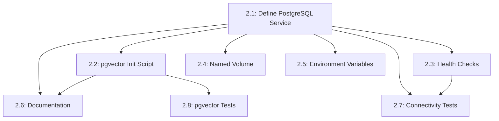

# US-2: Database Service with Vector Support

**Priority**: P0 (Critical)
**Feature**: Local Development Environment
**Status**: To Do
**Story Points**: 2

## Overview

This User Story provides the foundational database infrastructure for the AI-powered Technology Watch Platform. PostgreSQL 15 with the pgvector extension enables storage and querying of vector embeddings, which are essential for the semantic search and recommendation features of the platform.

### Context

The database service is a critical component of the local development environment, providing persistent data storage for all application data and supporting vector similarity searches required by the recommendation engine. It must be fully integrated into the Docker Compose stack with proper health checks, persistent storage, and accessibility from all backend services.

### Decomposition Approach

This User Story has been decomposed into **8 granular tasks** across two categories:

- **Infrastructure**: 6 tasks covering Docker Compose service definition, pgvector setup, health checks, volumes, environment configuration, and documentation
- **Testing**: 2 tasks for database connectivity verification and pgvector extension testing

The tasks focus on Docker and PostgreSQL configuration with minimal custom code, primarily involving declarative configuration files and initialization scripts.

---

## Task Summary

| ID | Title | Type | Specialty | Effort | Dependencies | Status |
|----|-------|------|-----------|--------|--------------|--------|
| TASK-2.1 | Define PostgreSQL service in docker-compose.yml | Infrastructure | Config | 2h | None | ⬜ |
| TASK-2.2 | Create pgvector initialization script | Infrastructure | Config | 1h | TASK-2.1 | ⬜ |
| TASK-2.3 | Configure database health checks | Infrastructure | Config | 1h | TASK-2.1 | ⬜ |
| TASK-2.4 | Create named volume for data persistence | Infrastructure | Config | 0.5h | TASK-2.1 | ⬜ |
| TASK-2.5 | Configure database environment variables | Infrastructure | Config | 1h | TASK-2.1 | ⬜ |
| TASK-2.6 | Document database connection and usage | Infrastructure | Documentation | 2h | TASK-2.1, TASK-2.2 | ⬜ |
| TASK-2.7 | Write database connectivity tests | Testing | Integration | 2h | TASK-2.1, TASK-2.3 | ⬜ |
| TASK-2.8 | Write pgvector extension verification tests | Testing | Integration | 1.5h | TASK-2.2 | ⬜ |

**Total Tasks**: 8
**Total Effort**: 11 hours (approximately 1.5 days for 1 developer)

---

## Task Details

### ⚙️ Infrastructure Tasks

#### TASK-2.1: Define PostgreSQL service in docker-compose.yml

**Type**: Infrastructure - Config
**Priority**: P0
**Estimated Effort**: 2 hours

##### Description

Define the PostgreSQL database service in the docker-compose.yml file using the PostgreSQL 15 image with pgvector support. The service must be configured with proper networking, restart policies, and resource limits. Choose between the official postgres:15 image with manual pgvector installation or the ankane/pgvector image with pre-installed extension.

##### Files Impacted

- `docker-compose.yml` (modified - add db service)

##### Acceptance Criteria

- [ ] Database service defined with name `db`
- [ ] Uses PostgreSQL 15 image (postgres:15 or ankane/pgvector)
- [ ] Service connected to internal Docker network (not exposed to host)
- [ ] Restart policy set to `unless-stopped`
- [ ] Resource limits configured (memory, CPU)
- [ ] Service can be started with `docker-compose up db`
- [ ] Container starts successfully and remains running

##### Dependencies

None (foundation task)

##### Implementation Notes

**Image Selection:**
- Use Fetch tool to check documentation about [local supabase setup](https://supabase.com/docs/guides/self-hosting/docker)
- Fall back options :
 - **Option 1**: Use `ankane/pgvector:pg15` (recommended - pgvector pre-installed)
 - **Option 2**: Use `postgres:15` with custom Dockerfile to install pgvector extension
 - **Option 3**: Use Supabase PostgreSQL image if available

**Service Configuration:**
```yaml
services:
  db:
    image: ankane/pgvector:pg15
    container_name: veille_tech_db
    restart: unless-stopped
    networks:
      - backend
    volumes:
      - postgres_data:/var/lib/postgresql/data
      - ./backend/init-db.sql:/docker-entrypoint-initdb.d/init-db.sql
    environment:
      - POSTGRES_USER=${POSTGRES_USER}
      - POSTGRES_PASSWORD=${POSTGRES_PASSWORD}
      - POSTGRES_DB=${POSTGRES_DB}
```

**Resource Limits:**
- Memory limit: 512MB (development)
- CPU limit: 1.0 (100% of one core)

**Network:**
- Do NOT expose port 5432 to host (internal only)
- Use internal Docker network for service-to-service communication

---

#### TASK-2.2: Create pgvector initialization script

**Type**: Infrastructure - Config
**Priority**: P0
**Estimated Effort**: 1 hour

##### Description

Create a SQL initialization script that automatically enables the pgvector extension when the database is first created. The script is mounted to `/docker-entrypoint-initdb.d/` and executed automatically by PostgreSQL on first startup. The script must be idempotent, allowing it to be run multiple times without errors.

##### Files Impacted

- `backend/init-db.sql` (new)

##### Acceptance Criteria

- [ ] init-db.sql file created in backend directory
- [ ] Script contains `CREATE EXTENSION IF NOT EXISTS vector;`
- [ ] Script is idempotent (can run multiple times safely)
- [ ] Script mounted to /docker-entrypoint-initdb.d/ in docker-compose.yml
- [ ] pgvector extension enabled automatically on first database startup
- [ ] Extension persists across container restarts

##### Dependencies

- TASK-2.1 (database service must be defined)

##### Implementation Notes

**init-db.sql Content:**
```sql
-- Enable pgvector extension for vector similarity search
CREATE EXTENSION IF NOT EXISTS vector;

-- Verify extension is installed
SELECT extname, extversion FROM pg_extension WHERE extname = 'vector';
```

**Mount Configuration:**
- Mount path: `/docker-entrypoint-initdb.d/init-db.sql`
- PostgreSQL automatically executes all .sql files in this directory on first startup
- Files are executed in alphabetical order
- Scripts only run if database is being initialized (empty data directory)

**Verification:**
After first startup, connect to database and verify:
```sql
\dx  -- List installed extensions
SELECT * FROM pg_extension WHERE extname = 'vector';
```

---

#### TASK-2.3: Configure database health checks

**Type**: Infrastructure - Config
**Priority**: P0
**Estimated Effort**: 1 hour

##### Description

Configure Docker health checks for the PostgreSQL service using the `pg_isready` utility to verify database availability and readiness. Health checks enable Docker Compose to determine when the database is fully ready to accept connections, which is essential for dependent services (backend, worker, scheduler) to start correctly.

##### Files Impacted

- `docker-compose.yml` (modified - add healthcheck to db service)

##### Acceptance Criteria

- [ ] Health check configured using `pg_isready` command
- [ ] Health check interval set to appropriate value (e.g., 10 seconds)
- [ ] Timeout configured (e.g., 5 seconds)
- [ ] Retries configured (e.g., 5 attempts)
- [ ] Start period configured (e.g., 10 seconds for initialization)
- [ ] `docker-compose ps` shows database as healthy after startup
- [ ] Health check passes within 10 seconds of startup (P95)

##### Dependencies

- TASK-2.1 (database service must be defined)

##### Implementation Notes

**Health Check Configuration:**
```yaml
healthcheck:
  test: ["CMD-SHELL", "pg_isready -U ${POSTGRES_USER} -d ${POSTGRES_DB}"]
  interval: 10s
  timeout: 5s
  retries: 5
  start_period: 10s
```

**Health Check States:**
- `starting`: During start_period, failures don't count
- `healthy`: Health check passed
- `unhealthy`: Failed after all retries

**Verification:**
```bash
docker-compose ps  # Check health status
docker inspect veille_tech_db --format='{{.State.Health.Status}}'
```

**Dependent Services:**
Other services can wait for database health using `depends_on` with condition:
```yaml
depends_on:
  db:
    condition: service_healthy
```

---

#### TASK-2.4: Create named volume for data persistence

**Type**: Infrastructure - Config
**Priority**: P0
**Estimated Effort**: 0.5 hours

##### Description

Define a named Docker volume (`postgres_data`) for PostgreSQL data persistence. Named volumes ensure that database data persists across container restarts, removals, and rebuilds. The volume stores all database tables, indexes, and configuration in the PostgreSQL data directory (/var/lib/postgresql/data).

##### Files Impacted

- `docker-compose.yml` (modified - add volumes section and mount to db service)

##### Acceptance Criteria

- [ ] Named volume `postgres_data` defined in volumes section
- [ ] Volume mounted to `/var/lib/postgresql/data` in db service
- [ ] Data persists across `docker-compose down` and `docker-compose up`
- [ ] Volume can be inspected with `docker volume inspect postgres_data`
- [ ] No POSTGRES_HOST_AUTH_METHOD warning (proper initialization)
- [ ] Volume supports up to 10GB of development data

##### Dependencies

- TASK-2.1 (database service must be defined)

##### Implementation Notes

**Volume Definition:**
```yaml
volumes:
  postgres_data:
    name: veille_tech_postgres_data
```

**Volume Mount in Service:**
```yaml
services:
  db:
    volumes:
      - postgres_data:/var/lib/postgresql/data
```

**Volume Management:**
```bash
# List volumes
docker volume ls

# Inspect volume
docker volume inspect veille_tech_postgres_data

# Remove volume (WARNING: deletes all data)
docker volume rm veille_tech_postgres_data

# Backup volume data
docker run --rm -v veille_tech_postgres_data:/data -v $(pwd):/backup ubuntu tar czf /backup/postgres_backup.tar.gz /data
```

**Data Persistence Test:**
1. Start database: `docker-compose up db`
2. Create test table: `docker-compose exec db psql -U postgres -c "CREATE TABLE test (id int);"`
3. Stop and remove container: `docker-compose down`
4. Restart: `docker-compose up db`
5. Verify table exists: `docker-compose exec db psql -U postgres -c "\dt"`

---

#### TASK-2.5: Configure database environment variables

**Type**: Infrastructure - Config
**Priority**: P0
**Estimated Effort**: 1 hour

##### Description

Define database connection parameters as environment variables in `.env.backend` for secure credential management. Create `.env.backend.example` as a template with placeholder values for other developers. Environment variables configure the database user, password, database name, and connection string for backend services.

##### Files Impacted

- `.env.backend` (new - not committed to Git)
- `.env.backend.example` (new - committed to Git)
- `.gitignore` (modified - ensure .env.backend excluded)

##### Acceptance Criteria

- [ ] .env.backend file created with actual database credentials
- [ ] .env.backend.example file created with placeholder values
- [ ] Environment variables defined: POSTGRES_USER, POSTGRES_PASSWORD, POSTGRES_DB, DATABASE_URL
- [ ] .env.backend excluded from Git via .gitignore
- [ ] DATABASE_URL format: `postgresql://user:password@db:5432/veille_tech_db`
- [ ] Strong password policy documented (min 16 chars, mixed case, numbers, symbols)
- [ ] docker-compose.yml references environment variables from .env.backend

##### Dependencies

- TASK-2.1 (database service must be defined)

##### Implementation Notes

**.env.backend Content:**
```env
# PostgreSQL Database Configuration
POSTGRES_USER=veille_tech_user
POSTGRES_PASSWORD=<generate-strong-password>
POSTGRES_DB=veille_tech_db

# Database Connection String for Django
DATABASE_URL=postgresql://veille_tech_user:<password>@db:5432/veille_tech_db
```

**.env.backend.example Content:**
```env
# PostgreSQL Database Configuration
POSTGRES_USER=veille_tech_user
POSTGRES_PASSWORD=your_secure_password_here_min_16_chars
POSTGRES_DB=veille_tech_db

# Database Connection String for Django
DATABASE_URL=postgresql://veille_tech_user:your_secure_password_here@db:5432/veille_tech_db
```

**Strong Password Generation:**
```bash
# Generate secure random password
openssl rand -base64 24
```

**.gitignore Entry:**
```
# Environment files with secrets
.env.backend
.env.frontend
```

**docker-compose.yml Integration:**
```yaml
services:
  db:
    env_file:
      - .env.backend
```

---

#### TASK-2.6: Document database connection and usage

**Type**: Infrastructure - Documentation
**Priority**: P0
**Estimated Effort**: 2 hours

##### Description

Create comprehensive documentation for database setup, connection, and common operations. Documentation should cover initial setup steps, connection string format, accessing the database shell, running SQL queries, and troubleshooting common issues. Include examples for both Docker CLI and application code usage.

##### Files Impacted

- `docs/setup/00_setup_local_docker.md` (modified - add database section)
- `README.md` (modified - add database quick reference)

##### Acceptance Criteria

- [ ] Database setup section added to setup guide
- [ ] Connection string format documented with examples
- [ ] Database shell access documented (`docker-compose exec db psql`)
- [ ] pgvector usage examples provided
- [ ] Common operations documented (create table, query, backup)
- [ ] Troubleshooting section for common database issues
- [ ] Django database configuration documented
- [ ] Connection pooling configuration documented

##### Dependencies

- TASK-2.1 (database service must exist)
- TASK-2.2 (pgvector initialization must be documented)

##### Implementation Notes

**Documentation Sections:**

1. **Database Overview**
   - PostgreSQL 15 with pgvector extension
   - Purpose: Application data + vector embeddings
   - Accessibility: Internal Docker network only

2. **Initial Setup**
   ```bash
   # Copy environment template
   cp .env.backend.example .env.backend

   # Edit credentials (use strong password)
   nano .env.backend

   # Start database
   docker-compose up db
   ```

3. **Accessing Database Shell**
   ```bash
   # PostgreSQL interactive shell
   docker-compose exec db psql -U veille_tech_user -d veille_tech_db

   # Run single command
   docker-compose exec db psql -U veille_tech_user -d veille_tech_db -c "SELECT version();"
   ```

4. **pgvector Usage Examples**
   ```sql
   -- Create table with vector column
   CREATE TABLE items (
     id serial PRIMARY KEY,
     embedding vector(1536)
   );

   -- Insert vector
   INSERT INTO items (embedding) VALUES ('[1,2,3,...]');

   -- Cosine similarity search
   SELECT * FROM items ORDER BY embedding <=> '[query_vector]' LIMIT 10;
   ```

5. **Django Configuration**
   ```python
   DATABASES = {
       'default': {
           'ENGINE': 'django.db.backends.postgresql',
           'NAME': os.getenv('POSTGRES_DB'),
           'USER': os.getenv('POSTGRES_USER'),
           'PASSWORD': os.getenv('POSTGRES_PASSWORD'),
           'HOST': 'db',
           'PORT': '5432',
           'CONN_MAX_AGE': 600,
       }
   }
   ```

6. **Troubleshooting**
   - Connection refused: Check if db service is healthy
   - Authentication failed: Verify credentials in .env.backend
   - Extension not found: Verify init-db.sql executed

---

### ✅ Testing Tasks

#### TASK-2.7: Write database connectivity tests

**Type**: Testing - Integration
**Priority**: P0
**Estimated Effort**: 2 hours

##### Description

Create automated tests that verify database connectivity, service health, and basic operations. Tests should validate that the database service starts correctly, accepts connections from backend containers, responds to queries, and maintains healthy status. Use shell scripts or Python scripts that can be run as part of the setup verification process.

##### Files Impacted

- `tests/integration/test_database_connectivity.sh` (new)
- `tests/integration/test_database_connectivity.py` (new - optional)

##### Acceptance Criteria

- [ ] Test script verifies database service is running
- [ ] Test verifies database health check passes
- [ ] Test verifies connection from backend container succeeds
- [ ] Test verifies simple SQL query executes successfully
- [ ] Test verifies connection pooling works
- [ ] Test verifies database accepts concurrent connections (10+ connections)
- [ ] Test script exits with non-zero code on failure
- [ ] All tests pass on clean environment setup

##### Dependencies

- TASK-2.1 (database service must be defined)
- TASK-2.3 (health checks must be configured)

##### Implementation Notes

**test_database_connectivity.sh:**
```bash
#!/bin/bash
set -e

echo "Testing database connectivity..."

# Test 1: Service is running
docker-compose ps db | grep -q "Up" || { echo "FAIL: Database not running"; exit 1; }
echo "PASS: Database service running"

# Test 2: Health check passes
HEALTH=$(docker inspect veille_tech_db --format='{{.State.Health.Status}}')
[ "$HEALTH" == "healthy" ] || { echo "FAIL: Database unhealthy"; exit 1; }
echo "PASS: Database health check passes"

# Test 3: Connection succeeds
docker-compose exec -T db psql -U veille_tech_user -d veille_tech_db -c "SELECT 1;" > /dev/null || { echo "FAIL: Connection failed"; exit 1; }
echo "PASS: Database connection successful"

# Test 4: Query execution
RESULT=$(docker-compose exec -T db psql -U veille_tech_user -d veille_tech_db -t -c "SELECT version();")
[[ "$RESULT" == *"PostgreSQL 15"* ]] || { echo "FAIL: Unexpected PostgreSQL version"; exit 1; }
echo "PASS: Query execution successful"

echo "All database connectivity tests passed!"
```

**test_database_connectivity.py (optional):**
```python
import os
import psycopg2
import pytest

def test_database_connection():
    conn = psycopg2.connect(os.getenv('DATABASE_URL'))
    assert conn is not None
    conn.close()

def test_simple_query():
    conn = psycopg2.connect(os.getenv('DATABASE_URL'))
    cur = conn.cursor()
    cur.execute("SELECT 1;")
    result = cur.fetchone()
    assert result[0] == 1
    cur.close()
    conn.close()

def test_concurrent_connections():
    connections = []
    for i in range(10):
        conn = psycopg2.connect(os.getenv('DATABASE_URL'))
        connections.append(conn)

    for conn in connections:
        conn.close()
```

**Running Tests:**
```bash
# Shell script
chmod +x tests/integration/test_database_connectivity.sh
./tests/integration/test_database_connectivity.sh

# Python tests
pytest tests/integration/test_database_connectivity.py
```

---

#### TASK-2.8: Write pgvector extension verification tests

**Type**: Testing - Integration
**Priority**: P0
**Estimated Effort**: 1.5 hours

##### Description

Create automated tests that verify the pgvector extension is properly installed, enabled, and functional. Tests should validate vector column creation, vector insertion, similarity searches (cosine, L2, inner product), and basic indexing operations. These tests ensure that the core semantic search functionality is available for the recommendation engine.

##### Files Impacted

- `tests/integration/test_pgvector_extension.sh` (new)
- `tests/integration/test_pgvector_extension.py` (new - optional)

##### Acceptance Criteria

- [ ] Test verifies pgvector extension is installed
- [ ] Test creates table with vector column successfully
- [ ] Test inserts vector data successfully
- [ ] Test performs cosine similarity search (<=> operator)
- [ ] Test performs L2 distance search (<-> operator)
- [ ] Test performs inner product search (<#> operator)
- [ ] Test verifies vector dimensions are enforced
- [ ] All tests pass on clean environment setup

##### Dependencies

- TASK-2.2 (pgvector initialization script must be created)

##### Implementation Notes

**test_pgvector_extension.sh:**
```bash
#!/bin/bash
set -e

echo "Testing pgvector extension..."

# Test 1: Extension is installed
docker-compose exec -T db psql -U veille_tech_user -d veille_tech_db -c "SELECT extname FROM pg_extension WHERE extname = 'vector';" | grep -q "vector" || { echo "FAIL: pgvector extension not installed"; exit 1; }
echo "PASS: pgvector extension installed"

# Test 2: Create table with vector column
docker-compose exec -T db psql -U veille_tech_user -d veille_tech_db -c "
CREATE TABLE IF NOT EXISTS test_embeddings (
  id serial PRIMARY KEY,
  embedding vector(3)
);" > /dev/null || { echo "FAIL: Cannot create vector column"; exit 1; }
echo "PASS: Vector column created"

# Test 3: Insert vector data
docker-compose exec -T db psql -U veille_tech_user -d veille_tech_db -c "
INSERT INTO test_embeddings (embedding) VALUES ('[1,2,3]'), ('[4,5,6]');" > /dev/null || { echo "FAIL: Cannot insert vector data"; exit 1; }
echo "PASS: Vector data inserted"

# Test 4: Cosine similarity search
docker-compose exec -T db psql -U veille_tech_user -d veille_tech_db -c "
SELECT id FROM test_embeddings ORDER BY embedding <=> '[1,2,3]' LIMIT 1;" | grep -q "1" || { echo "FAIL: Cosine similarity search failed"; exit 1; }
echo "PASS: Cosine similarity search works"

# Test 5: L2 distance search
docker-compose exec -T db psql -U veille_tech_user -d veille_tech_db -c "
SELECT id FROM test_embeddings ORDER BY embedding <-> '[1,2,3]' LIMIT 1;" > /dev/null || { echo "FAIL: L2 distance search failed"; exit 1; }
echo "PASS: L2 distance search works"

# Cleanup
docker-compose exec -T db psql -U veille_tech_user -d veille_tech_db -c "DROP TABLE IF EXISTS test_embeddings;" > /dev/null

echo "All pgvector extension tests passed!"
```

**test_pgvector_extension.py (optional):**
```python
import os
import psycopg2
import pytest
from pgvector.psycopg2 import register_vector

def get_connection():
    conn = psycopg2.connect(os.getenv('DATABASE_URL'))
    register_vector(conn)
    return conn

def test_extension_installed():
    conn = get_connection()
    cur = conn.cursor()
    cur.execute("SELECT extname FROM pg_extension WHERE extname = 'vector';")
    result = cur.fetchone()
    assert result[0] == 'vector'
    cur.close()
    conn.close()

def test_vector_column_creation():
    conn = get_connection()
    cur = conn.cursor()
    cur.execute("CREATE TABLE IF NOT EXISTS test_vectors (id serial PRIMARY KEY, embedding vector(3));")
    conn.commit()
    cur.close()
    conn.close()

def test_vector_insert_and_search():
    conn = get_connection()
    cur = conn.cursor()

    # Insert test vectors
    cur.execute("INSERT INTO test_vectors (embedding) VALUES (%s), (%s)",
                ([1, 2, 3], [4, 5, 6]))
    conn.commit()

    # Cosine similarity search
    cur.execute("SELECT id FROM test_vectors ORDER BY embedding <=> %s LIMIT 1", ([1, 2, 3],))
    result = cur.fetchone()
    assert result[0] == 1

    # Cleanup
    cur.execute("DROP TABLE test_vectors;")
    conn.commit()
    cur.close()
    conn.close()
```

**Vector Operators:**
- `<=>`: Cosine distance (1 - cosine similarity)
- `<->`: L2 distance (Euclidean)
- `<#>`: Negative inner product

**Running Tests:**
```bash
# Shell script
chmod +x tests/integration/test_pgvector_extension.sh
./tests/integration/test_pgvector_extension.sh

# Python tests (requires pgvector package)
pip install pgvector psycopg2-binary
pytest tests/integration/test_pgvector_extension.py
```

---

## Dependency Graph

### Mermaid Diagram



### Implementation Phases

**Phase 1: Core Database Setup (2-3 hours)**
- TASK-2.1: Define PostgreSQL service in docker-compose.yml
- TASK-2.4: Create named volume for data persistence
- TASK-2.5: Configure database environment variables

**Phase 2: Extensions and Health (2-2.5 hours)**
- TASK-2.2: Create pgvector initialization script
- TASK-2.3: Configure database health checks

**Phase 3: Documentation and Testing (3.5-4 hours)**
- TASK-2.6: Document database connection and usage
- TASK-2.7: Write database connectivity tests
- TASK-2.8: Write pgvector extension verification tests

### Parallelization Opportunities

**After TASK-2.1 completes, the following can run in parallel:**
- TASK-2.2 (pgvector script)
- TASK-2.3 (health checks)
- TASK-2.4 (volume configuration)
- TASK-2.5 (environment variables)

**Testing tasks can run in parallel:**
- TASK-2.7 (connectivity tests)
- TASK-2.8 (pgvector tests)

**Sequential Requirements:**
- TASK-2.6 (documentation) should wait for TASK-2.1 and TASK-2.2 to complete
- TASK-2.7 requires TASK-2.1 and TASK-2.3
- TASK-2.8 requires TASK-2.2

---

## Effort Estimation

### By Task Type

| Type | Tasks | Effort | Percentage |
|------|-------|--------|------------|
| Infrastructure | 6 | 7.5h | 68% |
| Testing | 2 | 3.5h | 32% |
| **TOTAL** | **8** | **11h** | **100%** |

### By Developer

**Single Developer**:
- Sequential execution: 11 hours
- 8-hour days: ~1.5 days
- With overhead and validation: 2 days

**Recommended Approach**:
- Hour 0-3: Core database setup (TASK-2.1, 2.4, 2.5)
- Hour 3-5: Extensions and health checks (TASK-2.2, 2.3)
- Hour 5-7: Documentation (TASK-2.6)
- Hour 7-11: Testing (TASK-2.7, 2.8)
- Total: 11 hours in 1.5-2 days

---

## Implementation Notes

### Technology Stack

**Database:**
- PostgreSQL 15 (official postgres:15 or ankane/pgvector image)
- pgvector extension (latest version compatible with PG 15)
- Docker Compose v2 for orchestration

**Testing:**
- Shell scripts (bash) for integration tests
- Python with psycopg2 and pgvector for optional Python tests
- Docker CLI for container inspection

### Patterns and Conventions

**Docker Compose:**
- Service name: `db` (short, descriptive)
- Container name: `veille_tech_db` (project-specific)
- Volume naming: `veille_tech_postgres_data` (project prefix)
- Use env_file for environment variables

**PostgreSQL:**
- Database name: `veille_tech_db`
- User name: `veille_tech_user` (not postgres)
- Initialize extensions via /docker-entrypoint-initdb.d/
- Use health checks for service readiness

**Security:**
- No port 5432 exposed to host (internal only)
- Strong passwords (min 16 chars)
- Credentials in .env files (excluded from Git)

### Configuration Requirements

**Docker:**
- Docker Engine 24+ or Docker Desktop 4.25+
- Minimum 512MB memory for database container
- 10GB disk space for volume

**Environment Variables Required:**
```env
POSTGRES_USER=veille_tech_user
POSTGRES_PASSWORD=<strong-password-here>
POSTGRES_DB=veille_tech_db
DATABASE_URL=postgresql://veille_tech_user:<password>@db:5432/veille_tech_db
```

**Dependencies on Other User Stories:**
- US-1: Docker Compose Service Orchestration must be completed first
- This US-2 blocks: US-4 (Backend API), US-6 (Celery Worker), US-9 (Migrations)

---

## Risks and Attention Points

### Identified Risks

**1. pgvector Extension Availability (MEDIUM IMPACT)**
- **Risk**: Official postgres:15 image doesn't include pgvector by default
- **Impact**: Additional setup complexity, potential build failures
- **Mitigation**:
  - Use ankane/pgvector:pg15 image (recommended - extension pre-installed)
  - Alternative: Use Supabase PostgreSQL image
  - Alternative: Create custom Dockerfile to install pgvector
- **Contingency**: Provide clear documentation for manual extension installation

**2. Volume Performance on Windows (LOW IMPACT)**
- **Risk**: Docker Desktop on Windows may have slower volume I/O
- **Impact**: Slower database operations during development
- **Mitigation**:
  - Use WSL2 backend for Docker Desktop (better performance)
  - Document expected performance characteristics
  - Use named volumes (better than bind mounts)
- **Contingency**: Provide performance tuning guide for Windows users

**3. First-Time Initialization Delay (LOW IMPACT)**
- **Risk**: First startup takes longer due to database initialization and extension setup
- **Impact**: Developers may think service is stuck
- **Mitigation**:
  - Configure health check with appropriate start_period (10s)
  - Document expected initialization time
  - Provide clear logging during initialization
- **Contingency**: Add startup progress indicators in documentation

**4. Connection String Complexity (LOW IMPACT)**
- **Risk**: Developers may misconfigure DATABASE_URL connection string
- **Impact**: Backend cannot connect to database
- **Mitigation**:
  - Provide clear .env.backend.example template
  - Document connection string format with examples
  - Include troubleshooting section for connection errors
- **Contingency**: Provide validation script to check connection string format

### Critical Points

**Configuration:**
- Ensure .env.backend is excluded from Git (security)
- Use strong passwords (min 16 chars, mixed case, numbers, symbols)
- Verify pgvector extension is enabled before backend development
- Test data persistence across container restarts

**Performance:**
- Database should be healthy within 10 seconds
- Simple queries should respond within 100ms
- Use named volumes for better I/O performance
- Configure connection pooling in Django (CONN_MAX_AGE)

**Testing:**
- Test database connectivity from backend container, not host
- Verify pgvector operators work correctly (<=> , <-> , <#>)
- Test vector dimension enforcement
- Validate data persistence across restarts

**Documentation:**
- Document database shell access for debugging
- Provide pgvector usage examples for developers
- Include troubleshooting guide for common issues
- Document backup/restore procedures

---

## Verification Checklist

Before marking US-2 as complete, verify:

### Functional Requirements
- [ ] PostgreSQL 15 container runs on port 5432 (internal)
- [ ] pgvector extension enabled automatically
- [ ] Database credentials configured via environment variables
- [ ] Database data persists across container restarts
- [ ] Database accessible from backend, worker, and scheduler containers
- [ ] Health check validates database connectivity and readiness

### Technical Requirements
- [ ] Database service defined in docker-compose.yml
- [ ] Named volume `postgres_data` created
- [ ] Database initialization script enables pgvector
- [ ] Connection string format: `postgresql://user:password@db:5432/veille_tech_db`
- [ ] Database logs accessible via `docker-compose logs db`
- [ ] Database container restarts automatically on failure

### Performance Requirements
- [ ] Database starts and becomes healthy within 10 seconds
- [ ] Simple queries respond within 100ms
- [ ] Connection pool supports minimum 20 concurrent connections

### Testing Requirements
- [ ] Database connectivity tests pass
- [ ] pgvector extension verification tests pass
- [ ] Data persistence verified across restarts
- [ ] Vector operations work correctly

### Documentation Requirements
- [ ] Database connection documented
- [ ] pgvector usage examples provided
- [ ] Troubleshooting guide created
- [ ] Environment variables documented in .env.backend.example

### Security Requirements
- [ ] Database port not exposed to host network
- [ ] Database credentials in environment variables (not hardcoded)
- [ ] .env.backend excluded from Git
- [ ] Strong password policy documented

---

## Next Steps After Completion

1. **Verification**: Run connectivity and pgvector tests to confirm setup
2. **US-3**: Proceed to Redis Broker and Cache Service
3. **US-4**: Proceed to Django Backend API Service (depends on database)
4. **US-9**: Database Initialization and Migrations (depends on database and backend)

---

**Generated**: 2025-01-27
**Version**: 1.0
**Status**: Ready for Implementation
**Estimated Completion**: 1.5-2 days (1 developer)
