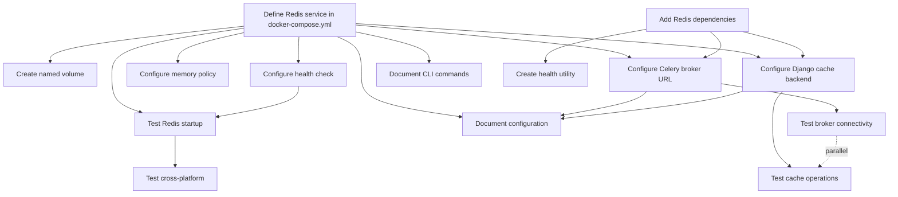

# US-3: Redis Broker and Cache Service

**Priority**: P0
**Feature**: Local Development Environment
**Status**: To Do

## Overview

This User Story establishes Redis as a dual-purpose service providing both message brokering for Celery task queues and application-level caching. Redis is critical for the AI pipeline's asynchronous task processing, enabling background execution of Langgraph agents without blocking API requests.

### Context

Redis serves two critical functions in the platform:
1. **Celery Broker (DB 0)**: Manages task queues for async AI pipeline execution
2. **Application Cache (DB 1)**: Stores cached API responses and session data

The service must be accessible from backend API, Celery workers, and Celery Beat scheduler, with proper health checks and persistence configured for development use.

### Decomposition Approach

- **Total tasks**: 14
- **Infrastructure**: 4 tasks (Docker Compose, volume, health checks)
- **Backend**: 4 tasks (dependencies, configuration, utilities)
- **Testing**: 4 tasks (startup, connectivity, operations, cross-platform)
- **Documentation**: 2 tasks (configuration, debugging)

**Estimated Total Effort**: 18-22 hours (2-3 days for 1 developer)

---

## Task Summary

| ID | Title | Type | Specialty | Effort | Dependencies | Status |
|----|-------|------|-----------|--------|--------------|--------|
| TASK-3.1 | Define Redis service in docker-compose.yml | Infrastructure | Config | 2h | None | ⬜ |
| TASK-3.2 | Create named volume for Redis persistence | Infrastructure | Config | 1h | TASK-3.1 | ⬜ |
| TASK-3.3 | Configure Redis health check | Infrastructure | Config | 1.5h | TASK-3.1 | ⬜ |
| TASK-3.4 | Configure Redis memory policy and limits | Infrastructure | Config | 1.5h | TASK-3.1 | ⬜ |
| TASK-3.5 | Add Redis client dependencies to Poetry | Backend | Config | 1h | None | ⬜ |
| TASK-3.6 | Configure Celery broker URL | Backend | Config | 2h | TASK-3.1, TASK-3.5 | ⬜ |
| TASK-3.7 | Configure Django cache backend | Backend | Config | 2h | TASK-3.1, TASK-3.5 | ⬜ |
| TASK-3.8 | Create Redis connection health utility | Backend | API | 2h | TASK-3.5 | ⬜ |
| TASK-3.9 | Test Redis service startup and health | Testing | Integration | 1.5h | TASK-3.1, TASK-3.3 | ⬜ |
| TASK-3.10 | Test Celery broker connectivity | Testing | Integration | 2h | TASK-3.6 | ⬜ |
| TASK-3.11 | Test cache operations | Testing | Integration | 2h | TASK-3.7 | ⬜ |
| TASK-3.12 | Test cross-platform compatibility | Testing | Integration | 2h | TASK-3.9 | ⬜ |
| TASK-3.13 | Document Redis configuration | Infrastructure | Documentation | 1h | TASK-3.1, TASK-3.6, TASK-3.7 | ⬜ |
| TASK-3.14 | Document Redis CLI debugging commands | Infrastructure | Documentation | 1h | TASK-3.1 | ⬜ |

---

## Task Details

### ⚙️ Infrastructure Tasks

#### TASK-3.1: Define Redis service in docker-compose.yml

**Type**: Infrastructure - Config
**Priority**: P0
**Estimated Effort**: 2 hours

##### Description

Add Redis service definition to the Docker Compose configuration file. This task establishes the Redis container using the official latest image, configures network connectivity to allow access from backend services (API, workers, scheduler), and sets up the restart policy for automatic recovery from failures.

The service must be accessible via hostname `redis` on port 6379 within the internal Docker network, but should NOT expose port 6379 to the host machine for security reasons.

##### Files Impacted

- `docker-compose.yml` (modification - add redis service)

##### Acceptance Criteria

- [ ] Redis service defined with official `redis:latest` image
- [ ] Service named `redis` for DNS resolution within Docker network
- [ ] Internal port 6379 accessible (NOT exposed to host)
- [ ] Connected to application network (e.g., `app-network`)
- [ ] Restart policy set to `unless-stopped`
- [ ] Service includes labels for documentation

##### Dependencies

- None (can be implemented immediately)

##### Implementation Notes

```yaml
services:
  redis:
    image: redis:latest
    container_name: redis
    restart: unless-stopped
    networks:
      - app-network
    labels:
      - "description=Redis broker and cache service"
```

---

#### TASK-3.2: Create named volume for Redis persistence

**Type**: Infrastructure - Config
**Priority**: P0
**Estimated Effort**: 1 hour

##### Description

Configure a named Docker volume `redis_data` to persist Redis data across container restarts. This ensures that task queue state and cached data are not lost when the container is stopped or restarted during development.

The volume should be mapped to Redis's default data directory (`/data`) where RDB snapshots and AOF logs are stored.

##### Files Impacted

- `docker-compose.yml` (modification - add volume mapping and volume definition)

##### Acceptance Criteria

- [ ] Named volume `redis_data` defined in volumes section
- [ ] Volume mounted to `/data` in Redis container
- [ ] Volume persists data across `docker-compose down` and `docker-compose up`
- [ ] Volume can be inspected with `docker volume inspect redis_data`

##### Dependencies

- TASK-3.1 (Redis service must be defined first)

##### Implementation Notes

```yaml
services:
  redis:
    volumes:
      - redis_data:/data

volumes:
  redis_data:
    name: redis_data
```

---

#### TASK-3.3: Configure Redis health check

**Type**: Infrastructure - Config
**Priority**: P0
**Estimated Effort**: 1.5 hours

##### Description

Implement a Docker health check for the Redis service using the `redis-cli ping` command. This health check allows Docker Compose to determine when Redis is ready to accept connections, enabling proper orchestration with dependent services (backend, workers).

The health check should run every 10 seconds with a 5-second timeout and allow 3 retries before marking the service as unhealthy.

##### Files Impacted

- `docker-compose.yml` (modification - add healthcheck configuration)

##### Acceptance Criteria

- [ ] Health check configured using `redis-cli ping`
- [ ] Health check interval set to 10 seconds
- [ ] Timeout set to 5 seconds
- [ ] Retries set to 3 attempts
- [ ] Start period set to 5 seconds (allow Redis initialization time)
- [ ] Health status visible in `docker-compose ps` output
- [ ] Dependent services can use `condition: service_healthy` dependency

##### Dependencies

- TASK-3.1 (Redis service must be defined first)

##### Implementation Notes

```yaml
services:
  redis:
    healthcheck:
      test: ["CMD", "redis-cli", "ping"]
      interval: 10s
      timeout: 5s
      retries: 3
      start_period: 5s
```

---

#### TASK-3.4: Configure Redis memory policy and limits

**Type**: Infrastructure - Config
**Priority**: P0
**Estimated Effort**: 1.5 hours

##### Description

Configure Redis memory management settings to prevent excessive memory consumption in development environments. Set a maxmemory limit (256MB for development) and configure the LRU (Least Recently Used) eviction policy for cache database (DB 1) to automatically remove old keys when memory limit is reached.

This ensures Redis remains stable and doesn't exhaust system memory during heavy development workloads.

##### Files Impacted

- `docker-compose.yml` (modification - add command/args for Redis configuration)

##### Acceptance Criteria

- [ ] Maxmemory limit set to 256MB (or configured via environment variable)
- [ ] Maxmemory policy set to `allkeys-lru` for automatic eviction
- [ ] Configuration can be verified with `docker-compose exec redis redis-cli CONFIG GET maxmemory`
- [ ] Configuration can be verified with `docker-compose exec redis redis-cli CONFIG GET maxmemory-policy`
- [ ] Redis continues operating when memory limit is reached (evicts keys instead of failing)

##### Dependencies

- TASK-3.1 (Redis service must be defined first)

##### Implementation Notes

```yaml
services:
  redis:
    command: >
      redis-server
      --maxmemory 256mb
      --maxmemory-policy allkeys-lru
```

Or use environment variable approach:
```yaml
services:
  redis:
    environment:
      - REDIS_MAXMEMORY=256mb
      - REDIS_MAXMEMORY_POLICY=allkeys-lru
```

---

### 🔧 Backend Tasks

#### TASK-3.5: Add Redis client dependencies to Poetry

**Type**: Backend - Config
**Priority**: P0
**Estimated Effort**: 1 hour

##### Description

Add Redis client libraries to the backend project dependencies using Poetry. Install `redis` (Python Redis client) and `django-redis` (Django cache backend) to enable Redis connectivity from Django and Celery.

Ensure compatible versions are selected that work with Python 3.13 and Django latest.

##### Files Impacted

- `backend/pyproject.toml` (modification - add dependencies)
- `backend/poetry.lock` (auto-generated - updated lock file)

##### Acceptance Criteria

- [ ] `redis` package added to dependencies (version ^5.0.0 or latest)
- [ ] `django-redis` package added to dependencies (version ^5.4.0 or latest)
- [ ] Dependencies installed with `poetry install`
- [ ] Lock file updated with `poetry lock`
- [ ] No dependency conflicts reported by Poetry
- [ ] Packages importable in Django shell: `import redis`, `import django_redis`

##### Dependencies

- None (can be implemented independently)

##### Implementation Notes

```bash
cd backend
poetry add redis django-redis
poetry lock
poetry install
```

Verify in `pyproject.toml`:
```toml
[tool.poetry.dependencies]
redis = "^5.0.0"
django-redis = "^5.4.0"
```

---

#### TASK-3.6: Configure Celery broker URL

**Type**: Backend - Config
**Priority**: P0
**Estimated Effort**: 2 hours

##### Description

Configure Celery to use Redis DB 0 as the message broker for task queues. Update Django settings to set `CELERY_BROKER_URL` to `redis://redis:6379/0`, where `redis` is the Docker service hostname and `0` is the database number reserved for Celery broker operations.

Add configuration to `.env.backend.example` for documentation and allow developers to override the URL if needed.

##### Files Impacted

- `backend/config/settings/base.py` (modification - add Celery broker configuration)
- `.env.backend.example` (modification - add CELERY_BROKER_URL)
- `.env.backend` (modification - add actual value for local development)

##### Acceptance Criteria

- [ ] `CELERY_BROKER_URL` configured in Django settings
- [ ] URL points to `redis://redis:6379/0` (DB 0 for broker)
- [ ] Setting loaded from environment variable with sensible default
- [ ] Configuration documented in `.env.backend.example` with comments
- [ ] Celery worker can connect to broker (verified in logs)
- [ ] Task queues visible in Redis: `docker-compose exec redis redis-cli -n 0 KEYS *`

##### Dependencies

- TASK-3.1 (Redis service must exist)
- TASK-3.5 (Redis client library must be installed)

##### Implementation Notes

**backend/config/settings/base.py**:
```python
# Celery Configuration
CELERY_BROKER_URL = os.getenv('CELERY_BROKER_URL', 'redis://redis:6379/0')
CELERY_RESULT_BACKEND = os.getenv('CELERY_RESULT_BACKEND', 'redis://redis:6379/0')
CELERY_ACCEPT_CONTENT = ['json']
CELERY_TASK_SERIALIZER = 'json'
CELERY_RESULT_SERIALIZER = 'json'
```

**.env.backend.example**:
```bash
# Celery Broker (Redis DB 0 for task queues)
CELERY_BROKER_URL=redis://redis:6379/0
CELERY_RESULT_BACKEND=redis://redis:6379/0
```

---

#### TASK-3.7: Configure Django cache backend

**Type**: Backend - Config
**Priority**: P0
**Estimated Effort**: 2 hours

##### Description

Configure Django's cache framework to use Redis DB 1 as the cache backend. Update `CACHES` setting in Django to use `django_redis.cache.RedisCache` with connection URL `redis://redis:6379/1`, where database number `1` is reserved for application caching (separate from Celery broker).

This enables Django view caching, template caching, and low-level cache API operations.

##### Files Impacted

- `backend/config/settings/base.py` (modification - add CACHES configuration)
- `.env.backend.example` (modification - add REDIS_CACHE_URL)
- `.env.backend` (modification - add actual value for local development)

##### Acceptance Criteria

- [ ] `CACHES['default']` configured with `django_redis.cache.RedisCache` backend
- [ ] Cache location points to `redis://redis:6379/1` (DB 1 for cache)
- [ ] Cache key prefix configured to avoid conflicts (e.g., `techwatch`)
- [ ] Configuration loaded from environment variable
- [ ] Cache operations work: `from django.core.cache import cache; cache.set('test', 'value'); cache.get('test')`
- [ ] Cached keys visible in Redis: `docker-compose exec redis redis-cli -n 1 KEYS *`

##### Dependencies

- TASK-3.1 (Redis service must exist)
- TASK-3.5 (Redis client libraries must be installed)

##### Implementation Notes

**backend/config/settings/base.py**:
```python
# Cache Configuration (Redis DB 1)
CACHES = {
    'default': {
        'BACKEND': 'django_redis.cache.RedisCache',
        'LOCATION': os.getenv('REDIS_CACHE_URL', 'redis://redis:6379/1'),
        'OPTIONS': {
            'CLIENT_CLASS': 'django_redis.client.DefaultClient',
            'KEY_PREFIX': 'techwatch',
            'PARSER_CLASS': 'redis.connection.HiredisParser',
            'CONNECTION_POOL_CLASS_KWARGS': {
                'max_connections': 50,
                'retry_on_timeout': True,
            }
        }
    }
}
```

**.env.backend.example**:
```bash
# Cache Backend (Redis DB 1 for application cache)
REDIS_CACHE_URL=redis://redis:6379/1
```

---

#### TASK-3.8: Create Redis connection health utility

**Type**: Backend - API
**Priority**: P0
**Estimated Effort**: 2 hours

##### Description

Create a utility function that tests Redis connectivity for both broker (DB 0) and cache (DB 1) databases. This utility should be callable from Django management commands or health check endpoints to validate that Redis is accessible and responding correctly.

The utility should return connection status, latency, and any error messages for troubleshooting.

##### Files Impacted

- `backend/core/utils/redis_health.py` (new - health check utility)
- `backend/core/management/commands/check_redis.py` (new - management command)

##### Acceptance Criteria

- [ ] Utility function `check_redis_health()` created
- [ ] Function tests both broker (DB 0) and cache (DB 1) connectivity
- [ ] Function measures connection latency (PING response time)
- [ ] Returns structured result with status, latency, error messages
- [ ] Management command `python manage.py check_redis` created
- [ ] Command outputs human-readable status report
- [ ] Command exits with code 0 on success, 1 on failure

##### Dependencies

- TASK-3.5 (Redis client library must be installed)

##### Implementation Notes

**backend/core/utils/redis_health.py**:
```python
import redis
from django.conf import settings
import time

def check_redis_health():
    """Check Redis connectivity for broker and cache databases."""
    results = {
        'broker': {'connected': False, 'latency_ms': None, 'error': None},
        'cache': {'connected': False, 'latency_ms': None, 'error': None}
    }

    # Test broker (DB 0)
    try:
        broker_client = redis.from_url(settings.CELERY_BROKER_URL)
        start = time.time()
        broker_client.ping()
        latency = (time.time() - start) * 1000
        results['broker'] = {'connected': True, 'latency_ms': round(latency, 2), 'error': None}
    except Exception as e:
        results['broker']['error'] = str(e)

    # Test cache (DB 1)
    try:
        cache_url = settings.CACHES['default']['LOCATION']
        cache_client = redis.from_url(cache_url)
        start = time.time()
        cache_client.ping()
        latency = (time.time() - start) * 1000
        results['cache'] = {'connected': True, 'latency_ms': round(latency, 2), 'error': None}
    except Exception as e:
        results['cache']['error'] = str(e)

    return results
```

**backend/core/management/commands/check_redis.py**:
```python
from django.core.management.base import BaseCommand
from core.utils.redis_health import check_redis_health

class Command(BaseCommand):
    help = 'Check Redis connectivity for broker and cache'

    def handle(self, *args, **options):
        results = check_redis_health()

        self.stdout.write(self.style.WARNING('Redis Health Check'))
        self.stdout.write('=' * 50)

        for db_name, status in results.items():
            if status['connected']:
                self.stdout.write(self.style.SUCCESS(
                    f"{db_name.upper()}: Connected ({status['latency_ms']}ms)"
                ))
            else:
                self.stdout.write(self.style.ERROR(
                    f"{db_name.upper()}: Failed - {status['error']}"
                ))
                return 1

        return 0
```

---

### ✅ Testing Tasks

#### TASK-3.9: Test Redis service startup and health

**Type**: Testing - Integration
**Priority**: P0
**Estimated Effort**: 1.5 hours

##### Description

Create integration tests that verify Redis service starts successfully, becomes healthy within expected timeframe (5 seconds), and responds correctly to health check commands. Tests should validate Docker Compose orchestration, health check configuration, and service readiness.

##### Files Impacted

- `backend/tests/integration/test_redis_service.py` (new - integration tests)

##### Acceptance Criteria

- [ ] Test verifies Redis container is running
- [ ] Test verifies Redis health check passes within 5 seconds
- [ ] Test verifies PING command returns PONG
- [ ] Test verifies Redis is accessible at `redis:6379` from backend container
- [ ] Test verifies named volume `redis_data` exists
- [ ] All tests pass with `pytest backend/tests/integration/test_redis_service.py`

##### Dependencies

- TASK-3.1 (Redis service must be defined)
- TASK-3.3 (Health check must be configured)

##### Implementation Notes

**backend/tests/integration/test_redis_service.py**:
```python
import pytest
import redis
import time
import subprocess

class TestRedisService:
    """Integration tests for Redis service startup and health."""

    def test_redis_container_running(self):
        """Verify Redis container is running."""
        result = subprocess.run(
            ['docker-compose', 'ps', '-q', 'redis'],
            capture_output=True, text=True
        )
        assert result.stdout.strip(), "Redis container is not running"

    def test_redis_health_check_passes(self):
        """Verify Redis health check passes within expected timeframe."""
        start_time = time.time()
        timeout = 10  # 10 seconds timeout

        while time.time() - start_time < timeout:
            result = subprocess.run(
                ['docker-compose', 'ps', '--format', 'json'],
                capture_output=True, text=True
            )
            if 'healthy' in result.stdout:
                return
            time.sleep(1)

        pytest.fail("Redis health check did not pass within 10 seconds")

    def test_redis_ping_response(self):
        """Verify Redis responds to PING command."""
        client = redis.Redis(host='redis', port=6379, decode_responses=True)
        response = client.ping()
        assert response is True, "Redis did not respond to PING"

    def test_redis_volume_exists(self):
        """Verify Redis data volume exists."""
        result = subprocess.run(
            ['docker', 'volume', 'ls', '-q', '--filter', 'name=redis_data'],
            capture_output=True, text=True
        )
        assert 'redis_data' in result.stdout, "Redis volume does not exist"
```

---

#### TASK-3.10: Test Celery broker connectivity

**Type**: Testing - Integration
**Priority**: P0
**Estimated Effort**: 2 hours

##### Description

Create integration tests that verify Celery can connect to Redis broker (DB 0), send tasks to the queue, and retrieve task status. Tests should validate the Celery configuration, broker URL, and task queue functionality.

##### Files Impacted

- `backend/tests/integration/test_celery_broker.py` (new - integration tests)
- `backend/tests/tasks.py` (new - sample Celery task for testing)

##### Acceptance Criteria

- [ ] Test verifies Celery worker can connect to broker
- [ ] Test sends a sample task to the queue
- [ ] Test retrieves task result from broker
- [ ] Test verifies task queue keys exist in Redis DB 0
- [ ] Test verifies broker connection latency is < 50ms
- [ ] All tests pass with `pytest backend/tests/integration/test_celery_broker.py`

##### Dependencies

- TASK-3.6 (Celery broker URL must be configured)

##### Implementation Notes

**backend/tests/tasks.py**:
```python
from celery import shared_task

@shared_task
def test_task():
    """Sample Celery task for testing."""
    return "Task executed successfully"
```

**backend/tests/integration/test_celery_broker.py**:
```python
import pytest
import redis
from celery import Celery
from django.conf import settings
from tests.tasks import test_task

class TestCeleryBroker:
    """Integration tests for Celery broker connectivity."""

    def test_broker_connection(self):
        """Verify Celery can connect to Redis broker."""
        app = Celery(broker=settings.CELERY_BROKER_URL)
        with app.connection_or_acquire() as conn:
            assert conn.connected, "Celery broker connection failed"

    def test_send_task_to_queue(self):
        """Verify task can be sent to Celery queue."""
        result = test_task.apply_async()
        assert result.id is not None, "Task ID not generated"

    def test_broker_keys_exist(self):
        """Verify Celery queue keys exist in Redis DB 0."""
        client = redis.Redis(host='redis', port=6379, db=0, decode_responses=True)
        keys = client.keys('*')
        # Celery creates keys like 'celery', '_kombu.binding.*', etc.
        assert len(keys) > 0, "No Celery keys found in Redis DB 0"

    def test_broker_latency(self):
        """Verify broker connection latency is acceptable."""
        import time
        client = redis.Redis(host='redis', port=6379, db=0)

        start = time.time()
        client.ping()
        latency_ms = (time.time() - start) * 1000

        assert latency_ms < 50, f"Broker latency too high: {latency_ms}ms"
```

---

#### TASK-3.11: Test cache operations

**Type**: Testing - Integration
**Priority**: P0
**Estimated Effort**: 2 hours

##### Description

Create integration tests that verify Django cache operations work correctly with Redis backend (DB 1). Tests should validate cache set/get operations, TTL (time-to-live) functionality, cache invalidation, and verify data is stored in separate Redis database from Celery broker.

##### Files Impacted

- `backend/tests/integration/test_cache_operations.py` (new - integration tests)

##### Acceptance Criteria

- [ ] Test verifies cache.set() and cache.get() operations work
- [ ] Test verifies cache TTL expires correctly
- [ ] Test verifies cache.delete() removes keys
- [ ] Test verifies cache keys exist in Redis DB 1 (not DB 0)
- [ ] Test verifies cache key prefix is applied correctly
- [ ] Test verifies cache operation latency is < 10ms
- [ ] All tests pass with `pytest backend/tests/integration/test_cache_operations.py`

##### Dependencies

- TASK-3.7 (Django cache backend must be configured)

##### Implementation Notes

**backend/tests/integration/test_cache_operations.py**:
```python
import pytest
import redis
import time
from django.core.cache import cache
from django.conf import settings

class TestCacheOperations:
    """Integration tests for Django cache operations with Redis."""

    def setup_method(self):
        """Clear cache before each test."""
        cache.clear()

    def test_cache_set_get(self):
        """Verify cache set and get operations."""
        cache.set('test_key', 'test_value', timeout=60)
        value = cache.get('test_key')
        assert value == 'test_value', "Cache get did not return expected value"

    def test_cache_ttl_expiration(self):
        """Verify cache TTL expires correctly."""
        cache.set('expire_key', 'value', timeout=2)
        assert cache.get('expire_key') == 'value', "Key should exist before expiration"

        time.sleep(3)
        assert cache.get('expire_key') is None, "Key should expire after TTL"

    def test_cache_delete(self):
        """Verify cache delete removes keys."""
        cache.set('delete_key', 'value', timeout=60)
        assert cache.get('delete_key') == 'value', "Key should exist before delete"

        cache.delete('delete_key')
        assert cache.get('delete_key') is None, "Key should be deleted"

    def test_cache_keys_in_correct_db(self):
        """Verify cache keys are stored in Redis DB 1, not DB 0."""
        cache.set('db_test_key', 'value', timeout=60)

        # Check DB 1 (cache)
        cache_client = redis.Redis(host='redis', port=6379, db=1, decode_responses=True)
        db1_keys = cache_client.keys('*')
        assert len(db1_keys) > 0, "No keys found in Redis DB 1 (cache)"

        # Check DB 0 (broker) - should not have cache keys
        broker_client = redis.Redis(host='redis', port=6379, db=0, decode_responses=True)
        db0_keys = broker_client.keys('*db_test_key*')
        assert len(db0_keys) == 0, "Cache keys should not exist in DB 0 (broker)"

    def test_cache_key_prefix(self):
        """Verify cache key prefix is applied."""
        cache.set('prefix_test', 'value', timeout=60)

        cache_client = redis.Redis(host='redis', port=6379, db=1, decode_responses=True)
        keys = cache_client.keys('*')

        # Check if any key contains the configured prefix
        prefix = settings.CACHES['default']['OPTIONS']['KEY_PREFIX']
        prefixed_keys = [k for k in keys if prefix in k]
        assert len(prefixed_keys) > 0, f"No keys with prefix '{prefix}' found"

    def test_cache_operation_latency(self):
        """Verify cache operations are fast enough."""
        start = time.time()
        cache.set('latency_test', 'value', timeout=60)
        set_latency_ms = (time.time() - start) * 1000

        start = time.time()
        cache.get('latency_test')
        get_latency_ms = (time.time() - start) * 1000

        assert set_latency_ms < 10, f"Cache SET latency too high: {set_latency_ms}ms"
        assert get_latency_ms < 10, f"Cache GET latency too high: {get_latency_ms}ms"
```

---

#### TASK-3.12: Test cross-platform compatibility

**Type**: Testing - Integration
**Priority**: P0
**Estimated Effort**: 2 hours

##### Description

Create tests and validation scripts that verify Redis service works correctly across Windows (Docker Desktop with WSL2), macOS, and Linux platforms. Tests should validate Docker volume persistence, network connectivity, and performance characteristics are consistent across platforms.

##### Files Impacted

- `scripts/test_redis_compatibility.sh` (new - cross-platform test script)
- `docs/testing/redis_compatibility_report.md` (new - test results documentation)

##### Acceptance Criteria

- [ ] Test script runs on Windows (Git Bash/PowerShell), macOS, and Linux
- [ ] Script validates Redis container startup time < 5 seconds on all platforms
- [ ] Script validates volume persistence across platforms
- [ ] Script validates network connectivity from backend container
- [ ] Script validates PING latency < 10ms on all platforms
- [ ] Compatibility report documents results for all platforms

##### Dependencies

- TASK-3.9 (Redis service startup tests must exist)

##### Implementation Notes

**scripts/test_redis_compatibility.sh**:
```bash
#!/bin/bash
# Cross-platform Redis compatibility test script

echo "=== Redis Cross-Platform Compatibility Test ==="
echo "Platform: $(uname -s)"
echo "Docker Version: $(docker --version)"
echo ""

# Test 1: Startup time
echo "[TEST 1] Redis startup time"
start=$(date +%s)
docker-compose up -d redis
timeout=10
while [ $(($(date +%s) - start)) -lt $timeout ]; do
    if docker-compose ps redis | grep -q "healthy"; then
        elapsed=$(($(date +%s) - start))
        echo "✓ Redis healthy in ${elapsed}s"
        break
    fi
    sleep 1
done

# Test 2: Volume persistence
echo "[TEST 2] Volume persistence"
docker-compose exec -T redis redis-cli SET test_persist "test_value"
docker-compose restart redis
sleep 3
value=$(docker-compose exec -T redis redis-cli GET test_persist)
if [ "$value" == "test_value" ]; then
    echo "✓ Volume persistence works"
else
    echo "✗ Volume persistence failed"
fi

# Test 3: Network connectivity
echo "[TEST 3] Network connectivity from backend"
docker-compose exec -T backend python -c "
import redis
client = redis.Redis(host='redis', port=6379)
print('✓ Backend can connect to Redis' if client.ping() else '✗ Connection failed')
"

# Test 4: Latency
echo "[TEST 4] PING latency"
for i in {1..10}; do
    docker-compose exec -T redis redis-cli --latency-history -i 1 | head -n 1
done

echo ""
echo "=== Test Complete ==="
```

---

### 📄 Documentation Tasks

#### TASK-3.13: Document Redis configuration

**Type**: Infrastructure - Documentation
**Priority**: P0
**Estimated Effort**: 1 hour

##### Description

Create comprehensive documentation for Redis configuration in the project. Document the dual-database setup (DB 0 for broker, DB 1 for cache), connection URLs, environment variables, memory configuration, and how to verify Redis is working correctly.

Update the setup guide with Redis-specific sections and troubleshooting tips.

##### Files Impacted

- `docs/setup/00_setup_local_docker.md` (modification - add Redis section)
- `.env.backend.example` (modification - add detailed comments)
- `README.md` (modification - add Redis service information)

##### Acceptance Criteria

- [ ] Setup guide includes Redis service description
- [ ] Dual-database architecture documented (DB 0 vs DB 1)
- [ ] Environment variables documented with examples
- [ ] Connection URL format explained
- [ ] Memory configuration explained (maxmemory, eviction policy)
- [ ] Troubleshooting section includes common Redis issues
- [ ] Documentation reviewed and approved

##### Dependencies

- TASK-3.1 (Redis service must be configured)
- TASK-3.6 (Celery broker configuration must exist)
- TASK-3.7 (Cache configuration must exist)

##### Implementation Notes

Add to `docs/setup/00_setup_local_docker.md`:

```markdown
## Redis Service

Redis serves as both Celery message broker and application cache.

### Architecture

Redis uses two separate databases:
- **DB 0**: Celery broker for task queues
- **DB 1**: Application cache for API responses and sessions

### Configuration

**Environment Variables** (.env.backend):
```bash
# Celery Broker (Redis DB 0)
CELERY_BROKER_URL=redis://redis:6379/0
CELERY_RESULT_BACKEND=redis://redis:6379/0

# Cache Backend (Redis DB 1)
REDIS_CACHE_URL=redis://redis:6379/1
```

**Memory Management**:
- Max memory: 256MB (development)
- Eviction policy: allkeys-lru (removes least recently used keys)

### Verification

Check Redis is running:
```bash
docker-compose ps redis
```

Test connection:
```bash
docker-compose exec redis redis-cli ping
# Expected output: PONG
```

View broker keys (DB 0):
```bash
docker-compose exec redis redis-cli -n 0 KEYS '*'
```

View cache keys (DB 1):
```bash
docker-compose exec redis redis-cli -n 1 KEYS '*'
```

### Troubleshooting

**Issue**: Connection refused
**Solution**: Verify Redis container is running and healthy

**Issue**: Memory limit exceeded
**Solution**: LRU eviction automatically removes old keys; increase maxmemory if needed

**Issue**: Data not persisting
**Solution**: Verify redis_data volume exists: `docker volume ls | grep redis_data`
```

---

#### TASK-3.14: Document Redis CLI debugging commands

**Type**: Infrastructure - Documentation
**Priority**: P0
**Estimated Effort**: 1 hour

##### Description

Create a reference guide for common Redis CLI commands useful for debugging and monitoring during development. Document commands for inspecting queues, viewing cached data, monitoring performance, and troubleshooting connection issues.

##### Files Impacted

- `docs/development/redis_debugging.md` (new - Redis debugging guide)

##### Acceptance Criteria

- [ ] Document covers accessing Redis CLI
- [ ] Commands organized by use case (monitoring, debugging, troubleshooting)
- [ ] Examples provided for each command
- [ ] Celery-specific commands documented (queue inspection)
- [ ] Cache-specific commands documented (key inspection)
- [ ] Performance monitoring commands included
- [ ] Common patterns and workflows explained

##### Dependencies

- TASK-3.1 (Redis service must be configured)

##### Implementation Notes

**docs/development/redis_debugging.md**:

```markdown
# Redis CLI Debugging Guide

## Accessing Redis CLI

Connect to Redis container:
```bash
docker-compose exec redis redis-cli
```

Connect to specific database:
```bash
docker-compose exec redis redis-cli -n 0  # Broker (DB 0)
docker-compose exec redis redis-cli -n 1  # Cache (DB 1)
```

## Basic Commands

**Test connection**:
```bash
PING
# Expected: PONG
```

**Get Redis info**:
```bash
INFO
INFO memory
INFO stats
```

**List all keys**:
```bash
KEYS *
```

**Get key value**:
```bash
GET key_name
```

**Delete key**:
```bash
DEL key_name
```

## Celery Broker Debugging (DB 0)

**View task queues**:
```bash
redis-cli -n 0 KEYS '*celery*'
```

**Check queue length**:
```bash
LLEN celery
```

**View pending tasks**:
```bash
LRANGE celery 0 -1
```

**Monitor commands in real-time**:
```bash
MONITOR
```

## Cache Debugging (DB 1)

**View cached keys**:
```bash
redis-cli -n 1 KEYS '*'
```

**View key with prefix**:
```bash
redis-cli -n 1 KEYS 'techwatch:*'
```

**Get key TTL**:
```bash
TTL key_name
# Returns seconds until expiration, -1 if no expiry, -2 if key doesn't exist
```

**Clear all cache keys**:
```bash
redis-cli -n 1 FLUSHDB
```

## Performance Monitoring

**Monitor latency**:
```bash
redis-cli --latency
```

**Monitor memory usage**:
```bash
INFO memory | grep used_memory_human
```

**Monitor connected clients**:
```bash
CLIENT LIST
```

**Check slow queries**:
```bash
SLOWLOG GET 10
```

## Common Workflows

**Verify Celery broker working**:
```bash
# 1. Connect to DB 0
docker-compose exec redis redis-cli -n 0

# 2. Monitor in real-time
MONITOR

# 3. In another terminal, send a test task
docker-compose exec backend python manage.py shell
>>> from celery import current_app
>>> current_app.send_task('test_task')

# 4. Observe task queuing in MONITOR output
```

**Debug cache hit/miss**:
```bash
# 1. Clear cache
docker-compose exec redis redis-cli -n 1 FLUSHDB

# 2. Monitor cache operations
docker-compose exec redis redis-cli -n 1 MONITOR

# 3. Make API request that uses cache
# 4. Observe SET command (cache miss, value stored)
# 5. Make same request again
# 6. Observe GET command (cache hit)
```

## Troubleshooting

**No keys found**:
- Verify you're connected to correct database (-n 0 or -n 1)
- Check if services are actually using Redis (check logs)

**High memory usage**:
```bash
INFO memory
# Check used_memory vs maxmemory
# Check evicted_keys (should increase if memory limit hit)
```

**Slow operations**:
```bash
SLOWLOG GET 10
# View slowest commands
```
```

---

## Dependency Graph

### Mermaid Diagram



### Implementation Phases

**Phase 1: Infrastructure Setup (4-5 hours)**
- TASK-3.1: Define Redis service
- TASK-3.2: Create named volume
- TASK-3.3: Configure health check
- TASK-3.4: Configure memory policy

**Phase 2: Backend Configuration (5-6 hours)**
- TASK-3.5: Add Redis dependencies (parallel with Phase 1)
- TASK-3.6: Configure Celery broker URL
- TASK-3.7: Configure Django cache backend
- TASK-3.8: Create health utility

**Phase 3: Testing (5.5-7.5 hours)**
- TASK-3.9: Test service startup
- TASK-3.10: Test broker connectivity (parallel)
- TASK-3.11: Test cache operations (parallel)
- TASK-3.12: Test cross-platform

**Phase 4: Documentation (2 hours)**
- TASK-3.13: Document configuration
- TASK-3.14: Document CLI commands

### Parallelization Opportunities

**Can run in parallel:**
- TASK-3.5 (Add dependencies) can start immediately alongside Phase 1
- TASK-3.2, TASK-3.3, TASK-3.4 can be done in parallel (all modify docker-compose.yml)
- TASK-3.6 and TASK-3.7 can be done in parallel (both configure backend settings)
- TASK-3.10 and TASK-3.11 can be done in parallel (independent test suites)
- TASK-3.13 and TASK-3.14 can be done in parallel (different documentation files)

**Critical path:**
TASK-3.1 → TASK-3.6 → TASK-3.10 (or TASK-3.7 → TASK-3.11)

---

## Effort Estimation

### By Task Type

| Type | Tasks | Effort |
|------|-------|--------|
| Infrastructure | 4 | 6h |
| Backend | 4 | 7h |
| Testing | 4 | 7.5h |
| Documentation | 2 | 2h |
| **TOTAL** | **14** | **22.5h (2.8 days)** |

### By Developer

- **1 developer (sequential)**: 22.5 hours = 2.8 days (assuming 8h/day)
- **2 developers (parallelized)**:
  - Developer 1: Infrastructure + Testing (13.5h) = 1.7 days
  - Developer 2: Backend + Documentation (9h) = 1.1 days
  - **Total time: 1.7 days** (with proper parallelization)

### Effort Distribution

- **Critical path**: 13.5 hours (TASK-3.1 → 3.6 → 3.10 → 3.12)
- **Parallel work**: 9 hours can be done concurrently
- **Buffer for issues**: Add 20% contingency = 27 hours total = **3.4 days**

---

## Implementation Notes

### Technology Stack

**Docker & Redis**:
- Docker Compose v2 with service orchestration
- Redis official image (latest = 7+)
- Docker health checks with redis-cli
- Named volumes for data persistence

**Backend**:
- Python 3.13 with Poetry 2.2.1
- Django latest with DRF
- Celery 5+ for task processing
- django-redis for cache backend
- redis-py client library

### Patterns and Conventions

**Service Naming**:
- Service name: `redis` (used as hostname in connection URLs)
- Volume name: `redis_data` (consistent naming convention)

**Database Separation**:
- DB 0: Celery broker (task queues, results)
- DB 1: Application cache (API responses, sessions)
- Never mix broker and cache data in same database

**Health Checks**:
- Use `redis-cli ping` for simple health verification
- 10-second interval, 5-second timeout, 3 retries
- 5-second start period for initialization

**Environment Variables**:
- Always provide defaults in settings
- Document all URLs in .env.example
- Use descriptive variable names (CELERY_BROKER_URL vs REDIS_URL)

### Configuration Requirements

**Docker**:
- Docker Engine 24+ or Docker Desktop 4.25+
- Docker Compose v2 integrated with CLI
- Minimum 256MB RAM allocated to Redis

**Network**:
- Internal Docker network (no host port exposure)
- Service discovery via DNS (hostname: redis)

**Dependencies**:
- Must complete US-1 (Docker Compose orchestration) first
- Blocks US-4, US-6, US-7 (backend, workers, scheduler)

---

## Risks and Attention Points

### Identified Risks

**Risk 1: Memory exhaustion in development**
- **Impact**: High - Redis could consume excessive RAM
- **Mitigation**: Configure maxmemory=256MB and allkeys-lru eviction policy
- **Monitoring**: Check `INFO memory` regularly during development

**Risk 2: Data loss on container restart**
- **Impact**: Medium - Lost task queues could affect testing
- **Mitigation**: Use named volumes for persistence, document acceptable data loss scenarios
- **Note**: Task queue loss is acceptable in development; production requires different strategy

**Risk 3: Port conflicts on developer machines**
- **Impact**: Low - Developer might have Redis running locally on 6379
- **Mitigation**: Don't expose 6379 to host (internal only), document conflict resolution
- **Resolution**: Stop local Redis or change port in docker-compose.yml

**Risk 4: Cross-platform volume performance differences**
- **Impact**: Medium - WSL2 on Windows may have slower volume I/O
- **Mitigation**: Use named volumes (better performance than bind mounts), test on all platforms
- **Testing**: TASK-3.12 validates cross-platform compatibility

### Critical Points

**Security**:
- ⚠️ Redis port 6379 must NOT be exposed to host network in docker-compose.yml
- ⚠️ No password authentication required for isolated local environment
- ⚠️ Production deployment MUST enable Redis AUTH and TLS
- Document security recommendations in .env.example

**Performance**:
- Target: PING latency < 10ms (P99)
- Target: Startup time < 5 seconds (P95)
- Target: Support 100+ concurrent connections
- Monitor memory usage with INFO memory command

**Data Integrity**:
- Accept potential task queue data loss on crash (development only)
- Cache data rebuilds automatically (acceptable for development)
- Named volumes prevent data loss on normal shutdown

**Configuration**:
- Dual-database setup (DB 0 vs DB 1) is critical—do not mix
- Maxmemory policy prevents OOM situations
- Health checks ensure proper service orchestration

---

## Validation Checklist

Before marking US-3 as complete, verify:

- [ ] Redis service starts successfully with `docker-compose up redis`
- [ ] Health check passes within 5 seconds
- [ ] Redis accessible at `redis:6379` from backend container
- [ ] PING command returns PONG
- [ ] Named volume `redis_data` persists data across restarts
- [ ] Celery broker URL connects to DB 0
- [ ] Django cache backend connects to DB 1
- [ ] Backend can import redis and django_redis packages
- [ ] Management command `python manage.py check_redis` passes
- [ ] All integration tests pass (pytest backend/tests/integration/test_redis_*.py)
- [ ] Cross-platform tests pass on Windows, macOS, Linux
- [ ] Documentation complete and reviewed
- [ ] Memory policy configured (maxmemory=256MB, allkeys-lru)
- [ ] No port 6379 exposed to host in docker-compose.yml
- [ ] .env.backend.example documents both URLs with comments

---

**Generated by:** Functional Spec Planner - Task Documentation Generator
**Date:** 2025-01-29
**User Story:** US-3 - Redis Broker and Cache Service
**Feature:** Local Development Environment
