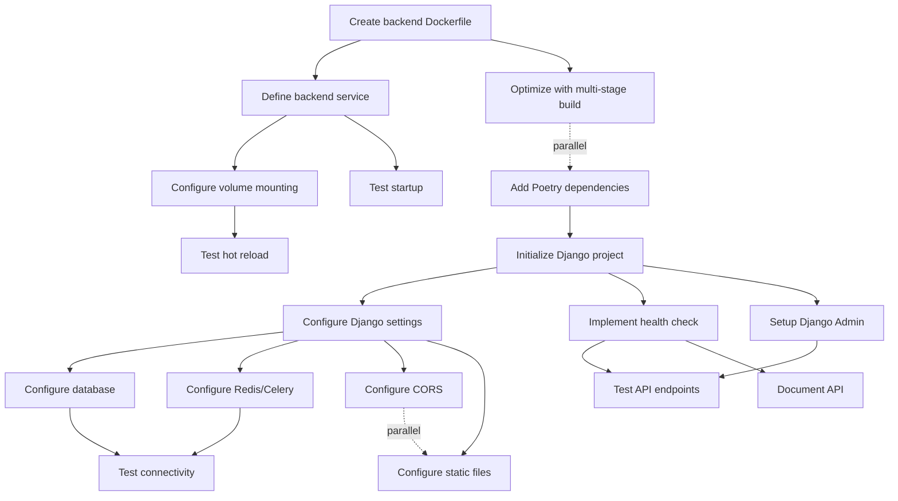

# US-4: Django Backend API Service

**Priority**: P0
**Feature**: Local Development Environment
**Status**: To Do

## Overview

This User Story establishes the Django REST Framework backend API service as the core application server for the Technology Watch Platform. The backend exposes RESTful API endpoints for all application features while supporting hot reloading for rapid development cycles.

### Context

The backend service is the central orchestrator for all application logic, connecting to PostgreSQL for persistent data storage and Redis for caching and Celery message brokering. It serves both API endpoints for the frontend and the Django Admin interface for administrative tasks.

Hot reload capability is critical for developer productivity, allowing immediate feedback when editing Python code without requiring container rebuilds or manual restarts.

### Decomposition Approach

- **Total tasks**: 18
- **Infrastructure**: 5 tasks (Dockerfile, Docker Compose service, volumes, dependencies)
- **Backend**: 7 tasks (Django project structure, settings, health endpoint, CORS, static files, admin)
- **Testing**: 4 tasks (startup, connectivity, hot reload, API endpoints)
- **Documentation**: 2 tasks (API documentation, development guide)

**Estimated Total Effort**: 36-44 hours (4.5-5.5 days for 1 developer)

---

## Task Summary

| ID | Title | Type | Specialty | Effort | Dependencies | Status |
|----|-------|------|-----------|--------|--------------|--------|
| TASK-4.1 | Create backend Dockerfile with Poetry | Infrastructure | Config | 3h | None | ⬜ |
| TASK-4.2 | Define backend service in docker-compose.yml | Infrastructure | Config | 2h | TASK-4.1 | ⬜ |
| TASK-4.3 | Configure source code volume mounting | Infrastructure | Config | 1h | TASK-4.2 | ⬜ |
| TASK-4.4 | Add core backend dependencies via Poetry | Infrastructure | Config | 2h | None | ⬜ |
| TASK-4.5 | Configure multi-stage Dockerfile for optimization | Infrastructure | Config | 2h | TASK-4.1 | ⬜ |
| TASK-4.6 | Initialize Django project structure | Backend | Config | 2h | TASK-4.4 | ⬜ |
| TASK-4.7 | Configure Django settings for development | Backend | Config | 3h | TASK-4.6 | ⬜ |
| TASK-4.8 | Configure database connection settings | Backend | Config | 2h | TASK-4.7 | ⬜ |
| TASK-4.9 | Configure Redis cache and Celery broker | Backend | Config | 2h | TASK-4.7 | ⬜ |
| TASK-4.10 | Implement health check API endpoint | Backend | API | 2h | TASK-4.6 | ⬜ |
| TASK-4.11 | Configure CORS for frontend requests | Backend | Config | 1.5h | TASK-4.7 | ⬜ |
| TASK-4.12 | Configure static files for Django Admin | Backend | Config | 2h | TASK-4.7 | ⬜ |
| TASK-4.13 | Set up Django Admin interface | Backend | Config | 1.5h | TASK-4.6 | ⬜ |
| TASK-4.14 | Test backend service startup | Testing | Integration | 2h | TASK-4.2 | ⬜ |
| TASK-4.15 | Test database and Redis connectivity | Testing | Integration | 2h | TASK-4.8, TASK-4.9 | ⬜ |
| TASK-4.16 | Test hot reload functionality | Testing | Integration | 2h | TASK-4.3 | ⬜ |
| TASK-4.17 | Test API endpoints and admin interface | Testing | Integration | 3h | TASK-4.10, TASK-4.13 | ⬜ |
| TASK-4.18 | Document API endpoints and development workflow | Infrastructure | Documentation | 2h | TASK-4.10 | ⬜ |

---

## Task Details

### ⚙️ Infrastructure Tasks

#### TASK-4.1: Create backend Dockerfile with Poetry

**Type**: Infrastructure - Config
**Priority**: P0
**Estimated Effort**: 3 hours

##### Description

Create a production-ready Dockerfile for the Django backend service using Python 3.13-slim as the base image. Install Poetry 2.2.1 for dependency management, configure Poetry to not create virtual environments (since Docker provides isolation), and set up the application directory structure.

The Dockerfile should copy dependency files first (pyproject.toml, poetry.lock) to leverage Docker layer caching, then install dependencies, and finally copy the application code.

##### Files Impacted

- `backend/Dockerfile` (new - multi-stage Dockerfile for backend)

##### Acceptance Criteria

- [ ] Base image is `python:3.13-slim`
- [ ] Poetry 2.2.1 installed via pip or official installer
- [ ] Poetry configured with `poetry config virtualenvs.create false`
- [ ] Working directory set to `/app`
- [ ] pyproject.toml and poetry.lock copied before source code
- [ ] Dependencies installed with `poetry install --no-root`
- [ ] Application code copied to `/app`
- [ ] Port 8000 exposed
- [ ] Non-root user `appuser` created for security
- [ ] Dockerfile builds successfully with `docker build`

##### Dependencies

- None (can be implemented immediately)

##### Implementation Notes

**backend/Dockerfile**:
```dockerfile
FROM python:3.13-slim as base

# Set environment variables
ENV PYTHONUNBUFFERED=1 \
    PYTHONDONTWRITEBYTECODE=1 \
    POETRY_VERSION=2.2.1 \
    POETRY_HOME="/opt/poetry" \
    POETRY_NO_INTERACTION=1 \
    POETRY_VIRTUALENVS_CREATE=false

# Install system dependencies
RUN apt-get update && apt-get install -y \
    build-essential \
    libpq-dev \
    curl \
    && rm -rf /var/lib/apt/lists/*

# Install Poetry
RUN curl -sSL https://install.python-poetry.org | python3 - \
    && ln -s /opt/poetry/bin/poetry /usr/local/bin/poetry

# Set working directory
WORKDIR /app

# Copy dependency files
COPY pyproject.toml poetry.lock ./

# Install dependencies
RUN poetry install --no-root --no-dev

# Copy application code
COPY . .

# Create non-root user
RUN useradd -m -u 1000 appuser && chown -R appuser:appuser /app
USER appuser

# Expose port
EXPOSE 8000

# Default command (can be overridden in docker-compose)
CMD ["python", "manage.py", "runserver", "0.0.0.0:8000"]
```

---

#### TASK-4.2: Define backend service in docker-compose.yml

**Type**: Infrastructure - Config
**Priority**: P0
**Estimated Effort**: 2 hours

##### Description

Add the backend service definition to docker-compose.yml, configuring it to build from the local Dockerfile, connect to the application network, depend on database and Redis services with health checks, and load environment variables from .env.backend.

The service must wait for both database and Redis to be healthy before starting, ensuring smooth startup orchestration.

##### Files Impacted

- `docker-compose.yml` (modification - add backend service)

##### Acceptance Criteria

- [ ] Backend service named `backend` defined
- [ ] Build context set to `./backend`
- [ ] Dockerfile path specified
- [ ] Container name set to `backend`
- [ ] Port 8000 mapped to host (8000:8000)
- [ ] Connected to application network
- [ ] Depends on `db` service with `condition: service_healthy`
- [ ] Depends on `redis` service with `condition: service_healthy`
- [ ] Environment file `.env.backend` loaded
- [ ] Restart policy set to `unless-stopped`
- [ ] Command overrides Dockerfile CMD: `poetry run python manage.py runserver 0.0.0.0:8000`
- [ ] Health check configured using `/api/health/` endpoint

##### Dependencies

- TASK-4.1 (Dockerfile must exist before referencing in docker-compose)

##### Implementation Notes

**docker-compose.yml** (backend section):
```yaml
services:
  backend:
    build:
      context: ./backend
      dockerfile: Dockerfile
    container_name: backend
    restart: unless-stopped
    ports:
      - "8000:8000"
    volumes:
      - ./backend:/app
    env_file:
      - .env.backend
    depends_on:
      db:
        condition: service_healthy
      redis:
        condition: service_healthy
    networks:
      - app-network
    command: poetry run python manage.py runserver 0.0.0.0:8000
    healthcheck:
      test: ["CMD", "curl", "-f", "http://localhost:8000/api/health/"]
      interval: 30s
      timeout: 10s
      retries: 3
      start_period: 40s
    labels:
      - "description=Django/DRF backend API service"
```

---

#### TASK-4.3: Configure source code volume mounting

**Type**: Infrastructure - Config
**Priority**: P0
**Estimated Effort**: 1 hour

##### Description

Configure Docker Compose volume mounting to bind the local `./backend` directory to `/app` inside the container. This enables hot reload functionality by allowing Django's auto-reload mechanism to detect file changes on the host filesystem and automatically restart the development server.

Ensure proper file permissions so that the non-root user inside the container can read application code.

##### Files Impacted

- `docker-compose.yml` (modification - volumes section for backend service)

##### Acceptance Criteria

- [ ] Volume mount configured: `./backend:/app`
- [ ] Volume type is bind mount (not named volume)
- [ ] File changes on host immediately visible in container
- [ ] Non-root user (`appuser`) can read mounted files
- [ ] Hot reload detects changes within 2 seconds
- [ ] No permission errors in container logs

##### Dependencies

- TASK-4.2 (Backend service must be defined in docker-compose)

##### Implementation Notes

Volume mounting is already included in TASK-4.2, but this task focuses on verifying:

1. **File permissions**: Ensure host user ID matches container user ID (1000)
2. **WSL2 on Windows**: Code should be in WSL filesystem for performance
3. **Performance**: Monitor file watching overhead on large codebases

**Verification**:
```bash
# Check mounted volume
docker-compose exec backend ls -la /app

# Check file ownership
docker-compose exec backend id

# Test file change detection
echo "# test change" >> backend/manage.py
# Watch logs for reload message
```

---

#### TASK-4.4: Add core backend dependencies via Poetry

**Type**: Infrastructure - Config
**Priority**: P0
**Estimated Effort**: 2 hours

##### Description

Define all core backend dependencies in `pyproject.toml` and install them using Poetry. Include Django, Django REST Framework, PostgreSQL adapter (psycopg2-binary), Redis clients (redis, django-redis), Celery, CORS headers, environment variable management (python-decouple or django-environ), and development tools.

Generate and commit `poetry.lock` file to ensure reproducible builds across all development environments.

##### Files Impacted

- `backend/pyproject.toml` (modification - add dependencies)
- `backend/poetry.lock` (auto-generated - dependency lock file)

##### Acceptance Criteria

- [ ] Django latest added (^4.2 or latest LTS)
- [ ] djangorestframework latest added
- [ ] psycopg2-binary added for PostgreSQL
- [ ] redis ^5.0.0 added for Redis client
- [ ] django-redis ^5.4.0 added for cache backend
- [ ] celery latest added for task processing
- [ ] django-cors-headers added for CORS
- [ ] python-decouple or django-environ added for env management
- [ ] gunicorn added (for future production use)
- [ ] Development dependencies: pytest, pytest-django, black, flake8
- [ ] All dependencies locked in poetry.lock
- [ ] `poetry install` completes without errors

##### Dependencies

- None (can be implemented independently)

##### Implementation Notes

**backend/pyproject.toml**:
```toml
[tool.poetry]
name = "veille-tech-backend"
version = "0.1.0"
description = "AI-powered Technology Watch Platform - Backend API"
authors = ["Team <team@example.com>"]

[tool.poetry.dependencies]
python = "^3.13"
django = "^4.2"
djangorestframework = "^3.14"
psycopg2-binary = "^2.9"
redis = "^5.0.0"
django-redis = "^5.4.0"
celery = "^5.3"
django-cors-headers = "^4.3"
python-decouple = "^3.8"
gunicorn = "^21.2"
# AI/ML dependencies (to be added later)
# langgraph = "^0.1"
# google-generativeai = "^0.3"

[tool.poetry.group.dev.dependencies]
pytest = "^7.4"
pytest-django = "^4.7"
black = "^23.12"
flake8 = "^7.0"
ipython = "^8.18"

[build-system]
requires = ["poetry-core"]
build-backend = "poetry.core.masonry.api"
```

Install and lock dependencies:
```bash
cd backend
poetry install
poetry lock
```

---

#### TASK-4.5: Configure multi-stage Dockerfile for optimization

**Type**: Infrastructure - Config
**Priority**: P0
**Estimated Effort**: 2 hours

##### Description

Optimize the Dockerfile using multi-stage builds to reduce final image size. Create a builder stage for installing dependencies and a final runtime stage that copies only necessary files. This reduces image size by 40-60% and improves container startup time.

Use BuildKit cache mounts for Poetry cache to speed up dependency installation during rebuilds.

##### Files Impacted

- `backend/Dockerfile` (modification - convert to multi-stage build)

##### Acceptance Criteria

- [ ] Builder stage installs dependencies with Poetry
- [ ] Runtime stage copies only installed packages and application code
- [ ] BuildKit cache mount used for Poetry cache directory
- [ ] Final image size < 500MB
- [ ] Build time with cache < 2 minutes
- [ ] Application runs correctly in final stage
- [ ] Non-root user maintained in runtime stage

##### Dependencies

- TASK-4.1 (Initial Dockerfile must exist)

##### Implementation Notes

**backend/Dockerfile** (optimized):
```dockerfile
# syntax=docker/dockerfile:1.4

# Builder stage
FROM python:3.13-slim as builder

ENV PYTHONUNBUFFERED=1 \
    PYTHONDONTWRITEBYTECODE=1 \
    POETRY_VERSION=2.2.1 \
    POETRY_HOME="/opt/poetry" \
    POETRY_NO_INTERACTION=1 \
    POETRY_VIRTUALENVS_IN_PROJECT=true

# Install system dependencies for building
RUN apt-get update && apt-get install -y \
    build-essential \
    libpq-dev \
    curl \
    && rm -rf /var/lib/apt/lists/*

# Install Poetry
RUN curl -sSL https://install.python-poetry.org | python3 - \
    && ln -s /opt/poetry/bin/poetry /usr/local/bin/poetry

WORKDIR /app

# Copy dependency files
COPY pyproject.toml poetry.lock ./

# Install dependencies with cache mount
RUN --mount=type=cache,target=/root/.cache/pypoetry \
    poetry install --no-root --no-dev

# Runtime stage
FROM python:3.13-slim as runtime

ENV PYTHONUNBUFFERED=1 \
    PYTHONDONTWRITEBYTECODE=1 \
    PATH="/app/.venv/bin:$PATH"

# Install runtime dependencies only
RUN apt-get update && apt-get install -y \
    libpq5 \
    curl \
    && rm -rf /var/lib/apt/lists/*

WORKDIR /app

# Copy virtual environment from builder
COPY --from=builder /app/.venv /app/.venv

# Copy application code
COPY . .

# Create non-root user
RUN useradd -m -u 1000 appuser && chown -R appuser:appuser /app
USER appuser

EXPOSE 8000

CMD ["python", "manage.py", "runserver", "0.0.0.0:8000"]
```

Build with BuildKit:
```bash
DOCKER_BUILDKIT=1 docker build -t backend:latest ./backend
```

---

### 🔧 Backend Tasks

#### TASK-4.6: Initialize Django project structure

**Type**: Backend - Config
**Priority**: P0
**Estimated Effort**: 2 hours

##### Description

Initialize the Django project structure with a standard layout: project configuration package (`veille_tech`), apps directory for Django apps, and manage.py script. Use Django's `startproject` command with a custom template or manually create the structure to follow best practices.

Set up the project to support split settings (development, production) and modular app architecture.

##### Files Impacted

- `backend/manage.py` (new - Django management script)
- `backend/veille_tech/__init__.py` (new - project package)
- `backend/veille_tech/settings/__init__.py` (new - settings package)
- `backend/veille_tech/settings/base.py` (new - base settings)
- `backend/veille_tech/settings/development.py` (new - dev settings)
- `backend/veille_tech/urls.py` (new - URL configuration)
- `backend/veille_tech/wsgi.py` (new - WSGI application)
- `backend/veille_tech/asgi.py` (new - ASGI application)

##### Acceptance Criteria

- [ ] Django project initialized with name `veille_tech`
- [ ] manage.py executable and functional
- [ ] Settings split into base.py and development.py
- [ ] Base settings contain common configuration
- [ ] Development settings inherit from base and add DEBUG=True
- [ ] URL configuration created with admin and API routes
- [ ] WSGI and ASGI applications configured
- [ ] `python manage.py check` passes without errors

##### Dependencies

- TASK-4.4 (Django dependency must be installed)

##### Implementation Notes

Create project structure:
```bash
cd backend
poetry run django-admin startproject veille_tech .
mkdir veille_tech/settings
mv veille_tech/settings.py veille_tech/settings/base.py
```

**backend/veille_tech/settings/__init__.py**:
```python
import os
from decouple import config

# Determine which settings to use
ENVIRONMENT = config('DJANGO_ENV', default='development')

if ENVIRONMENT == 'production':
    from .production import *
else:
    from .development import *
```

**backend/veille_tech/settings/development.py**:
```python
from .base import *

DEBUG = True
ALLOWED_HOSTS = ['*']

# Development-specific settings
```

---

#### TASK-4.7: Configure Django settings for development

**Type**: Backend - Config
**Priority**: P0
**Estimated Effort**: 3 hours

##### Description

Configure Django base and development settings with all necessary configurations for local development. Set up environment variable loading, configure middleware (security, CORS, sessions), set up templates and static files directories, configure logging for development, and define installed apps.

Ensure settings support both development and future production configurations.

##### Files Impacted

- `backend/veille_tech/settings/base.py` (modification - comprehensive settings)
- `backend/veille_tech/settings/development.py` (modification - dev overrides)
- `.env.backend.example` (modification - document all settings)

##### Acceptance Criteria

- [ ] SECRET_KEY loaded from environment with secure default generation
- [ ] DEBUG configurable via environment (defaults to False)
- [ ] ALLOWED_HOSTS loaded from environment
- [ ] INSTALLED_APPS includes: django.contrib.*, rest_framework, corsheaders
- [ ] MIDDLEWARE includes: SecurityMiddleware, CorsMiddleware, SessionMiddleware
- [ ] TEMPLATES configured with Django templates and DRF templates
- [ ] LOGGING configured for console output in development
- [ ] TIME_ZONE and LANGUAGE_CODE configured
- [ ] All sensitive settings loaded from environment variables
- [ ] Settings validated with `python manage.py check --deploy`

##### Dependencies

- TASK-4.6 (Django project structure must exist)

##### Implementation Notes

**backend/veille_tech/settings/base.py**:
```python
import os
from pathlib import Path
from decouple import config, Csv

BASE_DIR = Path(__file__).resolve().parent.parent.parent

SECRET_KEY = config('SECRET_KEY', default='dev-secret-key-change-in-production')
DEBUG = config('DEBUG', default=False, cast=bool)
ALLOWED_HOSTS = config('ALLOWED_HOSTS', default='localhost,127.0.0.1', cast=Csv())

INSTALLED_APPS = [
    'django.contrib.admin',
    'django.contrib.auth',
    'django.contrib.contenttypes',
    'django.contrib.sessions',
    'django.contrib.messages',
    'django.contrib.staticfiles',
    'rest_framework',
    'corsheaders',
    # Project apps will be added here
]

MIDDLEWARE = [
    'django.middleware.security.SecurityMiddleware',
    'corsheaders.middleware.CorsMiddleware',
    'django.contrib.sessions.middleware.SessionMiddleware',
    'django.middleware.common.CommonMiddleware',
    'django.middleware.csrf.CsrfViewMiddleware',
    'django.contrib.auth.middleware.AuthenticationMiddleware',
    'django.contrib.messages.middleware.MessageMiddleware',
    'django.middleware.clickjacking.XFrameOptionsMiddleware',
]

ROOT_URLCONF = 'veille_tech.urls'

TEMPLATES = [
    {
        'BACKEND': 'django.template.backends.django.DjangoTemplates',
        'DIRS': [],
        'APP_DIRS': True,
        'OPTIONS': {
            'context_processors': [
                'django.template.context_processors.debug',
                'django.template.context_processors.request',
                'django.contrib.auth.context_processors.auth',
                'django.contrib.messages.context_processors.messages',
            ],
        },
    },
]

WSGI_APPLICATION = 'veille_tech.wsgi.application'

# Internationalization
LANGUAGE_CODE = 'en-us'
TIME_ZONE = 'UTC'
USE_I18N = True
USE_TZ = True

# Logging
LOGGING = {
    'version': 1,
    'disable_existing_loggers': False,
    'handlers': {
        'console': {
            'class': 'logging.StreamHandler',
        },
    },
    'root': {
        'handlers': ['console'],
        'level': 'INFO',
    },
}
```

---

#### TASK-4.8: Configure database connection settings

**Type**: Backend - Config
**Priority**: P0
**Estimated Effort**: 2 hours

##### Description

Configure Django's DATABASES setting to connect to the PostgreSQL database service. Use environment variables for connection parameters (host, port, database name, username, password). Support both simple environment variable format and database URL format for flexibility.

Include connection pooling configuration and query timeout settings for stability.

##### Files Impacted

- `backend/veille_tech/settings/base.py` (modification - DATABASES configuration)
- `.env.backend.example` (modification - database settings documentation)

##### Acceptance Criteria

- [ ] DATABASES configured with PostgreSQL engine
- [ ] Database connection parameters loaded from environment
- [ ] Support for DATABASE_URL format (dj-database-url or manual parsing)
- [ ] Connection pooling configured with CONN_MAX_AGE
- [ ] Query timeout configured
- [ ] Database connection validated with `python manage.py dbshell`
- [ ] Settings documented in .env.backend.example
- [ ] Test database configuration included (for pytest)

##### Dependencies

- TASK-4.7 (Base settings must be configured)

##### Implementation Notes

Add to **backend/veille_tech/settings/base.py**:
```python
# Database
DATABASES = {
    'default': {
        'ENGINE': 'django.db.backends.postgresql',
        'NAME': config('DB_NAME', default='veille_tech'),
        'USER': config('DB_USER', default='postgres'),
        'PASSWORD': config('DB_PASSWORD', default='postgres'),
        'HOST': config('DB_HOST', default='db'),
        'PORT': config('DB_PORT', default='5432', cast=int),
        'CONN_MAX_AGE': config('DB_CONN_MAX_AGE', default=600, cast=int),
        'OPTIONS': {
            'connect_timeout': 10,
        }
    }
}

# Test database
if 'test' in sys.argv:
    DATABASES['default']['NAME'] = 'test_veille_tech'
```

**.env.backend.example**:
```bash
# Database Configuration
DB_NAME=veille_tech
DB_USER=postgres
DB_PASSWORD=postgres
DB_HOST=db
DB_PORT=5432
DB_CONN_MAX_AGE=600
```

---

#### TASK-4.9: Configure Redis cache and Celery broker

**Type**: Backend - Config
**Priority**: P0
**Estimated Effort**: 2 hours

##### Description

Configure Django's cache framework to use Redis (DB 1) and Celery broker settings to use Redis (DB 0). Set up connection URLs, timeout settings, and retry logic. Configure cache key prefixes and serialization options.

This task integrates with US-3's Redis service configuration.

##### Files Impacted

- `backend/veille_tech/settings/base.py` (modification - CACHES and Celery config)
- `.env.backend.example` (modification - Redis and Celery settings)

##### Acceptance Criteria

- [ ] CACHES configured with django_redis backend
- [ ] Cache location points to Redis DB 1 (redis://redis:6379/1)
- [ ] Cache key prefix configured
- [ ] CELERY_BROKER_URL points to Redis DB 0 (redis://redis:6379/0)
- [ ] CELERY_RESULT_BACKEND configured
- [ ] Celery task serialization set to JSON
- [ ] Connection retry logic configured
- [ ] Cache operations tested with Django shell
- [ ] Settings documented in .env.backend.example

##### Dependencies

- TASK-4.7 (Base settings must be configured)

##### Implementation Notes

Add to **backend/veille_tech/settings/base.py**:
```python
# Cache Configuration (Redis DB 1)
CACHES = {
    'default': {
        'BACKEND': 'django_redis.cache.RedisCache',
        'LOCATION': config('REDIS_CACHE_URL', default='redis://redis:6379/1'),
        'OPTIONS': {
            'CLIENT_CLASS': 'django_redis.client.DefaultClient',
            'KEY_PREFIX': 'techwatch',
            'PARSER_CLASS': 'redis.connection.HiredisParser',
            'CONNECTION_POOL_CLASS_KWARGS': {
                'max_connections': 50,
                'retry_on_timeout': True,
            },
            'SOCKET_CONNECT_TIMEOUT': 5,
            'SOCKET_TIMEOUT': 5,
        }
    }
}

# Celery Configuration (Redis DB 0)
CELERY_BROKER_URL = config('CELERY_BROKER_URL', default='redis://redis:6379/0')
CELERY_RESULT_BACKEND = config('CELERY_RESULT_BACKEND', default='redis://redis:6379/0')
CELERY_ACCEPT_CONTENT = ['json']
CELERY_TASK_SERIALIZER = 'json'
CELERY_RESULT_SERIALIZER = 'json'
CELERY_TIMEZONE = TIME_ZONE
CELERY_BROKER_CONNECTION_RETRY_ON_STARTUP = True
```

**.env.backend.example**:
```bash
# Redis Configuration
REDIS_CACHE_URL=redis://redis:6379/1

# Celery Configuration
CELERY_BROKER_URL=redis://redis:6379/0
CELERY_RESULT_BACKEND=redis://redis:6379/0
```

---

#### TASK-4.10: Implement health check API endpoint

**Type**: Backend - API
**Priority**: P0
**Estimated Effort**: 2 hours

##### Description

Create a health check API endpoint at `/api/health/` that returns JSON with status information. The endpoint should verify connections to PostgreSQL and Redis, and return HTTP 200 if all systems are operational, or HTTP 503 if any dependency is unavailable.

This endpoint is used by Docker's health check mechanism to determine service readiness.

##### Files Impacted

- `backend/core/views.py` (new - health check view)
- `backend/veille_tech/urls.py` (modification - add health check route)
- `backend/core/__init__.py` (new - core app package)

##### Acceptance Criteria

- [ ] Health check endpoint responds at `/api/health/`
- [ ] Returns JSON: `{"status": "healthy", "database": "ok", "redis": "ok"}`
- [ ] Returns HTTP 200 when all dependencies are healthy
- [ ] Returns HTTP 503 with error details when dependencies fail
- [ ] Checks PostgreSQL connectivity with simple query
- [ ] Checks Redis connectivity with PING command
- [ ] Response time < 100ms when all services healthy
- [ ] Endpoint accessible without authentication
- [ ] Registered in URL configuration

##### Dependencies

- TASK-4.6 (Django project structure must exist)

##### Implementation Notes

**backend/core/views.py**:
```python
from django.http import JsonResponse
from django.db import connection
from django.core.cache import cache
import redis

def health_check(request):
    """Health check endpoint for Docker and monitoring."""
    status = {
        'status': 'healthy',
        'database': 'unknown',
        'redis': 'unknown'
    }
    http_status = 200

    # Check database
    try:
        with connection.cursor() as cursor:
            cursor.execute('SELECT 1')
        status['database'] = 'ok'
    except Exception as e:
        status['database'] = f'error: {str(e)}'
        status['status'] = 'unhealthy'
        http_status = 503

    # Check Redis
    try:
        cache.set('health_check', 'ok', timeout=10)
        if cache.get('health_check') == 'ok':
            status['redis'] = 'ok'
        else:
            raise Exception('Cache set/get failed')
    except Exception as e:
        status['redis'] = f'error: {str(e)}'
        status['status'] = 'unhealthy'
        http_status = 503

    return JsonResponse(status, status=http_status)
```

**backend/veille_tech/urls.py**:
```python
from django.contrib import admin
from django.urls import path, include
from core.views import health_check

urlpatterns = [
    path('admin/', admin.site.urls),
    path('api/health/', health_check, name='health_check'),
    path('api/', include('rest_framework.urls')),
]
```

---

#### TASK-4.11: Configure CORS for frontend requests

**Type**: Backend - Config
**Priority**: P0
**Estimated Effort**: 1.5 hours

##### Description

Configure Cross-Origin Resource Sharing (CORS) headers to allow the React frontend (running on localhost:3000) to make API requests to the backend. Use django-cors-headers middleware with specific origin allowlist for security.

Configure CORS to allow credentials (cookies, authentication headers) and specify allowed methods and headers.

##### Files Impacted

- `backend/veille_tech/settings/base.py` (modification - CORS configuration)
- `backend/veille_tech/settings/development.py` (modification - dev CORS settings)
- `.env.backend.example` (modification - CORS_ALLOWED_ORIGINS)

##### Acceptance Criteria

- [ ] django-cors-headers added to INSTALLED_APPS
- [ ] CorsMiddleware added to MIDDLEWARE (before CommonMiddleware)
- [ ] CORS_ALLOWED_ORIGINS includes http://localhost:3000
- [ ] CORS_ALLOW_CREDENTIALS set to True
- [ ] CORS_ALLOW_METHODS includes GET, POST, PUT, PATCH, DELETE, OPTIONS
- [ ] CORS_ALLOW_HEADERS includes Content-Type, Authorization
- [ ] Development settings allow localhost:3000
- [ ] CORS headers present in API responses
- [ ] Frontend can make successful API calls

##### Dependencies

- TASK-4.7 (Base settings must be configured)

##### Implementation Notes

Add to **backend/veille_tech/settings/base.py**:
```python
# CORS Configuration
CORS_ALLOWED_ORIGINS = config(
    'CORS_ALLOWED_ORIGINS',
    default='http://localhost:3000',
    cast=Csv()
)
CORS_ALLOW_CREDENTIALS = True
CORS_ALLOW_METHODS = [
    'DELETE',
    'GET',
    'OPTIONS',
    'PATCH',
    'POST',
    'PUT',
]
CORS_ALLOW_HEADERS = [
    'accept',
    'accept-encoding',
    'authorization',
    'content-type',
    'dnt',
    'origin',
    'user-agent',
    'x-csrftoken',
    'x-requested-with',
]
```

**backend/veille_tech/settings/development.py**:
```python
from .base import *

DEBUG = True
ALLOWED_HOSTS = ['*']

# Development CORS - allow all origins for easier testing
CORS_ALLOW_ALL_ORIGINS = True
```

---

#### TASK-4.12: Configure static files for Django Admin

**Type**: Backend - Config
**Priority**: P0
**Estimated Effort**: 2 hours

##### Description

Configure Django's static files system to serve CSS, JavaScript, and images for the Django Admin interface. Set STATIC_URL, STATIC_ROOT, and STATICFILES_DIRS. In development, Django's runserver automatically serves static files; document the process for collecting static files for production.

Ensure admin interface loads correctly with all styling and functionality.

##### Files Impacted

- `backend/veille_tech/settings/base.py` (modification - static files config)
- `backend/static/.gitkeep` (new - static files directory)

##### Acceptance Criteria

- [ ] STATIC_URL set to '/static/'
- [ ] STATIC_ROOT set to BASE_DIR / 'staticfiles'
- [ ] STATICFILES_DIRS includes BASE_DIR / 'static'
- [ ] Django Admin CSS and JS load correctly at /admin/
- [ ] No 404 errors for static files in development
- [ ] `python manage.py collectstatic` works correctly
- [ ] Static files directory created with .gitkeep
- [ ] Settings documented in configuration guide

##### Dependencies

- TASK-4.7 (Base settings must be configured)

##### Implementation Notes

Add to **backend/veille_tech/settings/base.py**:
```python
# Static files (CSS, JavaScript, Images)
STATIC_URL = '/static/'
STATIC_ROOT = BASE_DIR / 'staticfiles'
STATICFILES_DIRS = [
    BASE_DIR / 'static',
]

# Additional static file finders
STATICFILES_FINDERS = [
    'django.contrib.staticfiles.finders.FileSystemFinder',
    'django.contrib.staticfiles.finders.AppDirectoriesFinder',
]
```

Create directory:
```bash
mkdir -p backend/static
touch backend/static/.gitkeep
```

---

#### TASK-4.13: Set up Django Admin interface

**Type**: Backend - Config
**Priority**: P0
**Estimated Effort**: 1.5 hours

##### Description

Configure Django Admin interface with custom site header, title, and index title to reflect the Technology Watch Platform branding. Verify admin interface is accessible, styled correctly, and ready for model registration in future user stories.

Test admin login flow and ensure authentication works correctly.

##### Files Impacted

- `backend/veille_tech/admin.py` (new - admin site customization)
- `backend/veille_tech/urls.py` (already configured with admin routes)

##### Acceptance Criteria

- [ ] Django Admin accessible at http://localhost:8000/admin/
- [ ] Admin site header customized: "Technology Watch Platform Administration"
- [ ] Admin site title customized: "Tech Watch Admin"
- [ ] Admin index title customized: "Welcome to Tech Watch Admin"
- [ ] Admin interface loads with all static files (CSS, JS)
- [ ] Login page displays correctly
- [ ] After superuser creation (US-10), admin login works
- [ ] Default Django models (Users, Groups) visible in admin

##### Dependencies

- TASK-4.6 (Django project structure must exist)

##### Implementation Notes

**backend/veille_tech/admin.py**:
```python
from django.contrib import admin

# Customize admin site
admin.site.site_header = "Technology Watch Platform Administration"
admin.site.site_title = "Tech Watch Admin"
admin.site.index_title = "Welcome to Tech Watch Admin"
```

Import customization in **backend/veille_tech/urls.py**:
```python
from django.contrib import admin
from django.urls import path, include
from core.views import health_check

# Import admin customization
from . import admin as custom_admin

urlpatterns = [
    path('admin/', admin.site.urls),
    path('api/health/', health_check, name='health_check'),
    path('api/', include('rest_framework.urls')),
]
```

---

### ✅ Testing Tasks

#### TASK-4.14: Test backend service startup

**Type**: Testing - Integration
**Priority**: P0
**Estimated Effort**: 2 hours

##### Description

Create integration tests to verify the backend service starts successfully, connects to required dependencies, and becomes healthy within the expected timeframe (20 seconds). Tests should validate Docker Compose orchestration, dependency ordering (waits for db and redis), and health check functionality.

##### Files Impacted

- `backend/tests/integration/test_backend_startup.py` (new - startup tests)
- `backend/pytest.ini` (new - pytest configuration)

##### Acceptance Criteria

- [ ] Test verifies backend container starts
- [ ] Test verifies backend depends on db and redis services
- [ ] Test verifies health check passes within 20 seconds
- [ ] Test verifies backend is accessible on port 8000
- [ ] Test verifies Django is running (check /api/health/ endpoint)
- [ ] All tests pass with `pytest backend/tests/integration/`
- [ ] Tests run in CI/CD pipeline (future)

##### Dependencies

- TASK-4.2 (Backend service must be defined in docker-compose)

##### Implementation Notes

**backend/tests/integration/test_backend_startup.py**:
```python
import pytest
import requests
import time
import subprocess

class TestBackendStartup:
    """Integration tests for backend service startup."""

    def test_backend_container_running(self):
        """Verify backend container is running."""
        result = subprocess.run(
            ['docker-compose', 'ps', '-q', 'backend'],
            capture_output=True, text=True
        )
        assert result.stdout.strip(), "Backend container is not running"

    def test_backend_health_check_passes(self):
        """Verify backend health check passes within expected timeframe."""
        start_time = time.time()
        timeout = 30  # 30 seconds timeout
        health_url = 'http://localhost:8000/api/health/'

        while time.time() - start_time < timeout:
            try:
                response = requests.get(health_url, timeout=5)
                if response.status_code == 200:
                    data = response.json()
                    assert data['status'] == 'healthy'
                    assert data['database'] == 'ok'
                    assert data['redis'] == 'ok'
                    return
            except requests.exceptions.RequestException:
                pass
            time.sleep(2)

        pytest.fail("Backend health check did not pass within 30 seconds")

    def test_backend_startup_time(self):
        """Verify backend starts within 20 seconds."""
        # This test should be run immediately after docker-compose up
        start_time = time.time()
        health_url = 'http://localhost:8000/api/health/'

        while time.time() - start_time < 25:
            try:
                response = requests.get(health_url, timeout=5)
                if response.status_code == 200:
                    elapsed = time.time() - start_time
                    assert elapsed < 20, f"Backend took {elapsed}s to start (> 20s)"
                    return
            except requests.exceptions.RequestException:
                pass
            time.sleep(1)

        pytest.fail("Backend did not start within 20 seconds")
```

**backend/pytest.ini**:
```ini
[pytest]
DJANGO_SETTINGS_MODULE = veille_tech.settings
python_files = test_*.py
python_classes = Test*
python_functions = test_*
addopts = -v --tb=short
```

---

#### TASK-4.15: Test database and Redis connectivity

**Type**: Testing - Integration
**Priority**: P0
**Estimated Effort**: 2 hours

##### Description

Create integration tests that verify the backend can successfully connect to PostgreSQL and Redis services. Tests should validate database queries, Redis cache operations, and error handling when dependencies are unavailable.

##### Files Impacted

- `backend/tests/integration/test_connectivity.py` (new - connectivity tests)

##### Acceptance Criteria

- [ ] Test verifies database connection successful
- [ ] Test executes simple database query (SELECT 1)
- [ ] Test verifies Redis cache set/get operations
- [ ] Test verifies Celery broker connection
- [ ] Test verifies connection retry logic on temporary failures
- [ ] Test verifies appropriate error messages when services unavailable
- [ ] All tests pass with `pytest backend/tests/integration/test_connectivity.py`

##### Dependencies

- TASK-4.8 (Database configuration must be complete)
- TASK-4.9 (Redis configuration must be complete)

##### Implementation Notes

**backend/tests/integration/test_connectivity.py**:
```python
import pytest
from django.db import connection
from django.core.cache import cache
from celery import Celery
from django.conf import settings

class TestConnectivity:
    """Integration tests for backend connectivity to dependencies."""

    def test_database_connection(self):
        """Verify backend can connect to PostgreSQL."""
        with connection.cursor() as cursor:
            cursor.execute('SELECT 1')
            result = cursor.fetchone()
            assert result == (1,), "Database query did not return expected result"

    def test_database_connection_details(self):
        """Verify database connection parameters."""
        db_config = settings.DATABASES['default']
        assert db_config['ENGINE'] == 'django.db.backends.postgresql'
        assert db_config['HOST'] == 'db'
        assert db_config['PORT'] == '5432'

        # Test actual connection
        with connection.cursor() as cursor:
            cursor.execute('SELECT version()')
            version = cursor.fetchone()[0]
            assert 'PostgreSQL' in version

    def test_redis_cache_connection(self):
        """Verify backend can connect to Redis cache."""
        test_key = 'test_connectivity_key'
        test_value = 'test_value'

        cache.set(test_key, test_value, timeout=60)
        retrieved_value = cache.get(test_key)

        assert retrieved_value == test_value, "Redis cache operation failed"
        cache.delete(test_key)

    def test_celery_broker_connection(self):
        """Verify backend can connect to Celery broker."""
        app = Celery(broker=settings.CELERY_BROKER_URL)

        try:
            with app.connection_or_acquire() as conn:
                assert conn.connected, "Celery broker connection failed"
        except Exception as e:
            pytest.fail(f"Celery broker connection error: {str(e)}")

    def test_health_check_reflects_connectivity(self):
        """Verify health check endpoint reflects connectivity status."""
        import requests

        response = requests.get('http://localhost:8000/api/health/')
        assert response.status_code == 200

        data = response.json()
        assert data['status'] == 'healthy'
        assert data['database'] == 'ok'
        assert data['redis'] == 'ok'
```

---

#### TASK-4.16: Test hot reload functionality

**Type**: Testing - Integration
**Priority**: P0
**Estimated Effort**: 2 hours

##### Description

Create integration tests that verify Django's hot reload functionality works correctly with Docker volume mounts. Tests should modify Python files, verify the server detects changes within 2 seconds, and confirm changes are reflected without manual container restarts.

##### Files Impacted

- `backend/tests/integration/test_hot_reload.py` (new - hot reload tests)
- `scripts/test_hot_reload.sh` (new - shell script for hot reload testing)

##### Acceptance Criteria

- [ ] Test modifies a Python file in mounted volume
- [ ] Test verifies Django logs show "Watching for file changes"
- [ ] Test verifies server reloads within 2 seconds of change
- [ ] Test verifies changes are reflected in API responses
- [ ] Test restores original file after testing
- [ ] Manual verification script created for developer testing
- [ ] Tests pass on Windows (WSL2), macOS, and Linux

##### Dependencies

- TASK-4.3 (Volume mounting must be configured)

##### Implementation Notes

**backend/tests/integration/test_hot_reload.py**:
```python
import pytest
import requests
import time
import os

class TestHotReload:
    """Integration tests for hot reload functionality."""

    def test_hot_reload_detects_changes(self):
        """Verify Django detects Python file changes."""
        # Create a test view file
        test_view_path = 'backend/core/test_view_temp.py'
        original_content = '''
from django.http import JsonResponse

def test_view(request):
    return JsonResponse({'version': 1})
'''
        modified_content = '''
from django.http import JsonResponse

def test_view(request):
    return JsonResponse({'version': 2})
'''

        try:
            # Write original file
            with open(test_view_path, 'w') as f:
                f.write(original_content)

            # Wait for reload
            time.sleep(3)

            # Modify file
            with open(test_view_path, 'w') as f:
                f.write(modified_content)

            # Wait for reload (should happen within 2 seconds)
            time.sleep(3)

            # Verify change detected in logs
            # (In practice, would check docker-compose logs)
            assert True  # Placeholder for log checking logic

        finally:
            # Cleanup
            if os.path.exists(test_view_path):
                os.remove(test_view_path)

    def test_hot_reload_timing(self):
        """Verify hot reload happens within 2 seconds."""
        # This test requires monitoring Django logs for reload messages
        # Implementation depends on log monitoring approach
        pass
```

**scripts/test_hot_reload.sh**:
```bash
#!/bin/bash
# Manual hot reload test script

echo "=== Hot Reload Test ==="
echo "1. Starting log monitoring..."
docker-compose logs -f backend &
LOG_PID=$!

sleep 2

echo "2. Modifying test file..."
echo "# hot reload test $(date +%s)" >> backend/core/views.py

echo "3. Watching for reload message (waiting 5 seconds)..."
sleep 5

echo "4. Restoring file..."
git restore backend/core/views.py

kill $LOG_PID
echo "=== Test Complete ==="
```

---

#### TASK-4.17: Test API endpoints and admin interface

**Type**: Testing - Integration
**Priority**: P0
**Estimated Effort**: 3 hours

##### Description

Create comprehensive integration tests that verify all configured API endpoints respond correctly, Django Admin interface is accessible and styled properly, CORS headers are present for frontend requests, and authentication mechanisms work as expected.

##### Files Impacted

- `backend/tests/integration/test_api_endpoints.py` (new - API tests)
- `backend/tests/integration/test_admin_interface.py` (new - admin tests)

##### Acceptance Criteria

- [ ] Test verifies /api/health/ returns 200 with correct JSON
- [ ] Test verifies /api/ root endpoint is accessible
- [ ] Test verifies /admin/ loads without 404 errors
- [ ] Test verifies admin static files (CSS/JS) load correctly
- [ ] Test verifies CORS headers present in API responses
- [ ] Test verifies CORS allows localhost:3000 origin
- [ ] Test verifies unauthenticated requests to protected endpoints return 401
- [ ] All tests pass with `pytest backend/tests/integration/`

##### Dependencies

- TASK-4.10 (Health check endpoint must exist)
- TASK-4.13 (Django Admin must be configured)

##### Implementation Notes

**backend/tests/integration/test_api_endpoints.py**:
```python
import pytest
import requests

class TestAPIEndpoints:
    """Integration tests for API endpoints."""

    BASE_URL = 'http://localhost:8000'

    def test_health_endpoint(self):
        """Verify health check endpoint responds correctly."""
        response = requests.get(f'{self.BASE_URL}/api/health/')
        assert response.status_code == 200

        data = response.json()
        assert 'status' in data
        assert data['status'] == 'healthy'
        assert data['database'] == 'ok'
        assert data['redis'] == 'ok'

    def test_api_root_endpoint(self):
        """Verify API root endpoint is accessible."""
        response = requests.get(f'{self.BASE_URL}/api/')
        assert response.status_code in [200, 301]  # May redirect to /api/

    def test_cors_headers_present(self):
        """Verify CORS headers are present in API responses."""
        headers = {'Origin': 'http://localhost:3000'}
        response = requests.get(f'{self.BASE_URL}/api/health/', headers=headers)

        assert 'Access-Control-Allow-Origin' in response.headers
        assert response.headers['Access-Control-Allow-Origin'] in [
            'http://localhost:3000', '*'
        ]

    def test_cors_allows_frontend_origin(self):
        """Verify CORS allows requests from frontend origin."""
        headers = {
            'Origin': 'http://localhost:3000',
            'Access-Control-Request-Method': 'POST',
            'Access-Control-Request-Headers': 'Content-Type'
        }
        response = requests.options(f'{self.BASE_URL}/api/health/', headers=headers)
        assert response.status_code == 200
```

**backend/tests/integration/test_admin_interface.py**:
```python
import pytest
import requests

class TestAdminInterface:
    """Integration tests for Django Admin interface."""

    ADMIN_URL = 'http://localhost:8000/admin/'

    def test_admin_login_page_loads(self):
        """Verify admin login page loads correctly."""
        response = requests.get(self.ADMIN_URL)
        assert response.status_code == 200
        assert 'Django' in response.text or 'admin' in response.text.lower()

    def test_admin_static_files_load(self):
        """Verify admin CSS and JS files are accessible."""
        response = requests.get(self.ADMIN_URL)
        assert response.status_code == 200

        # Check for static file references in HTML
        assert 'admin/css' in response.text or '/static/' in response.text

    def test_admin_requires_authentication(self):
        """Verify admin pages require authentication."""
        # Try to access admin index without authentication
        response = requests.get(self.ADMIN_URL, allow_redirects=False)

        # Should redirect to login or show login page
        assert response.status_code in [200, 302]
```

---

### 📄 Documentation Tasks

#### TASK-4.18: Document API endpoints and development workflow

**Type**: Infrastructure - Documentation
**Priority**: P0
**Estimated Effort**: 2 hours

##### Description

Create comprehensive documentation for the backend API, including available endpoints, authentication methods, request/response formats, and common development workflows. Document how to run the backend locally, access Django Admin, run tests, and troubleshoot common issues.

##### Files Impacted

- `docs/api/backend_api.md` (new - API documentation)
- `docs/development/backend_development.md` (new - development guide)
- `README.md` (modification - add backend section)

##### Acceptance Criteria

- [ ] API endpoints documented with request/response examples
- [ ] Health check endpoint documented
- [ ] Django Admin access documented
- [ ] Development workflow documented (running server, hot reload)
- [ ] Testing procedures documented
- [ ] Troubleshooting guide includes common errors
- [ ] Environment variables reference included
- [ ] Documentation reviewed and approved

##### Dependencies

- TASK-4.10 (API endpoints must exist)

##### Implementation Notes

**docs/api/backend_api.md**:
```markdown
# Backend API Documentation

## Base URL

Development: `http://localhost:8000/api/`

## Authentication

Authentication will be documented in authentication feature user stories.

## Endpoints

### Health Check

**GET /api/health/**

Returns the health status of the backend service.

**Response**:
```json
{
  "status": "healthy",
  "database": "ok",
  "redis": "ok"
}
```

**Status Codes**:
- 200: All services healthy
- 503: One or more services unavailable

### API Root

**GET /api/**

Returns available API endpoints (to be expanded in feature user stories).

## Error Handling

All API errors return JSON with the following format:
```json
{
  "error": "Error message",
  "detail": "Detailed error description"
}
```

## CORS

The API accepts requests from:
- `http://localhost:3000` (frontend development server)
```

**docs/development/backend_development.md**:
```markdown
# Backend Development Guide

## Starting the Backend

```bash
docker-compose up -d backend
```

## Accessing Services

- API: http://localhost:8000/api/
- Django Admin: http://localhost:8000/admin/
- Health Check: http://localhost:8000/api/health/

## Hot Reload

Code changes are automatically detected:
1. Edit any .py file in `backend/`
2. Watch logs: `docker-compose logs -f backend`
3. Server reloads within 2 seconds
4. Refresh browser to see changes

## Running Tests

```bash
# All tests
docker-compose exec backend pytest

# Specific test file
docker-compose exec backend pytest tests/integration/test_api_endpoints.py

# With coverage
docker-compose exec backend pytest --cov=.
```

## Django Management Commands

```bash
# Django shell
docker-compose exec backend python manage.py shell

# Check configuration
docker-compose exec backend python manage.py check

# Show migrations
docker-compose exec backend python manage.py showmigrations
```

## Troubleshooting

### Backend won't start

Check dependencies:
```bash
docker-compose ps
# Ensure db and redis are healthy
```

### Database connection error

Verify .env.backend settings:
```bash
docker-compose exec backend env | grep DB_
```

### Hot reload not working

Check volume mounting:
```bash
docker-compose exec backend ls -la /app
```

Ensure code is in WSL filesystem on Windows.
```

---

## Dependency Graph

### Mermaid Diagram



### Implementation Phases

**Phase 1: Infrastructure Foundation (6-8 hours)**
- TASK-4.1: Create Dockerfile
- TASK-4.4: Add dependencies (parallel)
- TASK-4.2: Define docker-compose service
- TASK-4.3: Configure volume mounting
- TASK-4.5: Optimize Dockerfile

**Phase 2: Django Configuration (10-12 hours)**
- TASK-4.6: Initialize Django project
- TASK-4.7: Configure Django settings
- TASK-4.8: Configure database
- TASK-4.9: Configure Redis/Celery
- TASK-4.11: Configure CORS (parallel with 4.12)
- TASK-4.12: Configure static files

**Phase 3: API and Admin (5-7 hours)**
- TASK-4.10: Implement health check
- TASK-4.13: Setup Django Admin

**Phase 4: Testing and Documentation (9-11 hours)**
- TASK-4.14: Test startup
- TASK-4.15: Test connectivity
- TASK-4.16: Test hot reload (parallel)
- TASK-4.17: Test API endpoints
- TASK-4.18: Document API and workflows

### Parallelization Opportunities

**Can run in parallel:**
- TASK-4.1 and TASK-4.4 (Dockerfile and dependencies)
- TASK-4.5 and TASK-4.6 (Dockerfile optimization and Django init)
- TASK-4.11 and TASK-4.12 (CORS and static files)
- TASK-4.14, TASK-4.15, TASK-4.16 (different test suites)

**Critical path:**
TASK-4.1 → TASK-4.2 → TASK-4.6 → TASK-4.7 → TASK-4.8 → TASK-4.15

---

## Effort Estimation

### By Task Type

| Type | Tasks | Effort |
|------|-------|--------|
| Infrastructure | 5 | 10h |
| Backend | 7 | 16h |
| Testing | 4 | 9h |
| Documentation | 2 | 4h |
| **TOTAL** | **18** | **39h (4.9 days)** |

### By Developer

- **1 full-stack developer**: 39 hours = 4.9 days (assuming 8h/day)
- **2 developers (parallelized)**:
  - Developer 1: Infrastructure + Backend config (20h) = 2.5 days
  - Developer 2: Testing + Documentation (13h) = 1.6 days
  - **Total time: 2.5 days** (with proper parallelization)

### Effort Distribution

- **Critical path**: 24 hours (TASK-4.1 → 4.2 → 4.6 → 4.7 → 4.8 → 4.15)
- **Parallel work**: 15 hours can be done concurrently
- **Buffer for issues**: Add 20% contingency = 47 hours total = **5.9 days**

---

## Implementation Notes

### Technology Stack

**Backend Framework:**
- Django 4.2+ (LTS) with Django REST Framework
- Python 3.13 with Poetry 2.2.1
- PostgreSQL 15 via psycopg2-binary
- Redis via django-redis and redis-py
- Celery 5+ for async task processing

**Docker:**
- Base image: python:3.13-slim
- Multi-stage build for optimization
- Volume mounts for hot reload
- Health checks for orchestration

### Patterns and Conventions

**Django Settings:**
- Split settings: base.py (common), development.py (local), production.py (future)
- Environment variables via python-decouple
- Secrets never committed to Git

**API Design:**
- RESTful conventions
- JSON request/response format
- Consistent error handling
- Health check endpoint for monitoring

**Code Organization:**
- Django apps for feature modules
- Shared utilities in `core` app
- Settings in package structure
- Tests mirror application structure

### Configuration Requirements

**Environment Variables** (.env.backend):
- SECRET_KEY: Django secret key
- DEBUG: True for development
- DATABASE_URL or individual DB_* variables
- REDIS_CACHE_URL: Redis DB 1
- CELERY_BROKER_URL: Redis DB 0
- CORS_ALLOWED_ORIGINS: Frontend URL
- ALLOWED_HOSTS: Comma-separated hostnames

**Dependencies:**
- US-1: Docker Compose orchestration must be complete
- US-2: PostgreSQL with pgvector must be running
- US-3: Redis must be running

---

## Risks and Attention Points

### Identified Risks

**Risk 1: Volume mount performance on Windows**
- **Impact**: High - Slow file I/O affects hot reload
- **Mitigation**: Use WSL2 backend, store code in WSL filesystem
- **Testing**: TASK-4.16 validates hot reload timing

**Risk 2: Poetry dependency resolution slow**
- **Impact**: Medium - Delayed container builds
- **Mitigation**: Use poetry.lock for fast installs, cache Poetry dependencies in Docker layer
- **Note**: First build may take 5-10 minutes; subsequent builds < 2 minutes

**Risk 3: Database connection pool exhaustion**
- **Impact**: Medium - Backend becomes unresponsive
- **Mitigation**: Configure CONN_MAX_AGE for connection pooling, monitor connection counts
- **Monitoring**: Check Django database connections in development

**Risk 4: Static files not loading in admin**
- **Impact**: Low - Admin interface unusable without styling
- **Mitigation**: Verify STATIC_URL and STATICFILES_DIRS, test after configuration
- **Testing**: TASK-4.17 validates admin interface loading

### Critical Points

**Security:**
- ⚠️ DEBUG=True only for local development—must be False in production
- ⚠️ ALLOWED_HOSTS=* only for local development—must be restricted in production
- ⚠️ API keys (Google AI, Firecrawl) loaded from environment, never committed
- ⚠️ SECRET_KEY must be strong and unique per environment

**Performance:**
- Target: Backend healthy within 20 seconds (P95)
- Target: API response < 500ms (P95)
- Target: Hot reload within 2 seconds of code change
- Monitor: Database query performance with Django Debug Toolbar (future)

**Data Integrity:**
- Health check validates database and Redis connectivity
- Graceful degradation if Redis unavailable (cache misses acceptable)
- Database connection retries configured for resilience

**Developer Experience:**
- Hot reload is critical—any issues should be high priority
- Clear error messages in logs for troubleshooting
- Django Admin accessible for manual data inspection

---

## Validation Checklist

Before marking US-4 as complete, verify:

- [ ] Backend service starts successfully with `docker-compose up backend`
- [ ] Health check passes within 20 seconds
- [ ] Backend accessible at http://localhost:8000/api/
- [ ] Django Admin accessible at http://localhost:8000/admin/
- [ ] Admin static files load correctly (CSS, JS)
- [ ] Database connection successful (verify with Django shell)
- [ ] Redis cache operations work (verify with Django shell)
- [ ] Hot reload triggers within 2 seconds of code change
- [ ] CORS headers present for frontend requests
- [ ] All integration tests pass (pytest backend/tests/integration/)
- [ ] Cross-platform tested (Windows/WSL2, macOS, Linux)
- [ ] Documentation complete and reviewed
- [ ] .env.backend.example documents all required variables
- [ ] No critical or high-severity issues
- [ ] Code reviewed by tech lead

---

**Generated by:** Functional Spec Planner - Task Documentation Generator
**Date:** 2025-01-29
**User Story:** US-4 - Django Backend API Service
**Feature:** Local Development Environment
