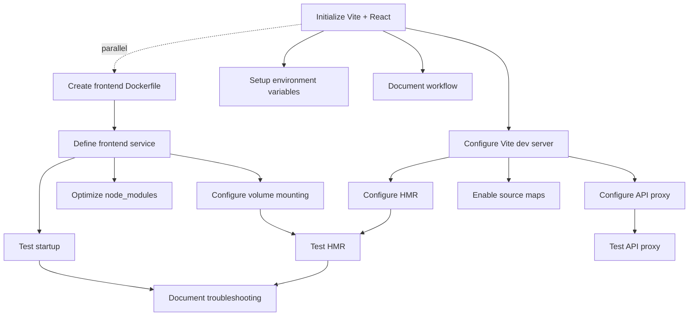

# US-5: React Frontend SPA Service

**Priority**: P0
**Feature**: Local Development Environment
**Status**: To Do

## Overview

This User Story establishes the React single-page application (SPA) frontend service with Vite development server, providing instant hot module replacement (HMR) for rapid UI development. The frontend communicates with the Django backend API through a configured proxy, enabling seamless full-stack development.

### Context

The frontend service is the user-facing interface for the Technology Watch Platform, consuming the backend REST API to display technology reports, manage subscriptions, and handle authentication. Hot Module Replacement is critical for developer productivity, allowing instant feedback when editing React components without losing application state or requiring manual browser refreshes.

The service uses Vite as the development server due to its superior performance compared to Create React App, with sub-second HMR updates and optimized cold start times.

### Decomposition Approach

- **Total tasks**: 15
- **Infrastructure**: 4 tasks (Dockerfile, Docker Compose service, volumes, optimization)
- **Frontend**: 6 tasks (Vite project, API proxy, environment config, error handling, source maps)
- **Testing**: 3 tasks (startup, HMR, API integration)
- **Documentation**: 2 tasks (development guide, troubleshooting)

**Estimated Total Effort**: 24-30 hours (3-3.75 days for 1 developer)

---

## Task Summary

| ID | Title | Type | Specialty | Effort | Dependencies | Status |
|----|-------|------|-----------|--------|--------------|--------|
| TASK-5.1 | Create frontend Dockerfile with Node 20 | Infrastructure | Config | 2h | None | ⬜ |
| TASK-5.2 | Define frontend service in docker-compose.yml | Infrastructure | Config | 2h | TASK-5.1 | ⬜ |
| TASK-5.3 | Configure volume mounting for HMR | Infrastructure | Config | 1.5h | TASK-5.2 | ⬜ |
| TASK-5.4 | Optimize node_modules with named volume | Infrastructure | Config | 1h | TASK-5.2 | ⬜ |
| TASK-5.5 | Initialize Vite + React project | Frontend | Component | 2h | None | ⬜ |
| TASK-5.6 | Configure Vite dev server settings | Frontend | Config | 2h | TASK-5.5 | ⬜ |
| TASK-5.7 | Configure API proxy to backend | Frontend | Config | 2h | TASK-5.6 | ⬜ |
| TASK-5.8 | Set up environment variable management | Frontend | Config | 1.5h | TASK-5.5 | ⬜ |
| TASK-5.9 | Configure HMR and WebSocket settings | Frontend | Config | 1.5h | TASK-5.6 | ⬜ |
| TASK-5.10 | Enable source maps for debugging | Frontend | Config | 1h | TASK-5.6 | ⬜ |
| TASK-5.11 | Test frontend service startup | Testing | Integration | 2h | TASK-5.2 | ⬜ |
| TASK-5.12 | Test HMR functionality | Testing | Integration | 2h | TASK-5.3, TASK-5.9 | ⬜ |
| TASK-5.13 | Test API proxy and backend integration | Testing | Integration | 2.5h | TASK-5.7 | ⬜ |
| TASK-5.14 | Document frontend development workflow | Infrastructure | Documentation | 1.5h | TASK-5.5 | ⬜ |
| TASK-5.15 | Document troubleshooting guide | Infrastructure | Documentation | 1h | TASK-5.11, TASK-5.12 | ⬜ |

---

## Task Details

### ⚙️ Infrastructure Tasks

#### TASK-5.1: Create frontend Dockerfile with Node 20

**Type**: Infrastructure - Config
**Priority**: P0
**Estimated Effort**: 2 hours

##### Description

Create a Dockerfile for the React frontend service using Node 20-alpine as the base image. Configure the container to install npm dependencies, expose port 3000, and run the Vite development server. Use alpine variant for smaller image size and faster builds.

The Dockerfile should copy package files first to leverage Docker layer caching, then install dependencies, and finally copy the application code.

##### Files Impacted

- `frontend/Dockerfile` (new - frontend Dockerfile)

##### Acceptance Criteria

- [ ] Base image is `node:20-alpine`
- [ ] Working directory set to `/app`
- [ ] package.json and package-lock.json copied before source code
- [ ] Dependencies installed with `npm install`
- [ ] Application code copied to `/app`
- [ ] Port 3000 exposed
- [ ] Non-root user `node` used for security
- [ ] Default command: `npm run dev`
- [ ] Dockerfile builds successfully with `docker build`

##### Dependencies

- None (can be implemented immediately)

##### Implementation Notes

**frontend/Dockerfile**:
```dockerfile
FROM node:20-alpine

# Set working directory
WORKDIR /app

# Copy package files
COPY package*.json ./

# Install dependencies
RUN npm install

# Copy application code
COPY . .

# Use non-root user
USER node

# Expose port
EXPOSE 3000

# Start development server
CMD ["npm", "run", "dev"]
```

---

#### TASK-5.2: Define frontend service in docker-compose.yml

**Type**: Infrastructure - Config
**Priority**: P0
**Estimated Effort**: 2 hours

##### Description

Add the frontend service definition to docker-compose.yml, configuring it to build from the local Dockerfile, connect to the application network, depend on the backend service for API availability, and load environment variables from .env.frontend.

The service must expose port 3000 to the host for browser access and configure proper dependency ordering with the backend.

##### Files Impacted

- `docker-compose.yml` (modification - add frontend service)

##### Acceptance Criteria

- [ ] Frontend service named `frontend` defined
- [ ] Build context set to `./frontend`
- [ ] Dockerfile path specified
- [ ] Container name set to `frontend`
- [ ] Port 3000 mapped to host (3000:3000)
- [ ] Connected to application network
- [ ] Depends on `backend` service
- [ ] Environment file `.env.frontend` loaded
- [ ] Restart policy set to `unless-stopped`
- [ ] Command overrides Dockerfile CMD: `npm run dev -- --host 0.0.0.0`

##### Dependencies

- TASK-5.1 (Dockerfile must exist before referencing in docker-compose)

##### Implementation Notes

**docker-compose.yml** (frontend section):
```yaml
services:
  frontend:
    build:
      context: ./frontend
      dockerfile: Dockerfile
    container_name: frontend
    restart: unless-stopped
    ports:
      - "3000:3000"
    volumes:
      - ./frontend:/app
      - frontend_node_modules:/app/node_modules
    env_file:
      - .env.frontend
    depends_on:
      - backend
    networks:
      - app-network
    command: npm run dev -- --host 0.0.0.0
    labels:
      - "description=React frontend SPA with Vite"

volumes:
  frontend_node_modules:
    name: frontend_node_modules
```

---

#### TASK-5.3: Configure volume mounting for HMR

**Type**: Infrastructure - Config
**Priority**: P0
**Estimated Effort**: 1.5 hours

##### Description

Configure Docker Compose volume mounting to bind the local `./frontend` directory to `/app` inside the container, enabling Hot Module Replacement. Ensure proper file permissions and verify that file changes on the host are immediately visible in the container for HMR to detect.

This is critical for the development experience—without proper volume mounting, HMR will not function.

##### Files Impacted

- `docker-compose.yml` (modification - volumes section for frontend service)
- `frontend/vite.config.js` (modification - file watching configuration if needed)

##### Acceptance Criteria

- [ ] Volume mount configured: `./frontend:/app`
- [ ] Volume type is bind mount (not named volume)
- [ ] File changes on host immediately visible in container
- [ ] File watching works correctly (no performance issues)
- [ ] HMR detects changes within 1 second
- [ ] No permission errors in container logs
- [ ] node_modules excluded from bind mount (uses named volume)

##### Dependencies

- TASK-5.2 (Frontend service must be defined in docker-compose)

##### Implementation Notes

Volume mounting is already included in TASK-5.2, but this task focuses on verifying:

1. **File permissions**: Node user can read mounted files
2. **WSL2 on Windows**: Code should be in WSL filesystem for performance
3. **File watching**: Vite's file watcher detects changes correctly

**Verification**:
```bash
# Check mounted volume
docker-compose exec frontend ls -la /app

# Check file ownership
docker-compose exec frontend id

# Test file change detection
echo "// test change" >> frontend/src/App.jsx
# Watch logs for HMR message
docker-compose logs -f frontend
```

---

#### TASK-5.4: Optimize node_modules with named volume

**Type**: Infrastructure - Config
**Priority**: P0
**Estimated Effort**: 1 hour

##### Description

Configure a named Docker volume specifically for `node_modules` directory to significantly improve performance on Windows and macOS Docker Desktop. This separates node_modules from the bind-mounted source code, preventing slow file I/O operations on large dependency trees.

This optimization can reduce HMR latency by 50-70% on non-Linux platforms.

##### Files Impacted

- `docker-compose.yml` (already configured in TASK-5.2 - verify configuration)

##### Acceptance Criteria

- [ ] Named volume `frontend_node_modules` defined
- [ ] Volume mounted to `/app/node_modules` in container
- [ ] node_modules directory not synced to host (stays in Docker)
- [ ] Dependencies persist across container restarts
- [ ] HMR performance acceptable on Windows/macOS (< 1s update time)
- [ ] `npm install` writes to volume, not bind mount

##### Dependencies

- TASK-5.2 (Frontend service must be defined)

##### Implementation Notes

This is already configured in TASK-5.2, but verify:

```yaml
volumes:
  - ./frontend:/app  # Source code bind mount
  - frontend_node_modules:/app/node_modules  # Named volume for node_modules

volumes:
  frontend_node_modules:
    name: frontend_node_modules
```

**Why this works:**
- Bind mount: `./frontend:/app` maps source code
- Named volume: `frontend_node_modules:/app/node_modules` **overrides** the node_modules inside /app
- Result: Source code synced, but node_modules stays in fast Docker volume

---

### 🎨 Frontend Tasks

#### TASK-5.5: Initialize Vite + React project

**Type**: Frontend - Component
**Priority**: P0
**Estimated Effort**: 2 hours

##### Description

Initialize a new React project using Vite as the build tool and development server. Configure Vite with React plugin, set up the basic project structure (src/, public/, index.html), and create a minimal working React application with a sample component.

Vite is chosen over Create React App for superior performance: faster cold starts (< 3 seconds vs 15+ seconds) and instant HMR updates.

##### Files Impacted

- `frontend/package.json` (new - dependencies and scripts)
- `frontend/vite.config.js` (new - Vite configuration)
- `frontend/index.html` (new - HTML entry point)
- `frontend/src/main.jsx` (new - React entry point)
- `frontend/src/App.jsx` (new - root component)
- `frontend/.gitignore` (new - ignore patterns)

##### Acceptance Criteria

- [ ] Vite project initialized with React template
- [ ] React 18+ and Vite latest installed
- [ ] package.json includes dev script: `"dev": "vite"`
- [ ] package.json includes build script: `"build": "vite build"`
- [ ] Basic App.jsx component renders successfully
- [ ] Project structure follows Vite conventions
- [ ] .gitignore includes node_modules, dist, .env.local
- [ ] `npm run dev` starts development server successfully

##### Dependencies

- None (can be implemented independently)

##### Implementation Notes

Initialize project:
```bash
cd frontend
npm create vite@latest . -- --template react
npm install
```

**frontend/package.json**:
```json
{
  "name": "veille-tech-frontend",
  "version": "0.1.0",
  "type": "module",
  "scripts": {
    "dev": "vite",
    "build": "vite build",
    "preview": "vite preview"
  },
  "dependencies": {
    "react": "^18.2.0",
    "react-dom": "^18.2.0"
  },
  "devDependencies": {
    "@vitejs/plugin-react": "^4.2.0",
    "vite": "^5.0.0"
  }
}
```

**frontend/src/App.jsx**:
```jsx
function App() {
  return (
    <div className="App">
      <h1>Technology Watch Platform</h1>
      <p>AI-powered technology monitoring</p>
    </div>
  )
}

export default App
```

---

#### TASK-5.6: Configure Vite dev server settings

**Type**: Frontend - Config
**Priority**: P0
**Estimated Effort**: 2 hours

##### Description

Configure Vite development server settings in `vite.config.js` to work correctly within Docker containers. Set host to `0.0.0.0` to allow external connections, configure HMR, set up the React plugin, and configure build options for source maps and error overlays.

Proper configuration ensures the dev server is accessible from the host machine and HMR functions correctly across the Docker network.

##### Files Impacted

- `frontend/vite.config.js` (modification - comprehensive dev server config)

##### Acceptance Criteria

- [ ] Server host set to `0.0.0.0` for Docker accessibility
- [ ] Server port set to 3000
- [ ] React plugin configured with Fast Refresh enabled
- [ ] HMR configuration includes WebSocket settings
- [ ] Source maps enabled for development
- [ ] Build options configured for error overlay
- [ ] CORS settings allow backend origin if needed
- [ ] Development server accessible from host at localhost:3000

##### Dependencies

- TASK-5.5 (Vite project must be initialized)

##### Implementation Notes

**frontend/vite.config.js**:
```js
import { defineConfig } from 'vite'
import react from '@vitejs/plugin-react'

export default defineConfig({
  plugins: [
    react({
      fastRefresh: true,
    })
  ],
  server: {
    host: '0.0.0.0',  // Allow external connections (Docker)
    port: 3000,
    strictPort: true,  // Fail if port already in use
    watch: {
      usePolling: false,  // Use native file watching (faster)
      interval: 100,  // Polling interval if usePolling enabled
    },
    hmr: {
      // HMR configuration for Docker
      clientPort: 3000,
    }
  },
  build: {
    sourcemap: true,  // Enable source maps for debugging
    outDir: 'dist',
  },
  resolve: {
    alias: {
      '@': '/src',  // Allow import from '@/components/...'
    },
  },
})
```

---

#### TASK-5.7: Configure API proxy to backend

**Type**: Frontend - Config
**Priority**: P0
**Estimated Effort**: 2 hours

##### Description

Configure Vite's development server proxy to forward API requests from the frontend to the Django backend service. This eliminates CORS issues during development by making the frontend dev server act as a reverse proxy, routing `/api` requests to `http://backend:8000/api`.

The proxy configuration ensures seamless backend integration without requiring CORS configuration changes on the backend for local development.

##### Files Impacted

- `frontend/vite.config.js` (modification - add proxy configuration)
- `.env.frontend.example` (new - document API URL)

##### Acceptance Criteria

- [ ] Proxy configured in vite.config.js server section
- [ ] `/api` requests proxied to `http://backend:8000/api`
- [ ] `changeOrigin: true` set to rewrite Host header
- [ ] Proxy timeout configured (30 seconds)
- [ ] Proxy logs requests in development mode
- [ ] Backend API accessible via `/api/health/` from frontend
- [ ] No CORS errors when making API requests
- [ ] Environment variable VITE_API_URL documented

##### Dependencies

- TASK-5.6 (Vite dev server must be configured)

##### Implementation Notes

Add to **frontend/vite.config.js**:
```js
import { defineConfig } from 'vite'
import react from '@vitejs/plugin-react'

export default defineConfig({
  plugins: [react()],
  server: {
    host: '0.0.0.0',
    port: 3000,
    proxy: {
      '/api': {
        target: 'http://backend:8000',
        changeOrigin: true,
        secure: false,
        rewrite: (path) => path,  // Keep /api prefix
        configure: (proxy, options) => {
          proxy.on('error', (err, req, res) => {
            console.log('Proxy error:', err);
          });
          proxy.on('proxyReq', (proxyReq, req, res) => {
            console.log('Proxying:', req.method, req.url);
          });
        },
      },
    },
  },
})
```

**.env.frontend.example**:
```bash
# API Configuration
# In Docker, API is proxied via Vite dev server: /api -> http://backend:8000/api
VITE_API_URL=/api

# For production builds, use full URL:
# VITE_API_URL=https://api.example.com
```

---

#### TASK-5.8: Set up environment variable management

**Type**: Frontend - Config
**Priority**: P0
**Estimated Effort**: 1.5 hours

##### Description

Configure environment variable management for the frontend using Vite's built-in environment variable support. Create `.env.frontend.example` template, document all required variables, and configure the application to load environment variables prefixed with `VITE_`.

Proper environment variable management allows easy configuration switching between development and production.

##### Files Impacted

- `.env.frontend.example` (new - environment template)
- `.env.frontend` (new - actual environment values, gitignored)
- `frontend/.gitignore` (modification - add .env.local, .env.frontend)
- `frontend/src/config.js` (new - centralized config)

##### Acceptance Criteria

- [ ] .env.frontend.example created with all variables documented
- [ ] .env.frontend.example committed to Git
- [ ] .env.frontend file gitignored (not committed)
- [ ] All environment variables prefixed with VITE_
- [ ] API URL configurable via VITE_API_URL
- [ ] Environment variables accessible via `import.meta.env.VITE_*`
- [ ] Centralized config.js exports typed configuration
- [ ] Documentation explains how to set up environment variables

##### Dependencies

- TASK-5.5 (Vite project must be initialized)

##### Implementation Notes

**.env.frontend.example**:
```bash
# API Configuration
VITE_API_URL=/api

# Feature Flags
VITE_ENABLE_ANALYTICS=false
VITE_ENABLE_DEBUG=true

# Azure AD SSO (optional, for future authentication)
# VITE_AZURE_CLIENT_ID=your-client-id
# VITE_AZURE_TENANT_ID=your-tenant-id
```

**frontend/src/config.js**:
```js
const config = {
  apiUrl: import.meta.env.VITE_API_URL || '/api',
  enableAnalytics: import.meta.env.VITE_ENABLE_ANALYTICS === 'true',
  enableDebug: import.meta.env.VITE_ENABLE_DEBUG === 'true',
}

export default config
```

Add to **frontend/.gitignore**:
```
.env.local
.env.frontend
.env*.local
```

---

#### TASK-5.9: Configure HMR and WebSocket settings

**Type**: Frontend - Config
**Priority**: P0
**Estimated Effort**: 1.5 hours

##### Description

Fine-tune Hot Module Replacement (HMR) and WebSocket settings in Vite configuration to ensure HMR works reliably within Docker containers. Configure WebSocket protocol, host, port, and polling fallback for scenarios where WebSocket connections fail.

Proper HMR configuration is critical for developer experience—misconfiguration can result in full page reloads instead of instant updates.

##### Files Impacted

- `frontend/vite.config.js` (modification - HMR configuration)

##### Acceptance Criteria

- [ ] HMR enabled and functioning correctly
- [ ] WebSocket connection established on container start
- [ ] HMR clientPort set to 3000 (matches server port)
- [ ] Polling fallback configured for WebSocket failures
- [ ] File watching uses native fs.watch (not polling) for performance
- [ ] HMR overlay displays errors in browser
- [ ] Browser console shows HMR connection status
- [ ] Component changes reflect within 1 second without full reload

##### Dependencies

- TASK-5.6 (Vite dev server must be configured)

##### Implementation Notes

This is partially covered in TASK-5.6, but ensure these specific settings:

**frontend/vite.config.js** (HMR section):
```js
export default defineConfig({
  server: {
    host: '0.0.0.0',
    port: 3000,
    watch: {
      usePolling: false,  // Native watching (faster)
      // Enable polling if HMR doesn't work on your system:
      // usePolling: true,
      // interval: 1000,
    },
    hmr: {
      protocol: 'ws',  // WebSocket protocol
      host: 'localhost',  // Host for HMR client
      port: 3000,  // Port for HMR
      clientPort: 3000,  // Port client should connect to
      overlay: true,  // Show error overlay in browser
    },
  },
})
```

**Testing HMR:**
```bash
# Start frontend
docker-compose up -d frontend

# Watch logs
docker-compose logs -f frontend

# Edit a file and check logs for:
# "[vite] hot updated: /src/App.jsx"
```

---

#### TASK-5.10: Enable source maps for debugging

**Type**: Frontend - Config
**Priority**: P0
**Estimated Effort**: 1 hour

##### Description

Configure Vite to generate source maps during development, enabling developers to debug original source code in browser DevTools instead of transpiled/bundled code. Source maps map compiled code back to the original source files, making debugging significantly easier.

##### Files Impacted

- `frontend/vite.config.js` (modification - build configuration)

##### Acceptance Criteria

- [ ] Source maps enabled in development mode
- [ ] build.sourcemap set to true in Vite config
- [ ] Browser DevTools shows original .jsx files (not bundled .js)
- [ ] Breakpoints work in original source files
- [ ] Console error stack traces reference original files
- [ ] Source maps DO NOT include in production builds (future task)
- [ ] .map files visible in browser DevTools Sources panel

##### Dependencies

- TASK-5.6 (Vite dev server must be configured)

##### Implementation Notes

Already included in TASK-5.6 but verify:

**frontend/vite.config.js**:
```js
export default defineConfig({
  build: {
    sourcemap: true,  // Enable source maps
    minify: false,  // Don't minify in dev for easier debugging
  },
})
```

**Verification:**
1. Open http://localhost:3000 in Chrome/Firefox
2. Open DevTools (F12)
3. Go to Sources tab
4. Should see webpack:// or vite:// section with original .jsx files
5. Set a breakpoint in App.jsx
6. Trigger the code path
7. Debugger should pause at original source line

---

### ✅ Testing Tasks

#### TASK-5.11: Test frontend service startup

**Type**: Testing - Integration
**Priority**: P0
**Estimated Effort**: 2 hours

##### Description

Create integration tests that verify the frontend service starts successfully, becomes accessible on port 3000, and serves the React application correctly. Tests should validate Docker Compose orchestration, dependency on backend service, and initial page load.

##### Files Impacted

- `frontend/tests/integration/test_frontend_startup.sh` (new - startup test script)
- `scripts/test_frontend.sh` (new - test runner script)

##### Acceptance Criteria

- [ ] Test verifies frontend container starts
- [ ] Test verifies frontend accessible at http://localhost:3000
- [ ] Test verifies initial page loads within 15 seconds
- [ ] Test verifies HTML contains React root element
- [ ] Test verifies Vite dev server logs show "ready" message
- [ ] Test verifies dependencies (backend) are met
- [ ] All tests pass with exit code 0

##### Dependencies

- TASK-5.2 (Frontend service must be defined in docker-compose)

##### Implementation Notes

**scripts/test_frontend.sh**:
```bash
#!/bin/bash
# Frontend startup integration tests

echo "=== Frontend Startup Tests ==="

# Test 1: Container running
echo "[TEST 1] Frontend container running"
if docker-compose ps frontend | grep -q "Up"; then
    echo "✓ Frontend container is running"
else
    echo "✗ Frontend container is not running"
    exit 1
fi

# Test 2: Service accessible
echo "[TEST 2] Frontend accessible on port 3000"
timeout=30
start=$(date +%s)
while [ $(($(date +%s) - start)) -lt $timeout ]; do
    if curl -f http://localhost:3000 > /dev/null 2>&1; then
        elapsed=$(($(date +%s) - start))
        echo "✓ Frontend accessible in ${elapsed}s"
        break
    fi
    sleep 2
done

if [ $(($(date +%s) - start)) -ge $timeout ]; then
    echo "✗ Frontend not accessible within ${timeout}s"
    exit 1
fi

# Test 3: React app loads
echo "[TEST 3] React application loads"
response=$(curl -s http://localhost:3000)
if echo "$response" | grep -q '<div id="root">'; then
    echo "✓ React root element found"
else
    echo "✗ React root element not found"
    exit 1
fi

# Test 4: Vite server logs
echo "[TEST 4] Vite dev server ready"
if docker-compose logs frontend | grep -q "ready in"; then
    echo "✓ Vite server started successfully"
else
    echo "⚠ Could not confirm Vite server ready (check logs)"
fi

echo ""
echo "=== All Tests Passed ==="
```

---

#### TASK-5.12: Test HMR functionality

**Type**: Testing - Integration
**Priority**: P0
**Estimated Effort**: 2 hours

##### Description

Create integration tests that verify Hot Module Replacement works correctly by modifying source files and checking that changes are reflected in the browser without full page reloads. Tests should measure HMR update latency and verify WebSocket connection status.

##### Files Impacted

- `scripts/test_hmr.sh` (new - HMR test script)
- `frontend/tests/integration/test_hmr.js` (new - automated HMR tests with Playwright)

##### Acceptance Criteria

- [ ] Test modifies a React component file
- [ ] Test verifies changes reflected in browser within 2 seconds
- [ ] Test verifies page did NOT fully reload (state preserved)
- [ ] Test verifies WebSocket connection in browser console
- [ ] Test verifies Vite logs show "hot updated" message
- [ ] Test restores original file after testing
- [ ] Manual test script provided for developer verification

##### Dependencies

- TASK-5.3 (Volume mounting must be configured)
- TASK-5.9 (HMR must be configured)

##### Implementation Notes

**scripts/test_hmr.sh**:
```bash
#!/bin/bash
# Hot Module Replacement test script

echo "=== HMR Functionality Test ==="

# Backup original file
cp frontend/src/App.jsx frontend/src/App.jsx.backup

# Modify file
echo "[TEST] Modifying App.jsx..."
sed -i 's/<h1>Technology Watch Platform<\/h1>/<h1>HMR Test - Modified<\/h1>/g' frontend/src/App.jsx

# Wait for HMR
echo "[TEST] Waiting for HMR update (max 5 seconds)..."
sleep 3

# Check logs for HMR message
if docker-compose logs --tail=20 frontend | grep -q "hot updated"; then
    echo "✓ HMR detected and processed file change"
else
    echo "⚠ HMR message not found in logs"
fi

# Verify change reflected (would need headless browser for full test)
echo "[TEST] Verify change at http://localhost:3000 (manual check)"

# Restore original
echo "[TEST] Restoring original file..."
mv frontend/src/App.jsx.backup frontend/src/App.jsx

sleep 2
echo ""
echo "✓ HMR test complete - Check browser for instant updates"
```

**Note**: Full automated HMR testing would require Playwright or Puppeteer to:
1. Open browser to frontend
2. Inject counter state
3. Modify component
4. Verify counter state preserved (not reset)
5. Verify visual change occurred

---

#### TASK-5.13: Test API proxy and backend integration

**Type**: Testing - Integration
**Priority**: P0
**Estimated Effort**: 2.5 hours

##### Description

Create integration tests that verify the Vite API proxy correctly forwards requests to the Django backend, handles responses properly, and does not introduce CORS errors. Tests should make actual HTTP requests through the proxy and validate responses.

##### Files Impacted

- `frontend/tests/integration/test_api_proxy.sh` (new - proxy test script)
- `frontend/src/services/api.test.js` (new - API client tests)

##### Acceptance Criteria

- [ ] Test verifies /api/health/ endpoint accessible via proxy
- [ ] Test verifies proxy forwards requests to backend correctly
- [ ] Test verifies response headers include correct content-type
- [ ] Test verifies no CORS errors in browser console
- [ ] Test verifies proxy latency < 100ms
- [ ] Test verifies error handling when backend unavailable
- [ ] All tests pass with exit code 0

##### Dependencies

- TASK-5.7 (API proxy must be configured)

##### Implementation Notes

**scripts/test_api_proxy.sh**:
```bash
#!/bin/bash
# API proxy integration tests

echo "=== API Proxy Tests ==="

# Test 1: Health endpoint via proxy
echo "[TEST 1] API health endpoint via proxy"
response=$(curl -s http://localhost:3000/api/health/)
if echo "$response" | grep -q '"status"'; then
    echo "✓ API proxy forwarding works"
    echo "  Response: $response"
else
    echo "✗ API proxy not working"
    exit 1
fi

# Test 2: Proxy latency
echo "[TEST 2] Proxy latency measurement"
start=$(date +%s%3N)
curl -s http://localhost:3000/api/health/ > /dev/null
end=$(date +%s%3N)
latency=$((end - start))
echo "  Proxy latency: ${latency}ms"
if [ $latency -lt 100 ]; then
    echo "✓ Latency acceptable (< 100ms)"
else
    echo "⚠ Latency high: ${latency}ms"
fi

# Test 3: CORS headers
echo "[TEST 3] CORS headers check"
headers=$(curl -s -D - http://localhost:3000/api/health/ -o /dev/null)
if echo "$headers" | grep -qi "access-control-allow-origin"; then
    echo "✓ CORS headers present (if needed)"
else
    echo "ℹ No CORS headers (proxy handles CORS)"
fi

echo ""
echo "=== All Proxy Tests Passed ==="
```

**frontend/src/services/api.js** (simple API client for testing):
```js
import config from '../config'

export async function fetchHealth() {
  const response = await fetch(`${config.apiUrl}/health/`)
  if (!response.ok) {
    throw new Error(`HTTP error! status: ${response.status}`)
  }
  return await response.json()
}

export default {
  fetchHealth,
}
```

---

### 📄 Documentation Tasks

#### TASK-5.14: Document frontend development workflow

**Type**: Infrastructure - Documentation
**Priority**: P0
**Estimated Effort**: 1.5 hours

##### Description

Create comprehensive documentation for frontend development workflows, including how to start the frontend service, access the application, make code changes with HMR, debug in browser DevTools, and interact with the backend API. Include common development tasks and best practices.

##### Files Impacted

- `docs/development/frontend_development.md` (new - frontend guide)
- `README.md` (modification - add frontend section)

##### Acceptance Criteria

- [ ] Frontend startup instructions documented
- [ ] HMR workflow explained with examples
- [ ] Debugging guide with source maps instructions
- [ ] API integration examples provided
- [ ] Common development tasks documented
- [ ] Environment variables reference included
- [ ] npm commands reference documented
- [ ] Documentation reviewed and approved

##### Dependencies

- TASK-5.5 (Vite project must be initialized)

##### Implementation Notes

**docs/development/frontend_development.md**:
```markdown
# Frontend Development Guide

## Starting the Frontend

```bash
docker-compose up -d frontend
```

## Accessing the Application

- Frontend: http://localhost:3000
- Backend API (via proxy): http://localhost:3000/api/

## Hot Module Replacement (HMR)

Code changes are automatically detected and applied instantly:

1. Edit any file in `frontend/src/`
2. Save the file
3. Browser updates within 1 second (no full reload)
4. Component state preserved across updates

**Example:**
```jsx
// Edit frontend/src/App.jsx
function App() {
  return <h1>My Changes Appear Instantly!</h1>
}
```

## Debugging

### Browser DevTools

1. Open http://localhost:3000
2. Press F12 to open DevTools
3. Go to Sources tab
4. Navigate to webpack:// or vite:// section
5. Find your original .jsx files
6. Set breakpoints in original source code

### Console Logging

```jsx
console.log('Debug message:', someVariable)
```

Logs appear in browser DevTools Console tab.

## API Integration

### Making API Requests

```jsx
import config from './config'

async function fetchData() {
  const response = await fetch(`${config.apiUrl}/health/`)
  const data = await response.json()
  return data
}
```

### API Proxy

All requests to `/api/*` are automatically proxied to backend:

- Frontend: `http://localhost:3000/api/health/`
- Proxied to: `http://backend:8000/api/health/`
- No CORS issues!

## Common Tasks

### Install New Package

```bash
docker-compose exec frontend npm install package-name
```

### Run Build

```bash
docker-compose exec frontend npm run build
```

### View Logs

```bash
docker-compose logs -f frontend
```

### Restart Frontend

```bash
docker-compose restart frontend
```

## Environment Variables

See `.env.frontend.example` for available variables.

Copy and customize:
```bash
cp .env.frontend.example .env.frontend
```

## npm Commands

- `npm run dev`: Start development server
- `npm run build`: Build for production
- `npm run preview`: Preview production build

## Troubleshooting

See [Frontend Troubleshooting Guide](./frontend_troubleshooting.md)
```

---

#### TASK-5.15: Document troubleshooting guide

**Type**: Infrastructure - Documentation
**Priority**: P0
**Estimated Effort**: 1 hour

##### Description

Create a troubleshooting guide for common frontend development issues, including HMR not working, port conflicts, node_modules issues, API proxy errors, and performance problems. Include diagnostic commands and step-by-step solutions.

##### Files Impacted

- `docs/development/frontend_troubleshooting.md` (new - troubleshooting guide)

##### Acceptance Criteria

- [ ] Common issues documented with solutions
- [ ] HMR troubleshooting section included
- [ ] API proxy errors covered
- [ ] Performance issues addressed
- [ ] Diagnostic commands provided
- [ ] Platform-specific issues covered (Windows, macOS, Linux)
- [ ] Documentation reviewed and approved

##### Dependencies

- TASK-5.11 (Startup tests reveal common issues)
- TASK-5.12 (HMR tests reveal common issues)

##### Implementation Notes

**docs/development/frontend_troubleshooting.md**:
```markdown
# Frontend Troubleshooting Guide

## Common Issues and Solutions

### HMR Not Working

**Symptoms:** Changes don't appear in browser, full reload required

**Solutions:**

1. **Check volume mounting:**
   ```bash
   docker-compose exec frontend ls -la /app/src
   # Should see your source files
   ```

2. **Enable polling (if native watching fails):**
   ```js
   // frontend/vite.config.js
   server: {
     watch: {
       usePolling: true,
       interval: 1000,
     }
   }
   ```

3. **Check file watching limits (Linux/macOS):**
   ```bash
   # Increase file watch limit
   echo fs.inotify.max_user_watches=524288 | sudo tee -a /etc/sysctl.conf
   sudo sysctl -p
   ```

4. **Verify WebSocket connection:**
   - Open browser console
   - Should see: "[vite] connected"
   - If not, check HMR settings in vite.config.js

### Port 3000 Already in Use

**Symptoms:** Cannot start frontend, port conflict error

**Solutions:**

1. **Find and stop conflicting process:**
   ```bash
   # Windows
   netstat -ano | findstr :3000
   taskkill /PID <PID> /F

   # macOS/Linux
   lsof -ti:3000
   kill -9 <PID>
   ```

2. **Change frontend port:**
   ```yaml
   # docker-compose.yml
   ports:
     - "3001:3000"  # Use different host port
   ```

### node_modules Issues

**Symptoms:** Package not found, dependencies outdated

**Solutions:**

1. **Rebuild node_modules:**
   ```bash
   docker-compose down frontend
   docker volume rm frontend_node_modules
   docker-compose up --build frontend
   ```

2. **Install specific package:**
   ```bash
   docker-compose exec frontend npm install package-name
   ```

### API Proxy Errors

**Symptoms:** API requests fail, CORS errors, 502 Bad Gateway

**Solutions:**

1. **Verify backend is running:**
   ```bash
   docker-compose ps backend
   curl http://localhost:8000/api/health/
   ```

2. **Check proxy configuration:**
   ```js
   // frontend/vite.config.js - verify target
   proxy: {
     '/api': {
       target: 'http://backend:8000',
       changeOrigin: true,
     }
   }
   ```

3. **Check backend logs:**
   ```bash
   docker-compose logs backend
   ```

### Slow HMR Performance

**Symptoms:** HMR takes > 3 seconds, sluggish updates

**Solutions:**

1. **Verify named volume for node_modules:**
   ```bash
   docker volume ls | grep frontend_node_modules
   ```

2. **Use WSL2 filesystem on Windows:**
   - Store code in WSL filesystem, not Windows (C:\)
   - Access via: `\\wsl$\Ubuntu\home\user\project`

3. **Reduce file watching scope:**
   ```js
   // vite.config.js
   server: {
     watch: {
       ignored: ['**/node_modules/**', '**/dist/**']
     }
   }
   ```

### Build Errors in Browser Overlay

**Symptoms:** Red error overlay blocks entire screen

**Solution:**

- Fix the error shown (syntax error, missing import, etc.)
- HMR will automatically clear overlay when fixed
- Or click X to dismiss (error persists in console)

### Container Keeps Restarting

**Symptoms:** Frontend container in restart loop

**Solutions:**

1. **Check logs:**
   ```bash
   docker-compose logs frontend
   ```

2. **Common causes:**
   - Missing package.json
   - Invalid Dockerfile
   - Port conflict
   - Missing dependencies

3. **Rebuild from scratch:**
   ```bash
   docker-compose down
   docker-compose build --no-cache frontend
   docker-compose up frontend
   ```

## Platform-Specific Issues

### Windows (Docker Desktop)

- **Use WSL2 backend** (Settings > General > Use WSL 2)
- **Store code in WSL filesystem** for better performance
- **Named volume for node_modules** is critical

### macOS

- **File watching may hit limits** on large projects
- **Increase limits:** `sudo sysctl -w kern.maxfiles=65536`
- **Use polling** if native watching fails

### Linux

- **File watching limits:** increase inotify watches (see HMR section above)
- **Permissions:** ensure user has read/write access to mounted volumes

## Getting Help

If issues persist:
1. Check Docker Desktop status
2. Restart Docker Desktop
3. Run: `docker-compose down && docker-compose up --build`
4. Check GitHub Issues
5. Ask in team Slack channel
```

---

## Dependency Graph

### Mermaid Diagram



### Implementation Phases

**Phase 1: Infrastructure Setup (5.5 hours)**
- TASK-5.1: Create Dockerfile
- TASK-5.5: Initialize Vite + React (parallel)
- TASK-5.2: Define docker-compose service
- TASK-5.3: Configure volume mounting
- TASK-5.4: Optimize node_modules

**Phase 2: Frontend Configuration (8 hours)**
- TASK-5.6: Configure Vite dev server
- TASK-5.7: Configure API proxy
- TASK-5.8: Setup environment variables (parallel with 5.6)
- TASK-5.9: Configure HMR
- TASK-5.10: Enable source maps

**Phase 3: Testing (6.5 hours)**
- TASK-5.11: Test startup
- TASK-5.12: Test HMR (parallel)
- TASK-5.13: Test API proxy

**Phase 4: Documentation (2.5 hours)**
- TASK-5.14: Document workflow
- TASK-5.15: Document troubleshooting

### Parallelization Opportunities

**Can run in parallel:**
- TASK-5.1 and TASK-5.5 (Dockerfile and Vite init)
- TASK-5.8 and TASK-5.6 (Environment vars and Vite config)
- TASK-5.11 and TASK-5.12 (Different test suites)
- TASK-5.14 and TASK-5.15 (Different documentation files)

**Critical path:**
TASK-5.1 → TASK-5.2 → TASK-5.6 → TASK-5.7 → TASK-5.13

---

## Effort Estimation

### By Task Type

| Type | Tasks | Effort |
|------|-------|--------|
| Infrastructure | 4 | 6.5h |
| Frontend | 6 | 12h |
| Testing | 3 | 6.5h |
| Documentation | 2 | 2.5h |
| **TOTAL** | **15** | **27.5h (3.4 days)** |

### By Developer

- **1 frontend developer**: 27.5 hours = 3.4 days (assuming 8h/day)
- **2 developers (parallelized)**:
  - Developer 1: Infrastructure + Frontend config (14h) = 1.75 days
  - Developer 2: Testing + Documentation (9h) = 1.1 days
  - **Total time: 1.75 days** (with proper parallelization)

### Effort Distribution

- **Critical path**: 16.5 hours (TASK-5.1 → 5.2 → 5.6 → 5.7 → 5.13)
- **Parallel work**: 11 hours can be done concurrently
- **Buffer for issues**: Add 20% contingency = 33 hours total = **4.1 days**

---

## Implementation Notes

### Technology Stack

**Frontend Framework:**
- React 18+ with functional components and hooks
- Vite 5+ for development server (faster than CRA)
- Node 20 LTS for runtime

**Development Tools:**
- Hot Module Replacement (HMR) for instant updates
- Source maps for debugging original code
- API proxy for seamless backend integration
- Environment variables for configuration

**Docker:**
- Base image: node:20-alpine (smaller, faster)
- Named volume for node_modules (performance)
- Bind mount for source code (HMR)

### Patterns and Conventions

**Project Structure:**
```
frontend/
├── src/
│   ├── components/     # Reusable React components
│   ├── pages/          # Page components
│   ├── services/       # API client functions
│   ├── config.js       # Centralized configuration
│   ├── App.jsx         # Root component
│   └── main.jsx        # Entry point
├── public/             # Static assets
├── index.html          # HTML template
├── vite.config.js      # Vite configuration
└── package.json        # Dependencies and scripts
```

**API Integration:**
- All API requests go through proxy: `/api/*`
- Centralized config for API URL
- Error handling in API client layer

**Component Patterns:**
- Functional components with hooks
- Props for data flow
- State management TBD (Context API or Redux in future)

### Configuration Requirements

**Environment Variables** (.env.frontend):
- VITE_API_URL: API base URL (default: /api)
- VITE_ENABLE_DEBUG: Debug mode flag
- Feature flags TBD

**Dependencies:**
- US-1: Docker Compose orchestration must be complete
- US-4: Backend API must be running for proxy testing

---

## Risks and Attention Points

### Identified Risks

**Risk 1: HMR WebSocket connection issues in Docker**
- **Impact**: High - Developers lose instant feedback
- **Mitigation**: Configure HMR with correct host/port, use polling fallback
- **Testing**: TASK-5.12 validates HMR functionality

**Risk 2: node_modules performance on Windows**
- **Impact**: High - Slow HMR, sluggish development
- **Mitigation**: Use named volume for node_modules (TASK-5.4)
- **Note**: Critical for Windows Docker Desktop users

**Risk 3: API proxy timeout or errors**
- **Impact**: Medium - Cannot test full-stack features
- **Mitigation**: Configure reasonable timeout, clear error messages
- **Testing**: TASK-5.13 validates proxy functionality

**Risk 4: File watching limits on Linux/macOS**
- **Impact**: Medium - HMR stops working on large projects
- **Mitigation**: Document how to increase inotify limits
- **Documentation**: TASK-5.15 includes solution

### Critical Points

**Performance:**
- Target: Frontend accessible within 15 seconds (P95)
- Target: HMR updates within 1 second (P95)
- Target: Initial page load < 2 seconds
- Monitor: File watching performance on large projects

**Developer Experience:**
- HMR is critical—any issues should be high priority
- Clear error messages in browser overlay
- Source maps enable easy debugging
- API proxy eliminates CORS frustration

**Configuration:**
- Named volume for node_modules is essential for Windows/macOS
- Vite host `0.0.0.0` required for Docker accessibility
- API proxy configuration must match backend URLs

**Cross-Platform:**
- Windows: Use WSL2 filesystem for best performance
- macOS: May need to increase file watching limits
- Linux: May need to increase inotify watches

---

## Validation Checklist

Before marking US-5 as complete, verify:

- [ ] Frontend service starts successfully with `docker-compose up frontend`
- [ ] Frontend accessible at http://localhost:3000
- [ ] React application loads and displays correctly
- [ ] HMR works: edit component, see instant update (< 1s)
- [ ] WebSocket connection established (check browser console)
- [ ] API proxy works: `/api/health/` returns backend response
- [ ] No CORS errors when making API requests
- [ ] Source maps enabled: original .jsx files visible in DevTools
- [ ] Build errors display in browser overlay
- [ ] node_modules named volume improves performance
- [ ] All integration tests pass
- [ ] Cross-platform tested (Windows/WSL2, macOS, Linux)
- [ ] Documentation complete and reviewed
- [ ] .env.frontend.example documents all variables
- [ ] No critical or high-severity issues
- [ ] Code reviewed by tech lead

---

**Generated by:** Functional Spec Planner - Task Documentation Generator
**Date:** 2025-01-29
**User Story:** US-5 - React Frontend SPA Service
**Feature:** Local Development Environment
