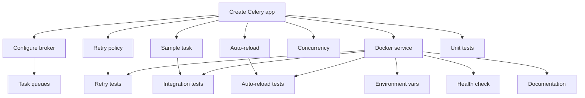

# US-6: Celery Worker Service for AI Pipeline

**Priority**: P0
**Feature**: Local Development Environment
**Status**: To Do

## Overview

This User Story establishes the Celery worker service that executes asynchronous AI pipeline tasks for the Technology Watch Platform. The worker shares the backend codebase but runs a different entry point to process background tasks like web scraping via Firecrawl, LLM-based content analysis using Langgraph agents, and vector embedding generation.

### Context

The Celery worker is critical for the AI pipeline (Bloc 3) implementation. Without it, computationally expensive operations would block API requests, degrading user experience. The worker architecture enables:
- Background execution of Langgraph agent workflows
- Retry logic for resilient API integrations (Google AI Studio, Firecrawl)
- Auto-reload for rapid development iteration
- Concurrent processing of multiple subjects

### Decomposition Approach

The implementation is broken into **15 tasks** across three categories:

- **Backend**: 7 tasks (Celery app, task definitions, settings, retry policies)
- **Testing**: 4 tasks (unit tests, integration tests, error handling verification)
- **Infrastructure**: 4 tasks (Docker service, environment config, health checks, documentation)

The approach follows a sequential foundation → features → testing → deployment pattern, with parallelization opportunities after core Celery configuration is complete.

---

## Task Summary

| ID | Title | Type | Specialty | Effort | Dependencies | Status |
|----|-------|------|-----------|--------|--------------|--------|
| TASK-6.1 | Create Celery app configuration | Backend | Config | 3h | None | ⬜ |
| TASK-6.2 | Configure broker and result backend | Backend | Config | 2h | TASK-6.1 | ⬜ |
| TASK-6.3 | Implement task retry policy | Backend | Config | 2h | TASK-6.1 | ⬜ |
| TASK-6.4 | Create sample test task | Backend | API | 2h | TASK-6.1 | ⬜ |
| TASK-6.5 | Configure task queues | Backend | Config | 2h | TASK-6.2 | ⬜ |
| TASK-6.6 | Enable watchdog for auto-reload | Backend | Config | 1h | TASK-6.1 | ⬜ |
| TASK-6.7 | Configure concurrency and pool | Backend | Performance | 2h | TASK-6.1 | ⬜ |
| TASK-6.8 | Define worker service in docker-compose | Infrastructure | Config | 3h | TASK-6.1 | ⬜ |
| TASK-6.9 | Configure worker environment variables | Infrastructure | Config | 2h | TASK-6.8 | ⬜ |
| TASK-6.10 | Implement worker health check | Infrastructure | Config | 2h | TASK-6.8 | ⬜ |
| TASK-6.11 | Document worker management commands | Infrastructure | Documentation | 2h | TASK-6.8 | ⬜ |
| TASK-6.12 | Unit test Celery app initialization | Testing | Unit | 3h | TASK-6.1 | ⬜ |
| TASK-6.13 | Integration test task execution | Testing | Integration | 4h | TASK-6.4, TASK-6.8 | ⬜ |
| TASK-6.14 | Test task retry behavior | Testing | Integration | 3h | TASK-6.3, TASK-6.8 | ⬜ |
| TASK-6.15 | Test worker auto-reload | Testing | Integration | 2h | TASK-6.6, TASK-6.8 | ⬜ |

**Total Estimated Effort**: 35 hours (4-5 days for 1 developer)

---

## Task Details

### 🔧 Backend Tasks

#### TASK-6.1: Create Celery app configuration

**Type**: Backend - Config
**Priority**: P1
**Estimated Effort**: 3 hours

##### Description

Create the Celery application instance in `backend/veille_tech/celery.py` with Django integration. This file initializes the Celery app, loads configuration from Django settings, and auto-discovers tasks from installed apps. The Celery app serves as the entry point for all asynchronous task execution.

This is the foundational task that all other Celery-related tasks depend on. The configuration must integrate with Django's settings system, enable task result storage, and configure logging for development visibility.

##### Files Impacted

- `backend/veille_tech/celery.py` (new)
- `backend/veille_tech/__init__.py` (modified - import Celery app)
- `backend/config/settings/base.py` (modified - Celery config section)

##### Acceptance Criteria

- [ ] Celery app instance created with `app = Celery('veille_tech')`
- [ ] Django integration configured via `app.config_from_object('django.conf:settings', namespace='CELERY')`
- [ ] Auto-discovery enabled: `app.autodiscover_tasks()`
- [ ] Celery app imported in `__init__.py` for Django startup
- [ ] Logging configured to show task execution details
- [ ] Configuration follows Celery 5+ best practices

##### Dependencies

None (foundational task)

##### Implementation Notes

**Django Integration Pattern**:
```python
from celery import Celery
import os

os.environ.setdefault('DJANGO_SETTINGS_MODULE', 'config.settings.local')

app = Celery('veille_tech')
app.config_from_object('django.conf:settings', namespace='CELERY')
app.autodiscover_tasks()
```

**Required in `__init__.py`**:
```python
from .celery import app as celery_app
__all__ = ('celery_app',)
```

---

#### TASK-6.2: Configure broker and result backend

**Type**: Backend - Config
**Priority**: P1
**Estimated Effort**: 2 hours

##### Description

Configure Redis as both the message broker (for task queues) and result backend (for storing task outcomes). The broker URL must point to the Redis service defined in docker-compose, using the internal Docker network hostname. Result backend configuration enables task result retrieval and debugging.

This task includes setting up serialization formats (JSON), enabling result expiration, and configuring connection pooling for reliability.

##### Files Impacted

- `backend/config/settings/base.py` (modified - add Celery settings)
- `backend/config/settings/local.py` (modified - development overrides)

##### Acceptance Criteria

- [ ] `CELERY_BROKER_URL = 'redis://redis:6379/0'` configured
- [ ] `CELERY_RESULT_BACKEND = 'redis://redis:6379/0'` configured
- [ ] `CELERY_ACCEPT_CONTENT = ['json']` for security
- [ ] `CELERY_TASK_SERIALIZER = 'json'` configured
- [ ] `CELERY_RESULT_SERIALIZER = 'json'` configured
- [ ] `CELERY_RESULT_EXPIRES = 3600` (1 hour) for development
- [ ] Connection pool settings configured for reliability

##### Dependencies

- TASK-6.1 (Celery app must exist)

##### Implementation Notes

**Settings Pattern**:
```python
# Celery Configuration
CELERY_BROKER_URL = env('CELERY_BROKER_URL', default='redis://redis:6379/0')
CELERY_RESULT_BACKEND = env('CELERY_RESULT_BACKEND', default='redis://redis:6379/0')
CELERY_ACCEPT_CONTENT = ['json']
CELERY_TASK_SERIALIZER = 'json'
CELERY_RESULT_SERIALIZER = 'json'
CELERY_RESULT_EXPIRES = 3600
CELERY_TIMEZONE = 'UTC'
```

---

#### TASK-6.3: Implement task retry policy

**Type**: Backend - Config
**Priority**: P1
**Estimated Effort**: 2 hours

##### Description

Configure global task retry policy with exponential backoff to handle transient failures in external API calls (Google AI, Firecrawl). The policy should retry failed tasks up to 3 times with increasing delays (1s, 10s, 60s). This ensures resilience for network issues, rate limiting, and temporary service outages.

The configuration includes both global defaults and task-specific overrides for critical operations.

##### Files Impacted

- `backend/config/settings/base.py` (modified - add retry settings)
- `backend/veille_tech/celery.py` (modified - configure retry behavior)

##### Acceptance Criteria

- [ ] `CELERY_TASK_AUTORETRY_FOR = (Exception,)` configured for automatic retries
- [ ] `CELERY_TASK_MAX_RETRIES = 3` configured globally
- [ ] `CELERY_TASK_DEFAULT_RETRY_DELAY = 10` (seconds) configured
- [ ] Exponential backoff enabled: `retry_backoff=True, retry_backoff_max=600`
- [ ] Jitter enabled: `retry_jitter=True` to avoid thundering herd
- [ ] Specific exceptions excluded from retry (e.g., validation errors)

##### Dependencies

- TASK-6.1 (Celery app must exist)

##### Implementation Notes

**Retry Configuration**:
```python
CELERY_TASK_AUTORETRY_FOR = (Exception,)
CELERY_TASK_MAX_RETRIES = 3
CELERY_TASK_DEFAULT_RETRY_DELAY = 10
CELERY_TASK_RETRY_BACKOFF = True
CELERY_TASK_RETRY_BACKOFF_MAX = 600
CELERY_TASK_RETRY_JITTER = True
```

**Task-Specific Override Example**:
```python
@shared_task(bind=True, max_retries=5, retry_backoff=True)
def critical_ai_task(self):
    try:
        # Task logic
    except RateLimitError as exc:
        raise self.retry(exc=exc, countdown=60)
```

---

#### TASK-6.4: Create sample test task

**Type**: Backend - API
**Priority**: P1
**Estimated Effort**: 2 hours

##### Description

Implement a simple test task in `backend/veille_tech/tasks.py` that can be used to verify worker functionality during development. The task should accept parameters, perform a basic operation, log execution details, and return a result. This task serves as a template for future AI pipeline tasks and enables testing of task enqueueing, execution, and result retrieval.

The sample task should demonstrate best practices: using `@shared_task` decorator, logging, error handling, and result formatting.

##### Files Impacted

- `backend/veille_tech/tasks.py` (new)

##### Acceptance Criteria

- [ ] `test_task` function created with `@shared_task` decorator
- [ ] Task accepts string parameter and returns processed result
- [ ] Task logs start and completion with task ID
- [ ] Task includes docstring explaining purpose and usage
- [ ] Task demonstrates error handling pattern
- [ ] Task can be enqueued via `.delay()` or `.apply_async()`

##### Dependencies

- TASK-6.1 (Celery app must exist for task registration)

##### Implementation Notes

**Sample Task Pattern**:
```python
from celery import shared_task
import logging

logger = logging.getLogger(__name__)

@shared_task(bind=True, max_retries=3, retry_backoff=True)
def test_task(self, message: str) -> dict:
    """
    Test task for verifying Celery worker functionality.

    Args:
        message: String to process

    Returns:
        Dict with processed message and task metadata
    """
    logger.info(f"Task {self.request.id} started with message: {message}")

    try:
        # Simulate processing
        result = {
            'original': message,
            'processed': message.upper(),
            'task_id': self.request.id
        }
        logger.info(f"Task {self.request.id} completed successfully")
        return result
    except Exception as exc:
        logger.error(f"Task {self.request.id} failed: {exc}")
        raise self.retry(exc=exc)
```

---

#### TASK-6.5: Configure task queues

**Type**: Backend - Config
**Priority**: P2
**Estimated Effort**: 2 hours

##### Description

Configure multiple task queues to support priority-based task execution. The default queue handles standard AI pipeline tasks, while a high_priority queue processes urgent operations (e.g., user-triggered report generation). This enables fine-grained control over task execution order and resource allocation.

Configuration includes queue routing rules, worker queue assignment, and priority levels.

##### Files Impacted

- `backend/config/settings/base.py` (modified - add queue configuration)
- `backend/veille_tech/celery.py` (modified - configure routing)

##### Acceptance Criteria

- [ ] `CELERY_TASK_ROUTES` configured for automatic queue routing
- [ ] `default` queue configured for standard tasks
- [ ] `high_priority` queue configured for urgent tasks
- [ ] Queue priority levels configured (high_priority=10, default=5)
- [ ] Documentation comments explain queue usage
- [ ] Worker can consume from both queues

##### Dependencies

- TASK-6.2 (Broker must be configured)

##### Implementation Notes

**Queue Configuration**:
```python
CELERY_TASK_ROUTES = {
    'veille_tech.tasks.urgent_*': {'queue': 'high_priority'},
    'veille_tech.tasks.*': {'queue': 'default'},
}

CELERY_TASK_DEFAULT_QUEUE = 'default'
CELERY_TASK_DEFAULT_PRIORITY = 5
```

**Worker Command for Multiple Queues**:
```bash
celery -A veille_tech worker -Q high_priority,default --loglevel=info
```

---

#### TASK-6.6: Enable watchdog for auto-reload

**Type**: Backend - Config
**Priority**: P2
**Estimated Effort**: 1 hour

##### Description

Enable Celery's watchdog feature to automatically reload workers when Python source files change. This critical development productivity feature eliminates manual worker restarts during task development. The watchdog monitors file changes and gracefully restarts worker processes, preserving in-flight tasks when possible.

Configuration includes file watch patterns and graceful shutdown timeouts.

##### Files Impacted

- `backend/config/settings/local.py` (modified - enable watchdog)
- `docker-compose.yml` (modified - add --watchdog flag to worker command)

##### Acceptance Criteria

- [ ] Watchdog enabled via `--watchdog` flag in worker command
- [ ] File watching configured for `.py` files in backend directory
- [ ] Graceful shutdown timeout configured: `CELERY_TASK_SOFT_TIME_LIMIT = 60`
- [ ] Worker logs show "Reloading worker..." message on code changes
- [ ] Auto-reload verified to work on code changes
- [ ] Documentation note added about Windows/WSL2 requirements

##### Dependencies

- TASK-6.1 (Celery app must exist)

##### Implementation Notes

**Docker Compose Worker Command**:
```yaml
command: poetry run celery -A veille_tech worker --loglevel=info --watchdog
```

**Settings for Graceful Shutdown**:
```python
CELERY_TASK_SOFT_TIME_LIMIT = 60  # Seconds before soft timeout
CELERY_TASK_TIME_LIMIT = 120  # Seconds before hard timeout
```

**Windows Compatibility Note**: Watchdog requires WSL2 backend in Docker Desktop on Windows.

---

#### TASK-6.7: Configure concurrency and pool

**Type**: Backend - Performance
**Priority**: P2
**Estimated Effort**: 2 hours

##### Description

Configure worker concurrency (number of parallel processes) and execution pool type optimized for AI pipeline workload. The default prefork pool with 4 workers balances CPU utilization and memory usage for local development. Configuration should be adjustable via environment variables for flexibility.

This task includes evaluating pool types (prefork vs. gevent) and documenting trade-offs for different task types.

##### Files Impacted

- `backend/config/settings/base.py` (modified - add concurrency settings)
- `.env.backend.example` (modified - add CELERY_WORKER_CONCURRENCY)
- `docker-compose.yml` (modified - pass concurrency via env var)

##### Acceptance Criteria

- [ ] `CELERY_WORKER_CONCURRENCY` environment variable configured (default: 4)
- [ ] Prefork pool type configured as default
- [ ] Worker command includes concurrency flag: `--concurrency=$CELERY_WORKER_CONCURRENCY`
- [ ] Documentation explains pool type trade-offs (prefork vs. gevent)
- [ ] Memory limits configured to prevent resource exhaustion
- [ ] Concurrency adjustable without code changes

##### Dependencies

- TASK-6.1 (Celery app must exist)

##### Implementation Notes

**Environment Variable**:
```bash
# .env.backend
CELERY_WORKER_CONCURRENCY=4  # Adjust based on machine resources
```

**Docker Compose Configuration**:
```yaml
worker:
  command: >
    poetry run celery -A veille_tech worker
    --loglevel=info
    --watchdog
    --concurrency=${CELERY_WORKER_CONCURRENCY:-4}
  environment:
    - CELERY_WORKER_CONCURRENCY=${CELERY_WORKER_CONCURRENCY:-4}
```

**Pool Type Considerations**:
- **Prefork (default)**: Best for CPU-bound tasks, process isolation
- **Gevent**: Best for I/O-bound tasks (API calls), lower memory usage
- **Eventlet**: Alternative to gevent, similar performance

---

### ⚙️ Infrastructure Tasks

#### TASK-6.8: Define worker service in docker-compose

**Type**: Infrastructure - Config
**Priority**: P1
**Estimated Effort**: 3 hours

##### Description

Define the Celery worker service in `docker-compose.yml` that shares the backend Docker image but runs a different entry point. The service must depend on Redis and backend services, mount the same source code volume for auto-reload, and configure proper restart policies. The worker inherits all backend configuration but executes `celery worker` instead of `runserver`.

This task establishes the infrastructure foundation for all worker-related testing and development.

##### Files Impacted

- `docker-compose.yml` (modified - add worker service)

##### Acceptance Criteria

- [ ] Worker service defined with name `worker`
- [ ] Worker uses backend image: `image: ${BACKEND_IMAGE:-veille-tech-backend}`
- [ ] Worker command: `poetry run celery -A veille_tech worker --loglevel=info --watchdog`
- [ ] Worker mounts backend source volume: `./backend:/app`
- [ ] Worker depends on: `redis`, `backend` (service_healthy)
- [ ] Worker restart policy: `restart: unless-stopped`
- [ ] Worker environment variables inherited from `.env.backend`
- [ ] Worker connected to internal Docker network

##### Dependencies

- TASK-6.1 (Celery app must exist to be invoked)

##### Implementation Notes

**Docker Compose Service Definition**:
```yaml
worker:
  image: ${BACKEND_IMAGE:-veille-tech-backend}
  build:
    context: ./backend
    dockerfile: Dockerfile
  command: >
    poetry run celery -A veille_tech worker
    --loglevel=info
    --watchdog
    --concurrency=${CELERY_WORKER_CONCURRENCY:-4}
  volumes:
    - ./backend:/app:rw
  env_file:
    - .env.backend
  environment:
    - DJANGO_SETTINGS_MODULE=config.settings.local
    - CELERY_BROKER_URL=redis://redis:6379/0
    - CELERY_RESULT_BACKEND=redis://redis:6379/0
  depends_on:
    redis:
      condition: service_healthy
    backend:
      condition: service_healthy
  restart: unless-stopped
  networks:
    - app-network
```

---

#### TASK-6.9: Configure worker environment variables

**Type**: Infrastructure - Config
**Priority**: P1
**Estimated Effort**: 2 hours

##### Description

Ensure all required environment variables for worker operation are defined in `.env.backend` and properly documented in `.env.backend.example`. This includes API keys for external services (Google AI Studio, Firecrawl), database connection settings, and Celery configuration overrides. Workers must have identical environment configuration to the backend service to ensure consistency.

This task includes validating that sensitive API keys are never committed to version control.

##### Files Impacted

- `.env.backend.example` (modified - add worker-specific variables)
- `docs/setup/00_setup_local_docker.md` (modified - document API key setup)

##### Acceptance Criteria

- [ ] `GOOGLE_AI_API_KEY` documented in `.env.backend.example`
- [ ] `FIRECRAWL_API_KEY` documented in `.env.backend.example`
- [ ] `CELERY_BROKER_URL` documented with default value
- [ ] `CELERY_RESULT_BACKEND` documented with default value
- [ ] `CELERY_WORKER_CONCURRENCY` documented with default value
- [ ] All variables have clear descriptions and example values
- [ ] Setup documentation explains how to obtain API keys
- [ ] `.env.backend` excluded from Git via `.gitignore`

##### Dependencies

- TASK-6.8 (Worker service must exist)

##### Implementation Notes

**.env.backend.example Template**:
```bash
# AI Service API Keys (Required for worker)
GOOGLE_AI_API_KEY=your_google_ai_api_key_here
FIRECRAWL_API_KEY=your_firecrawl_api_key_here

# Celery Configuration
CELERY_BROKER_URL=redis://redis:6379/0
CELERY_RESULT_BACKEND=redis://redis:6379/0
CELERY_WORKER_CONCURRENCY=4

# Database Configuration (inherited from backend)
DATABASE_URL=postgresql://postgres:postgres@db:5432/veille_tech
```

**Documentation Addition**:
```markdown
### API Key Setup

1. **Google AI Studio API Key**:
   - Visit https://makersuite.google.com/app/apikey
   - Create new API key or use existing
   - Copy to `GOOGLE_AI_API_KEY` in `.env.backend`

2. **Firecrawl API Key**:
   - Visit https://firecrawl.dev
   - Sign up and generate API key
   - Copy to `FIRECRAWL_API_KEY` in `.env.backend`
```

---

#### TASK-6.10: Implement worker health check

**Type**: Infrastructure - Config
**Priority**: P2
**Estimated Effort**: 2 hours

##### Description

Implement a health check mechanism for the worker service to verify it's running and processing tasks. Unlike the backend's HTTP health endpoint, the worker health check inspects Celery process status, broker connectivity, and recent task execution. This enables Docker Compose to detect unhealthy workers and trigger restarts.

The health check should be lightweight and not interfere with task processing.

##### Files Impacted

- `docker-compose.yml` (modified - add worker health check)
- `backend/veille_tech/management/commands/celery_health_check.py` (new)

##### Acceptance Criteria

- [ ] Django management command `celery_health_check` created
- [ ] Health check verifies broker connectivity (Redis ping)
- [ ] Health check inspects active worker processes
- [ ] Health check has 30-second interval and 3 retries
- [ ] Health check timeout: 10 seconds
- [ ] Docker Compose health check configured for worker service
- [ ] Logs show health check execution and status

##### Dependencies

- TASK-6.8 (Worker service must exist)

##### Implementation Notes

**Management Command Pattern**:
```python
# backend/veille_tech/management/commands/celery_health_check.py
from django.core.management.base import BaseCommand
from celery import current_app
import sys

class Command(BaseCommand):
    help = 'Check Celery worker health'

    def handle(self, *args, **options):
        try:
            # Check broker connectivity
            conn = current_app.connection()
            conn.ensure_connection(max_retries=3)

            # Check worker stats
            inspect = current_app.control.inspect()
            stats = inspect.stats()

            if not stats:
                self.stderr.write('No active workers found')
                sys.exit(1)

            self.stdout.write('Worker is healthy')
            sys.exit(0)
        except Exception as e:
            self.stderr.write(f'Health check failed: {e}')
            sys.exit(1)
```

**Docker Compose Health Check**:
```yaml
worker:
  healthcheck:
    test: ["CMD", "poetry", "run", "python", "manage.py", "celery_health_check"]
    interval: 30s
    timeout: 10s
    retries: 3
    start_period: 10s
```

---

#### TASK-6.11: Document worker management commands

**Type**: Infrastructure - Documentation
**Priority**: P2
**Estimated Effort**: 2 hours

##### Description

Create comprehensive documentation for common worker management operations that developers will perform daily. This includes starting/stopping workers, viewing logs, enqueueing tasks, checking worker status, scaling workers, and troubleshooting common issues. Documentation should be added to the main setup guide and README.

The documentation should include both Docker Compose commands and direct Celery commands for advanced use cases.

##### Files Impacted

- `docs/setup/00_setup_local_docker.md` (modified - add worker management section)
- `README.md` (modified - add worker quick reference)

##### Acceptance Criteria

- [ ] Section "Worker Management" added to setup documentation
- [ ] Commands documented: start, stop, restart, logs, scale
- [ ] Task enqueueing examples provided (Django shell, admin)
- [ ] Worker status inspection commands documented
- [ ] Troubleshooting section covers common worker issues
- [ ] Performance tuning guidance included (concurrency adjustment)
- [ ] Cross-references to Celery official documentation

##### Dependencies

- TASK-6.8 (Worker service must exist to document)

##### Implementation Notes

**Documentation Structure**:
```markdown
## Worker Management

### Starting and Stopping Workers

# Start worker
docker-compose up -d worker

# Stop worker
docker-compose stop worker

# Restart worker (after code changes if watchdog disabled)
docker-compose restart worker

# View worker logs
docker-compose logs -f worker

### Enqueueing Tasks

# From Django shell
docker-compose exec backend python manage.py shell
>>> from veille_tech.tasks import test_task
>>> result = test_task.delay("Hello")
>>> result.id
>>> result.get(timeout=10)

### Worker Status

# Check worker stats
docker-compose exec worker celery -A veille_tech inspect stats

# Check active tasks
docker-compose exec worker celery -A veille_tech inspect active

# Check registered tasks
docker-compose exec worker celery -A veille_tech inspect registered

### Scaling Workers

# Run multiple worker instances
docker-compose up -d --scale worker=3

### Troubleshooting

**Issue**: Worker not connecting to Redis
**Solution**: Verify Redis is running: `docker-compose ps redis`

**Issue**: Tasks not executing
**Solution**: Check worker logs for errors: `docker-compose logs worker`

**Issue**: Auto-reload not working
**Solution**: Ensure WSL2 backend enabled on Windows Docker Desktop
```

---

### ✅ Testing Tasks

#### TASK-6.12: Unit test Celery app initialization

**Type**: Testing - Unit
**Priority**: P2
**Estimated Effort**: 3 hours

##### Description

Create unit tests for Celery app initialization to verify configuration is loaded correctly, broker URL is set, result backend is configured, and autodiscovery is enabled. Tests should validate the Celery app instance without requiring a running Redis broker (use mocking). This ensures configuration changes don't break worker startup.

Tests should cover settings validation, Django integration, and task registration.

##### Files Impacted

- `backend/tests/test_celery.py` (new)
- `backend/pytest.ini` or `backend/setup.cfg` (modified - ensure Celery tests included)

##### Acceptance Criteria

- [ ] Test file `test_celery.py` created in backend tests directory
- [ ] Test `test_celery_app_exists` verifies app instance is created
- [ ] Test `test_celery_broker_url_configured` validates broker URL setting
- [ ] Test `test_celery_result_backend_configured` validates result backend
- [ ] Test `test_celery_task_autodiscovery` verifies autodiscovery enabled
- [ ] Test `test_celery_django_integration` validates settings namespace
- [ ] All tests pass with `pytest backend/tests/test_celery.py`

##### Dependencies

- TASK-6.1 (Celery app must exist to test)

##### Implementation Notes

**Test Pattern**:
```python
import pytest
from veille_tech.celery import app as celery_app
from django.conf import settings

class TestCeleryAppInitialization:
    def test_celery_app_exists(self):
        """Verify Celery app instance is created."""
        assert celery_app is not None
        assert celery_app.main == 'veille_tech'

    def test_celery_broker_url_configured(self):
        """Verify broker URL is configured correctly."""
        broker_url = celery_app.conf.broker_url
        assert 'redis://' in broker_url
        assert broker_url == settings.CELERY_BROKER_URL

    def test_celery_result_backend_configured(self):
        """Verify result backend is configured."""
        result_backend = celery_app.conf.result_backend
        assert result_backend is not None
        assert 'redis://' in result_backend

    def test_celery_task_autodiscovery(self):
        """Verify task autodiscovery is enabled."""
        # Check that autodiscover_tasks was called
        assert hasattr(celery_app, 'autodiscover_tasks')

    def test_celery_retry_configuration(self):
        """Verify retry policy is configured."""
        assert celery_app.conf.task_autoretry_for == (Exception,)
        assert celery_app.conf.task_max_retries == 3
```

---

#### TASK-6.13: Integration test task execution

**Type**: Testing - Integration
**Priority**: P1
**Estimated Effort**: 4 hours

##### Description

Create integration tests that verify end-to-end task execution with a running Redis broker and worker process. Tests should enqueue tasks, wait for completion, and validate results. This requires starting a test worker process or using Docker Compose test environment. Tests verify that the entire task execution pipeline works: enqueueing → broker → worker → execution → result storage.

This is a critical test to validate the worker service is operational before other features depend on it.

##### Files Impacted

- `backend/tests/integration/test_worker_execution.py` (new)
- `backend/pytest.ini` (modified - mark integration tests)
- `docker-compose.test.yml` (new or modified - test environment)

##### Acceptance Criteria

- [ ] Test file `test_worker_execution.py` created for integration tests
- [ ] Test `test_task_enqueue_and_execute` enqueues test_task and validates result
- [ ] Test `test_task_result_retrieval` verifies result can be retrieved from backend
- [ ] Test `test_multiple_tasks_concurrent` enqueues 5 tasks and validates all complete
- [ ] Test `test_task_logging` verifies task logs are generated
- [ ] Tests marked with `@pytest.mark.integration` for selective execution
- [ ] All integration tests pass with worker running

##### Dependencies

- TASK-6.4 (Sample test task must exist)
- TASK-6.8 (Worker service must be running)

##### Implementation Notes

**Integration Test Pattern**:
```python
import pytest
from veille_tech.tasks import test_task
from celery.result import AsyncResult

@pytest.mark.integration
class TestWorkerExecution:
    def test_task_enqueue_and_execute(self):
        """Test task can be enqueued and executed by worker."""
        result = test_task.delay("integration test")

        # Wait for task completion (max 10 seconds)
        result_data = result.get(timeout=10)

        assert result_data is not None
        assert result_data['original'] == "integration test"
        assert result_data['processed'] == "INTEGRATION TEST"
        assert 'task_id' in result_data

    def test_task_result_retrieval(self):
        """Test task result can be retrieved from result backend."""
        result = test_task.delay("result test")
        task_id = result.id

        # Retrieve result using task ID
        async_result = AsyncResult(task_id)
        assert async_result.ready()
        assert async_result.successful()
        assert async_result.result is not None

    def test_multiple_tasks_concurrent(self):
        """Test worker processes multiple tasks concurrently."""
        results = [test_task.delay(f"task-{i}") for i in range(5)]

        # Wait for all tasks
        for result in results:
            result_data = result.get(timeout=10)
            assert result_data is not None
```

**Test Environment Setup**:
```yaml
# docker-compose.test.yml
services:
  redis-test:
    image: redis:7-alpine

  worker-test:
    build: ./backend
    command: celery -A veille_tech worker --loglevel=info
    depends_on:
      - redis-test
```

---

#### TASK-6.14: Test task retry behavior

**Type**: Testing - Integration
**Priority**: P2
**Estimated Effort**: 3 hours

##### Description

Create tests to verify task retry logic works as configured. Tests should create tasks that intentionally fail, verify retry attempts occur with correct backoff delays, and validate that tasks eventually fail after max retries. This ensures the resilience configuration (TASK-6.3) functions correctly for handling transient failures in external API calls.

Tests should mock external service failures and verify retry behavior without actually calling external APIs.

##### Files Impacted

- `backend/tests/integration/test_task_retry.py` (new)
- `backend/veille_tech/tasks.py` (modified - add test task with retries)

##### Acceptance Criteria

- [ ] Test file `test_task_retry.py` created
- [ ] Test task `failing_test_task` created that raises exceptions on first N attempts
- [ ] Test `test_task_retries_on_failure` verifies retry attempts occur
- [ ] Test `test_task_exponential_backoff` validates increasing retry delays
- [ ] Test `test_task_max_retries_exceeded` verifies failure after 3 retries
- [ ] Test `test_task_succeeds_after_retry` verifies eventual success on retry
- [ ] All retry tests pass with worker running

##### Dependencies

- TASK-6.3 (Retry policy must be configured)
- TASK-6.8 (Worker service must be running)

##### Implementation Notes

**Failing Test Task**:
```python
@shared_task(bind=True, max_retries=3, retry_backoff=True)
def failing_test_task(self, fail_count: int = 2):
    """Task that fails N times before succeeding."""
    retry_count = self.request.retries

    if retry_count < fail_count:
        logger.warning(f"Task failing (retry {retry_count})")
        raise Exception(f"Intentional failure {retry_count}")

    logger.info(f"Task succeeded after {retry_count} retries")
    return {'retries': retry_count, 'status': 'success'}
```

**Retry Test Pattern**:
```python
@pytest.mark.integration
class TestTaskRetry:
    def test_task_retries_on_failure(self):
        """Test task retries when it fails."""
        result = failing_test_task.delay(fail_count=2)

        # Wait for eventual success
        result_data = result.get(timeout=60)

        assert result_data['status'] == 'success'
        assert result_data['retries'] >= 2

    def test_task_max_retries_exceeded(self):
        """Test task fails after max retries."""
        result = failing_test_task.delay(fail_count=10)  # Exceeds max_retries

        with pytest.raises(Exception):
            result.get(timeout=120)

        assert result.failed()
```

---

#### TASK-6.15: Test worker auto-reload

**Type**: Testing - Integration
**Priority**: P3
**Estimated Effort**: 2 hours

##### Description

Create tests to verify worker auto-reload functionality (watchdog) works correctly when source code changes. This is a development productivity feature that should be validated on the local environment. The test should modify a task file, verify the worker detects the change, and confirm the updated task logic executes.

This test may be manual or semi-automated due to file watching complexity. Documentation should explain manual testing procedure.

##### Files Impacted

- `backend/tests/integration/test_worker_autoreload.py` (new or documentation)
- `docs/setup/00_setup_local_docker.md` (modified - add auto-reload testing procedure)

##### Acceptance Criteria

- [ ] Manual testing procedure documented for auto-reload verification
- [ ] Test procedure includes: edit task, save file, check logs, execute task
- [ ] Expected log message documented: "Reloading worker..."
- [ ] Test verifies updated task logic executes after reload
- [ ] Test includes troubleshooting steps if auto-reload fails
- [ ] Cross-platform notes included (WSL2 requirement on Windows)
- [ ] Alternative: Automated test using file watcher simulation (optional)

##### Dependencies

- TASK-6.6 (Watchdog must be enabled)
- TASK-6.8 (Worker service must be running)

##### Implementation Notes

**Manual Test Procedure**:
```markdown
### Testing Worker Auto-Reload

1. **Start worker with logs visible**:
   ```bash
   docker-compose up worker
   ```

2. **Edit task file**:
   - Open `backend/veille_tech/tasks.py`
   - Modify `test_task` to return different message
   - Save file

3. **Verify reload in logs**:
   - Look for: `[INFO] Reloading worker...`
   - Worker should restart within 2 seconds

4. **Test updated task**:
   ```python
   docker-compose exec backend python manage.py shell
   >>> from veille_tech.tasks import test_task
   >>> result = test_task.delay("test")
   >>> result.get()  # Should show updated behavior
   ```

5. **Expected result**: Task executes with new logic

**Troubleshooting**:
- If reload doesn't occur on Windows: Check Docker Desktop is using WSL2 backend
- If reload is slow: Check file watching isn't scanning node_modules or large directories
```

---

## Dependency Graph

### Mermaid Diagram



### Implementation Phases

**Phase 1: Foundation (8h - Day 1)**
- TASK-6.1: Create Celery app configuration (3h)
- TASK-6.2: Configure broker and result backend (2h)
- TASK-6.3: Implement task retry policy (2h)
- TASK-6.4: Create sample test task (2h)

**Phase 2: Worker Service (10h - Day 2)**
- TASK-6.8: Define worker service in docker-compose (3h)
- TASK-6.9: Configure worker environment variables (2h)
- TASK-6.5: Configure task queues (2h)
- TASK-6.6: Enable watchdog for auto-reload (1h)
- TASK-6.7: Configure concurrency and pool (2h)

**Phase 3: Infrastructure (7h - Day 3)**
- TASK-6.10: Implement worker health check (2h)
- TASK-6.11: Document worker management commands (2h)
- TASK-6.12: Unit test Celery app initialization (3h)

**Phase 4: Testing and Validation (10h - Days 4-5)**
- TASK-6.13: Integration test task execution (4h)
- TASK-6.14: Test task retry behavior (3h)
- TASK-6.15: Test worker auto-reload (2h)
- Final validation and documentation updates (1h)

### Parallelization Opportunities

After TASK-6.1 is complete, the following can proceed in parallel:

**Backend Configuration Track**:
- TASK-6.2, TASK-6.3, TASK-6.4, TASK-6.6, TASK-6.7

**Infrastructure Track** (after TASK-6.1):
- TASK-6.8, TASK-6.12

**Testing Track** (after Phase 2 complete):
- TASK-6.13, TASK-6.14, TASK-6.15 can run in parallel if multiple developers

**Optimal Team Configuration**:
- 1 backend developer: Phases 1-2 sequentially (18h)
- 1 infrastructure developer: TASK-6.8-6.11 concurrently with backend Phase 2 (7h)
- Testing can be parallelized across 2-3 developers in Phase 4 (3-4h per developer)

---

## Effort Estimation

### By Task Type

| Type | Tasks | Effort |
|------|-------|--------|
| Backend | 7 | 14h |
| Infrastructure | 4 | 9h |
| Testing | 4 | 12h |
| **TOTAL** | **15** | **35h (4-5 days)** |

### By Developer

**1 Full-Stack Developer (Sequential)**:
- Phase 1: 8h (Day 1)
- Phase 2: 10h (Day 2)
- Phase 3: 7h (Day 3)
- Phase 4: 10h (Days 4-5)
- **Total**: 4-5 days

**2 Developers (Backend + Infrastructure)**:
- Backend Developer: Phase 1 (8h), Phase 2 backend tasks (6h), Phase 4 testing (5h) = 2.5 days
- Infrastructure Developer: Phase 2 infra tasks (7h), Phase 3 (7h), Phase 4 testing (5h) = 2.5 days
- **Total**: 2.5 days (with parallelization)

**3 Developers (Backend + Infrastructure + QA)**:
- Backend: Phase 1-2 (14h) = 2 days
- Infrastructure: Phase 2-3 infra (9h) = 1.5 days
- QA: Phase 4 testing (12h) = 1.5 days
- **Total**: 2 days (optimal parallelization)

---

## Implementation Notes

### Technology Stack

**Backend Framework**: Django 4.2+ with Django REST Framework
**Task Queue**: Celery 5+ with Redis broker
**Python Version**: 3.13
**Dependency Management**: Poetry 2.2.1
**Container Orchestration**: Docker Compose v2
**Redis**: Version 7+ (Alpine base image)

**Key Libraries**:
- `celery[redis]>=5.3.0` - Task queue and Redis support
- `django-celery-results` (optional) - Django ORM result backend
- `watchdog>=3.0.0` - File system monitoring for auto-reload

### Patterns and Conventions

**Celery Task Naming**:
- Use descriptive names: `scrape_technology_content`, not `task1`
- Prefix with domain: `ai_pipeline.scrape`, `reports.generate`
- Use snake_case for task functions

**Task Organization**:
- Keep tasks in `veille_tech/tasks/` directory (organized by domain)
- Separate concerns: scraping tasks, AI tasks, notification tasks
- Use `@shared_task` decorator for portability

**Error Handling**:
- Use task-level try/except for graceful failure
- Raise specific exceptions for different failure types
- Log errors with context (task ID, input parameters)

**Logging Standards**:
- Use Python `logging` module, not `print()`
- Log task start and completion with task ID
- Include execution time in completion logs

### Configuration Requirements

**Environment Variables Required**:
- `CELERY_BROKER_URL`: Redis connection string
- `CELERY_RESULT_BACKEND`: Result storage backend
- `CELERY_WORKER_CONCURRENCY`: Number of worker processes
- `GOOGLE_AI_API_KEY`: For LLM operations
- `FIRECRAWL_API_KEY`: For web scraping

**Docker Compose Dependencies**:
- Redis service must be healthy before worker starts
- Backend service must be healthy (database migrations run)
- Volumes must persist across restarts for code hot-reload

**Cross-Platform Considerations**:
- Windows: Requires Docker Desktop with WSL2 backend for file watching
- macOS: File watching may be slower on mounted volumes
- Linux: Best performance for file watching and container operations

---

## Risks and Attention Points

### Identified Risks

**Risk 1: Auto-reload may cause in-flight task failures**
- **Impact**: Medium
- **Likelihood**: High (expected behavior)
- **Mitigation**:
  - Configure graceful shutdown with `CELERY_TASK_SOFT_TIME_LIMIT=60`
  - Document that auto-reload is development-only feature
  - Accept task failures during reload as expected in development
  - Ensure tasks are idempotent for safe retries

**Risk 2: LLM API calls may timeout with default limits**
- **Impact**: High
- **Likelihood**: Medium
- **Mitigation**:
  - Increase task time limits: `CELERY_TASK_TIME_LIMIT=300` (5 minutes)
  - Configure retry logic specifically for timeout scenarios
  - Implement LLM call timeout at API client level
  - Log timeout occurrences for monitoring

**Risk 3: Watchdog file monitoring fails on Windows Docker Desktop**
- **Impact**: High (development productivity)
- **Likelihood**: Medium (Windows/WSL2 configuration issues)
- **Mitigation**:
  - Document WSL2 backend requirement prominently
  - Provide troubleshooting guide for Docker Desktop configuration
  - Offer manual restart alternative: `docker-compose restart worker`
  - Consider using `CHOKIDAR_USEPOLLING` if needed

**Risk 4: Insufficient worker concurrency causes task queue backlog**
- **Impact**: Medium
- **Likelihood**: Low (local development has light load)
- **Mitigation**:
  - Make concurrency configurable via environment variable
  - Document how to adjust based on machine resources
  - Provide guidance on monitoring task queue length
  - Suggest using Celery Flower for advanced monitoring (optional)

**Risk 5: Memory exhaustion from too many concurrent workers**
- **Impact**: High (system crash)
- **Likelihood**: Low (default concurrency=4 is conservative)
- **Mitigation**:
  - Set Docker container memory limits in docker-compose
  - Document memory requirements (estimate 500MB per worker)
  - Recommend monitoring with `docker stats`
  - Suggest reducing concurrency on low-memory machines (< 8GB RAM)

### Critical Points

**Security**:
- API keys must never be committed to Git (validate `.gitignore` includes `.env.backend`)
- Worker has same database permissions as backend—ensure Django ORM handles authorization
- Task inputs should be validated before enqueueing (backend API responsibility)
- Worker logs may contain sensitive data—configure log sanitization if needed

**Performance**:
- Concurrency of 4 is baseline; AI workloads may benefit from gevent pool for I/O-bound tasks
- Auto-reload adds ~100-200ms overhead per task—acceptable for development
- Task retry with exponential backoff prevents overwhelming failing external services
- Redis broker performance is critical—monitor connection pool exhaustion

**User Experience** (Developer):
- Auto-reload must work reliably for good DX—test on all platforms
- Clear logs are essential for debugging AI agent failures
- Task enqueueing should be simple (Django shell or admin)
- Error messages must be actionable (not generic Celery tracebacks)

**Maintainability**:
- Celery configuration centralized in Django settings (not scattered)
- Task organization by domain prevents monolithic `tasks.py` file
- Documentation must be kept up-to-date as tasks are added
- Health checks ensure early detection of worker issues

---

## Validation Checklist

Before marking US-6 as complete, verify:

- [ ] All 15 tasks completed and tested
- [ ] Worker service starts successfully: `docker-compose up worker`
- [ ] Worker connects to Redis broker (check logs)
- [ ] Sample test task can be enqueued and executed
- [ ] Task results retrievable from result backend
- [ ] Auto-reload works on code changes (verify on Windows/macOS/Linux)
- [ ] Task retry logic verified with failing task
- [ ] Worker health check passes in Docker Compose
- [ ] API keys accessible from environment variables
- [ ] Documentation complete for worker management
- [ ] All unit tests pass: `pytest backend/tests/test_celery.py`
- [ ] All integration tests pass: `pytest -m integration backend/tests/integration/`
- [ ] Worker logs show clear task execution details
- [ ] No critical or high-severity issues identified
- [ ] Code reviewed by tech lead
- [ ] Cross-platform testing completed (Windows, macOS, Linux)

---

**Generated by**: Functional Spec Planner - Task Documentation Skill
**Generated at**: 2025-01-31
**User Story**: US-6 - Celery Worker Service for AI Pipeline
**Feature**: Local Development Environment
**Estimated Total Effort**: 35 hours (4-5 days for 1 developer)

---

## Next Steps

1. **Review this document carefully** before proceeding
2. **Adjust tasks** if needed (add, remove, or modify)
3. **Verify effort estimates** match team capacity
4. **Run**: `/spec-create-issues local-development-environment/US-6` (after verification)
