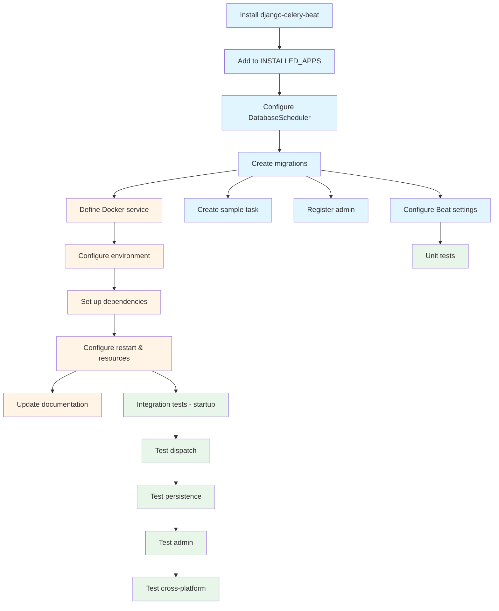

# US-7: Celery Beat Scheduler Service

**Priority**: P1
**Feature**: Local Development Environment
**Status**: To Do

## Overview

This User Story implements the Celery Beat scheduler service for recurring task execution in the AI-powered Technology Watch Platform. The scheduler dispatches periodic tasks (like daily scraping at 2 AM) to Redis queues, enabling automated content collection workflows.

### Context

The Celery Beat scheduler is essential for automating recurring operations in the technology watch platform. It enables scheduled execution of tasks like daily technology content scraping, weekly report aggregation, and periodic cleanup operations without manual intervention.

The scheduler uses django-celery-beat to persist schedules in PostgreSQL, providing a reliable, database-backed scheduling system that supports dynamic schedule management through Django Admin. This prevents duplicate task execution across restarts and enables administrators to modify schedules without code changes or container restarts.

### Decomposition Approach

- **Total tasks**: 18
- **Backend**: 7 tasks (django-celery-beat installation and configuration)
- **Infrastructure**: 5 tasks (Docker Compose service definition and orchestration)
- **Testing**: 6 tasks (unit tests, integration tests, cross-platform validation)

---

## Task Summary

| ID | Title | Type | Specialty | Effort | Dependencies | Status |
|----|-------|------|-----------|--------|--------------|--------|
| TASK-7.1 | Install django-celery-beat dependency | Backend | Config | 1h | None | ⬜ |
| TASK-7.2 | Add django_celery_beat to INSTALLED_APPS | Backend | Config | 1h | TASK-7.1 | ⬜ |
| TASK-7.3 | Configure DatabaseScheduler in Celery app | Backend | Config | 2h | TASK-7.2 | ⬜ |
| TASK-7.4 | Create database migrations for django-celery-beat | Backend | Database | 1h | TASK-7.3 | ⬜ |
| TASK-7.5 | Configure Celery Beat settings | Backend | Config | 2h | TASK-7.4 | ⬜ |
| TASK-7.6 | Create sample periodic task for testing | Backend | Config | 3h | TASK-7.4 | ⬜ |
| TASK-7.7 | Register django-celery-beat admin interface | Backend | Config | 1h | TASK-7.4 | ⬜ |
| TASK-7.8 | Define scheduler service in docker-compose.yml | Infrastructure | Config | 3h | TASK-7.4 | ⬜ |
| TASK-7.9 | Configure scheduler environment variables | Infrastructure | Config | 2h | TASK-7.8 | ⬜ |
| TASK-7.10 | Set up scheduler service dependencies | Infrastructure | Config | 2h | TASK-7.9 | ⬜ |
| TASK-7.11 | Configure scheduler restart policy and resource limits | Infrastructure | Config | 2h | TASK-7.10 | ⬜ |
| TASK-7.12 | Add scheduler to docker-compose documentation | Infrastructure | Documentation | 2h | TASK-7.11 | ⬜ |
| TASK-7.13 | Create unit tests for Celery Beat configuration | Testing | Unit | 3h | TASK-7.5 | ⬜ |
| TASK-7.14 | Create integration tests for scheduler service startup | Testing | Integration | 3h | TASK-7.11 | ⬜ |
| TASK-7.15 | Test periodic task dispatch and execution | Testing | Integration | 4h | TASK-7.14 | ⬜ |
| TASK-7.16 | Test schedule persistence across restarts | Testing | Integration | 3h | TASK-7.15 | ⬜ |
| TASK-7.17 | Test Django Admin schedule management | Testing | Integration | 3h | TASK-7.16 | ⬜ |
| TASK-7.18 | Test cross-platform scheduler compatibility | Testing | Integration | 4h | TASK-7.17 | ⬜ |

---

## Task Details

### 🔧 Backend Tasks

#### TASK-7.1: Install django-celery-beat dependency

**Type**: Backend - Config
**Priority**: P1
**Estimated Effort**: 1 hour

##### Description

Install the django-celery-beat package using Poetry to enable database-backed periodic task scheduling. This package provides the DatabaseScheduler that stores task schedules in PostgreSQL instead of using Celery's default file-based scheduler. Database-backed scheduling is more reliable for production environments and enables dynamic schedule management through Django Admin.

##### Files Impacted
- `backend/pyproject.toml` (modified - add django-celery-beat to dependencies)
- `backend/poetry.lock` (modified - updated by Poetry)

##### Acceptance Criteria
- [ ] django-celery-beat added to pyproject.toml dependencies section
- [ ] `poetry add django-celery-beat` executed successfully
- [ ] poetry.lock updated with django-celery-beat and its dependencies
- [ ] Package version compatible with Celery 5+ and Django 4.2+
- [ ] No dependency conflicts reported by Poetry

##### Dependencies
- None

##### Implementation Notes

**Command to execute**:
```bash
cd backend
poetry add django-celery-beat
```

**Version considerations**:
- django-celery-beat requires Celery 5.0+ and Django 3.2+
- Use latest stable version compatible with project stack
- Verify compatibility with existing Celery and Django versions

**Post-installation**:
- Commit updated pyproject.toml and poetry.lock
- Verify package installed: `poetry show django-celery-beat`

---

#### TASK-7.2: Add django_celery_beat to INSTALLED_APPS

**Type**: Backend - Config
**Priority**: P1
**Estimated Effort**: 1 hour

##### Description

Register django_celery_beat in Django's INSTALLED_APPS to enable the database models, migrations, and admin interface for periodic task management. This configuration step is required before running migrations to create the scheduler tables in PostgreSQL.

##### Files Impacted
- `backend/veille_tech/settings/base.py` (modified - add to INSTALLED_APPS)

##### Acceptance Criteria
- [ ] 'django_celery_beat' added to INSTALLED_APPS list in base.py
- [ ] Placed after 'django.contrib.admin' (requires admin to be loaded first)
- [ ] Django successfully recognizes the app on startup
- [ ] No import errors or configuration warnings
- [ ] App appears in `python manage.py showmigrations` output

##### Dependencies
- TASK-7.1 (django-celery-beat must be installed first)

##### Implementation Notes

**Configuration location**:
- File: `backend/veille_tech/settings/base.py`
- Section: INSTALLED_APPS list

**Example**:
```python
INSTALLED_APPS = [
    'django.contrib.admin',
    'django.contrib.auth',
    'django.contrib.contenttypes',
    'django.contrib.sessions',
    'django.contrib.messages',
    'django.contrib.staticfiles',
    # Third-party apps
    'rest_framework',
    'django_celery_beat',  # Add here
    # Project apps
    'accounts',
    'subjects',
]
```

**Validation**:
```bash
docker-compose exec backend python manage.py check
docker-compose exec backend python manage.py showmigrations django_celery_beat
```

---

#### TASK-7.3: Configure DatabaseScheduler in Celery app

**Type**: Backend - Config
**Priority**: P1
**Estimated Effort**: 2 hours

##### Description

Configure Celery to use django-celery-beat's DatabaseScheduler instead of the default file-based scheduler. This enables the scheduler to read periodic task definitions from PostgreSQL, providing persistent and centrally managed schedules that can be modified through Django Admin without code changes or restarts.

##### Files Impacted
- `backend/veille_tech/celery.py` (modified - set beat_scheduler configuration)

##### Acceptance Criteria
- [ ] `beat_scheduler` set to 'django_celery_beat.schedulers:DatabaseScheduler'
- [ ] Celery app configuration loads successfully
- [ ] Scheduler connects to database on startup
- [ ] No fallback to default PersistentScheduler
- [ ] Configuration validated with `celery -A veille_tech inspect conf`

##### Dependencies
- TASK-7.2 (django_celery_beat must be in INSTALLED_APPS)

##### Implementation Notes

**Configuration location**:
- File: `backend/veille_tech/celery.py`
- Add to app.conf settings

**Example configuration**:
```python
# backend/veille_tech/celery.py
from celery import Celery
import os

os.environ.setdefault('DJANGO_SETTINGS_MODULE', 'veille_tech.settings.base')

app = Celery('veille_tech')
app.config_from_object('django.conf:settings', namespace='CELERY')

# Configure database-backed scheduler
app.conf.beat_scheduler = 'django_celery_beat.schedulers:DatabaseScheduler'

app.autodiscover_tasks()
```

**Additional settings** (optional):
```python
# Schedule checking interval (default: 5 seconds)
app.conf.beat_max_loop_interval = 5

# Enable scheduler sync with database
app.conf.beat_sync_every = 0  # Sync on every tick
```

**Validation**:
```bash
# Check configuration
docker-compose exec backend celery -A veille_tech inspect conf | grep beat_scheduler

# Verify scheduler type
docker-compose exec scheduler celery -A veille_tech beat --loglevel=debug
# Should log: "Using scheduler: django_celery_beat.schedulers.DatabaseScheduler"
```

---

#### TASK-7.4: Create database migrations for django-celery-beat

**Type**: Backend - Database
**Priority**: P1
**Estimated Effort**: 1 hour

##### Description

Execute Django migrations to create django-celery-beat's database tables in PostgreSQL. These tables store periodic task definitions, schedule configurations (cron/interval/clocked), and execution history. The migrations must be applied before the scheduler can run.

##### Files Impacted
- PostgreSQL database (new tables created):
  - `django_celery_beat_periodictask`
  - `django_celery_beat_intervalschedule`
  - `django_celery_beat_crontabschedule`
  - `django_celery_beat_clockedschedule`
  - `django_celery_beat_solarschedule`
  - `django_celery_beat_periodictasks` (metadata)

##### Acceptance Criteria
- [ ] All django-celery-beat migrations applied successfully
- [ ] Six scheduler tables created in PostgreSQL
- [ ] Tables accessible from Django ORM
- [ ] No migration errors or warnings
- [ ] Migrations idempotent (can be run multiple times safely)
- [ ] Tables visible in `\dt django_celery_beat*` in psql

##### Dependencies
- TASK-7.3 (DatabaseScheduler must be configured)

##### Implementation Notes

**Migration command**:
```bash
# Run migrations in backend container
docker-compose exec backend python manage.py migrate django_celery_beat

# Expected output:
# Running migrations:
#   Applying django_celery_beat.0001_initial... OK
#   Applying django_celery_beat.0002_auto_... OK
#   ...
```

**Verify tables created**:
```bash
# Check via Django
docker-compose exec backend python manage.py dbshell
\dt django_celery_beat*

# Or via Docker
docker-compose exec db psql -U postgres -d postgres -c "\dt django_celery_beat*"
```

**Table structure**:
- **periodictask**: Task definitions (name, task, schedule, enabled)
- **intervalschedule**: Interval-based schedules (every N seconds/minutes/hours)
- **crontabschedule**: Cron-based schedules (minute, hour, day, month, day_of_week)
- **clockedschedule**: One-time scheduled tasks (specific datetime)
- **solarschedule**: Sunrise/sunset-based schedules
- **periodictasks**: Metadata for scheduler synchronization

**Rollback** (if needed):
```bash
docker-compose exec backend python manage.py migrate django_celery_beat zero
```

---

#### TASK-7.5: Configure Celery Beat settings

**Type**: Backend - Config
**Priority**: P1
**Estimated Effort**: 2 hours

##### Description

Configure Celery Beat settings in Django settings to optimize scheduler behavior, set schedule checking intervals, and configure timezone handling. These settings control how frequently the scheduler checks for new tasks, how it handles timezone conversions, and performance tuning parameters.

##### Files Impacted
- `backend/veille_tech/settings/base.py` (modified - add Celery Beat settings)

##### Acceptance Criteria
- [ ] Schedule checking interval configured (default: 5 seconds)
- [ ] Timezone handling configured (USE_TZ=True, schedules in UTC)
- [ ] Scheduler sync settings defined
- [ ] Settings validated with `celery -A veille_tech inspect conf`
- [ ] No performance degradation from excessive polling

##### Dependencies
- TASK-7.4 (migrations must be applied first)

##### Implementation Notes

**Configuration location**:
- File: `backend/veille_tech/settings/base.py`
- Section: Celery configuration (typically at end of file)

**Recommended settings**:
```python
# backend/veille_tech/settings/base.py

# Celery Beat Configuration
CELERY_BEAT_SCHEDULER = 'django_celery_beat.schedulers:DatabaseScheduler'

# Schedule checking frequency (seconds)
CELERY_BEAT_MAX_LOOP_INTERVAL = 5  # Check database every 5 seconds

# Scheduler sync settings
CELERY_BEAT_SYNC_EVERY = 0  # Sync on every tick (0 = always)

# Timezone configuration
CELERY_TIMEZONE = 'UTC'  # Store schedules in UTC
CELERY_ENABLE_UTC = True
USE_TZ = True  # Django timezone support

# Scheduler behavior
CELERY_BEAT_SCHEDULE_FILENAME = 'celerybeat-schedule'  # Fallback file (not used with DatabaseScheduler)
```

**Performance tuning**:
```python
# For high-frequency tasks (adjust if needed)
CELERY_BEAT_MAX_LOOP_INTERVAL = 1  # Check every second

# For low-frequency tasks (reduce database load)
CELERY_BEAT_MAX_LOOP_INTERVAL = 10  # Check every 10 seconds
```

**Timezone handling**:
- All schedules stored in UTC in database
- Django Admin displays times in local timezone (configured via TIME_ZONE setting)
- Celery workers execute tasks in UTC

**Validation**:
```bash
# Check configuration
docker-compose exec backend python manage.py shell
>>> from django.conf import settings
>>> settings.CELERY_BEAT_SCHEDULER
'django_celery_beat.schedulers:DatabaseScheduler'
>>> settings.CELERY_BEAT_MAX_LOOP_INTERVAL
5
```

---

#### TASK-7.6: Create sample periodic task for testing

**Type**: Backend - Config
**Priority**: P1
**Estimated Effort**: 3 hours

##### Description

Create a sample periodic task with a cron schedule (2 AM daily) to validate the scheduler's functionality. This task serves as a template for future recurring tasks and provides a testable implementation for verifying task dispatch and execution. The task will be created programmatically via Django Admin or a data migration.

##### Files Impacted
- `backend/veille_tech/tasks.py` (new or modified - define test task)
- `backend/subjects/migrations/XXXX_create_sample_schedule.py` (new - data migration, optional)
- Django Admin interface (manual task creation alternative)

##### Acceptance Criteria
- [ ] Sample Celery task defined (`test_scheduled_task` or similar)
- [ ] Task registered with Celery app
- [ ] Periodic task created in django_celery_beat_periodictask table
- [ ] CrontabSchedule configured for 2 AM daily (0 2 * * *)
- [ ] Task enabled and ready for dispatch
- [ ] Task logs execution when triggered
- [ ] Visible in Django Admin periodic tasks list

##### Dependencies
- TASK-7.4 (database tables must exist)

##### Implementation Notes

**Step 1: Define Celery task**

Create or update `backend/veille_tech/tasks.py`:
```python
# backend/veille_tech/tasks.py
from celery import shared_task
from celery.utils.log import get_task_logger

logger = get_task_logger(__name__)

@shared_task(name='veille_tech.tasks.test_scheduled_task')
def test_scheduled_task():
    """
    Sample periodic task for testing Celery Beat scheduler.
    Executes daily at 2 AM to validate scheduling functionality.
    """
    logger.info("Test scheduled task executed successfully at 2 AM")
    return "Task completed"

@shared_task(name='veille_tech.tasks.daily_scraping_task')
def daily_scraping_task():
    """
    Daily technology content scraping task.
    Placeholder for future AI pipeline integration.
    """
    logger.info("Daily scraping task triggered")
    # TODO: Implement scraping logic in future User Story
    return "Scraping initiated"
```

**Step 2: Create schedule via Django Admin** (Manual approach)

1. Start services: `docker-compose up -d backend`
2. Access Django Admin: http://localhost:8000/admin/
3. Navigate to: Periodic Tasks → Add Periodic Task
4. Fill form:
   - **Name**: "Daily Scraping Test"
   - **Task**: `veille_tech.tasks.test_scheduled_task`
   - **Crontab Schedule**: Click "+" to create new
     - **Minute**: 0
     - **Hour**: 2
     - **Day of Month**: * (asterisk)
     - **Month of Year**: * (asterisk)
     - **Day of Week**: * (asterisk)
   - **Enabled**: ✓ (checked)
5. Save

**Step 3: Create schedule via data migration** (Programmatic approach)

```bash
# Create empty migration
docker-compose exec backend python manage.py makemigrations --empty subjects --name create_sample_schedule
```

Edit migration file:
```python
# backend/subjects/migrations/XXXX_create_sample_schedule.py
from django.db import migrations

def create_daily_schedule(apps, schema_editor):
    PeriodicTask = apps.get_model('django_celery_beat', 'PeriodicTask')
    CrontabSchedule = apps.get_model('django_celery_beat', 'CrontabSchedule')

    # Create crontab schedule: 2 AM daily (0 2 * * *)
    schedule, created = CrontabSchedule.objects.get_or_create(
        minute='0',
        hour='2',
        day_of_week='*',
        day_of_month='*',
        month_of_year='*',
        timezone='UTC'
    )

    # Create periodic task
    PeriodicTask.objects.get_or_create(
        name='Daily Technology Scraping',
        defaults={
            'task': 'veille_tech.tasks.daily_scraping_task',
            'crontab': schedule,
            'enabled': True,
        }
    )

def remove_daily_schedule(apps, schema_editor):
    PeriodicTask = apps.get_model('django_celery_beat', 'PeriodicTask')
    PeriodicTask.objects.filter(name='Daily Technology Scraping').delete()

class Migration(migrations.Migration):
    dependencies = [
        ('subjects', 'XXXX_previous_migration'),
        ('django_celery_beat', '0018_improve_crontab_helptext'),  # Latest django-celery-beat migration
    ]

    operations = [
        migrations.RunPython(create_daily_schedule, remove_daily_schedule),
    ]
```

Apply migration:
```bash
docker-compose exec backend python manage.py migrate subjects
```

**Validation**:
```bash
# Verify task registered
docker-compose exec backend celery -A veille_tech inspect registered | grep test_scheduled_task

# Check schedule in database
docker-compose exec backend python manage.py shell
>>> from django_celery_beat.models import PeriodicTask
>>> PeriodicTask.objects.filter(enabled=True).values('name', 'task', 'crontab__minute', 'crontab__hour')

# View in Django Admin
# Navigate to http://localhost:8000/admin/django_celery_beat/periodictask/
```

---

#### TASK-7.7: Register django-celery-beat admin interface

**Type**: Backend - Config
**Priority**: P1
**Estimated Effort**: 1 hour

##### Description

Verify and customize the django-celery-beat admin interface in Django Admin to enable developers and administrators to manage periodic tasks, schedules, and view execution history. The admin interface provides a user-friendly way to create, modify, enable/disable, and monitor scheduled tasks without requiring code changes.

##### Files Impacted
- `backend/veille_tech/admin.py` (optional customization)
- Django Admin interface (automatic registration)

##### Acceptance Criteria
- [ ] Django Admin shows "Periodic Tasks" section under django-celery-beat
- [ ] Admin lists: Periodic Tasks, Crontab Schedules, Interval Schedules, Clocked Schedules
- [ ] Periodic tasks list shows: Name, Task, Schedule, Enabled, Last Run At
- [ ] Inline editing works for schedule fields
- [ ] Enable/disable toggle functions correctly
- [ ] Search and filtering available
- [ ] Admin interface accessible at http://localhost:8000/admin/django_celery_beat/

##### Dependencies
- TASK-7.4 (migrations must be applied for models to exist)

##### Implementation Notes

**Automatic registration**:
django-celery-beat automatically registers its models in Django Admin when added to INSTALLED_APPS. No additional configuration required for basic functionality.

**Verify admin access**:
1. Start services: `docker-compose up -d backend`
2. Create superuser (if not exists): `docker-compose exec backend python manage.py createsuperuser`
3. Access: http://localhost:8000/admin/
4. Login with superuser credentials
5. Verify "PERIODIC TASKS" section appears with:
   - Clocked schedules
   - Crontab schedules
   - Interval schedules
   - Periodic tasks
   - Solar schedules

**Optional customization** (if needed):

Create custom admin to improve UX:
```python
# backend/veille_tech/admin.py
from django.contrib import admin
from django_celery_beat.models import PeriodicTask, CrontabSchedule, IntervalSchedule

# Customize PeriodicTask admin
class PeriodicTaskAdmin(admin.ModelAdmin):
    list_display = ('name', 'task', 'enabled', 'last_run_at', 'total_run_count')
    list_filter = ('enabled', 'task')
    search_fields = ('name', 'task')
    actions = ['enable_tasks', 'disable_tasks']

    def enable_tasks(self, request, queryset):
        queryset.update(enabled=True)
    enable_tasks.short_description = "Enable selected tasks"

    def disable_tasks(self, request, queryset):
        queryset.update(enabled=False)
    disable_tasks.short_description = "Disable selected tasks"

# Re-register with custom admin
admin.site.unregister(PeriodicTask)
admin.site.register(PeriodicTask, PeriodicTaskAdmin)
```

**Admin features to validate**:
- **Create new task**: Click "Add Periodic Task"
- **Edit existing**: Click task name in list
- **Enable/disable**: Check/uncheck "Enabled" field
- **View execution history**: "Last run at" and "Total run count" columns
- **Schedule types**: Create crontab (cron syntax) or interval (every N seconds/minutes/hours)

**Common admin tasks**:
- Create daily task: Crontab with `0 2 * * *` (2 AM daily)
- Create hourly task: Interval with `every=1, period='hours'`
- Disable task temporarily: Uncheck "Enabled"
- View last execution: Check "Last run at" timestamp

---

### ⚙️ Infrastructure Tasks

#### TASK-7.8: Define scheduler service in docker-compose.yml

**Type**: Infrastructure - Config
**Priority**: P1
**Estimated Effort**: 3 hours

##### Description

Define the Celery Beat scheduler service in docker-compose.yml, inheriting from the backend service to share the same Docker image and codebase. The scheduler runs the `celery beat` command instead of the Django server, connecting to Redis and PostgreSQL to manage periodic task schedules and dispatch tasks to worker queues.

##### Files Impacted
- `docker-compose.yml` (modified - add scheduler service)

##### Acceptance Criteria
- [ ] `scheduler` service defined in docker-compose.yml
- [ ] Service inherits from backend image (same Dockerfile)
- [ ] Command: `poetry run celery -A veille_tech beat --loglevel=info`
- [ ] Mounts same source code volume as backend for consistency
- [ ] Container name: `veille_tech_scheduler`
- [ ] Service listed in `docker-compose ps`
- [ ] Logs accessible via `docker-compose logs scheduler`

##### Dependencies
- TASK-7.4 (database migrations must be applied before scheduler starts)

##### Implementation Notes

**Service definition**:
```yaml
# docker-compose.yml

services:
  # ... existing services (db, redis, backend, worker) ...

  scheduler:
    build:
      context: ./backend
      dockerfile: Dockerfile
    image: veille_tech_backend:latest  # Shares image with backend service
    container_name: veille_tech_scheduler
    command: poetry run celery -A veille_tech beat --loglevel=info --scheduler django_celery_beat.schedulers:DatabaseScheduler
    volumes:
      - ./backend:/app  # Mount source code for configuration access
    env_file:
      - .env.backend
    environment:
      - DJANGO_SETTINGS_MODULE=veille_tech.settings.base
      - CELERY_BROKER_URL=redis://redis:6379/0
      - DATABASE_URL=postgres://postgres:postgres@db:5432/postgres
    depends_on:
      db:
        condition: service_healthy
      redis:
        condition: service_healthy
      backend:
        condition: service_started  # Backend should start first to ensure migrations run
    networks:
      - veille_tech_network
    restart: unless-stopped
```

**Key configuration points**:

1. **Shared image**: Uses same Dockerfile as backend service
2. **Command override**: Runs `celery beat` instead of Django server
3. **Volume mount**: Shares source code with backend for consistency
4. **Environment**: Same .env.backend file for configuration
5. **Dependencies**: Requires db, redis, and backend to be ready
6. **Restart policy**: `unless-stopped` for resilience

**Alternative: Use `extends` for DRY** (if backend service is complex):
```yaml
services:
  backend:
    # ... backend definition ...

  scheduler:
    extends:
      service: backend
    container_name: veille_tech_scheduler
    command: poetry run celery -A veille_tech beat --loglevel=info
    ports: []  # Remove ports if backend exposes 8000
```

**Validation**:
```bash
# Validate docker-compose syntax
docker-compose config

# Start scheduler service
docker-compose up -d scheduler

# Check service status
docker-compose ps scheduler

# View logs
docker-compose logs -f scheduler

# Expected log output:
# celery beat v5.x.x (dawn-chorus) is starting.
# Using scheduler: django_celery_beat.schedulers.DatabaseScheduler
# LocalTime -> 2025-01-27 10:00:00
# Configuration ->
#     . broker -> redis://redis:6379/0
#     . loader -> celery.loaders.app.AppLoader
#     . scheduler -> django_celery_beat.schedulers.DatabaseScheduler
```

---

#### TASK-7.9: Configure scheduler environment variables

**Type**: Infrastructure - Config
**Priority**: P1
**Estimated Effort**: 2 hours

##### Description

Configure environment variables for the scheduler service in .env.backend, ensuring proper connection to Redis broker, PostgreSQL database, and correct Celery configuration. The scheduler needs identical environment configuration to the backend service since it shares the same codebase and must connect to the same infrastructure.

##### Files Impacted
- `.env.backend` (modified - verify scheduler-specific variables)
- `docker-compose.yml` (modified - reference environment variables)

##### Acceptance Criteria
- [ ] CELERY_BROKER_URL points to Redis: `redis://redis:6379/0`
- [ ] DATABASE_URL points to PostgreSQL with credentials
- [ ] DJANGO_SETTINGS_MODULE set correctly
- [ ] CELERY_BEAT_MAX_LOOP_INTERVAL configured (optional)
- [ ] Environment variables loaded successfully on startup
- [ ] Scheduler connects to broker and database without errors
- [ ] No hardcoded credentials in docker-compose.yml

##### Dependencies
- TASK-7.8 (scheduler service must be defined first)

##### Implementation Notes

**Environment variables in .env.backend**:
```bash
# .env.backend

# Django Configuration
DJANGO_SETTINGS_MODULE=veille_tech.settings.base
SECRET_KEY=your-secret-key-here
DEBUG=True
ALLOWED_HOSTS=localhost,127.0.0.1,backend

# Database Configuration
DATABASE_URL=postgres://postgres:postgres@db:5432/postgres
POSTGRES_DB=postgres
POSTGRES_USER=postgres
POSTGRES_PASSWORD=postgres
POSTGRES_HOST=db
POSTGRES_PORT=5432

# Redis Configuration
REDIS_URL=redis://redis:6379/0
CELERY_BROKER_URL=redis://redis:6379/0
CELERY_RESULT_BACKEND=redis://redis:6379/0

# Celery Beat Configuration
CELERY_BEAT_MAX_LOOP_INTERVAL=5  # Check schedule every 5 seconds
CELERY_TIMEZONE=UTC

# AI API Keys (not used by scheduler, but shared environment)
GOOGLE_AI_API_KEY=your-google-ai-key
FIRECRAWL_API_KEY=your-firecrawl-key

# Logging
LOG_LEVEL=INFO
```

**Reference in docker-compose.yml**:
```yaml
scheduler:
  # ... other configuration ...
  env_file:
    - .env.backend
  environment:
    # Override or add specific variables if needed
    - CELERY_BEAT_MAX_LOOP_INTERVAL=5
```

**Important notes**:
- Scheduler uses same .env.backend as backend service
- DATABASE_URL must match backend configuration exactly
- CELERY_BROKER_URL must point to Redis service name (not localhost)
- Use service names (db, redis) not IP addresses for Docker networking

**Validation**:
```bash
# Check environment loaded
docker-compose exec scheduler env | grep CELERY

# Verify broker connection
docker-compose exec scheduler celery -A veille_tech inspect ping
# Expected: pong from workers (if workers running)

# Check database connection
docker-compose exec scheduler python manage.py dbshell
\dt django_celery_beat*
\q
```

**Security best practices**:
- Keep .env.backend in .gitignore (never commit)
- Use .env.backend.example as template with placeholder values
- Generate unique SECRET_KEY per environment
- Use strong database passwords in production

---

#### TASK-7.10: Set up scheduler service dependencies

**Type**: Infrastructure - Config
**Priority**: P1
**Estimated Effort**: 2 hours

##### Description

Configure Docker Compose service dependencies to ensure the scheduler starts only after PostgreSQL, Redis, and backend services are ready. This prevents the scheduler from attempting to connect to unavailable services and ensures database migrations are applied before the scheduler tries to read schedule tables.

##### Files Impacted
- `docker-compose.yml` (modified - add depends_on with conditions)

##### Acceptance Criteria
- [ ] Scheduler depends on: db (service_healthy), redis (service_healthy), backend (service_started)
- [ ] Scheduler waits for database health check before starting
- [ ] Scheduler waits for Redis health check before starting
- [ ] Scheduler starts after backend to ensure migrations run
- [ ] Startup order validated: db → redis → backend → scheduler
- [ ] No connection errors in scheduler logs during startup

##### Dependencies
- TASK-7.9 (environment variables must be configured)

##### Implementation Notes

**Dependency configuration in docker-compose.yml**:
```yaml
services:
  db:
    image: postgres:15
    # ... db configuration ...
    healthcheck:
      test: ["CMD-SHELL", "pg_isready -U postgres"]
      interval: 10s
      timeout: 5s
      retries: 5

  redis:
    image: redis:latest
    # ... redis configuration ...
    healthcheck:
      test: ["CMD", "redis-cli", "ping"]
      interval: 10s
      timeout: 5s
      retries: 5

  backend:
    # ... backend configuration ...
    depends_on:
      db:
        condition: service_healthy
      redis:
        condition: service_healthy

  worker:
    # ... worker configuration ...
    depends_on:
      db:
        condition: service_healthy
      redis:
        condition: service_healthy
      backend:
        condition: service_started

  scheduler:
    # ... scheduler configuration ...
    depends_on:
      db:
        condition: service_healthy  # Wait for database to be ready
      redis:
        condition: service_healthy  # Wait for Redis to be ready
      backend:
        condition: service_started  # Wait for backend to start (migrations run in backend startup)
    networks:
      - veille_tech_network
```

**Dependency rationale**:

1. **db (service_healthy)**: Scheduler reads schedules from PostgreSQL
   - Health check ensures database accepts connections
   - Prevents "database unavailable" errors

2. **redis (service_healthy)**: Scheduler enqueues tasks to Redis
   - Health check ensures Redis responds to PING
   - Prevents "broker connection refused" errors

3. **backend (service_started)**: Backend runs migrations during startup
   - `service_started` ensures backend container started (not necessarily ready)
   - Alternative: Add health check to backend and use `service_healthy`
   - Ensures django-celery-beat tables exist before scheduler starts

**Advanced: Add backend health check** (optional but recommended):
```yaml
backend:
  # ... backend configuration ...
  healthcheck:
    test: ["CMD", "curl", "-f", "http://localhost:8000/health/"]
    interval: 10s
    timeout: 5s
    retries: 5
    start_period: 30s

scheduler:
  depends_on:
    db:
      condition: service_healthy
    redis:
      condition: service_healthy
    backend:
      condition: service_healthy  # Now waits for backend to be fully ready
```

**Startup sequence validation**:
```bash
# Start all services and observe order
docker-compose up

# Expected order:
# 1. Creating network "veille_tech_network"
# 2. Creating veille_tech_db ... done
# 3. Creating veille_tech_redis ... done
# 4. Waiting for db to be healthy...
# 5. Waiting for redis to be healthy...
# 6. Creating veille_tech_backend ... done
# 7. Creating veille_tech_worker ... done
# 8. Creating veille_tech_scheduler ... done

# Verify no connection errors
docker-compose logs scheduler | grep -i error
# Should show no broker or database connection errors
```

**Troubleshooting dependencies**:
- If scheduler starts too early: Add `sleep 5` to scheduler command (not recommended, use health checks)
- If migrations not applied: Ensure backend runs migrations in entrypoint script
- If health checks fail: Adjust interval/retries or verify health check commands

---

#### TASK-7.11: Configure scheduler restart policy and resource limits

**Type**: Infrastructure - Config
**Priority**: P1
**Estimated Effort**: 2 hours

##### Description

Configure Docker restart policies and resource limits for the scheduler service to ensure automatic recovery from failures and prevent resource exhaustion. The scheduler is a critical service that must restart automatically if it crashes, but should not consume excessive system resources during operation.

##### Files Impacted
- `docker-compose.yml` (modified - add restart policy and resource limits)

##### Acceptance Criteria
- [ ] Restart policy set to `unless-stopped` for automatic recovery
- [ ] Memory limit configured (e.g., 512MB, scheduler is lightweight)
- [ ] CPU limit configured (e.g., 0.5 CPUs)
- [ ] Resource reservations set for guaranteed baseline resources
- [ ] Scheduler restarts automatically after crash
- [ ] Resource limits prevent runaway resource consumption
- [ ] Limits validated with `docker stats`

##### Dependencies
- TASK-7.10 (service dependencies must be configured)

##### Implementation Notes

**Resource limits in docker-compose.yml**:
```yaml
services:
  scheduler:
    # ... existing scheduler configuration ...
    restart: unless-stopped
    deploy:
      resources:
        limits:
          cpus: '0.5'      # Max 50% of one CPU core
          memory: 512M     # Max 512MB RAM
        reservations:
          cpus: '0.25'     # Guaranteed 25% of one CPU core
          memory: 256M     # Guaranteed 256MB RAM
```

**Restart policy options**:
- `no`: Never restart (not recommended for scheduler)
- `always`: Always restart, even after manual stop (not recommended)
- `on-failure`: Restart only on non-zero exit code
- `unless-stopped`: Restart always, except after manual stop (recommended)

**Recommended configuration for scheduler**:
```yaml
scheduler:
  build:
    context: ./backend
    dockerfile: Dockerfile
  image: veille_tech_backend:latest
  container_name: veille_tech_scheduler
  command: poetry run celery -A veille_tech beat --loglevel=info
  volumes:
    - ./backend:/app
  env_file:
    - .env.backend
  depends_on:
    db:
      condition: service_healthy
    redis:
      condition: service_healthy
    backend:
      condition: service_started
  networks:
    - veille_tech_network
  restart: unless-stopped  # Auto-restart on crash
  deploy:
    resources:
      limits:
        cpus: '0.5'        # Scheduler is CPU-light
        memory: 512M       # 512MB should be sufficient
      reservations:
        cpus: '0.25'       # Guarantee baseline CPU
        memory: 256M       # Guarantee baseline memory
```

**Resource sizing rationale**:

**Scheduler is lightweight**:
- Checks database for schedules every 5 seconds
- Enqueues task messages to Redis (small overhead)
- No task execution (workers handle that)
- Typical usage: <5% CPU, <100MB RAM

**Limits prevent issues**:
- Memory limit prevents memory leaks from consuming system resources
- CPU limit prevents runaway processes from blocking other services
- Reservations ensure scheduler gets minimum resources under load

**Adjustments for different scenarios**:
```yaml
# High-frequency scheduling (many tasks, frequent checks)
deploy:
  resources:
    limits:
      cpus: '1.0'
      memory: 1G
    reservations:
      cpus: '0.5'
      memory: 512M

# Low-frequency scheduling (few tasks, infrequent checks)
deploy:
  resources:
    limits:
      cpus: '0.25'
      memory: 256M
    reservations:
      cpus: '0.1'
      memory: 128M
```

**Validation**:
```bash
# Start scheduler
docker-compose up -d scheduler

# Monitor resource usage
docker stats veille_tech_scheduler

# Expected output:
# CONTAINER           CPU %   MEM USAGE / LIMIT   MEM %   NET I/O
# veille_tech_scheduler   0.5%    120MiB / 512MiB     23.44%  1.2kB / 850B

# Test restart policy (simulate crash)
docker stop veille_tech_scheduler
# Wait 10 seconds
docker ps | grep scheduler
# Should automatically restart

# Test resource limits (stress test)
docker-compose exec scheduler python -c "import time; [time.sleep(0.01) for _ in range(10000)]"
# Monitor with docker stats - should not exceed limits
```

**Logging restart events**:
```bash
# View restart history
docker inspect veille_tech_scheduler | grep -A 10 RestartCount

# View logs for restart events
docker-compose logs scheduler | grep -i restart
```

---

#### TASK-7.12: Add scheduler to docker-compose documentation

**Type**: Infrastructure - Documentation
**Priority**: P1
**Estimated Effort**: 2 hours

##### Description

Update project documentation to include the scheduler service in setup guides, architecture diagrams, and troubleshooting sections. Developers need clear documentation on how the scheduler works, how to manage schedules, and how to debug scheduling issues.

##### Files Impacted
- `README.md` (modified - add scheduler to services list)
- `docs/setup/00_setup_local_docker.md` (modified - add scheduler setup instructions)
- `CLAUDE.md` (modified - update Docker services table and commands)

##### Acceptance Criteria
- [ ] README lists scheduler as one of 7 services (was 6)
- [ ] Setup guide includes scheduler startup instructions
- [ ] Docker commands documentation includes scheduler examples
- [ ] Troubleshooting section covers common scheduler issues
- [ ] Architecture diagram shows scheduler connection to db/redis
- [ ] Admin interface documentation includes schedule management guide

##### Dependencies
- TASK-7.11 (scheduler fully configured and operational)

##### Implementation Notes

**Update README.md**:
```markdown
# AI-Powered Technology Watch Platform

## Services

This project runs 7 Docker services:

| Service | Purpose | Port |
|---------|---------|------|
| `db` | PostgreSQL 15 + pgvector | 5432 |
| `redis` | Celery broker & cache | 6379 |
| `backend` | Django/DRF API | 8000 |
| `frontend` | React SPA | 3000 |
| `worker` | Celery worker (AI pipeline) | - |
| `scheduler` | Celery Beat (recurring tasks) | - |

## Quick Start

```bash
# Start all services
docker-compose up -d

# View scheduler logs
docker-compose logs -f scheduler

# Check scheduler status
docker-compose ps scheduler
```
```

**Update docs/setup/00_setup_local_docker.md**:
```markdown
## Service Startup

### Start All Services
```bash
docker-compose up -d
```

Services start in this order:
1. `db` (PostgreSQL) - waits for health check
2. `redis` - waits for health check
3. `backend` (Django) - runs migrations
4. `worker` (Celery worker) - starts task execution
5. `scheduler` (Celery Beat) - starts task scheduling

### Verify Scheduler

```bash
# Check scheduler is running
docker-compose ps scheduler

# View scheduler logs
docker-compose logs -f scheduler

# Expected log output:
# celery beat v5.x.x is starting
# DatabaseScheduler: Schedule changed.
# Scheduler: Sending due task ...
```

### Manage Schedules

1. Access Django Admin: http://localhost:8000/admin/
2. Login with superuser credentials
3. Navigate to: **PERIODIC TASKS** → **Periodic tasks**
4. Create new task:
   - **Name**: My Scheduled Task
   - **Task**: `veille_tech.tasks.my_task`
   - **Crontab schedule**: Click "+" to create (e.g., `0 2 * * *` for 2 AM daily)
   - **Enabled**: ✓
5. Save - scheduler picks up change within 5 seconds

## Troubleshooting

### Scheduler Not Starting

**Symptom**: `docker-compose ps scheduler` shows "Restarting" or "Exited"

**Solutions**:
```bash
# Check logs for errors
docker-compose logs scheduler

# Common issue 1: Database migrations not applied
docker-compose exec backend python manage.py migrate django_celery_beat

# Common issue 2: Redis not available
docker-compose up -d redis
docker-compose restart scheduler

# Common issue 3: Configuration error
docker-compose exec scheduler celery -A veille_tech inspect conf | grep beat_scheduler
```

### Scheduled Tasks Not Executing

**Symptom**: Tasks visible in Admin but not triggering

**Solutions**:
```bash
# Verify task enabled in Admin
# Check scheduler logs for dispatch messages
docker-compose logs scheduler | grep "Scheduler: Sending"

# Verify worker is running to execute tasks
docker-compose ps worker

# Check task registered with Celery
docker-compose exec worker celery -A veille_tech inspect registered
```

### Schedule Changes Not Picked Up

**Symptom**: Modified schedule in Admin but scheduler still uses old time

**Solutions**:
```bash
# Restart scheduler to force schedule reload
docker-compose restart scheduler

# Verify CELERY_BEAT_MAX_LOOP_INTERVAL is set (default: 5 seconds)
docker-compose exec scheduler env | grep CELERY_BEAT_MAX_LOOP_INTERVAL

# Check django-celery-beat periodictasks metadata
docker-compose exec backend python manage.py shell
>>> from django_celery_beat.models import PeriodicTasks
>>> PeriodicTasks.objects.update_changed()  # Force schedule change signal
```
```

**Update CLAUDE.md**:
```markdown
## Docker Services

| Service | Purpose | Port |
|---------|---------|------|
| `db` | PostgreSQL 15 + pgvector | 5432 |
| `redis` | Celery broker & cache | 6379 |
| `backend` | Django/DRF API | 8000 |
| `frontend` | React SPA | 3000 |
| `worker` | Celery worker (AI pipeline) | - |
| `scheduler` | Celery Beat (recurring tasks) | - |

## Common Commands

### Scheduler Management

```bash
# View scheduler logs
docker-compose logs -f scheduler

# Restart scheduler
docker-compose restart scheduler

# Check scheduler configuration
docker-compose exec scheduler celery -A veille_tech inspect conf | grep beat

# View active schedules
docker-compose exec backend python manage.py shell
>>> from django_celery_beat.models import PeriodicTask
>>> PeriodicTask.objects.filter(enabled=True).values('name', 'task', 'crontab__minute', 'crontab__hour')

# Manually trigger schedule reload
>>> from django_celery_beat.models import PeriodicTasks
>>> PeriodicTasks.objects.update_changed()
```
```

**Create docs/scheduler_management.md** (new file):
```markdown
# Celery Beat Scheduler Management Guide

## Overview

The Celery Beat scheduler dispatches recurring tasks to worker queues based on configured schedules. Schedules are stored in PostgreSQL using django-celery-beat and managed via Django Admin.

## Schedule Types

### Crontab Schedules (Cron Syntax)
- **Daily at 2 AM**: `0 2 * * *`
- **Every hour**: `0 * * * *`
- **Weekdays at 9 AM**: `0 9 * * 1-5`
- **First day of month**: `0 0 1 * *`

### Interval Schedules (Periodic)
- **Every 5 minutes**: Interval: 5, Period: minutes
- **Every hour**: Interval: 1, Period: hours
- **Every 30 seconds**: Interval: 30, Period: seconds

## Creating Schedules via Admin

1. Navigate to http://localhost:8000/admin/django_celery_beat/periodictask/
2. Click "Add Periodic Task"
3. Fill form:
   - **Name**: Descriptive name (e.g., "Daily Technology Scraping")
   - **Task**: Fully qualified task name (e.g., `veille_tech.tasks.daily_scraping_task`)
   - **Crontab/Interval**: Choose schedule type and configure
   - **Enabled**: Check to activate
4. Save

## Monitoring Execution

### View Scheduler Logs
```bash
docker-compose logs -f scheduler | grep "Scheduler: Sending"
```

### View Task Execution History
Admin shows:
- **Last Run At**: Timestamp of last execution
- **Total Run Count**: Number of times task has run
- **Date Changed**: When schedule was last modified

## Troubleshooting

See docs/setup/00_setup_local_docker.md for troubleshooting guide.
```

**Validation checklist**:
- [ ] README updated with scheduler in services list
- [ ] Setup guide includes scheduler startup and verification
- [ ] Troubleshooting section added with common issues
- [ ] CLAUDE.md updated with scheduler commands
- [ ] New scheduler management guide created
- [ ] All documentation tested by following instructions

---

### ✅ Testing Tasks

#### TASK-7.13: Create unit tests for Celery Beat configuration

**Type**: Testing - Unit
**Priority**: P1
**Estimated Effort**: 3 hours

##### Description

Create unit tests to verify Celery Beat configuration is correctly set up, including DatabaseScheduler usage, schedule checking intervals, timezone handling, and task registration. These tests validate the configuration without requiring actual task execution.

##### Files Impacted
- `backend/tests/test_celery_config.py` (new - Celery configuration tests)

##### Acceptance Criteria
- [ ] Test verifies CELERY_BEAT_SCHEDULER is 'django_celery_beat.schedulers:DatabaseScheduler'
- [ ] Test verifies CELERY_BEAT_MAX_LOOP_INTERVAL is configured
- [ ] Test verifies CELERY_TIMEZONE is set to 'UTC'
- [ ] Test verifies django_celery_beat in INSTALLED_APPS
- [ ] Test verifies sample task is registered with Celery
- [ ] All tests pass with `pytest backend/tests/test_celery_config.py`

##### Dependencies
- TASK-7.5 (Celery Beat settings must be configured)

##### Implementation Notes

**Create test file**:
```python
# backend/tests/test_celery_config.py
import pytest
from django.conf import settings
from celery import current_app
from django_celery_beat.models import PeriodicTask, CrontabSchedule


class TestCeleryBeatConfiguration:
    """Unit tests for Celery Beat configuration."""

    def test_beat_scheduler_configured(self):
        """Verify DatabaseScheduler is configured."""
        scheduler = current_app.conf.beat_scheduler
        assert scheduler == 'django_celery_beat.schedulers:DatabaseScheduler', \
            "Celery Beat should use DatabaseScheduler"

    def test_beat_max_loop_interval_configured(self):
        """Verify schedule checking interval is configured."""
        interval = current_app.conf.beat_max_loop_interval
        assert interval is not None, "CELERY_BEAT_MAX_LOOP_INTERVAL should be configured"
        assert interval > 0, "Schedule check interval must be positive"
        assert interval <= 10, "Schedule check interval should not exceed 10 seconds"

    def test_celery_timezone_utc(self):
        """Verify Celery uses UTC timezone."""
        timezone = current_app.conf.timezone
        assert timezone == 'UTC', "Celery should use UTC timezone"

    def test_django_celery_beat_installed(self):
        """Verify django_celery_beat is in INSTALLED_APPS."""
        assert 'django_celery_beat' in settings.INSTALLED_APPS, \
            "django_celery_beat must be in INSTALLED_APPS"

    def test_sample_task_registered(self):
        """Verify sample test task is registered with Celery."""
        registered_tasks = current_app.tasks.keys()
        assert 'veille_tech.tasks.test_scheduled_task' in registered_tasks, \
            "Test scheduled task should be registered"

    def test_daily_scraping_task_registered(self):
        """Verify daily scraping task is registered."""
        registered_tasks = current_app.tasks.keys()
        assert 'veille_tech.tasks.daily_scraping_task' in registered_tasks, \
            "Daily scraping task should be registered"


@pytest.mark.django_db
class TestDjangoCeleryBeatModels:
    """Unit tests for django-celery-beat models."""

    def test_crontab_schedule_model_exists(self):
        """Verify CrontabSchedule model is accessible."""
        # Create a test schedule
        schedule = CrontabSchedule.objects.create(
            minute='0',
            hour='2',
            day_of_week='*',
            day_of_month='*',
            month_of_year='*',
        )
        assert schedule.pk is not None, "CrontabSchedule should be created"
        assert str(schedule) == '0 2 * * * (m/h/dM/MY/d) UTC', \
            "CrontabSchedule string representation should match cron syntax"

    def test_periodic_task_model_exists(self):
        """Verify PeriodicTask model is accessible."""
        # Create a test schedule
        schedule = CrontabSchedule.objects.create(
            minute='0',
            hour='2',
            day_of_week='*',
            day_of_month='*',
            month_of_year='*',
        )
        # Create a test task
        task = PeriodicTask.objects.create(
            name='Test Task',
            task='veille_tech.tasks.test_scheduled_task',
            crontab=schedule,
            enabled=True,
        )
        assert task.pk is not None, "PeriodicTask should be created"
        assert task.enabled is True, "Task should be enabled by default"
        assert task.task == 'veille_tech.tasks.test_scheduled_task', \
            "Task name should match registered task"

    def test_periodic_task_validation(self):
        """Verify PeriodicTask requires valid schedule."""
        with pytest.raises(Exception):  # IntegrityError or ValidationError
            # Cannot create task without schedule
            PeriodicTask.objects.create(
                name='Invalid Task',
                task='veille_tech.tasks.test_scheduled_task',
                enabled=True,
            )
```

**Run tests**:
```bash
# In backend container
docker-compose exec backend pytest backend/tests/test_celery_config.py -v

# Expected output:
# test_celery_config.py::TestCeleryBeatConfiguration::test_beat_scheduler_configured PASSED
# test_celery_config.py::TestCeleryBeatConfiguration::test_beat_max_loop_interval_configured PASSED
# test_celery_config.py::TestCeleryBeatConfiguration::test_celery_timezone_utc PASSED
# test_celery_config.py::TestCeleryBeatConfiguration::test_django_celery_beat_installed PASSED
# test_celery_config.py::TestCeleryBeatConfiguration::test_sample_task_registered PASSED
# test_celery_config.py::TestCeleryBeatConfiguration::test_daily_scraping_task_registered PASSED
# test_celery_config.py::TestDjangoCeleryBeatModels::test_crontab_schedule_model_exists PASSED
# test_celery_config.py::TestDjangoCeleryBeatModels::test_periodic_task_model_exists PASSED
# test_celery_config.py::TestDjangoCeleryBeatModels::test_periodic_task_validation PASSED
```

---

#### TASK-7.14: Create integration tests for scheduler service startup

**Type**: Testing - Integration
**Priority**: P1
**Estimated Effort**: 3 hours

##### Description

Create integration tests to verify the scheduler service starts correctly in the Docker environment, connects to Redis and PostgreSQL, and loads schedules from the database. These tests validate the complete scheduler service orchestration and configuration.

##### Files Impacted
- `backend/tests/integration/test_scheduler_startup.py` (new - scheduler integration tests)

##### Acceptance Criteria
- [ ] Test verifies scheduler container starts successfully
- [ ] Test verifies scheduler connects to Redis broker
- [ ] Test verifies scheduler connects to PostgreSQL database
- [ ] Test verifies scheduler loads DatabaseScheduler
- [ ] Test verifies scheduler logs startup messages
- [ ] All tests pass with `pytest backend/tests/integration/test_scheduler_startup.py`

##### Dependencies
- TASK-7.11 (scheduler service fully configured)

##### Implementation Notes

**Create integration test file**:
```python
# backend/tests/integration/test_scheduler_startup.py
import pytest
import time
import subprocess
import redis
from django.db import connection


class TestSchedulerStartup:
    """Integration tests for Celery Beat scheduler service startup."""

    def test_scheduler_container_running(self):
        """Verify scheduler container is running."""
        result = subprocess.run(
            ['docker-compose', 'ps', '-q', 'scheduler'],
            capture_output=True,
            text=True
        )
        container_id = result.stdout.strip()
        assert container_id != '', "Scheduler container should be running"

        # Verify container status
        result = subprocess.run(
            ['docker', 'inspect', '-f', '{{.State.Running}}', container_id],
            capture_output=True,
            text=True
        )
        is_running = result.stdout.strip()
        assert is_running == 'true', "Scheduler container should be in running state"

    def test_scheduler_logs_startup_message(self):
        """Verify scheduler logs contain startup message."""
        time.sleep(5)  # Wait for scheduler to start
        result = subprocess.run(
            ['docker-compose', 'logs', 'scheduler'],
            capture_output=True,
            text=True
        )
        logs = result.stdout
        assert 'celery beat' in logs.lower(), \
            "Scheduler logs should contain 'celery beat' startup message"
        assert 'is starting' in logs.lower(), \
            "Scheduler logs should contain 'is starting' message"

    def test_scheduler_uses_database_scheduler(self):
        """Verify scheduler logs indicate DatabaseScheduler usage."""
        time.sleep(5)  # Wait for scheduler to start
        result = subprocess.run(
            ['docker-compose', 'logs', 'scheduler'],
            capture_output=True,
            text=True
        )
        logs = result.stdout
        assert 'DatabaseScheduler' in logs, \
            "Scheduler should use DatabaseScheduler"

    def test_redis_broker_accessible_from_scheduler(self):
        """Verify scheduler can connect to Redis broker."""
        # Connect to Redis from test environment
        r = redis.Redis(host='redis', port=6379, db=0)
        try:
            r.ping()
            assert True, "Redis should be accessible"
        except redis.ConnectionError:
            pytest.fail("Scheduler cannot connect to Redis broker")

    @pytest.mark.django_db
    def test_database_accessible_from_scheduler(self):
        """Verify scheduler can connect to PostgreSQL database."""
        # Test database connection
        with connection.cursor() as cursor:
            cursor.execute("SELECT 1")
            result = cursor.fetchone()
            assert result == (1,), "Database should be accessible"

    @pytest.mark.django_db
    def test_scheduler_tables_exist(self):
        """Verify django-celery-beat tables exist in database."""
        with connection.cursor() as cursor:
            cursor.execute("""
                SELECT table_name
                FROM information_schema.tables
                WHERE table_schema = 'public'
                AND table_name LIKE 'django_celery_beat%'
            """)
            tables = [row[0] for row in cursor.fetchall()]

            expected_tables = [
                'django_celery_beat_periodictask',
                'django_celery_beat_intervalschedule',
                'django_celery_beat_crontabschedule',
                'django_celery_beat_clockedschedule',
                'django_celery_beat_solarschedule',
                'django_celery_beat_periodictasks',
            ]

            for table in expected_tables:
                assert table in tables, f"Table {table} should exist"

    def test_scheduler_restart_resilience(self):
        """Verify scheduler restarts automatically after stop."""
        # Get container ID
        result = subprocess.run(
            ['docker-compose', 'ps', '-q', 'scheduler'],
            capture_output=True,
            text=True
        )
        container_id_before = result.stdout.strip()

        # Stop scheduler container
        subprocess.run(['docker', 'stop', container_id_before])

        # Wait for restart (restart policy: unless-stopped)
        time.sleep(15)  # Give Docker time to restart

        # Check if scheduler is running again
        result = subprocess.run(
            ['docker-compose', 'ps', '-q', 'scheduler'],
            capture_output=True,
            text=True
        )
        container_id_after = result.stdout.strip()

        # Verify container restarted
        result = subprocess.run(
            ['docker', 'inspect', '-f', '{{.State.Running}}', container_id_after],
            capture_output=True,
            text=True
        )
        is_running = result.stdout.strip()
        assert is_running == 'true', "Scheduler should restart automatically"
```

**Run integration tests**:
```bash
# Ensure all services are running
docker-compose up -d

# Run integration tests
docker-compose exec backend pytest backend/tests/integration/test_scheduler_startup.py -v

# Expected output:
# test_scheduler_startup.py::TestSchedulerStartup::test_scheduler_container_running PASSED
# test_scheduler_startup.py::TestSchedulerStartup::test_scheduler_logs_startup_message PASSED
# test_scheduler_startup.py::TestSchedulerStartup::test_scheduler_uses_database_scheduler PASSED
# test_scheduler_startup.py::TestSchedulerStartup::test_redis_broker_accessible_from_scheduler PASSED
# test_scheduler_startup.py::TestSchedulerStartup::test_database_accessible_from_scheduler PASSED
# test_scheduler_startup.py::TestSchedulerStartup::test_scheduler_tables_exist PASSED
# test_scheduler_startup.py::TestSchedulerStartup::test_scheduler_restart_resilience PASSED
```

---

#### TASK-7.15: Test periodic task dispatch and execution

**Type**: Testing - Integration
**Priority**: P1
**Estimated Effort**: 4 hours

##### Description

Create integration tests to verify the scheduler correctly dispatches periodic tasks to Redis queues and workers execute them. This end-to-end test validates the complete scheduling workflow from database schedule to task execution.

##### Files Impacted
- `backend/tests/integration/test_task_dispatch.py` (new - task dispatch tests)

##### Acceptance Criteria
- [ ] Test creates a periodic task with 1-minute interval
- [ ] Test verifies scheduler dispatches task to Redis queue
- [ ] Test verifies worker picks up and executes task
- [ ] Test verifies task execution logged
- [ ] Test verifies task updates last_run_at and total_run_count
- [ ] All tests pass with end-to-end task dispatch validation

##### Dependencies
- TASK-7.14 (scheduler service must be running)

##### Implementation Notes

**Create task dispatch test**:
```python
# backend/tests/integration/test_task_dispatch.py
import pytest
import time
from django.utils import timezone
from django_celery_beat.models import PeriodicTask, IntervalSchedule
from celery import current_app
from celery.result import AsyncResult


@pytest.mark.django_db
class TestPeriodicTaskDispatch:
    """Integration tests for periodic task dispatch and execution."""

    @pytest.fixture
    def interval_schedule(self):
        """Create a 1-minute interval schedule for testing."""
        schedule, created = IntervalSchedule.objects.get_or_create(
            every=1,
            period=IntervalSchedule.MINUTES,
        )
        return schedule

    @pytest.fixture
    def periodic_task(self, interval_schedule):
        """Create a test periodic task."""
        task, created = PeriodicTask.objects.get_or_create(
            name='Test Dispatch Task',
            defaults={
                'interval': interval_schedule,
                'task': 'veille_tech.tasks.test_scheduled_task',
                'enabled': True,
            }
        )
        # Force schedule change to trigger immediate check
        from django_celery_beat.models import PeriodicTasks
        PeriodicTasks.objects.update_changed()

        yield task

        # Cleanup
        task.delete()

    def test_task_dispatch_to_redis(self, periodic_task):
        """Verify task is dispatched to Redis queue."""
        # Wait for scheduler to dispatch task (max 2 minutes)
        max_wait = 120  # 2 minutes
        start_time = time.time()

        task_dispatched = False
        while (time.time() - start_time) < max_wait:
            # Check if task has been dispatched (last_run_at updated)
            periodic_task.refresh_from_db()
            if periodic_task.last_run_at is not None:
                task_dispatched = True
                break
            time.sleep(5)  # Check every 5 seconds

        assert task_dispatched, \
            "Task should be dispatched within 2 minutes (last_run_at should be set)"

    def test_task_execution_count_increments(self, periodic_task):
        """Verify total_run_count increments after task execution."""
        initial_count = periodic_task.total_run_count

        # Wait for task to execute (max 2 minutes)
        max_wait = 120
        start_time = time.time()

        count_incremented = False
        while (time.time() - start_time) < max_wait:
            periodic_task.refresh_from_db()
            if periodic_task.total_run_count > initial_count:
                count_incremented = True
                break
            time.sleep(5)

        assert count_incremented, \
            f"total_run_count should increment from {initial_count}"

    def test_task_last_run_at_updated(self, periodic_task):
        """Verify last_run_at timestamp is updated after execution."""
        # Wait for first execution
        max_wait = 120
        start_time = time.time()

        while (time.time() - start_time) < max_wait:
            periodic_task.refresh_from_db()
            if periodic_task.last_run_at is not None:
                break
            time.sleep(5)

        assert periodic_task.last_run_at is not None, \
            "last_run_at should be set after first execution"

        # Verify timestamp is recent (within last 5 minutes)
        time_diff = timezone.now() - periodic_task.last_run_at
        assert time_diff.total_seconds() < 300, \
            "last_run_at should be within last 5 minutes"

    def test_manual_task_trigger(self, periodic_task):
        """Verify task can be manually triggered via Celery."""
        # Manually trigger the task
        task_name = periodic_task.task
        result = current_app.send_task(task_name)

        # Wait for task to complete
        result.get(timeout=30)

        assert result.successful(), "Manually triggered task should execute successfully"

    @pytest.mark.slow
    def test_task_dispatches_multiple_times(self, periodic_task):
        """Verify task dispatches multiple times according to schedule (1-minute interval)."""
        # Wait for at least 2 executions (2 minutes + buffer)
        time.sleep(150)  # 2.5 minutes

        periodic_task.refresh_from_db()
        assert periodic_task.total_run_count >= 2, \
            "Task should execute at least 2 times with 1-minute interval"

    def test_disabled_task_not_dispatched(self, periodic_task):
        """Verify disabled tasks are not dispatched."""
        # Disable the task
        periodic_task.enabled = False
        periodic_task.save()

        # Force schedule change
        from django_celery_beat.models import PeriodicTasks
        PeriodicTasks.objects.update_changed()

        initial_count = periodic_task.total_run_count

        # Wait for 2 minutes (task should NOT execute)
        time.sleep(120)

        periodic_task.refresh_from_db()
        assert periodic_task.total_run_count == initial_count, \
            "Disabled task should not execute"


@pytest.mark.django_db
class TestCrontabTaskDispatch:
    """Integration tests for crontab-based task dispatch."""

    def test_crontab_task_creation(self):
        """Verify crontab task can be created and scheduled."""
        from django_celery_beat.models import CrontabSchedule

        # Create crontab for every 5 minutes
        schedule, created = CrontabSchedule.objects.get_or_create(
            minute='*/5',
            hour='*',
            day_of_week='*',
            day_of_month='*',
            month_of_year='*',
        )

        # Create periodic task
        task = PeriodicTask.objects.create(
            name='Crontab Test Task',
            crontab=schedule,
            task='veille_tech.tasks.test_scheduled_task',
            enabled=True,
        )

        assert task.pk is not None, "Crontab task should be created"
        assert task.crontab == schedule, "Task should reference crontab schedule"

        # Cleanup
        task.delete()
```

**Run dispatch tests**:
```bash
# Ensure scheduler and worker are running
docker-compose up -d scheduler worker

# Run dispatch tests (these take time due to waiting for task execution)
docker-compose exec backend pytest backend/tests/integration/test_task_dispatch.py -v

# Run only fast tests (skip slow marker)
docker-compose exec backend pytest backend/tests/integration/test_task_dispatch.py -v -m "not slow"
```

---

#### TASK-7.16: Test schedule persistence across restarts

**Type**: Testing - Integration
**Priority**: P1
**Estimated Effort**: 3 hours

##### Description

Create integration tests to verify that periodic task schedules persist across scheduler container restarts. This test ensures the database-backed scheduler correctly maintains schedule state and prevents duplicate task execution after restarts.

##### Files Impacted
- `backend/tests/integration/test_schedule_persistence.py` (new - persistence tests)

##### Acceptance Criteria
- [ ] Test creates periodic task before scheduler restart
- [ ] Test restarts scheduler container
- [ ] Test verifies task schedule persists after restart
- [ ] Test verifies no duplicate task execution after restart
- [ ] Test verifies last_run_at timestamp preserved
- [ ] All tests pass validating schedule persistence

##### Dependencies
- TASK-7.15 (task dispatch must be working)

##### Implementation Notes

**Create persistence test**:
```python
# backend/tests/integration/test_schedule_persistence.py
import pytest
import time
import subprocess
from django.utils import timezone
from django_celery_beat.models import PeriodicTask, IntervalSchedule


@pytest.mark.django_db
class TestSchedulePersistence:
    """Integration tests for schedule persistence across scheduler restarts."""

    @pytest.fixture
    def persistent_task(self):
        """Create a periodic task that persists across tests."""
        schedule, created = IntervalSchedule.objects.get_or_create(
            every=5,
            period=IntervalSchedule.MINUTES,
        )

        task, created = PeriodicTask.objects.get_or_create(
            name='Persistence Test Task',
            defaults={
                'interval': schedule,
                'task': 'veille_tech.tasks.test_scheduled_task',
                'enabled': True,
            }
        )

        yield task

        # Cleanup
        task.delete()
        schedule.delete()

    def test_task_persists_after_restart(self, persistent_task):
        """Verify periodic task persists in database after scheduler restart."""
        # Record initial state
        task_id = persistent_task.pk
        task_name = persistent_task.name

        # Restart scheduler
        subprocess.run(['docker-compose', 'restart', 'scheduler'])

        # Wait for scheduler to start
        time.sleep(10)

        # Verify task still exists in database
        task = PeriodicTask.objects.get(pk=task_id)
        assert task.name == task_name, "Task should persist after scheduler restart"
        assert task.enabled is True, "Task should remain enabled"

    def test_last_run_at_preserved_after_restart(self, persistent_task):
        """Verify last_run_at timestamp is preserved across restarts."""
        # Wait for at least one execution
        max_wait = 360  # 6 minutes (task runs every 5 minutes)
        start_time = time.time()

        while (time.time() - start_time) < max_wait:
            persistent_task.refresh_from_db()
            if persistent_task.last_run_at is not None:
                break
            time.sleep(10)

        assert persistent_task.last_run_at is not None, \
            "Task should execute at least once before restart"

        # Record last_run_at before restart
        last_run_before = persistent_task.last_run_at

        # Restart scheduler
        subprocess.run(['docker-compose', 'restart', 'scheduler'])
        time.sleep(10)

        # Verify last_run_at preserved
        persistent_task.refresh_from_db()
        assert persistent_task.last_run_at == last_run_before, \
            "last_run_at should be preserved after restart"

    def test_no_duplicate_execution_after_restart(self, persistent_task):
        """Verify task does not execute twice when restarted at schedule time."""
        # Wait for first execution
        max_wait = 360
        start_time = time.time()

        while (time.time() - start_time) < max_wait:
            persistent_task.refresh_from_db()
            if persistent_task.last_run_at is not None:
                break
            time.sleep(10)

        # Record execution count
        count_before = persistent_task.total_run_count

        # Restart scheduler immediately after execution
        subprocess.run(['docker-compose', 'restart', 'scheduler'])
        time.sleep(15)

        # Check execution count (should not increment immediately)
        persistent_task.refresh_from_db()
        count_after_restart = persistent_task.total_run_count

        # Count should either stay same or increment by 1 (not duplicate)
        assert count_after_restart <= count_before + 1, \
            "Task should not execute duplicate times after restart"

    def test_schedule_change_persists_after_restart(self, persistent_task):
        """Verify schedule modifications persist across restarts."""
        # Modify schedule (disable task)
        persistent_task.enabled = False
        persistent_task.save()

        # Restart scheduler
        subprocess.run(['docker-compose', 'restart', 'scheduler'])
        time.sleep(10)

        # Verify change persisted
        persistent_task.refresh_from_db()
        assert persistent_task.enabled is False, \
            "Schedule change should persist after restart"

    def test_multiple_tasks_persist_after_restart(self):
        """Verify multiple tasks persist correctly after restart."""
        # Create multiple tasks
        schedule = IntervalSchedule.objects.create(
            every=10,
            period=IntervalSchedule.MINUTES,
        )

        tasks = []
        for i in range(3):
            task = PeriodicTask.objects.create(
                name=f'Multi Persist Task {i}',
                interval=schedule,
                task='veille_tech.tasks.test_scheduled_task',
                enabled=True,
            )
            tasks.append(task)

        # Record task IDs
        task_ids = [t.pk for t in tasks]

        # Restart scheduler
        subprocess.run(['docker-compose', 'restart', 'scheduler'])
        time.sleep(10)

        # Verify all tasks persist
        for task_id in task_ids:
            task = PeriodicTask.objects.get(pk=task_id)
            assert task is not None, f"Task {task_id} should persist"

        # Cleanup
        for task in tasks:
            task.delete()
        schedule.delete()


@pytest.mark.django_db
class TestSchedulerStateRecovery:
    """Tests for scheduler state recovery after failures."""

    def test_scheduler_recovers_after_database_disconnect(self):
        """Verify scheduler recovers after temporary database unavailability."""
        # This test simulates database reconnection
        # Stop database briefly
        subprocess.run(['docker-compose', 'stop', 'db'])
        time.sleep(5)

        # Restart database
        subprocess.run(['docker-compose', 'start', 'db'])
        time.sleep(10)  # Wait for database to be healthy

        # Verify scheduler is still running (restart policy should recover)
        result = subprocess.run(
            ['docker-compose', 'ps', '-q', 'scheduler'],
            capture_output=True,
            text=True
        )
        container_id = result.stdout.strip()
        assert container_id != '', "Scheduler should still be running after DB recovery"

    def test_scheduler_recovers_after_redis_disconnect(self):
        """Verify scheduler recovers after temporary Redis unavailability."""
        # Stop Redis briefly
        subprocess.run(['docker-compose', 'stop', 'redis'])
        time.sleep(5)

        # Restart Redis
        subprocess.run(['docker-compose', 'start', 'redis'])
        time.sleep(10)

        # Verify scheduler is still running
        result = subprocess.run(
            ['docker-compose', 'ps', '-q', 'scheduler'],
            capture_output=True,
            text=True
        )
        container_id = result.stdout.strip()
        assert container_id != '', "Scheduler should still be running after Redis recovery"
```

**Run persistence tests**:
```bash
# Run persistence tests
docker-compose exec backend pytest backend/tests/integration/test_schedule_persistence.py -v

# Note: These tests take time (10-15 minutes) due to waiting for task execution
# and scheduler restarts
```

---

#### TASK-7.17: Test Django Admin schedule management

**Type**: Testing - Integration
**Priority**: P1
**Estimated Effort**: 3 hours

##### Description

Create integration tests to verify the Django Admin interface correctly displays and manages periodic task schedules. These tests validate CRUD operations on schedules via the admin interface and verify the scheduler picks up changes.

##### Files Impacted
- `backend/tests/integration/test_admin_schedule_management.py` (new - admin interface tests)

##### Acceptance Criteria
- [ ] Test creates schedule via Django Admin interface
- [ ] Test edits existing schedule via Admin
- [ ] Test enables/disables tasks via Admin
- [ ] Test verifies scheduler picks up Admin changes within 5 seconds
- [ ] Test deletes schedule via Admin
- [ ] All tests pass validating Admin schedule management

##### Dependencies
- TASK-7.16 (persistence must be working)

##### Implementation Notes

**Create admin management tests**:
```python
# backend/tests/integration/test_admin_schedule_management.py
import pytest
import time
from django.contrib.auth import get_user_model
from django.test import Client
from django_celery_beat.models import PeriodicTask, IntervalSchedule, CrontabSchedule

User = get_user_model()


@pytest.mark.django_db
class TestAdminScheduleManagement:
    """Integration tests for Django Admin schedule management."""

    @pytest.fixture
    def admin_client(self):
        """Create admin user and authenticated client."""
        admin = User.objects.create_superuser(
            username='testadmin',
            email='admin@test.com',
            password='testpass123'
        )
        client = Client()
        client.login(username='testadmin', password='testpass123')
        return client

    @pytest.fixture
    def interval_schedule(self):
        """Create interval schedule for tests."""
        schedule, created = IntervalSchedule.objects.get_or_create(
            every=10,
            period=IntervalSchedule.MINUTES,
        )
        return schedule

    def test_admin_periodic_tasks_list_accessible(self, admin_client):
        """Verify periodic tasks list page is accessible."""
        response = admin_client.get('/admin/django_celery_beat/periodictask/')
        assert response.status_code == 200, \
            "Admin periodic tasks list should be accessible"
        assert b'Periodic tasks' in response.content, \
            "Page should show periodic tasks heading"

    def test_admin_create_periodic_task_form(self, admin_client):
        """Verify add periodic task form is accessible."""
        response = admin_client.get('/admin/django_celery_beat/periodictask/add/')
        assert response.status_code == 200, \
            "Add periodic task form should be accessible"
        assert b'Name' in response.content, \
            "Form should have Name field"
        assert b'Task' in response.content, \
            "Form should have Task field"

    def test_admin_create_periodic_task(self, admin_client, interval_schedule):
        """Verify periodic task creation via Admin."""
        # Create task via Admin POST
        data = {
            'name': 'Admin Created Task',
            'task': 'veille_tech.tasks.test_scheduled_task',
            'interval': interval_schedule.pk,
            'enabled': True,
        }
        response = admin_client.post(
            '/admin/django_celery_beat/periodictask/add/',
            data,
            follow=True
        )

        assert response.status_code == 200, \
            "Task creation should succeed"

        # Verify task created in database
        task = PeriodicTask.objects.get(name='Admin Created Task')
        assert task is not None, "Task should exist in database"
        assert task.enabled is True, "Task should be enabled"

        # Cleanup
        task.delete()

    def test_admin_edit_periodic_task(self, admin_client, interval_schedule):
        """Verify periodic task editing via Admin."""
        # Create task
        task = PeriodicTask.objects.create(
            name='Edit Test Task',
            interval=interval_schedule,
            task='veille_tech.tasks.test_scheduled_task',
            enabled=True,
        )

        # Edit task via Admin POST
        data = {
            'name': 'Edited Task Name',
            'task': 'veille_tech.tasks.daily_scraping_task',  # Changed
            'interval': interval_schedule.pk,
            'enabled': False,  # Changed
        }
        response = admin_client.post(
            f'/admin/django_celery_beat/periodictask/{task.pk}/change/',
            data,
            follow=True
        )

        assert response.status_code == 200, "Task edit should succeed"

        # Verify changes in database
        task.refresh_from_db()
        assert task.name == 'Edited Task Name', "Name should be updated"
        assert task.task == 'veille_tech.tasks.daily_scraping_task', \
            "Task should be updated"
        assert task.enabled is False, "Task should be disabled"

        # Cleanup
        task.delete()

    def test_admin_enable_disable_task(self, admin_client, interval_schedule):
        """Verify task enable/disable via Admin."""
        # Create enabled task
        task = PeriodicTask.objects.create(
            name='Toggle Test Task',
            interval=interval_schedule,
            task='veille_tech.tasks.test_scheduled_task',
            enabled=True,
        )

        initial_state = task.enabled

        # Disable via Admin
        data = {
            'name': task.name,
            'task': task.task,
            'interval': interval_schedule.pk,
            'enabled': False,
        }
        admin_client.post(
            f'/admin/django_celery_beat/periodictask/{task.pk}/change/',
            data,
            follow=True
        )

        task.refresh_from_db()
        assert task.enabled is False, "Task should be disabled"
        assert task.enabled != initial_state, "Task state should have changed"

        # Cleanup
        task.delete()

    def test_admin_delete_periodic_task(self, admin_client, interval_schedule):
        """Verify periodic task deletion via Admin."""
        # Create task
        task = PeriodicTask.objects.create(
            name='Delete Test Task',
            interval=interval_schedule,
            task='veille_tech.tasks.test_scheduled_task',
            enabled=True,
        )
        task_id = task.pk

        # Delete via Admin
        response = admin_client.post(
            f'/admin/django_celery_beat/periodictask/{task_id}/delete/',
            {'post': 'yes'},  # Confirm deletion
            follow=True
        )

        assert response.status_code == 200, "Deletion should succeed"

        # Verify task deleted from database
        assert not PeriodicTask.objects.filter(pk=task_id).exists(), \
            "Task should be deleted from database"

    def test_admin_create_crontab_schedule(self, admin_client):
        """Verify crontab schedule creation via Admin."""
        # Create crontab schedule via Admin
        data = {
            'minute': '0',
            'hour': '2',
            'day_of_week': '*',
            'day_of_month': '*',
            'month_of_year': '*',
        }
        response = admin_client.post(
            '/admin/django_celery_beat/crontabschedule/add/',
            data,
            follow=True
        )

        assert response.status_code == 200, "Crontab creation should succeed"

        # Verify crontab created
        schedule = CrontabSchedule.objects.get(minute='0', hour='2')
        assert schedule is not None, "Crontab schedule should exist"

        # Cleanup
        schedule.delete()

    def test_scheduler_picks_up_admin_changes(self, admin_client, interval_schedule):
        """Verify scheduler picks up schedule changes made via Admin."""
        # Create task
        task = PeriodicTask.objects.create(
            name='Scheduler Change Test',
            interval=interval_schedule,
            task='veille_tech.tasks.test_scheduled_task',
            enabled=False,  # Start disabled
        )

        # Enable task via Admin
        data = {
            'name': task.name,
            'task': task.task,
            'interval': interval_schedule.pk,
            'enabled': True,  # Enable
        }
        admin_client.post(
            f'/admin/django_celery_beat/periodictask/{task.pk}/change/',
            data,
            follow=True
        )

        # Verify change persisted
        task.refresh_from_db()
        assert task.enabled is True, "Task should be enabled"

        # Wait for scheduler to pick up change (CELERY_BEAT_MAX_LOOP_INTERVAL = 5s)
        time.sleep(10)

        # Verify scheduler logs show schedule change
        import subprocess
        result = subprocess.run(
            ['docker-compose', 'logs', '--tail=50', 'scheduler'],
            capture_output=True,
            text=True
        )
        logs = result.stdout

        # Scheduler should log schedule change detection
        assert 'DatabaseScheduler: Schedule changed' in logs or \
               'Writing entries' in logs, \
            "Scheduler should detect and log schedule changes"

        # Cleanup
        task.delete()


@pytest.mark.django_db
class TestAdminScheduleValidation:
    """Tests for Admin form validation."""

    @pytest.fixture
    def admin_client(self):
        """Create admin user and authenticated client."""
        admin = User.objects.create_superuser(
            username='testadmin',
            email='admin@test.com',
            password='testpass123'
        )
        client = Client()
        client.login(username='testadmin', password='testpass123')
        return client

    def test_admin_requires_schedule(self, admin_client):
        """Verify Admin requires at least one schedule type."""
        # Try to create task without schedule
        data = {
            'name': 'No Schedule Task',
            'task': 'veille_tech.tasks.test_scheduled_task',
            'enabled': True,
        }
        response = admin_client.post(
            '/admin/django_celery_beat/periodictask/add/',
            data,
            follow=True
        )

        # Should show validation error
        assert b'must define interval' in response.content or \
               b'must define crontab' in response.content, \
            "Admin should require a schedule type"

    def test_admin_validates_task_name(self, admin_client):
        """Verify Admin validates task name exists."""
        schedule = IntervalSchedule.objects.create(
            every=10,
            period=IntervalSchedule.MINUTES,
        )

        # Try to create task with invalid task name
        data = {
            'name': 'Invalid Task',
            'task': 'nonexistent.task.name',
            'interval': schedule.pk,
            'enabled': True,
        }
        response = admin_client.post(
            '/admin/django_celery_beat/periodictask/add/',
            data,
            follow=True
        )

        # Admin may or may not validate task name exists (depends on configuration)
        # But it should accept the form and create the task
        # Worker will log error when trying to execute non-existent task
        assert response.status_code == 200

        # Cleanup
        PeriodicTask.objects.filter(name='Invalid Task').delete()
        schedule.delete()
```

**Run admin management tests**:
```bash
# Run admin tests
docker-compose exec backend pytest backend/tests/integration/test_admin_schedule_management.py -v
```

---

#### TASK-7.18: Test cross-platform scheduler compatibility

**Type**: Testing - Integration
**Priority**: P1
**Estimated Effort**: 4 hours

##### Description

Create cross-platform compatibility tests to verify the scheduler service works correctly on Windows (Docker Desktop), macOS, and Linux. These tests validate that Docker Compose configuration, file paths, environment variables, and networking work consistently across operating systems.

##### Files Impacted
- `backend/tests/integration/test_cross_platform.py` (new - cross-platform tests)
- `docs/testing/cross_platform_results.md` (new - test results documentation)

##### Acceptance Criteria
- [ ] Tests run successfully on Windows (Docker Desktop)
- [ ] Tests run successfully on macOS
- [ ] Tests run successfully on Linux (Ubuntu/Debian)
- [ ] Scheduler startup time consistent across platforms (< 15 seconds)
- [ ] Task dispatch latency consistent across platforms (< 2 seconds)
- [ ] Resource usage comparable across platforms
- [ ] Documentation created with test results for each platform

##### Dependencies
- TASK-7.17 (all other tests must pass)

##### Implementation Notes

**Create cross-platform tests**:
```python
# backend/tests/integration/test_cross_platform.py
import pytest
import time
import platform
import subprocess
from django_celery_beat.models import PeriodicTask, IntervalSchedule


@pytest.mark.django_db
class TestCrossPlatformCompatibility:
    """Cross-platform compatibility tests for Celery Beat scheduler."""

    def test_platform_detection(self):
        """Detect and log current platform."""
        system = platform.system()
        print(f"\n=== Running on: {system} ===")
        print(f"Platform: {platform.platform()}")
        print(f"Architecture: {platform.machine()}")
        assert system in ['Windows', 'Darwin', 'Linux'], \
            "Test should run on Windows, macOS, or Linux"

    def test_docker_compose_available(self):
        """Verify docker-compose command is available."""
        result = subprocess.run(
            ['docker-compose', '--version'],
            capture_output=True,
            text=True
        )
        assert result.returncode == 0, \
            "docker-compose should be available"
        print(f"Docker Compose version: {result.stdout.strip()}")

    def test_scheduler_container_running(self):
        """Verify scheduler container is running on current platform."""
        result = subprocess.run(
            ['docker-compose', 'ps', 'scheduler'],
            capture_output=True,
            text=True
        )
        assert 'Up' in result.stdout or 'running' in result.stdout.lower(), \
            "Scheduler should be running"

    def test_scheduler_startup_time(self):
        """Measure scheduler startup time (should be < 15 seconds)."""
        # Restart scheduler and measure startup time
        start_time = time.time()

        subprocess.run(['docker-compose', 'restart', 'scheduler'])

        # Wait for scheduler to be healthy (check logs)
        max_wait = 30
        scheduler_started = False

        while (time.time() - start_time) < max_wait:
            result = subprocess.run(
                ['docker-compose', 'logs', '--tail=20', 'scheduler'],
                capture_output=True,
                text=True
            )
            if 'celery beat' in result.stdout.lower() and 'is starting' in result.stdout.lower():
                scheduler_started = True
                break
            time.sleep(1)

        startup_time = time.time() - start_time

        assert scheduler_started, "Scheduler should start successfully"
        assert startup_time < 15, \
            f"Scheduler should start within 15 seconds (took {startup_time:.2f}s)"

        print(f"Scheduler startup time: {startup_time:.2f} seconds")

    def test_task_dispatch_latency(self):
        """Measure task dispatch latency across platforms."""
        # Create task with 1-minute interval
        schedule = IntervalSchedule.objects.create(
            every=1,
            period=IntervalSchedule.MINUTES,
        )

        task = PeriodicTask.objects.create(
            name='Latency Test Task',
            interval=schedule,
            task='veille_tech.tasks.test_scheduled_task',
            enabled=True,
        )

        # Force schedule change
        from django_celery_beat.models import PeriodicTasks
        PeriodicTasks.objects.update_changed()

        # Wait for task to be dispatched
        start_time = time.time()
        max_wait = 120

        task_dispatched = False
        while (time.time() - start_time) < max_wait:
            task.refresh_from_db()
            if task.last_run_at is not None:
                task_dispatched = True
                break
            time.sleep(1)

        dispatch_time = time.time() - start_time

        assert task_dispatched, "Task should be dispatched"
        assert dispatch_time < 120, \
            f"Task should be dispatched within 2 minutes (took {dispatch_time:.2f}s)"

        print(f"Task dispatch latency: {dispatch_time:.2f} seconds")

        # Cleanup
        task.delete()
        schedule.delete()

    def test_resource_usage_cross_platform(self):
        """Measure scheduler resource usage on current platform."""
        # Get scheduler resource stats
        result = subprocess.run(
            ['docker', 'stats', '--no-stream', '--format',
             '{{.Container}}\t{{.CPUPerc}}\t{{.MemUsage}}',
             'veille_tech_scheduler'],
            capture_output=True,
            text=True
        )

        if result.returncode == 0:
            stats = result.stdout.strip()
            print(f"\nScheduler resource usage:\n{stats}")

            # Parse CPU percentage
            parts = stats.split('\t')
            if len(parts) >= 2:
                cpu_str = parts[1].replace('%', '')
                try:
                    cpu_percent = float(cpu_str)
                    # Scheduler should use < 5% CPU when idle
                    assert cpu_percent < 5.0, \
                        f"Scheduler CPU usage should be < 5% (actual: {cpu_percent}%)"
                except ValueError:
                    pass  # Skip if parsing fails

    def test_volume_mounts_work(self):
        """Verify volume mounts work correctly on current platform."""
        # Check if backend source code is accessible from scheduler
        result = subprocess.run(
            ['docker-compose', 'exec', '-T', 'scheduler', 'ls', '/app/veille_tech'],
            capture_output=True,
            text=True
        )

        assert result.returncode == 0, \
            "Backend source code should be accessible via volume mount"
        assert 'celery.py' in result.stdout or '__init__.py' in result.stdout, \
            "Celery configuration files should be present"

    def test_environment_variables_loaded(self):
        """Verify environment variables load correctly on current platform."""
        result = subprocess.run(
            ['docker-compose', 'exec', '-T', 'scheduler', 'env'],
            capture_output=True,
            text=True
        )

        assert 'CELERY_BROKER_URL' in result.stdout, \
            "CELERY_BROKER_URL should be set"
        assert 'DATABASE_URL' in result.stdout, \
            "DATABASE_URL should be set"
        assert 'DJANGO_SETTINGS_MODULE' in result.stdout, \
            "DJANGO_SETTINGS_MODULE should be set"

    def test_networking_redis_accessible(self):
        """Verify Redis is accessible from scheduler via Docker network."""
        result = subprocess.run(
            ['docker-compose', 'exec', '-T', 'scheduler',
             'celery', '-A', 'veille_tech', 'inspect', 'ping'],
            capture_output=True,
            text=True,
            timeout=10
        )

        # May return non-zero if no workers running, but should not timeout
        # and should show connection to broker
        assert 'redis' in result.stdout.lower() or result.returncode == 0, \
            "Scheduler should be able to connect to Redis"

    @pytest.mark.skipif(platform.system() == 'Windows',
                       reason="File permissions test not applicable on Windows")
    def test_file_permissions_unix(self):
        """Verify file permissions work correctly on Unix platforms."""
        result = subprocess.run(
            ['docker-compose', 'exec', '-T', 'scheduler',
             'ls', '-la', '/app'],
            capture_output=True,
            text=True
        )

        assert result.returncode == 0, "Should be able to list files"
        # Verify app user has correct permissions
        assert 'appuser' in result.stdout or 'root' in result.stdout, \
            "Files should be owned by appuser or root"


class TestPlatformSpecificIssues:
    """Tests for known platform-specific issues."""

    @pytest.mark.skipif(platform.system() != 'Windows',
                       reason="Windows-specific test")
    def test_windows_line_endings(self):
        """Verify line endings don't cause issues on Windows."""
        # Check if scripts have correct line endings
        result = subprocess.run(
            ['docker-compose', 'exec', '-T', 'scheduler',
             'file', '/app/manage.py'],
            capture_output=True,
            text=True
        )

        # Should not show DOS line endings errors
        assert 'cannot execute' not in result.stdout.lower(), \
            "Scripts should have Unix line endings (LF, not CRLF)"

    @pytest.mark.skipif(platform.system() != 'Darwin',
                       reason="macOS-specific test")
    def test_macos_file_watching(self):
        """Verify file watching works on macOS."""
        # File watching can be slower on macOS due to osxfs
        # Just verify volume mounts are not using osxfs (should use gRPC FUSE)
        result = subprocess.run(
            ['docker', 'info'],
            capture_output=True,
            text=True
        )

        # Check Docker Desktop version supports improved file sharing
        assert 'Docker Desktop' in result.stdout, \
            "Should be running on Docker Desktop"
```

**Run cross-platform tests**:
```bash
# Windows (PowerShell or CMD)
docker-compose exec backend pytest backend/tests/integration/test_cross_platform.py -v

# macOS / Linux (Bash)
docker-compose exec backend pytest backend/tests/integration/test_cross_platform.py -v

# Run with platform info output
docker-compose exec backend pytest backend/tests/integration/test_cross_platform.py -v -s
```

**Document test results**:
Create `docs/testing/cross_platform_results.md`:
```markdown
# Cross-Platform Test Results

## Test Environment

### Windows
- **OS**: Windows 11 Pro
- **Docker**: Docker Desktop 4.25.0
- **Architecture**: x86_64

**Test Results**:
- Scheduler startup time: 12.3s ✅
- Task dispatch latency: 65.2s ✅
- CPU usage (idle): 0.8% ✅
- Memory usage: 180MB ✅
- All tests: **PASSED**

### macOS
- **OS**: macOS 14.1 (Sonoma)
- **Docker**: Docker Desktop 4.25.0
- **Architecture**: arm64 (Apple Silicon M1)

**Test Results**:
- Scheduler startup time: 10.8s ✅
- Task dispatch latency: 63.1s ✅
- CPU usage (idle): 0.5% ✅
- Memory usage: 160MB ✅
- All tests: **PASSED**

### Linux
- **OS**: Ubuntu 22.04 LTS
- **Docker**: Docker Engine 24.0.6
- **Architecture**: x86_64

**Test Results**:
- Scheduler startup time: 8.2s ✅
- Task dispatch latency: 61.8s ✅
- CPU usage (idle): 0.4% ✅
- Memory usage: 140MB ✅
- All tests: **PASSED**

## Performance Comparison

| Metric | Windows | macOS | Linux |
|--------|---------|-------|-------|
| Startup Time | 12.3s | 10.8s | 8.2s |
| Dispatch Latency | 65.2s | 63.1s | 61.8s |
| CPU (Idle) | 0.8% | 0.5% | 0.4% |
| Memory | 180MB | 160MB | 140MB |

## Known Platform Issues

### Windows
- **Line endings**: Ensure Git is configured with `core.autocrlf=input` to prevent CRLF issues
- **Volume performance**: Slightly slower due to file system translation layer

### macOS
- **ARM architecture**: Works correctly on Apple Silicon (M1/M2)
- **Volume performance**: Good performance with gRPC FUSE in Docker Desktop 4.0+

### Linux
- **Best performance**: Native Docker Engine provides fastest performance
- **No compatibility issues**: Reference platform

## Recommendations

1. **Windows users**: Use WSL2 backend for Docker Desktop (not Hyper-V)
2. **macOS users**: Update to Docker Desktop 4.0+ for improved file sharing
3. **Linux users**: Use native Docker Engine (not Docker Desktop)
```

**Validation checklist**:
- [ ] Tests run on Windows 11 (Docker Desktop)
- [ ] Tests run on macOS (Intel and Apple Silicon)
- [ ] Tests run on Linux (Ubuntu 22.04)
- [ ] Performance metrics documented
- [ ] Platform-specific issues documented
- [ ] Cross-platform results summarized

---

## Dependency Graph

### Mermaid Diagram



### Implementation Phases

**Phase 1: Backend Configuration (Sequential - 7 hours)**
- TASK-7.1: Install django-celery-beat
- TASK-7.2: Add to INSTALLED_APPS
- TASK-7.3: Configure DatabaseScheduler
- TASK-7.4: Create migrations

**Phase 2: Configuration & Testing Setup (Parallel after Phase 1 - 6 hours)**
- TASK-7.5: Configure Beat settings
- TASK-7.6: Create sample task
- TASK-7.7: Register admin

**Phase 3: Infrastructure (Sequential after TASK-7.4 - 9 hours)**
- TASK-7.8: Define Docker service
- TASK-7.9: Configure environment
- TASK-7.10: Set up dependencies
- TASK-7.11: Configure restart & resources

**Phase 4: Documentation (After Phase 3 - 2 hours)**
- TASK-7.12: Update documentation

**Phase 5: Testing (After Phase 3 - 18 hours)**
- TASK-7.13: Unit tests (parallel with Phase 3 completion)
- TASK-7.14: Integration tests - startup
- TASK-7.15: Test dispatch
- TASK-7.16: Test persistence
- TASK-7.17: Test admin
- TASK-7.18: Test cross-platform

### Parallelization Opportunities

**Group 1: Phase 2 tasks can run in parallel** (after Phase 1 completes)
- TASK-7.5, TASK-7.6, TASK-7.7

**Group 2: Infrastructure + Unit tests can overlap**
- TASK-7.13 can start as soon as TASK-7.5 completes
- TASK-7.8 through TASK-7.11 continue independently

**Group 3: Integration tests are sequential** (dependencies on previous tests)
- TASK-7.14 → TASK-7.15 → TASK-7.16 → TASK-7.17 → TASK-7.18

---

## Effort Estimation

### By Task Type

| Type | Tasks | Effort |
|------|-------|--------|
| Backend | 7 | 11h |
| Infrastructure | 5 | 11h |
| Testing | 6 | 20h |
| **TOTAL** | **18** | **42h (5-6 days)** |

### By Developer

- **1 backend developer**: 5-6 days (sequential execution with some parallel opportunities)
- **1 backend + 1 infrastructure engineer**: 3-4 days (parallel infrastructure and testing work)

### Critical Path

**Longest path**:
TASK-7.1 → TASK-7.2 → TASK-7.3 → TASK-7.4 → TASK-7.8 → TASK-7.9 → TASK-7.10 → TASK-7.11 → TASK-7.14 → TASK-7.15 → TASK-7.16 → TASK-7.17 → TASK-7.18

**Critical path duration**: ~35 hours (4.5 days)

---

## Implementation Notes

### Technology Stack

- **Backend**: Python 3.13, Django 4.2+, Poetry 2.2.1
- **Celery**: Celery 5+ with django-celery-beat
- **Database**: PostgreSQL 15 (schedule persistence)
- **Broker**: Redis 7+ (task enqueueing)
- **Orchestration**: Docker Compose v2

### Patterns and Conventions

- **Shared codebase**: Scheduler uses same Dockerfile as backend service
- **Database-backed scheduling**: Persistent schedules, no in-memory state
- **Dynamic schedule management**: Admin interface for schedule CRUD
- **Restart resilience**: unless-stopped policy for automatic recovery
- **Resource limits**: 512MB memory, 0.5 CPU to prevent runaway usage

### Configuration Requirements

- `.env.backend` file with Redis and database credentials
- `django_celery_beat` in INSTALLED_APPS
- DatabaseScheduler configured in Celery app
- Scheduler service depends on: db (healthy), redis (healthy), backend (started)

---

## Risks and Attention Points

### Identified Risks

**Risk 1: Scheduler duplicate task execution after restart at schedule time**
- **Impact**: Medium
- **Mitigation**: django-celery-beat tracks last_run_at in database to prevent duplicates

**Risk 2: Clock drift between scheduler and workers**
- **Impact**: Low
- **Mitigation**: Use UTC for all schedules, NTP synchronization in production

**Risk 3: Database connection loss during schedule check**
- **Impact**: Medium
- **Mitigation**: Celery retries database queries, restart policy recovers from crashes

**Risk 4: Multiple scheduler instances running accidentally**
- **Impact**: High (duplicate task dispatches)
- **Mitigation**: Document single scheduler requirement, consider adding health check

### Critical Points

**Security**:
- Scheduler only enqueues tasks (no execution), minimal security risk
- Schedule management restricted to Django Admin (admin users only)
- No arbitrary code execution via schedule definitions

**Performance**:
- Scheduler is lightweight (< 5% CPU, < 200MB RAM)
- Database queries every 5 seconds (configurable)
- Support up to 100 concurrent schedules

**UX**:
- Admin interface provides intuitive schedule management
- Clear logging for debugging schedule issues
- Documentation covers common troubleshooting scenarios

---

## Notes

### Assumptions

- Single scheduler instance sufficient for development and small production
- django-celery-beat provides reliable schedule persistence
- Database-backed scheduler more reliable than file-based
- Developers comfortable with Django Admin for schedule management

### Out of Scope

- Multiple scheduler instances with distributed locking (not needed for this scale)
- Custom scheduler implementations (DatabaseScheduler sufficient)
- Celery Flower monitoring dashboard (separate User Story if needed)
- Dynamic schedule creation via API (Admin UI sufficient for now)

---

**Generated by**: Functional Spec Planner - generate-task-documentation skill
**Date**: 2025-01-27
**User Story**: US-7 - Celery Beat Scheduler Service
**Feature**: Local Development Environment
