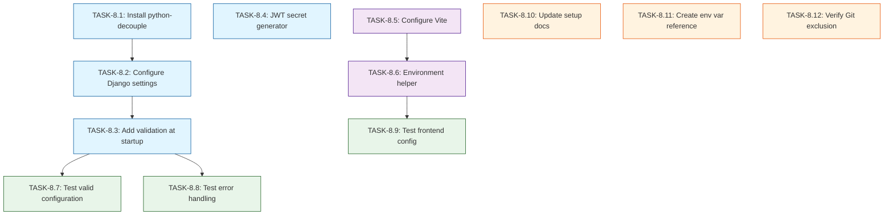

# US-8: Environment Configuration Management

**Priority**: P0
**Feature**: Local Development Environment
**Status**: To Do

## Overview

This User Story establishes secure management of API keys, database credentials, and configuration for the AI-powered Technology Watch Platform. The implementation uses environment files (.env) following the Twelve-Factor App methodology, ensuring the same codebase can run in different environments with only configuration changes.

### Context

The platform requires multiple external API keys (Google AI Studio, Firecrawl), database credentials, JWT secrets, and service URLs. These sensitive values must be configured without committing them to version control. Environment files provide a secure, developer-friendly solution.

**Current State**: Example environment files (`.env.backend.example`, `.env.frontend.example`) already exist with comprehensive documentation. Docker Compose is configured to load env files. The .gitignore already excludes .env files.

**Remaining Work**: Implement environment variable loading in Django backend and Vite frontend, add validation for required variables, create testing, and update documentation.

### Decomposition Approach

- Total tasks: **12**
- Backend: **4 tasks** (dependency management, settings configuration, validation, security utilities)
- Frontend: **2 tasks** (Vite configuration, access helpers)
- Testing: **3 tasks** (integration tests for valid/invalid scenarios)
- Infrastructure: **3 tasks** (documentation, Git verification)

---

## Task Summary

| ID | Title | Type | Specialty | Effort | Dependencies | Status |
|----|-------|------|-----------|--------|--------------|--------|
| TASK-8.1 | Install python-decouple dependency | Backend | Config | 0.5h | None | ⬜ |
| TASK-8.2 | Configure Django settings for environment loading | Backend | Config | 3h | TASK-8.1 | ⬜ |
| TASK-8.3 | Add environment variable validation at startup | Backend | Config | 2h | TASK-8.2 | ⬜ |
| TASK-8.4 | Create JWT secret generation utility | Backend | Security | 1h | None | ⬜ |
| TASK-8.5 | Configure Vite to load environment variables | Frontend | Config | 1h | None | ⬜ |
| TASK-8.6 | Create environment variable access helper | Frontend | Config | 1.5h | TASK-8.5 | ⬜ |
| TASK-8.7 | Test backend with valid environment configuration | Testing | Integration | 2h | TASK-8.3 | ⬜ |
| TASK-8.8 | Test backend error handling for missing variables | Testing | Integration | 2h | TASK-8.3 | ⬜ |
| TASK-8.9 | Test frontend environment variable loading | Testing | Integration | 1h | TASK-8.6 | ⬜ |
| TASK-8.10 | Update setup documentation with env configuration | Infrastructure | Documentation | 2h | None | ⬜ |
| TASK-8.11 | Create environment variable reference docs | Infrastructure | Documentation | 1.5h | None | ⬜ |
| TASK-8.12 | Verify .env files excluded from Git | Infrastructure | Config | 1h | None | ⬜ |

---

## Task Details

### 🔧 Backend Tasks

#### TASK-8.1: Install python-decouple dependency

**Type**: Backend - Config
**Priority**: P0
**Estimated Effort**: 0.5 hours

##### Description

Install the `python-decouple` library via Poetry to enable secure loading of environment variables in Django. This library provides a clean API for accessing environment variables with type coercion, default values, and clear error messages for missing required variables. The library follows the Twelve-Factor App methodology and is the recommended approach for Django environment configuration.

##### Files Impacted

- `backend/pyproject.toml` (modified - add python-decouple to dependencies)
- `backend/poetry.lock` (modified - Poetry will update lock file)

##### Acceptance Criteria

- [ ] python-decouple added to `[tool.poetry.dependencies]` section of pyproject.toml
- [ ] Version constraint specified (e.g., `python-decouple = "^3.8"`)
- [ ] `poetry lock` executed successfully without conflicts
- [ ] `poetry install` completes and decouple is available in virtual environment
- [ ] Library can be imported: `from decouple import config` works without errors

##### Dependencies

- None

##### Implementation Notes

**Installation command**:
```bash
cd backend
poetry add python-decouple
```

**Version recommendation**: Use latest stable (3.8+)

**Alternative**: `django-environ` could be used instead, but python-decouple is lighter and sufficient for this use case.

---

#### TASK-8.2: Configure Django settings to load environment variables

**Type**: Backend - Config
**Priority**: P0
**Estimated Effort**: 3 hours

##### Description

Update Django settings files to load all configuration from environment variables using python-decouple instead of hardcoded values. This includes database URLs, Redis URLs, JWT secrets, API keys, and Django configuration. Implement proper type coercion (strings, booleans, integers) and provide sensible defaults for optional variables. Ensure the backend fails fast with clear error messages if required variables are missing.

##### Files Impacted

- `backend/veille_tech/settings/base.py` (modified - add decouple imports and env variable loading)
- `backend/veille_tech/settings/development.py` (modified - development-specific env overrides if needed)
- `backend/veille_tech/settings/production.py` (modified - production-specific env settings)
- `backend/config/__init__.py` (potentially new - centralized config module)

##### Acceptance Criteria

- [ ] All hardcoded secrets removed from settings files
- [ ] Database configuration loads from `DATABASE_URL` environment variable
- [ ] Redis configuration loads from `REDIS_URL`, `CELERY_BROKER_URL`, `REDIS_CACHE_URL`
- [ ] Django settings load from environment: `SECRET_KEY`, `DEBUG`, `ALLOWED_HOSTS`
- [ ] JWT configuration loads from: `JWT_SECRET_KEY`, `JWT_ACCESS_TOKEN_LIFETIME_MINUTES`, `JWT_REFRESH_TOKEN_LIFETIME_DAYS`
- [ ] AI API keys load from: `GOOGLE_AI_STUDIO_API_KEY`, `FIRECRAWL_API_KEY`
- [ ] Type coercion works correctly (booleans for DEBUG, integers for timeouts, lists for ALLOWED_HOSTS)
- [ ] Optional variables have sensible defaults (e.g., `DEBUG=True` for development)
- [ ] Backend starts successfully with valid .env.backend file

##### Dependencies

- TASK-8.1 (python-decouple must be installed)

##### Implementation Notes

**Example configuration pattern**:
```python
from decouple import config, Csv

# Database
DATABASES = {
    'default': {
        'ENGINE': 'django.db.backends.postgresql',
        'NAME': config('POSTGRES_DB'),
        'USER': config('POSTGRES_USER'),
        'PASSWORD': config('POSTGRES_PASSWORD'),
        'HOST': config('POSTGRES_HOST', default='db'),
        'PORT': config('POSTGRES_PORT', default=5432, cast=int),
    }
}

# Or use dj-database-url for DATABASE_URL parsing
import dj_database_url
DATABASES = {
    'default': dj_database_url.config(
        default=config('DATABASE_URL')
    )
}

# Redis
REDIS_URL = config('REDIS_CACHE_URL', default='redis://redis:6379/1')

# Celery
CELERY_BROKER_URL = config('CELERY_BROKER_URL')
CELERY_RESULT_BACKEND = config('CELERY_RESULT_BACKEND')

# Django
SECRET_KEY = config('SECRET_KEY')
DEBUG = config('DEBUG', default=False, cast=bool)
ALLOWED_HOSTS = config('ALLOWED_HOSTS', default='localhost,127.0.0.1', cast=Csv())

# JWT
JWT_SECRET_KEY = config('JWT_SECRET_KEY', default=SECRET_KEY)
JWT_ACCESS_TOKEN_LIFETIME = config('JWT_ACCESS_TOKEN_LIFETIME_MINUTES', default=60, cast=int)

# AI APIs
GOOGLE_AI_STUDIO_API_KEY = config('GOOGLE_AI_STUDIO_API_KEY')
FIRECRAWL_API_KEY = config('FIRECRAWL_API_KEY')
```

**Required variables** (no defaults):
- DATABASE_URL or (POSTGRES_USER, POSTGRES_PASSWORD, POSTGRES_DB)
- SECRET_KEY
- JWT_SECRET_KEY
- GOOGLE_AI_STUDIO_API_KEY
- FIRECRAWL_API_KEY

**Best practices**:
- Use `cast` parameter for type conversion
- Use `Csv()` for comma-separated lists
- Provide defaults only for optional variables
- Group related settings together

---

#### TASK-8.3: Add environment variable validation at startup

**Type**: Backend - Config
**Priority**: P1
**Estimated Effort**: 2 hours

##### Description

Implement a startup check that validates all required environment variables are present and correctly formatted before the Django application fully initializes. This prevents the application from starting in an inconsistent state and provides clear, actionable error messages to developers when configuration is missing or invalid. The validation should run automatically during Django initialization.

##### Files Impacted

- `backend/veille_tech/apps.py` (modified - add AppConfig with ready() method)
- `backend/veille_tech/config_validator.py` (new - validation logic)
- `backend/veille_tech/settings/base.py` (modified - import and trigger validation)

##### Acceptance Criteria

- [ ] Validation runs automatically on Django startup (via AppConfig.ready())
- [ ] Checks presence of all required environment variables
- [ ] Validates format of critical variables (DATABASE_URL, REDIS_URL patterns)
- [ ] Validates API keys are not placeholder values (not "your-api-key-here")
- [ ] Clear error messages displayed when variables missing or invalid
- [ ] Error messages include:
  - Which variable is missing/invalid
  - Expected format or pattern
  - Link to documentation for obtaining API keys
- [ ] Application exits with non-zero code if validation fails
- [ ] Validation skipped for certain management commands (e.g., `makemigrations`, `shell`)
- [ ] No performance impact (< 100ms validation time)

##### Dependencies

- TASK-8.2 (settings must load environment variables first)

##### Implementation Notes

**Example validation structure**:
```python
# backend/veille_tech/config_validator.py
import sys
from decouple import config, UndefinedValueError
from urllib.parse import urlparse

class ConfigurationError(Exception):
    pass

def validate_environment():
    """Validate required environment variables at startup."""

    required_vars = [
        'DATABASE_URL',
        'SECRET_KEY',
        'JWT_SECRET_KEY',
        'GOOGLE_AI_STUDIO_API_KEY',
        'FIRECRAWL_API_KEY',
    ]

    errors = []

    # Check presence
    for var in required_vars:
        try:
            value = config(var)
            if not value or value in ['your-api-key-here', 'your-secret-key-here']:
                errors.append(
                    f"❌ {var} is set to placeholder value. "
                    f"Please update .env.backend with actual value."
                )
        except UndefinedValueError:
            errors.append(
                f"❌ {var} is not set. "
                f"Please copy .env.backend.example to .env.backend and fill in values."
            )

    # Validate DATABASE_URL format
    try:
        db_url = config('DATABASE_URL')
        parsed = urlparse(db_url)
        if parsed.scheme not in ['postgresql', 'postgres']:
            errors.append(f"❌ DATABASE_URL must use postgresql:// scheme")
    except:
        pass

    # Display errors
    if errors:
        print("\n" + "="*60)
        print("⚠️  CONFIGURATION ERROR")
        print("="*60)
        for error in errors:
            print(error)
        print("\n📚 Documentation: docs/setup/00_setup_local_docker.md")
        print("="*60 + "\n")
        raise ConfigurationError("Environment configuration invalid")

# backend/veille_tech/apps.py
from django.apps import AppConfig

class VeilleTechConfig(AppConfig):
    default_auto_field = 'django.db.models.BigAutoField'
    name = 'veille_tech'

    def ready(self):
        # Skip validation for certain commands
        import sys
        skip_commands = ['makemigrations', 'migrate', 'shell', 'createsuperuser']
        if any(cmd in sys.argv for cmd in skip_commands):
            return

        from .config_validator import validate_environment
        validate_environment()
```

**Performance**: Validation should complete in < 100ms

---

#### TASK-8.4: Create JWT secret generation utility

**Type**: Backend - Security
**Priority**: P2
**Estimated Effort**: 1 hour

##### Description

Create a command-line utility script that generates cryptographically secure random secrets for JWT_SECRET_KEY and SECRET_KEY. This helps developers easily generate strong secrets instead of using placeholder values. The utility should generate secrets of appropriate length (minimum 50 characters) and output them in a format that can be directly copied to .env.backend.

##### Files Impacted

- `backend/scripts/generate_secrets.py` (new - secret generation utility)
- `backend/README.md` (modified - document how to use the utility)

##### Acceptance Criteria

- [ ] Script generates cryptographically secure random secrets using `secrets` module
- [ ] Generates both SECRET_KEY and JWT_SECRET_KEY (minimum 50 characters each)
- [ ] Output format ready for copying to .env.backend
- [ ] Can be run with: `python scripts/generate_secrets.py`
- [ ] Can also be run with: `poetry run python scripts/generate_secrets.py`
- [ ] Script includes usage documentation in docstring
- [ ] Secrets are URL-safe (no special characters that need escaping)

##### Dependencies

- None (independent utility)

##### Implementation Notes

**Example script**:
```python
#!/usr/bin/env python
"""
Generate cryptographically secure secrets for Django configuration.

Usage:
    python scripts/generate_secrets.py
    poetry run python scripts/generate_secrets.py

Output format ready for copying to .env.backend
"""

import secrets
import string

def generate_secret(length=50):
    """Generate a cryptographically secure random secret."""
    alphabet = string.ascii_letters + string.digits
    return ''.join(secrets.choice(alphabet) for _ in range(length))

if __name__ == '__main__':
    print("\n" + "="*60)
    print("🔐 Generated Secrets for Django Configuration")
    print("="*60)
    print("\nCopy these values to your .env.backend file:\n")
    print(f"SECRET_KEY={generate_secret(64)}")
    print(f"JWT_SECRET_KEY={generate_secret(64)}")
    print("\n" + "="*60)
    print("⚠️  Keep these secrets private and never commit to Git!")
    print("="*60 + "\n")
```

**Alternative**: Could be implemented as a Django management command (`python manage.py generate_secrets`), but standalone script is simpler.

---

### 🎨 Frontend Tasks

#### TASK-8.5: Configure Vite to load environment variables

**Type**: Frontend - Config
**Priority**: P0
**Estimated Effort**: 1 hour

##### Description

Ensure Vite is properly configured to load environment variables from .env.frontend file. Vite automatically loads .env files, but the configuration needs verification and potentially custom setup for environment modes. Add TypeScript type definitions for environment variables to enable autocomplete and type safety when accessing `import.meta.env` variables.

##### Files Impacted

- `frontend/vite.config.js` or `frontend/vite.config.ts` (modified - verify/update env configuration)
- `frontend/src/vite-env.d.ts` (new or modified - TypeScript definitions for env vars)
- `frontend/.env.frontend` (reference - not modified, just used for testing)

##### Acceptance Criteria

- [ ] Vite configuration verified to load .env.frontend file
- [ ] Environment variables prefixed with `VITE_` are accessible
- [ ] `import.meta.env.VITE_API_URL` accessible in application code
- [ ] TypeScript definitions added for all VITE_ environment variables
- [ ] Autocomplete works for environment variables in IDE
- [ ] Type errors shown if accessing undefined environment variables
- [ ] Frontend starts successfully with .env.frontend file present
- [ ] Changes to .env.frontend require frontend restart (documented behavior)

##### Dependencies

- None

##### Implementation Notes

**Vite automatically loads**:
- `.env` - All environments
- `.env.local` - All environments, ignored by git
- `.env.[mode]` - Specific environment (e.g., `.env.development`)
- `.env.[mode].local` - Specific environment, ignored by git

For this project, using `.env.frontend` as the primary file (loaded via docker-compose env_file).

**TypeScript definitions** (`frontend/src/vite-env.d.ts`):
```typescript
/// <reference types="vite/client" />

interface ImportMetaEnv {
  readonly VITE_API_URL: string
  readonly VITE_ENABLE_SSO: string
  readonly VITE_ENABLE_ANALYTICS: string
  readonly VITE_DEBUG_MODE: string
  readonly VITE_ENV: string
}

interface ImportMeta {
  readonly env: ImportMetaEnv
}
```

**Vite config verification** (`vite.config.ts`):
```typescript
import { defineConfig, loadEnv } from 'vite'
import react from '@vitejs/plugin-react'

export default defineConfig(({ mode }) => {
  // Load env file based on mode
  const env = loadEnv(mode, process.cwd(), '')

  return {
    plugins: [react()],
    server: {
      host: '0.0.0.0', // Required for Docker
      port: 3000,
    },
    // Environment variables are automatically available
  }
})
```

**Access pattern in code**:
```typescript
const apiUrl = import.meta.env.VITE_API_URL
const isSSO = import.meta.env.VITE_ENABLE_SSO === 'true'
```

---

#### TASK-8.6: Create environment variable access helper

**Type**: Frontend - Config
**Priority**: P1
**Estimated Effort**: 1.5 hours

##### Description

Create a centralized utility module for safely accessing environment variables with validation, type conversion, and fallback values. This provides a consistent API for environment configuration throughout the frontend codebase and adds runtime validation to catch configuration errors early. The helper should support string, boolean, and number types with proper parsing.

##### Files Impacted

- `frontend/src/config/env.ts` (new - environment variable access utilities)
- `frontend/src/config/index.ts` (new - centralized config export)
- `frontend/src/main.tsx` (modified - validate config on app startup)

##### Acceptance Criteria

- [ ] Utility module created with type-safe environment variable access
- [ ] Supports string, boolean, and number types with proper parsing
- [ ] Required variables throw clear errors if missing
- [ ] Optional variables support default values
- [ ] Boolean parsing handles 'true', 'false', '1', '0' correctly
- [ ] Configuration validated on application startup
- [ ] Clear error messages for missing required variables
- [ ] Centralized config object exported for application use
- [ ] Documentation comments explain each configuration value

##### Dependencies

- TASK-8.5 (Vite configuration must be set up first)

##### Implementation Notes

**Environment helper** (`frontend/src/config/env.ts`):
```typescript
class ConfigError extends Error {
  constructor(message: string) {
    super(message)
    this.name = 'ConfigError'
  }
}

function getEnvVar(key: string, required: boolean = true): string {
  const value = import.meta.env[key]

  if (!value && required) {
    throw new ConfigError(
      `Missing required environment variable: ${key}\n` +
      `Please ensure .env.frontend is copied from .env.frontend.example and contains: ${key}`
    )
  }

  return value || ''
}

function getEnvBool(key: string, defaultValue: boolean = false): boolean {
  const value = getEnvVar(key, false)
  if (!value) return defaultValue
  return value.toLowerCase() === 'true' || value === '1'
}

function getEnvNumber(key: string, defaultValue?: number): number {
  const value = getEnvVar(key, defaultValue === undefined)
  if (!value && defaultValue !== undefined) return defaultValue
  const parsed = parseInt(value, 10)
  if (isNaN(parsed)) {
    throw new ConfigError(`Invalid number for ${key}: ${value}`)
  }
  return parsed
}

// Export configuration
export const config = {
  apiUrl: getEnvVar('VITE_API_URL'),
  env: getEnvVar('VITE_ENV', false) || 'development',
  enableSSO: getEnvBool('VITE_ENABLE_SSO', false),
  enableAnalytics: getEnvBool('VITE_ENABLE_ANALYTICS', false),
  debugMode: getEnvBool('VITE_DEBUG_MODE', false),
} as const

// Validate configuration on import
export function validateConfig() {
  try {
    // Force evaluation of all required fields
    const _ = config.apiUrl

    // Validate API URL format
    try {
      new URL(config.apiUrl)
    } catch {
      throw new ConfigError(`VITE_API_URL is not a valid URL: ${config.apiUrl}`)
    }

    console.log('✅ Configuration loaded successfully')
    if (config.debugMode) {
      console.log('Configuration:', config)
    }
  } catch (error) {
    console.error('❌ Configuration Error:', error)
    throw error
  }
}
```

**Usage in application** (`frontend/src/services/api.ts`):
```typescript
import { config } from '@/config'

const apiClient = axios.create({
  baseURL: config.apiUrl,
})
```

**Startup validation** (`frontend/src/main.tsx`):
```typescript
import { validateConfig } from './config/env'

// Validate configuration before rendering app
validateConfig()

ReactDOM.createRoot(document.getElementById('root')!).render(
  <React.StrictMode>
    <App />
  </React.StrictMode>
)
```

---

### ✅ Testing Tasks

#### TASK-8.7: Test backend with valid environment configuration

**Type**: Testing - Integration
**Priority**: P0
**Estimated Effort**: 2 hours

##### Description

Create integration tests that verify the Django backend correctly loads and uses environment variables when a valid .env.backend file is present. Tests should verify database connectivity, Redis connectivity, API key availability, and proper parsing of all configuration types (strings, booleans, integers, lists). These tests validate the happy path of environment configuration.

##### Files Impacted

- `backend/tests/test_config.py` (new - configuration loading tests)
- `backend/tests/fixtures/.env.test` (new - test environment file)
- `backend/pytest.ini` or `backend/pyproject.toml` (modified - test configuration)

##### Acceptance Criteria

- [ ] Test verifies DATABASE_URL is loaded and parsed correctly
- [ ] Test verifies Redis URLs are loaded (CELERY_BROKER_URL, REDIS_CACHE_URL)
- [ ] Test verifies Django settings loaded (SECRET_KEY, DEBUG, ALLOWED_HOSTS)
- [ ] Test verifies JWT configuration loaded correctly
- [ ] Test verifies AI API keys are accessible
- [ ] Test verifies boolean values parsed correctly (DEBUG=True becomes boolean True)
- [ ] Test verifies integer values parsed correctly (JWT_ACCESS_TOKEN_LIFETIME_MINUTES)
- [ ] Test verifies CSV lists parsed correctly (ALLOWED_HOSTS)
- [ ] Test verifies database connection successful with loaded credentials
- [ ] Test verifies Redis connection successful with loaded URL
- [ ] All tests pass with valid .env.backend configuration

##### Dependencies

- TASK-8.3 (configuration loading must be implemented)

##### Implementation Notes

**Test structure**:
```python
# backend/tests/test_config.py
import pytest
from django.conf import settings
from django.core.cache import cache
from django.db import connection

class TestEnvironmentConfiguration:

    def test_database_url_loaded(self):
        """Test DATABASE_URL is loaded and database is accessible."""
        assert settings.DATABASES['default']['ENGINE'] == 'django.db.backends.postgresql'
        assert settings.DATABASES['default']['NAME']

        # Test actual connection
        with connection.cursor() as cursor:
            cursor.execute("SELECT 1")
            assert cursor.fetchone() == (1,)

    def test_redis_configuration_loaded(self):
        """Test Redis URLs are loaded and Redis is accessible."""
        assert settings.CELERY_BROKER_URL
        assert settings.CELERY_BROKER_URL.startswith('redis://')

        # Test cache connection
        cache.set('test_key', 'test_value', 10)
        assert cache.get('test_key') == 'test_value'

    def test_django_settings_loaded(self):
        """Test Django settings loaded from environment."""
        assert settings.SECRET_KEY
        assert len(settings.SECRET_KEY) >= 50
        assert isinstance(settings.DEBUG, bool)
        assert isinstance(settings.ALLOWED_HOSTS, list)

    def test_jwt_configuration_loaded(self):
        """Test JWT settings loaded correctly."""
        # Access JWT settings (implementation depends on JWT library)
        assert hasattr(settings, 'JWT_SECRET_KEY') or hasattr(settings, 'SIMPLE_JWT')

    def test_api_keys_loaded(self):
        """Test AI API keys are accessible."""
        assert settings.GOOGLE_AI_STUDIO_API_KEY
        assert settings.GOOGLE_AI_STUDIO_API_KEY != 'your-google-ai-studio-api-key-here'
        assert settings.FIRECRAWL_API_KEY
        assert settings.FIRECRAWL_API_KEY != 'your-firecrawl-api-key-here'

    def test_type_coercion(self):
        """Test environment variables are correctly type-coerced."""
        # Boolean
        assert isinstance(settings.DEBUG, bool)

        # Integer (if JWT timeout configured as int)
        if hasattr(settings, 'JWT_ACCESS_TOKEN_LIFETIME'):
            assert isinstance(settings.JWT_ACCESS_TOKEN_LIFETIME, int)

        # List (CSV)
        assert isinstance(settings.ALLOWED_HOSTS, list)
```

**Test environment setup**:
- Use pytest fixtures to set up test environment variables
- Or use a separate .env.test file for testing
- Mock external API calls (don't actually call Google AI or Firecrawl in tests)

---

#### TASK-8.8: Test backend error handling for missing variables

**Type**: Testing - Integration
**Priority**: P0
**Estimated Effort**: 2 hours

##### Description

Create integration tests that verify the Django backend fails gracefully with clear error messages when required environment variables are missing or invalid. Tests should verify validation logic catches missing variables, placeholder values, malformed URLs, and other configuration errors. These tests validate error scenarios and ensure developers get actionable feedback.

##### Files Impacted

- `backend/tests/test_config_validation.py` (new - validation error tests)
- `backend/tests/conftest.py` (modified - fixtures for temporarily unsetting env vars)

##### Acceptance Criteria

- [ ] Test verifies error raised when DATABASE_URL missing
- [ ] Test verifies error raised when SECRET_KEY missing
- [ ] Test verifies error raised when JWT_SECRET_KEY missing
- [ ] Test verifies error raised when API keys missing
- [ ] Test verifies error raised for placeholder API key values
- [ ] Test verifies error raised for malformed DATABASE_URL
- [ ] Test verifies clear error message shown with missing variable name
- [ ] Test verifies error message includes resolution instructions
- [ ] Test verifies application exits with non-zero code on configuration error
- [ ] Tests use context managers to temporarily unset environment variables
- [ ] All validation tests pass

##### Dependencies

- TASK-8.3 (validation logic must be implemented)

##### Implementation Notes

**Test structure**:
```python
# backend/tests/test_config_validation.py
import pytest
from unittest.mock import patch
from veille_tech.config_validator import validate_environment, ConfigurationError

class TestConfigurationValidation:

    def test_missing_database_url(self, unset_env_var):
        """Test error when DATABASE_URL is missing."""
        with unset_env_var('DATABASE_URL'):
            with pytest.raises(ConfigurationError) as exc_info:
                validate_environment()

            assert 'DATABASE_URL' in str(exc_info.value)
            assert 'not set' in str(exc_info.value)

    def test_missing_api_keys(self, unset_env_var):
        """Test error when API keys are missing."""
        with unset_env_var('GOOGLE_AI_STUDIO_API_KEY'):
            with pytest.raises(ConfigurationError) as exc_info:
                validate_environment()

            assert 'GOOGLE_AI_STUDIO_API_KEY' in str(exc_info.value)

    def test_placeholder_api_key_rejected(self, set_env_var):
        """Test error when API key is placeholder value."""
        with set_env_var('GOOGLE_AI_STUDIO_API_KEY', 'your-google-ai-studio-api-key-here'):
            with pytest.raises(ConfigurationError) as exc_info:
                validate_environment()

            assert 'placeholder' in str(exc_info.value).lower()

    def test_invalid_database_url_format(self, set_env_var):
        """Test error when DATABASE_URL is malformed."""
        with set_env_var('DATABASE_URL', 'not-a-valid-url'):
            with pytest.raises(ConfigurationError) as exc_info:
                validate_environment()

            assert 'DATABASE_URL' in str(exc_info.value)

    def test_error_message_quality(self, unset_env_var):
        """Test error messages are clear and actionable."""
        with unset_env_var('SECRET_KEY'):
            with pytest.raises(ConfigurationError) as exc_info:
                validate_environment()

            error_msg = str(exc_info.value)
            # Should mention the variable name
            assert 'SECRET_KEY' in error_msg
            # Should provide resolution hint
            assert '.env' in error_msg or 'environment' in error_msg.lower()

# backend/tests/conftest.py
import pytest
import os
from contextlib import contextmanager

@pytest.fixture
def unset_env_var():
    """Fixture to temporarily unset an environment variable."""
    @contextmanager
    def _unset(var_name):
        original_value = os.environ.get(var_name)
        if var_name in os.environ:
            del os.environ[var_name]
        try:
            yield
        finally:
            if original_value is not None:
                os.environ[var_name] = original_value

    return _unset

@pytest.fixture
def set_env_var():
    """Fixture to temporarily set an environment variable."""
    @contextmanager
    def _set(var_name, value):
        original_value = os.environ.get(var_name)
        os.environ[var_name] = value
        try:
            yield
        finally:
            if original_value is not None:
                os.environ[var_name] = original_value
            elif var_name in os.environ:
                del os.environ[var_name]

    return _set
```

**Note**: These tests need to run in isolation and should not affect other tests.

---

#### TASK-8.9: Test frontend environment variable loading

**Type**: Testing - Integration
**Priority**: P1
**Estimated Effort**: 1 hour

##### Description

Create tests for the frontend environment configuration helper to verify it correctly loads, parses, and validates environment variables. Tests should cover type coercion (string, boolean, number), required variable validation, and error handling. Use Vitest or Jest depending on the project's testing framework.

##### Files Impacted

- `frontend/src/config/env.test.ts` (new - environment helper tests)
- `frontend/vitest.config.ts` or `frontend/jest.config.js` (modified - test configuration if needed)

##### Acceptance Criteria

- [ ] Test verifies required variables throw error when missing
- [ ] Test verifies optional variables return default values
- [ ] Test verifies boolean parsing works correctly ('true', 'false', '1', '0')
- [ ] Test verifies number parsing works correctly
- [ ] Test verifies invalid numbers throw clear errors
- [ ] Test verifies config object has correct structure
- [ ] Test verifies API URL validation catches malformed URLs
- [ ] Test verifies validateConfig() function works correctly
- [ ] All frontend configuration tests pass
- [ ] Tests use mocked import.meta.env for isolation

##### Dependencies

- TASK-8.6 (environment helper must be implemented)

##### Implementation Notes

**Test structure** (using Vitest):
```typescript
// frontend/src/config/env.test.ts
import { describe, it, expect, vi, beforeEach } from 'vitest'

// Mock import.meta.env
const mockEnv = {
  VITE_API_URL: 'http://localhost:8000/api',
  VITE_ENV: 'development',
  VITE_ENABLE_SSO: 'true',
  VITE_ENABLE_ANALYTICS: 'false',
  VITE_DEBUG_MODE: '1',
}

vi.stubGlobal('import.meta', {
  env: mockEnv
})

// Import after mocking
import { config, validateConfig } from './env'

describe('Environment Configuration', () => {

  it('loads API URL correctly', () => {
    expect(config.apiUrl).toBe('http://localhost:8000/api')
  })

  it('parses boolean strings correctly', () => {
    expect(config.enableSSO).toBe(true)
    expect(config.enableAnalytics).toBe(false)
    expect(config.debugMode).toBe(true) // '1' -> true
  })

  it('throws error for missing required variable', () => {
    vi.stubGlobal('import.meta', {
      env: { ...mockEnv, VITE_API_URL: '' }
    })

    expect(() => {
      // Re-import to trigger validation
      jest.isolateModules(() => {
        require('./env')
      })
    }).toThrow(/VITE_API_URL/)
  })

  it('validates API URL format', () => {
    vi.stubGlobal('import.meta', {
      env: { ...mockEnv, VITE_API_URL: 'not-a-url' }
    })

    expect(() => validateConfig()).toThrow(/not a valid URL/)
  })

  it('returns default values for optional variables', () => {
    vi.stubGlobal('import.meta', {
      env: { VITE_API_URL: 'http://localhost:8000' }
    })

    // Re-import
    jest.isolateModules(() => {
      const { config } = require('./env')
      expect(config.enableSSO).toBe(false)
      expect(config.env).toBe('development')
    })
  })
})
```

**Vitest configuration** (`vitest.config.ts`):
```typescript
import { defineConfig } from 'vitest/config'

export default defineConfig({
  test: {
    globals: true,
    environment: 'jsdom',
  },
})
```

---

### ⚙️ Infrastructure Tasks

#### TASK-8.10: Update setup documentation with environment configuration

**Type**: Infrastructure - Documentation
**Priority**: P0
**Estimated Effort**: 2 hours

##### Description

Update the local development setup documentation (`docs/setup/00_setup_local_docker.md`) to include comprehensive instructions for environment configuration. Documentation should cover copying example files, filling in API keys, understanding required vs optional variables, and troubleshooting common configuration issues. Include links to obtain API keys from Google AI Studio and Firecrawl.

##### Files Impacted

- `docs/setup/00_setup_local_docker.md` (modified - add environment configuration section)
- `README.md` (modified - add quick reference to environment setup)

##### Acceptance Criteria

- [ ] Documentation includes step-by-step instructions for copying .env files
- [ ] Instructions show exact commands: `cp .env.backend.example .env.backend`
- [ ] Documentation explains required vs optional variables
- [ ] Links provided to obtain Google AI Studio API key (https://makersuite.google.com/app/apikey)
- [ ] Links provided to obtain Firecrawl API key (https://firecrawl.dev/)
- [ ] Instructions for generating secure secrets using utility script
- [ ] Troubleshooting section covers common issues:
  - Missing .env file errors
  - Invalid API key errors
  - Database connection errors due to wrong credentials
- [ ] Examples show correct format for each type of variable
- [ ] Security warnings included (never commit .env files to Git)
- [ ] Documentation tested by following it step-by-step

##### Dependencies

- None (can be done in parallel)

##### Implementation Notes

**Add to `docs/setup/00_setup_local_docker.md`**:

```markdown
## Environment Configuration

### Step 1: Copy Environment Example Files

The project requires two environment files for configuration:

```bash
# Copy backend environment file
cp .env.backend.example .env.backend

# Copy frontend environment file
cp .env.frontend.example .env.frontend
```

⚠️ **Important**: Never commit `.env.backend` or `.env.frontend` to Git. These files contain secrets and are already excluded via `.gitignore`.

### Step 2: Generate Secure Secrets

Generate secure random secrets for Django and JWT:

```bash
cd backend
poetry run python scripts/generate_secrets.py
```

Copy the generated values to your `.env.backend` file.

### Step 3: Obtain API Keys

The platform requires API keys for AI services:

**Google AI Studio** (required):
1. Visit: https://makersuite.google.com/app/apikey
2. Sign in with Google account
3. Click "Create API Key"
4. Copy the key and paste into `.env.backend` as `GOOGLE_AI_STUDIO_API_KEY`

**Firecrawl** (required):
1. Visit: https://firecrawl.dev/
2. Sign up for free account
3. Navigate to API Keys section
4. Copy the key and paste into `.env.backend` as `FIRECRAWL_API_KEY`

### Step 4: Configure Database Credentials

Update the database password in `.env.backend`:

```bash
# Replace with a strong password (min 16 characters)
POSTGRES_PASSWORD=your_very_secure_password_here_min_16_chars

# Update the DATABASE_URL accordingly
DATABASE_URL=postgresql://veille_tech_user:your_very_secure_password_here_min_16_chars@db:5432/veille_tech_db
```

### Step 5: Verify Configuration

Check that all required variables are set:

```bash
# Backend required variables
grep -E "^(POSTGRES_PASSWORD|DATABASE_URL|SECRET_KEY|JWT_SECRET_KEY|GOOGLE_AI_STUDIO_API_KEY|FIRECRAWL_API_KEY)" .env.backend

# Frontend required variables
grep -E "^VITE_API_URL" .env.frontend
```

### Environment Variables Reference

See [Environment Variables Reference](./environment_variables.md) for complete documentation of all configuration options.

## Troubleshooting Environment Issues

### Error: "DATABASE_URL environment variable not set"

**Cause**: The `.env.backend` file is missing or not loaded by Docker Compose.

**Solution**:
1. Verify `.env.backend` exists: `ls -la .env.backend`
2. Verify it contains `DATABASE_URL=...`
3. Restart services: `docker-compose down && docker-compose up`

### Error: "Invalid API key" from Google AI

**Cause**: The `GOOGLE_AI_STUDIO_API_KEY` is incorrect or expired.

**Solution**:
1. Verify the API key in `.env.backend` matches the key from Google AI Studio
2. Check API key hasn't been revoked in Google AI Studio dashboard
3. Ensure there are no extra spaces or quotes around the key

### Error: Backend fails to start with "SECRET_KEY is placeholder"

**Cause**: You haven't replaced the placeholder values in `.env.backend`.

**Solution**:
1. Run `poetry run python scripts/generate_secrets.py`
2. Copy the generated secrets to `.env.backend`
3. Restart backend: `docker-compose restart backend`
```

---

#### TASK-8.11: Create environment variable reference documentation

**Type**: Infrastructure - Documentation
**Priority**: P1
**Estimated Effort**: 1.5 hours

##### Description

Create comprehensive reference documentation for all environment variables used in the platform. Documentation should list each variable, its purpose, whether it's required or optional, default value (if any), expected format, and examples. Organize variables by category (database, Redis, Django, JWT, AI APIs, etc.) for easy navigation.

##### Files Impacted

- `docs/setup/environment_variables.md` (new - complete environment variable reference)

##### Acceptance Criteria

- [ ] Documentation lists all backend environment variables
- [ ] Documentation lists all frontend environment variables
- [ ] Each variable documented with:
  - Name
  - Description (what it does)
  - Required/Optional status
  - Default value (if optional)
  - Expected format (URL, string, boolean, integer, etc.)
  - Example value
  - Notes (security considerations, where to obtain, etc.)
- [ ] Variables organized by category (Database, Redis, Django, JWT, AI, Email, Security)
- [ ] Documentation includes table of contents for easy navigation
- [ ] Cross-references to example files (.env.backend.example, .env.frontend.example)
- [ ] Security best practices section included
- [ ] Documentation is clear and accessible to junior developers

##### Dependencies

- None (can be done in parallel)

##### Implementation Notes

**Create `docs/setup/environment_variables.md`**:

```markdown
# Environment Variables Reference

This document provides a complete reference for all environment variables used in the AI-powered Technology Watch Platform.

## Table of Contents

- [Backend Variables](#backend-variables)
  - [Database Configuration](#database-configuration)
  - [Redis Configuration](#redis-configuration)
  - [Django Settings](#django-settings)
  - [JWT Configuration](#jwt-configuration)
  - [AI/ML API Keys](#aiml-api-keys)
  - [Email Configuration](#email-configuration)
  - [Security Settings](#security-settings)
- [Frontend Variables](#frontend-variables)
- [Security Best Practices](#security-best-practices)

## Backend Variables

Configuration for Django backend service. Set these in `.env.backend`.

### Database Configuration

#### POSTGRES_USER

- **Description**: PostgreSQL database username
- **Required**: Yes
- **Default**: None
- **Format**: String (alphanumeric, no spaces)
- **Example**: `veille_tech_user`

#### POSTGRES_PASSWORD

- **Description**: PostgreSQL database password
- **Required**: Yes
- **Default**: None
- **Format**: String (minimum 16 characters recommended)
- **Example**: `P@ssw0rd1234567890`
- **Security**: Generate with `openssl rand -base64 24`

#### POSTGRES_DB

- **Description**: PostgreSQL database name
- **Required**: Yes
- **Default**: None
- **Format**: String (alphanumeric, underscores allowed)
- **Example**: `veille_tech_db`

[Continue for all variables...]

### Redis Configuration

[Document REDIS_HOST, REDIS_PORT, CELERY_BROKER_URL, REDIS_CACHE_URL...]

### Django Settings

[Document SECRET_KEY, DEBUG, ALLOWED_HOSTS, CORS_ALLOWED_ORIGINS...]

### JWT Configuration

[Document JWT_SECRET_KEY, JWT_ACCESS_TOKEN_LIFETIME_MINUTES, etc...]

### AI/ML API Keys

#### GOOGLE_AI_STUDIO_API_KEY

- **Description**: API key for Google AI Studio (Gemini models)
- **Required**: Yes
- **Default**: None
- **Format**: String (long alphanumeric key)
- **Example**: `AIzaSyC-abc123def456...`
- **Obtain**: https://makersuite.google.com/app/apikey
- **Notes**: Required for AI content synthesis and analysis

#### FIRECRAWL_API_KEY

- **Description**: API key for Firecrawl web scraping service
- **Required**: Yes
- **Default**: None
- **Format**: String (API key format)
- **Example**: `fc-abc123def456...`
- **Obtain**: https://firecrawl.dev/
- **Notes**: Required for web scraping in AI pipeline

[Continue...]

## Frontend Variables

Configuration for React frontend service. Set these in `.env.frontend`.

#### VITE_API_URL

- **Description**: Backend API base URL (without trailing slash)
- **Required**: Yes
- **Default**: None
- **Format**: URL string
- **Example**: `http://localhost:8000/api`
- **Notes**: For Docker, use service name: `http://backend:8000/api`

[Continue for all frontend variables...]

## Security Best Practices

1. **Never commit .env files**: `.gitignore` excludes them, but double-check
2. **Use strong secrets**: Minimum 50 characters for SECRET_KEY and JWT_SECRET_KEY
3. **Rotate secrets regularly**: Change secrets every 90 days in production
4. **Limit API key permissions**: Use least-privilege principle for service accounts
5. **Use separate keys per environment**: Different keys for dev/staging/production
6. **Monitor API usage**: Set up alerts for unusual API consumption

## Generating Secure Secrets

Use the provided utility to generate cryptographically secure secrets:

```bash
cd backend
poetry run python scripts/generate_secrets.py
```

## Environment-Specific Configuration

### Local Development

- `DEBUG=True` for detailed error pages
- `ALLOWED_HOSTS=*` to allow all hosts
- Console email backend for email testing

### Production

- `DEBUG=False` for security
- Specific `ALLOWED_HOSTS` list
- SMTP email backend with real credentials
- Enable HTTPS settings (CSRF_COOKIE_SECURE, SESSION_COOKIE_SECURE)
```

---

#### TASK-8.12: Verify .env files excluded from Git

**Type**: Infrastructure - Config
**Priority**: P0
**Estimated Effort**: 1 hour

##### Description

Verify that .env files are properly excluded from Git version control and add a pre-commit check or CI validation to prevent accidental commits of secrets. This ensures developers never accidentally commit sensitive configuration to the repository. Add documentation about checking for committed secrets if needed.

##### Files Impacted

- `.gitignore` (verify - should already contain .env exclusions)
- `.github/workflows/validate-secrets.yml` (new - optional CI check)
- `docs/setup/security_checklist.md` (new or modified - security validation checklist)

##### Acceptance Criteria

- [ ] `.gitignore` contains entries for .env files (already done, verify)
- [ ] Verification script created to check for .env files in Git history
- [ ] Documentation created explaining how to check for accidentally committed secrets
- [ ] Optional: Pre-commit hook or CI check added to block .env commits
- [ ] Git status shows .env.backend and .env.frontend as untracked (not staged)
- [ ] `git check-ignore .env.backend` returns the file (confirms it's ignored)
- [ ] Repository search for "GOOGLE_AI_API_KEY" in history returns no results (if new repo)

##### Dependencies

- None (verification/documentation task)

##### Implementation Notes

**Verify .gitignore**:
```bash
# Check if .env files are ignored
git check-ignore .env.backend .env.frontend

# Should output:
# .env.backend
# .env.frontend
```

**Check for accidentally committed secrets** (script):
```bash
#!/bin/bash
# scripts/check-secrets.sh

echo "Checking for accidentally committed secrets..."

# Check if any .env files are in Git history
if git log --all --full-history -- ".env*" | grep -q "commit"; then
    echo "⚠️  WARNING: .env files found in Git history!"
    echo "Run: git log --all --full-history -- '.env*'"
    exit 1
fi

# Check for API key patterns in Git history
if git log --all -S "GOOGLE_AI_API_KEY" | grep -q "commit"; then
    echo "⚠️  WARNING: API keys may be in Git history!"
    exit 1
fi

echo "✅ No secrets found in Git history"
```

**Optional: Pre-commit hook** (`.git/hooks/pre-commit`):
```bash
#!/bin/bash
# Prevent committing .env files

if git diff --cached --name-only | grep -E "^\.env"; then
    echo "❌ ERROR: Attempting to commit .env file!"
    echo "These files contain secrets and should never be committed."
    echo "Remove from staging: git reset HEAD .env*"
    exit 1
fi
```

**Documentation** (`docs/setup/security_checklist.md`):
```markdown
# Security Checklist

## Environment Configuration Security

### Pre-Deployment Checklist

- [ ] Verify `.gitignore` contains `.env*` patterns
- [ ] Confirm no .env files in Git history: `git log --all --full-history -- ".env*"`
- [ ] Confirm no API keys in Git history: `git log --all -S "API_KEY"`
- [ ] Verify `.env.backend` and `.env.frontend` not tracked: `git status`
- [ ] Example files contain only placeholders, no real secrets

### If Secrets Were Committed

If you accidentally committed secrets:

1. **Immediately rotate the exposed secrets** (generate new API keys)
2. **Remove from Git history** using BFG Repo-Cleaner or git-filter-repo
3. **Force push** to remote (coordinate with team)
4. **Verify secrets removed** using tools like GitGuardian or TruffleHog

```bash
# Quick check for exposed secrets
git log --all --full-history --source --all -- ".env*"
```

## API Key Security

- [ ] All API keys stored in .env files, never in code
- [ ] Different API keys for dev/staging/production
- [ ] API keys rotated every 90 days
- [ ] Rate limiting configured for API keys
- [ ] API key usage monitored for anomalies
```

---

## Dependency Graph

### Mermaid Diagram



### Implementation Phases

**Phase 1: Backend Configuration Foundation (6 hours)**
- TASK-8.1: Install python-decouple (0.5h)
- TASK-8.2: Configure Django settings (3h)
- TASK-8.3: Add validation at startup (2h)
- TASK-8.4: JWT secret generator (1h) - Parallel

**Phase 2: Frontend Configuration (2.5 hours)**
- TASK-8.5: Configure Vite (1h)
- TASK-8.6: Environment helper (1.5h)

**Phase 3: Testing (5 hours)**
- TASK-8.7: Test valid configuration (2h)
- TASK-8.8: Test error handling (2h)
- TASK-8.9: Test frontend config (1h)

**Phase 4: Documentation (4.5 hours) - Can run in parallel with all phases**
- TASK-8.10: Update setup docs (2h)
- TASK-8.11: Create env var reference (1.5h)
- TASK-8.12: Verify Git exclusion (1h)

### Parallelization Opportunities

**Maximum Parallelization (3 parallel tracks)**:

1. **Backend Track**: TASK-8.1 → TASK-8.2 → TASK-8.3 → TASK-8.7 + TASK-8.8
2. **Frontend Track**: TASK-8.5 → TASK-8.6 → TASK-8.9
3. **Documentation Track**: TASK-8.10, TASK-8.11, TASK-8.12 (all parallel)
4. **Utility Track**: TASK-8.4 (independent)

**With 2 developers**:
- Developer 1: Backend track (6h) + Testing (4h) = 10 hours
- Developer 2: Frontend track (2.5h) + Documentation (4.5h) + Utility (1h) = 8 hours
- **Total time**: ~10 hours (1.5 days)

**With 1 developer** (sequential with some parallelism):
- Days 1-2: Backend configuration (TASK-8.1 → 8.3)
- Day 2: Frontend configuration (TASK-8.5 → 8.6)
- Day 3: Testing (TASK-8.7, 8.8, 8.9) + Documentation (8.10, 8.11, 8.12)
- **Total time**: ~18.5 hours (2-3 days)

---

## Effort Estimation

### By Task Type

| Type | Tasks | Total Effort | Percentage |
|------|-------|--------------|------------|
| Backend | 4 | 6.5h | 35% |
| Frontend | 2 | 2.5h | 14% |
| Testing | 3 | 5h | 27% |
| Infrastructure | 3 | 4.5h | 24% |
| **TOTAL** | **12** | **18.5h** | **100%** |

### By Priority

| Priority | Tasks | Total Effort |
|----------|-------|--------------|
| P0 | 8 | 13.5h |
| P1 | 3 | 4.5h |
| P2 | 1 | 1h |

### By Developer

**1 Full-Stack Developer (Sequential)**:
- Estimated: 18.5 hours
- Calendar time: 2-3 days (accounting for context switching)

**2 Developers (Backend + Frontend/Docs)**:
- Backend dev: 10 hours (backend + testing)
- Frontend/Docs dev: 8 hours (frontend + docs + utility)
- Calendar time: 1.5 days

**3 Developers (Backend + Frontend + Docs)**:
- Backend dev: 6 hours
- Frontend dev: 3.5 hours
- Docs dev: 4.5 hours
- Calendar time: 1 day

---

## Implementation Notes

### Technology Stack

**Backend**:
- Django 4.2+ with Django REST Framework
- Python 3.13
- python-decouple 3.8+ for environment variable management
- PostgreSQL 15 (configured via DATABASE_URL)
- Redis (configured via REDIS_URL)

**Frontend**:
- React 18+ with Vite
- TypeScript (recommended for type-safe env access)
- Node 20 LTS

**Infrastructure**:
- Docker Compose v2
- .env file pattern (Twelve-Factor App methodology)

### Patterns and Conventions

**Environment Variable Naming**:
- Backend: UPPERCASE_WITH_UNDERSCORES (e.g., `DATABASE_URL`)
- Frontend: VITE_ prefix required (e.g., `VITE_API_URL`)
- Boolean values: 'true'/'false' or '1'/'0'
- Lists: Comma-separated (e.g., `ALLOWED_HOSTS=localhost,127.0.0.1`)

**File Organization**:
- `.env.backend` - Backend runtime configuration (Git-ignored)
- `.env.frontend` - Frontend runtime configuration (Git-ignored)
- `.env.backend.example` - Backend template (committed to Git)
- `.env.frontend.example` - Frontend template (committed to Git)

**Configuration Loading Order**:
1. Environment variables from .env file
2. OS-level environment variables (override .env)
3. Docker Compose environment section (override both)

### Configuration Requirements

**Current State**:
- ✅ `.env.backend.example` exists with 112 lines of documented configuration
- ✅ `.env.frontend.example` exists with 30 lines of documented configuration
- ✅ `docker-compose.yml` references env files via `env_file` directive
- ✅ `.gitignore` excludes .env files

**Required Setup**:
- Install python-decouple: `poetry add python-decouple`
- Copy example files: `cp .env.backend.example .env.backend`
- Generate secrets: `poetry run python scripts/generate_secrets.py`
- Obtain API keys from Google AI Studio and Firecrawl

### Dependencies on Other User Stories

**Depends On**:
- US-1: Docker Compose Service Orchestration (env files must be loaded by services)

**Blocks**:
- US-2: Database Service with Vector Support (requires DATABASE_URL)
- US-3: Redis Broker and Cache Service (requires REDIS_URL)
- US-4: Django Backend API Service (requires all backend env vars)
- US-5: React Frontend SPA Service (requires VITE_API_URL)
- US-6: Celery Worker Service (requires API keys for AI pipeline)

---

## Risks and Attention Points

### Identified Risks

**Risk 1: Developers forget to copy .env.example files**
- **Impact**: Medium - Backend/frontend fail to start with cryptic errors
- **Probability**: Medium - Common issue in new projects
- **Mitigation**:
  - Clear documentation with exact commands
  - Consider startup script that checks for .env files and prompts to create them
  - Add validation that prints helpful error if files missing

**Risk 2: API keys may be invalid or expired**
- **Impact**: Medium - AI pipeline fails but other features work
- **Probability**: Low to Medium - Developers may use wrong keys or keys may expire
- **Mitigation**:
  - Implement health checks that validate API connectivity on startup
  - Provide clear error messages with links to obtain/renew keys
  - Document API key lifespan and rotation procedures

**Risk 3: Accidentally committing .env files to Git**
- **Impact**: High - Security breach, exposed secrets
- **Probability**: Low - .gitignore already configured
- **Mitigation**:
  - Verify .gitignore exclusions
  - Optional: Add pre-commit hook to block .env commits
  - Add CI check to scan for accidentally committed secrets
  - Document what to do if secrets are committed

**Risk 4: Different developers have different API quotas/keys**
- **Impact**: Low - Some developers may hit rate limits
- **Probability**: Medium - Free tier API keys have low quotas
- **Mitigation**:
  - Document that API keys are developer-specific
  - Provide instructions for obtaining keys
  - Consider shared development API keys with reasonable quotas
  - Monitor API usage to detect quota issues

**Risk 5: Environment variable naming conflicts**
- **Impact**: Low - Confusing errors if same variable used differently
- **Probability**: Low - Clear naming conventions established
- **Mitigation**:
  - Document all variables in central reference
  - Use clear, descriptive names
  - Avoid generic names like `API_KEY` (use `GOOGLE_AI_API_KEY`)

### Critical Points

**Security**:
- 🔒 Never commit .env files to Git (enforced by .gitignore)
- 🔒 Use strong secrets (minimum 50 characters for SECRET_KEY, JWT_SECRET_KEY)
- 🔒 Example files must contain only placeholder values, never real secrets
- 🔒 Production environments must use secure secret management (AWS Secrets Manager, Azure Key Vault)
- 🔒 Rotate secrets regularly (every 90 days in production)

**Performance**:
- ⚡ Environment variables loaded once at startup (< 100ms overhead acceptable)
- ⚡ No runtime performance impact (variables cached in memory)
- ⚡ Validation should be fast (< 100ms) to avoid slow startup

**User Experience**:
- 💡 Clear error messages when configuration missing
- 💡 Helpful documentation with exact commands
- 💡 Easy-to-follow setup process (< 5 minutes to configure)
- 💡 Validation feedback during development

**Testing**:
- ✅ Test both valid and invalid configuration scenarios
- ✅ Verify error messages are clear and actionable
- ✅ Test type coercion (strings, booleans, integers, lists)
- ✅ Ensure tests don't expose real secrets

---

## Notes

### Current Implementation Status

**Already Completed** (from previous User Stories):
- ✅ `.env.backend.example` created with comprehensive documentation (112 lines)
  - Database configuration (PostgreSQL with pgvector)
  - Redis configuration (broker + cache)
  - Django settings (SECRET_KEY, DEBUG, ALLOWED_HOSTS)
  - JWT configuration
  - AI API keys (Google AI Studio, Firecrawl)
  - Email configuration
  - Microsoft Entra ID SSO (optional)
  - Celery configuration
  - Logging and security settings

- ✅ `.env.frontend.example` created with Vite configuration (30 lines)
  - API URL configuration
  - Feature flags (SSO, analytics, debug mode)
  - Environment indicator

- ✅ `docker-compose.yml` configured with `env_file` directives
  - Backend service loads `.env.backend`
  - Frontend service loads `.env.frontend`
  - All services (db, redis, worker, scheduler) load appropriate env files

- ✅ `.gitignore` updated to exclude .env files
  - `.env`, `.env.local`, `.env.backend`, `.env.frontend` excluded
  - Pattern `*.env` also excluded

**Remaining Work** (this User Story):
- ⬜ Backend environment loading with python-decouple
- ⬜ Environment validation at startup with clear error messages
- ⬜ Frontend environment helper for type-safe access
- ⬜ Integration tests for configuration loading
- ⬜ Documentation updates with setup instructions
- ⬜ Secret generation utility

### Questions / Open Items

- [ ] Should we provide a setup script that automatically copies .env.example files and prompts for API keys?
- [ ] Should we implement a health check endpoint that validates external API connectivity?
- [ ] Do we need a centralized configuration file for shared values between backend and frontend?
- [ ] Should we add a pre-commit hook to block .env commits, or rely on .gitignore?

### Assumptions

- Developers have access to Google AI Studio and can obtain API keys
- Developers familiar with .env file pattern (widely used standard)
- Different developers will use different API keys (not shared team keys)
- Docker Compose properly loads env_file (already configured in US-1)
- API keys are long-lived and don't need frequent rotation in development

### Out of Scope

- Centralized secret management (AWS Secrets Manager, HashiCorp Vault) - Production concern
- Dynamic configuration reloading without restart - Not needed for development
- Configuration UI in Django Admin - Could be added in future iteration
- Encrypted environment files - Production concern, not needed locally
- Environment variable versioning or history - Not a requirement

---

**Generated by**: Functional Spec Planner (decompose-user-story + generate-task-documentation skills)
**Date**: 2025-01-31
**User Story**: US-8 - Environment Configuration Management
**Feature**: Local Development Environment
**Total Tasks**: 12
**Total Effort**: 18.5 hours (2-3 days for 1 developer)
