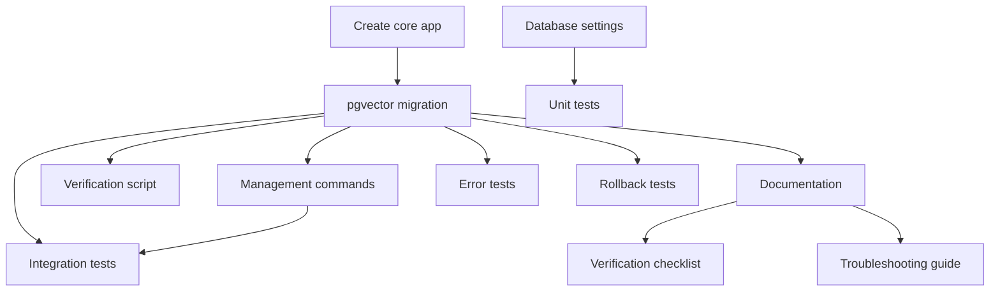

# US-9: Database Initialization and Migrations

**Priority**: P0
**Feature**: Local Development Environment
**Status**: To Do

## Overview

This User Story establishes the automated database schema initialization and migration system using Django's migration framework. The system handles initial database setup (creating tables, indexes, constraints) and ongoing schema evolution, with a critical requirement to enable the pgvector extension before any vector column migrations.

### Context

Database migrations are foundational infrastructure that enables all feature development. Without automated migrations, developers would need to write and maintain SQL scripts manually, leading to inconsistencies across environments and error-prone deployments. The migration system provides:
- Version control for database schema changes
- Idempotent operations (safe to re-run)
- Rollback capability for schema errors
- Dependency tracking across Django apps

The pgvector extension is required for the AI pipeline (Bloc 3) to store vector embeddings for semantic search and recommendations (Bloc 5). Enabling this extension requires database superuser privileges and must occur before any tables with vector columns are created.

### Decomposition Approach

The implementation is broken into **12 tasks** across three categories:

- **Backend**: 5 tasks (Django app structure, pgvector migration, migration commands, verification)
- **Testing**: 4 tasks (unit tests, integration tests, error scenarios, rollback testing)
- **Infrastructure**: 3 tasks (documentation, verification scripts, troubleshooting guides)

The approach follows a sequential pattern: app setup → pgvector enablement → migration execution → testing → documentation. Parallelization opportunities exist in testing and documentation phases.

---

## Task Summary

| ID | Title | Type | Specialty | Effort | Dependencies | Status |
|----|-------|------|-----------|--------|--------------|--------|
| TASK-9.1 | Create Django core app structure | Backend | Config | 2h | None | ⬜ |
| TASK-9.2 | Create pgvector extension migration | Backend | Database | 3h | TASK-9.1 | ⬜ |
| TASK-9.3 | Configure database settings for migrations | Backend | Config | 2h | None | ⬜ |
| TASK-9.4 | Implement migration management commands | Backend | Config | 2h | TASK-9.2 | ⬜ |
| TASK-9.5 | Create migration verification script | Backend | Database | 2h | TASK-9.2 | ⬜ |
| TASK-9.6 | Document migration workflow | Infrastructure | Documentation | 3h | TASK-9.2 | ⬜ |
| TASK-9.7 | Create migration verification checklist | Infrastructure | Documentation | 1h | TASK-9.6 | ⬜ |
| TASK-9.8 | Create troubleshooting guide | Infrastructure | Documentation | 2h | TASK-9.6 | ⬜ |
| TASK-9.9 | Unit test migration configuration | Testing | Unit | 2h | TASK-9.3 | ⬜ |
| TASK-9.10 | Integration test migration execution | Testing | Integration | 4h | TASK-9.2, TASK-9.4 | ⬜ |
| TASK-9.11 | Test migration error scenarios | Testing | Integration | 3h | TASK-9.2 | ⬜ |
| TASK-9.12 | Test migration rollback | Testing | Integration | 2h | TASK-9.2 | ⬜ |

**Total Estimated Effort**: 28 hours (3-4 days for 1 developer)

---

## Task Details

### 🔧 Backend Tasks

#### TASK-9.1: Create Django core app structure

**Type**: Backend - Config
**Priority**: P1
**Estimated Effort**: 2 hours

##### Description

Create the Django "core" app that will house infrastructure-level migrations like pgvector extension enablement. This app serves as the foundation for cross-cutting concerns that don't belong to specific feature apps. The core app must be registered in `INSTALLED_APPS` and positioned early in the list to ensure its migrations run before feature apps that depend on pgvector.

This is the foundational task that enables all subsequent migration work. Without this app, there's no proper place to define the pgvector extension migration.

##### Files Impacted

- `backend/apps/core/__init__.py` (new)
- `backend/apps/core/apps.py` (new)
- `backend/apps/core/models.py` (new - initially empty)
- `backend/apps/core/migrations/__init__.py` (new)
- `backend/config/settings/base.py` (modified - add to INSTALLED_APPS)

##### Acceptance Criteria

- [ ] Core app directory created: `backend/apps/core/`
- [ ] All required Django app files present (`__init__.py`, `apps.py`, `models.py`)
- [ ] `CoreConfig` app configuration class created in `apps.py`
- [ ] Core app registered in `INSTALLED_APPS` before other project apps
- [ ] Migrations directory initialized with `__init__.py`
- [ ] App structure follows Django conventions

##### Dependencies

None (foundational task)

##### Implementation Notes

**Django App Creation**:
```bash
cd backend
python manage.py startapp core apps/core
```

**App Configuration** (`apps.py`):
```python
from django.apps import AppConfig

class CoreConfig(AppConfig):
    default_auto_field = 'django.db.models.BigAutoField'
    name = 'apps.core'
    verbose_name = 'Core Infrastructure'
```

**Settings Registration**:
```python
# backend/config/settings/base.py
INSTALLED_APPS = [
    'django.contrib.admin',
    'django.contrib.auth',
    'django.contrib.contenttypes',
    'django.contrib.sessions',
    'django.contrib.messages',
    'django.contrib.staticfiles',

    # Project apps
    'apps.core',  # Must be first for pgvector migration
    # Other apps will be added here
]
```

---

#### TASK-9.2: Create pgvector extension migration

**Type**: Backend - Database
**Priority**: P1
**Estimated Effort**: 3 hours

##### Description

Create a custom Django migration that enables the pgvector extension in PostgreSQL using `CREATE EXTENSION IF NOT EXISTS vector;`. This migration must be the first migration in the core app to ensure pgvector is available before any models with vector fields are created. The migration includes both forward SQL (enable extension) and reverse SQL (drop extension) for rollback capability.

This is the critical migration that unblocks all AI pipeline features (Bloc 3) and recommendation engine (Bloc 5) development.

##### Files Impacted

- `backend/apps/core/migrations/0001_enable_pgvector.py` (new)

##### Acceptance Criteria

- [ ] Migration file created: `0001_enable_pgvector.py`
- [ ] Migration uses `migrations.RunSQL` operation
- [ ] Forward SQL: `CREATE EXTENSION IF NOT EXISTS vector;`
- [ ] Reverse SQL: `DROP EXTENSION IF EXISTS vector;` (for rollback)
- [ ] Migration has no Django model dependencies (empty `dependencies` list)
- [ ] Migration includes docstring explaining purpose
- [ ] Migration is idempotent (safe to run multiple times)

##### Dependencies

- TASK-9.1 (Core app must exist to house migration)

##### Implementation Notes

**Creating Empty Migration**:
```bash
cd backend
python manage.py makemigrations --empty core --name enable_pgvector
```

**Migration Implementation**:
```python
# backend/apps/core/migrations/0001_enable_pgvector.py
from django.db import migrations

class Migration(migrations.Migration):
    """
    Enable pgvector extension for PostgreSQL.

    This extension provides vector data types and similarity search
    operations required for AI embeddings storage and semantic search.

    Requires database superuser privileges to execute.
    """

    initial = True
    dependencies = []

    operations = [
        migrations.RunSQL(
            sql='CREATE EXTENSION IF NOT EXISTS vector;',
            reverse_sql='DROP EXTENSION IF EXISTS vector;',
        ),
    ]
```

**Verification After Application**:
```sql
-- Connect to database and verify
SELECT * FROM pg_extension WHERE extname = 'vector';

-- Test vector operations
SELECT '[1,2,3]'::vector;
```

---

#### TASK-9.3: Configure database settings for migrations

**Type**: Backend - Config
**Priority**: P1
**Estimated Effort**: 2 hours

##### Description

Configure Django database settings to ensure migrations run smoothly, including connection parameters, timeout settings, and privilege requirements. Settings must support both local development (Docker Compose) and future production environments. Configuration includes enabling atomic transactions for migrations and setting appropriate command timeouts.

This ensures migrations execute reliably and provide clear error messages when issues occur.

##### Files Impacted

- `backend/config/settings/base.py` (modified - database configuration)
- `backend/config/settings/local.py` (modified - local overrides)
- `.env.backend.example` (modified - document migration-related settings)

##### Acceptance Criteria

- [ ] `DATABASES` configuration includes all required PostgreSQL parameters
- [ ] `ATOMIC_REQUESTS` set to True for transaction safety
- [ ] Database connection timeout configured: `CONN_MAX_AGE = 60`
- [ ] Migration-specific settings documented in comments
- [ ] Environment variable for database URL: `DATABASE_URL`
- [ ] Database user privileges documented (superuser required for pgvector)
- [ ] Local settings override production defaults appropriately

##### Dependencies

None (configuration task, parallel to TASK-9.1)

##### Implementation Notes

**Database Configuration**:
```python
# backend/config/settings/base.py
import dj_database_url

DATABASES = {
    'default': dj_database_url.config(
        default='postgresql://postgres:postgres@db:5432/veille_tech',
        conn_max_age=60,
        conn_health_checks=True,
    )
}

# Enable atomic transactions for data integrity
ATOMIC_REQUESTS = True

# Migration settings
# Note: Database user requires SUPERUSER privilege for pgvector extension
```

**Environment Variable**:
```bash
# .env.backend.example
# Database Configuration
DATABASE_URL=postgresql://postgres:postgres@db:5432/veille_tech

# Note: User must have SUPERUSER privilege to enable pgvector extension
# For production, grant this privilege: ALTER USER your_user WITH SUPERUSER;
```

**Local Development Overrides**:
```python
# backend/config/settings/local.py
# Override for local development if needed
DATABASES['default']['OPTIONS'] = {
    'connect_timeout': 10,
}
```

---

#### TASK-9.4: Implement migration management commands

**Type**: Backend - Config
**Priority**: P2
**Estimated Effort**: 2 hours

##### Description

Create a custom Django management command that wraps common migration operations (migrate, showmigrations, check) into a single developer-friendly command. This optional enhancement simplifies the onboarding process by combining migration application with verification. The command provides clear output and error handling for common migration issues.

While not strictly necessary (Django's built-in commands work), this improves developer experience significantly.

##### Files Impacted

- `backend/apps/core/management/__init__.py` (new)
- `backend/apps/core/management/commands/__init__.py` (new)
- `backend/apps/core/management/commands/setup_database.py` (new)

##### Acceptance Criteria

- [ ] Management command `setup_database` created
- [ ] Command runs `migrate` operation
- [ ] Command displays migration status after completion
- [ ] Command checks for unapplied migrations and warns user
- [ ] Command includes `--dry-run` flag for preview
- [ ] Command provides clear success/failure messages
- [ ] Command documented in setup guide

##### Dependencies

- TASK-9.2 (Migrations must exist to manage)

##### Implementation Notes

**Management Command Structure**:
```python
# backend/apps/core/management/commands/setup_database.py
from django.core.management.base import BaseCommand
from django.core.management import call_command
from django.db import connection

class Command(BaseCommand):
    help = 'Initialize or update database schema (run migrations)'

    def add_arguments(self, parser):
        parser.add_argument(
            '--dry-run',
            action='store_true',
            help='Show what migrations would be applied without applying them',
        )

    def handle(self, *args, **options):
        dry_run = options['dry_run']

        self.stdout.write(self.style.MIGRATE_HEADING('Database Setup'))
        self.stdout.write('=' * 70)

        # Check database connectivity
        try:
            with connection.cursor() as cursor:
                cursor.execute("SELECT 1")
            self.stdout.write(self.style.SUCCESS('✓ Database connection successful'))
        except Exception as e:
            self.stdout.write(self.style.ERROR(f'✗ Database connection failed: {e}'))
            return

        # Show pending migrations
        self.stdout.write('\nChecking migration status...')
        call_command('showmigrations', verbosity=1)

        if dry_run:
            self.stdout.write(self.style.WARNING('\n--dry-run mode: No migrations applied'))
            return

        # Apply migrations
        self.stdout.write('\nApplying migrations...')
        try:
            call_command('migrate', verbosity=2)
            self.stdout.write(self.style.SUCCESS('\n✓ All migrations applied successfully'))
        except Exception as e:
            self.stdout.write(self.style.ERROR(f'\n✗ Migration failed: {e}'))
            raise

        # Final status
        self.stdout.write('\nFinal migration status:')
        call_command('showmigrations', verbosity=1)
```

**Usage**:
```bash
# Apply migrations
docker-compose exec backend python manage.py setup_database

# Preview without applying
docker-compose exec backend python manage.py setup_database --dry-run
```

---

#### TASK-9.5: Create migration verification script

**Type**: Backend - Database
**Priority**: P2
**Estimated Effort**: 2 hours

##### Description

Create a Python script or management command that verifies migrations have been applied correctly by checking the database schema. The script validates that critical extensions (pgvector) are enabled, core tables exist, and migration history is consistent. This provides automated verification for CI/CD pipelines and developer troubleshooting.

The verification script helps catch migration issues early and provides clear diagnostics.

##### Files Impacted

- `backend/apps/core/management/commands/verify_migrations.py` (new)

##### Acceptance Criteria

- [ ] Management command `verify_migrations` created
- [ ] Command checks pgvector extension is enabled
- [ ] Command verifies `django_migrations` table exists and has entries
- [ ] Command checks all registered apps have migration records
- [ ] Command validates no pending migrations (or warns user)
- [ ] Command provides detailed output with checkmarks/X marks
- [ ] Command returns appropriate exit code (0 = success, 1 = failure)

##### Dependencies

- TASK-9.2 (Migrations must exist to verify)

##### Implementation Notes

**Verification Command**:
```python
# backend/apps/core/management/commands/verify_migrations.py
from django.core.management.base import BaseCommand
from django.db import connection
from django.db.migrations.executor import MigrationExecutor
import sys

class Command(BaseCommand):
    help = 'Verify database migrations are applied correctly'

    def handle(self, *args, **options):
        self.stdout.write(self.style.MIGRATE_HEADING('Migration Verification'))
        self.stdout.write('=' * 70)

        errors = []

        # Check database connection
        try:
            with connection.cursor() as cursor:
                cursor.execute("SELECT 1")
            self.stdout.write(self.style.SUCCESS('✓ Database connection successful'))
        except Exception as e:
            self.stdout.write(self.style.ERROR(f'✗ Database connection failed: {e}'))
            sys.exit(1)

        # Check pgvector extension
        try:
            with connection.cursor() as cursor:
                cursor.execute("SELECT * FROM pg_extension WHERE extname = 'vector'")
                result = cursor.fetchone()
                if result:
                    self.stdout.write(self.style.SUCCESS('✓ pgvector extension enabled'))
                else:
                    self.stdout.write(self.style.ERROR('✗ pgvector extension not enabled'))
                    errors.append('pgvector extension missing')
        except Exception as e:
            self.stdout.write(self.style.ERROR(f'✗ pgvector check failed: {e}'))
            errors.append('pgvector check error')

        # Check for unapplied migrations
        executor = MigrationExecutor(connection)
        plan = executor.migration_plan(executor.loader.graph.leaf_nodes())

        if plan:
            self.stdout.write(self.style.ERROR(f'✗ {len(plan)} unapplied migrations found'))
            for migration, backwards in plan:
                self.stdout.write(f'  - {migration}')
            errors.append('unapplied migrations')
        else:
            self.stdout.write(self.style.SUCCESS('✓ All migrations applied'))

        # Check django_migrations table
        try:
            with connection.cursor() as cursor:
                cursor.execute("SELECT COUNT(*) FROM django_migrations")
                count = cursor.fetchone()[0]
                self.stdout.write(self.style.SUCCESS(f'✓ Migration history: {count} records'))
        except Exception as e:
            self.stdout.write(self.style.ERROR(f'✗ Migration history check failed: {e}'))
            errors.append('migration history error')

        # Summary
        self.stdout.write('\n' + '=' * 70)
        if errors:
            self.stdout.write(self.style.ERROR(f'✗ Verification failed: {len(errors)} issues found'))
            sys.exit(1)
        else:
            self.stdout.write(self.style.SUCCESS('✓ All checks passed'))
            sys.exit(0)
```

---

### ⚙️ Infrastructure Tasks

#### TASK-9.6: Document migration workflow

**Type**: Infrastructure - Documentation
**Priority**: P1
**Estimated Effort**: 3 hours

##### Description

Create comprehensive documentation for the database migration workflow, covering initial setup, applying migrations, checking status, rolling back, and troubleshooting common issues. Documentation should be added to the main setup guide and include examples for both Docker Compose and direct Django commands.

Clear documentation is critical for developer onboarding and reduces support burden for the team.

##### Files Impacted

- `docs/setup/00_setup_local_docker.md` (modified - add migration section)
- `README.md` (modified - add quick reference)

##### Acceptance Criteria

- [ ] Section "Database Migrations" added to setup documentation
- [ ] Commands documented: migrate, showmigrations, makemigrations (for future)
- [ ] Initial setup workflow documented (first-time database setup)
- [ ] Incremental migration workflow documented (applying new migrations)
- [ ] Verification commands documented
- [ ] Examples provided for both Docker Compose and direct commands
- [ ] Cross-references to troubleshooting guide

##### Dependencies

- TASK-9.2 (Migrations must exist to document)

##### Implementation Notes

**Documentation Structure**:
```markdown
## Database Migrations

### Initial Database Setup

On first run, apply all migrations to create the database schema:

\`\`\`bash
# Start database service
docker-compose up -d db

# Apply migrations
docker-compose exec backend python manage.py migrate

# Expected output:
# Operations to perform:
#   Apply all migrations: admin, auth, contenttypes, core, sessions
# Running migrations:
#   Applying contenttypes.0001_initial... OK
#   Applying auth.0001_initial... OK
#   Applying core.0001_enable_pgvector... OK
#   ...
\`\`\`

### Checking Migration Status

View applied and pending migrations:

\`\`\`bash
docker-compose exec backend python manage.py showmigrations

# Example output:
# admin
#  [X] 0001_initial
#  [X] 0002_logentry_remove_auto_add
# auth
#  [X] 0001_initial
#  ...
# core
#  [X] 0001_enable_pgvector
\`\`\`

### Applying New Migrations

When pulling code with new migrations:

\`\`\`bash
# Check for new migrations
docker-compose exec backend python manage.py showmigrations

# Apply pending migrations
docker-compose exec backend python manage.py migrate

# Verify all applied
docker-compose exec backend python manage.py verify_migrations
\`\`\`

### Verifying pgvector Extension

Test that pgvector is enabled:

\`\`\`bash
docker-compose exec db psql -U postgres -d veille_tech -c "SELECT '[1,2,3]'::vector;"
\`\`\`

### Rolling Back Migrations

To rollback to a specific migration (rare, use with caution):

\`\`\`bash
# Rollback core app to before pgvector
docker-compose exec backend python manage.py migrate core zero

# Rollback to specific migration
docker-compose exec backend python manage.py migrate core 0001_enable_pgvector
\`\`\`

### Troubleshooting

See [Troubleshooting Guide](./troubleshooting.md#database-migrations) for common issues.
```

---

#### TASK-9.7: Create migration verification checklist

**Type**: Infrastructure - Documentation
**Priority**: P2
**Estimated Effort**: 1 hour

##### Description

Create a concise checklist that developers can use to verify migrations are applied correctly after initial setup or when troubleshooting issues. The checklist should be quick to execute (< 2 minutes) and cover the most critical validation points. Format as a markdown document for easy reference.

This checklist serves as a quick reference for developers and QA during testing.

##### Files Impacted

- `docs/setup/migration_checklist.md` (new)

##### Acceptance Criteria

- [ ] Checklist document created with clear structure
- [ ] Includes commands to verify database connectivity
- [ ] Includes commands to check pgvector extension
- [ ] Includes commands to verify migration status
- [ ] Includes commands to test basic database operations
- [ ] Each item has expected outcome described
- [ ] Checklist takes < 2 minutes to complete
- [ ] Linked from main setup documentation

##### Dependencies

- TASK-9.6 (Documentation must exist to reference)

##### Implementation Notes

**Checklist Template**:
```markdown
# Migration Verification Checklist

Use this checklist after applying migrations to verify everything is working correctly.

## Pre-Flight Checks

- [ ] **Database service running**
  ```bash
  docker-compose ps db
  # Status should show "Up"
  ```

- [ ] **Backend service running**
  ```bash
  docker-compose ps backend
  # Status should show "Up (healthy)"
  ```

## Migration Verification

- [ ] **All migrations applied**
  ```bash
  docker-compose exec backend python manage.py showmigrations
  # All items should show [X]
  ```

- [ ] **pgvector extension enabled**
  ```bash
  docker-compose exec db psql -U postgres -d veille_tech -c "SELECT extname FROM pg_extension WHERE extname='vector';"
  # Should return: vector
  ```

- [ ] **Migration history exists**
  ```bash
  docker-compose exec db psql -U postgres -d veille_tech -c "SELECT COUNT(*) FROM django_migrations;"
  # Should return count > 0
  ```

- [ ] **Verify command passes**
  ```bash
  docker-compose exec backend python manage.py verify_migrations
  # Should output: ✓ All checks passed
  ```

## Functional Tests

- [ ] **Database connection works**
  ```bash
  docker-compose exec backend python manage.py shell -c "from django.db import connection; connection.ensure_connection(); print('Connected')"
  # Should print: Connected
  ```

- [ ] **Vector operations work**
  ```bash
  docker-compose exec db psql -U postgres -d veille_tech -c "SELECT '[1,2,3]'::vector;"
  # Should return vector representation
  ```

## Troubleshooting

If any check fails, see [Troubleshooting Guide](./troubleshooting.md#database-migrations).
```

---

#### TASK-9.8: Create troubleshooting guide

**Type**: Infrastructure - Documentation
**Priority**: P2
**Estimated Effort**: 2 hours

##### Description

Create a comprehensive troubleshooting guide for common migration issues, including database connection errors, permission issues with pgvector, migration conflicts, and rollback scenarios. Each issue should include symptoms, root cause, and step-by-step resolution. The guide should be searchable and organized by error message patterns.

This guide reduces developer friction and support requests when migration issues occur.

##### Files Impacted

- `docs/setup/troubleshooting.md` (new or modified - add migration section)

##### Acceptance Criteria

- [ ] Troubleshooting section created for database migrations
- [ ] At least 5 common issues documented with resolutions
- [ ] Each issue includes: symptom, cause, resolution, prevention
- [ ] Error messages included verbatim for searchability
- [ ] Cross-platform notes included (Windows/macOS/Linux)
- [ ] Quick resolution steps provided (1-3 commands)
- [ ] Linked from main documentation

##### Dependencies

- TASK-9.6 (Documentation must exist to reference)

##### Implementation Notes

**Troubleshooting Structure**:
```markdown
# Troubleshooting Guide - Database Migrations

## Common Issues

### Issue 1: Database Connection Failed

**Symptom:**
```
django.db.utils.OperationalError: could not connect to server: Connection refused
```

**Cause:** Database service not running or not ready

**Resolution:**
```bash
# 1. Check database service status
docker-compose ps db

# 2. If not running, start it
docker-compose up -d db

# 3. Wait for health check
docker-compose logs db | grep "database system is ready"

# 4. Retry migration
docker-compose exec backend python manage.py migrate
```

**Prevention:** Always ensure database service is healthy before running migrations

---

### Issue 2: pgvector Extension Permission Denied

**Symptom:**
```
django.db.utils.ProgrammingError: permission denied to create extension "vector"
```

**Cause:** Database user lacks superuser privileges

**Resolution:**
```bash
# Connect to database as superuser
docker-compose exec db psql -U postgres -d veille_tech

# Grant superuser to user
ALTER USER postgres WITH SUPERUSER;

# Exit and retry migration
\q
docker-compose exec backend python manage.py migrate
```

**Prevention:** Ensure database user has superuser privileges in docker-compose configuration

---

### Issue 3: Migration Conflict Detected

**Symptom:**
```
django.db.migrations.exceptions.InconsistentMigrationHistory: Migration admin.0001_initial is applied before its dependency core.0001_enable_pgvector
```

**Cause:** Migrations applied in wrong order or migration history corrupted

**Resolution:**
```bash
# Option 1: Fake the problematic migration (if already applied manually)
docker-compose exec backend python manage.py migrate core 0001_enable_pgvector --fake

# Option 2: Reset migration history (CAUTION: dev only)
docker-compose exec db psql -U postgres -d veille_tech -c "TRUNCATE django_migrations;"
docker-compose exec backend python manage.py migrate --fake-initial

# Option 3: Fresh database (CAUTION: destroys all data)
docker-compose down -v
docker-compose up -d
docker-compose exec backend python manage.py migrate
```

**Prevention:** Always run migrations in correct order; test migration dependencies

---

### Issue 4: Migration Timeout

**Symptom:**
```
django.db.utils.OperationalError: canceling statement due to statement timeout
```

**Cause:** Migration takes too long (large data transformation)

**Resolution:**
```bash
# Increase statement timeout temporarily
docker-compose exec db psql -U postgres -d veille_tech -c "ALTER DATABASE veille_tech SET statement_timeout = '300s';"

# Retry migration
docker-compose exec backend python manage.py migrate

# Reset timeout
docker-compose exec db psql -U postgres -d veille_tech -c "ALTER DATABASE veille_tech RESET statement_timeout;"
```

**Prevention:** Split large data migrations into smaller batches

---

### Issue 5: pgvector Extension Not Found

**Symptom:**
```
django.db.utils.ProgrammingError: type "vector" does not exist
```

**Cause:** pgvector extension not enabled before vector column created

**Resolution:**
```bash
# Enable extension manually
docker-compose exec db psql -U postgres -d veille_tech -c "CREATE EXTENSION IF NOT EXISTS vector;"

# Verify enabled
docker-compose exec db psql -U postgres -d veille_tech -c "SELECT extname FROM pg_extension WHERE extname='vector';"

# Mark migration as applied
docker-compose exec backend python manage.py migrate core 0001_enable_pgvector --fake

# Continue with remaining migrations
docker-compose exec backend python manage.py migrate
```

**Prevention:** Ensure pgvector migration runs before any app migrations with vector fields

---

## Platform-Specific Issues

### Windows (Docker Desktop with WSL2)

**Issue:** Slow migration performance
**Cause:** File system performance in WSL2
**Resolution:** Use WSL2 file system for project (not Windows mount)

### macOS (Docker Desktop)

**Issue:** Connection timeout during migration
**Cause:** Docker Desktop resource limits
**Resolution:** Increase Docker Desktop memory allocation to 4GB+

### Linux (Native Docker)

**Issue:** Permission errors accessing database files
**Cause:** User/group mismatch in volumes
**Resolution:** Check volume permissions; use named volumes instead of bind mounts
```

---

### ✅ Testing Tasks

#### TASK-9.9: Unit test migration configuration

**Type**: Testing - Unit
**Priority**: P2
**Estimated Effort**: 2 hours

##### Description

Create unit tests for database configuration settings to verify that Django is properly configured for migrations. Tests should check database connection parameters, atomic transaction settings, and migration-related configurations without requiring a live database connection (use settings inspection and mocking).

These tests catch configuration errors before runtime and serve as documentation for expected settings.

##### Files Impacted

- `backend/tests/test_settings.py` (new)

##### Acceptance Criteria

- [ ] Test file `test_settings.py` created in backend tests directory
- [ ] Test `test_database_configuration_exists` verifies DATABASES setting
- [ ] Test `test_atomic_requests_enabled` verifies ATOMIC_REQUESTS = True
- [ ] Test `test_database_engine_postgresql` verifies PostgreSQL engine
- [ ] Test `test_database_url_environment_variable` verifies env var loading
- [ ] All tests pass with `pytest backend/tests/test_settings.py`

##### Dependencies

- TASK-9.3 (Settings must be configured to test)

##### Implementation Notes

**Test Pattern**:
```python
# backend/tests/test_settings.py
import pytest
from django.conf import settings

class TestDatabaseConfiguration:
    def test_database_configuration_exists(self):
        """Verify DATABASES setting is configured."""
        assert 'default' in settings.DATABASES
        assert settings.DATABASES['default'] is not None

    def test_database_engine_postgresql(self):
        """Verify PostgreSQL engine is configured."""
        engine = settings.DATABASES['default']['ENGINE']
        assert 'postgresql' in engine.lower()

    def test_atomic_requests_enabled(self):
        """Verify atomic transactions are enabled."""
        assert settings.ATOMIC_REQUESTS is True

    def test_database_connection_parameters(self):
        """Verify connection parameters are set."""
        db_config = settings.DATABASES['default']
        assert 'NAME' in db_config
        assert 'USER' in db_config or 'default' in db_config  # May come from DATABASE_URL

    def test_installed_apps_includes_core(self):
        """Verify core app is registered for migrations."""
        assert 'apps.core' in settings.INSTALLED_APPS
```

---

#### TASK-9.10: Integration test migration execution

**Type**: Testing - Integration
**Priority**: P1
**Estimated Effort**: 4 hours

##### Description

Create integration tests that verify migrations execute successfully in a test database environment. Tests should apply all migrations (including pgvector), verify extension enablement, check table creation, and validate migration history. This requires a live PostgreSQL connection and tests the entire migration pipeline end-to-end.

These tests are critical for CI/CD pipelines to catch migration issues before deployment.

##### Files Impacted

- `backend/tests/integration/test_migrations.py` (new)
- `backend/pytest.ini` (modified - mark integration tests)

##### Acceptance Criteria

- [ ] Test file `test_migrations.py` created for integration tests
- [ ] Test `test_migrations_apply_successfully` applies all migrations
- [ ] Test `test_pgvector_extension_enabled` verifies extension is enabled
- [ ] Test `test_migration_history_recorded` checks django_migrations table
- [ ] Test `test_migrations_idempotent` verifies re-running is safe
- [ ] Tests marked with `@pytest.mark.integration` for selective execution
- [ ] All integration tests pass with live database

##### Dependencies

- TASK-9.2 (Migrations must exist to test)
- TASK-9.4 (Migration commands must exist)

##### Implementation Notes

**Integration Test Pattern**:
```python
# backend/tests/integration/test_migrations.py
import pytest
from django.core.management import call_command
from django.db import connection
from django.db.migrations.executor import MigrationExecutor

@pytest.mark.integration
@pytest.mark.django_db(transaction=True)
class TestMigrationExecution:
    def test_migrations_apply_successfully(self, db):
        """Test all migrations apply without errors."""
        # Apply migrations
        call_command('migrate', verbosity=0)

        # Check for unapplied migrations
        executor = MigrationExecutor(connection)
        plan = executor.migration_plan(executor.loader.graph.leaf_nodes())

        assert len(plan) == 0, f"Unapplied migrations found: {plan}"

    def test_pgvector_extension_enabled(self, db):
        """Test pgvector extension is enabled in database."""
        with connection.cursor() as cursor:
            cursor.execute(
                "SELECT * FROM pg_extension WHERE extname = 'vector'"
            )
            result = cursor.fetchone()

        assert result is not None, "pgvector extension not enabled"

    def test_migration_history_recorded(self, db):
        """Test migration history is tracked in django_migrations."""
        call_command('migrate', verbosity=0)

        with connection.cursor() as cursor:
            cursor.execute("SELECT COUNT(*) FROM django_migrations")
            count = cursor.fetchone()[0]

        assert count > 0, "No migration history found"

        # Verify core.0001_enable_pgvector is recorded
        with connection.cursor() as cursor:
            cursor.execute(
                "SELECT * FROM django_migrations WHERE app='core' AND name='0001_enable_pgvector'"
            )
            result = cursor.fetchone()

        assert result is not None, "pgvector migration not recorded"

    def test_migrations_idempotent(self, db):
        """Test migrations can be safely re-run."""
        # Apply migrations twice
        call_command('migrate', verbosity=0)
        call_command('migrate', verbosity=0)  # Should not error

        # Verify no issues
        executor = MigrationExecutor(connection)
        plan = executor.migration_plan(executor.loader.graph.leaf_nodes())

        assert len(plan) == 0, "Migrations not idempotent"

    def test_vector_data_type_available(self, db):
        """Test vector data type is available for use."""
        call_command('migrate', verbosity=0)

        with connection.cursor() as cursor:
            # Test vector type cast
            cursor.execute("SELECT '[1,2,3]'::vector")
            result = cursor.fetchone()

        assert result is not None, "Vector data type not available"
```

**pytest Configuration**:
```ini
# backend/pytest.ini
[pytest]
DJANGO_SETTINGS_MODULE = config.settings.test
python_files = tests.py test_*.py *_tests.py
markers =
    integration: Integration tests requiring external services
    unit: Unit tests not requiring external services
```

---

#### TASK-9.11: Test migration error scenarios

**Type**: Testing - Integration
**Priority**: P2
**Estimated Effort**: 3 hours

##### Description

Create tests that simulate common migration error scenarios to verify error handling and recovery mechanisms work correctly. Tests should cover database connection failures, permission errors (mocked), migration conflicts, and provide clear error messages. This ensures developers get actionable feedback when migrations fail.

These tests validate that error paths are handled gracefully and provide useful diagnostics.

##### Files Impacted

- `backend/tests/integration/test_migration_errors.py` (new)

##### Acceptance Criteria

- [ ] Test file `test_migration_errors.py` created
- [ ] Test simulates database connection failure (mock or disconnect)
- [ ] Test simulates permission error for pgvector (if possible to mock)
- [ ] Test verifies error messages are clear and actionable
- [ ] Test verifies partial migration is rolled back on error
- [ ] Tests marked with `@pytest.mark.integration`
- [ ] All error scenario tests pass

##### Dependencies

- TASK-9.2 (Migrations must exist to test)

##### Implementation Notes

**Error Scenario Test Pattern**:
```python
# backend/tests/integration/test_migration_errors.py
import pytest
from django.core.management import call_command
from django.db import connection
from django.core.management.base import CommandError
from unittest.mock import patch

@pytest.mark.integration
@pytest.mark.django_db(transaction=True)
class TestMigrationErrors:
    def test_migration_fails_without_database(self):
        """Test migration provides clear error when database unavailable."""
        with patch('django.db.backends.base.base.BaseDatabaseWrapper.ensure_connection') as mock_conn:
            mock_conn.side_effect = Exception("Connection refused")

            with pytest.raises(Exception) as exc_info:
                call_command('migrate', verbosity=0)

            # Verify error message mentions connection
            assert 'connection' in str(exc_info.value).lower() or 'refused' in str(exc_info.value).lower()

    def test_unapplied_migrations_detection(self, db):
        """Test that unapplied migrations are detected correctly."""
        # This test would check showmigrations command output
        from io import StringIO
        import sys

        out = StringIO()
        call_command('showmigrations', stdout=out)
        output = out.getvalue()

        # Verify output contains app names and migration indicators
        assert 'core' in output
        assert '[' in output  # Migration status indicator

    def test_verify_command_detects_issues(self, db):
        """Test verify_migrations command detects problems."""
        # Apply migrations first
        call_command('migrate', verbosity=0)

        # Run verify command (should pass)
        from io import StringIO
        out = StringIO()
        call_command('verify_migrations', stdout=out)
        output = out.getvalue()

        # Verify success indicators present
        assert '✓' in output or 'success' in output.lower()

    def test_migration_rollback_on_error(self, db):
        """Test that failed migration doesn't leave partial state."""
        # Note: This is challenging to test as Django migrations are transactional
        # This test documents expected behavior
        call_command('migrate', verbosity=0)

        # Verify all migrations either fully applied or not applied
        with connection.cursor() as cursor:
            cursor.execute("SELECT app, name FROM django_migrations ORDER BY app, name")
            migrations = cursor.fetchall()

        # At minimum, should have core.0001_enable_pgvector
        assert len(migrations) > 0
        assert any('core' in m[0] and 'enable_pgvector' in m[1] for m in migrations)
```

---

#### TASK-9.12: Test migration rollback

**Type**: Testing - Integration
**Priority**: P3
**Estimated Effort**: 2 hours

##### Description

Create tests that verify migration rollback functionality works correctly, including rolling back the pgvector extension migration. Tests should apply migrations, roll back to a previous state, verify schema changes are reversed, and ensure migration history is updated correctly. This validates the reverse_sql in migrations works as expected.

Rollback capability is critical for production environments where migrations may need to be reverted.

##### Files Impacted

- `backend/tests/integration/test_migration_rollback.py` (new)

##### Acceptance Criteria

- [ ] Test file `test_migration_rollback.py` created
- [ ] Test applies pgvector migration then rolls it back
- [ ] Test verifies extension is removed after rollback
- [ ] Test verifies migration history is updated after rollback
- [ ] Test verifies can re-apply migration after rollback (forward/backward/forward)
- [ ] Tests marked with `@pytest.mark.integration`
- [ ] All rollback tests pass

##### Dependencies

- TASK-9.2 (Migrations must exist to test rollback)

##### Implementation Notes

**Rollback Test Pattern**:
```python
# backend/tests/integration/test_migration_rollback.py
import pytest
from django.core.management import call_command
from django.db import connection

@pytest.mark.integration
@pytest.mark.django_db(transaction=True)
class TestMigrationRollback:
    def test_pgvector_migration_rollback(self, db):
        """Test pgvector migration can be rolled back."""
        # Apply pgvector migration
        call_command('migrate', 'core', '0001_enable_pgvector', verbosity=0)

        # Verify extension enabled
        with connection.cursor() as cursor:
            cursor.execute("SELECT * FROM pg_extension WHERE extname = 'vector'")
            result = cursor.fetchone()
        assert result is not None, "Extension should be enabled"

        # Rollback migration
        call_command('migrate', 'core', 'zero', verbosity=0)

        # Verify extension removed
        with connection.cursor() as cursor:
            cursor.execute("SELECT * FROM pg_extension WHERE extname = 'vector'")
            result = cursor.fetchone()
        assert result is None, "Extension should be removed after rollback"

    def test_migration_history_after_rollback(self, db):
        """Test migration history is updated after rollback."""
        # Apply migration
        call_command('migrate', 'core', verbosity=0)

        # Check history
        with connection.cursor() as cursor:
            cursor.execute("SELECT COUNT(*) FROM django_migrations WHERE app='core'")
            count_before = cursor.fetchone()[0]
        assert count_before > 0

        # Rollback
        call_command('migrate', 'core', 'zero', verbosity=0)

        # Check history after rollback
        with connection.cursor() as cursor:
            cursor.execute("SELECT COUNT(*) FROM django_migrations WHERE app='core'")
            count_after = cursor.fetchone()[0]
        assert count_after == 0, "Migration history should be cleared after rollback to zero"

    def test_reapply_after_rollback(self, db):
        """Test migration can be reapplied after rollback."""
        # Apply -> Rollback -> Reapply cycle
        call_command('migrate', 'core', verbosity=0)
        call_command('migrate', 'core', 'zero', verbosity=0)
        call_command('migrate', 'core', verbosity=0)

        # Verify extension enabled after reapply
        with connection.cursor() as cursor:
            cursor.execute("SELECT * FROM pg_extension WHERE extname = 'vector'")
            result = cursor.fetchone()
        assert result is not None, "Extension should be re-enabled"

        # Verify migration recorded
        with connection.cursor() as cursor:
            cursor.execute("SELECT COUNT(*) FROM django_migrations WHERE app='core'")
            count = cursor.fetchone()[0]
        assert count > 0, "Migration history should be restored"
```

---

## Dependency Graph

### Mermaid Diagram



### Implementation Phases

**Phase 1: Foundation (7h - Day 1)**
- TASK-9.1: Create Django core app structure (2h)
- TASK-9.2: Create pgvector extension migration (3h)
- TASK-9.3: Configure database settings for migrations (2h)

**Phase 2: Management & Verification (9h - Day 2)**
- TASK-9.4: Implement migration management commands (2h)
- TASK-9.5: Create migration verification script (2h)
- TASK-9.6: Document migration workflow (3h)
- TASK-9.9: Unit test migration configuration (2h)

**Phase 3: Documentation & Validation (5h - Day 3)**
- TASK-9.7: Create migration verification checklist (1h)
- TASK-9.8: Create troubleshooting guide (2h)
- TASK-9.10: Integration test migration execution (4h) - starts in parallel

**Phase 4: Testing (7h - Day 3-4)**
- TASK-9.10: Integration test migration execution (4h)
- TASK-9.11: Test migration error scenarios (3h)
- TASK-9.12: Test migration rollback (2h)

### Parallelization Opportunities

After TASK-9.2 (pgvector migration) is complete, the following can proceed in parallel:

**Backend Track**:
- TASK-9.4 (Management commands)
- TASK-9.5 (Verification script)

**Documentation Track**:
- TASK-9.6 (Migration workflow) can start immediately after TASK-9.2
- TASK-9.7, TASK-9.8 depend on TASK-9.6

**Testing Track** (after Phase 1 complete):
- TASK-9.9 (Unit tests) - parallel with Phase 2
- TASK-9.10, TASK-9.11, TASK-9.12 - all can run in parallel if multiple developers

**Optimal Team Configuration**:
- 1 backend developer: Sequential execution (28h total = 3.5 days)
- 2 developers: Backend + QA (Backend: 14h, QA: 11h = 2 days)
- 3 developers: Backend + Doc + QA (Backend: 9h, Doc: 8h, QA: 11h = 1.5 days)

---

## Effort Estimation

### By Task Type

| Type | Tasks | Effort |
|------|-------|--------|
| Backend | 5 | 11h |
| Infrastructure | 3 | 6h |
| Testing | 4 | 11h |
| **TOTAL** | **12** | **28h (3-4 days)** |

### By Developer

**1 Backend Developer (Sequential)**:
- Phase 1: 7h (Day 1)
- Phase 2: 9h (Day 2)
- Phase 3: 5h (Day 3 morning)
- Phase 4: 7h (Day 3 afternoon - Day 4)
- **Total**: 3-4 days

**2 Developers (Backend + QA)**:
- Backend Developer: Phase 1-2 (14h = 2 days)
- QA Engineer: Phase 4 testing (11h = 1.5 days, starts after Phase 1)
- Documentation can be done by either
- **Total**: 2 days (with overlap)

**3 Developers (Backend + Documentation Specialist + QA)**:
- Backend: Phase 1-2 (9h = 1.5 days)
- Documentation: Phase 3 docs (6h = 1 day, starts after pgvector migration)
- QA: Phase 4 testing (11h = 1.5 days, starts after Phase 1)
- **Total**: 1.5 days (optimal parallelization)

---

## Implementation Notes

### Technology Stack

**Backend Framework**: Django 4.2+ with Django ORM
**Database**: PostgreSQL 15 with pgvector extension
**Python Version**: 3.13
**Migration Framework**: Django migrations (built-in)
**Container Orchestration**: Docker Compose v2

**Key Libraries**:
- `psycopg2-binary>=2.9.0` or `psycopg[binary]>=3.1.0` - PostgreSQL adapter
- `dj-database-url>=2.0.0` - Database URL parsing
- `pgvector>=0.2.0` - Python client for pgvector (for future use)

### Patterns and Conventions

**Migration Naming**:
- Use descriptive names: `0001_enable_pgvector`, not `0001_initial`
- Include operation type: `enable`, `create`, `add`, `remove`, `alter`
- Use snake_case for migration file names

**Migration Organization**:
- Infrastructure migrations in `core` app
- Feature migrations in respective feature apps
- Explicitly define dependencies across apps

**Migration Best Practices**:
- Always provide `reverse_sql` for rollback capability
- Use `IF NOT EXISTS` / `IF EXISTS` for idempotency
- Test migrations on fresh database before committing
- Review generated migrations before applying

**Testing Standards**:
- Mark database tests with `@pytest.mark.django_db`
- Mark integration tests with `@pytest.mark.integration`
- Use transactional tests for isolation: `@pytest.mark.django_db(transaction=True)`

### Configuration Requirements

**Environment Variables Required**:
- `DATABASE_URL`: PostgreSQL connection string
- `DJANGO_SETTINGS_MODULE`: Settings module path

**Docker Compose Dependencies**:
- Database service must be healthy before migrations run
- Backend service health check should verify migrations applied

**Database User Privileges**:
- **Superuser required** for enabling pgvector extension initially
- Standard privileges sufficient after extension enabled

---

## Risks and Attention Points

### Identified Risks

**Risk 1: pgvector extension requires superuser privileges**
- **Impact**: High (blocks AI pipeline development)
- **Likelihood**: High (known requirement)
- **Mitigation**:
  - Grant superuser to database user in docker-compose
  - Document privilege requirements clearly
  - Provide troubleshooting for permission errors
  - Consider pre-enabling extension in Docker image

**Risk 2: Migration conflicts across team members**
- **Impact**: Medium (development friction)
- **Likelihood**: Medium (concurrent feature development)
- **Mitigation**:
  - Establish migration creation workflow (coordinate via Git)
  - Use migration naming conventions to avoid collisions
  - Test merge conflicts early in feature branches
  - Document conflict resolution process

**Risk 3: Long-running migrations in production**
- **Impact**: High (downtime or performance degradation)
- **Likelihood**: Low (initial migrations are schema-only)
- **Mitigation**:
  - Test migration performance with realistic data volumes
  - Plan for zero-downtime migrations (additive changes first)
  - Document rollback procedure for production
  - Consider blue-green deployment for risky migrations

**Risk 4: Migration rollback loses data**
- **Impact**: Critical (data loss)
- **Likelihood**: Low (destructive rollbacks rare)
- **Mitigation**:
  - Always backup before rollback in production
  - Test rollback in staging environment first
  - Avoid destructive rollbacks (prefer forward fixes)
  - Document which migrations are safe to rollback

**Risk 5: Inconsistent migration state across environments**
- **Impact**: Medium (environment parity issues)
- **Likelihood**: Medium (manual process prone to errors)
- **Mitigation**:
  - Automate migration application in CI/CD
  - Add migration check to health endpoints
  - Verify migrations in deployment pipeline
  - Document migration verification checklist

### Critical Points

**Security**:
- Database superuser privileges required for pgvector—document this clearly
- Migration files committed to Git—review for sensitive data or credentials
- Rollback capability may expose schema history—consider security implications
- Production migrations should be reviewed by tech lead before deployment

**Performance**:
- Initial migrations are fast (< 30s) as they're schema-only with no data
- Future data migrations may require batching for large tables
- Migration locks tables briefly—plan for maintenance windows if needed
- Index creation can be slow—consider concurrent index creation for large tables

**User Experience** (Developer):
- Clear error messages critical for troubleshooting
- One-command setup reduces onboarding friction
- Automated verification builds confidence in environment state
- Comprehensive documentation prevents support requests

**Maintainability**:
- Migration history grows over time—consider squashing old migrations periodically
- Keep migrations small and focused for easier review and rollback
- Document complex migrations with comments explaining rationale
- Maintain migration testing alongside feature development

---

## Validation Checklist

Before marking US-9 as complete, verify:

- [ ] All 12 tasks completed and tested
- [ ] Core app exists and is registered in INSTALLED_APPS
- [ ] pgvector migration created and applies successfully
- [ ] Database settings configured correctly
- [ ] Migration command executes: `docker-compose exec backend python manage.py migrate`
- [ ] pgvector extension verified: `SELECT '[1,2,3]'::vector;` works
- [ ] Migration status visible: `python manage.py showmigrations` shows all applied
- [ ] Verification command passes: `python manage.py verify_migrations`
- [ ] Documentation complete for migration workflow
- [ ] Troubleshooting guide includes common issues
- [ ] All unit tests pass: `pytest backend/tests/test_settings.py`
- [ ] All integration tests pass: `pytest -m integration backend/tests/integration/test_migrations.py`
- [ ] Rollback tested and works correctly
- [ ] Fresh database setup works (tested by deleting volumes)
- [ ] No critical or high-severity issues identified
- [ ] Code reviewed by tech lead
- [ ] Cross-platform testing completed (Windows, macOS, Linux)

---

**Generated by**: Functional Spec Planner - Task Documentation Skill
**Generated at**: 2025-01-31
**User Story**: US-9 - Database Initialization and Migrations
**Feature**: Local Development Environment
**Estimated Total Effort**: 28 hours (3-4 days for 1 developer)

---

## Next Steps

1. **Review this document carefully** before proceeding
2. **Adjust tasks** if needed (add, remove, or modify)
3. **Verify effort estimates** match team capacity
4. **Run**: `/spec-create-issues local-development-environment/US-9` (after verification)
